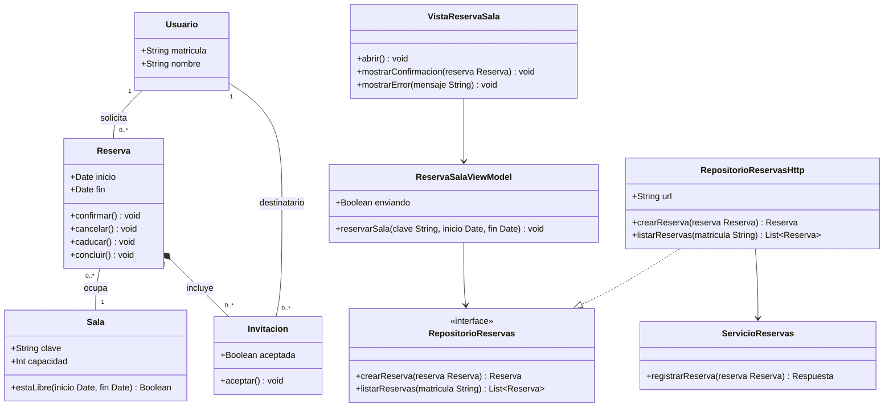
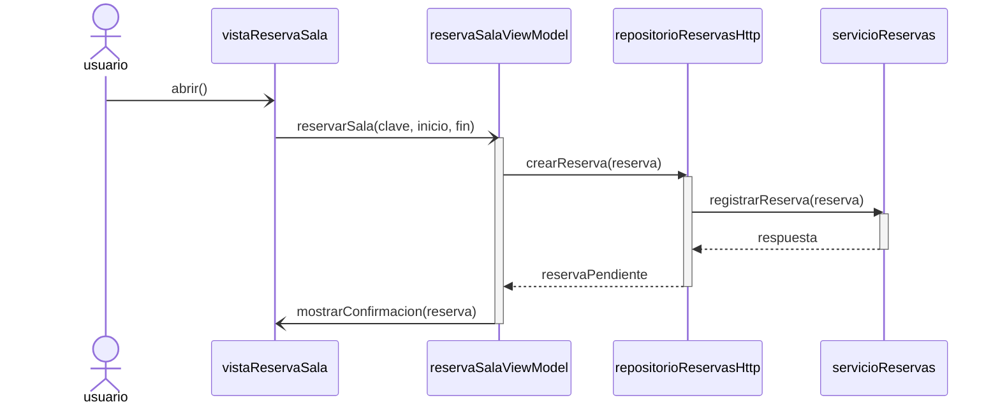
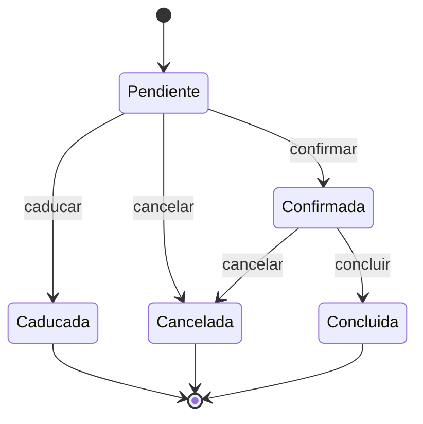

# Un caso completo: reserva de salas

La mayor parte del material sobre UML explica una notación por vez y con un ejemplo
distinto en cada capítulo. El resultado medido en trabajos de alumnos es conocido: los
diagramas se dibujan sin defectos de notación local y aun así describen sistemas que no
existen, porque cada vista fue escrita por separado y nadie las confrontó. Este documento
recorre el camino contrario. Presenta un único caso —la reserva de salas de estudio— en
las tres vistas que el módulo trabaja, y dedica su sección central a la correspondencia
entre ellas.

## El caso

Una universidad dispone de salas de estudio que se reservan desde una aplicación móvil. Un
usuario elige una sala y una franja horaria, indica el motivo de la reserva e invita a
otros usuarios. La aplicación envía la solicitud a un servicio remoto, que la registra y
devuelve la reserva creada; hasta que el servicio no responde, la reserva no existe.

Una reserva recién creada queda pendiente. El servicio la confirma cuando comprueba que la
sala sigue libre en esa franja; si nadie la confirma antes de que llegue la hora de inicio,
caduca. Tanto la reserva pendiente como la confirmada pueden cancelarse, y una reserva
confirmada concluye cuando termina su franja horaria.

Una invitación registra a qué usuario se invitó y si aceptó. Una invitación pertenece a la
reserva que la originó: no tiene sentido por separado y desaparece cuando la reserva
desaparece. El usuario invitado, en cambio, existe con independencia de cualquier reserva.

La pantalla que envía la solicitud sigue el patrón Modelo-Vista-ModeloDeVista: la vista no
conoce el origen de los datos, el modelo de vista coordina la operación, y el acceso al
servicio remoto queda detrás de un contrato que la capa de datos implementa.

## Vista estructural: el diagrama de clases

### Por qué `Reserva` compone a `Invitacion` y no la agrega

El criterio para elegir entre composición y agregación no es la intuición de pertenencia
—«la reserva tiene invitaciones»— sino el ciclo de vida: si la parte sobrevive al todo, es
agregación; si desaparece con él, es composición. Al eliminar una reserva, sus invitaciones
dejan de nombrar nada: no queda ninguna consulta que pueda responderse con ellas, ni ningún
otro objeto que las contenga. Por tanto no sobreviven, y corresponde el rombo relleno.

El rombo se dibuja del lado de `Reserva` porque `Reserva` es el todo. Es un error frecuente
colocarlo en el extremo de la parte, que invierte el significado de la relación.

### Por qué `Invitacion` existe como clase

Un usuario puede ser invitado a muchas reservas y una reserva puede invitar a muchos
usuarios. Modelar eso como una asociación de muchos a muchos entre `Usuario` y `Reserva`
sería cierto e inservible: no habría lugar donde anotar si el invitado aceptó. Toda relación
de muchos a muchos esconde un concepto del dominio que todavía no se ha nombrado, y aquí ese
concepto es la invitación. Al nombrarla, la relación queda resuelta en dos asociaciones —una
por cada extremo— y el atributo `aceptada` tiene dónde vivir.

### Por qué `Reserva` no es parte de `Sala`

`Reserva` se asocia a `Sala` con una línea simple y no con un rombo. Una reserva no es un
componente de la sala: la sala existe antes y después de cualquier reserva, y el sistema
puede eliminar una reserva sin afectar a la sala. Dibujar una composición entre ambas
implicaría además que la reserva tiene un único dueño, cuando el modelo la relaciona tanto
con la sala que ocupa como con el usuario que la solicitó.

### Por qué esas cardinalidades

- `Usuario "1" -- "0..*" Reserva`: cada reserva la solicita exactamente un usuario, que es
  su responsable; un usuario puede no haber solicitado ninguna.
- `Reserva "0..*" -- "1" Sala`: una reserva ocupa exactamente una sala. Una reserva sin sala
  no es una reserva, de ahí el `1` y no el `0..1`. Una sala puede no tener ninguna reserva.
- `Reserva "1" *-- "0..*" Invitacion`: una invitación pertenece a una sola reserva, y una
  reserva puede no invitar a nadie. Escribir `1..*` obligaría a invitar a alguien en toda
  reserva, que no es lo que el caso describe.
- `Invitacion "0..*" -- "1" Usuario`: cada invitación se dirige a un solo usuario.

### Por qué un contrato y una implementación

`RepositorioReservas` se declara como interfaz y `RepositorioReservasHttp` la implementa con
línea discontinua y triángulo hueco. La implementación no es herencia: la herencia, con línea
continua, significa «es un caso particular de», y aquí no hay ningún caso particular sino el
cumplimiento de un contrato. La distinción es la que permite sustituir la fuente de datos —un
servicio remoto hoy, una copia local en las pruebas— sin tocar el modelo de vista, porque este
depende del contrato y no de quien lo cumple.

`ServicioReservas` queda fuera de esa jerarquía: representa el punto de acceso remoto, del que
solo depende la implementación HTTP. La cadena `VistaReservaSala → ReservaSalaViewModel →
RepositorioReservas` describe una dependencia por capas en la que cada una conoce a la
siguiente y ninguna conoce a la anterior.

## Vista de interacción: el diagrama de secuencia

### Por qué las líneas de vida se llaman así

Los nombres van en minúscula inicial porque una línea de vida representa una instancia
concreta durante esta interacción, no a su clase: `reservaSalaViewModel` es el modelo de vista
que está atendiendo esta reserva, no la clase `ReservaSalaViewModel`. Es el defecto más
frecuente medido en diagramas de secuencia de alumnos, y la especificación de UML lo prohíbe
de forma explícita. Abreviaturas como `VM` o `R` fallan por el mismo motivo, con el agravante
de que no permiten rastrear la línea de vida hasta ninguna clase.

`usuario` se dibuja como actor y no como participante porque es externo al sistema: no es un
objeto del diseño y no se le puede invocar ninguna operación.

### Por qué unos mensajes son síncronos y otros asíncronos

La frontera está en si el emisor puede seguir trabajando mientras espera.

- `reservarSala` es **asíncrono**. Lo envía la vista, que corre en el hilo de la interfaz. Si
  fuera síncrono, la vista quedaría detenida hasta que el servicio remoto respondiera, y eso
  describe una pantalla congelada. El atributo `enviando` del modelo de vista existe
  precisamente para que la vista pueda mostrar el progreso mientras tanto.
- `crearReserva` y `registrarReserva` son **síncronos**. El modelo de vista no puede continuar
  sin la reserva creada, y el repositorio no puede traducir una respuesta que todavía no ha
  llegado. Cada uno lleva su retorno con flecha discontinua: sin él, el diagrama no dice cuándo
  el emisor recupera el control.
- `mostrarConfirmacion` es **asíncrono**. Es una notificación de la que el modelo de vista no
  espera respuesta; dibujarla como síncrona describiría un modelo de vista que se bloquea
  esperando a que la pantalla termine de pintar.

Los dos retornos se rotulan con el resultado que devuelven —`respuesta`, `reservaPendiente`—
y no con el nombre de la operación, porque no son mensajes nuevos sino la respuesta de uno
anterior.

### Por qué las activaciones se abren y se cierran donde lo hacen

La barra de activación marca el intervalo en que una instancia retiene el control. Se abre
cuando recibe el mensaje que la pone a trabajar y se cierra cuando devuelve el control al
emisor, de modo que las tres activaciones quedan anidadas: el modelo de vista sigue activo
mientras el repositorio trabaja, y el repositorio mientras el servicio responde. Una
activación abierta y no cerrada describiría un objeto que nunca termina lo que empezó.

### Por qué este diagrama no muestra la confirmación ni la cancelación

Un diagrama de secuencia documenta **un** escenario, no todos los posibles. Este describe la
creación de una reserva y termina cuando la pantalla muestra que la reserva quedó pendiente.
Lo que ocurre después —que alguien la confirme, la cancele o la deje caducar— pertenece a
otros escenarios y, sobre todo, al ciclo de vida del objeto, que es lo que describe la
siguiente vista.

## Vista de comportamiento: la máquina de estados

### Por qué estos nodos son estados y no actividades

Los cinco nodos nombran situaciones en las que la reserva **permanece esperando un evento**:
una reserva pendiente espera a que alguien la confirme, la cancele o a que llegue su hora de
inicio; una confirmada espera a que se cancele o a que termine su franja. Los nombres son
participios —`Pendiente`, `Confirmada`, `Cancelada`, `Caducada`, `Concluida`— y no verbos en
infinitivo, porque describen una situación y no una acción.

El contraste con lo que **no** se dibujó es lo que da el criterio. Un nodo `Reservando`,
colocado entre el inicio y `Pendiente` para representar el envío al servicio, no sería un
estado: se saldría de él sin que ocurriese nada, en cuanto terminase el envío. Un nodo del que
se sale sin esperar ningún evento es un paso de flujo, y ese paso pertenece a la acción de una
transición o a un diagrama de actividad. En este modelo, el envío al servicio es justo lo que
describe el diagrama de secuencia: no tiene por qué aparecer aquí.

### Por qué el arranque y el cierre se dibujan con `[*]`

`[*]` no es un estado sino un pseudoestado: marca dónde empieza y dónde termina la ejecución,
y no se permanece en él. La transición que sale del pseudoestado inicial no lleva disparador
porque no hay nada que esperar: la reserva nace pendiente en cuanto el servicio la registra.
Las tres transiciones hacia el pseudoestado final tampoco lo llevan, por un motivo distinto:
son transiciones de terminación, que se toman cuando el estado de origen ha completado su
actividad.

### Por qué la máquina es determinista y no deja ninguna situación atrapada

`Pendiente` tiene tres salidas y `Confirmada` dos, y en cada estado todos los disparadores son
distintos entre sí. Dos salidas del mismo estado rotuladas con el mismo evento y sin guardas
dejarían la máquina sin forma de decidir, y la especificación de UML considera mal formado ese
modelo. Los tres estados terminales —`Cancelada`, `Caducada`, `Concluida`— llevan al
pseudoestado final, de modo que desde cualquier situación existe un camino hasta el final y
ninguna queda atrapada.

## Cómo se corresponden las tres vistas

Esta es la parte del caso que no se aprende dibujando una vista por separado. Las tres
describen el mismo sistema, y esa afirmación es comprobable: cada mensaje del diagrama de
secuencia tiene que nombrar una operación declarada por la clase que lo recibe, y cada
disparador de la máquina de estados tiene que nombrar una operación del clasificador cuyo
ciclo de vida describe.

### Mensajes del diagrama de secuencia y operaciones del diagrama de clases

| Mensaje | Emisor → receptor | Operación que lo declara |
| --- | --- | --- |
| `abrir()` | `usuario` → `vistaReservaSala` | `VistaReservaSala::abrir() void` |
| `reservarSala(clave, inicio, fin)` | `vistaReservaSala` → `reservaSalaViewModel` | `ReservaSalaViewModel::reservarSala(clave String, inicio Date, fin Date) void` |
| `crearReserva(reserva)` | `reservaSalaViewModel` → `repositorioReservasHttp` | `RepositorioReservas::crearReserva(reserva Reserva) Reserva`, implementada por `RepositorioReservasHttp` |
| `registrarReserva(reserva)` | `repositorioReservasHttp` → `servicioReservas` | `ServicioReservas::registrarReserva(reserva Reserva) Respuesta` |
| `respuesta` | `servicioReservas` → `repositorioReservasHttp` | Retorno de `registrarReserva`; el texto nombra el resultado, no una operación |
| `reservaPendiente` | `repositorioReservasHttp` → `reservaSalaViewModel` | Retorno de `crearReserva`; el tipo devuelto es `Reserva` |
| `mostrarConfirmacion(reserva)` | `reservaSalaViewModel` → `vistaReservaSala` | `VistaReservaSala::mostrarConfirmacion(reserva Reserva) void` |

Cada línea de vida corresponde además a una clase del diagrama: `vistaReservaSala` a
`VistaReservaSala`, `reservaSalaViewModel` a `ReservaSalaViewModel`, `repositorioReservasHttp`
a `RepositorioReservasHttp` y `servicioReservas` a `ServicioReservas`. El actor `usuario` es la
excepción prevista: al ser externo al sistema, no se le invoca ninguna operación y no necesita
corresponder a ninguna clase.

El único mensaje que se dirige a una interfaz merece una nota. `crearReserva` sale hacia la
instancia concreta `repositorioReservasHttp`, y la operación que lo declara es la del contrato
`RepositorioReservas`. Esa es exactamente la ventaja del contrato: el emisor invoca la operación
declarada en la interfaz, y qué implementación la atiende es una decisión que el diagrama de
secuencia puede fijar sin que el modelo de vista se entere.

### Disparadores de la máquina de estados y operaciones de `Reserva`

| Transición | Disparador | Operación de `Reserva` |
| --- | --- | --- |
| `[*] → Pendiente` | (ninguno) | Sale del pseudoestado inicial: no requiere evento |
| `Pendiente → Confirmada` | `confirmar` | `+confirmar() void` |
| `Pendiente → Cancelada` | `cancelar` | `+cancelar() void` |
| `Pendiente → Caducada` | `caducar` | `+caducar() void` |
| `Confirmada → Cancelada` | `cancelar` | `+cancelar() void` |
| `Confirmada → Concluida` | `concluir` | `+concluir() void` |
| `Cancelada → [*]`, `Caducada → [*]`, `Concluida → [*]` | (ninguno) | Transiciones de terminación |

Las cuatro operaciones de `Reserva` existen en el diagrama de clases porque la máquina de
estados las necesita como disparadores, y la máquina de estados solo puede
usar esos cuatro nombres porque son los que la clase declara. La dependencia es mutua, y es lo
que hace que la documentación describa un sistema implementable: quien programe `Reserva`
escribirá cuatro métodos, y quien lea la máquina sabrá desde qué situación tiene sentido llamar
a cada uno.

### Dónde se tocan la interacción y el ciclo de vida

El diagrama de secuencia termina donde la máquina de estados empieza. `crearReserva` devuelve
una reserva que el retorno nombra `reservaPendiente`, y ese nombre no es casual: la reserva
recién creada está en el estado `Pendiente`, que es el primero de la máquina. La confirmación
posterior, la cancelación y la caducidad no aparecen en el diagrama de secuencia porque
corresponden a otros escenarios; la máquina de estados es la vista que los reúne todos y dice
cuáles son posibles desde cada situación.

La relación entre las tres vistas se resume así: el diagrama de clases declara el vocabulario,
el de secuencia usa ese vocabulario para describir un escenario, y la máquina de estados usa el
mismo vocabulario para describir todos los escenarios posibles de un objeto.

## Errores que se evitaron al modelar el caso

Los defectos siguientes no son hipotéticos: son los que aparecen medidos con más frecuencia en
trabajos de alumnos. En cada uno se indica qué se decidió y qué habría descrito la alternativa.

**Agregación en lugar de composición entre `Reserva` e `Invitacion`.** El rombo hueco significa
que la parte sobrevive al todo. Con él, el modelo afirmaría que las invitaciones siguen
existiendo tras eliminar la reserva, y quien lo implementase tendría que decidir dónde viven
esas invitaciones huérfanas y qué consulta las devuelve. No hay respuesta, porque el caso no la
tiene: la relación es de composición.

**Relación de muchos a muchos entre `Usuario` y `Reserva` sin resolver.** Con una asociación
`0..* -- 0..*` el modelo sería cierto y no habría dónde anotar si el invitado aceptó. El defecto
se manifiesta al llevar el modelo a una base de datos, donde esa relación no se puede
representar sin una tabla intermedia: la clase `Invitacion` es esa tabla, decidida en la fase de
diseño en vez de improvisada en la de implementación.

**Composición entre `Sala` y `Reserva`.** Habría convertido las reservas en partes de la sala,
con dos consecuencias: eliminar una sala eliminaría su historial de reservas, y la reserva
tendría un único dueño estructural pese a estar relacionada también con el usuario que la
solicitó.

**Herencia en lugar de implementación entre `RepositorioReservasHttp` y `RepositorioReservas`.**
La línea continua con triángulo declara que la clase es un caso particular de otra. Aplicada a
una interfaz, describe una jerarquía de tipos donde solo hay un contrato cumplido, y borra la
distinción que sostiene la sustitución de la fuente de datos.

**Todos los mensajes dibujados como síncronos.** Es lo que ocurre cuando se usa `->>` por
inercia, porque es la flecha de los tutoriales. El diagrama describiría entonces una interfaz
que se detiene en cada llamada al servicio remoto: exactamente la pantalla congelada que el
patrón Modelo-Vista-ModeloDeVista existe para evitar.

**Llamadas síncronas sin retorno.** Un mensaje síncrono detiene al emisor hasta la respuesta.
Sin la flecha discontinua de vuelta, el diagrama no dice cuándo el modelo de vista recupera el
control, y la lectura queda incompleta justo en el punto que interesa: cuánto tiempo permanece
bloqueado cada participante.

**Mensajes con nombres inventados.** Escribir `guardar()` donde el contrato declara
`crearReserva` produce un diagrama que no se puede implementar tal como está dibujado. Es el
error de trazabilidad dominante y solo se ve al leer las dos vistas juntas; ninguna de las dos
tiene nada de raro por separado.

**Líneas de vida abreviadas.** Una columna rotulada `VM` no identifica ninguna instancia ni
permite rastrearla hasta una clase, y convierte la comprobación de coherencia entre vistas en
algo imposible de hacer.

**Un estado `Reservando`.** Habría sido una actividad disfrazada de estado: se saldría de él sin
esperar ningún evento, en cuanto el envío terminase. Ese paso ya está descrito en el diagrama de
secuencia, que es donde corresponde.

**Un disparador `usuarioPulsaBoton`.** Describe un gesto de la interfaz, no una operación del
modelo. Ningún objeto del diseño sabría recibirlo, y la máquina de estados dejaría de ser
trazable hasta la clase `Reserva`.

**`Caducada` sin salida.** Dejar el estado sin transición hacia el pseudoestado final habría
creado un callejón: la ejecución entra y no puede terminar. En el código correspondiente, ese
defecto se manifiesta como una reserva que permanece indefinidamente en un estado del que
ninguna operación la saca.

**Dos salidas de `Pendiente` con el mismo disparador.** Rotular la confirmación y la caducidad
con un mismo evento —`resuelve`, por ejemplo— dejaría la máquina sin forma de decidir cuál de
las dos transiciones tomar. Los disparadores distintos, o las guardas excluyentes, son lo que
mantiene el modelo bien formado.
