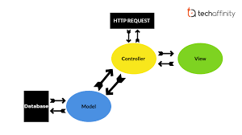
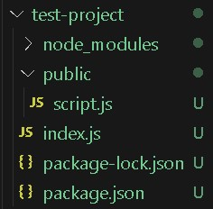
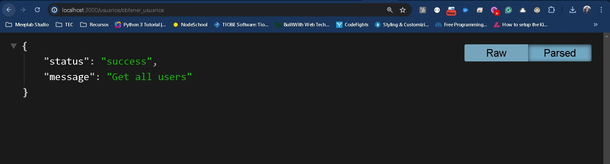
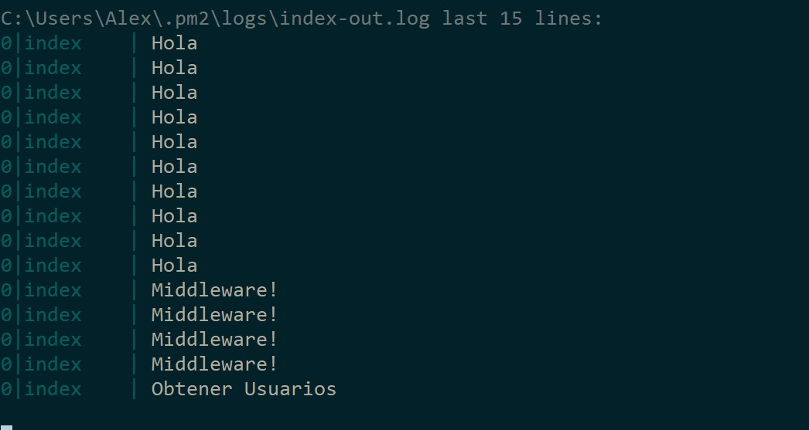
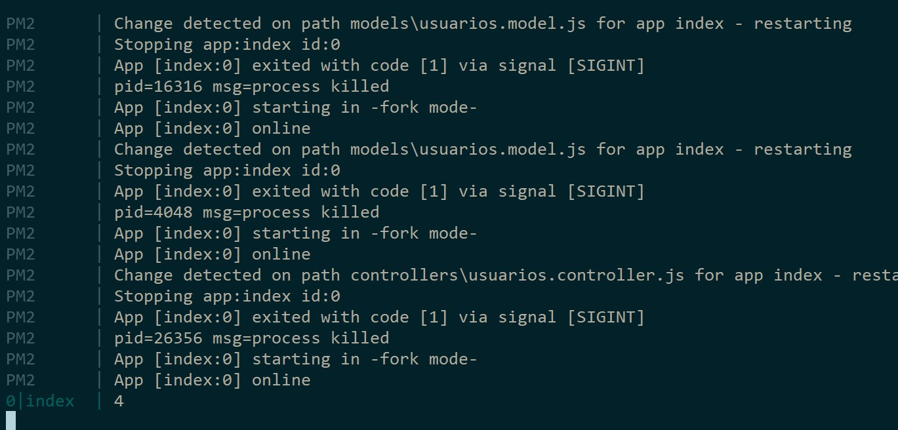
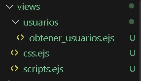
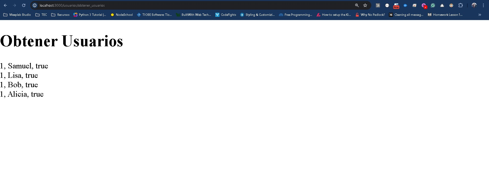

# MVC

## MVC (Modelo Vista Controlador)

Con lo que hemos trabajado en nuestro servidor hasta el momento, hemos cargado rutas, hemos trabajado con HTML dinámico y ya podemos crear sitios web, pero nos faltan 2 puntos elementales, conectar datos e información y procesarlas para cargarlo en nuestro HTML.

Con lo que hemos visto hasta ahora en el HTML dinámico, podemos definir lo que llamamos como UI en vistas que es toda la interfaz de HTML, CSS y JS para poder verlo en el navegador.

También hemos experimentado un poco en las rutas cuando no regresamos directamente un HTML y regresamos por ejemplo un JSON de información.

Igualmente ya vimos que dentro de EJS, aunque cargamos el EJS como HTML, podemos pasar un JSON para agregar información desde nuestra ruta.

El punto que empezaremos a ver ahora es uno de los más importantes desde el punto de ingeniería de software, la arquitectura del proyecto.

Cuando hablamos de la arquitectura nos estamos refiriendo a la forma en la que las carpetas del proyecto están estructuradas.

Como ya habrás notado un proyecto grande de desarrollo, incluye archivos HTML, CSS, JS para el cliente, archivos js de back-end, de front-end y sobre ellos viene la lógica de crear módulos en nuestra aplicación según las funciones que tiene.

Cuando ya tenemos una gran cantidad de archivos, esto se vuelve complicado si no planificamos como estructurar nuestros archivos, y es por ello que viene la primer aproximación en una de las arquitecturas más comunes utilizadas en desarrollo web.

Hasta ahora cuando hablábamos de arquitectura nos referíamos a cliente-servidor. Pero esta arquitecturas nos habla de como se establece el protocolo de comunicación del sistema.

Ahora la arquitectura de software como ya mencioné habla de la estructura de carpetas del proyecto, si bien existen una gran cantidad de arquitecturas, todas con un propósitos específico, en desarrollo de back-end la más común y simple es MVC o mejor conocida como Modelo-Vista-Controlador.



Un diagrama que explica de manera sencilla como funciona la arquitectura es el siguiente:

Tendremos una petición HTTP, hasta ahora la hemos resuelto directamente en una función de Javascript, pero dentro del servidor lo ideal es separar según la fuente, esto hace más legible el código, estructura mejor la carpeta de archivos y permite probar lo que estamos haciendo.

Al llegar el request HTTP, llegamos a la ruta o lo que ahora conoceremos como el **controlador**, dentro de este lo más común será tener que llamar a algún elemento de información, normalmente una base de datos, lo que sucede en la arquitectura es pasar esta responsabilidad a otro archivo el cual llamaremos el **modelo** que su única función es obtener y manejar la información, por último se regresará al **controlador** y este hará el pre renderizado del HTML con EJS como en nuestro caso y devolverá la petición al cliente habiendo cargado en el código HTML la información que se ocupa de la base de datos.

Todo este camino se realizará para cada ruta de cada función de cada módulo del sistema, hacerlo de manera efectiva nos ayudará a que existan partes del código replicadas y simplificará la llamada de funciones, ya que no necesitamos crear un query a la base de datos para obtener lo usuarios en cada ruta, sino que esto lo delegaremos a un modelo que hará esta llamada y se insertará cada vez que lo utilicemos en un controlador.

Algo adicional que podemos o no añadir en NodeJS y Express, es un archivo de rutas, esto hace más fácil ver que rutas hay disponibles en nuestro proyecto.

Veamos un ejemplo sencillo abarcando toda la arquitectura.

## Rutas y Controladores

Vamos a crear un nuevo proyecto base con **npm init**, aquí vamos a agregar express, body-parser y ejs. También vamos a configurar la carpeta pública como ya hicimos en el laboratorio anterior. Por facilidad en la carpeta pública añadiremos un archivo script.js con un alert como en el laboratorio anterior.

El contenido de **index.js** quedaría como el siguiente:

```
const http    = require('http');
const express = require('express');
const path    = require('path');
const fs      = require('fs');
const app     = express();

app.set('view engine', 'ejs');
app.set('views', 'views');

const bodyParser = require('body-parser');
app.use(bodyParser.urlencoded({extended: false}));
app.use(express.static(path.join(__dirname, 'public')));

app.get('/', (request, response, next) => {
    response.setHeader('Content-Type', 'text/plain');
    response.send("Hola Mundo");
    response.end(); 
});

const server = http.createServer( (request, response) => {    
    console.log(request.url);
});
app.listen(3000);
```

Al correr el proyecto con pm2 no olvides que el comando es:

```
pm2 start index.js --watch
```

Ahora vamos a configurar un módulo con una ruta como hicimos en laboratorios anteriores.




Crearemos la carpeta **routes** y añadiremos un archivo **usuarios.routes.js**.

Ahora dentro de **index.js** añadiremos la ruta creada como si fuera un módulo de usuarios.

```
const rutasUsuarios = require('./routes/usuarios.routes');
app.use('/usuarios', rutasUsuarios);
```

El código de **index.js** quedaría de la siguiente forma:

```
const http    = require('http');
const express = require('express');
const path    = require('path');
const fs      = require('fs');
const app     = express();

app.set('view engine', 'ejs');
app.set('views', 'views');

const bodyParser = require('body-parser');
app.use(bodyParser.urlencoded({extended: false}));
app.use(express.static(path.join(__dirname, 'public')));

app.get('/', (request, response, next) => {
    response.setHeader('Content-Type', 'text/plain');
    response.send("Hola Mundo");
    response.end(); 
});

const rutasUsuarios = require('./routes/usuarios.routes');
app.use('/usuarios', rutasUsuarios);

const server = http.createServer( (request, response) => {    
    console.log(request.url);
});
app.listen(3000);
```

Si guardas el archivo **index.js** verás muchos errores y es por que aunque ya existe **usuarios.routes.js** aún no estamos soportando express para poderlo llamar. Para ello agrega lo siguiente en **usuarios.routes.js**:

```
const express = require('express');
const path    = require('path');
const fs      = require('fs');
const router = express.Router();

router.get('/obtener_usuarios', ()=>{});

module.exports = router;
```

Aquí estaremos sirviendo una ruta **/obtener_usuarios** que de momento solo incluye una función flecha vacía.

En laboratorios anteriores servimos la ruta desde aquí, pero ahora vamos a incorporar el controlador, para ello vamos a crear una carpeta llamada **controllers**, y a esta vamos a añadirle un archivo **usuarios.controller.js**.

Dentro de **usuarios.routes.js** vamos a añadir el controlador debajo de la definición de route:

```
const controller = require("../controllers/usuarios.controller.js")
```

Ahora vamos a sustituir la función flecha vacía que teníamos en la ruta **/obtener_usuarios** y vamos a llamar a una función dentro de nuestro controller.

```
router.get('/obtener_usuarios', controller.index);
```

Por último en **usuarios.controller.js** vamos colocar lo siguiente:

```
module.exports.index = async(req,res) =>{
    res.status(200).send({status:"success",message:"Get all users"})
}
```

Aquí definimos la función **index** y de momento solo regresamos un json de respuesta.

Es importante que entiendas todo el camino hasta el momento pues ello es la base para lo que viene.

Si entras a la url en el navegador

```
http://localhost:3000/usuarios/obtener_usuarios
```

El resultado será el siguiente:



Pero internamente lo que sucede es lo siguiente:

1. Llega un request a index.js a la url /usuarios /obtener_usuarios
2. Index.js encuentra /usuarios definido por lo que lo pasa al archivo **usuarios.routes.js**.
3. Usuarios detecta la url /obtener_usuarios y detecta que se llama de una función index en **usuarios.controller.js**.
4. Desde usuarios.controller.js se llama y ejecuta la respuesta del request.

Con lo anterior a nivel arquitectura hemos segmentado en carpetas nuestras rutas y controladores, por lo que ahora en rutas vamos a tener una lista de urls con funciones que se llaman del controlador.

El controlador es el encargado de hacer el renderizado y servir de **cerebro** para la función solicitada. Aquí lo que nos falta es conectar con un modelo y cargar el EJS de la vista para completar la arquitectura.

## Modelos

Como ya mencionamos anteriormente, los modelos son la parte de conexión con los datos de información. No confundir con que es un medio exclusivo para conectar con la base de datos, ya que dentro de un sistema podemos tener diferentes fuentes de información como: archivos, fuentes de datos, conexiones con otros sistemas y sí las bases de datos.

Los modelos son parte de nuestra arquitectura por lo que es necesario definirlos en una carpeta **models** de nuestra aplicación. Para ello vamos a crear la carpeta y dentro un archivo que llamaremos usuarios.model.js.

Al igual que la ruta al controlador, es necesario conectar el controlador al modelo. Por lo que en el controlador **usuarios.controller.js** debemos añadir al inicio del archivo lo siguiente:

```
const model = require("../models/usuarios.model.js")
```

Ahora para el contenido de **usuarios.model.js** tendremos lo siguiente:

```
exports.ObtenerUsuarios = function(correo,contrasena){
    console.log("Obtener Usuarios");
}
```

Aquí estamos creando una función ObtenerUsuarios, que conectaría con nuestra fuente de información y regresaría los datos.

Por último dentro de **usuarios.controller.js** en la función index vamos a llamar al modelo de la siguiente manera:

```
const model = require("../models/usuarios.model.js")

module.exports.index = async(req,res) =>{
    model.ObtenerUsuarios()
    res.status(200).send({status:"success",message:"Get all users"})
}
```

Si entramos a la url

```
http://localhost:3000/usuarios/obtener_usuarios
```

Vamos a nuestra terminal y observamos que el log se realiza correctamente:



Ahora, dependerá de nuestro motor de base de datos o fuente de información, pero las buenas prácticas nos piden crear objetos para almacenar la información de nuestros modelos. Es decir crear objetos aunque sea en formato JSON que guarden la estructura de nuestros datos para poderlo manipular.

Idealmente estos se separan en archivos adicionales, pero por facilidad vamos a declararlos en el mismo archivo de modelo simulando una llamada a una fuente de datos.

```
exports.ObtenerUsuarios = function(correo,contrasena){
    let usuarios = [];

    usuarios.push({
        nombre:"Samuel",
        id:1,
        activo:true
    });
    usuarios.push({
        nombre:"Lisa",
        id:1,
        activo:true
    });
    usuarios.push({
        nombre:"Bob",
        id:1,
        activo:true
    });
    usuarios.push({
        nombre:"Alicia",
        id:1,
        activo:true
    });

    return usuarios;
}
```

Ahora si regresamos al controlador e imprimimos el valor de length de los usuarios regresados:
```
const model = require("../models/usuarios.model.js")

module.exports.index = async(req,res) =>{
    const usuarios = model.ObtenerUsuarios()
    console.log(usuarios.length)
    res.status(200).send({status:"success",message:"Get all users"})
}
```

Nuestro resultado será:



Listo, hemos conectado un modelo dentro de nuestra arquitectura, ahora solo falta la vista.

## Vistas

Como vimos en el laboratorio anterior, debemos hacer uso de un HTML dinámico para definir nuestra vista y cargar los datos de nuestro modelo y controlador.

Dentro de nuestro archivo **index.js** hemos definido el uso de ejs, pero en la estructura del proyecto no hemos agregado la carpeta. Por lo que vamos a crear **views** y dentro de la misma una carpeta que se llame **usuarios** para que desde adentro tengamos un archivo **obtener_usuarios.ejs**.,

```
<!DOCTYPE HTML>
<html>
<head>
  <%- include('./../css.ejs') %>
</head>
<body>
  <h1>Obtener Usuarios</h1>
</body>
<%- include('./../scripts.ejs') %>
</html>
```

También vamos a crear los archivos css y scripts, pero estos los colocaremos fuera de la carpeta de usuarios. De momento no añadiremos nada a estos archivos pero esta es una estructura que te recomiendo para que todo tu módulo de usuarios contenga al menos los mismos css y scripts del proyecto.

El resultado de la estructura se vería de la siguiente manera:



Si vamos a nuestro archivo **usuarios.controller.js** vamos a renderizar nuestra vista sustituyendo el send que teníamos por lo siguiente:

const model = require("../models/usuarios.model.js")

```
module.exports.index = async(req,res) =>{
    const usuarios = model.ObtenerUsuarios()
    console.log(usuarios.length)
    //res.status(200).send({status:"success",message:"Get all users"})
    res.render("./usuarios/obtener_usuarios")
}
```

Observa como a diferencia del laboratorio anterior, usamos la estructura de archivos para cargar nuestra carpeta de usuarios y luego nuestro ejs para modularizar nuestra funcionalidad.

Por último vamos a cargar nuestros usuarios en una etiqueta **ul**, primero vamos a pasarlos desde el resultado de nuestro modelo a la vista usando el parámetro de json que recibe el método render.

```
const model = require("../models/usuarios.model.js")

module.exports.index = async(req,res) =>{
    const usuarios = model.ObtenerUsuarios()
    console.log(usuarios.length)
    //res.status(200).send({status:"success",message:"Get all users"})
    res.render("./usuarios/obtener_usuarios",{
        usuarios: usuarios
    })
}
```

Y dentro de nuestro ejs vamos a cargar el código de la siguiente manera:

```
<!DOCTYPE HTML>
<html>
<head>
  <%- include('./../css.ejs') %>
</head>
<body>
  <h1>Obtener Usuarios</h1>
  <ul>
    <% for(var i = 0; i < usuarios.length; i++){  %>
      <li>
        <%= usuarios[i].id %>, 
        <%= usuarios[i].nombre %>, 
        <%= usuarios[i].activo %>
      </li>
    <% } %>
  </ul>
</body>
<%- include('./../scripts.ejs') %>
</html>
```

Aquí haremos uso de la estructura que definimos en nuestro modelo. Y la cargaremos dentro de nuestro código.

El resultado final en el navegador lo veremos de la siguiente manera:



Y con esto hemos conectado la arquitectura completa de nuestro proyecto, tenemos el modelo para cargar información, el controlador para manipular la transacción y la vista para visualizarlo, además de la ruta para ver el tipo de url que estamos llamando.

Entiendo que de inicio parecen muchos archivos, pero esta buena práctica hará que tu código sea más simple en proyectos grandes pues la misma forma de repetir las cosas una y otra vez hace que el código sea lo más igual posible.

<a href="/docs/node/tutorials/intro_web/LAB13MVC/test-project.zip" download="lab13-mvc.zip">Ver ejemplo completo</a>