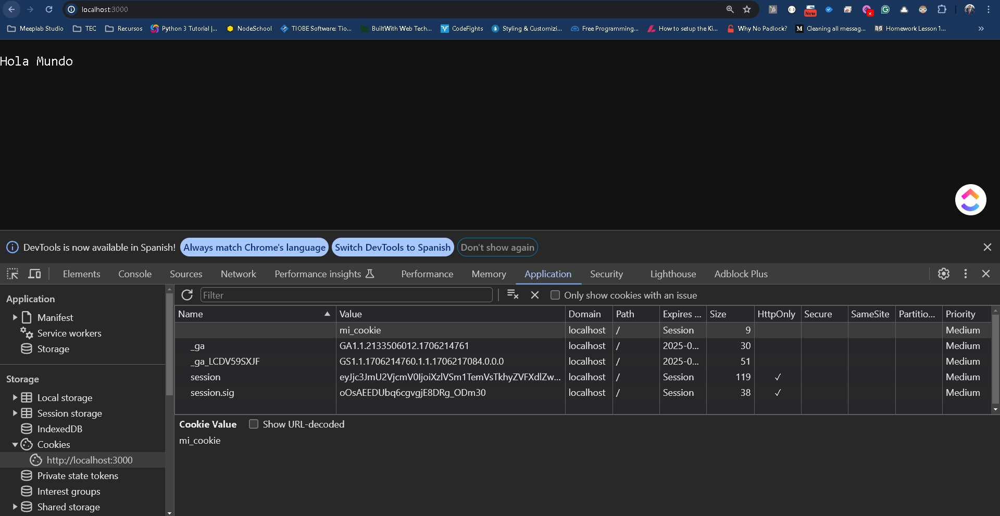
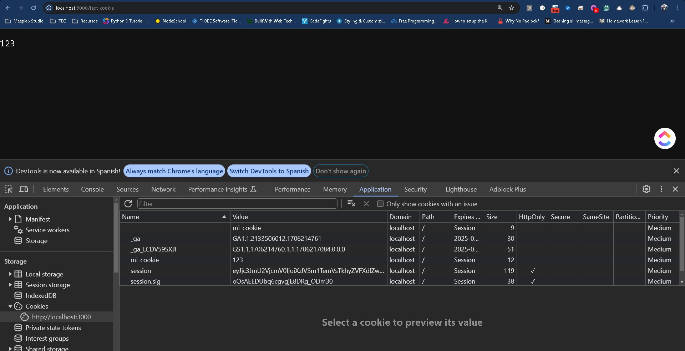
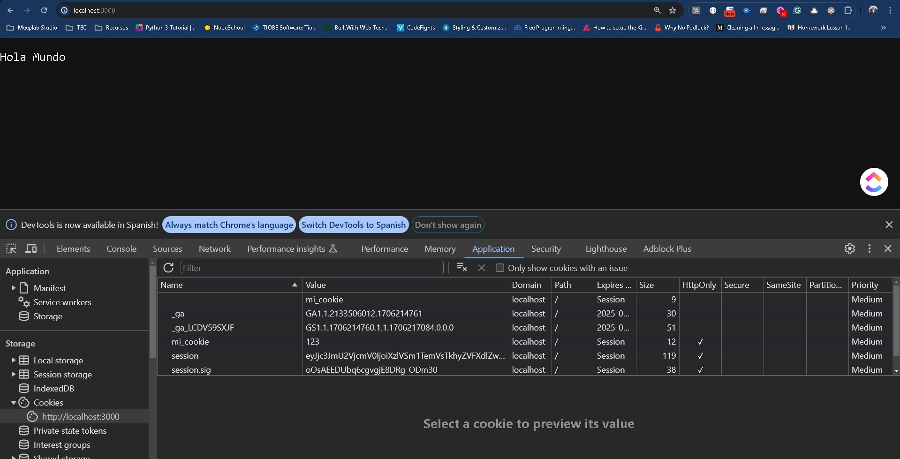

# Sesiones

## Cookies

Dentro del mundo del desarrollo web, seguramente has de haber escuchado el concepto de cookie. Hoy en día, las cookies son muy importantes ya que dentro de la mayoría de los sitios web tenemos modales que nos preguntan si las aceptamos o no.

Las cookies tienen muchas funciones, pero entre las más importantes es mantener nuestras sesiones en el navegador. Sin ellas, es lo mismo que cuando apagamos el javascript dentro del navegador. Esto aunque protegería nuestra privacidad en internet, nos limitaría en la cantidad de cosas que podemos definir para un proyecto.

De manera simple, las cookies son archivos de texto con pequeños datos, que se utilizan para identificar un ordenador cuando estás en internet.

Los datos generados dependen del sitio web, pero por lo general van acompañados con un ID exclusivo y la información específica que representan.

Debido a las leyes internacionales, como el Reglamento General de Protección de Datos (RGPD) de la UE, y a ciertas leyes estatales, como la Ley de Privacidad del Consumidor de California (CCPA), muchos sitios web ahora deben solicitar permiso para usar ciertas cookies con tu navegador y proporcionar información acerca de cómo se utilizarán las cookies si aceptas.

### Cookies mágicas y cookies HTTP
En general, todas las cookies funcionan de la misma manera, pero se han aplicado a diferentes casos de uso:

Cookies mágicas es una vieja expresión informática que se refiere a paquetes de información que se envían y reciben sin cambios en los datos. Estas se utilizarían normalmente para iniciar sesión en sistemas informáticos de bases de datos, como la red interna de una empresa. Este concepto es anterior al de "cookie" que usamos hoy.

Las cookies HTTP son una versión reutilizada de la "cookie mágica" creada para la navegación por Internet actual. En 1994, Lou Montulli, programador de navegadores web, se inspiró en la "cookie mágica" para crear la cookie HTTP, mientras ayudaba a una tienda de compras en línea a arreglar sus servidores sobrecargados. La cookie HTTP es lo que actualmente denominamos cookie de forma más general. También es lo que algunos ciber delincuentes pueden utilizar para espiar tu actividad en línea y piratear información personal.

Dentro de Node y express podemos hace uso de las cookies para mantener y revisar una sesión de usuario.

Para comenzar vamos a definir un nuevo proyecto como siempre lo hacemos, definiendo el **npm init** instalando express, el body-parser y el ejs por el momento. También crearemos un archivo index.js con la configuración básica de nuestro servidor.

```
const http    = require('http');
const express = require('express');
const path    = require('path');
const fs      = require('fs');
const app     = express();

app.set('view engine', 'ejs');
app.set('views', 'views');

const bodyParser = require('body-parser');
app.use(bodyParser.urlencoded({extended: false}));
app.use(express.static(path.join(__dirname, 'public')));

app.get('/', (request, response, next) => {
    response.setHeader('Content-Type', 'text/plain');
    response.send("Hola Mundo");
    response.end(); 
});

const server = http.createServer( (request, response) => {    
    console.log(request.url);
});
app.listen(3000);
```

No olvides iniciar tu servidor con:

```
pm2 start index.js --watch
```

Ahora vamos a empezar definiendo una cookie. Dentro de nuestra ruta **/** agregaremos otro header de la siguiente manera:

```
app.get('/', (request, response, next) => {
    response.setHeader('Content-Type', 'text/plain');
    response.setHeader('Set-Cookie', 'mi_cookie');
    response.send("Hola Mundo");
    response.end(); 
});
```

La línea que queremos resaltar es la siguiente:

```
response.setHeader('Set-Cookie', 'mi_cookie');
```

Aquí estamos definiendo una cookie muy sencilla que al momento de llamarse **/** se creará y almacenará en nuestro navegador.

Para verla desde el navegador nos iremos a inspeccionar elemento y haremos uso de una nueva opción del navegador, la de **Aplicación**



Aquí vamos a tener la opción de las cookies de nuestro sitio y adentro, la lista completa de cookies generadas ya sea de forma manual o automática por el mismo. Nota como nuestra cookie que acabamos de crear se encuentra disponible.

Ahora tenemos la capacidad de crear cookies, pero nuestro servidor aún no es capaz de recuperarlas, para ello debemos hacer uso de una nueva librería **cookie-parser**, por lo que vamos a ejecutar el siguiente comando:

```
npm i cookie-parser
```

Como siempre debemos configurar la librería para nuestro uso en express

```
const cookieParser = require('cookie-parser');
app.use(cookieParser());
```

Quedando el archivo index.js de la siguiente manera:

```
const http    = require('http');
const express = require('express');
const path    = require('path');
const fs      = require('fs');
const app     = express();

app.set('view engine', 'ejs');
app.set('views', 'views');

const bodyParser = require('body-parser');
app.use(bodyParser.urlencoded({extended: false}));
app.use(express.static(path.join(__dirname, 'public')));

const cookieParser = require('cookie-parser');
app.use(cookieParser());

app.get('/', (request, response, next) => {
    response.setHeader('Content-Type', 'text/plain');
    response.setHeader('Set-Cookie', 'mi_cookie');
    response.send("Hola Mundo");
    response.end(); 
});

const server = http.createServer( (request, response) => {    
    console.log(request.url);
});
app.listen(3000);
```

La cookie que creamos es muy simple, no tiene un valor asignado, para ello vamos a actualizarla con lo siguiente:

```
response.setHeader('Set-Cookie', 'mi_cookie=123');
```

Si volvemos a revisar en el navegador veremos que tenemos la cookie repetida pero ahora tendremos la que contiene un valor.


Aquí es donde debemos tener cuidado sobretodo al estar probando ya que podemos duplicar nuestras cookies y tener conflictos de sesiones simplemente por no limpiarlas. De momento el cambio no debería afectarnos.

Ahora vamos a crear una nueva url que se llame **/test_cookie** y vamos que contenga lo siguiente:

```
app.get('/test_cookie', (request, response, next) => {
    response.setHeader('Content-Type', 'text/plain');
    response.send(request.cookies.mi_cookie);
    response.end(); 
});
```

El resultado será que veremos el valor de nuestra cookie en el navegador.



Ahora nuevamente actualizaremos nuestra cookie con lo siguiente:

```
response.setHeader('Set-Cookie', 'mi_cookie=123; HttpOnly');
```

La diferencia será que ahora se marca la casilla de HTTPOnly:



El atributo HttpOnly se añade a las cookies de seguridad (cookies LTPA y WASReqURL) que ha creado el servidor. 

El atributo HttpOnly es un atributo de navegador creado para impedir que las aplicaciones del lado del cliente accedan a cookies para evitar algunas vulnerabilidades de scripts entre sitios. Este atributo se puede configurar ahora en la consola administrativa.

De manera simple esto bloquea que archivos de javascript del lado del cliente puedan acceder a los valores de la cookie por seguridad. Imagina que tienes información importante de un usuario, sin esta propiedad la cookie sería accesible desde cualquier script, por tanto un virus en el navegador dejaría la información accesible para los atacantes.

## Express session

Ya hemos manejado lo básico de cookies dentro de nuestro servidor y del lado del cliente, ahora vamos con algo un poco más elaborado que es el manejo de la sesión de usuario.

Para ello usaremos otra librería llamada **express-session**, para ello ejecuta:

```
npm i express-session
```

Y como siempre vamos a iniciar su valor en el archivo **index.js**

```
const session = require('express-session');
app.use(session({
  secret: 'mi string secreto que debe ser un string aleatorio muy largo, no como éste', 
  resave: false, //La sesión no se guardará en cada petición, sino sólo se guardará si algo cambió 
  saveUninitialized: false, //Asegura que no se guarde una sesión para una petición que no lo necesita
}));
```

Nuestro código completo del **index.js** debe verse de la siguiente manera:

```
const http    = require('http');
const express = require('express');
const path    = require('path');
const fs      = require('fs');
const app     = express();

const session = require('express-session');
app.use(session({
  secret: 'mi string secreto que debe ser un string aleatorio muy largo, no como éste', 
  resave: false, //La sesión no se guardará en cada petición, sino sólo se guardará si algo cambió 
  saveUninitialized: false, //Asegura que no se guarde una sesión para una petición que no lo necesita
}));

app.set('view engine', 'ejs');
app.set('views', 'views');

const bodyParser = require('body-parser');
app.use(bodyParser.urlencoded({extended: false}));
app.use(express.static(path.join(__dirname, 'public')));

const cookieParser = require('cookie-parser');
app.use(cookieParser());

app.get('/', (request, response, next) => {
    response.setHeader('Content-Type', 'text/plain');
    response.setHeader('Set-Cookie', 'mi_cookie=123; HttpOnly');
    response.send("Hola Mundo");
    response.end(); 
});

app.get('/test_cookie', (request, response, next) => {
    response.setHeader('Content-Type', 'text/plain');
    response.send(request.cookies.mi_cookie);
    response.end(); 
});

const server = http.createServer( (request, response) => {    
    console.log(request.url);
});
app.listen(3000);
```

Con lo anterior no estamos creando una cookie, sino que estamos creando una sesión que es almacenada entre nuestro navegador y el servidor. Esto ya que si tratamos de buscar la cookie en el navegador veremos que no aparece.

Aquí la ventaja del servidor es que de manera automática, este establece la forma de conexión entre los datos permitiéndonos guardar datos dentro de la sesión, puedes verlo como una cookie que vive del lado del servidor.

Ahora bien, al igual que las cookies la recomendación es guardar poca información ya sea por facilidad del servidor y para evitar comprometer información importante del mismo.

Más adelante en otros laboratorios veremos de que manera podemos hacer uso más especializado de la sesión, por ahora quédate en la forma de poder crear los datos, modificarlos y eliminarlos.

Por lo mismo vamos a añadir 3 nuevas rutas a nuestro navegador:

```
app.get('/test_session', (request, response, next) => {
    request.session.mi_variable = "valor"
    response.setHeader('Content-Type', 'text/plain');
    response.send(request.session.mi_variable);
    response.end(); 
});

app.get('/test_session_variable', (request, response, next) => {
    response.setHeader('Content-Type', 'text/plain');
    response.send(request.session.mi_variable);
    response.end(); 
});

app.get('/logout', (request, response, next) => {
    request.session.destroy(() => {
        response.redirect('/'); //Este código se ejecuta cuando la sesión se elimina.
    });
});
```

La primera ruta **test_session** añadirá un valor en forma de variable a nuestra sesión, el cual podremos acceder de manera inmediata.

La segunda ruta **test_session_variable** nos permite acceder a esa nueva variable de la sesión, en cualquier momento, pero siempre y cuando hayamos creado primero el valor y el servidor no se haya reiniciado.

La última ruta **logout** es la forma en la que destruimos la sesión y vaciamos la información que se encuentra almacenada hasta ese momento.

Como ves es muy sencillo el uso y manejo, sin embargo verifica y establece bien los momentos de creación, actualización y eliminación ya que es muy común perder una sesión por no fijarse el ciclo que puede seguir un usuario y se llega a caminos sin salida donde se borró la sesión pero aún se necesitaba la información.

<a href="/docs/node/tutorials/intro_web/LAB14Sesiones/test-project.zip" download="lab14-sesiones.zip">Ver ejemplo completo</a>
