# Rutas y Formas

## Rutas

En el laboratorio de introducción al back-end, comenzamos a trabajar con crear un servidor y empezar a servir respuestas desde el mismo. En la última parte incluso pudimos enviar código HTML y conectar parte de lo que hemos trabajado con front-end hasta el momento.

Como te había mencionado hasta este punto si bien ya pudiéramos crear un proyecto complejo, aún nos faltan ver algunas cosas que harán nuestra vida más fácil.

Ahora que vamos a empezar este camino de optimización, el primer paso es empezar a manejar las rutas del proyecto, si bien esto vamos a irlo mejorando con cada laboratorio que avancemos es momento de empezar a entender como funcionan las URL en un proyecto de desarrollo web.

Como ya sabes existen varios métodos de conexión o de peticiones que podemos hacer al servidor, FETCH, GET, POST, PUT y DELETE entre los más conocidos.

Este tipo de conexión se hace desde el servidor y somos nosotros los que decidimos de que manera regresar información. Por ejemplo, el espacio en los navegadores web para escribir una dirección o URL, lo que reciben hacen es mandar una petición GET y lo más normal es que estas peticiones nos vuelvan el código HTML ya que si son las que colocamos en la url del navegador son la primera respuesta de acción que veremos.

Después de esto veremos de manera muy breve el concepto de las REST API, las cuales a través de los otros métodos de conexión nos permiten enviar o actualizar información, usando los otros estándares que ya hemos mencionado como JSON o XML.

Lo importante que empezaremos a ver es que a partir de decidir que método de conexión usaremos podemos ir segmentando la información que tenemos para poderla regresar en diferentes URLs.

Esto nos lleva a que todo **request** debe regresar una respuesta al menos en teoría. El **response** deberá variar en su formato de regreso pero algo que siempre debe existir es un código de validación de errores.

Idealmente el código de respuesta deberá estar en el formato estándar de [codificación de códigos de estado HTTP](https://developer.mozilla.org/es/docs/Web/HTTP/Status).

Es muy importante que te familiarices con estos códigos ya que en desarrollo web lo son todo, muchos malos programadores inventan sus propios estándares confundiendo o haciendo más complicados sus trabajos reinventando la rueda.

Empecemos creando un archivo **index.js**, como en el laboratorio anterior y coloquemos la base de un servidor nuevo.

```
const http = require('http');

const server = http.createServer( (request, response) => {    
    console.log(request.url);
    
    //Empezar a declarar las rutas a utilizar
});
server.listen(3000);

```

Como en el laboratorio anterior no olvides correr tu servidor mediante la instrucción desde tu terminal:

```
node index.js
```

Recuerda que aún no tenemos nada por lo que el servidor no mostrará nada.

Como recordarás este servidor de momento sin importar lo que hagamos para cualquier url nos devuelve la misma respuesta, por lo que es momento de trabajar con las rutas haciendo distinción del **request.url**.

Empecemos sustituyendo el comentario por lo siguiente

```
if (request.url == "/") {
    response.setHeader('Content-Type', 'text/plain');
    response.write("URL index /");
    response.end();   
}
```

Si ejecutamos el servidor y abrimos en el navegador la url

```
localhost:3000/
```

Veremos nuestro texto resultado, pero si exploramos el elemento del navegador veremos que la página HTML se crea de manera normal.

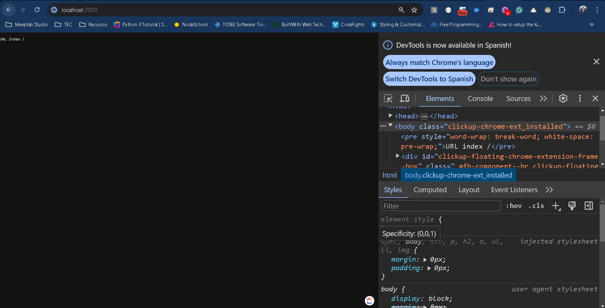

Hasta ahora hemos trabajado directamente con el navegador, pero al hablar de variantes con métodos de conexión es una buena práctica cubrir todos los aspectos, para ello veremos una herramienta muy común para poder probar conexiones con el servidor. Cuando no devuelvas exactamente cosas que se verán en el navegador es recomendable utilizarlas. Esta herramienta se llama Postman, pero existen un buen número de herramientas similares que hacen el trabajo.

Postman tiene una versión en línea que limita algunas de las pociones que se pueden utilizar por lo que te recomiendo que [bajes la versión de escritorio](https://www.postman.com/downloads/).

De preferencia crea una cuenta esto te servirá mucho para el futuro.

Para comenzar, Postman es similar a un navegador, en donde necesitamos crear una nueva pestaña y escribir una URL, al igual que en el navegador escribe:

```
localhost:3000/
```

Verás que puedes agregar algunos parámetros adicionales, por el momento no nos preocuparemos al respecto, pero algo que es importante que veas es que el método de conexión lo está realizando por medio de un GET.

Para obtener el resultado entonces da clic en el botón **Send** de la parte superior derecha.

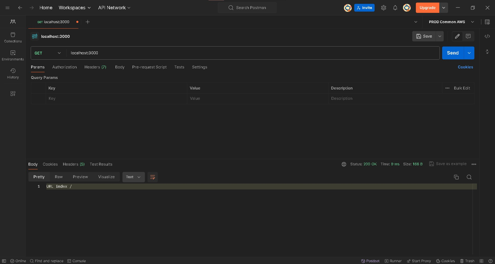

Aquí veremos una diferencia importante en el navegador con la respuesta, en primer lugar observa el código **200 Ok** que aparece reflejado, esto nos indica que en nuestro servidor si no colocamos un código, de manera default siempre se devuelve un código 200, esto no lo olvides ya que puede generar confusiones más adelante.

La otra parte es que a diferencia del navegador aquí veremos el response en formato de texto, ya que justamente habíamos declarado **response.setHeader('Content-Type', 'text/plain');** lo que indica que el tipo de respuesta es un texto plano.

Para ello se utiliza el  **text/plain**, el cual es mejor conocido como los MIME types. Normalmente estamos acostumbrados a que los archivos nos guían en sus extensiones, por ejemplo: .txt,.html,.css,.pdf, etc.

Las extensiones en su mayoría nos permite visualizar un tipo de archivo, pero técnicamente no es suficiente con colocar la extensión, sobre todo con archivos binarios, ya que requieren la codificación necesaria, no solo la extensión, para esto nos sirven los MIME types, ayudan a la codificación y decodificación.

Para nuestro caso serán necesarios para identificar cuando recibimos, texto, html, json o cualquier otro formato que queramos manejar.

Veamos otro ejemplo declarando la url /test_json.

```
if (request.url == "/") {
    response.setHeader('Content-Type', 'text/plain');
    response.write("URL index /");
    response.end();   
}else if(request.url == "/test_json"){
    response.setHeader('Content-Type', 'application/json');
    response.write('{code:200, msg:"Ok"}');
    response.end();   
}
```

Con el nuevo bloque que escribimos, si en postman entramos a la url

```
localhost:3000/test_json
```

Nuestro resultado será:

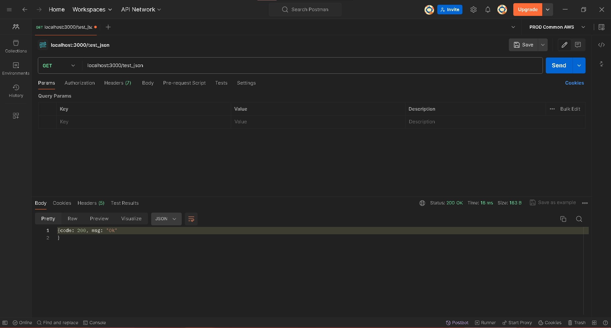

Si bien mantenemos el código **200 Ok**, lo que nos interesa es como obtenemos la nueva respuesta, a través del MIME type **application/json** respondemos con un string el cual una vez decodificado en la respuesta nos lo muestra como JSON.

```
{
    code: 200, msg: "Ok"
}
```

Aquí necesitamos establecer otro punto importante, el mensaje que enviamos contiene 2 partes, un **code** que embona con el código **200** resultado, pero es importante que sepas que lo que escribimos es solo para enfatizar el mensaje, pero bien el número de código no afectaría en base al estándar. Lo mismo pasa con **msg**, cuando estés trabajando con REST APIs entenderás más al respecto.

Por último vamos a servir otra url para un código HTML, y vamos a cambiar el if y else por un switch, quedando de la siguiente manera:

```
switch(request.url){
    case "/":
        response.setHeader('Content-Type', 'text/plain');
        response.write("URL index /");
        response.end();   
        break;
    case "/test_json":
        response.setHeader('Content-Type', 'application/json');
        response.write('{code:200, msg:"Ok"}');
        response.end();   
        break;
    case "/test_html":
        response.setHeader('Content-Type', 'text/html');    
        response.write(`
            <!DOCTYPE html>
            <html lang="en">
            <head>
                <meta charset="utf-8">
                <title>Código en HTML</title>
            </head>
            <body>
            <h1>hola mundo desde node</h1>
            </body>
            </html>
        `);
        response.end();   
        break;
}
```

El resultado será el siguiente:

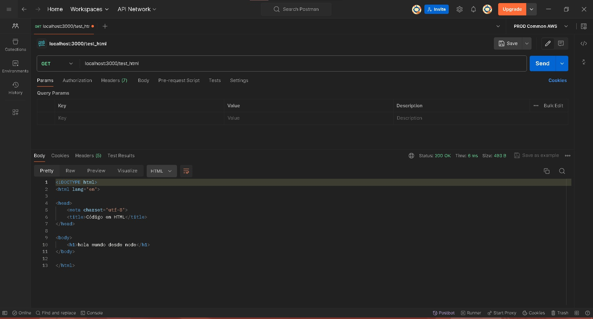

Aquí notarás que Postman no cargará el código HTML, sino que solo nos mostrará el contenido tal cual, pero puedes probar en el navegador a ver la respuesta.

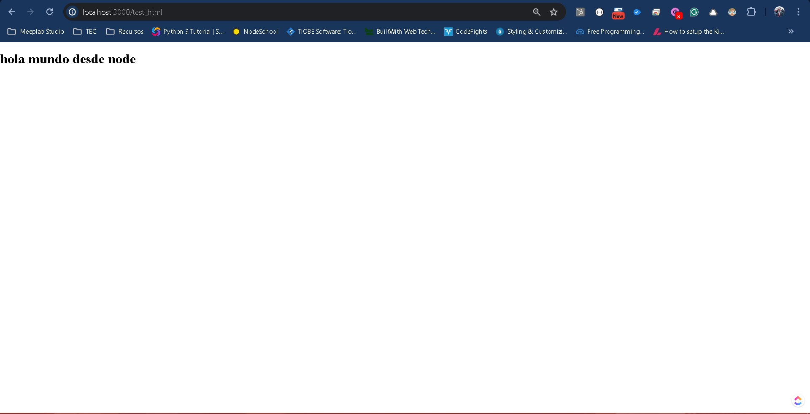

Con lo que hemos visto, espero que te hayas dado cuenta de que el código que ejecutamos en el servidor es secuencial-asíncrono, es decir, las peticiones llegan a nuestro archivo **index.js** y se procesan buscando una respuesta de salida, si no se encuentra nada, pasa como al inicio que el navegador no sabe que interpretar de regreso, pero si detecta que manejamos la ruta de la url entonces el servidor empieza a saber por donde irse.

Hasta el momento hemos definido 3 rutas:

```
/
/test_json
/test_html
```

Agreguemos 1 más para genera una ruta POST, para **test_json** vamos a modificar al case correspondiente, ahora debemos añadir **request.method** para identificar si es un GET o un POST.

```
if(request.method == "GET"){
    response.setHeader('Content-Type', 'application/json');
    response.write('{code:200, msg:"Ok GET"}');
    response.end();  
}else if(request.method == "POST"){
    response.setHeader('Content-Type', 'application/json');
    response.write('{code:200, msg:"Ok POST"}');
    response.end();  
}
```

Ahora según el método que seleccionemos tendremos el resultado correspondiente:

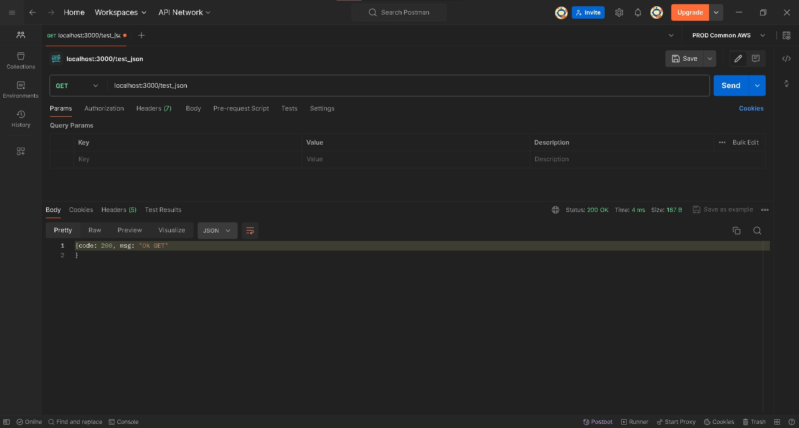

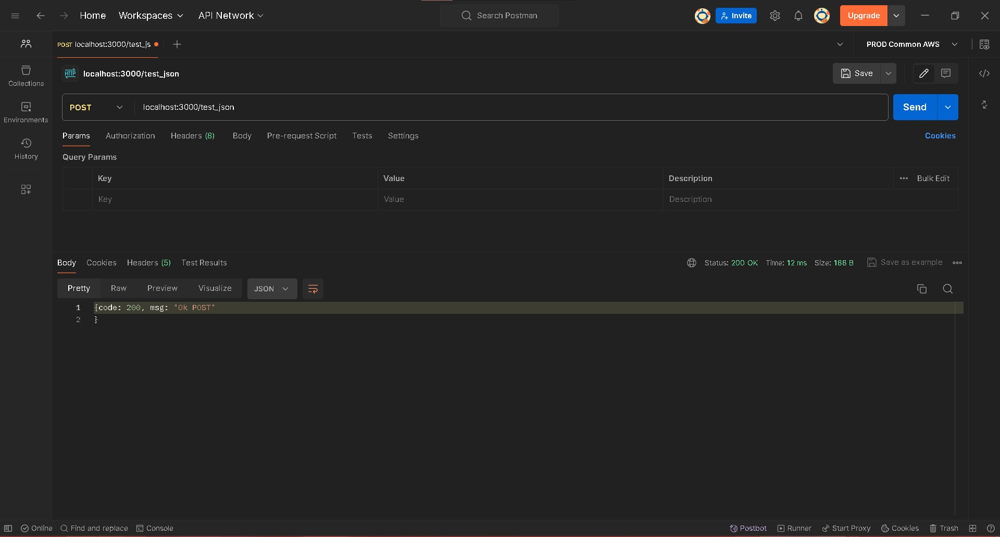

Nuestras rutas ahora tienen soporte para diferentes URL y métodos de conexión, pero es imposible hacer que soporten todo, por ello siempre se recomienda manejar el código estándar 404, el cual se utiliza para cuando no se encuentra una ruta en el servidor.

Vamos a añadir un default a nuestro switch:

```
default:
    response.statusCode = 404;
    response.end();
    break;
```

No olvides colocarlo al final del switch, para que en caso de no encontrar ninguna ruta, entre por default aquí.

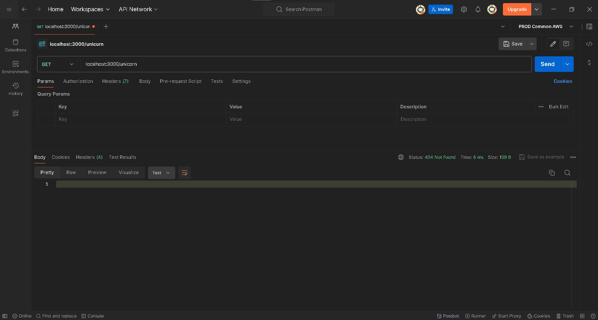

Aquí podemos agregar una url que no tengamos como **localhost:3000/unicorn** y el resultado será un **404 not found** siguiendo el estándar.

Intenta con algunas otras url y cambiando por ejemplo a **test_index** pero llamando en **POST** para que también veas la diferencia.

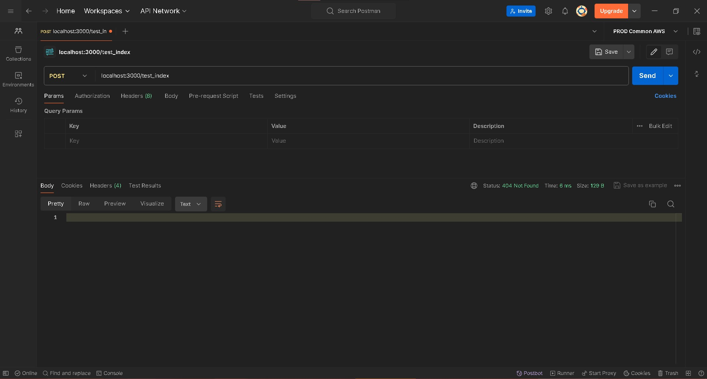

## Formas

Hasta ahora hemos solicitado información del navegador pero no hemos enviado información a procesar.

Antes de explorar las formas en su totalidad, debemos entender de que maneras podemos recibir información en el servidor.

## La etiqueta FORM

Dentro del código HTML, existe una etiqueta especial que nos permite manejar formularios para enviar dicha información al servidor, esta utiliza la etiqueta especial **form**.

Una forma de verla en su formato más simple es la siguiente:

```
<form method="POST" action="/form_method">
    <input type="submit" value="Enviar">
</form>
```

El código anterior cubre lo siguiente:

- Las propiedades:
  - method: [GET,POST,PUT,DELETE] permiten colocar cualquier tipo de método de conexión que necesitemos para subir como ya hemos venido diciendo la información y alinearla dentro de nuestras rutas. En caso de no escribirla por default utiliza el método GET, pero lo más común es utilizarla en métodos tipo POST ya que todo el contenido se guardará dentro del body del request.
  - action: Contiene la url de formato a llamar, dependiendo el tipo de servidor aquí puede variar, en ocasiones se escribe la url completa incluido el dominio, para nuestro caso basta con empezar después de localhost:3000, utilizando primero **/** y de ahí el nombre interno de rutas que se tiene.
  - enctype: De momento todavía no lo veremos pero es un formato que permite trabajar para el caso especial de subir archivos al servidor.
  
- Los elementos internos:
  - Inputs - Son etiquetas html que sirven para crear cualquier componente de formulario, si bien todas son etiquetas iguales, asignarles la propiedad **type** es lo que hace que empiecen a ser diferentes. Utiliza el archivo en el ejemplo de este laboratorio al final, de referencia para que veas como se declaran y utilizan. Todos los valores que almacenan se guardan en la propiedad **value** y a diferencia de las otras propiedades HTML que utilizan el **id** para identificarse, si bien pueden utilizar el **id**, dentro del formulario utilizan la propiedad **name** para asignar el valor correspondiente al mandarlo al servidor, es decir que desde el servidor utilizaremos el nombre asignado a esta propiedad para acceder al valor.

>Nota: Cuida mucho en no confundir el elemento button con el submit, ya que el primero solo funciona para añadir alguna funcionalidad dentro del formulario, pero el segundo es el encargado de enviar la información del formulario al servidor.

>Nota 2: En internet existen muchas librerías que añaden mejor funcionalidad o facilidad para trabajar con algunos componentes dándoles mayor usabilidad o mejor diseño. Te recomiendo siempre tengas a la mano librerías para datepickers y establezcas un formato unificado para los forms que por lo general ya traen integrado los frameworks de diseño.

Para que el código de nuestro servidor funciones vamos a tener que separara el GET y el POST, donde para el primer escribiremos el html del formulario que queremos y para el POST procesaremos la respuesta a subir esa información.

Empecemos con la base abriendo un nuevo case que involucre la ruta **/form_method**

```
case "/form_method":
    if(request.method == "GET"){

    }else if(request.method == "POST"){

    }
break;
```

Entonces para el caso del GET vamos a aprovechar y hacer algo diferente para trabajar más fácilmente con el código HTML. Esta aún no es la mejor forma de optimizar la carga de código HTML, pero es una buena alternativa sobretodo para cuando trabajas con archivos HTML muy largos que deben estar aislados.

Crearemos un archivo **form.html** con lo siguiente:

```
<!DOCTYPE html>
<html lang="en">
<head>
    <meta charset="utf-8">
    <title>Formularios HTML</title>
</head>
<body>
    <form method="POST" action="/form_method">
        <input type="number" name="indice" placeholder="Índice">
        </br>
        <input type="text" name="imprimir" placeholder="Valor a imprimir">
        </br>
        <input type="submit">
    </form>
</body>
</html>
```

Ahora en nuestro archivo **index.js** vamos a declarar hasta arriba del mismo el uso de las librerías **path** y **fs** la cual vimos en laboratorios anteriores.

```
const http = require('http'); //Ya estaba declarada para nuestro servidor
const path = require('path');
const fs   = require('fs');
```

Por último de nuevo en el case, dentro del if del método GET, escribiremos lo siguiente:

```
response.setHeader('Content-Type', 'text/html');
const html = fs.readFileSync(path.resolve(__dirname, './form.html'), 'utf8')
response.write(html);
response.end();  
```

Como puedes ver estamos utilizando el mismo header de código html que en la ruta **test_html**, pero a diferencia de ese aquí estamos utilizando la librería fs para leer el archivo **form.html** en memoria, codificándose a utf8 y pasándolo como un string para escribirlo en el **response.write()**.

Esta es la forma más útil de poder probar y ver nuestro código html y no escribirlo al vuelo pues de lo contrario tendremos que hacer mucha prueba y error antes de verlo como nosotros queremos.

Si volvemos a ejecutar el servidor y accedemos al navegador tendremos algo como lo siguiente:

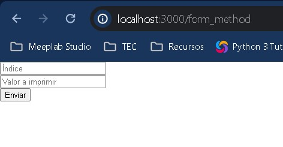

Ahora solo basta con que desde el POST recibamos la información, de la siguiente manera:

```
let body = [];
request
.on('data', chunk => {
    body.push(chunk);
})
.on('end', () => {
    body = Buffer.concat(body).toString();
    console.log(body)

    const indice = Number(body.split('&')[0].split('=')[1]);
    console.log(indice);
    const imprimir = body.split('&')[1].split('=')[1];
    console.log(imprimir);

    for(var i = 1; i <= indice; i++){
        console.log(imprimir)
    }

    response.setHeader('Content-Type', 'application/json');
    response.statusCode = 200;
    response.write('{code:200, msg:"Ok POST"}');
    response.end();
});  
```

El siguiente código parece muy complejo, pero en realidad no lo es, vayamos punto por punto.

Al utilizar NodeJS plano necesitamos procesar la información mandada por el request y generarla en un formato apto para nosotros, esto es una mejor forma de leerlo.

Para ello debemos hacer uso de 2 métodos asíncronos para guardar la información del formulario en un arreglo.

```
let body = [];

request
  .on('data', chunk => {
    body.push(chunk);
  })
  .on('end', () => {
    body = Buffer.concat(body).toString();
    // at this point, `body` has the entire request body stored in it as a string
  });
```

En estos métodos observa como se utiliza el string **data** y el string **end**, estas son como variables o estatus que se ejecutan en diferentes momentos. **data** ocurre en cada lectura del body, si fuera un archivo sería cada línea de dicho archivo. Y **end** se ejecuta al terminar de procesar todo el body.

Entonces por cada línea iremos agregando al arreglo que definimos como **body** y una vez finalizado ejecutamos el código que queremos tener.

> Nota: Recuerda que el código es asíncrono por lo que el contenido después de tener el body unificado va a dentro de la función flecha de **end** y no afuera.

El resultado obtenido será algo como lo siguiente:

```
indice=10&imprimir=Hola+Mundo
```

Ahora bien el problema está en que debemos separar cada propiedad y además separar cada llave de su valor, para ello utilizamos el código:

```
const indice = Number(body.split('&')[0].split('=')[1]);
console.log(indice);
const imprimir = body.split('&')[1].split('=')[1];
console.log(imprimir);
```

En nuestro caso sabemos de antemano que **indice** es un entero, por lo que podemos forzar el cast para tenerlo en el formato necesario desde el inicio.

Después procedemos a hacer algo con estos valores de entrada, esto puede ser lo que nosotros queramos.

```
//Imprimir en un ciclo según el índice la frase
//a imprimir
for(var i = 1; i <= indice; i++){
    console.log(imprimir)
}
```

Y por último enviamos la respuesta de que todo salió correctamente.

```
response.setHeader('Content-Type', 'application/json');
response.statusCode = 200;
response.write('{code:200, msg:"Ok POST"}');
response.end();
```

Si ejecutamos nuestro servidor nuevamente realiza el experimento y observa el resultado final, tanto en el navegador como en la consola.

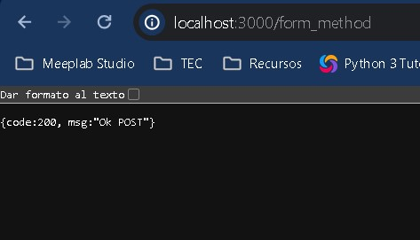

```
indice=10&imprimir=Hola+Mundo
10
Hola+Mundo
Hola+Mundo
Hola+Mundo
Hola+Mundo
Hola+Mundo
Hola+Mundo
Hola+Mundo
Hola+Mundo
Hola+Mundo
Hola+Mundo
Hola+Mundo
```

Excelente, hemos creado un formulario y hemos procesado su información correctamente en nuestro servidor.

Más adelante veremos como hacer de manera más simple este proceso, pero al menos ahora sabes como lo hace NodeJS.

En resumen, crear rutas, utilizar métodos de conexión, definir el correcto estándar de subida y bajada es el día a día del desarrollador de back-end ya que es la apertura a que los usuarios puedan conectarse al servidor y ejecutar, acciones, funciones o almacenar información.

[Ver ejemplo completo](/node/tutorials/intro_web/Lab10RutasYFormas/ejemplo.zip)