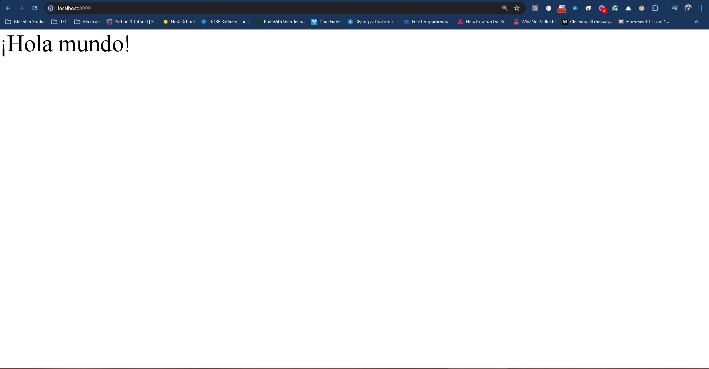
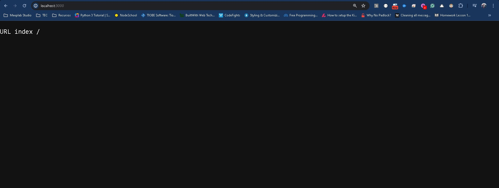

# Express

En el desarrollo web y en desarrollo del backend ya hemos visto algunas estrategias para poder comenzar a escribir nuestro código, sin embargo en el camino nos hemos encontrado con alguna formas extrañas para hacerlo, ya sea para definir código o para estructurarlo.

Si bien no es un problema, lo que buscamos al final es ser lo más prácticos posibles para evitar duplicar código y que este sea lo más sencillo posible.

A esto nos lleva el uso de frameworks que no son otra cosa que un conjunto de librerías y buenas prácticas para estructurar proyectos de desarrollo web.

En el mercado existen de una gran cantidad y más que decir que uno sea mejor que otro lo importante es decir que utilicemos uno, pues como ya mencionamos harán nuestra vida más fácil y nos ayudarán a estandarizar nuestra forma de trabajo.

## npm

Cuando instalamos npm tenemos una herramienta de terminal que por default viene instalada siempre, y esta es mejor conocida como el node package manager o **npm**, esta herramienta nos permite instalar librerías en nuestros proyectos o crear nuevos proyectos con ciertas configuraciones.

Un comando para instalar una librería por ejemplo sería:

```
npm install pm2
```

Aquí estamos llamando a instalar una librería llamada pm2, solo que en el contexto de hacerlo aquí se instalaría en la carpeta de nuestro proyecto.

```
npm install pm2 -g
```

Vamos a instalar la librería de manera global para el ejercicio que estaremos trabajando.

La bandera -g hace la misma instalación, pero esto hace que la librería sea global, es decir que sea accesible desde cualquier lugar de nuestra computadora. Internamente Node ya sabe que debe realizar la instalación en una carpeta especial a la cual si se hace la llamada a la librería debe estar disponible.

Ahora bien como te mencioné, podemos iniciar un proyecto desde aquí, pero debemos considerar un punto en el control de versiones que no hemos cubierto hasta el momento.

## .gitignore

Dentro de lo que hemos visto en nuestros laboratorios de control de versiones, hemos visto como manejar los archivos y como movernos en diferentes ramas para crear flujos de trabajo, sin embargo, algo bastante común es querer evitar subir ciertos archivos al repositorio, ya que pueden ser archivos de seguridad o son archivos que tan solo tenerlos arriba nos quitarán espacio y no es necesario tenerlos.

Para poder evitar subir archivos al repositorio, necesitamos un archivo llamado **.gitignore**, observa que este archivo empieza con un punto y lo único que contiene son los archivos y carpetas que queremos ignorar.

Dentro de la comunidad ya existen algunos estándares para estos archivos según los lenguajes que estemos trabajando. Para nuestro proyecto de Node.js con Express, crea un archivo llamado **.gitignore** en la raíz de tu proyecto y coloca lo siguiente:

```
# Dependencias
node_modules/

# Logs
logs/
*.log
npm-debug.log*

# Variables de entorno (pueden contener contraseñas o claves)
.env
.env.local
.env.development.local
.env.test.local
.env.production.local

# Datos de ejecución
pids/
*.pid
*.seed
*.pid.lock

# Directorios de compilación y salida
dist/
build/

# Reportes de cobertura de pruebas
coverage/
.nyc_output/

# Cache de herramientas
.npm
.eslintcache
*.tsbuildinfo

# Salida de npm pack
*.tgz
```

Observa que la entrada más importante para nosotros es **node_modules/**, que es la carpeta donde se instalan todas las dependencias del proyecto. Las entradas de **.env** también son fundamentales ya que estos archivos suelen contener información sensible como contraseñas o claves de API que nunca deben subirse al repositorio.

Para los proyectos de node lo que vamos a querer evitar es subir una carpeta llamada **node_modules**, esta carpeta contendrá todas las librerías del proyecto. La razón de por que queremos evitar subirlas es por que esta acción se hace siempre que se inicia el proyecto, guardarlas puede crear el conflicto de guardar librerías viejas que a la larga causan más mal que bien y por tanto cada vez que clonamos el repositorio hacemos un fresh install que nos asegura la calidad del proyecto se mantiene.

## npm init

Ya que tenemos nuestro .gitignore en su lugar, ahora vamos a ejecutar el siguiente comando:

```
npm init
```

Como resultado comenzaremos un pequeño wizard que creará unas configuraciones iniciales para nosotros, por ahora podemos darle enter a todas las opciones.

Al final veremos reflejado un nuevo archivo llamado **package.json**, el resultado debería ser algo como lo siguiente:

```
{
  "name": "test-project",
  "version": "1.0.0",
  "description": "",
  "main": "index.js",
  "scripts": {
    "test": "echo \"Error: no test specified\" && exit 1"
  },
  "author": "",
  "license": "ISC"
}
```

El archivo **package.json** nos dará una visibilidad inicial de como ejecutar y correr nuestro proyecto diferente a lo que hemos visto hasta el momento. Las configuraciones iniciales nos permiten escribir los datos de nuestro proyecto como el nombre, la versión, una descripción y el que nos interesa es el **main** pues es el que nos dice que archivo inicial se ejecuta. Recuerdas que te comente que en Node podemos utilizar app.js o main.js, aquí es donde realmente hacemos la distinción y en nuestro caso usaremos index.js.

Ahora vamos a instalar nuestra primera librería, en este caso express.

```
npm install express
```

A partir de npm 5, cualquier paquete que instales se agrega automáticamente a las dependencias de tu **package.json**, por lo que ya no es necesario usar la bandera `-s` o `--save` que se utilizaba en versiones anteriores.

Si revisamos el resultado final del archivo package.json se vería como lo siguiente:

```
{
  "name": "test-project",
  "version": "1.0.0",
  "description": "",
  "main": "index.js",
  "scripts": {
    "test": "echo \"Error: no test specified\" && exit 1"
  },
  "author": "",
  "license": "ISC",
  "dependencies": {
    "express": "^4.19.2"
  }
}
```

Nota como se agregó la opción de dependencies y dentro de ella se agregó correctamente **express**.

Un error al inicio es querer modificar la versión de la librería y cambiarla por un asterisco (*), el asterisco representa la última versión disponible de la librería, en el corto tiempo no sucederá nada, pero en el largo plazo esto no es una buena práctica pues conforme avance el tiempo vamos a necesitar la librería específica, por que veremos con el tiempo que las librerías en Node tienden cambiar entre ciertas versiones y esto nos puede llevar a problemas al correr nuestro proyecto. Al tener el número de librería original va a ser más fácil para nosotros poder instalarla entre la jungla de versiones que se desarrollen a futuro.

> Nota: Nunca actualices una librería solo cambiando el número, si tienes suerte no sucederá nada, pero si no, romperás todo tu proyecto y puede llevarte a un efecto domino.

Ahora que verás la actualización, también es probable que veas un archivo llamado **package-lock.json**, este archivo es el hermano perdido del primero,  puede parecer molesto y puede darte algunos dolores de cabeza en el control de versiones, pero es un archivo sin filtros de como se estructura en tu máquina el proyecto, ya que si quieres pasarlo a otra máquina puedas hacerlo sin batallar con las librerías. De momento no vamos a tomarlo en cuenta pero para tu proyecto ten cuidado con él, ya que aunque lo elimines volverá a aparecer.

## Básicos de express (Middlewares)

Ya que instalamos express vamos a empezar con nuestro archivo index.js, si aún no está creado empieza y añade el siguiente código.

```
const http    = require('http');
const express = require('express');
const app     = express();

//Middleware
app.use((request, response, next) => {
  console.log('Middleware!');
  next(); //Le permite a la petición avanzar hacia el siguiente middleware
});
app.use((request, response, next) => {
  console.log('Otro middleware!');
  response.send('¡Hola mundo!'); //Manda la respuesta
});

const server = http.createServer( (request, response) => {    
    console.log(request.url);
});
app.listen(3000);
```

Este pequeño código nos permitirá crear un servidor para utilizar express y realizar algunas funciones para nosotros.

La primera que veremos es conocida como **Middlewares**, estos son funciones que se van a ejecutar antes de realizar una instrucción o ruta del servidor, piensa en el caso de la autenticación de un usuario, podemos tener una verificación de autenticación en cada ruta de nuestro código, esto no será lo más óptimo pues estaremos duplicando código a diestra y siniestra. Para ello será mejor tener esta función que se ejecute antes de cada ruta y que este centralizada en el mismo pesado de código. Si bien podríamos llamarla simplemente como una función externa, el uso de middlewares proporcionado por express nos ayudará a secuenciar mejor el código más que como un proceso que como una función.

Regresando al código que acabamos de agregar, observa que tenemos 2 Middleware, y la sintaxis que utilizan después de configurar express, es el uso del objeto **request** y **response** que son los mismos que ya vimos en laboratorios anteriores y aquí están agregando un objeto más, el **next**. El objeto next es el que me indica que esto es un middleware pues lo único que haremos es que una vez que termine nuestra función que queremos ejecutar en middleware debemos llamar a **next()**, para decirle a express que avance a la siguiente sección o al siguiente middleware.

Por tanto, antes de que nuestro servidor imprima la url del request, deberá imprimir Middleware y Este es otro middleware.

Vamos a probarlo, pero para hacerlo vamos a cambiar la forma en la que ejecutamos nuestro código.

## node --watch

Hasta ahora hemos ejecutado nuestro servidor con `node index.js`, pero cada vez que hacemos un cambio debemos detenerlo manualmente con `Ctrl+C` y volver a ejecutarlo. Esto se vuelve tedioso muy rápido.

A partir de Node.js 18, existe la bandera `--watch` que reinicia automáticamente el proceso cada vez que detecta cambios en los archivos de tu proyecto:

```
node --watch index.js
```

Al ejecutarlo verás algo como:

```
Restarting 'index.js'
```

Cada vez que guardes un cambio en cualquier archivo importado, Node reiniciará el servidor automáticamente sin que tengas que hacer nada. Esta es la forma más sencilla de trabajar en desarrollo ya que no requiere instalar ninguna librería adicional.

> **Nota:** Si necesitas limitar qué carpetas observa, puedes usar `node --watch-path=./src index.js` para que solo reinicie ante cambios en una carpeta específica.

## pm2

Si bien `node --watch` es perfecto para desarrollo local, cuando necesitamos algo más robusto o prepararnos para producción, existe **pm2**.

Como vimos al inicio del laboratorio, te pedí que instalaras de manera global la librería de pm2, esta librería queremos tenerla instalada fuera del proyecto ya que será lo mismo para cualquier proyecto que tengamos que ejecutar.

PM2 es una librería de administración de procesos, dicho de otra forma es una librería que impide que nuestro servidor se apague solo por el hecho de cerrar la terminal. Es decir, crea un proceso en segundo plano que no sea dependiente de la terminal.

Las ventajas de pm2 sobre `node --watch` son:

- **Proceso en segundo plano:** el servidor sigue corriendo aunque cierres la terminal.
- **Administración de logs:** puedes consultar la consola y los errores con `pm2 logs`.
- **Reinicio automático ante crashes:** si tu servidor falla, pm2 lo levanta de nuevo.
- **Monitoreo:** puedes ver el uso de CPU y memoria de tus procesos.
- **Entorno de producción:** pm2 es lo que usarás cuando despliegues tu proyecto en un servidor real.

En resumen, usa `node --watch` cuando estés programando rápidamente en tu máquina y pm2 cuando necesites que el servidor corra de manera estable en segundo plano o en un servidor de producción.

Por ahora ve aprendiendo los siguiente comandos de inicio:

```
pm2 start index.js --watch //Corre el proyecto y observa cualquier cambio en archivos para actualizar el servidor
pm2 stop index.js //Detiene el proceso actual pero no lo borra
pm2 delete index.js //Borra el proceso

pm2 kill //Detiene y borra todos los procesos en ejecución
pm2 logs //Permite ver la consola y los errores de la misma
pm2 ls //Visualiza la tabla de procesos de pm2
```

Conforme vayamos avanzando iremos siendo más certeros en los comandos con algunos parámetros adicionales, pero por el momento es suficiente.

Corre el servidor con:

```
pm2 start index.js --watch
```

Sí todo corre bien deberás ver una especie de tabla en la terminal con lo siguiente

```
┌────┬────────────────────┬──────────┬──────┬───────────┬──────────┬──────────┐
│ id │ name               │ mode     │ ↺    │ status    │ cpu      │ memory   │
├────┼────────────────────┼──────────┼──────┼───────────┼──────────┼──────────┤
│ 0  │ index              │ fork     │ 0    │ online    │ 0%       │ 42.8mb   │
└────┴────────────────────┴──────────┴──────┴───────────┴──────────┴──────────┘
```

Este es el resumen de pm2, aquí verás el estado actual de tu proyecto, cuantas veces se ha reiniciado y cuanta memoria utiliza para correr.

Si entramos al navegador y vemos **localhost:3000**, el resultado será el Hola Mundo.



Pero en nuestra terminal si ejecutamos **pm2 logs** veremos lo siguiente:

```
0|index    | /
0|index    | Middleware!
0|index    | Otro middleware!
```

Lo que sucede aquí, es que nuestro servidor aún no maneja rutas, por lo que primero  llega a imprimir la url del request, pero una vez que lo hace empieza a ejecutar nuestros middlewares, pon especial atención en que no parece que se estén llamando directamente, y esto es por la variable app que de declaramos. Al menos para este arranque esta variable nos permite conectar en cadena cada uno de los elementos en el archivo haciendo que se ejecute el primer middleware, luego el segundo y así sucesivamente si tuviéramos más.

Ahora vamos a modificar nuestro segundo middleware a lo siguiente:

```
app.use((request, response, next) => {
    console.log('Otro middleware!');
    response.status(404);
    response.send('¡Page Not Found!'); //Manda la respuesta
});
```

En el laboratorio anterior teníamos una manera de centralizar los errores 404 de nuestro servidor, por lo que ahora realizaremos lo mismo pero utilizando la estructura de express.

## Rutas con express

En la forma previa para poder identificar rutas, necesitábamos meter un switch dentro de la función create server e identificar según la url que se estuviera llamando y hacer nuestro segmento de código de acuerdo al método de conexión y la ruta.

Ahora con express todo esto será mucho más sencillo, para declarar la ruta default por ejemplo haremos lo siguiente:

```
app.get('/', (request, response, next) => {
    response.setHeader('Content-Type', 'text/plain');
    response.send("URL index /");
});
```

Este código lo agregaremos previo a nuestro middleware del 404.

Al igual que el laboratorio pasado haremos que envíe un texto simple de respuesta.



Intenta adaptar el laboratorio anterior a que funcione con express, nota que el método de conexión GET utiliza el app.get(), si necesitaras un POST, entonces necesitarías el app.post().

El código debería haberse migrado a lo siguiente:

```
const http    = require('http');
const express = require('express');
const path    = require('path');
const fs      = require('fs');
const app     = express();

//Middleware
app.use((request, response, next) => {
    console.log('Middleware!');
    next(); //Le permite a la petición avanzar hacia el siguiente middleware
});

app.get('/', (request, response, next) => {
    response.setHeader('Content-Type', 'text/plain');
    response.send("URL index /");
    response.end(); 
});

app.get('/test_json', (request, response, next) => {
    response.setHeader('Content-Type', 'application/json');
    response.json({code:200, msg:"Ok GET"});
    response.end();  
});

app.post('/test_json', (request, response, next) => {
    response.setHeader('Content-Type', 'application/json');
    response.json({code:200, msg:"Ok POST"});
    response.end();  
});

app.get('/test_html', (request, response, next) => {
    response.setHeader('Content-Type', 'text/html');    
    response.write(`
        <!DOCTYPE html>
        <html lang="en">
        <head>
            <meta charset="utf-8">
            <title>Código en HTML</title>
        </head>
        <body>
            <h1>hola mundo desde express</h1>
        </body>
        </html>
    `);
    response.end(); 
});

app.get('/form_method', (request, response, next) => {
    response.setHeader('Content-Type', 'text/html');
    const html = fs.readFileSync(path.resolve(__dirname, './form.html'), 'utf8')
    response.write(html);
    response.end();  
});

app.post('/form_method', (request, response, next) => {
    let body = [];
    request
    .on('data', chunk => {
        body.push(chunk);
    })
    .on('end', () => {
        body = Buffer.concat(body).toString();
        console.log(body)

        const indice = Number(body.split('&')[0].split('=')[1]);
        console.log(indice);
        const imprimir = body.split('&')[1].split('=')[1];
        console.log(imprimir);

        for(var i = 1; i <= indice; i++){
            console.log(imprimir)
        }

        response.setHeader('Content-Type', 'application/json');
        response.statusCode = 200;
        response.write('{code:200, msg:"Ok POST"}');
        response.end();
    }); 
});

app.use((request, response, next) => {
    console.log('Otro middleware!');
    response.status(404);
    response.send('¡Page Not Found!'); //Manda la respuesta
});

const server = http.createServer( (request, response) => {    
    console.log(request.url);
});
app.listen(3000);
```

Ve que la principal diferencia fue haber separado en funciones nuestro código para evitar el switch que teníamos y sus internos del GET y POST.

Ahora bien vamos a mejorar la forma en la que trabajamos con nuestro formulario, y esto lo haremos a través de una nueva librería que debemos instalar en nuestro proyecto.

```
npm install body-parser
```

Para usarla, la colocaremos debajo de la declaración de la variable **app**.

```
const app = express();

const bodyParser = require('body-parser');
app.use(bodyParser.urlencoded({extended: false}));
```

El body parser nos permitirá trabajar más fácilmente con las variables recibidas de nuestros request ya que su trabajo le permite codificar el body de una petición de manera sencilla y mas entendible.

Lo que teníamos al trabajar con el formulario era lo siguiente:

```
let body = [];
request
.on('data', chunk => {
    body.push(chunk);
})
.on('end', () => {
    body = Buffer.concat(body).toString();
    console.log(body)

    const indice = Number(body.split('&')[0].split('=')[1]);
    console.log(indice);
    const imprimir = body.split('&')[1].split('=')[1];
    console.log(imprimir);

    for(var i = 1; i <= indice; i++){
        console.log(imprimir)
    }

    response.setHeader('Content-Type', 'application/json');
    response.statusCode = 200;
    response.write('{code:200, msg:"Ok POST"}');
    response.end();
});
```

Esto lo simplificaremos con lo siguiente:

```
const indice = Number(request.body.indice);
console.log(indice);
const imprimir = request.body.imprimir
console.log(imprimir);

for(var i = 1; i <= indice; i++){
    console.log(imprimir)
}

response.setHeader('Content-Type', 'application/json');
response.statusCode = 200;
response.write('{code:200, msg:"Ok POST"}');
response.end();
```

Aquí nos estamos deshaciendo de el arreglo adicional que creamos para el body, los split innecesarios que hicimos y quitamos el streaming request para leer todo el formulario.

Ahora si observas lo que tenemos es que desde el objeto **request** accedemos a la variable **body** y desde ahí podemos acceder a la variable de nuestro formulario **indice** e **imprimir**.

El uso de request.body se limitará a funciones que manden información por el body ya que no siempre sucede puede que en ocasiones llegue vacío. Estos casos los iremos viendo más adelante.

## Separando en clases

Ya tenemos varias rutas trabajadas en nuestro proyecto, pero cada una puede representar un caso diferente, tan solo el manejo del formulario podríamos encapsular en un solo archivo para reducir que crezca mucho el **index.js**, vamos a hacerlo.

Crear un archivo nuevo llamado **formulario.routes.js**. Esto lo haremos dentro de una nueva carpeta a la cual llamaremos **routes**.

Ahora previo a las rutas del formulario al GET y POST, colocaremos lo siguiente:

```
const rutasFormulario = require('./routes/formulario.routes');
app.use('/formulario', rutasFormulario);
```

Para nuestro nuevo archivo **formulario.routes.js**, necesitamos declarar lo siguiente:

```
const express = require('express');
const router = express.Router();

module.exports = router;
```

La anterior es la plantilla básica de archivos de express, cuando queramos que algo tenga continuidad en nuestro servidor podemos usar esta plantilla. Nota que a diferencia de **index.js** aquí se llama a router y no a app, esto es la forma de express de delegar la responsabilidad en archivos diferentes.

Pore tanto el resultado de nuestro archivo deberá quedar como lo siguiente:

```
const express = require('express');
const path    = require('path');
const fs      = require('fs');
const router = express.Router();

router.get('/form_method', (request, response, next) => {
    response.setHeader('Content-Type', 'text/html');
    const html = fs.readFileSync(path.resolve(__dirname, './../form.html'), 'utf8')
    response.write(html);
    response.end();  
});

router.post('/form_method', (request, response, next) => {
    const indice = Number(request.body.indice);
    console.log(indice);
    const imprimir = request.body.imprimir
    console.log(imprimir);

    for(var i = 1; i <= indice; i++){
        console.log(imprimir)
    }

    response.setHeader('Content-Type', 'application/json');
    response.statusCode = 200;
    response.write('{code:200, msg:"Ok POST"}');
    response.end();
});

module.exports = router;
```

Aquí tuvimos que adecuar algunas cosas como sustituir el app por el route y la dirección del archivo form.html que ahora queda afuera de la carpeta routes.

Tampoco olvides actualizar el valor del action del form.html

```
action="/formulario/form_method"
```

Si recargamos el navegador y entramos a **localhost:3000/formulario/form_method**, veremos nuestro formulario con normalidad.

Este último cambio nos permite no solo crear la cantidad de niveles que deseemos de rutas y módulos, sino que nos permite crear una estructura lógica total de un proyecto de desarrollo web sin ningún problema.

<a href="/docs/node/tutorials/intro_web/Lab11Express/test-project.zip" download="lab11-express.zip">Ver ejemplo completo</a>