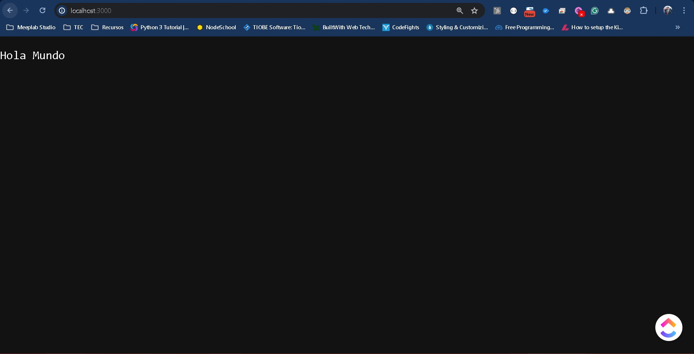
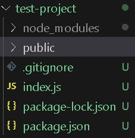
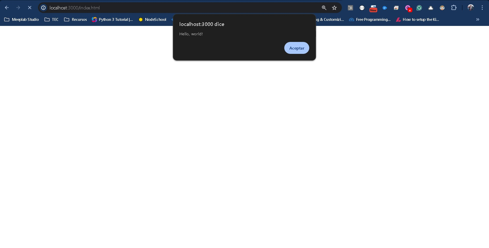
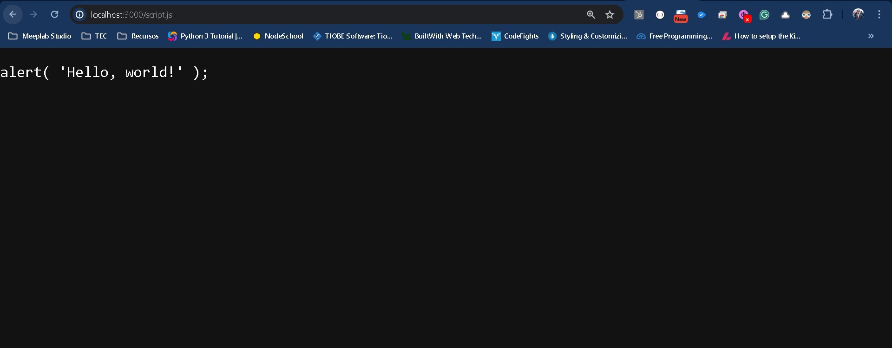
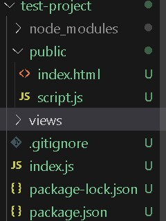
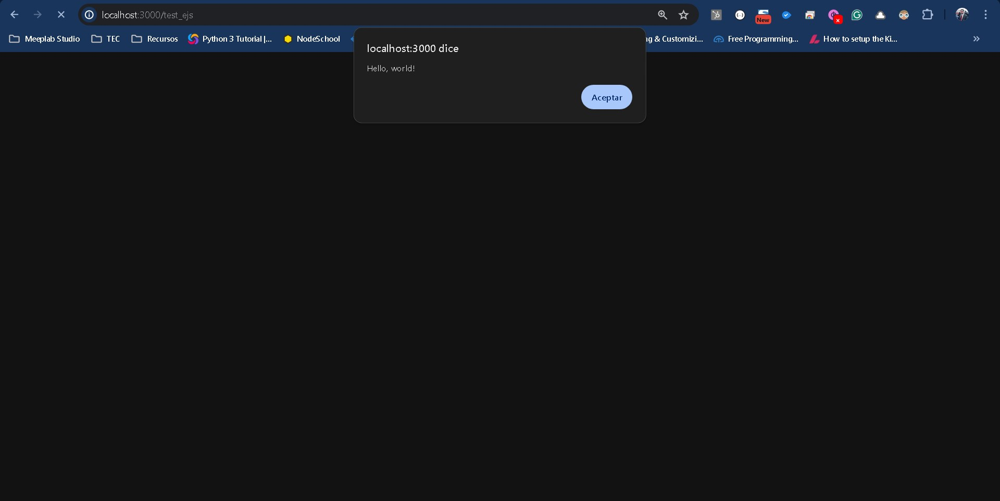
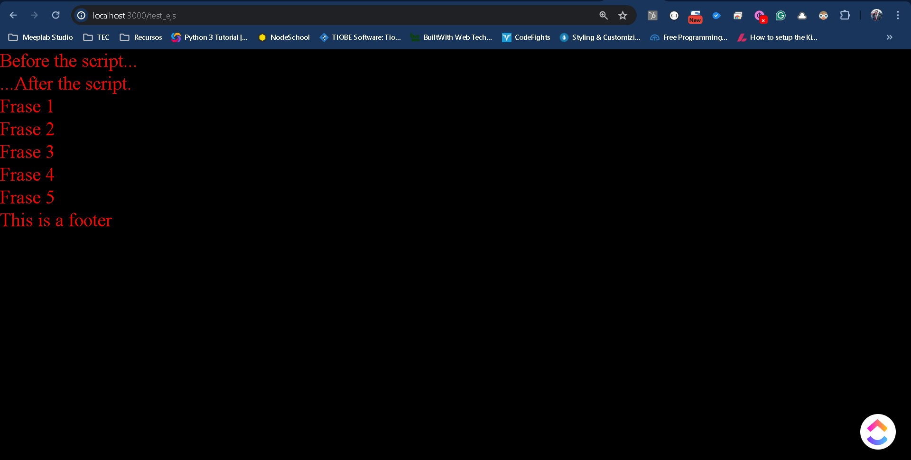

# HTML Dinámico (EJS)

Hasta el momento hemos trabajado con archivos construidos de HTML que son conocidos como estáticos, este tipo de archivos son útiles hasta cierto punto. Si bien podemos generar todo un sitio a partir de sitios estáticos, la labor de trabajo será bastante fuerte. Para eso nos ayudará el construir el contenido HTML de forma dinámica, para reducir el trabajo y hacer más efectivo lo que queremos mostrar.

## Carpeta pública

Antes de comenzar con el contenido dinámico, vamos a establecer un punto importante dentro de nuestros servidores y de nuestro back-end. Con lo que hemos visto hasta el momento hemos podido leer los archivos HTML, CSS y JS sin ningún problema. En la realidad esto no es tan simple, pues nos lleva a un tema de seguridad importante que tienen todos los servidores.

Pensemos en el siguiente caso, tenemos un archivo index.html, el cual queremos servir a nuestros clientes desde el servidor. Hasta ahora lo que hemos visto con NodeJS y Express es que podemos crear una url para leer dicho archivo y pasarlo en formato de texto, si bien esta aproximación es adecuada, es importante entender que sucede. Dentro de nuestro servidor nosotros tenemos una carpeta de proyecto con todos los archivos a utilizar en nuestro proyecto, el archivo index.html, podemos tenerlo en la raíz, o en otra carpeta y según la ruta que utilicemos podemos servirlo, por ejemplo como en el laboratorio pasado dentro del módulo de formulario.

````
router.get('/form_method', (request, response, next) => {
    response.setHeader('Content-Type', 'text/html');
    const html = fs.readFileSync(path.resolve(__dirname, './../form.html'), 'utf8')
    response.write(html);
    response.end();  
});
````

Aquí utilizamos el filesystem para acceder al archivo html y servirlo. La otra forma menos adecuada es servir directamente el html como en el otro caso:

````
app.get('/test_html', (request, response, next) => {
    response.setHeader('Content-Type', 'text/html');    
    response.write(`
        <!DOCTYPE html>
        <html lang="en">
        <head>
            <meta charset="utf-8">
            <title>Código en HTML</title>
        </head>
        <body>
            <h1>hola mundo desde express</h1>
        </body>
        </html>
    `);
    response.end(); 
});
````

Sea de una forma o de otra, una es menos práctica y la otra nos obliga a servir el archivo desde el filesystem. Este tipo de archivos html son estáticos y por tanto no cambian, además de que si queremos cargarles funcionalidad de CSS o JS para manipular el DOM, estaremos limitados.

Para ello NodeJS y express nos permiten crear un folder especial dentro de nuestro proyecto conocido como la carpeta pública, esto permitirá que cualquier archivo dentro pueda ser servido desde el servidor a través de una url.

Veamos como configurar esto y ver las posibilidades que nos da.

Vamos a crear un nuevo servidor utilizando el npm init. Crea la configuración a tu gusto.

Instala express y el body-parser como hasta ahora:

````
npm i express
npm i body-parser
````

Crea un archivo index.js que incluya la configuración básica de express y del body-parser.

````
const http    = require('http');
const express = require('express');
const path    = require('path');
const fs      = require('fs');
const app     = express();

const bodyParser = require('body-parser');
app.use(bodyParser.urlencoded({extended: false}));

app.get('/', (request, response, next) => {
    response.setHeader('Content-Type', 'text/plain');
    response.send("Hola Mundo");
    response.end(); 
});

const server = http.createServer( (request, response) => {    
    console.log(request.url);
});
app.listen(3000);
````

No olvides agregar el archivo .gitignore del proyecto para evitar subir los /node_modules

Para ejecutar el servidor vamos a utilizar pm2

````
pm2 start index.js --watch
````

La bandera --watch nos permitirá que cuando haya cualquier cambio en la carpeta del proyecto, en particular cambios en index.js se reinicie el servidor de manera automática.


Si quieres acceder a la consola usando pm2 utiliza:
````
pm2 logs
````



````
┌────┬────────────────────┬──────────┬──────┬───────────┬──────────┬──────────┐
│ id │ name               │ mode     │ ↺    │ status    │ cpu      │ memory   │
├────┼────────────────────┼──────────┼──────┼───────────┼──────────┼──────────┤
│ 0  │ index              │ fork     │ 0    │ online    │ 21.9%    │ 43.4mb   │
└────┴────────────────────┴──────────┴──────┴───────────┴──────────┴──────────┘
````

Ya que tenemos la base de nuestro servidor vamos a crear la configuración de la carpeta pública.

Esto lo haremos añadiendo la siguiente instrucción:

````
app.use(express.static(path.join(__dirname, 'public')));
````

````
const http    = require('http');
const express = require('express');
const path    = require('path');
const fs      = require('fs');
const app     = express();

const bodyParser = require('body-parser');
app.use(bodyParser.urlencoded({extended: false}));
app.use(express.static(path.join(__dirname, 'public')));

app.get('/', (request, response, next) => {
    response.setHeader('Content-Type', 'text/plain');
    response.send("Hola Mundo");
    response.end(); 
});

const server = http.createServer( (request, response) => {    
    console.log(request.url);
});
app.listen(3000);
````

Lo que estamos haciendo aquí es declarar una carpeta de nuestro proyecto y decirle al servidor que todo lo que contenga podrá servirse de manera directa como público.

En otras palabras, estamos exponiendo esta carpeta al exterior, es por eso que te menciono la parte de seguridad, cuida mucho que archivos subes aquí pues serán accesibles desde cualquier navegador.

Para probar el cambio, crea la carpeta public en el proyecto.



Dentro de esta carpeta vamos a crear un archivo index.html con lo siguiente:

````
<!DOCTYPE HTML>
<html>

<body>

  <p>Before the script...</p>


  <p>...After the script.</p>

</body>
<script src="./script.js"></script>

</html>
````

También agregaremos un archivo script.js con lo siguiente:

````
alert( 'Hello, world!' );
````

Esta configuración es la misma de los primeros laboratorios del curso pero ahora contenido en nuestro servidor.

Guarda los archivos, si estas ejecutando pm2 como te indique no necesitas realizar ningún reinicio.

Ahora veamos como acceder, desde el navegador utilizar la url:

````
http://localhost:3000/index.html
````

El resultado:


Si recuerdas, en nuestros intentos anteriores podíamos cargar el html, pero no el javascript, ahora con los archivos públicos el navegador sabe como orientarse y puede cargar el archivo script.js. Es más intenta acceder a la url:

````
http://localhost:3000/script.js
````



El resultado es el contenido del archivo, en este caso nuestro código en javascript.

Ahora será posible para tí, poder cargar cualquier tipo de archivo CSS, JS o incluso imágenes.

Lo común es estructurar dentro la carpeta pública una carpeta de assets, y a esta separar, css, js, fonts, imgs, etc.

Dependerá del proyecto la cantidad de archivos que tengas.

> Nota: Una buena práctica es cargar todos los archivos que necesite el sitio dentro de la carpeta pública, pero un error común al inicio es guardar archivos que pudieran tener alguna situación de seguridad como documentos oficiales u otros, aquí entra un tema importante de seguridad que no abarcaremos, más que decir que si un archivo no es para cargar el sitio la recomendación es no guardarlo en la carpeta pública incluso no dentro del repositorio del proyecto.

Prueba a agregar otros archivos y observa el potencial de la carpeta pública.

## EJS

Ahora vamos a comenzar con el contenido HTML dinámico. Para ello utilizaremos una librería muy conocida en el ámbito de NodeJS que se llama **EJS**, para instalarla ejecuta:

````
npm i ejs
````

Al igual que la carpeta pública necesitamos realizar una configuración para decirle a NodeJS y a express que esta sera la fuente de plantillas dinámicas que utilizaremos.

Para ello después de configurar express agregaremos lo siguiente:

````
app.set('view engine', 'ejs');
app.set('views', 'views');
````

````
const http    = require('http');
const express = require('express');
const path    = require('path');
const fs      = require('fs');
const app     = express();

app.set('view engine', 'ejs');
app.set('views', 'views');

const bodyParser = require('body-parser');
app.use(bodyParser.urlencoded({extended: false}));
app.use(express.static(path.join(__dirname, 'public')));

app.get('/', (request, response, next) => {
    response.setHeader('Content-Type', 'text/plain');
    response.send("Hola Mundo");
    response.end(); 
});

const server = http.createServer( (request, response) => {    
    console.log(request.url);
});
app.listen(3000);
````

Aquí definimos un view engine y la carpeta de donde saldrán estos archivos, en este caso la carpeta **views**. 

Es importante mencionar que existen varios engines para html dinámico, por ejemplo: uno muy conocido es **pug**. En nuestro caso usaremos EJS que es la base para trabajar con express cuando se inicia. Si bien existen varios, express solo nos permite trabajar con 1 engine por proyecto, decide bien cuando trabajes con tu proyecto.

Por último vamos a crear la carpeta **views** dentro del proyecto, esto tendrá una mayor extensión en el próximo laboratorio, pero por ahora ubica que todo lo que va en esta carpeta será código html del proyecto.



Algo que puede llegar a confundirte es que si ya tenemos la carpeta pública donde podemos agregar archivos HTML, por que necesitamos esta nueva carpeta **views** para HTML.

Aquí va a depender de la forma en que construyamos el proyecto, por ejemplo, si utilizamos REACT, lo ideal es que todo va dentro de la carpeta pública, pero esto es por que todo el ecosistema de react nos pide que hagamos un proyecto aparte para trabajar solo en la interfaz.

Esto significa que si trabajamos con REACT, VUE, Angular o frameworks de desarrollo de front-end, no utilizaremos los motores de html dinámico como EJS o PUG.

Existe mucha discusión al respecto sobre cual forma es mejor que otra, en la realidad la respuesta dependerá del equipo de desarrollo y sus conocimientos, como toda herramienta tiene sus beneficios y desventajas trabajar de una manera u otra.

Al trabajar con el engine de html dinámico, vamos a ver que mientras trabajemos con estos archivos, estos siguen del lado del servidor, esto quiere decir que mientras utilicemos la sintaxis de los mismos quien los tiene es el servidor y no se han cargado en el navegador y mucho menos en el DOM.

Esto es importante por que a veces queremos que se ejecute código de javascript del lado del cliente, pero si no entendemos en que parte del proceso está el HTML vamos a tardarnos en entender el error.

Vamos a servir el mismo html que creamos en la carpeta pública, dentro de la carpeta **views** crea un archivo **index.ejs**, nota la extensión ejs en lugar de html.

````
<!DOCTYPE HTML>
<html>

<body>

  <p>Before the script...</p>


  <p>...After the script.</p>

</body>
<script src="./script.js"></script>

</html>
````

Ahora vamos a crear una url en nuestro servidor que sirva a esta vista creada,  la url la llamaremos **test_ejs**

````
app.get('/test_ejs', (request, response, next) => {
    response.render('index'); 
});
````

Si nos vamos al navegador e introducimos la url

````
http://localhost:3000/test_ejs
````

El resultado deberá verse como lo siguiente:



El resultado es como el anterior, pero la diferencia es que estamos cargando el html desde nuestro archivo ejs.

Hasta ahora no hemos echo nada extraordinario. Pero ahora veremos las capacidades que nos ofrece el uso de EJS en nuestros proyectos.

Vamos a actualizar nuestro **index.ejs** con lo siguiente:

````
<!DOCTYPE HTML>
<html>
<head>
  <style>
      html{
        background-color: black;
        color: red;
      }
  </style>
</head>
<body>

  <p>Before the script...</p>


  <p>...After the script.</p>

  <footer>
    <p>This is a footer</p>
  </footer>
</body>
<script src="./script.js"></script>

</html>
````

Como verás tenemos un style, un footer y nuestro script.

Una de las capacidades del EJS es crear plantillas para pedazos del código HTML. Visto de otro modo es una forma de simplificar el archivo **index.ejs** recortando en archivos más pequeños la funcionalidad que necesitemos, esto no está limitado, puede ser a cualquier archivo que nosotros queramos, como ejemplo vamos a dividir los elementos del archivo.

Dentro de la misma carpeta **views**, crea los siguientes archivos con su respectivo contenido del **index.ejs**.

css.ejs
````
<style>
      html{
        background-color: black;
        color: red;
      }
</style>
````

body.ejs
````
 <p>Before the script...</p>


  <p>...After the script.</p>

  <footer>
    <p>This is a footer</p>
  </footer>
````

scripts.ejs
````
<script src="./script.js"></script>
````

Ahora vamos a sustituir nuestro archivo **index.ejs con lo siguiente:

````
<!DOCTYPE HTML>
<html>
<head>
  <%- include('css.ejs') %>
</head>
<body>
  <%- include('body.ejs') %>
</body>
<%- include('scripts.ejs') %>
</html>
````

Nota como simplificamos el código HTML, importando los archivos ejs que ya creamos, vamos un poco más allá y vamos a crear otro archivo ejs llamado footer.ejs con el contenido del footer.

````
<footer>
  <p>This is a footer</p>
</footer>
````

Ahora veremos que no debemos actualizar **index.ejs**, sino **body.ejs**, esto nos permitirá embeber código de ejs dentro código ya segmentado de ejs.

Aquí las posibilidades ya son únicas, puedes cortar todo un sitio web por ejemplo separando la barra de navegación en 1 solo archivo, separar las secciones de una landing page como el hero section, los formularios, el footer, entre muchas otras combinaciones.

La configuración rápida que te recomiendo es segmentar los css y scripts de la página, pues aunque son archivos separados como nuestro script.js, vamos a ver que una página incluye varios archivos así como librerías y es más fácil segmentarlos en 1 solo archivo para todo el sitio que tenerlos duplicados en diferentes páginas web.

Bien echo el código EJS permite tener múltiples sitios con diferentes diseños y funcionalidades en un solo proyecto, mal echo es un desastre de múltiples carpetas que no se sabe a donde llevan.

Algo que no hemos visto hasta ahora es la particular sintaxis de EJS, si quieres ver toda la documentación al respecto no olvides consultar su [página oficial](https://ejs.co/).

Cuando hablamos de código de EJS veremos que siempre viene acompañado de los siguientes símbolos.

````
<% %>
<%- %>
<%= %>
````

Estos podemos verlos como una especie de etiquetas super cargadas de HTML que son las que incluyen el código de EJS.

La etiqueta de EJS pueden variar con los símbolos, cuando no lleva nada, utiliza código Javascript completo, **-** y **=** la diferencia principal que vamos a tener en cada uno es que al usar el **-** se puede escribir código de javascript a evaluar antes de cargar, mientras que **=** solo va a tomar el valor de variables como veremos a continuación.

Vamos a pensar que queremos cargar una lista de frases dentro de nuestro archivo **body.ejs**. Para hacerlo vamos a cargar información que viene desde nuestro servidor.

Desde nuestro archivo index.js vamos a actualizar la ruta con lo siguiente:

````
app.get('/test_ejs', (request, response, next) => {
    let frases = []
    frases.push("Frase 1");
    frases.push("Frase 2");
    frases.push("Frase 3");
    frases.push("Frase 4");
    frases.push("Frase 5");

    response.render('index',{
        frases: frases
    }); 
});
````

Aquí declaramos una lista de frases, y en nuestro response mejoraremos el render. La función render carga el archivo ejs que le digamos en este caso el **index.ejs**, nota que no es necesario escribir la extensión del archivo. Como segundo parámetro que puede existir o no podemos agregar un JSON para pasar información al archivo ejs. Aquí es el punto donde te mencionaba que el archivo sigue existiendo en el servidor, todo este proceso de cargar el ejs en partes, pasar la información y dejar un código específico de HTML se hace en un pre renderizado del lado del servidor, para que al final se pase el código HTML como uno solo al cliente.

Dentro del **body.ejs** entonces necesitamos cargar:

````

<p>Before the script...</p>


<p>...After the script.</p>

<%
    for(var i = 0; i < frases.length; i++){
%>
        <p><%= frases[i] %></p>
<% 
    }
%>

<%- include('footer.ejs') %>
````

Aquí vamos a incluir código de Javascript dentro del HTML, pero utilizando la sintaxis de EJS, podemos crear un ciclo for, y dentro del mismo podemos agregar una etiqueta HTML, para que dentro de la misma coloquemos el valor de la frase que necesitamos.

Como todo es cuestión de práctica para que te familiarices con todas las formas en que puedes escribir tu código HTML, pero ve que entre poder segmentar en archivos y utilizar código de Javascript para escribir el HTML la lógica del sitio se hace más simple.

Si abres el navegador en:

````
http://localhost:3000/test_ejs
````

El resultado será el siguiente:



Experimenta y revisa la documentación de EJS para que te familiarices más con el contenido.

Al final del laboratorio no olvides detener pm2 utilizando

````
pm2 stop index.js
pm2 delete index.js
````

O el comando que elimina toda aplicación corriendo

````
pm2 kill
````

[Ver ejemplo completo](/node/tutorials/intro_web/Lab12EJS/test-project.zip)