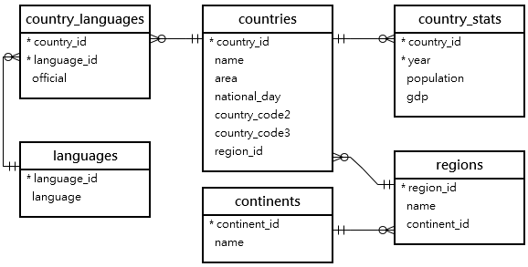
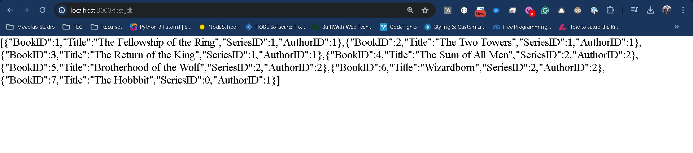

# Interacción con la Base de Datos

Para este laboratorio vamos a comenzar con el trabajo de conectarnos con una base de datos relacional.

El objetivo de este laboratorio es demostrar como realizar fácilmente la conexión y poder interactuar con una base de datos.

El laboratorio asume varios conocimientos que deben de tenerse a este punto por lo que si tienes dudas previo a, o desconoces de los temas te invito a que los revises:

**Pre-requisitos**:
- Conocimiento general de bases de datos relacionales.
- Conocimiento básico del lenguaje SQL.
- Tener instalado una versión de MariaDB en tu computadora.
- De preferencia tener una pequeña base de datos para poder hacer la conexión y pruebas fuera del laboratorio.

Si bien estaremos utilizando MariaDB para la realización de este laboratorio es importante mencionar que solo es por usar una base de datos, en la realidad el conocimiento aplicado puede aplicarse a cualquier tipo de base de datos relacional, solo deberías poder encontrar el conector correspondiente a tu base de datos de elección.

# Conexión con MariaDB

Vamos a iniciar un nuevo proyecto con **npm init** y vamos a instalar las librerías de express y el body-parser, así como vamos a agregar una nueva librería.

```
npm i mariadb
```

Una vez tengamos nuestro package.json preparado vamos a crear la plantilla base de nuestro servidor.

```
const http    = require('http');
const express = require('express');
const path    = require('path');
const fs      = require('fs');
const app     = express();

const bodyParser = require('body-parser');
app.use(bodyParser.urlencoded({extended: false}));
app.use(express.static(path.join(__dirname, 'public')));

app.get('/', (request, response, next) => {
    response.setHeader('Content-Type', 'text/plain');
    response.send("Hola Mundo");
    response.end(); 
});

const server = http.createServer( (request, response) => {    
    console.log(request.url);
});
app.listen(3000);
```

Y vamos a correrlo como siempre:

```
pm2 start index.js --watch
```

También no olvides que si trabajas con un repositorio debes agregar el archivo **.gitignore**.

Ahora bien, vamos a comenzar creando nuestra configuración para MariaDB, de momento lo realizaré directamente desde la raíz del proyecto, pero lo mismo que estoy haciendo debe hacer desde la carpeta de modelos de tu proyecto, esto cuando estemos trabajando con MVC.

Para comenzar con el código vamos a crear una conexión con la base de datos, sobre la ruta **/** vamos a añadir lo siguiente:

```
const mariadb = require("mariadb");
const pool = mariadb.createPool({
    host:"localhost",
    user:"root",
    password:"root",
    connectionLimit:5
});

```

Deberás sustituir los valores de **user** y **pass** por los que hayas configurado en tu base de datos al momento de instalarla. Recuerda que para entornos de producción lo ideal es tener contraseñas largas para añadirle dificultad al acceso de la base de datos.

Ahora antes de hacer cualquier cosa vamos a añadir unos datos dentro de MariaDB para poder probarlo.



La base de datos que vamos a crear se llamará **test**

Desde tu DBMS favorito ejecuta los siguientes comandos:

```
CREATE DATABASE IF NOT EXISTS test;

USE test;

CREATE TABLE IF NOT EXISTS books (
  BookID INT NOT NULL PRIMARY KEY AUTO_INCREMENT, 
  Title VARCHAR(100) NOT NULL, 
  SeriesID INT, AuthorID INT);

CREATE TABLE IF NOT EXISTS authors 
(id INT NOT NULL PRIMARY KEY AUTO_INCREMENT);

CREATE TABLE IF NOT EXISTS series 
(id INT NOT NULL PRIMARY KEY AUTO_INCREMENT);

INSERT INTO books (Title,SeriesID,AuthorID) 
VALUES('The Fellowship of the Ring',1,1), 
      ('The Two Towers',1,1), ('The Return of the King',1,1),  
      ('The Sum of All Men',2,2), ('Brotherhood of the Wolf',2,2), 
      ('Wizardborn',2,2), ('The Hobbbit',0,1);
```

Para validar que se ejecutó correctamente la creación de la base de datos revisa con lo siguiente:

```
SHOW TABLES;
```

El resultado debería ser algo como lo siguiente:
```
+----------------+
| Tables_in_test |
+----------------+
| authors        |
| books          |
| series         |
+----------------+
```

También podemos ver el contenido de books por ejemplo:

```
DESCRIBE books;
```

El resultado sería:

```
+----------+--------------+------+-----+---------+----------------+
| Field    | Type         | Null | Key | Default | Extra          |
+----------+--------------+------+-----+---------+----------------+
| BookID   | int(11)      | NO   | PRI | NULL    | auto_increment |
| Title    | varchar(100) | NO   |     | NULL    |                |
| SeriesID | int(11)      | YES  |     | NULL    |                |
| AuthorID | int(11)      | YES  |     | NULL    |                |
+----------+--------------+------+-----+---------+----------------+
```

Por último hagamos una consulta de prueba para estar seguros que todo funciona correctamente:

```
SELECT * FROM books;
```

```
+--------+----------------------------+----------+----------+
| BookID | Title                      | SeriesID | AuthorID |
+--------+----------------------------+----------+----------+
|      1 | The Fellowship of the Ring |        1 |        1 |
|      2 | The Two Towers             |        1 |        1 |
|      3 | The Return of the King     |        1 |        1 |
|      4 | The Sum of All Men         |        2 |        2 |
|      5 | Brotherhood of the Wolf    |        2 |        2 |
|      6 | Wizardborn                 |        2 |        2 |
|      7 | The Hobbbit                |        0 |        1 |
+--------+----------------------------+----------+----------+
```

## Funciones asíncronas

Ahora vamos a regresar a nuestro archivo **index.js**, en donde vamos a crear una url que se llame **/test_db**.

Para ello vamos a introducir lo siguiente:

```
app.get('/test_db', (request, response, next) => {
    let conn;

    try{
        conn = await pool.getConnection();
        const rows = await conn.query("SELECT * FROM books")
        console.log(rows);
        const jsonS = JSON.stringify(rows);
        response.writeHead(200, {'Content-type':'text/html'});
        response.end(jsonS);
    }catch(e){

    }
});
```

Antes de guardar **index.js** es probable que veas 2 errores en el código, y si no lo remarca tu editor, no te preocupes aquí te digo que el código no va a funcionar.

Lo que sucede es la forma en que estamos añadiendo la función que resuelve **/test_db**, si podemos simplificar la función tendríamos lo siguiente:

```
(request, response, next) => {})
```

La anterior es lo que ya vimos como una función anónima, pues al momento no le hemos generado un nombre, y como ya hemos visto es la forma en que podemos resolver las funciones dentro de nuestras rutas.

Ahora debemos entender un poco como funcionan las Bases de Datos. Independientemente de donde nos conectemos sea en la misma computadora con localhost o a otro servidor, el tiempo que tarda la base de datos en responder es desconocido, y esto es importante que lo entendamos pues al conectarte a cualquier otro espacio no controlamos este tiempo. Esto pueden ser segundos o milisegundos pero al final no es un tiempo constante.

Cuando ejecutamos un programa la secuencia de instrucciones del código son secuenciales, pero el problema de ciertas llamadas a conexiones externas al no controlar el tiempo de respuesta puede provocar que se tarde mucho en responder.

En programación general, simplemente escribimos el código y no nos preocupamos por esto pero ya en un desarrollo más avanzado como desarrollo web y conexión entre servidores veremos que tenemos que adecuarnos a otro estilo de programación.

Aquí es donde surgen las funciones asíncronas las cuales su objetivo es específicamente resolver el conflicto de tiempo de espera con código que puede tardar mucho tiempo, algunas acciones que pueden generar un tiempo de espera por mencionar algunas sería:

  - Conexión o ejecución de comandos en una BD.
  - Escritura/lectura de un archivo
  - Conexión a internet

Pueden existir más casos pero al menos estos son los más representativos.

Ahora, para definir una función asíncrona es muy sencillo, vamos a actualizar nuestra función a lo siguiente:

```
async (request, response, next) => {})
```

Dentro de esto vamos a tener que agregar la palabra reservada **async** que le permitirá a nuestra función saber que puede ejecutar código asíncrono.

Si volvemos el código completo de nuestra ruta se vería de la siguiente manera:

```
app.get('/test_db', async(request, response, next) => {
    let conn;

    try{
        conn = await pool.getConnection();
        const rows = await conn.query("SELECT * FROM books");
        console.log(rows);
        const jsonS = JSON.stringify(rows);
        response.writeHead(200, {'Content-type':'text/html'});
        response.end(jsonS);
    }catch(e){

    }
});
```

Veremos entonces, que ahora sí se resuelve el conflicto, y este venía específicamente en la sección:

```
await conn.query("SELECT * FROM books");
```

Aquí estamos haciendo uso de la palabra reservada **await**, para poder usar el await, es necesario hacer uso del async, por tanto se complementan la una a la otra en el formato de **async/await**.

Si bien al usar el async, estamos diciendo que nuestra función es asíncrona, puede o no utilizarse el await internamente.

Como resultado y conclusión te recomiendo que todas las funciones de tu proyecto las definas como **async** para que en cualquier momento puedas hacer uso del **await** si lo necesitas, y en caso de que no, pues tu código ya estaría preparado para ello.

También debemos resaltar que sucede cuando el código llega a la línea del **await**, lo que pasa es que como la palabra reservada nos dice, el código entra en un modo espera a que se ejecute la instrucción externa, en este caso el query a la base de datos y hasta que no termine podemos continuar donde nos quedamos.

Esto nos permite mantener un código secuencial para ello. Algo que mencionaremos pero no implementaremos, es que antes de que existiera **async/await** utilizábamos algo conocido como promesas y callbacks, en ocasiones se puede utilizar pero el código se vuelve más difícil de leer.

Sin embargo todo el código en formato de promesas puede convertirse en **async/await** y viceversa.

Ahora sí vamos a guardar el archivo **index.js**. Vamos a ver en el navegador el resultado:



Éxito, hemos conectado nuestro proyecto con nuestra base de datos y ahora podemos ejecutar comandos a la base de datos.

**Siguientes pasos:**

Lo siguiente es que pases tu conexión de este laboratorio a tu modelo usando la arquitectura Modelo-Vista-Controlador.

También necesitas cuidar mucho como proteger la información, pues existen varios puntos de seguridad a cuidar, el más elemental es la inyección de sql, la cual te pido investigues y para validar el conocimiento de este laboratorio, tomes conciencia de la implicación que tendría.

Hemos abierto una puerta a mucho poder dentro de nuestras aplicaciones web, pero eso también nos lleva a tener que proteger mucho la información que estamos obteniendo.

La documentación que puedes consultar para entender que otros comandos contiene la librería de mariadb puedes encontrarlos [desde aquí.](https://mariadb.com/docs/server/connect/programming-languages/nodejs/)

[Ver ejemplo completo](/node/tutorials/intro_web/Lab17BD/test-project.zip)