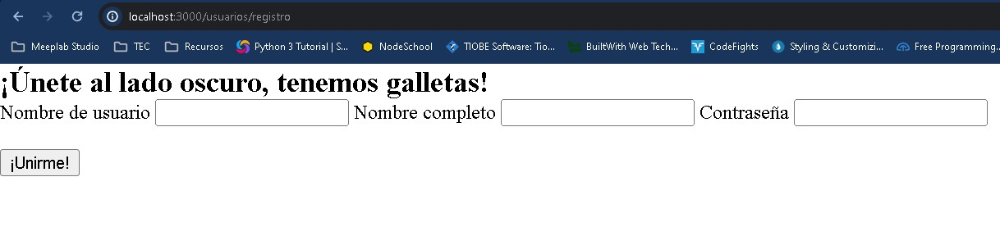
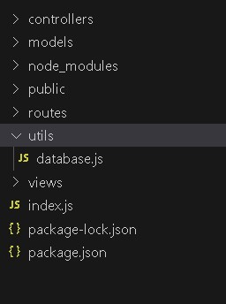
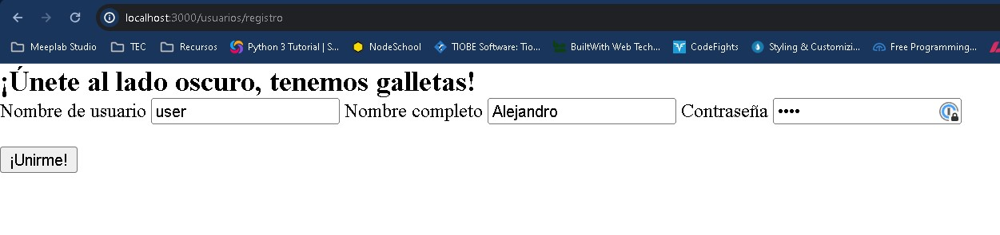
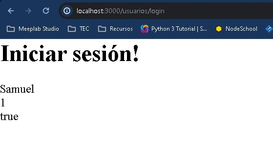
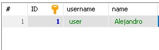
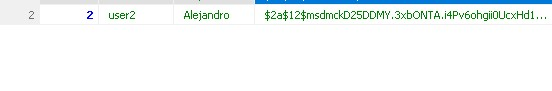
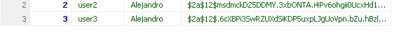
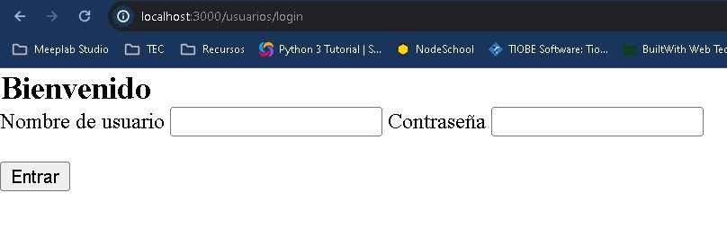
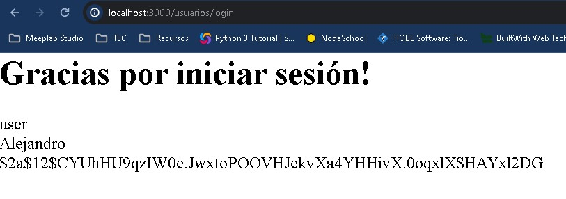
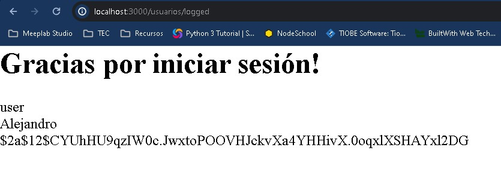

# Autenticación

## Registrar un usuario

Con lo que hemos aprendido en prácticas anteriores hemos conocido nuestro front-end y nuestro back-end. Hemos logrado crear una estructura que nos permite trabajar con nuestros proyectos y más allá hemos logrado conectarnos con una fuente de datos para transmitir información. Hasta el momento hemos cubierto las piezas de lo que significa el desarrollo web, pero ahora es momento de empezar a pegar todo lo que hemos aprendido y realmente empecemos a crear proyectos extraordinarios.

En esta práctica trabajaremos en el manejo de sesión de usuario, que como vimos en lecciones anteriores hace uso de las cookies para manejar la sesión. Por sí sola la sesión no nos sirve de nada, necesitamos haber establecido un proceso para ellos, ya que empiezas a conocer sobre UML y su notación, vamos a empezar a trabajar con Diagramas de Secuencia para definir nuestros casos de Uso.


Dentro de este diagrama podemos identificar el caso de uso de registrar usuario.

Dependiendo de la forma en que trabajemos podemos separar este diagrama en partes o trabajarlo todo como uno solo tal y como viene en el ejemplo, un buen ingeniero de software no piensa en los detalles de cuantos o como mostrarlo, sino que el diagrama explique tal cual como está construido el elemento de software.

Vamos a tomar como referencia nuestro laboratorio de MVC para practicar, te dejo una copia que puedes descargar para comenzar con la plantilla que ya teníamos.

[Descargar plantilla proyecto](/node/tutorials/intro_web/Lab18Autenticacion/MVC.zip)

Para correr el proyecto no te olvides de ejecutar:

```
npm install
pm2 start index.js --watch
pm2 logs
```

Ya tenemos la última versión de nuestro servidor corriendo, por lo que podemos empezar a trabajar con nuestro caso de uso.

### Renderizar el EJS del Registro

En primer lugar vamos a establecer el camino a seguir cuando el usuario sigue la ruta **/registro** con un **GET**. Como ya hemos visto el uso del GET en una url, por lo general hace que carguemos una vista o un EJS.

Vamos a nuestra carpeta de **views** y dentro de **usuarios** ya teníamos definido **registro.ejs** pero no agregamos ningún código de EJS. Vamos a agregarlo:

```
<html>
    <head>
        <%- include('./../css.ejs') %>
    </head>
    <body>
        <h2 class="title"><% if (registro) { %>¡Únete al lado oscuro, tenemos galletas!<% } else { %>Bienvenido<% } %></h2>
        <form action="/usuarios/<% if (registro) { %>registro<% } else { %>login<% } %>" method="POST">
            <label class="label" for="username">Nombre de usuario</label>
            <input class="input text" id="username" name="username">
            <% if (registro) { %>
                <label class="label" for="name">Nombre completo</label>
                <input class="input text" id="name" name="name">
            <% } %>
            <label class="label" for="password">Contraseña</label>
            <input class="input text" type="password" id="password" name="password">
            <br><br>
            <input class="button is-success" type="submit" value="<% if (registro) { %>¡Unirme!<% } else { %>Entrar<% } %>">
        </form>
    </body>
    <%- include('./../scripts.ejs') %>
</html>
```

Usaremos este mismo ejs para cargar más adelante el login, observa como utilizamos el EJS para diferenciar entre un usuario ya existente y uno que apenas va comenzando.

Antes de correr nuevamente la aplicación en el navegador, nos hace falta agregar la función en **usuarios.controller.js** y actualizar **usuarios.routes.js**.

Para hacerte entender el diagrama y la construcción del mismo, voy a obviar algunos pasos para obligarte a que lo estés revisando y sepas donde colocar el método, como este es el primero te daré una ayuda. En **usuarios.controller.js** agrega lo siguiente:

```
module.exports.get_registro = async(req,res) =>{
    res.render("usuarios/registro",{registro:true});
}
```

Ahora actualicemos la ruta:

```
router.get('/registro', controller.get_registro);
```

Guarda todos los archivos y corre en tu navegador la ruta correspondiente, deberías ver lo siguiente:



### Registrar un usuario en la BD

> Nota: Para la siguiente sección asegúrate que tu base de datos este corriendo y este bien configurada como vimos en el laboratorio anterior.

Ahora bien, ya tenemos nuestra vista para que el usuario introduzca información, ahora es momento de obtener dicha información a través del form que contiene nuestro EJS.

Del lado del EJS, no necesitamos agregar nada más, pero ahora debemos recibirlo en nuestra ruta y controlador correspondiente, vamos a añadir el código, recuerda verificar el diagrama de secuencia para saber exactamente en donde.

```
module.exports.post_registro = async(req,res) =>{
    console.log(req.body.username);
    console.log(req.body.password);
}
```

```
router.post('/registro', controller.post_registro);
```

Vamos nuevamente a nuestro navegador y vamos a intentar cargar nuevamente la vista y agreguemos la información, al enviar el formulario deberíamos obtener:

En el navegador veremos:


Y en la consola deberíamos ver:
```
0|index  | user
0|index  | demo
```

Muy bien, logramos subir nuestros datos al servidor.

Ahora vamos a ver un paso que no hemos realizado hasta ahora y es como definir nuestros modelos, dentro haciendo la conexión a la Base de Datos.

Si tomamos como base nuestro ya definido **usuarios.model.js**, teníamos lo anterior:

```
exports.login = function(correo,contrasena){
    return {
        nombre:"Samuel",
        id:1,
        activo:true
    };
}
```

Aquí definimos una función para manejar los datos, pero idealmente una clase de base de datos y un modelo incluyen las **Entidades** y las funciones que ejecutan. Las entidades no son más que las propiedades que contienen nuestras tablas de la base de datos, en otras palabras el resultado de los queries que vamos a obtener y por lo general van alineados a las tablas, en queries complejos puedes crear entidades complejas que incluyan más datos que una tabla normal, pero una de las razones de "duplicar la información", es que necesitamos protegernos ante cualquier ataque a la base de datos por lo que evitamos responder con los datos tal cual como vienen de la misma.

Aquí es donde podemos hacer uso de las clases y objetos de javascript, creando algo como lo siguiente:

```
exports.User = class  {
    //Constructor de la clase. Sirve para crear un nuevo objeto, y en él se definen las propiedades del modelo
    constructor(my_username, my_name, my_password) {
        this.username = my_username;
        this.name = my_name;
        this.password = my_password;
    }
    //Este método servirá para guardar de manera persistente el nuevo objeto. 
    async save() {
        try {
            const connection = await db();
            const result = await connection.execute(
            `INSERT INTO users (username, name, password) VALUES (?, ?, ?)`,
            [this.username, this.name, this.password]
            );
            await connection.release();
            return result;
        } catch (error) {
            throw error; // Re-throw the error for proper handling
        }
    }
    //Este método servirá para buscar un usuario por username
    //Es estático ya que a diferencia de save(), el primero se guarda al crear un usuario siempre, pero en este segundo podemos buscar un usuario sin crear un nuevo objeto usuario.
    static async findUser(username) {
        try {
            const connection = await db();
            const result = await connection.execute('Select * from users WHERE username = ?', [username]);
            await connection.release();
            return result;
        } catch (error) {
            throw error; // Re-throw the error for proper handling
        }
    }
}

```

Ahora verás que dentro de **save()** y **findUser()** hacemos referencia a una variable **db** que no existe, y esto es por que la configuración de nuestra bd la dejamos en el archivo **index.js**, idealmente necesitamos separar la configuración en un archivo aparte, por lo que dentro de una nueva carpeta del proyecto a la que llamaremos **utils**  crearemos el archivo database.js.

La carpeta **utils** contiene por lo general archivos de configuración o archivos globales que se utilizan a través de todo el proyecto. Poco a poco ahondaremos más en esta carpeta.



Dentro de **database.js** vamos a abstraer la conexión que ya teníamos de la base de datos en **index.js**

```
const mariadb = require("mariadb");

const pool = mariadb.createPool({
    host:"127.0.0.1",
    user:"root",
    password:"root",
    database: "users_test",
    connectionLimit:5
});

module.exports = async () => {
    try {
        const connection = await pool.getConnection();
        return connection;
    } catch (error) {
        throw error; // Re-throw the error for proper handling
    }
};
```

Las primeras 2 partes son las mismas que tenemos en el **index.js** para la configuración, pero para exportar la función observa que definimos una función asíncrona para facilitarnos la conexión y en caso de tener algún error siempre es importante regresar el error, esto para casos alternativos como el de nuestro diagrama de secuencia.

Ahora ya tenemos la conexión de nuestro modelo con el archivo de configuración de la base de datos. Como mención especial, logramos ejecutar el código manejando errores, y también hacemos uso de **await connection.release();**, esto para liberar la conexión al momento de terminar, ya que si bien en los casos normales se borra recuerda que tenemos un número limitado de conexiones, así que hay que estar seguros de eliminar la conexión una vez que dejamos de usarla.

Por último no olvide agregar o importar la configuración hasta arriba en tu modelo:

```
const db = require('../utils/database.js');
```

Ahora deberemos actualizar nuestro controlador con lo siguiente para poder registrar el usuario

```
module.exports.post_registro = async(req,res) =>{
    try {
        const username = req.body.username;
        const name = req.body.name; // Assuming you have a 'name' field in the request body
        const password = req.body.password;
    
        const user = new model.User(username, name, password);
        const savedUser = await user.save();

        res.status(201).redirect("/usuarios/login");
    
    } catch (error) {
        console.error(error);
        res.status(500).json({ message: "Error registering user!" }); // Idealmente se crea una plantilla de errores genérica
    }
}
```

Antes de continuar, nos hace falta algo, ya tenemos el software, pero no hemos declarado nuestra base de datos ni la tabla dentro de la misma.

```
CREATE DATABASE IF NOT EXISTS users_test;

USE users_test;

CREATE TABLE IF NOT EXISTS users (
    ID INT NOT NULL PRIMARY KEY AUTO_INCREMENT,
    username VARCHAR(100), 
    name VARCHAR(100), 
    password VARCHAR(100)
    );
```

Ya que hemos guardado nuestra base de datos, guarda todo y vamos a probar en el navegador:



Si el resultado es correcto entonces, deberíamos ver la url de **login**



Pero más importante aún, debemos revisar nuestra base de datos:



Lo hemos conseguido, tenemos una vista con EJS, que manda datos y los guarda en la base de datos usando el modelo. Todo un uso completo de la arquitectura MVC.

## Encriptación de la contraseña

Ahora que hemos alcanzados nuevos conocimientos viene la apertura a nuevos retos, y como podrás ver tenemos uno muy importante que cubrir, la contraseña, literalmente.

Como en todo buen sistema lo ideal es tener un sistema de encriptación adecuado, no es objetivo del curso que empieces a crear tu propio algoritmo de encriptación y si tu enfoque no es en ciberseguridad, te recomiendo que uses uno de los que ya existen en la industria pues además de ser ya probados ayudan estandarizar uno de los puntos más importantes de nuestro sistema.

Como ya lo hemos echo previamente, haremos uso de una nueva librería, está nos ayudará a este paso de encriptación, para instalarla haremos uso de la instrucción que ya conocemos:

```
npm i bcryptjs
```

Esta librería no requiere que la configuremos desde el index.js, más bien podemos usarla desde nuestro modelo directamente:

Primero vamos a declarar la librería en la parte superior debajo de la declaración del archivo de configuración de la base de datos:

```
const db     = require('../utils/database.js');
const bcrypt = require('bcryptjs');
```

Ahora vamos a agregar la siguiente línea:

```
const hashedPass = await bcrypt.hash(this.password, 12)
```

Aquí estamos generando una contraseña a través de una llave hash, el 12, que estamos añadiendo es el número de rondas de lo que se conoce como salteo, y quiere decir que 12 veces se agrega información aleatoria a la contraseña para que sea más difícil de romper. Este curso no cubre los conceptos teóricos de ciberseguridad, si tienes más duda del algoritmo de hash y el salteo pregunta a tu profesor o investiga en internet.

Así entonces debemos actualizar la función **save()** a lo siguiente:

```
async save() {
        try {
            const connection = await db();
            const hashedPass = await bcrypt.hash(this.password, 12)
            const result = await connection.execute(
            `INSERT INTO users (username, name, password) VALUES (?, ?, ?)`,
            [this.username, this.name, hashedPass]
            );
            await connection.release();
            return result;
        } catch (error) {
            throw error; // Re-throw the error for proper handling
        }
    }
```

Si volvemos a guardar el formulario deberíamos ver algo como lo siguiente:



He usado la misma contraseña demo, e incluso si tu haces lo mismo verás que el resultado es diferente, a esto nos referimos con añadirle sal a la contraseña creando un resultado único aunque utilicemos la misma contraseña, veamos el ejemplo añadiendo una más con el mismo demo.



Observa que aunque empieza similar, eventualmente cambia, esto se debe a varias razones, el tipo de contraseña, que es la misma, el algoritmo que estamos ejecutando y el número de rondas de salteo. Aquí no hay una fórmula perfecta, en ciberseguridad siempre podemos añadir más, pero ese extra es procesamiento añadido así que ten cuidado en no exceder demasiado.

Hasta aquí hemos cubierto todo nuestro diagrama de secuencia, agrega los casos alternos para completar el ejercicio de la práctica.

## Comparación de la contraseña

Ya que estamos usando un algoritmo de encriptación ahora es el momento de guardar poder hacer un inicio de sesión como se debe.

Pero primero debemos ajustar nuestro login, ya que cuando hacemos el registro carga el EJS del laboratorio anterior.

Vamos a actualizar la función **render_login** a lo siguiente:

```
module.exports.render_login = async(req,res) =>{
    res.render("usuarios/registro",{
        registro: false
    });
}
```

Así cuando agreguemos un nuevo usuario o entremos directamente a la url veremos lo siguiente:



Como el código del ejs ya estaba preparado no necesitamos realizar más adecuaciones en el GET.

Ahora vamos al POST, la función **do_login**, aquí queremos validar el usuario y la contraseña introducidas por el usuario. Por tanto vamos a agregar lo siguiente:

```
module.exports.do_login = async(req,res) =>{
    try {
        const usuarios = await model.User.findUser(req.body.username)

        if(usuarios.length < 1){
            res.render("usuarios/registro",{
                registro: false
            });
            return;
        }

        const usuario = usuarios[0];
        const doMatch = await bcrypt.compare(req.body.password, usuario.password);

        if(!doMatch) {
            res.render("usuarios/registro",{
                registro: false
            });
            return;
        }

        req.session.username = usuario.username;
        req.session.isLoggedIn = true;
        res.render('usuarios/logged',{
            user:usuario
        });

    }catch (error){
        res.render("usuarios/registro",{
            registro: false
        });
    }        
}
```

Como vamos a necesitar bcrypt, también no debemos olvidar importarla debajo de la definición del modelo:

```
const model  = require("../models/usuarios.model.js");
const bcrypt = require('bcryptjs');
```

Ahora necesitamos crear una nueva vista dentro de **views->usuarios** a la que llamaremos **logged.ejs**, esta contendrá lo siguiente:

```
<html>
    <head>
        <%- include('./../css.ejs') %>
    </head>
    <body>
        <h1>Gracias por iniciar sesión!</h1>
        <p><%= user.username %></p>
        <p><%= user.name %></p>
        <p><%= user.password %></p>
    </body>
    <%- include('./../scripts.ejs') %>
</html>
```

Si guardamos todo y ejecutamos el proceso veremos nuestro login y en el caso correcto debería cargar la siguiente vista:



Aquí seguimos un paso a paso del inicio de sesión:

1. Buscamos al usuario en la base de datos.
2. Si NO encontramos usuario regresamos al inicio de sesión.
3. Comparamos las contraseña con el método compare de bcrypt, que recibe una contraseña plana y el hash.
4. Si NO hacen match las contraseñas regresamos al inicio de sesión.
5. Si encontramos usuario manejamos la sesión del usuario en el servidor y cargamos la vista de logged.

Hemos logrado iniciar la sesión con el usuario de nuestra base de datos, pero ¿qué pasa si regresamos a **/usuarios/login**?. Volveremos al formulario de inicio de sesión, esto no es un comportamiento adecuado, pues el servidor ya está manejando nuestra sesión, por lo que debemos actualizar **render_login** a lo siguiente:

```
module.exports.render_login = async(req,res) =>{
    res.render("usuarios/registro",{
        registro: false
    });
}
```

Ahora bien, por facilidad, vamos a crear una nueva ruta para **/usuarios** que se llame **/logged**. Este paso lo haré directo pues ya debes estar acostumbrado a crear rutas y controladores:

```
router.post('/logged', controller.get_logged);
```

```
module.exports.get_logged = async(req,res) =>{
    try {
        const usuarios = await model.User.findUser(req.session.username)
        if(usuarios.length < 1){
            res.render("usuarios/registro",{
                registro: false
            });
            return;
        }

        const usuario = usuarios[0];
        res.render('usuarios/logged',{
            user:usuario
        });
    }catch (error){
        res.render("usuarios/registro",{
            registro: false
        });
    }
}
```

Aquí no necesitamos volver a hacer el login, pues ya tenemos iniciada la sesión, peri sí necesitamos buscar al usuario.

Intenta a iniciar sesión nuevamente, y accede a nuestra nueva url:



Esto funcionará mientras la sesión esté activa, pero si reinicias el servidor, e intentas entrar serás redirigido al inicio de sesión, pero ahora necesitamos distinguir cuando hemos iniciado sesión y cuando no de una manera más sencilla.

## Middleware de autenticación de sesión

Como ya mencionamos previamente la carpeta **utils** del proyecto contiene archivos y funciones que son utilizadas en todo el proyecto no solo por un solo tipo de archivo (vistas, controladores,modelos, rutas). Y como hemos platicado de prácticas anteriores tenemos middlewares, bloques de código o funciones que se ejecutan antes de realizar la función principal.

Este es el mejor momento de usar un middleware ya que queremos una función genérica que verifique nuestra sesión con el servidor, para ello vamos a crear dentro de la carpeta **utils** un archivo que llamaremos **is-auth.js** el cual deberá contener lo siguiente:

```
module.exports = (request, response, next) => {
    if (!request.session.isLoggedIn) {
        return response.redirect('/users/login');
    }
    next();
}
```

Is-auth está diseñado para verificar la sesión, si por alguna razón la validación falla redirige directamente al login, pero en caso de que no, permite pasar.

Para proteger nuestras rutas, lo que debemos hacer es primero declarar el nuevo archivo:

```
const express = require('express');
const router = express.Router();
const controller = require("../controllers/usuarios.controller.js")
const isAuth = require('../util/is-auth');
```

Y ahora cada vez, que queramos usar el middleware necesitamos anteceder la llamada antes de la llamada al controlador de la siguiente manera:

```
router.get('/logged', isAuth, controller.get_logged);
```

Nuevamente, al llamarse /logged, se ejecutaría primero el middleware verificando la sesión, y en caso de que funcione entonces pasaría a get_logged, pero en caso de que no se quedaría en el middleware redirigiendo al loggin.

Para sistemas administrativos esto es ideal por que te permite bloquear todas las urls de acceso no autorizado e incluso personalizar los mensajes de error para que el usuario sepa en donde está.

Todavía existen varias optimizaciones que podemos realizar como agregar un token de seguridad para ataques CSRF, o el manejo de errores para el inicio de sesión y que el usuario sepa que algo salió mal, incluso mejoras sustanciales al código para hacerlo más genérico, como siempre es cuestión de práctica y que te vayas adaptando a los nuevos conceptos.

[Ver ejemplo completo](/node/tutorials/intro_web/Lab18Autenticacion/test-project.zip)