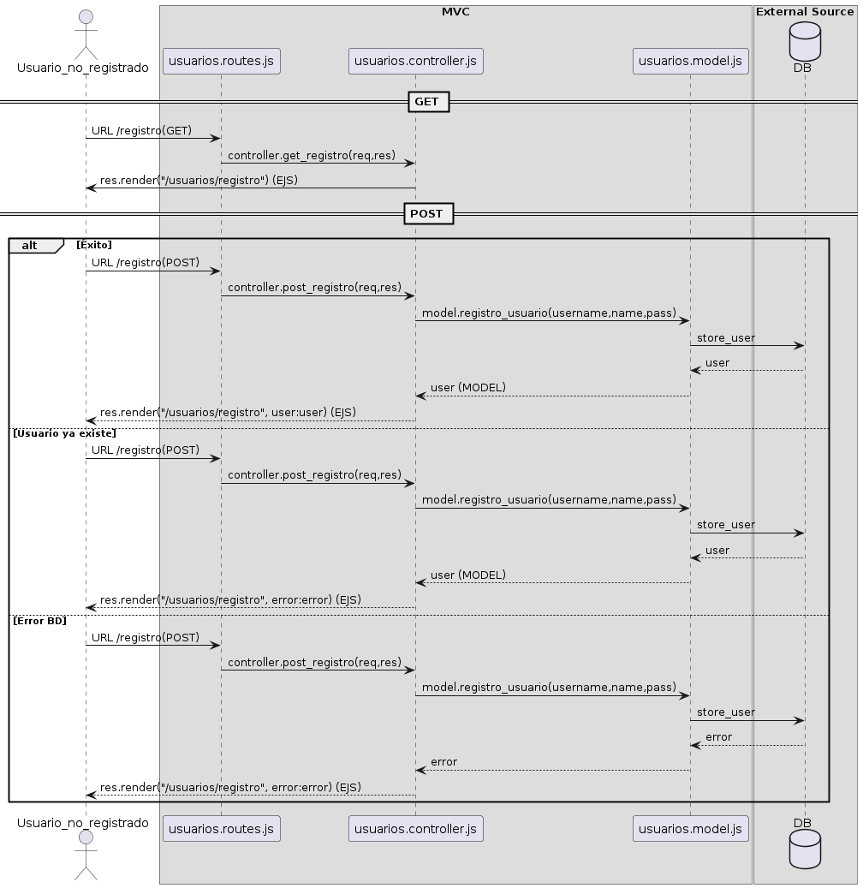

# Autenticación (PostgreSQL + Supabase)

En el laboratorio anterior conectamos nuestro proyecto de NodeJS con Supabase, aprendimos a parametrizar queries y vimos el bonus de Row Level Security. Ahora vamos a construir encima de ese mismo proyecto la pieza más sensible que vas a manejar de aquí en adelante: **la autenticación de usuarios**.

La meta del laboratorio es que termines con un flujo completo de **registro → login → ruta protegida**, donde:

1. Las contraseñas viajan a la base **encriptadas con bcrypt** (nunca en texto plano).
2. La sesión del usuario se mantiene en el servidor con `express-session`.
3. Las rutas privadas están protegidas por un middleware reutilizable.
4. Conoces, aunque sea conceptualmente, **Argon2** — el algoritmo que actualmente recomienda OWASP por encima de bcrypt para proyectos nuevos.

**Pre-requisitos**:
- Tener funcionando el `test-project/` del **Lab17BDSupabase** — pool de `pg`, `.env` con `DATABASE_URL`, estructura MVC con `models/`, `controllers/`, `routes/`, `views/` y `util/database.js`.
- Recordar el manejo de sesiones del **Lab14Sesiones** — vamos a reusar `express-session`.
- Conocer el flujo de queries parametrizadas (`$1, $2, $3`) que vimos en el lab anterior.

> **Nota**: este laboratorio convive con **Lab18Autenticacion** (la versión MariaDB). Si tu curso está en la pista Supabase, ignora esa versión — todo lo que necesitas está aquí.

## El flujo en un diagrama

Antes de tocar código, mira el diagrama de secuencia del caso de uso "registrar un usuario". Es el mismo diagrama del lab original — el flujo entre rutas, controladores, modelo y base de datos no cambia con el motor que uses; lo único que cambia es **cómo** el modelo habla con la base. Aquí ese "cómo" es `pg` contra Supabase en lugar de `mariadb` contra MariaDB local.



Identifica los tres flujos del diagrama:

- **\[Éxito\]** — el usuario es nuevo, la BD acepta el INSERT y redirigimos al login.
- **\[Usuario ya existe\]** — el `username` ya está tomado; respondemos con error.
- **\[Error BD\]** — la conexión a Supabase falla; respondemos con un 500.

A medida que escribimos cada función vas a poder ubicar exactamente en qué flecha del diagrama estás. Si en algún punto te pierdes, regresa al diagrama: cada archivo que crees corresponde a una "lifeline" (línea vertical) y cada llamada `await` cruza una flecha.

## 1. Crear la tabla `users` en Supabase

Entra al **SQL Editor** de tu proyecto Supabase (el que creaste en el Lab17.5) y ejecuta:

```sql
CREATE TABLE IF NOT EXISTS users (
    id        SERIAL PRIMARY KEY,
    username  VARCHAR(60)  NOT NULL UNIQUE,
    name      VARCHAR(120),
    password  VARCHAR(255) NOT NULL
);

CREATE INDEX IF NOT EXISTS idx_users_username ON users (username);
```

Cuatro decisiones de diseño vale la pena explicar:

- **`SERIAL PRIMARY KEY`** — es el equivalente PostgreSQL de `AUTO_INCREMENT`. Internamente Postgres crea una secuencia (`users_id_seq`) y asigna el siguiente valor en cada INSERT.
- **`UNIQUE` en `username`** — evita usuarios duplicados a nivel de la base, no solo de la aplicación. Si tu controlador olvidara validarlo, la base lanza un error de constraint y nunca se inserta. Es **defensa en profundidad**: la regla vive en dos lugares.
- **`VARCHAR(255)` en `password`** — los hashes de bcrypt ocupan ~60 caracteres, los de Argon2 ~95–100. 255 nos da margen para cualquier algoritmo presente o futuro y es la convención que usan la mayoría de los frameworks (Rails, Django, Laravel).
- **Índice en `username`** — toda búsqueda de login va a ser `WHERE username = $1`. Sin índice, Postgres haría un scan secuencial; con el índice, encuentra al usuario en una fracción de milisegundo aunque tengas millones de filas.

Verifica en **Table Editor > users** que la tabla apareció con sus 4 columnas y vacía.

> **Regla práctica**: nunca pongas un `LIMIT` artificial corto en el `VARCHAR` de un campo que vas a hashear. Los algoritmos modernos pueden producir hashes más largos de lo que esperas, y truncar un hash lo invalida silenciosamente.

## 2. Activar las sesiones en `index.js`

Ya conoces `express-session` del Lab14. Aquí lo único nuevo es leer el secret desde `.env` para no hardcodearlo. Si todavía no lo tienes instalado en tu proyecto:

```bash
npm i express-session
```

En `index.js`, **antes** de registrar las rutas (`app.use('/games', ...)`), agrega:

```javascript
const session = require('express-session');

app.use(session({
    secret: process.env.SESSION_SECRET || 'cambia-esto-en-desarrollo',
    resave: false,
    saveUninitialized: false
}));
```

Y agrega al `.env`:

```
SESSION_SECRET=una-cadena-larga-y-aleatoria-de-al-menos-32-caracteres
```

> **Nota**: el `secret` se usa para firmar la cookie de sesión. Si alguien adivina o filtra ese string, puede falsificar cookies y suplantar a cualquier usuario. En desarrollo cualquier valor sirve, pero en producción genera uno con `openssl rand -hex 32` y guárdalo en variables de entorno de tu plataforma de despliegue. **Nunca lo subas al repositorio**.

Las opciones `resave: false` y `saveUninitialized: false` son los defaults recomendados por la documentación de `express-session` y evitan escrituras innecesarias al store de sesiones.

## 3. El modelo de usuarios con `pg`

Crea `models/usuarios.model.js`:

```javascript
const pool = require('../util/database.js');

exports.User = class {
    constructor(username, name, password) {
        this.username = username;
        this.name     = name;
        this.password = password;
    }

    async save() {
        const sql = `INSERT INTO users (username, name, password)
                     VALUES ($1, $2, $3)
                     RETURNING id, username, name`;
        const { rows } = await pool.query(sql, [this.username, this.name, this.password]);
        return rows[0];
    }

    static async findByUsername(username) {
        const sql = `SELECT id, username, name, password
                     FROM users WHERE username = $1`;
        const { rows } = await pool.query(sql, [username]);
        return rows[0] || null;
    }
};
```

Si vienes del Lab18 versión MariaDB, hay cuatro diferencias que conviene marcar:

1. **Placeholders `$1, $2, $3`** en lugar de `?`. Es la sintaxis de PostgreSQL — los `?` no funcionan aquí. Lo importante es que **siguen siendo queries parametrizadas**: el driver envía la query y los valores por separado, así que la lección de SQL injection del Lab17.5 sigue protegiéndonos. Y con datos de autenticación, esa protección es todavía más crítica que con un catálogo de juegos.
2. **`RETURNING id, username, name`** — es una característica propia de PostgreSQL. El INSERT, además de guardar la fila, te regresa las columnas que pidas. Eso te ahorra tener que hacer un segundo `SELECT` para conseguir el `id` autogenerado. **Importante**: no incluyas `password` en el `RETURNING` — no quieres que el hash viaje de regreso por el resto de la aplicación.
3. **Sin `getConnection()` / `release()` manual** — el pool de `pg` expone `.query()` directamente, toma una conexión libre, ejecuta y la regresa al pool automáticamente. Esto elimina toda una clase de bugs (conexiones no liberadas que terminan agotando el pool).
4. **`rows[0] || null`** en `findByUsername` — devolver `null` cuando no hay usuario es más limpio que regresar un array vacío. El controlador hace `if (!usuario)` en lugar de `if (usuarios.length < 1)`.

> **La lección clave**: el modelo es la única capa que conoce SQL. Cualquier otra capa que quiera leer o escribir usuarios pasa por estas dos funciones. Si mañana migras de Supabase a otro Postgres, o agregas caché, solo tocas este archivo.

## 4. Vista del formulario y rutas de registro

Crea `views/usuarios/registro.ejs`. Reusa la lógica del lab original — un solo formulario que cambia su acción y su título según el booleano `registro`:

```html
<!DOCTYPE html>
<html lang="es">
<head>
    <meta charset="UTF-8">
    <title><%= registro ? 'Registrarse' : 'Iniciar sesión' %></title>
    <style>
        body { font-family: system-ui, sans-serif; max-width: 420px; margin: 3rem auto; }
        label { display: block; margin-top: 0.8rem; }
        input[type=text], input[type=password] { width: 100%; padding: 0.5rem; box-sizing: border-box; }
        button { margin-top: 1rem; padding: 0.6rem 1.2rem; }
    </style>
</head>
<body>
    <h2><%= registro ? '¡Únete al lado oscuro, tenemos galletas!' : 'Bienvenido' %></h2>

    <form action="/usuarios/<%= registro ? 'registro' : 'login' %>" method="POST">
        <label for="username">Nombre de usuario</label>
        <input type="text" id="username" name="username" required>

        <% if (registro) { %>
            <label for="name">Nombre completo</label>
            <input type="text" id="name" name="name">
        <% } %>

        <label for="password">Contraseña</label>
        <input type="password" id="password" name="password" required>

        <button type="submit"><%= registro ? '¡Unirme!' : 'Entrar' %></button>
    </form>
</body>
</html>
```

Ahora el controlador. Crea `controllers/usuarios.controller.js`:

```javascript
const model = require('../models/usuarios.model.js');

exports.get_registro = (req, res) => {
    res.render('usuarios/registro', { registro: true });
};

exports.post_registro = async (req, res) => {
    try {
        const { username, name, password } = req.body;
        const user = new model.User(username, name, password);
        await user.save();
        res.status(201).redirect('/usuarios/login');
    } catch (e) {
        console.error(e);
        res.status(500).send('Error registrando usuario');
    }
};
```

Y `routes/usuarios.routes.js`:

```javascript
const express = require('express');
const router  = express.Router();
const controller = require('../controllers/usuarios.controller.js');

router.get('/registro',  controller.get_registro);
router.post('/registro', controller.post_registro);

module.exports = router;
```

Finalmente, en `index.js`, registra el módulo de rutas (junto al `gameRoutes` que ya tenías):

```javascript
const usuarioRoutes = require('./routes/usuarios.routes.js');
app.use('/usuarios', usuarioRoutes);
```

Reinicia el servidor y entra a `http://localhost:3000/usuarios/registro`. Llena el formulario con un usuario de prueba (por ejemplo `username: alex`, `name: Alex Demo`, `password: demo123`) y envíalo. El navegador debería redirigir a `/usuarios/login` (que aún no existe — verás un 404 momentáneo, lo arreglamos en la sección 6).

Abre **Table Editor > users** en Supabase. Vas a ver tu fila recién insertada... y la contraseña en **texto plano**. Eso es exactamente el problema que resolvemos en la siguiente sección.

> **Nota**: si te marca un error de duplicado al probar dos veces con el mismo `username`, ¡es la constraint `UNIQUE` haciendo su trabajo! En un sistema serio el controlador detectaría ese error específico (en `pg` el error tiene `code === '23505'`) y respondería con un mensaje claro al usuario. Por ahora el `console.error` y el 500 genérico son suficientes.

## 5. Encriptación con bcrypt

El problema: si alguien (por descuido, por un bug, por un ataque) obtiene tu base de datos, las contraseñas en texto plano son una catástrofe. La solución estándar es **hashear** las contraseñas — aplicar una función matemática unidireccional que produzca un valor del que no se puede recuperar el original.

Instala la librería:

```bash
npm i bcryptjs
```

Modifica `models/usuarios.model.js`. Importa bcrypt arriba del archivo y aplica el hash dentro de `save()`:

```javascript
const pool   = require('../util/database.js');
const bcrypt = require('bcryptjs');

exports.User = class {
    constructor(username, name, password) {
        this.username = username;
        this.name     = name;
        this.password = password;
    }

    async save() {
        const hashedPass = await bcrypt.hash(this.password, 12);
        const sql = `INSERT INTO users (username, name, password)
                     VALUES ($1, $2, $3)
                     RETURNING id, username, name`;
        const { rows } = await pool.query(sql, [this.username, this.name, hashedPass]);
        return rows[0];
    }

    static async findByUsername(username) {
        const sql = `SELECT id, username, name, password
                     FROM users WHERE username = $1`;
        const { rows } = await pool.query(sql, [username]);
        return rows[0] || null;
    }
};
```

El `12` que pasas como segundo argumento es el **cost factor** (rondas de salting). Cada incremento **duplica** el tiempo de cómputo:

| Cost | Tiempo aproximado |
|------|-------------------|
| 10 | ~75 ms |
| 12 | ~250 ms |
| 14 | ~1 s |

> **Sobre el cost factor**: `12` toma alrededor de 250 ms en hardware moderno — suficientemente rápido para un login normal, pero suficientemente lento para que un atacante con tu base no pueda probar millones de contraseñas por segundo. OWASP recomienda actualmente entre **10 y 13** para bcrypt. Subir más aumenta tu factura de CPU sin proporcionalmente mejorar la seguridad.

Reinicia el servidor y registra dos usuarios con la **misma** contraseña (por ejemplo `username: alex2` con `password: demo123`, y luego `username: alex3` con el mismo `password: demo123`). Abre **Table Editor > users** y observa la columna `password`:

```
$2a$12$abcdefghij1234567890XX.somethingHashed1234567890abcde
$2a$12$XYZmnopqrs9876543210YY.completelyDifferentXyzABcdef98
```

Tres cosas que ver en esos hashes:

- **El prefijo `$2a$12$`**: indica el algoritmo (`2a` = bcrypt) y el cost factor (`12`). Esto significa que el hash se autodescribe — al verificar, bcrypt lee el cost del prefijo y reusa el mismo costo para el cómputo de comparación.
- **Los hashes son completamente distintos** aunque la contraseña sea la misma. Eso es el **salt** en acción: bcrypt genera un valor aleatorio único por hash, lo mezcla con la contraseña antes de hashear, y guarda el salt como parte del hash final. Sin salt, dos usuarios con el mismo password tendrían el mismo hash y un atacante podría usar tablas precomputadas (rainbow tables).
- **No hay forma de invertirlo**: dado el hash `$2a$12$abc...`, no existe función que te regrese `demo123`. La única manera de "verificar" es volver a hashear la contraseña que el usuario te da y comparar.

## 6. Login con `bcrypt.compare`

Ahora que las contraseñas viven hasheadas, el login no puede ser un simple `WHERE password = $1`. Tenemos que traer al usuario por `username`, leer el hash, y dejar que bcrypt verifique si la contraseña que el usuario teclea genera el mismo hash.

En `controllers/usuarios.controller.js`, agrega:

```javascript
const bcrypt = require('bcryptjs');

exports.render_login = (req, res) => {
    res.render('usuarios/registro', { registro: false });
};

exports.do_login = async (req, res) => {
    try {
        const usuario = await model.User.findByUsername(req.body.username);
        if (!usuario) {
            return res.redirect('/usuarios/login');
        }

        const doMatch = await bcrypt.compare(req.body.password, usuario.password);
        if (!doMatch) {
            return res.redirect('/usuarios/login');
        }

        req.session.username   = usuario.username;
        req.session.isLoggedIn = true;
        res.render('usuarios/logged', { user: usuario });

    } catch (e) {
        console.error(e);
        res.redirect('/usuarios/login');
    }
};
```

Tres detalles importantes:

1. **`bcrypt.compare(plano, hash)`** — el orden importa. El primer argumento es la contraseña en texto plano que el usuario te mandó; el segundo, el hash que sacaste de la base. Internamente bcrypt extrae el salt y el cost del hash, vuelve a hashear el plano con esos mismos parámetros y compara byte a byte.
2. **Mismo redirect en "usuario no existe" y "contraseña incorrecta"** — a propósito. Si respondieras con mensajes distintos, le estarías diciendo a un atacante *"este username sí existe, sigue probando contraseñas"*. La regla es: **nunca filtres si un usuario existe o no en respuestas a usuarios no autenticados**.
3. **`req.session.isLoggedIn` y `req.session.username`** — guardamos lo mínimo en la sesión. **No** guardamos el objeto `usuario` completo (tendría el hash de la password); cuando lo necesitemos, lo buscamos por username con `findByUsername`.

Crea la vista de éxito `views/usuarios/logged.ejs`:

```html
<!DOCTYPE html>
<html lang="es">
<head>
    <meta charset="UTF-8">
    <title>Sesión iniciada</title>
    <style>
        body { font-family: system-ui, sans-serif; max-width: 420px; margin: 3rem auto; }
    </style>
</head>
<body>
    <h1>¡Gracias por iniciar sesión!</h1>
    <p>Hola, <strong><%= user.name || user.username %></strong>.</p>
    <p>Tu username: <code><%= user.username %></code></p>
</body>
</html>
```

> **Por qué no mostrar el hash**: el lab original en MariaDB rendereaba `<%= user.password %>` para que vieras el hash en pantalla. Aquí lo omitimos a propósito. Aunque hashear la contraseña la protege, mostrarla — incluso hasheada — en una vista del usuario no aporta valor y le revela el algoritmo y cost factor a cualquiera que vea la página, dándole pistas a un atacante sobre qué tipo de cracking usar. **Regla general**: no expongas detalles internos que no aporten al usuario final.

Y registra las rutas en `routes/usuarios.routes.js`:

```javascript
router.get('/login',  controller.render_login);
router.post('/login', controller.do_login);
```

Reinicia el servidor. Ahora completa el flujo:

1. Entra a `/usuarios/registro`, registra un nuevo usuario.
2. Te redirige a `/usuarios/login`. Inicia sesión con esas credenciales.
3. Si todo bien, ves la vista `logged.ejs` con tu nombre.
4. Prueba el caso negativo: inicia sesión con la contraseña equivocada — debe regresarte al formulario de login.
5. Prueba con un username inexistente — mismo resultado, mismo redirect.

## 7. Middleware `is-auth` para rutas protegidas

Hay un agujero en el flujo actual: si después de iniciar sesión cierras el navegador y vuelves a `/usuarios/login`, el formulario se carga normalmente. Peor: si tuvieras una ruta tipo `/usuarios/perfil` o `/admin`, **cualquiera** podría entrar sin haber iniciado sesión, porque no estamos revisando la sesión en esas rutas.

La solución estándar es un **middleware de autenticación**: una función que se ejecuta antes del controlador, revisa `req.session.isLoggedIn`, y o bien deja pasar (`next()`) o bien redirige al login.

Crea `util/is-auth.js`:

```javascript
module.exports = (req, res, next) => {
    if (!req.session.isLoggedIn) {
        return res.redirect('/usuarios/login');
    }
    next();
};
```

Ahora agrega un controlador y una ruta protegida. En `controllers/usuarios.controller.js`:

```javascript
exports.get_logged = async (req, res) => {
    const usuario = await model.User.findByUsername(req.session.username);
    if (!usuario) return res.redirect('/usuarios/login');
    res.render('usuarios/logged', { user: usuario });
};
```

Y en `routes/usuarios.routes.js`:

```javascript
const isAuth = require('../util/is-auth.js');

router.get('/logged', isAuth, controller.get_logged);
```

Fíjate cómo registramos el middleware: `router.get('/logged', isAuth, controller.get_logged)`. Express ejecuta los handlers en orden — primero `isAuth`, y solo si llama a `next()` continúa con `get_logged`. Si `isAuth` responde con un redirect, la cadena se corta ahí.

Pruébalo:

- Inicia sesión y entra a `http://localhost:3000/usuarios/logged` → ves tu perfil.
- Reinicia el servidor (la sesión vive en memoria, se pierde en cada restart) y vuelve a `/usuarios/logged` → te redirige a `/usuarios/login`.

> **La lección clave**: una vez que tienes `is-auth.js`, proteger una nueva ruta es agregar **una palabra**. Por ejemplo, si mañana creas un dashboard de admin, basta con `router.get('/admin', isAuth, controller.admin)`. Lo opuesto — verificar la sesión a mano dentro de cada controlador — siempre se olvida en algún endpoint y ahí va a estar tu primera vulnerabilidad.

## 8. Bonus conceptual: Argon2 — el siguiente paso después de bcrypt

Lo que aprendiste con bcrypt **funciona y es seguro** — sigue usándose en producción en miles de sistemas y OWASP lo lista como aceptable. Pero no es lo más moderno. Si vas a empezar un proyecto nuevo en 2024+, hay un mejor candidato: **Argon2**.

**Qué es**: un algoritmo de hashing de contraseñas diseñado en 2014–2015. Ganó la **Password Hashing Competition (PHC)**, una competencia abierta organizada por la comunidad de criptografía para encontrar un sucesor moderno a bcrypt y scrypt.

**Por qué importa**: es la recomendación **#1** de OWASP en su [Password Storage Cheat Sheet](https://cheatsheetseries.owasp.org/cheatsheets/Password_Storage_Cheat_Sheet.html) para nuevos proyectos. bcrypt sigue siendo aceptable (segundo lugar), pero Argon2 está diseñado para resistir mejor el hardware actual de cracking.

**Por qué es mejor**: Argon2 es **memory-hard**. Además de ser caro en CPU, exige RAM — típicamente 64 MB por hash — para completarse. Esto importa porque los atacantes modernos no usan CPUs comunes; usan **GPUs y ASICs**, hardware con miles de núcleos pequeños pero **poca memoria por núcleo**. Un algoritmo memory-hard hace que el cuello de botella sea la RAM, no el cómputo, y eso reduce dramáticamente cuántas contraseñas por segundo puede probar un atacante con un GPU rig. bcrypt protege contra GPU, pero menos eficientemente que Argon2.

**Las tres variantes**:

- **Argon2d** — máxima resistencia a ataques con GPU. Vulnerable a side-channel timing attacks (relevante solo si un atacante puede medir tiempos en tu propia máquina).
- **Argon2i** — resistente a side-channel, menos óptimo contra GPU. Pensado para entornos donde el atacante tiene acceso local.
- **Argon2id** — híbrido que combina ambas defensas. Es el **default recomendado** por la especificación y por OWASP para password hashing.

**Decisión práctica**:

> **Regla práctica**: para un proyecto nuevo, elige **Argon2id**. Para mantener un sistema existente con miles de hashes en bcrypt, no es urgente migrar — bcrypt con cost factor ≥ 12 sigue siendo seguro. La migración correcta cuando la haces es **"rehash on login"**: cuando un usuario inicia sesión exitosamente, detectas que su hash es bcrypt, lo regeneras con Argon2 con la contraseña que acabas de validar, y actualizas la fila. Después de unas semanas la mayoría de tus usuarios activos están migrados; los inactivos se migran cuando vuelvan. **No fuerces a todos a cambiar contraseña** — eso es un mal trade entre seguridad y experiencia de usuario.

**Para investigar**: ¿qué otros algoritmos compitieron en la PHC y por qué Argon2 ganó? ¿En qué se diferencia `scrypt` (otra opción memory-hard que verás en sistemas más viejos como wallets de criptomonedas) de Argon2? ¿Por qué PBKDF2, que sigue siendo aprobado por NIST, está hoy más abajo en la lista de OWASP?

## Siguientes pasos

- **Logout**: agrega una ruta `/usuarios/logout` que llame `req.session.destroy(err => res.redirect('/usuarios/login'))`. Sin un logout, la única forma de cerrar sesión es esperar a que la cookie expire o reiniciar el servidor.
- **Mensajes de error al usuario**: actualmente cualquier fallo (usuario inexistente, contraseña mala, error de BD) responde con el mismo redirect silencioso. En un sistema real querrías mostrar un mensaje genérico tipo *"Usuario o contraseña incorrectos"* — usa [`connect-flash`](https://www.npmjs.com/package/connect-flash) o pasa el mensaje por query string.
- **Protección CSRF**: el paquete `csurf` que verás mencionado en muchos tutoriales **está deprecado**. La alternativa moderna es [`csrf-csrf`](https://www.npmjs.com/package/csrf-csrf), que implementa el patrón Double Submit Cookie. Investígalo cuando armes formularios serios.
- **Manejo de errores idiomático**: como vimos al final del Lab17.5, en Express el patrón canónico es `next(e)` con un middleware de error centralizado. Migra los `try/catch` de tus controladores a ese patrón.
- **Combinar con Supabase Auth + RLS**: el siguiente nivel — y el tema del Lab19RBAC — es delegar la autenticación a **Supabase Auth** (que te da JWT, OAuth con Google/GitHub, recuperación de contraseña out-of-the-box) y combinarla con **Row Level Security**, de modo que cada query SQL pase los permisos por la base. Cuando llegues ahí vas a ver por qué dedicamos el bonus del Lab17.5 a explicar RLS sin contexto de Auth — ahora todo encaja.
- **Nunca subas tu `.env`** al repositorio. `SESSION_SECRET`, `DATABASE_URL` y cualquier otra credencial que añadas viven solo en local; en producción, configúralas en las variables de entorno de tu plataforma de despliegue.
