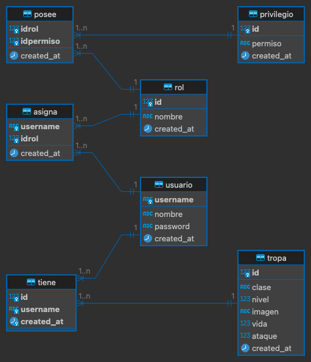
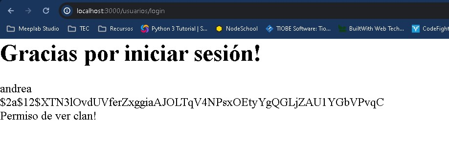

# RBAC (Role-based access control)

## Modelo Entidad Relación

Con lo que hemos aprendido en prácticas anteriores hemos consolidado nuestro conocimiento en backend para comenzar a proteger la información de los usuarios de nuestro sitio web. Hemos logrado crear una estructura para evitar que la usuarios no registrados puedan entrar al sitio web utilizando middlewares y que protegen cada una de nuestras rutas. Hasta el momento hemos cubierto las primeras etapas de la seguridad del desarrollo web, pero ahora es momento de empezar a reforzar aún más la seguridad para mantener la integridad del sitio y de la información.

En esta práctica trabajaremos en el manejo de roles y privilegios, que como vimos en lecciones anteriores ya hemos logrado mantener una sesión en el servidor y saber si un usuario se encuentra logueado o no. Pero ahora ¿qué necesitamos para que usuarios con diferentes privilegios puedan acceder a sus vistas correspondientes?.



Dentro de este diagrama podemos identificar el modelo de entidad relación que vamos a utilizar en este laboratorio.

Vamos a tomar como referencia nuestro laboratorio de MVC para practicar, te dejo una copia que puedes descargar para comenzar con la plantilla que ya teníamos.

[Descargar plantilla proyecto](/node/tutorials/intro_web/Lab19RBAC/MVC.zip)

Para correr el proyecto no te olvides de ejecutar:

```
npm install
pm2 start index.js --watch
pm2 logs
```

Ya tenemos la última versión de nuestro servidor corriendo, por lo que podemos empezar a trabajar con nuestro caso de uso.

### Agregar scripts del modelo rbac

En primer lugar vamos a crear las tablas de nuestra base de datos que están en nuestro modelo a través del siguiente script:

```
USE users_test;

CREATE TABLE IF NOT EXISTS asigna (
  username varchar(20) NOT NULL,
  idrol int(11) NOT NULL,
  created_at timestamp NOT NULL DEFAULT current_timestamp()
) ENGINE=InnoDB DEFAULT CHARSET=utf8 COLLATE=utf8_spanish2_ci;

CREATE TABLE IF NOT EXISTS posee (
  idrol int(11) NOT NULL,
  idpermiso int(11) NOT NULL,
  created_at timestamp NOT NULL DEFAULT current_timestamp()
) ENGINE=InnoDB DEFAULT CHARSET=utf8 COLLATE=utf8_spanish2_ci;

CREATE TABLE IF NOT EXISTS privilegio (
  id int(11) NOT NULL,
  permiso varchar(40) NOT NULL,
  created_at timestamp NOT NULL DEFAULT current_timestamp()
) ENGINE=InnoDB DEFAULT CHARSET=utf8 COLLATE=utf8_spanish2_ci;

CREATE TABLE IF NOT EXISTS rol (
  id int(11) NOT NULL,
  nombre varchar(40) NOT NULL,
  created_at timestamp NOT NULL DEFAULT current_timestamp()
) ENGINE=InnoDB DEFAULT CHARSET=utf8 COLLATE=utf8_spanish2_ci;

CREATE TABLE IF NOT EXISTS tiene (
  id int(11) NOT NULL,
  username varchar(20) NOT NULL,
  created_at timestamp NOT NULL DEFAULT current_timestamp()
) ENGINE=InnoDB DEFAULT CHARSET=utf8 COLLATE=utf8_spanish2_ci;

CREATE TABLE IF NOT EXISTS tropa (
  id int(11) NOT NULL,
  clase varchar(50) NOT NULL,
  nivel int(11) NOT NULL,
  imagen varchar(255) NOT NULL,
  vida int(11) NOT NULL,
  ataque int(11) NOT NULL,
  created_at timestamp NOT NULL DEFAULT current_timestamp()
) ENGINE=InnoDB DEFAULT CHARSET=utf8 COLLATE=utf8_spanish2_ci;

CREATE TABLE IF NOT EXISTS usuario (
  username varchar(20) NOT NULL,
  nombre varchar(200) NOT NULL,
  password varchar(400) NOT NULL,
  created_at timestamp NOT NULL DEFAULT current_timestamp()
) ENGINE=InnoDB DEFAULT CHARSET=utf8 COLLATE=utf8_spanish2_ci;

-- 
-- Índices para tablas volcadas
-- 
-- 
-- Indices de la tabla `asigna`
-- 
ALTER TABLE `asigna`
  ADD PRIMARY KEY (`username`,`idrol`),
  ADD KEY `idrol` (`idrol`);
-- 
-- Indices de la tabla `posee`
-- 
ALTER TABLE `posee`
  ADD PRIMARY KEY (`idrol`,`idpermiso`),
  ADD KEY `idpermiso` (`idpermiso`);
-- 
-- Indices de la tabla `privilegio`
-- 
ALTER TABLE `privilegio`
  ADD PRIMARY KEY (`id`);
-- 
-- Indices de la tabla `rol`
-- 
ALTER TABLE `rol`
  ADD PRIMARY KEY (`id`);
-- 
-- Indices de la tabla `tiene`
-- 
ALTER TABLE `tiene`
  ADD PRIMARY KEY (`id`,`username`,`created_at`),
  ADD KEY `id` (`id`),
  ADD KEY `username` (`username`);
-- 
-- Indices de la tabla `tropa`
-- 
ALTER TABLE `tropa`
  ADD PRIMARY KEY (`id`);
-- 
-- Indices de la tabla `usuario`
-- 
ALTER TABLE `usuario`
  ADD PRIMARY KEY (`username`);
-- 
-- AUTO_INCREMENT de las tablas volcadas
-- 
-- 
-- AUTO_INCREMENT de la tabla `privilegio`
-- 
ALTER TABLE `privilegio`
  MODIFY `id` int(11) NOT NULL AUTO_INCREMENT;
-- 
-- AUTO_INCREMENT de la tabla `rol`
-- 
ALTER TABLE `rol`
  MODIFY `id` int(11) NOT NULL AUTO_INCREMENT;
-- 
-- AUTO_INCREMENT de la tabla `tropa`
-- 
ALTER TABLE `tropa`
  MODIFY `id` int(11) NOT NULL AUTO_INCREMENT;
-- 
-- Restricciones para tablas volcadas
-- 
-- 
-- Filtros para la tabla `asigna`
-- 
ALTER TABLE asigna
  ADD CONSTRAINT asigna_ibfk_1 FOREIGN KEY (username) REFERENCES usuario (username),
  ADD CONSTRAINT asigna_ibfk_2 FOREIGN KEY (idrol) REFERENCES rol (id);
-- 
-- Filtros para la tabla `posee`
-- 
ALTER TABLE posee
  ADD CONSTRAINT posee_ibfk_1 FOREIGN KEY (idrol) REFERENCES rol (id),
  ADD CONSTRAINT posee_ibfk_2 FOREIGN KEY (idpermiso) REFERENCES privilegio (id);
-- 
-- Filtros para la tabla `tiene`
-- 
ALTER TABLE tiene
  ADD CONSTRAINT fk_tropas FOREIGN KEY (id) REFERENCES tropa (id),
  ADD CONSTRAINT fk_usuarios FOREIGN KEY (username) REFERENCES usuario (username);
```

Excelente!, ahora como toda base de datos necesitamos llenarla de información y para ello vamos a utilizar el siguiente script:

```
--
-- Volcado de datos para la tabla `usuario`
--
INSERT INTO `usuario` (`username`, `nombre`, `password`, `created_at`) VALUES
('andrea', 'Andrea Medina Rico', '$2a$12$XTN3lOvdUVferZxggiaAJOLTqV4NPsxOEtyYgQGLjZAU1YGbVPvqC', '2024-03-11 18:48:01'),
('antonio', 'José Antonio López Saldaña', 'arteycultura', '2024-03-07 18:15:12'),
('kevin', 'Kevin Josué Martínez Leyva', 'tony123', '2024-03-11 18:26:13'),
('nico', 'Nicolás Hood Figueroa', '$2a$12$1JQ3yh2yev2TTs5jpDkz5uUDHSj2nkG7tv32T7evN9cM44V8DNMR2', '2024-03-11 18:46:42'),
('sebas', 'Sebastián Colín De La Barreda', '$2a$12$7Ij6iZ4wV4VziolRU/T5OOub.gAu0zSP.8Y7PTqZalosaaSkX8kyO', '2024-03-11 18:49:07');
--
-- Volcado de datos para la tabla `privilegio`
--
INSERT INTO `privilegio` (`id`, `permiso`, `created_at`) VALUES
(1, 'crear_tropa', '2024-03-12 17:58:45'),
(2, 'ver_clan', '2024-03-12 17:58:45');
--
-- Volcado de datos para la tabla `rol`
--
INSERT INTO `rol` (`id`, `nombre`, `created_at`) VALUES
(1, 'miembro', '2024-03-12 17:58:09'),
(2, 'colider', '2024-03-12 17:58:09'),
(3, 'lider', '2024-03-12 17:58:15');
--
-- Volcado de datos para la tabla `tropa`
--
INSERT INTO `tropa` (`id`, `clase`, `nivel`, `imagen`, `vida`, `ataque`, `created_at`) VALUES
(1, 'Bárbaro', 1, 'https://static.wikia.nocookie.net/clashofclans/images/8/87/Avatar_Barbarian.png', 10, 9, '2024-03-07 18:06:03'),
(2, 'arquera', 1, 'https://static.wikia.nocookie.net/clashofclans/images/6/68/Avatar_Archer.png', 8, 12, '2024-03-07 18:43:28'),
(3, 'Pekka', 1, 'https://static.wikia.nocookie.net/clashofclans/images/5/54/P.E.K.K.A_info.png', 180, 300, '2024-03-07 19:06:10'),
(4, 'Montapuercos', 1, 'https://pm1.aminoapps.com/6307/1debaffe6fcbe0764f01a6fd4f4085832510f31d_hq.jpg', 50, 40, '2024-03-07 19:12:24');
-- 
-- Volcado de datos para la tabla `asigna`
-- 
INSERT INTO `asigna` (`username`, `idrol`, `created_at`) VALUES
('andrea', 3, '2024-03-12 17:59:54'),
('nico', 1, '2024-03-12 17:59:54'),
('sebas', 2, '2024-03-12 18:00:06');
--
-- Volcado de datos para la tabla `posee`
--
INSERT INTO `posee` (`idrol`, `idpermiso`, `created_at`) VALUES
(2, 2, '2024-03-12 18:00:55'),
(1, 1, '2024-03-12 18:00:44'),
(3, 2, '2024-03-12 18:00:44');
--
-- Volcado de datos para la tabla `tiene`
--
INSERT INTO `tiene` (`id`, `username`, `created_at`) VALUES
(1, 'antonio', '2024-03-07 18:19:20');
```

### Obtener permiso del usuario logueado

> Nota: Para la siguiente sección asegúrate que tu base de datos este corriendo y este bien configurada como vimos en el laboratorio anterior.

Para poder obtener los permisos del usuario, tenemos que agregar a nuestro **usarios.model.js** el método getPermisos para obtener la información de nuestra base de datos, por lo que agrega ahí el siguiente método: 

```
//Este método servirá para obtener los permisos de un usuario
static async getPermisos(username) {
    try {
        const connection = await db();
        const result = await connection.execute('Select permiso FROM privilegio pr, posee po, rol r, asigna a, usuario u WHERE u.username = ? AND u.username = a.username AND a.idrol = r.id AND r.id = po.idrol AND po.idpermiso = pr.id', [username]);
        await connection.release();
        return result;
    } catch (error) {
        throw error; // Re-throw the error for proper handling
    }
}
```

¿Y cuándo lo ejecutamos? Esta información debe ser obtenida en etapas tempranas en las que un usuario ingresa al sistema por lo que lo mejor es hacerlo cuando el usuario hace login, modifica el el controlador **do_login** de la siguiente manera:

```
module.exports.do_login = async (req, res) => {
    try {
        const usuarios = await model.User.findUser(req.body.username)
        if (usuarios.length < 1) {
            res.render("usuarios/registro", {
                registro: false
            });
            return;
        }

        const usuario = usuarios[0];
        //const doMatch = await bcrypt.compare(req.body.password, usuario.password);
        const doMatch = (req.body.password == usuario.password) ? true : false
        if (!doMatch) {
            res.render("usuarios/registro", {
                registro: false
            });
            return;
        }

        // Se agrega método para obtener el permiso del usuario
        const permiso = await model.User.getPermisos(usuario.username);
        if (permiso.length == 0) {
            req.session.error = "Usuario y/o contraseña incorrectos";
            res.render("usuarios/registro", {
                registro: false
            });
            return;
        }
        
        /* Cuando tengamos la confirmación del permiso se guarda la sesión y los permisos en nuestro req.session */
        req.session.permisos = permiso;
        req.session.username = usuario.username;
        req.session.isLoggedIn = true;
        console.log(req.session)
        res.render('usuarios/logged', {
            user: usuario
        });
    } catch (error) {
        res.render("usuarios/registro", {
            registro: false
        });
    }
}
```
## Mostrar/ocultar elementos de la interfaz gráfica dependiendo del permiso del usuario

Vamos a continuar para generar una interfaz gráfica dinámica de acuerdo al permiso del usuario, modifica el último apartado de **do_login** en el render de la siguiente manera: 

```
res.render('usuarios/logged', {
    user: usuario,
    permisos: req.session.permisos || [],
});
```

Ahora para mostrar u ocultar componentes en nuestra interfaz gráfica, en nuestra view de logged hay que agregar el siguiente código:

```
<html>
    <head>
        <%- include('./../css.ejs') %>
    </head>
    <body>
        <h1>Gracias por iniciar sesión!</h1>
        <p><%= user.username %></p>
        <p><%= user.name %></p>
        <p><%= user.password %></p>
        <% for(permiso of permisos) { %>
            <% if(permiso.permiso=='ver_clan' ) { %>
                Permiso de ver clan!
            <% } %>
            <% if(permiso.permiso == 'crear_tropa') { %>
                Permiso de crear tropa!
            <% } %>
        <% } %>
    </body>
    <%- include('./../scripts.ejs') %>
</html>
```

Por último vamos a adecuar un poco el login para que nuestros datos funcionen con los de la base de datos, en primer lugar actualiza el query de findUser para usar la tabla de **usuario** y no la de **user** del laboratorio anterior en usuarios.model.js:

```
Select * from usuario WHERE username = ?
```

Ahora bien si vamos al navegador y hacemos login con el siguiente usuario:

```
user: andrea
pass: $2a$12$XTN3lOvdUVferZxggiaAJOLTqV4NPsxOEtyYgQGLjZAU1YGbVPvqC
```

Debido a que insertamos a Andrea directamente no conocemos su contraseña así que veremos que sucede cuando no aplicamos bien la autenticación de la contraseña pero efectuamos bien el método.

Sí hacemos login desde el navegador veremos como resultado que el permiso asignado a andrea es visible.



## Proteger las rutas dependiendo del permiso del usuario

Pero ahora ¿qué pasa si queremos bloquear toda una ruta, es decir, si el usuario intenta acceder desde el navegador a la ruta aunque este logueado queremos que verifique si tiene el permiso o no para acceder, por lo que en nuestras rutas, como ya lo vimos en laboratorios pasados, vamos a agregar un **middleware** por cada permiso

Crea un nuevo archivo dentro de utils llamado **can-create.js** que será el middleware para verificar este permiso.

```
module.exports = (request, response, next) => {
    let canCreate = false;
    for (let permiso of request.session.permisos) {
        if (permiso.permiso == 'crear_tropa') {
            canCreate = true;
        }
    }
    if (canCreate) {
        next();
    } else {
        return response.redirect('/usuarios/logout');
    }
}
```

Para el otro permiso que tenemos disponible en nuestra base de datos crea un archivo que se llame **can-view.js** que será el middleware para el permiso. 

```
module.exports = (request, response, next) => {
    let canView =  false;
    for (let permiso of request.session.permisos) {
        if (permiso.permiso == 'ver_clan') {
            canView = true;
        }
    }
    if(canView) {
        next();
    } else {
        return response.redirect('/usuarios/logout');    
    }
}
```

Si te fijas en nuestros middlewares estamos usando una nueva ruta que es **logout**, agrégalo en tu archivo de usuarios.routes.js:

```
router.get('/logout', isAuth, canCreate, controller.logout);
```

Y no olvides agregar su controlador respectivo, que elimine los datos de la sesión del usuario:

```
module.exports.logout = async (req, res) => {
    req.session.permisos = '';
    req.session.username = '';
    req.session.isLoggedIn = false;
    res.send("El usuario ha cerrado sesión");
}
```

Vamos a crear el controlador de editar usuario para verificar que se puede acceder a la página:

```
module.exports.editar_usuario = async (req, res) => {
    res.send("El usuario tiene permisos para entrar a esta vista");
}
```

Por último, vamos a nuestro archivo de **usuarios.routes.js** y agregamos los middlewares correspondientes a las rutas de la siguiente manera:

```
router.get('/obtener_usuarios', isAuth, canView, () => { });
router.get('/editar_usuario', isAuth, canCreate, controller.editar_usuario);
```

No olvides importar los archivos en la parte de arriba de la siguiente manera:

```
const canCreate = require('../utils/can-create.js');
const canView = require('../utils/can-view.js');
```

## Asignar un privilegio a un nuevo usuario

Perfecto ya tenemos toda la estructura que necesitamos para validar un permiso, pero falta que cuando el usuario se registre se le asigne un permiso, por lo que, vamos a modificar **usuarios.model.js** el método de save() de la siguiente manera:

```
async save() {
    try {
        const connection = await db();
        const hashedPass = await bcrypt.hash(this.password, 12)
        const usuario = await connection.execute(
            `INSERT INTO usuario (username, nombre, password) VALUES (?, ?, ?)`,
            [this.username, this.name, hashedPass]
        );

        const result = await connection.execute(
            'INSERT INTO asigna (username, idrol) VALUES (?, 1)',
            [this.username]
        );

        await connection.release();
        return result;
    } catch (error) {
        throw error; // Re-throw the error for proper handling
    }
}
```

Bien prueba tu laboratorio! Registra un usuario y verifica que se haya agregado el permiso del usuario.

Como por ahora estamos asignando de manera directa que el usuario tenga el permiso de crear tropa solamente, el usuario no puede acceder a **usuarios/obtener_usuarios** y lo mandará al logout.

Prueba también una vez logueado la ruta de **usuarios/editar_usuario**, a la cual, el usuario si tendrá acceso.

¿Estás listo? No esperes más experimenta con otro permiso, crea su middleware correspondiente y a haz las validaciones correspondientes tanto a nivel ruta como a nivel de interfaz gráfica.

[Ver ejemplo completo](/node/tutorials/intro_web/Lab19RBAC/test_project.zip)