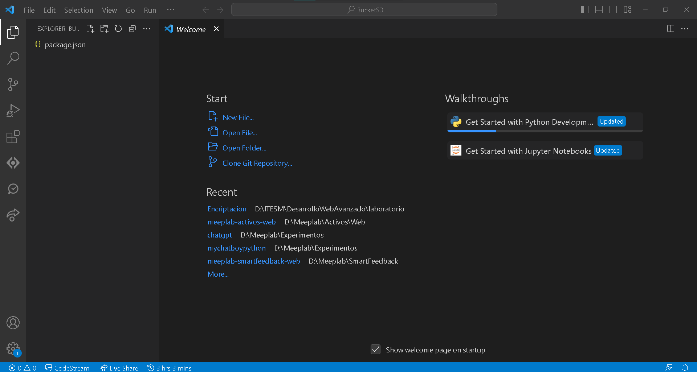
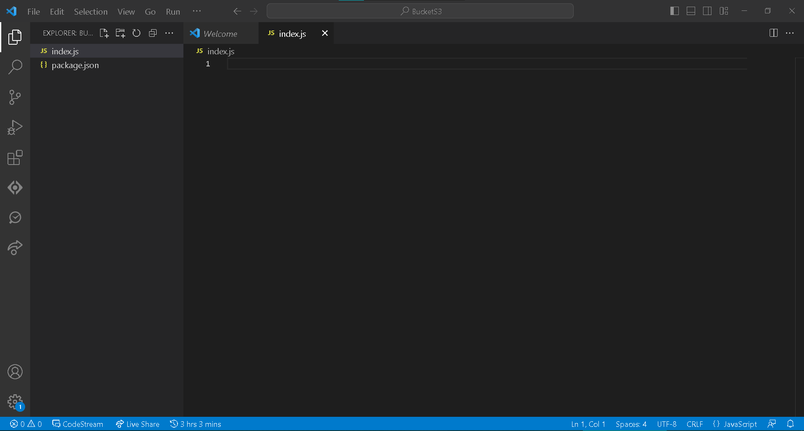
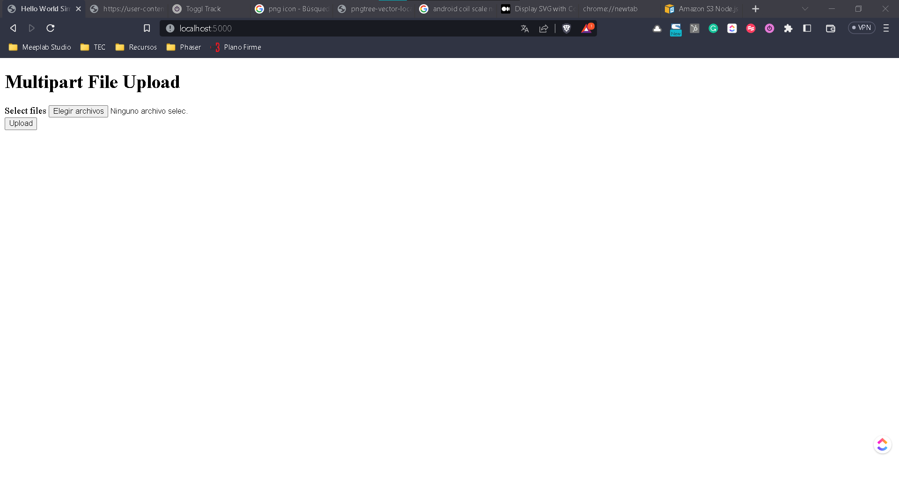
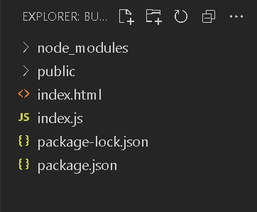
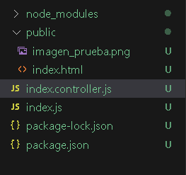
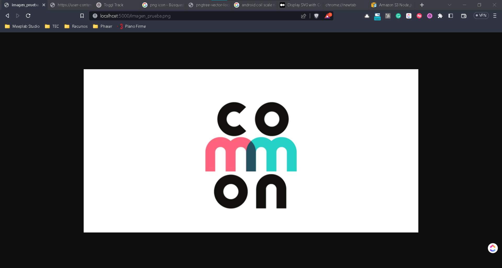
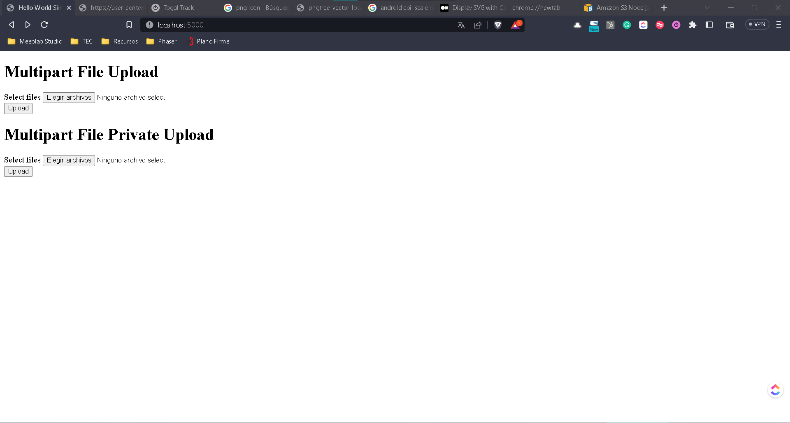
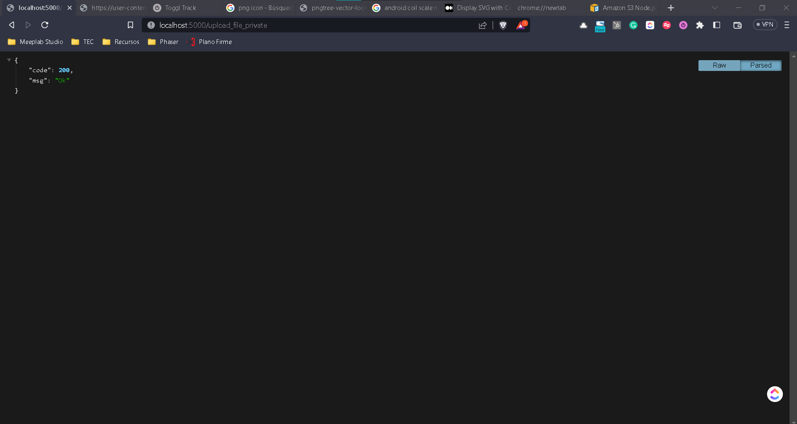
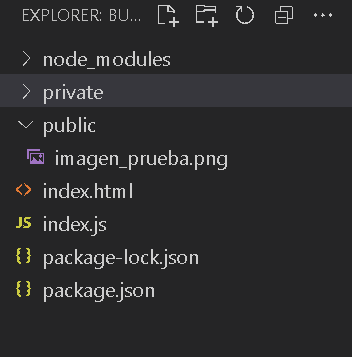
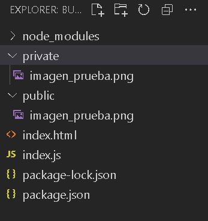

# Archivos

## Uso de multer

Para este laboratorio vamos a simplificar un poco nuestra arquitectura y solo trabajaremos con rutas y controladores, pues vamos a crear un archivo público y no haremos conexión con ninguna fuente de información.

Empecemos configurando un proyecto desde 0, a estas alturas ya debes de saber como:

```
npm init -y
```

Previo a otras sesiones haremos uso del **-y** para evitar agregar los parámetros y que sea más rápida la ejecución del init.

Introduce los valores generales que necesites del proyecto para el archivo principal usaremos **index.js**.






Ahora vamos a instalar las librerías básicas que necesitamos para este proyecto.

```
npm i express
npm i body-parser
npm i multer
```
Al momento hemos usado la librería de express y el body-parser que no son nuevas para nosotros, la nueva librería que usaremos es la de **multer**.

Multer es una librería que nos permite manejar archivos dentro de nuestros formularios para poder subirlos al servidor, pero quizás te estés preguntando. ¿Por qué necesitamos hacer todo esto si tengo el input file disponible en mi formulario?. Si bien esto es correcto, al momento de subir al servidor veremos que esto no funciona, y de echo cuando analizamos la razón tiene todo un sentido de lógica.

Cuando manejamos un formulario simple por lo general estamos utilizando texto, por más complejo o grande que este sea siempre el texto será en cuestión de tamaño pequeño comparado con un archivo que tan solo en su base puede llegar a pesar más que el texto de un formulario.

Piensa en diferentes tipos de archivos, imágenes, videos, binarios, zips, entre otros si subiéramos de golpe esto al servidor tardaría mucho y se bloquearía nuestra interfaz como sucede en algunos sitios.

La magia de todo esto ocurre cuando "partimos" en pedazos nuestros archivos y los subimos poco a poco al servidor, aquí es donde entra multer que acepta cada uno de estos pedazos, reconstruye nuestro archivo y lo guarda en nuestro servidor.

Esta es la única manera a nivel teórica en como podemos subir archivos, librerías quizás existan otras pero dentro del mundo de nodeJs es la más común.

Vamos a cargar la base de nuestro **index.js** con lo siguiente:

```
const express = require('express');
const multer = require('multer');
var path = require('path');
const app = express();
const port = 5000;
const log = console.log

const bodyParser = require('body-parser');
app.use(bodyParser.urlencoded({extended: false}));
app.use(express.static(path.join(__dirname, 'public')));

app.listen(port, () => {
//server starts listening for any attempts from a client to connect at port: {port}
    console.log(`Now listening on port ${port}`);
});
```

Un cambio que estamos haciendo es usar otro puerto para la ejecución del servidor en 5000.

Ya que estamos sirviendo la carpeta pública, vamos a crearla dentro del proyecto y dentro de ella vamos a crear un archivo **index.html**, con el siguiente contenido.

```
<!DOCTYPE html>
<html lang="en">
<head>
  <meta charset="UTF-8">
  <meta name="viewport" content="width=device-width, initial-scale=1.0">
  <title>Hello World Simple App</title>
</head>
<body>
  <div class="container">
    <h1>Multipart File Upload</h1>
    <form action="/upload_file" method="POST" enctype="multipart/form-data" id="form">
      <div class="input-group">
        <label for="files">Select files</label>
        <input id="file" name="file" type="file" />
      </div>
      <button class="submit-btn" type="submit">Upload</button>
    </form>
  </div>
</body>
</html>
```

Algunos puntos importantes a tomar en cuenta desde aquí son los siguientes:

Definir la ruta del form en este caso a

```
action = "/upload_file"
method = "POST"
enctype="multipart/form-data"

```

En el action vamos a definir la ruta que vamos a utilizar para subir nuestro archivo, en este caso será el  **/upload_file**.

También vamos a definir el action del envío de formulario como **POST**.

Por último necesitamos definir el formulario como multi-parte esto para el envío de los archivos.

El **multipart/form-data**, es la forma que te comenté antes donde le decimos a nuestro formulario que parta en pedazos la petición para subir archivos, esto rompe en varios paquetes TCP/IP y los manda al servidor para hacer su trabajo, es entonces donde multer entra a reconstruir cada paquete y recuperar el archivo.

Si ejecutamos el servidor y accedemos a la ruta de index.html, nos deberá aparecer lo siguiente:



No es la mejor interfaz para nuestro proyecto pero funcionalmente servirá.

## Subiendo archivos públicos

Ya que tenemos nuestro form armado y corriendo vamos además de una carpeta **public**, aquí vamos a guardar los archivos que subamos en nuestro form.



Como mencioné, no nos enfocaremos en una arquitectura completa para este laboratorio, pero al menos haremos el uso de rutas y controladores por facilidad. Para ello debemos crear a la altura de **index.js** otro archivo al que llamaremos **index.controller.js**,
 este archivo deberá contener de momento lo siguiente:

```
const log = console.log

module.exports.upload_file = async (req, res) => {
    log("Cargando el archivo")
    res.status(200).json({code: 200, msg:"Ok"})
}
```

Por último en nuestro archivo **index.js** antes de la declaración del servidor vamos a agregar la ruta para subir la imagen de la siguiente forma.

```
const controller = require("./index.controller.js")
app.post('/upload_file', controller.upload_file);
```

Aquí recuerda que estamos definiendo el **POST** del formulario de **index.html** y también la ruta del action **/upload_file**.

Si cargamos un archivo y damos clic en **Upload** deberemos ver algo como lo siguiente.


Ya tenemos la ruta preparada, ahora vamos con lo que necesitamos para el laboratorio.

Ahora bien, vamos a cargar el archivo que agregamos a nuestro proyecto, como ya mencionamos, usaremos multer para tomar el **multipart** de nuestro formulario y recibir el archivo.

Para ello necesitamos configurar en donde se guardará el archivo y con que nombre. Esto lo haremos de forma muy lineal con la siguiente configuración, dentro de nuestro archivo **index.controller.js** arriba de la función **upload_file**.

```
const multer = require('multer'); // Using Promise API

const storage = multer.diskStorage({
    destination: function (req, file, callback) {
        console.log("File Destination:", './public/'); // Log the destination path
        callback(null, './public/');
    },
    filename: function (req, file, callback) {
        console.log("Uploaded File:", req.body); // Log received form data
        return callback(null, file.originalname);
    }
});

const upload = multer({ storage: storage }).array('file', 1);
```

La siguiente definición carga la librería de **multer** y especifica que el destino del archivo sea la carpeta pública que definimos hace unos pasos. Y para el archivo no haremos ningún cambio significativo, pasaremos el nombre que recibimos desde el inicio.

Ahora dentro de nuestra función de **/upload_file** vamos a sustituir el

```
res.status(200).json({code: 200, msg:"Ok"})
```

Por lo siguiente:

```
module.exports.upload_file = async (req, res) => {
    upload(req, res, function (err) {
        if (err) {
            console.error(err);
            return res.status(500).json({ code: 500, msg: "Error uploading file" });
        }

        console.log("Upload Successful:", req.files); // Log uploaded files
        res.status(200).json({ code: 200, msg: "Ok" });
    });
}
```

La línea más importante de todo este código es la siguiente:

```
var upload = multer({ storage : storage }).array('file',1);
```

Aquí no solo llamamos a nuestra configuración de **multer**, sino que vamos a recibir un arreglo de archivos que vienen de el **index.html** y el string **'file'** es el id que otorgamos en el formulario al **input** en su propiedad de **name** recuerda siempre esto ya que el primer error que se comete al estar aprendiendo en los formularios es definir estos ids.

Para nuestro caso solo vamos a subir un archivo pero **multer** nos permite agregar múltiples archivos desde la propiedad del file a partir de nuestro form. Te dejo esta configuración en caso de que en otros proyectos quieras trabajar con múltiples archivos, funciona prácticamente igual.

```
var pathDest = req.files[0].destination.slice(1)
```

En esta línea puedes ver como funciona el arreglo puesto que al llamar **req.files[0]** lo que estamos haciendo es llamar al archivo según hayamos subido y aunque sea 1 sabemos que el primero será el de la posición 0.

Nuevamente vamos a ejecutar nuestro servidor y si volvemos a probar el resultado será el mismo pero dentro de nuestro proyecto pasará lo siguiente.



Como puedes observar el archivo que hayamos puesto se ha subido correctamente a nuestra carpeta pública.

Como no hemos puesto ninguna limitación en cuestión de archivos realmente podemos subir lo que sea pero para efectos prácticos y que te quede más claro te recomiendo comiences con una imagen sea **.jpg** o **.png**.

## Consulta de archivos públicos

El siguiente paso quizás sea un poco obvio pero es el punto de partida para lograr identificar las variaciones con las que estaremos trabajando en el laboratorio.

De momento tenemos cargada la **imagen_prueba.png** o en tu caso el archivo que hayas subido.

Teniendo activo nuestro servidor ¿Cómo podemos ver este archivo?. Siempre es importante que tengas visibilidad en como acceder un archivo particular.

Para esto debemos considerar donde se encuentra guardado nuestro archivo y para ello olvida las rutas absolutas del sistema en donde este alojado el archivo puesto que estas rutas no son con las que trabajamos en el proyecto.

Las rutas que utilizamos son las rutas relativas y estas se construyen a través de las URL que vamos generando. Por default la carpeta **public** expone los archivos dentro de esta carpeta y por lo general son imágenes genéricas, templates de html, css, archivos js entre otros.

Si quiero acceder a un archivo dentro de esta carpeta basta con que agregue **\{\{dominio\}\}/\{\{ruta_desde_public\}\}**

```
http://localhost:5000/imagen_prueba.png
```

En mi caso el resultado en el navegador es el siguiente:



## Consulta de archivos privados

En el paso anterior manejamos los archivos estáticos, pero cuando trabajamos con subida de archivos lo ideal es que estos archivos no queden expuestos, y regresamos a lo mismo, todo en la carpeta **public** queda expuesto.

Otro riesgo que corremos al colocar todo en **public** es que si trabajamos con un repositorio este comenzará a crecer y podemos enfrentarnos a alcanzar el límite de tamaño del repositorio que normalmente va al rededor de los 2GB.

Lo ideal en estos casos es que vayamos creando una carpeta fuera del repositorio y desde ahí manejarlo.

Para el laboratorio simplemente lo haremos fuera de la carpeta **public** pero lo haremos dentro del proyecto.

**Nota: Recuerda tener siempre en cuenta el uso de los archivos en general, cada caso es diferente y debes estar preparado para el escenario correspondiente.**

Para comenzar vamos a expandir nuestro **index.html** con un nuevo formulario debajo del que ya tenemos.

```
<div class="container">
    <h1>Multipart File Private Upload</h1>
    <form action="/upload_file_private" method="POST" enctype="multipart/form-data" id="form">
      <div class="input-group">
        <label for="files">Select files</label>
        <input id="file" name="file" type="file" />
      </div>
      <button class="submit-btn" type="submit">Upload</button>
    </form>
  </div>
```

Ahora vamos a añadir una nueva ruta de **POST** en el **index.js**

```
app.post('/upload_file_private', controller.upload_file_private);
```

Y dentro de nuestro archivo **index.controller.js** definiremos la función:

```
module.exports.upload_file_private = async (req, res) => {
    log("Cargando el archivo")
    res.status(200).json({code: 200, msg:"Ok"})
}
```

Nuevamente ejecutamos el servidor y debemos ver algo como lo siguiente con el nuevo formulario.





Ahora vamos a crear una nueva carpeta en el proyecto llamada **private** y teniendo lo siguiente.



El siguiente paso será crear una nueva configuración de multer para subir nuestros nuevos archivos a esta carpeta.

```
const storage2 = multer.diskStorage({
    destination: function (req, file, callback) {
        callback(null, './private/');
    },

    filename: function (req, file, callback) {
        return callback(null,file.originalname);
    }
});
const upload2 = multer({ storage : storage2 }).array('file',1);
```

**Nota: Esta es una configuración adicional a la que ya tenemos, la anterior no la vayas a eliminar**

Por último sustituimos el 

```
res.status(200).json({code: 200, msg:"Ok"})
```

Por el código de subida de la información:

```
upload2(req,res,function(err) {
    if (err) {
        console.error(err);
        return res.status(500).json({ code: 500, msg: "Error uploading file" });
    }

    console.log("Upload Successful:", req.files); // Log uploaded files
    res.status(200).json({ code: 200, msg: "Ok" });
})
```



Con el resultado anterior observamos que la misma imagen queda arriba dentro de nuestra carpeta privada. Pero para acceder a ella es donde tenemos que empezar a localizar lo que pasa en nuestra aplicación.

Con lo que vimos de la carpeta **public** podemos acceder a este archivo pero la incógnita que nos queda es si hacer este proceso de la carpeta **private** es lo que necesito para proteger mis archivos, ¿Cómo doy acceso a ellos cuando se necesiten?

Para esto es que no podemos dar acceso público, pero podemos dar un acceso a través de una URL.

Este es el proceso de control ya que al dar acceso mediante URL podemos agregar tanto procesamiento adicional al archivo en caso de ser necesario o en su defecto protegerlo con el sistema de autenticación que definamos para el **API**.

```
app.get('/get_private_file/:file', controller.get_private_file);
```
Hasta ahora, solo habíamos utilizado 2 formas para obtener información de nuestro request:

```
req.body //POST
req.query //GET
```

Ahora añadiremos el **req.params** que nos permite agregar un parámetro sin importar el tipo de conexión a través de la url y separarlo por **/**, por tanto podemos recibir tantos parámetros como deseemos.

Dentro de nuestro controller debemos agregar la librería path al inicio.

```
var path = require('path');
```

Y al final colocamos nuestra función para acceder al archivo privado.

```
module.exports.get_private_file = async(req, res) => {
    var fileName = req.params.file
    res.sendFile(path.join(__dirname, './private', fileName));
}
```

Con el uso del método de express **res.sendFile** podemos interpretar un archivo y cargarlo del lado del cliente.

Este último paso es bastante sencillo en términos de solo realizar la canalización del archivo a la carpeta **private** pero tomando en cuenta que esto nos da control de acceso y de procesamiento en el proceso de consultar archivos que no están directamente abiertos al público nos permite hacer muchas cosas a largo plazo.

De esta manera podemos trabajar con archivos en nuestro servidor, utilizando multer y haciendo variaciones, un proyecto de manejo de archivos tiene varias consideraciones importantes y adicionales que puedes manejar, revisa esto para evitar caer en problemas según el tipo de arquitectura o servidores que estés utilizando.

[Ver ejemplo completo](/node/tutorials/intro_web/Lab22Archivos/test-project.zip)