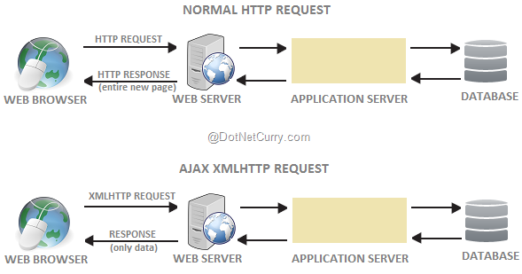
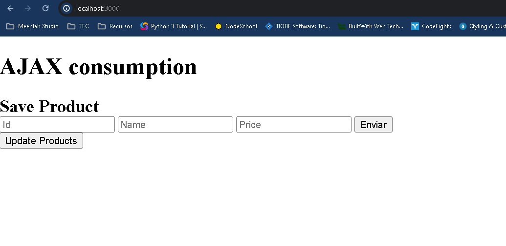
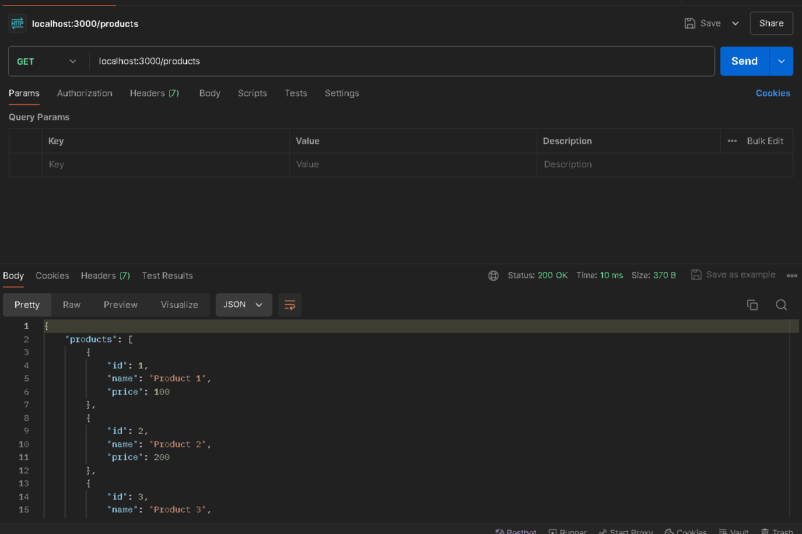
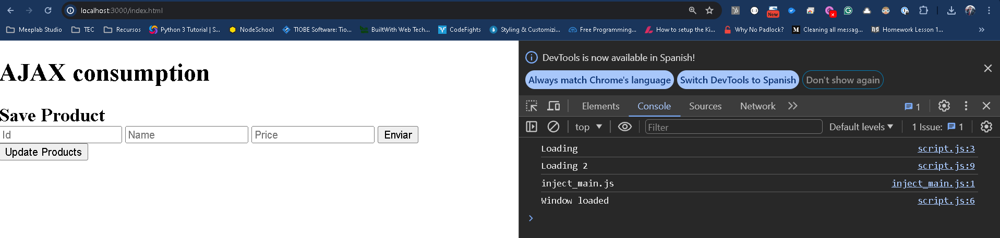
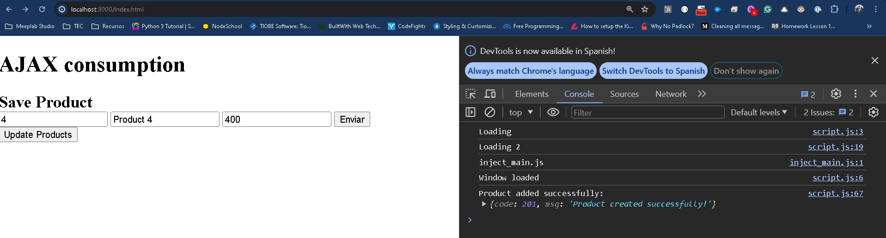
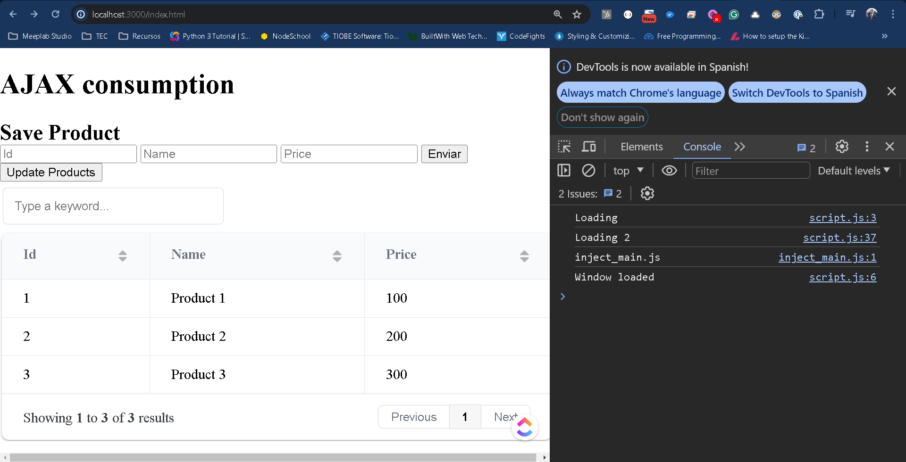
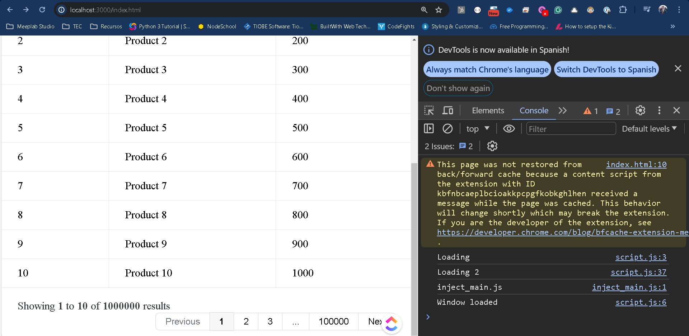

# AJAX

## Introducción

Dentro de lo que hemos trabajado hasta ahora tenemos un servidor con la capacidad de procesar llamadas a una fuente de información como una Base de Datos, manejar archivos y usar todo el poder de procesamiento de NodeJS para ejecutar algoritmos diferentes.

Dentro de todo esto hemos implementado un patrón de arquitectura llamado MVC, donde en la parte de la Vista hemos utilizado EJS para dar formato a nuestros archivos HTML.

Algo que comentábamos anteriormente en relación al EJS, es que todo el código que añadimos al archivo HTML es para ejecutar un pre-renderizado del HTML final, por lo que una vez que el HTML llega al navegador se pierde todo rastro de haber usado EJS y tenemos un archivo estático. Esta línea es importante pues es lo que hace el manejo del sistema de templates, y también la diferencia principal entre como trabaja esta parte en contraste con React por ejemplo.

Al momento de servir un EJS lo que hacemos es usar la función render y a través de ella hemos pasado información del servidor al archivo HTML.

```
res.render("/index",{ data:myData });
```

Este formato es ideal al momento de trabajar, sin embargo las aplicaciones hoy en día requieren de más demanda de información en menor cantidad de tiempo.

Un caso muy particular es que si cargamos una tabla y esta añade un miembro adicional, necesitamos recargar la página, pasar por todo el proceso de renderizado del ejs, para volver a ver el resultado actualizado.

El problema es que hoy esperamos que de manera automática se empiece a recargar la información y ya esté disponible para utilizarla.

Otro caso de uso al respecto es con el uso de los formularios, al momento de presionar el botón de Enviar en un **submit** nos encontramos que la página se recarga, aunque en el servidor recibimos un POST, se espera una respuesta aunque sea redirigir a la misma página.

Aquí empezamos a ver un patrón donde el cliente necesita información de otra manera, no solo a través del renderizado del HTML.

Por tanto Javascript puede enviar request al servidor y cargar información en el momento que sea necesario quitando esa dependencia del HTML.

Para realizar esto debemos separar en 2 pasos la lógica de como construimos la aplicación, la primera es a través del uso de APIs que hemos ido mencionando poco a poco en el transcurso de nuestros laboratorios y la otra es que el código HTML contenga un archivo JS desde el cual se hagan estas nuevas peticiones al servidor.

Algunos ejemplos de casos de uso que podemos nombrar para hacer request al servidor podrían ser:

- Enviar una orden.
- Cargar información de usuario.
- Recibir las últimas actualizaciones del servidor.

¡Y lo más importante sin la necesidad de recargar la página!

El término AJAX viene de (Asynchronous Javascript And XML) para request al servidor desde Javascript. Interesante con el término es que no necesitamos utilizar XML, esto es por que el término viene de los old times, y se ha popularizado en cuestión del nombre.

Existen múltiples formas de enviar un request al servidor y obtener información del servidor.

Usando el método **fetch()**, esta sería la forma más moderna y versátil. Lo único que debes saber es que no está soportado por viejos navegadores, pero hoy en día ya es un poco complicado encontrar un navegador que no lo tenga.

La sintaxis básica es:

```
let promise = fetch(url, [options])
```

url - La url de acceso, si estamos en nuestro proyecto no es necesario agregar **https:localhost:3000** o la ip o dominio correspondiente, basta con comenzar con la ruta a la que queremos llegar.
options - Parámetros adicionales como el método de conexión, headers, etc.

Una plantilla básica entonces para hacer una llamada AJAX al servidor sería lo siguiente:

```
let response = await fetch(url);

if (response.ok) { // if HTTP-status is 200-299
  // get the response body (the method explained below)
  let json = await response.json();
} else {
  alert("HTTP-Error: " + response.status);
}
````

Por último la respuesta que obtenemos de la llamada puede ser convertida de diferentes maneras o formatos:

- res.text() - Leer la respuesta y responder como texto.
- res.json() - Parsear la respuesta a JSON.
- res.formData() - Regresar la respuesta como objeto **FormData**
- res.blob() - Regresar respuestas como Blob (datos binarios con tipo)
- response.arrayBuffer() - Regresar la respuesta como ArrayBuffer (representación de bajo nivel de datos binarios)
- adicionalmente, response.body es un objeto **ReadableStream** se permite que leas cada pedazo paso a paso.



## Empezando con un API

Para comenzar nuestro laboratorio utilizaremos una plantilla base para no empezar desde 0 y poder avanzar en lo que nos pide el laboratorio sobre AJAX, pero vamos a explicar un poco lo que necesitamos.

<a href="/docs/node/tutorials/intro_web/Lab24AJAX/template.zip" download="lab24-ajax-template.zip">Descargar plantilla proyecto</a>

Coloca el proyecto y ejecuta el **npm install**, si ejecutas el proyecto podrás acceder a la ruta index viendo algo como lo siguiente:



Si desde postman ejecutamos la url de **/products** podremos ver el resultado como el siguiente.



Esto significa que nuestro proyecto tiene un API muy sencilla corriendo y es momento en que podemos empezar a trabajar.

Si investigas un poco la base de **index.js** te darás cuenta que no estamos usando para esta plantilla el EJS. Al contrario tenemos un archivo **index.html** en la carpeta pública en donde realizaremos la conexión con el API.

> Nota: El echo que no estemos utilizando EJS, no significa que este no pueda ejecutar llamadas AJAX, pero primero debes entender bien donde se ejecuta la llamada para poder ejecutarla. La combinación entre EJS y AJAX le va a dar mucho más poder a tu proyecto. Y no olvide que este es el fundamento para poder trabajar con REACT.

## Event load

Después de estar trabajando dentro del servidor es momento de regresar a nuestro navegador, prepara la consola pues la estaremos usando para este laboratorio.

Abre el archivo **script.js** dentro de nuestra carpeta pública.

Ya hemos hablado y utilizado eventos del lado del cliente en Javascript, y para este laboratorio utilizaremos un evento muy particular llamado **load**, este evento nos permite ejecutar código una vez que la página se ha cargado por completo.

Esto lo hacemos ya que si ejecutamos una función mientras la página no se ha cargado por completo podemos empezar a tener problemas de sincronización o problemas al llamar variables que aún no se cargan.

Empecemos agregando el siguiente código:

```
const log = console.log

log("Loading");

window.addEventListener('load', function() {
  log('Window loaded');
});

log("Loading 2");
```



Cuando visitamos la url veremos que el evento load se carga hasta el final a pesar de que Loading 2 está después, este es un evento asíncrono.

> Nota: Ten cuidado de duplicar la llamada al evento load el cual puede llevar a resultados inesperados.

Dentro del evento load vamos a hacer referencia a varios elementos de nuestro archivo **index.html** creando las siguientes variables:

```
const myForm = document.getElementById('myForm');
const submitButton = document.getElementById('submitButton');
const updateProductsButton = document.getElementById('updateProducts');
const wrapper = document.getElementById('wrapper');
```

## Agregar producto AJAX

Después de esto vamos a agregar un evento click asociado al submitButton del form que tenemos adentro de index.html.

```
submitButton.addEventListener('click', function(event) {

});
```

Este evento tiene 2 sentidos particulares, aparte de hacer clic en los datos lo estamos llamando al momento de hacer click en el botón de submit de nuestro formulario. Si lo dejamos tal cual el formulario se enviará a nuestro servidor y tendremos un conflicto, pero este es el momento de **interceptar** el envío al servidor mediante:

```
event.preventDefault();
```

Lo que hace esta línea es justo como su nombre lo dice, evita que se termine de ejecutar el evento default si es que contiene, del elemento al que se le aplica el listener.

En otras palabras estamos evitando que de manera automática se envíe el formulario al servidor y estamos tomando el control de lo que queremos que suceda.

Ahora bien fuera de nuestro evento **load** vamos a agregar los siguiente métodos.

Primero vamos a definir una clase:

```
class Product {
  constructor(id,name,price) {
    this.id = id;
    this.name = name;
    this.price = price;
  }
}
```

Dentro de esta, vamos a almacenar los productos nuevos que vayamos creando.

> Nota: No olvides que la lista de productos que tenemos se reinicia cada vez que se reinicia el servidor, por lo que nuevos productos solo se almacenan mientras no realicemos ninguna modificación al código.

Ahora agregaremos el siguiente método:

```
function generateProduct() {
  const idInput = myForm.elements['id'];
  const nameInput = myForm.elements['name'];
  const priceInput = myForm.elements['price'];

  const idValue = idInput.value;
  const nameValue = nameInput.value;
  const priceValue = priceInput.value;

  var newProduct = null
  var msg = "Created product"
  if(!idValue){
    msg = "Id is empty"
  }
  if(!nameValue){
    msg = "Name is empty"
  }
  if(!priceValue){
    msg = "Price is empty"
  }

  if(msg == "Created product"){
    newProduct = new Product(idValue,nameValue,priceValue);
  }

  return {product: newProduct, msg: msg}
}
```

Este método, aunque largo nos permite tomar los valores al momento del formulario y validar los campos, si todos los campos son correctos entonces regresamos un objeto Producto con el mensaje de error o éxito correspondiente.

Por último vamos a agregar la siguiente función asíncrona:

```
async function addProduct(product){
  const url = '/add_product';
  const response = await fetch(url, {
    method: 'POST',
    headers: { 'Content-Type': 'application/json' },
    body: JSON.stringify(product)
  });

  if (response.ok) {
    const data = await response.json();
    log('Product added successfully:', data);
    // Clear the form or display a success message
  } else {
    alert('Error adding product: ' + response.statusText);
  }
}
```

Y aquí es donde empezará la magia, agregar un producto recibe un objeto de nuestra clase **Product**. A partir de ahí viene al fin nuestra llamada AJAX, la cual recibe la url que usaremos del API **/add_product**, el método de conexión **POST**, el header para indicar que enviaremos la conexión en formato JSON y como no estamos mandando el formulario necesitamos transformar nuestro nuevo producto al body de la aplicación en un formato legible que en este caso es string.

Observa que la ejecución del fetch utiliza un **await** ya que no sabemos en que momento va a regresar la llamada al servidor, por lo que dejamos que suceda en sus propios términos y al regresar con el éxito o error lo validamos para verlo en la consola.

Por último necesitamos terminar de actualizar nuestro evento de clic, con lo siguiente:

```
submitButton.addEventListener('click', function(event) {
    event.preventDefault();
    var result = generateProduct();
    addProduct(result.product);
});
```
Una vez que prevenimos la ejecución default del evento del formulario, generamos el producto con los datos del mismo y lo enviamos a través de una llamada por AJAX.

Intenta recargar el servidor y agrega un nuevo producto, observa el resultado.



El resultado deberá visualizarse en la consola, por lo que éxito hemos guardado un producto sin la necesidad de recargar la página.

Pero ahora, ¿cómo vemos en pantalla nuestra lista de datos?

## Cargar lista de productos AJAX

Al momento de cargar nuestro formulario podríamos hacer otra llamada AJAX para obtener los productos, también hemos colocado un botón que actualice los productos y nos los muestre en pantalla.

Para poder hacer ambas cosas vamos a crear la siguiente función en la parte inferior de nuestro código.

```
async function loadProducts(){
  let response = await fetch('/products');

  if (response.ok) { // if HTTP-status is 200-299
    let json = await response.json();
    //log(json)
    const codeResult = document.getElementById('codeResult');
    codeResult.innerHTML = JSON.stringify(json.products);
  } else {
    alert("HTTP-Error: " + response.status);
  }
}

async function getProducts(){
  let response = await fetch('/products');

  if (response.ok) { // if HTTP-status is 200-299
    let json = await response.json();
    //log(json)
    return json.products;
  } else {
    return [];
  }
}
```

Aquí estamos generando dos funciones que en esencia hacen lo mismo pero el resultado es diferente, la primer función hace la llamada AJAX a **/products** para obtener la lista y la pinta en el contenedor que hemos designado para ello.

La segunda función hace lo mismo pero en vez de pintar en un lugar particular solo nos devuelve como resultado la lista de productos, esta la usaremos más adelante.

Ahora que ya podemos cargar la lista de productos podemos actualizar nuestro evento clic del submitButton agregando la carga al final.

```
submitButton.addEventListener('click', function(event) {
    event.preventDefault();
    var result = generateProduct();
    addProduct(result.product);
    loadProducts()
});
```

El resultado será que al agregar un nuevo producto cargaremos la lista justo debajo.

Éxito, pero no tanto, ya que aunque vamos actualizando la lista, esta solo responde a nuestros eventos, que pasaría si alguien más se conecta al servidor y crea un producto, no lo podríamos ver hasta que agreguemos uno.

Por tanto vamos a usar el botón que tenemos para actualizar productos. Para ello vamos a definir un nuevo evento clic, como este se encuentra fuera del formulario no es necesario aplicar el preventDefault.

Debajo del evento listener del submitButton, agrega lo siguiente:

```
updateProductsButton.addEventListener('click', function(event) {
    loadProducts()
});
```

Si bien nuestro caso de uso nos permite visualizar los cambios en el servidor, es probable que no queramos tener que esperar a hacer clic en el botón, o en su defecto agregar un nuevo producto para ver la carga de la tabla. Por lo que otra funcionalidad donde podemos aplicar el AJAX es en un cierto tiempo.

Vamos a agregar lo siguiente debajo de nuestro último listener.

```
setInterval(() =>{
  loadProducts()
}, 5000);
```

Aquí vamos a estar recargando la tabla cada 5 segundo, recargar y observa el resultado.

Con esto ya tenemos 3 fuentes para cargar la actualización de los datos:

- Al agregar un nuevo producto
- Al dar click en actualizar
- Cada 5 segundos

Estas opciones tienen sus ventajas y desventajas, por ejemplo la carga cada 5 segundos podemos reducirla a 1 segundo pero en un conjunto grande de datos esto quizás no sea la mejor opción puesto que tan solo el render podría tomar más de ese segundo.

Al final del día dependerá el caso y el contexto de lo que estés haciendo para ver cual es la mejor forma de carga de información, considera siempre el peor caso para evitar que el crecimiento de tu aplicación límite tus proyectos.

## Data tables AJAX

La última función que creamos fue la de getProducts, que como dijimos en vez de pintar directamente los datos genera una lista de datos de resultado, esto es por que algunos componentes existentes en internet te permiten pegar la información tal cual como por ejemplo: gráficas, tablas, etc.

Una ventaja de trabajar con estos componentes y es que nos evitamos construir funcionalidades complejas en cosas que hoy en día los usuarios esperan.

Tal es el caso de los data table, estas son tablas donde representamos la información que vemos en nuestra base de datos, y podemos añadirle funcionalidad adicional que ya viene integrada como paginar, búsqueda y/o filtros.

La librería que usaremos es [Grid.js](https://gridjs.io/) y ya la integramos en la plantilla del proyecto por lo que de momento no necesitas realizar nada más en términos de instalación, si quieres verla consulta el archivo **index.html**.

Ahora bien, debajo del intervalo de cada 5 segundos que definimos en el paso anterior vamos a colocar lo siguiente:

```
gridTable = new gridjs.Grid({
    columns: ["Id", "Name", "Price"],
    pagination: true,
    search: true,
    sort: true,
    server:{
      url: "/products",
      then: data => data.products
    }
  }).render(wrapper);
```

Esta librería tiene los siguientes parámetros, donde definimos:

- columns: Un arreglo que debe ser el mismo número de elementos que contendrá nuestra lista de datos, y serán los nombre que asignaremos a las columnas.
- pagination: Si queremos activar la paginación de la tabla
- search: Si queremos activar la búsqueda de la tabla.
- sort: Si queremos activas el ordenamiento de la tabla.
- server: Contiene los datos y la llamada AJAX al servidor
  - url: La url que llamaremos
  - then: Que queremos hacer con la respuesta resultado del servidor para cargar la tabla, aquí debemos devolver un arreglo con los datos, en nuestro caso ya viene directo pero debemos llamar la variable products.

El resultado será algo como lo siguiente:



Veremos que sin la necesidad de declarar un table html tenemos una tabla que además contiene la funcionalidad de paginación, búsqueda y ordenamiento.

Aquí dependerá de la librería que usemos que más cosas podamos añadir para poder trabajar como filtros, código html embebido y otras cosas más, revisa la documentación para ver si la librería se ajusta a tus necesidades.

Vamos a comentar el intervalo de 5 segundos, pues lo que haremos a continuación pondrá un gran estrés en tu computadora si no lo quitas.

```
/*setInterval(() =>{
  loadProducts()
}, 5000);*/
```

Ahora comentaremos **TODAS** las llamadas a:

```
//loadProducts()
```

Si revistaste nuestra API cuando empezamos el laboratorio habrás notado que tenemos 3 rutas que podemos llamar:

- products: Obtiene la lista de productos
- add_product: Agregar nuevos productos a la lista
- prepare_million_products: Agrega 1 millón de productos a la lista

La última es la que nos interesa, desde tu navegador ejecuta esta última:

```
http://localhost:3000/prepare_million_products
```

El resultado no deberá mostrar nada pero intenta volver a 

```
http://localhost:3000/index.html
```

Observa como la tabla empieza a trabajar y por la cantidad de datos ya no será tan simple ver el resultado.

De manera automática Grid.js hace la carga pero la cantidad masiva de datos hace que debamos esperar un poco.

Al final debemos obtener un resultado como el siguiente sin haber destruido nuestras computadoras.



Con esto espero que veas las ventajas y las implicaciones que tiene el manejo de los datos, existen muchas diferentes estrategias que podemos abordar para manejar la carga tan masiva de datos, las funcionalidades que se manejan o los casos de uso que se presenten como lo hicimos al inicio al visualizar la lista de datos.

Construir APIs que sean útiles es parte del desafío de desarrollo web, pero al menos ya sabes como poder llamarlas desde tu cliente y manipularlas de diferentes maneras.

<a href="/docs/node/tutorials/intro_web/Lab24AJAX/test-project.zip" download="lab24-ajax.zip">Ver ejemplo completo</a>