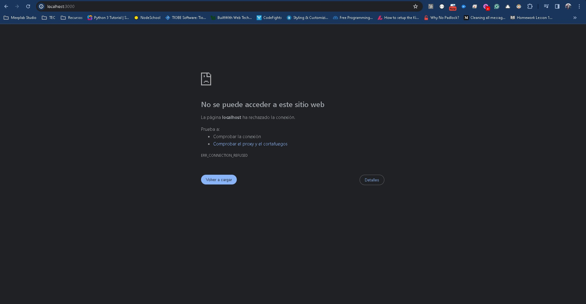
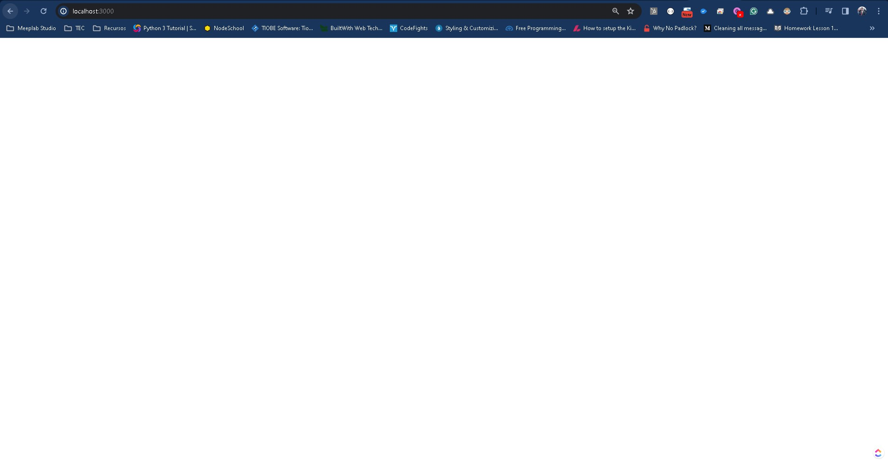
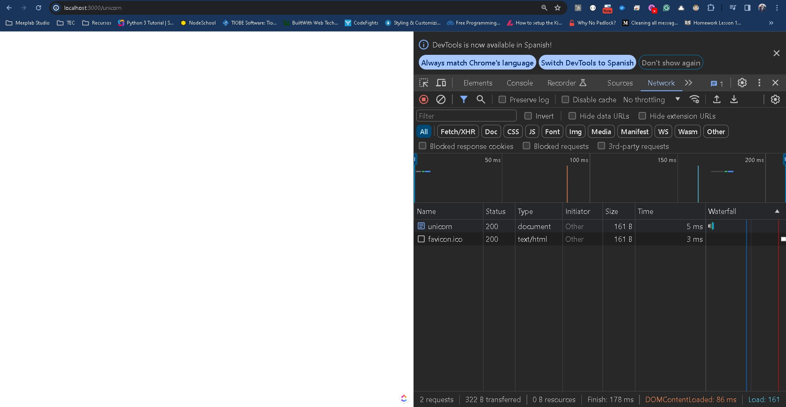
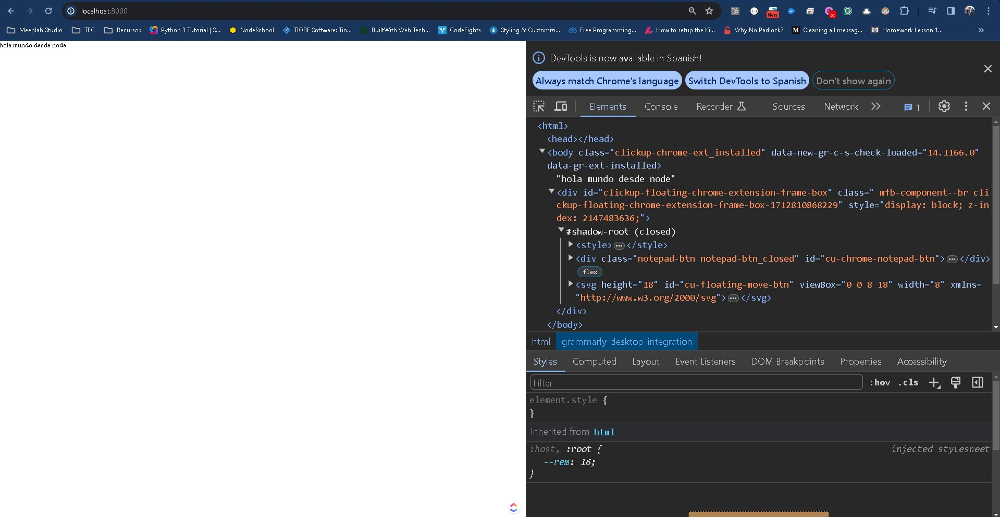
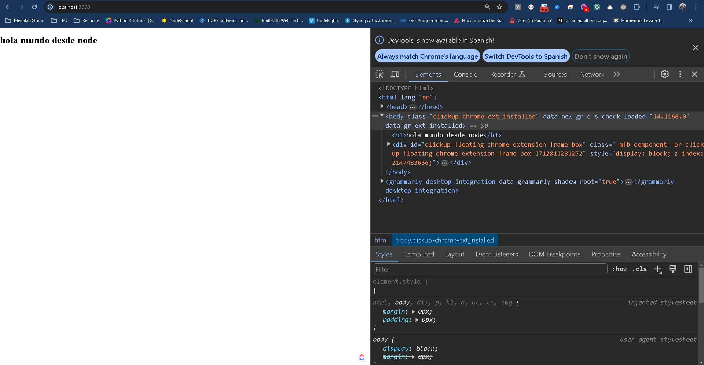

# Introducción al back-end

## Front-end y back-end

Dentro de los laboratorios anteriores hemos mostrado como el uso de HTML, CSS y Javascript, nos permite manipular el DOM dentro del navegador web y crear lo que hoy en día conocemos como páginas web.

Hasta este punto debe quedarnos claro que hemos utilizado archivos estáticos, es decir que no se modifican y que solo generan un procesamiento con Javascript a través de lo que conocemos como Programación Orientada a Eventos.

Si bien lo hemos mencionado poco hemos llegado a un punto de infección en el curso donde si bien nos podemos volver expertos en el desarrollo web estático, construyendo páginas web increíbles con los 3 exponentes, ha llegado el momento de empezar a pensar en el verdadero procesamiento de datos e información que nos permitirá crear soluciones integrales a nuestros proyectos y clientes.

Para ello necesitamos de distinguir entre el concepto de front-end y back-end. Muy escuchado por los programadores, pero ¿qué abarca cada uno? 

Si recuerdas, hemos hablado que la arquitectura que utilizamos para la comunicación entre archivos la hacemos mediante un Cliente-Servidor, el tipo de arquitectura más simple que existe. De manera simple podemos decir que el front-end es lo que está del lado del cliente y el back-end lo que está del lado del servidor.

## Front-end

El front-end es la parte de una aplicación que interactúa con los usuarios, es conocida como el lados del cliente. Básicamente es todo lo que vemos en pantalla cuando accedemos a un sitio web o aplicación: tipos de letra, colores, forma responsiva, eventos y otros elementos que permiten navegar dentro de una página web. Este conjunto crea lo que conocemos como la **experiencia de usuario**.

Como hemos dichos el desarrollador de front-end se encarga de la experiencia de usuario, es decir, en el momento en el que se entra a una página web, se debe ser capaz de navegar en ella, por lo que el usuario verá una interface sencilla de usar, atractiva y funcional.

Ahora bien, el front-end hoy en día no abarca solamente desarrollo web, pues hoy en día existen muchas formas de interfaces de usuario como aplicaciones de escritorio, aplicaciones móviles, entre otras. Cada una va a tener sus propias reglas, lenguajes y limitaciones.

## Back-end

Cuando hablamos de back-end nos referimos al interior de las aplicaciones que viven en el servidor y que a menudo se les denomina coloquialmente como **el lado del servidor**.

El back end de un sitio consiste en un servidor, una aplicación y una base de datos. Se toman los datos, se procesa la información y se envía al usuario. Hoy en día, es un poco más complejo que eso pues según el tamaño y cantidad de usuarios se requiere más capacidad de procesamiento con lo que un solo servidor puede ser suficiente. Pero para comenzar y para un sistema básico, un servidor podrá ser suficiente.

Cuando hablamos de un solo servidor para servir a toda la aplicación, es decir donde metemos aplicación, base de datos y archivos, estamos hablando de una arquitectura de monolito, pues toda la capacidad va a recaer en el poder de computo de 1 sola computadora en este caso el servidor.

Conforme vayas avanzando en tu carrera aprenderá que un monolito limita mucho las capacidades de procesamiento, crecimiento y seguridad de los sistemas, por lo que será tu labor al graduarte aplicar estrategias de arquitectura para aplicaciones grandes con demanda de usuarios en tiempo real o con una capacidad de usuarios o de procesamiento de datos que sobrepase los terabytes de información. **Y podrás hacerlo**.

Un desarrollador back-end debe tener conocimiento amplio en lenguajes de programación, manejo de servidores, sistemas operativos, seguridad y bases de datos. Si bien no es necesario conocer todos los lenguajes, es importante conocer que ventajas y desventajas trae cada uno pues ningún lenguaje es infalible. Además de que cada lenguaje cuenta con sus propios frameworks que no son más que librerías que ayudan a hacer el trabajo del desarrollador back-end más simple incorporando buenas prácticas, métodos de conexión, seguridad, entre otros.

## Full-stack

Algo que pudieras haber escuchado es sobre el término full-stack, y este no es más que el tipo de desarrollador que tiene conocimiento integral de front-end y back-end, así como de manejo de diversos sistemas operativos y lenguajes de programación.

## NodeJS

Para el curso vamos a estar trabajando con NodeJS el lenguaje de programación para servidores que no es otro más que Javascript. NodeJS surgió a partir de que el desarrollo de front-end es potenciado por el lenguaje Javascript, por lo que un grupo de desarrolladores decidieron facilitar la curva de desarrollo web reutilizando el lenguaje pero dándole todas las capacidades que se necesitan para hacer el trabajo que se necesita en back-end que por ejemplo algunas funciones son: manejo de peticiones tcp/ip, capacidad de ejecución de código de javascript sin la necesidad de un navegador, ente muchas muchas otras.

Para esta práctica ha llegado el momento de descargar NodeJS, lo puedes hacer desde la [página oficial](https://nodejs.org/en). NodeJS está disponible para todos los sistemas operativos, te recomiendo lo instales tal cual para evitarte problemas de configuración, sobre todo en Windows ya que la instalación incluye un paquete adicional de instalación que incluye librerías de .NET y el lenguaje Python que se necesitan para que el entorno simulado de NodeJS funcione.

Dentro de NodeJS vas a tener 2 versiones a instalar la mayoría de las veces la LTS (Long Term Support) y la (Current) ó actual. En general siempre intenta tener la LTS, pues es la versión más estable mientras que la Current puede llegar a tener problemas al ser un poco más experimental o menos soporte a las librerías.

Una vez que hayamos instalado NodeJS, podemos crear una carpeta en nuestra computadora y abrir nuestra terminal para poder trabajar con NodeJS.

## Hello World

Abriendo nuestro editor de confianza vamos a tener esta carpeta de inicio y vamos a crear un archivo **app.js.**

Anteriormente, la única forma de ver el resultado de nuestro archivo de Javascript, era mediante la liga a través de un archivo **HTML** en donde al abrir el navegador, teníamos que navegar a la consola y finalmente ver nuestro resultado.

Ahora vamos a simplificar todo el proceso ejecutando directamente **app.js**.

Dentro de app.js escribe lo siguiente:

```
console.log("Hola Mundo");
```

Antes de continuar te voy a decir que para manejar todo lo concerniente a NodeJS, es a través de línea de comandos y terminal. Aquí no hay escape y es el motivo de huida de muchos desarrolladores pues el manejo de servidores a través de terminal se les hace un proceso tedioso y complicado. Si bien es un terreno desafiante te pido que no te límites todavía, pues la capacidad que vas a adquirir desde este momento es mucha.

Desde nuestra terminal y en la carpeta del proyecto vamos a ejecutar el siguiente comando:

```
node -v
```

Esta instrucción nos devolverá la versión actual de NodeJS que tenemos instalada, en mi caso es la:

```
v20.11.0
```

Si tienes una versión diferente no te preocupes, NodeJS en ese aspecto no suele tener tantos conflictos de retrocompatibilidad como otros lenguajes, a lo mucho lo que puede suceder es que una librería no exista o se hayan realizado parches de seguridad que al menos para el aprendizaje no nos afectarán.

Ahora bien, es momento de ejecutar nuestro código en **app.js**, para ello escribe la siguiente instrucción:

```
node app.js
```

El resultado en terminal será como puedes intuir:
```
Hola Mundo
```

Éxito, acaba de ejecutar tu primer programa en NodeJS. Si has trabajado con otros lenguajes de programación notarás que el proceso es similar, en el sentido que hace falta tener el entorno de ejecución del lenguaje o el compilador en su defecto y a partir de ello se ejecuta el programa.

Lo anterior suena muy bien, pero no hemos visto nada diferente a lo que ya vimos en la introducción a Javascript.

## Filesystem
Una de las funciones importantes de un servidor y de cualquier lenguaje de programación es el poder hacer manejo de archivos a través de lo que se conoce como Filesystem.

Esto nos llevará a los siguientes 2 puntos:
- Importar una librería default de NodeJS
- Manejar el filesystem para leer un archivo.

Para importar librerías en Javascript, que es algo que no hemos realizado hasta este momento vamos a hacer uso de la siguiente instrucción en nuestro archivo **app.js**

```
//fs es el módulo que contiene las funciones para 
//manipular el sistema de archivos
const filesystem = require('fs');
```

Esto le dirá a NodeJS que cargue la librería para el manejo del filesystem en nuestro programa mientras se esté ejecutando.

Como ya tenemos acceso al sistema de archivos de la computadora, podemos crear, editar o eliminar archivos. Para nuestro caso vamos a crear un nuevo archivo con la siguiente instrucción.

```
//Se escribe el segundo parámetro en el archivo del primer parámetro
filesystem.writeFileSync('hola.txt', 'Hola mundo desde node');
```

Si volvemos a ejecutar nuestro archivo con la instrucción **node app.js** en la terminal veremos el mismo resultado del **Hola Mundo**, pero, si ves en tu carpeta del proyecto o en tu editor, debería aparecer un nuevo archivo con nombre **hola.txt** y si examinas su contenido verás que dice:

```
Hola mundo desde node
```
¿Por qué podemos manipular archivos?  Recuerda que cuando hablamos de un servidor es la computadora que almacena nuestra aplicación, por tanto nosotros somos responsables de como se maneja dicha computadora. Cuando hablamos de Javascript del lado del cliente en teoría no deberíamos modificar ningún archivo dentro de la computadora del cliente, pues no es algo que nos pertenezca, viéndolo desde el punto de ciberseguridad sería una muy mala práctica y nuestro sitio podría ser marcado como malicioso. Ahora nota que mi indicación es que no se debería hacer, pues el echo desde el punto ético y de seguridad es ese más desde el punto de vista funcional es que puede hacerse.


## Async Sort

Ya tenemos la capacidad de manipular los archivos de nuestra máquina lo que ya es un gran avance, pero que pasa con NodeJS y Javascript del lado del navegador, además del punto ético que te mencioné en el último párrafo, ¿existe alguna diferencia desde el punto de vista de la sintaxis del lenguaje? La respuesta es no.

NodeJS y Javascript siguen las mismas reglas de escritura de instrucciones, variables, funciones, métodos, etc. Quizás la diferencia radica es que en Javascript tenemos acceso al objeto DOM y podemos manipularlo, pero incluso el DOM desde el punto de vista del lenguaje es solo un objeto con datos, variables y funciones.

Para el caso de NodeJS quitando el objeto **document**, el **windows** y la manipulación del DOM, podemos hacer el uso de la misma lógica del lenguaje.

Para comprobarlo veremos el siguiente ejemplo:

```
const arreglo = [5000, 60, 90, 100, 10, 20, 10000, 0, 120, 2000, 340, 1000, 50];

for (let item of arreglo) {
    setTimeout(() => {
        console.log(item);
    }, item);
}
```

Trata de descubrir por tí mismo que hace el código anterior.

El código anterior lo vamos a conocer como el async sort y nos permitirá ver uno de los usos más frecuentes de NodeJS que es la espera asíncrona de peticiones.

Dentro del código tendremos un arreglo con números enteros no ordenados. Lo que hace el algoritmos es recorrer dicha lista y utilizar la función de Javascript **setTimeout()**, la cual recibe 2 parámetros:

- Función - Una función que ejecute un código que deseemos, en este caso imprimir el número que estamos leyendo.
- Tiempo (milisegundos) - El tiempo que debe pasar en milisegundos para que se ejecute la función que se recibe como parámetro.

Entonces lo que hace el código es imprimir en pantalla el elemento de la lista según el tiempo en milisegundos que representa.

Haciendo una corrida lo que sucede es lo siguiente:

- Se ejecuta el paso por **5000** (5 segs), pasarán 5 segundos antes de imprimir **5000**.
- Se ejecuta el paso por **60** (60 millis), pasarán 60 milisegundos antes de imprimir **60**.
- Se ejecuta el paso por **90** (90 millis), pasarán 90 milisegundos antes de imprimir **90**.
- Se ejecuta el paso por **100** (100 millis), pasarán 100 milisegundos antes de imprimir **100**.
- Se ejecuta el paso por **10** (10 millis), pasarán 10 milisegundos antes de imprimir **10**.
- Se ejecuta el paso por **20** (20 millis), pasarán 20 milisegundos antes de imprimir **20**.
- Se ejecuta el paso por **10000** (10 segs), pasarán 10 segundos antes de imprimir **10000**.
- Se ejecuta el paso por **0** (0 millis), pasarán 0 milisegundos antes de imprimir **0**.
- Se ejecuta el paso por **120** (120 millis), pasarán 120 milisegundos antes de imprimir **120**.
- Se ejecuta el paso por **2000** (2 segs), pasarán 2 segundos antes de imprimir **2000**.
- Se ejecuta el paso por **340** (340 millis), pasarán 340 milisegundos antes de imprimir **340**.
- Se ejecuta el paso por **1000** (1 segs), pasarán 1 segundo antes de imprimir **1000**.
- Se ejecuta el paso por **50** (50 millis), pasarán 50 milisegundos antes de imprimir **50**.

Con la corrida, resulta más evidente que los números no se imprimen como vienen en el arreglo, sino que se imprimen en orden pues empiezan a generarse un delay entre cada uno pues el orden es directamente proporcional al tiempo en milisegundos que esperan a imprimirse.

El resultado entonces sería:

```
0        
10       
20       
50       
60       
90       
100      
120      
340      
1000     
2000     
5000     
10000
```

## Código asíncrono

Con lo visto anteriormente, entonces vemos que desde Javascript podemos tener código que va llegando en diferentes momentos aunque la ejecución continua sucediendo línea por línea en el orden esperado.

Para la función **setTimeOut()** el parámetro de función que se recibe espera el tiempo necesario hasta poder ejecutarse, entonces aunque el código de manera lineal va instrucción por instrucción, si se cumple el tiempo de espera, se ejecuta la función de parámetro sin importar que más este sucediendo en ese momento. Más que decir que sea bueno o malo, dependerá de lo que necesitemos hacer y para el caso de NodeJS y el manejo de nuestro servidor será el pan de cada día.

Con lo anterior entonces ya deberías de poder resolver la siguiente incógnita. ¿Qué línea de código se ejecuta primero?

```
console.log("jojo te hackié");
console.log("¿En dónde se ejecuta esta línea?");
```

Del siguiente extracto de código:

```
const te_hackie = () => {
    console.log("jojo te hackié");
}
//setTimeout ejecuta la función recibida como primer parámetro 
//cuando hayan transcurrido los milisegundos del segundo parámetro
setTimeout(te_hackie, 7000);

console.log("¿En dónde se ejecuta esta línea?");
```

En el código anterior veremos que si no hemos comentado el Async Sort, la función **te_hackie** se ejecuta después de la impresión del 5000 pero antes que el 10000. Nuevamente a Javascript no lo importa el orden de las funciones, solo el tiempo en el que les toca ejecutarse, a esto es lo que conocemos como código asíncrono, y más adelante veremos que será la manera en la que funciona un servidor.

## Creando un servidor

Ha llegado el momento vamos a crear nuestro primer servidor, copia el siguiente código en un nuevo archivo al que le pondremos de nombre **index.js**.

```
const http = require('http');   
const server = http.createServer( (request, response) => {    
//     console.log(request.url);
//     response.setHeader('Content-Type', 'text/html');
//     response.write("");
//     response.end();
});
server.listen(3000);
```

La razón de cambiar de archivo es que en la práctica hay proyectos cuyo nombre principal de archivos de NodeJS lo llaman **app.js** ó **index.js**, otro no tan común sería **main.js**.

En nuestro código haremos uso de otra librería estándar de NodeJS llamada **http**, esta librería es la que nos permite definir un servidor y poder manipular las entradas y salidas del mismo.

Antes de ejecutar el archivo vamos a hacer algo, ve a tu navegador y escribe la dirección:

```
localhost:3000
//Como alternativa puedes escribir:
127.0.0.0:3000
```
El resultado debería ser el siguiente:




Si observas el mensaje de error dice **ERR_CONNECTION_REFUSED** indicándonos que no hay nada corriendo en la dirección local dentro del puerto 3000.

Ahora, vamos a ejecutar el archivo con:

```
node index.js
```

Dos cosas van a suceder, en la terminal no finalizará el programa se quedará en un modo espera. Y si nuevamente vamos al navegador y escribimos la dirección pasará lo siguiente:

Al inicio no pasará nada, pero deberá aparecer un loader de que algo esta sucediendo.

> Nota: Si usaste la ventana donde nos apareció **ERR_CONNECTION_REFUSED**  puedes confundirte, te recomiendo hagas la prueba en una nueva pestaña.

Lo interesante, es que ahora no nos da la página de error, sino que simplemente se queda ahí, esto es por que el servidor recibe la petición, pero no tenemos nada actualmente que realice.

Ahora vamos a quitar el comentario del código que está dentro de la declaración de la función del servidor.

```
console.log(request.url);
response.setHeader('Content-Type', 'text/html');
response.write("");
response.end();
```

Ahora, guarda el archivo e intenta abrirlo en el navegador con **localhost:3000**, ¿qué sucedió?

Nada, y esto es por que aunque guardamos nuestro archivo **index.js** no reiniciamos el servidor, esto es importante cuando estás desarrollando pues necesitas detener el servidor y volverlo a correr para que carguen los nuevos cambios.

Para detener el servidor, desde la terminal ejecuta la secuencia de comandos ctrl+C.

Nuevamente ejecuta **node index.js**, ve al navegador y recarga ahora sí la página.

El resultado será una página en blanco:



Vamos a revisar instrucción por instrucción lo que acabamos de hacer:

```
console.log(request.url);
```

Esta línea utiliza el objeto **request** que contendrá toda la información que pasemos desde el cliente al servidor, si mandamos un formularios por ejemplo, o información a través de una url **request** debería tener esa información.

En el caso de **request.url** lo que hace es que imprime la url que se está llamando en ese momento.

El resultado aparecerá en la terminal y nos tiene una sorpresa.

```
/
/favicon.ico
```

La primera ruta es la que hace referencia a nuestro navegador cuando escribimos **localhost:3000**, escribir esta url solo le da la dirección a donde conectarse, pero cuando la encuentra adelante escribirá la url que le es solicitada, en este caso como no pasamos nada, utiliza la url default **/**.

La sorpresa vendrá con la segunda url **/favicon.ico**, aquí lo que sucede es que al momento de llamar una cualquier url, los navegadores tienen la instrucción estándar de jalar esta url y colocar un icono, que seguramente has visto al lado del título de la pestaña del navegador.


Como no estamos manejando esta url el navegador utiliza una imagen default.

Para la instrucción:
```
response.setHeader('Content-Type', 'text/html');
```

Lo que estamos diciendo aquí es que el contenido de la respuesta sea tratado por el navegador como código HTML. Aquí se utiliza el objeto **response**, que nuevamente es esencial en el manejo del servidor, a diferencia de **request** como podrás imaginar, contendrá toda la información que mandaremos de regreso al cliente al completar la solicitud. Lo cual nos lleva a la siguiente instrucción:


```
response.write("");
```

La instrucción escribe el código HTML que queramos mandar de regreso, de momento lo dejamos vacío y por eso es que la página se ve en blanco.

La función write solo escribe la respuesta en el **request** pero no lo manda, para ello es necesario hacer uso de la última instrucción.

```
response.end();
```

La función **end()**, es la encargada de mandar la respuesta al cliente y a partir de ello es que podemos ver la página en blanco en el navegador.

Intenta a cambiar la url de **localhost:3000** con variantes de url y observa lo que pasa:

```
localhost:3000/unicorn
localhost:3000/unicorn/error
```

Todas las respuestas en el navegador serán páginas en blanco, pues no estamos haciendo una distinción para las url. Pero en la terminal verás como cambia la primera url que se llama y que además van seguidas del **/favicon.ico**, también nota que el servidor nunca se detiene y se combina la primera ejecución con las siguientes.

## Ver que hace el servidor desde el navegador

Hoy en día, los servidores rastrean todas las peticiones que les hacen los clientes para mantener un mejor entendimiento de lo que se está haciendo o solicitando. De la misma manera los navegadores han evolucionado tanto que es posible ver que acciones ejecuta el servidor, y si bien no podemos ver lo que sucede internamente podemos ver nuestros **request** y todas sus **responses**.

En un ciclo ideal, dentro de la arquitectura cliente-servidor siempre para todo **request** deberá existir un **response**, puede haber excepciones y para ello se manejan códigos especiales de error que veremos más adelante.

Para ver este historial de solicitudes basta que hagamos clic derecho > seleccionemos inspeccionar elemento.

Dentro del menú hasta ahora hemos explorado, la pestaña de **elements** para ver el contenido de la página y **console** para ver la salida del código de javascript. Ahora nos vamos a la pestaña **network** y procederemos a recargar la página.



Esta vista nos ayudará mucho en el futuro, pues hará lo siguiente:

- Nos muestra una lista de los request y sus respuestas, si seleccionamos cada uno podemos ver el contenido completo, además nos dice el tiempo de carga de cada cosa.
- Por otro lado de manera global nos indica el tiempo de carga del DOM, si estamos optimizando el tiempo de carga de la página es un buen sitio donde comenzar.

Con más experiencia y conocimiento podrás obtener más información de lo que esta sucediendo entre el cliente y el servidor, de momento nos quedaremos así.

## Devolver código HTML

Como ya vimos la instrucción:

```
response.write("");
```

Permite enviar texto de vuelta,y se permite el uso de HTML solo por que previamente usamos la instrucción:

```
response.setHeader('Content-Type', 'text/html');
```

Vamos a enviar algo al servidor como:

```
response.write("hola mundo desde node");
```

No olvides guardar el archivo y reiniciar el servidor.

Al volver a cargar la url, puede ser la primera, **localhost:3000**, veremos el siguiente resultado:



Dentro de la página no hay problema, pero si exploramos el contenido html, veremos que se hace un código difícil de entender, a diferencia que hicimos lo mismo la primera vez con **index.html**, esto a se debe que el navegador entiende que se procesa una petición y su respuesta no es un html estandarizado, por lo que aunque intenta hacerlo añade más código del necesario.

Vamos a modificar la respuesta con un html en regla, pero para ello usaremos el tercer tipo de comillas de Javascript para evitar conflictos con otro tipo de comillas.

```
response.write(`
    <!DOCTYPE html>
    <html lang="en">
    <head>
        <meta charset="utf-8">
        <title>HTML</title>
    </head>
    <body>
       <h1>hola mundo desde node</h1>
    </body>
    </html>
`);
```

Nuevamente guardamos y reiniciamos el servidor. El resultado:



El resultado es el h1 en negritas y que el contenido html tiene el formato esperado.

> Nota: Verás que a mí me aparecen 2 div extraños, estas son extensiones que tengo instaladas en chrome, y se añaden de manera automática a todo el código HTML de mi navegador. Si tu tienes extensiones instaladas el código puede variar.

Éxito, con esto ya podrías incorporar páginas HTML de tus laboratorios anteriores, pero si tratas de agregar archivos externos de CSS o Javascript estos no funcionarán, la única manera de que esto sirva es que agregue el código directamente en una etiqueta:

```
<style>
    //Mi código CSS
</style>
 ```
ó
 ```
<javascript>
    //Mi código Javascript
</javascript>
```

Si bien ya podríamos trabajar creando páginas web completas, esta no es la forma más funcional de hacerlo. En próximos laboratorios veremos como optimizar esto separando en archivos las peticiones y para usar nuevamente nuestros archivos HTML, CSS y JS como en laboratorios anteriores por separado.

Experimenta con el servidor, la única forma de que entiendas todos sus secretos es llevarlo al límite y ejecutar ver si es el resultado que realmente esperas.