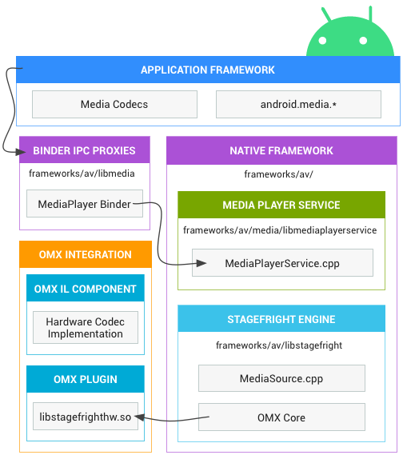
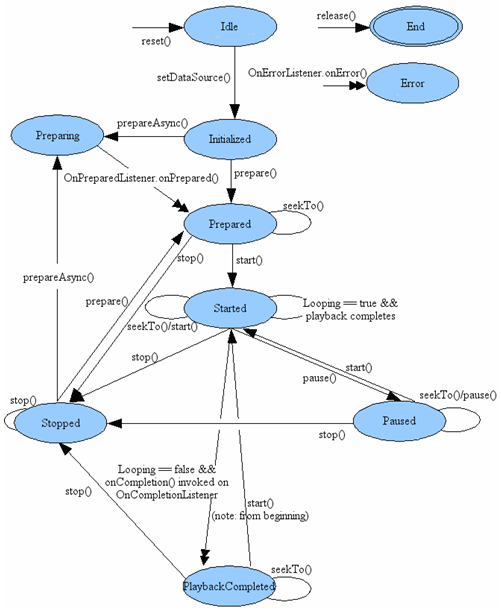
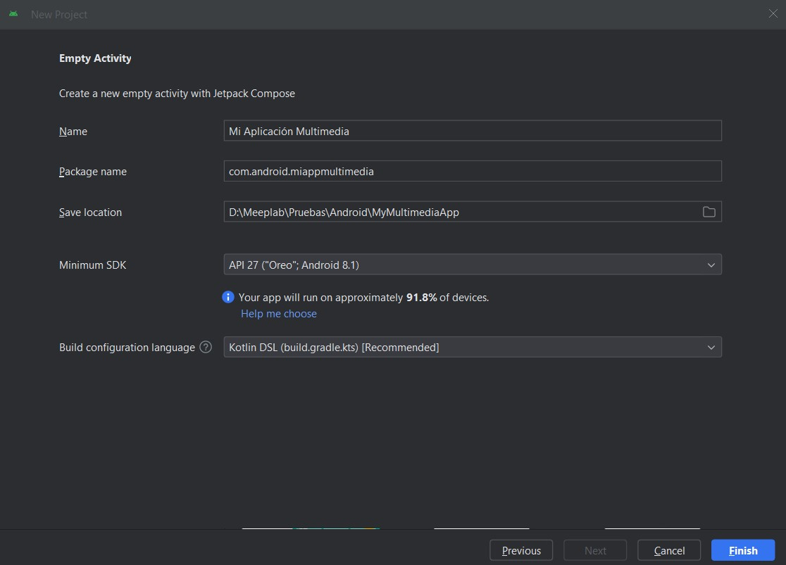
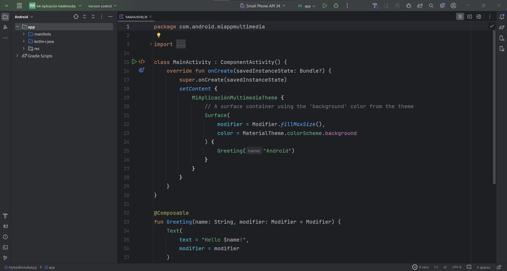
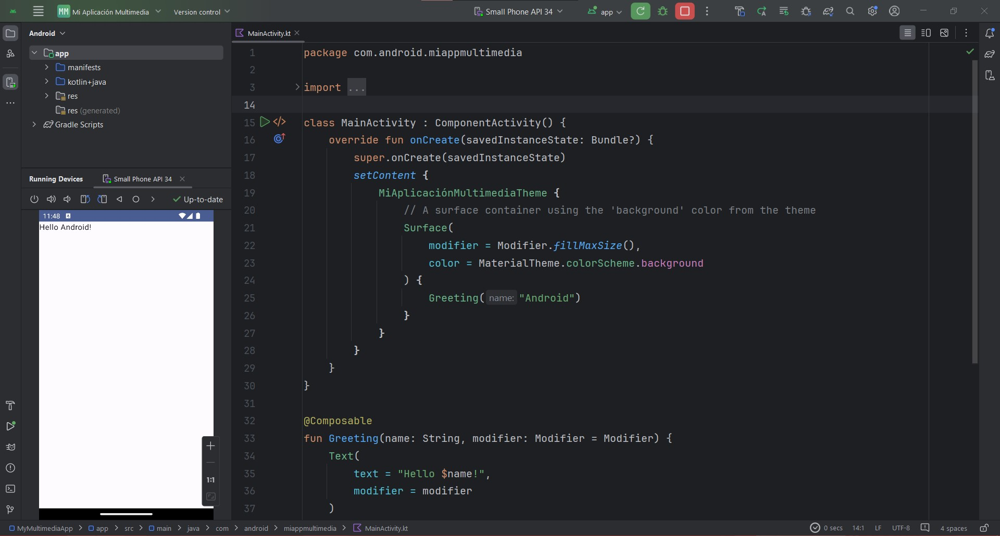
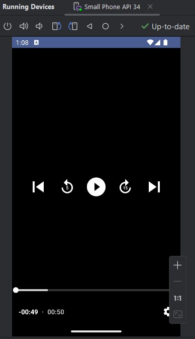

# Multimedia en Android

## Introducción a Multimedia en Android
En la era digital, el contenido multimedia se ha convertido en una parte omnipresente de nuestras vidas. Imágenes, videos y audio nos rodean y enriquecen nuestras experiencias en todo momento. En el ámbito del desarrollo de aplicaciones Android, la multimedia juega un papel fundamental, permitiendo crear aplicaciones interactivas, atractivas y llenas de posibilidades.
 Un viaje a través del tiempo: La historia del multimedia desde la era moderna hasta Android

### Era Moderna

- 1927: Se estrena "El cantante de jazz", la primera película sonora.
- 1948: Se crea la cinta magnética, revolucionando la grabación de audio.
- 1951: Se lanza el primer televisor a color.
- 1963: Se lanza el primer videojuego, "Tennis for Two".
- 1971: Se lanza el primer cassette de audio, compactando la música en un formato portátil.
- 1975: Se lanza el primer VHS, reemplazando al Betamax en la guerra de formatos de video.
- 1982: Se lanza el primer CD de audio, ofreciendo una calidad de sonido superior al vinilo.
- 1984: Se crea el Macintosh de Apple, con una interfaz gráfica de usuario que facilita la interacción con el multimedia.
- 1991: Se lanza la World Wide Web, permitiendo compartir contenido multimedia a nivel global.

### Era Digital

- 1993: Se crea el formato MP3, comprimiendo el audio digital para facilitar su almacenamiento y distribución.
- 1995: Se lanza el primer reproductor de MP3, el Rio PMP300.
- 1998: Se crea el formato JPEG, comprimiendo imágenes digitales para optimizar su almacenamiento.
- 2001: Se lanza el primer iPod de Apple, revolucionando la forma de escuchar música.
- 2004: Se crea el formato YouTube, plataforma líder para compartir videos online.
- 2007: Se lanza el iPhone de Apple, con una pantalla táctil que redefine la interacción con el multimedia.
- 2010: Se lanza el iPad de Apple, una tableta que amplía las posibilidades del multimedia portátil.
- 2011: Se lanza Google Play Store, poniendo a disposición millones de aplicaciones multimedia para Android.
- 2012: Se lanza Netflix como servicio de streaming, cambiando la forma de consumir películas y series.
- 2015: Se lanza el Apple Watch, el primer smartwatch con capacidades multimedia.
- 2016: Se lanza Pokémon Go, un juego de realidad aumentada que conquista al mundo.
- 2017: Se lanza el primer smartphone con pantalla OLED, el Samsung Galaxy S8.
- 2018: Se lanza YouTube Music, un servicio de streaming de música que compite con Spotify.
- 2019: Se lanza Disney+, un servicio de streaming que ofrece contenido de Disney, Pixar, Marvel y Star Wars.
- 2020: La pandemia de COVID-19 impulsa el consumo de contenido multimedia en línea.
- 2021: Se lanza el primer smartphone con cámara de 108 megapíxeles, el Xiaomi Mi 11 Ultra.
- 2022: Se lanza el metaverso, una nueva frontera para el multimedia inmersivo.

### Android

- 2008: Se lanza Android, un sistema operativo para smartphones con enfoque en la telefonía y mensajería.
- 2009: Se introduce la API MediaPlayer para la reproducción básica de audio y video.
- 2010: La cámara se integra como un elemento multimedia clave, permitiendo la captura de imágenes y videos.
- 2011: Nace Google Play Store, impulsando la explosión de aplicaciones multimedia.
- 2014: Se introduce la API ExoPlayer como una solución robusta para la reproducción de audio y video.
- 2015: Android Marshmallow trae soporte nativo para VP9, un formato de video con mayor eficiencia en la compresión.
- 2016: Android Nougat introduce APIs para la realidad virtual y aumentada, expandiendo las posibilidades del multimedia.
- 2017-presente: Android continúa evolucionando con APIs para la transmisión en vivo, la edición multimedia y la integración con plataformas de streaming.

### ¿Qué entendemos por multimedia?

La multimedia se refiere a la integración de diferentes tipos de contenido en una misma aplicación. Esta integración puede incluir:
Imágenes: Fotografías, ilustraciones, iconos, gráficos y cualquier otro elemento visual.
Video: Grabaciones en movimiento, animaciones, cortometrajes, transmisiones en vivo y mucho más.
Audio: Música, podcasts, efectos de sonido, narraciones, entrevistas y cualquier otro contenido sonoro.
Texto: Información escrita, descripciones, rótulos, subtítulos y elementos interactivos.
La combinación de estos elementos permite crear aplicaciones que van más allá de la simple presentación de información. Las posibilidades son infinitas: desde juegos interactivos y plataformas de aprendizaje hasta aplicaciones de fitness con videos motivacionales o herramientas de edición multimedia para creativos.

### Un viaje hacia la multimedia en Android

Android ofrece un ecosistema robusto para el desarrollo de aplicaciones multimedia. A continuación, un breve recorrido por los elementos clave que te ayudarán a dar vida a tus ideas:

1. Entendiendo los formatos multimedia - Cada tipo de contenido multimedia tiene sus propios formatos de archivo. Algunos de los más populares son:

    - Imágenes: JPEG, PNG, GIF, BMP, WebP.
    - Audio: MP3, WAV, AAC, OGG Vorbis, FLAC.
    - Video: MP4, AVI, MOV, WMV, MKV, FLV.

2. El poder de los códecs - Los códecs son programas que codifican y decodifican archivos multimedia para optimizar su almacenamiento y reproducción. Algunos ejemplos son:

    - Compresión de imágenes: JPEG, PNG, WebP.
    - Compresión de audio: MP3, AAC, OGG Vorbis, FLAC.
    - Compresión de video: H.264, H.265, VP9.

### Consideraciones adicionales:
 
- Formatos compatibles: Elegir formatos compatibles con la mayoría de los dispositivos Android.
- Optimización: Reducir el tamaño de los archivos multimedia sin afectar la calidad para mejorar la experiencia del usuario.
- APIs multimedia: Usar las APIs proporcionadas por Android para trabajar con diferentes tipos de archivos multimedia.
 
### Diagrama de arquitectura de Android con énfasis en las APIs de multimedia



> Android Developers. (2024). Arquitectura Android para Multimedia. https://source.android.com/static/docs/core/media/images/ape_fwk_media.png?hl=es

### Esquema del flujo de datos en la reproducción de audio



> Adictos al trabajo. (2020). Introducción a reproducir música en Android con MediaPlayer. https://www.adictosaltrabajo.com/wp-content/uploads/2020/06/mediaplayer-states.png

## APIs multimedia de Android

### APIs específicas: Puertas de entrada al mundo multimedia

En el desarrollo de aplicaciones Android, las APIs específicas son como puertas de entrada que te permiten acceder a las funcionalidades multimedia del sistema operativo. Cada API se encarga de un tipo de contenido multimedia en particular, brindándote control preciso y flexibilidad para crear experiencias interactivas y atractivas.

Profundicemos en el concepto:
 
**¿Qué son las APIs específicas?**

Las APIs específicas son interfaces de programación de aplicaciones diseñadas para trabajar con tipos específicos de contenido multimedia. A diferencia de APIs generales como Context o Resources, las APIs específicas ofrecen un conjunto de funciones y métodos especializados para tareas como:
 
- Reproducción: Controlar la reproducción de audio y video, incluyendo pausar, reanudar, buscar y ajustar el volumen.
- Carga: Cargar archivos multimedia desde diferentes fuentes, como la memoria del dispositivo, la tarjeta SD o la red.
- Visualización: Mostrar imágenes y videos en la interfaz de usuario de la aplicación.
- Captura: Capturar imágenes y videos utilizando la cámara del dispositivo.
- Edición: Editar archivos multimedia, como cortar, rotar y aplicar filtros.
- Transmisión: Transmitir audio y video en vivo a través de internet.

Android proporciona APIs específicas para trabajar con cada tipo de contenido multimedia. Estas APIs te permiten:

- Reproducir audio y video: MediaPlayer, ExoPlayer.
- Mostrar imágenes: ImageView, Picasso, Glide.
- Capturar imágenes y video: Camera, MediaRecorder.
- Grabar audio: AudioRecord.
- Editar archivos multimedia: Existen diversas herramientas y APIs de terceros para la edición multimedia.

El desarrollo de aplicaciones multimedia en Android es un campo apasionante que te permite crear experiencias interactivas para los usuarios. En este tema, nos adentraremos en las tres bibliotecas clave para la reproducción de audio y video: MediaPlayer, MediaStore y ExoPlayer.
- MediaPlayer: API para reproducir audio y video en una aplicación Android. Permite controlar la reproducción, pausar, reanudar, buscar en el tiempo y ajustar el volumen.
- MediaStore: API para acceder a la biblioteca multimedia del dispositivo, incluyendo imágenes, audio y video. Permite consultar metadatos, obtener URIs de archivos y realizar operaciones de CRUD (Crear, Leer, Actualizar, Eliminar).
- ExoPlayer: API alternativa a MediaPlayer para reproducir audio y video. Ofrece mayor flexibilidad y soporte para formatos de streaming adaptativo como DASH y SmoothStreaming.

En resumen:
- MediaPlayer: Reproduce archivos multimedia.
- MediaStore: Accede a la biblioteca multimedia del dispositivo.
- ExoPlayer: Reproduce archivos multimedia con mayor flexibilidad y soporte para streaming adaptativo.

## Implementación básica de reproducción de medios

Para este pequeño laboratorio vamos a crear un reproductor de música para el formato .m3u8, también conocido como M3U8 (MPEG-3 Playlist Version 8) el cual tiene como función generar listas de reproducción multimedia. Estos formatos contienen listas de archivos de audio y/o video con información adicional como duración, título y ubicación. Su codificación se realiza normalmente en formato UTF-8 y tienen las siguientes características:

Uso:

- Transmisión de audio y video en vivo: IPTV, HLS (HTTP Live Streaming)
- Listas de reproducción multimedia: VLC, Winamp, iTunes

Ventajas:

- Fácil de crear y editar: Archivo de texto plano.
- Ligero: Tamaño reducido.
- Versátil: Compatible con varios reproductores y plataformas.

Limitaciones:

- No es un formato de archivo multimedia: No contiene los datos de audio o video.
- Dependencia de archivos externos: Requiere de los archivos de audio o video para funcionar.

Ejemplos:

- Listas de reproducción de música en Spotify.
- Transmisiones en vivo de eventos deportivos.
- Videos bajo demanda en plataformas como Netflix.

### Paso 1 Creación de un proyecto Android Studio

Para este laboratorio estaremos utilizando la versión de Android Studio, Iguana (2023.2.1), versiones anteriores o posteriores pueden ser soportadas, sin embargo pueden tener adecuaciones en el archivo Gradle por el nuevo formato de uso con Kotlin, y los números de las versiones de las librerías los cuales veremos en detalle.

El laboratorio hace uso de Jetpack Compose para el desarrollo de la interfaz, pero se puede obtener el mismo resultado utilizando MDC ó manejo de XML en formato tradicional para desarrollo de interfaces.

Una vez abriendo Android Studio vamos a crear un Nuevo Proyecto y seleccionamos un proyecto con un Empty Activity que utiliza como base Jetpack Compose y damos click en Next.


Dentro de la ventana de configuración del proyecto vamos a cambiar lo siguiente:
- Nombre: Mi Aplicación Multimedia
- Package: com.android.miappmultimedia
- Locations: Utiliza una carpeta de destino donde vaya a alojarse tu proyecto
- Minimum SDK: API 27 (“Oreo”; Android 8.1)
- Build configuration Language Kotlin DSL (build.gradle.kts)

Y damos click en **Finish**.



 Esperamos un momento a que el proyecto termine su configuración inicial para poder empezar a trabajar.



**Nota: Para este laboratorio puedes hacer uso de un dispositivo físico o del emulador para ejecutar tu aplicación, recuerda que si vas a realizar un proyecto para usuarios finales se recomienda que siempre hagas pruebas en un dispositivo físico para probar el resultado de la manera más real posible.**

### Paso 2 Configuración básica del proyecto

Ya que tenemos la versión base del proyecto vamos a correrla en un dispositivo y asegurarnos que la configuración inicial no está corrupta. Conectamos o cargamos el emulador correspondiente y damos click en el botón para correr la aplicación.


Si la configuración es adecuada veremos algo como lo siguiente:



Recordemos que un proyecto vacío para Jetpack Compose contiene una función default de **Saludo** o la función **Greeting**.

Si nuestro proyecto se ejecutó correctamente entonces vamos a eliminar esta función default que se llama en la **línea 25** del archivo **MainActivity.kt**, también vamos a eliminar las funciones de Compose **Greeting()** y **GreetingPreview()**. Dejando un código como el siguiente:

```
import android.os.Bundle
import androidx.activity.ComponentActivity
import androidx.activity.compose.setContent
import androidx.compose.foundation.layout.fillMaxSize
import androidx.compose.material3.MaterialTheme
import androidx.compose.material3.Surface
import androidx.compose.ui.Modifier
import com.android.miappmultimedia.ui.theme.MiAplicaciónMultimediaTheme


class MainActivity : ComponentActivity() {
   override fun onCreate(savedInstanceState: Bundle?) {
       super.onCreate(savedInstanceState)
       setContent {
           MiAplicaciónMultimediaTheme {
               // A surface container using the 'background' color from the theme
               Surface(
                   modifier = Modifier.fillMaxSize(),
                   color = MaterialTheme.colorScheme.background
               ) {
                   //Aquí llamaremos nuestra función del reproductor
               }
           }
       }
   }
}

```

### Paso 3 Añadir las dependencias necesarias

Con lo anterior dejamos el terreno preparado para poder empezar a construir nuestra aplicación, pero ahora nos hacen falta los materiales de construcción en forma de librerías para nuestro proyecto.

Vamos a abrir el archivo **build.gradle.kts (:app)** y en la sección de dependencias o dependencies agregaremos lo siguiente:

```
implementation("androidx.compose.ui:ui-androidx:1.6.3")
implementation("androidx.compose.ui:ui-tooling:1.6.3")
implementation("androidx.compose.runtime:runtime:1.6.3")
implementation("androidx.compose.compiler:compiler:1.5.10")
implementation("androidx.media3:media3-exoplayer-hls:1.3.0")

```

Dependiendo de la versión de android puede solicitarte adecuación con el nuevo formato de librerías en cuyo caso puedes ajustar sustituyendo lo anterior por lo siguiente:

```
implementation(libs.androidx.media3.exoplayer)
implementation(libs.androidx.media3.exoplayer.dash)
implementation(libs.androidx.media3.ui)
implementation(libs.exoplayer)
implementation(libs.androidx.media3.exoplayer.hls)
```

El detalle con esta sustitución es que deberás agregar las librerías en el nuevo archivo libs.versions.toml (Version Catalog), donde ahora se colocan las versiones de las librerías en forma de variables. Mi archivo se ve de la siguiente manera:

```
[versions]
agp = "8.3.0"
compiler = "1.2.0-alpha07"
exoplayer = "2.19.1"
kotlin = "1.9.0"
coreKtx = "1.12.0"
junit = "4.13.2"
junitVersion = "1.1.5"
espressoCore = "3.5.1"
lifecycleRuntimeKtx = "2.7.0"
activityCompose = "1.8.2"
composeBom = "2024.02.02"
media3Exoplayer = "1.3.0"
runtime = "1.6.3"
uiAndroidx = "1.6.3"
uiAndroidxVersion = "1.2.0-alpha07"


[libraries]
androidx-compiler = { module = "androidx.compose.compiler:compiler", version.ref = "compiler" }
androidx-core-ktx = { group = "androidx.core", name = "core-ktx", version.ref = "coreKtx" }
androidx-media3-exoplayer = { module = "androidx.media3:media3-exoplayer", version.ref = "media3Exoplayer" }
androidx-media3-exoplayer-dash = { module = "androidx.media3:media3-exoplayer-dash", version.ref = "media3Exoplayer" }
androidx-media3-exoplayer-hls = { module = "androidx.media3:media3-exoplayer-hls", version.ref = "media3Exoplayer" }
androidx-media3-ui = { module = "androidx.media3:media3-ui", version.ref = "media3Exoplayer" }
androidx-runtime = { module = "androidx.compose.runtime:runtime", version.ref = "runtime" }
androidx-ui-androidx = { module = "androidx.compose.ui:ui-androidx", version.ref = "uiAndroidx" }
androidx-ui-androidx-v120alpha07 = { module = "androidx.compose.ui:ui-androidx", version.ref = "uiAndroidxVersion" }
exoplayer = { module = "com.google.android.exoplayer:exoplayer", version.ref = "exoplayer" }
junit = { group = "junit", name = "junit", version.ref = "junit" }
androidx-junit = { group = "androidx.test.ext", name = "junit", version.ref = "junitVersion" }
androidx-espresso-core = { group = "androidx.test.espresso", name = "espresso-core", version.ref = "espressoCore" }
androidx-lifecycle-runtime-ktx = { group = "androidx.lifecycle", name = "lifecycle-runtime-ktx", version.ref = "lifecycleRuntimeKtx" }
androidx-activity-compose = { group = "androidx.activity", name = "activity-compose", version.ref = "activityCompose" }
androidx-compose-bom = { group = "androidx.compose", name = "compose-bom", version.ref = "composeBom" }
androidx-ui = { group = "androidx.compose.ui", name = "ui" }
androidx-ui-graphics = { group = "androidx.compose.ui", name = "ui-graphics" }
androidx-ui-tooling = { group = "androidx.compose.ui", name = "ui-tooling" }
androidx-ui-tooling-preview = { group = "androidx.compose.ui", name = "ui-tooling-preview" }
androidx-ui-test-manifest = { group = "androidx.compose.ui", name = "ui-test-manifest" }
androidx-ui-test-junit4 = { group = "androidx.compose.ui", name = "ui-test-junit4" }
androidx-material3 = { group = "androidx.compose.material3", name = "material3" }
ui-tooling = { module = "androidx.compose.ui:ui-tooling", version.ref = "uiAndroidx" }


[plugins]
androidApplication = { id = "com.android.application", version.ref = "agp" }
jetbrainsKotlinAndroid = { id = "org.jetbrains.kotlin.android", version.ref = "kotlin" }
```

Ahora vamos a sincronizar el proyecto para descargar todas las librerías, no olvides que esto lo podemos realizar desde el icono del elefante.


Esta primera ejecución puede tomar un poco de tiempo en lo que se bajan todos los recursos. Una vez que lo tengamos listo vamos a regresar a nuestro archivo **MainActivity.kt.**

Si bien ya tenemos nuestros materiales listos y por facilidad para este laboratorio voy a dejarte los archivos a importar para que no tengas problemas con las librerías o clases utilizadas, asegúrate que todas funcionen de la manera correcta, sustituimos los imports actuales por los siguientes:

```
import android.net.Uri
import android.os.Bundle
import androidx.activity.ComponentActivity
import androidx.activity.compose.setContent
import androidx.annotation.OptIn
import androidx.compose.foundation.layout.fillMaxSize
import androidx.compose.foundation.layout.fillMaxWidth
import androidx.compose.foundation.layout.height
import androidx.compose.material3.MaterialTheme
import androidx.compose.material3.Surface
import androidx.compose.runtime.Composable
import androidx.compose.runtime.DisposableEffect
import androidx.compose.runtime.LaunchedEffect
import androidx.compose.runtime.remember
import androidx.compose.ui.Modifier
import androidx.compose.ui.platform.LocalContext
import androidx.compose.ui.unit.dp
import androidx.compose.ui.viewinterop.AndroidView
import androidx.media3.common.util.UnstableApi
import androidx.media3.datasource.DefaultHttpDataSource
import androidx.media3.exoplayer.hls.HlsMediaSource
import com.android.miappmultimedia.ui.theme.MiAplicaciónMultimediaTheme
```

Listo, ahora vamos a comenzar a trabajar con el reproductor.

### Paso 4 Diseño de la interfaz de usuario

Como mencionamos anteriormente una de las API de manejo de contenido multimedia es ExoPlayer, esta librería si bien es externa a las básicas de Android, es un API oficial construida por Google para resolver ciertos puntos que las API nativas no pueden resolver, en este caso el streaming multimedia. Para ello debemos configurar un reproductor ExoPlayer y a partir de este ejecutar nuestro streaming de audio.

Regresando a nuestro proyecto en el archivo MainActivity.kt al final y asegurándote que estás fuera de la clase MainActivity, es decir fuera de la última llave o “ } ”.

Vamos a colocar el siguiente código:

```
@OptIn(UnstableApi::class)
@Composable
fun ExoPlayerView() {
   val context = LocalContext.current


   val exoPlayer = androidx.media3.exoplayer.ExoPlayer.Builder(context).build()


   val mediaSource:MediaItem? = null


   LaunchedEffect(mediaSource) {
       exoPlayer.setMediaItem(mediaSource!!,false)
       exoPlayer.prepare()
   }


   DisposableEffect(Unit) {
       onDispose {
           exoPlayer.release()
       }
   }


   AndroidView(
       factory = { ctx ->
           androidx.media3.ui.PlayerView(ctx).apply {
               player = exoPlayer
           }
       },
       modifier = Modifier
           .fillMaxWidth()
           .height(200.dp) // Set your desired height
   )
}
```

Vamos a explorarlo con cuidado para entender lo que está sucediendo:

Definimos una función llamada ExoPlayerView() la cual tiene las etiquetas de anotación @OptIn(Unstable::class), esto es para notificar al compilador que el código que la utiliza está usando una API inestable. Esto significa que la API puede cambiar o incluso ser eliminada en futuras versiones de Android. Por otro lado la etiqueta @Composable como ya debes saber se refiere a que la función utiliza Jetpack Compose y que en lo general llama al código de interfaz de la aplicación.

Después empezaremos extrayendo el contexto y declarando nuestro reproductor ExoPlayer.

```
val context = LocalContext.current
val exoPlayer = androidx.media3.exoplayer.ExoPlayer.Builder(context).build()
```

La línea que corresponde al mediaSource la vamos a sustituir en el siguiente paso y es la que nos permitirá cargar nuestro audio en streaming.

```
val mediaSource:MediaItem? = null
```

Después asignamos el mediaSource o nuestra fuente multimedia al reproductor con las líneas:

```
LaunchedEffect(mediaSource) {
   exoPlayer.setMediaItem(mediaSource!!,false)
   exoPlayer.prepare()
}
```

Como todo en Android deberemos manejar el ciclo de vida y de eventos del reproductor, esto con lo que vimos previamente en el diagrama de como reproducir música en Android.

```
DisposableEffect(Unit) {
   onDispose {
       exoPlayer.release()
   }
}
```

Por último vamos a hacer uso de la clase de Compose **AndroidView** para embeber un reproductor ExoPlayer a Compose, y después le asignaremos la configuración previa que declaramos, aquí también puedes observar que nuestro reproductor ocupa el tamaño completo de la pantalla en ancho y 200 dp para la altura, que es un tamaño adecuado para lo que necesitamos por ahora.

```
AndroidView(
   factory = { ctx ->
       androidx.media3.ui.PlayerView(ctx).apply {
           player = exoPlayer
       }
   },
   modifier = Modifier
       .fillMaxWidth()
       .height(200.dp) // Set your desired height
)
```

Ahora ya que revisamos el código vamos a llamar nuestra función ExoPlayerView() dentro de nuestra clase MainActivity que debería estar más o menos en la línea 38 o debajo del comentario

```
//Aquí llamaremos nuestra función del reproductor
```

Para ello nos quedará algo como lo siguiente:

```
class MainActivity : ComponentActivity() {
   override fun onCreate(savedInstanceState: Bundle?) {
       super.onCreate(savedInstanceState)
       setContent {
           MiAplicaciónMultimediaTheme {
               // A surface container using the 'background' color from the theme
               Surface(
                   modifier = Modifier.fillMaxSize(),
                   color = MaterialTheme.colorScheme.background
               ) {
                   //Aquí llamaremos nuestra función del reproductor
                   ExoPlayerView()
               }
           }
       }
   }
}
```

Por ahora no vamos a ejecutar la aplicación todavía puesto que no fallará al momento de abrir puesto que nuestro MediaSource aún no está listo.

### Paso 5 Carga de un archivo de audio

Ahora que queremos cargar nuestro audio vamos a hacer uso de una estación en internet, Audio Disney, la cual puedes sintonizar desde la siguiente URL:

```
https://19313.live.streamtheworld.com/XHFOFMAAC/HLS/playlist.m3u8?dist=web-radiodisney
```

Si abrimos esta url en nuestro navegador veremos que propiamente no se abre ningún reproductor, sino que al contrarió nos pide descargar un archivo, como te mencioné al inicio del tema los archivos .m3u8 utilizan un archivo de texto para detectar la estación que deben sintonizar, esto sirve por ejemplo para la IPTV, en donde se crean archivos con múltiples canales y las aplicaciones de reproducción pueden cambiar entre cada canal. Internamente lo que sucede es que cambiar de canal es pasar a otro elemento de esta lista del archivo .m3u8.

Regresando a nuestro proyecto, en el mismo archivo MainActivity.kt al final del mismo vamos a crear la función **buildMediaSource**, esta función será una función normal, es decir no hará uso de Compose para trabajar, pero si utilizará la etiqueta @OptIn(UnstableApi::class) y se verá de la siguiente forma:

```
@OptIn(UnstableApi::class)
private fun buildMediaSource(): androidx.media3.common.MediaItem {
   val url = "https://19313.live.streamtheworld.com/XHFOFMAAC/HLS/playlist.m3u8?dist=web-radiodisney"
   val uri = Uri.parse(url)
   return HlsMediaSource.Factory(DefaultHttpDataSource.Factory())
       .createMediaSource(androidx.media3.common.MediaItem.fromUri(uri)).mediaItem
}
```

Como puedes observar de nuestra función, primero estamos asignando en una variable la url de reproducción al archivo .m3u8, después decodificamos esta URL en una URI.

En Android, una **URI (Identificador Uniforme de Recursos)** funciona como una dirección para localizar un recurso. Es una cadena de caracteres que especifica cómo acceder a un archivo, datos o incluso una acción dentro del sistema Android o en la web.

Desglose de las URIs en Android:
- Uniformidad: Utilizan un formato consistente en diferentes recursos.
- Identificador de Recursos: Identifica un recurso específico, no solo una ubicación en la web como un URL (Localizador Uniforme de Recursos).

Tipos de URIs en Android:
- URIs de contenido: Acceden a archivos almacenados en el almacenamiento del dispositivo o en los directorios de datos de otras aplicaciones. Por ejemplo, una URI para una imagen en la aplicación de galería podría ser content://media/external/images/media/12345.
- URIs de archivo: Apuntan directamente a archivos en el almacenamiento del dispositivo. Un ejemplo sería file:///storage/emulated/0/music/song.mp3.
- URIs HTTP: Son direcciones web normales que se utilizan para acceder a recursos en Internet, como https://www.example.com/image.jpg.
- Otros esquemas: Android también admite otros esquemas de URI para acciones específicas, como tel: para realizar llamadas telefónicas o geo: para iniciar mapas con coordenadas específicas.

Al usar URIs, su aplicación puede acceder a diversos recursos sin necesidad de conocer la ubicación física exacta del archivo o los datos. Esto hace que su código sea más flexible y adaptable a diferentes configuraciones de dispositivos.

Ejemplos de uso de URIs:
- Compartir una imagen con otra aplicación a través de un Intent.
- Abrir un archivo de audio en un reproductor de música.
- Acceder a la configuración del dispositivo.
- Mostrar una ubicación en Google Maps.

Regresando a nuestra función  **buildMediaSource()**, al crear la URI de nuestra URL hacemos uso de la librería **HLSMediaSource** que se encarga de decodificar los archivos en formato .m3u8 para ExoPlayer. Un punto importante a destacar es que según el tipo de archivo la forma de obtener el MediaSource puede ser diferente ya que cada formato de audio y video tiene sus propias características, y si bien ExoPlayer nos permite reproducir diferentes formatos los códecs adicionales requieren configuraciones diferentes. Un buen ejercicio para seguir aprendiendo sería que investigarás otras configuraciones para otros tipos de códecs.

El resultado final será regresar en la función un objeto **MediaItem** que es elemento del **MediaSource** y es el objeto que recibirá nuestro reproductor.

Ahora volveremos a nuestra función de Compose **ExoPlayerView**(), y donde teníamos la línea

```
val mediaSource:MediaItem? = null
```

Vamos a sustituirla por lo siguiente:

```
val mediaSource:MediaItem = buildMediaSource()
```

Como buena práctica ahora que asignamos el valor a mediaSource podemos deshacernos de los signos de exclamación “ !! ”, al momento de asignar el **mediaSource** dentro del **LaunchedEffect** justo en las líneas debajo de la asignación del mediaSource quedando como lo siguiente:

```
LaunchedEffect(mediaSource) {
   exoPlayer.setMediaItem(mediaSource,false)
   exoPlayer.prepare()
}
```

Ahora sí podemos ejecutar la aplicación, el resultado será algo como lo siguiente:



De forma automática tendremos un navegador, si damos click en el botón de play se empezará a cargar nuestra estación de radio y podremos escuchar en tiempo real el resultado.

¡Éxito! Has logrado completar tu primera aplicación multimedia, y no de cualquier tipo, ahora puedes hacer streaming como las grandes aplicaciones que hay en el mercado.

## Conclusión

A partir de aquí se expanden un mundo de posibilidades, puesto que podremos empezar a personalizar la interfaz, agregar más métodos interactivos y poder jugar entre audio y video, así como otros elementos de la reproducción multimedia. Y lo más importante es que como puedes ver en el código no es tan complejo como puede llegar a parecer. No olvides practicar y entender lo que sucede en el código para poder dar el siguiente paso en tu experiencia de aprendizaje.
