# Imágenes y efectos visuales

## Carga y visualización de Imágenes

Las imágenes dentro de las aplicaciones móviles son parte de lo que hoy en día conocemos como contenido multimedia. Si queremos hacer una aplicación es necesario conocer cómo cargar imágenes ya que podemos tener diferentes casos importantes, imágenes como colores o banners los cuales son cargados más de manera local, contra imágenes que vienen desde internet. Si bien el resultado sería el mismo la forma de realizarlo es diferente. Una vez cargada la imagen, veremos que se le pueden aplicar diferentes estilos como por ejemplo transformarla: modificar su tamaño, rotarla y aplicar otros efectos a los cuales los usuarios que toman muchas fotos aplican en las mismas como efectos de distorsión, colores entre otros.
En este laboratorio, aprenderás a crear una aplicación de Android con Jetpack Compose que muestra una lista de imágenes de productos. La aplicación utilizará la biblioteca Coil para la carga eficiente de imágenes, está si bien no es nativa de Android se ha convertido en uno de los pilares básicos de manejo de imágenes para Android pues además de la carga permite la manipulación de ciertos efectos que veremos en los siguientes temas.
Las siguientes imágenes son de uso gratuito para poder trabajar este laboratorio.Te recomiendo que tengas a la mano las url y también descargues las imágenes, ya que vamos a utilizar la carga tanto de manera local como a través de Internet:


```
https://images.pexels.com/photos/2536965/pexels-photo-2536965.jpeg

https://images.pexels.com/photos/90946/pexels-photo-90946.jpeg

https://images.pexels.com/photos/4158/apple-iphone-smartphone-desk.jpg

https://images.pexels.com/photos/2638026/pexels-photo-2638026.jpeg

```
### Paso 1 Creación de un proyecto en Android Studio

Para este laboratorio estaremos utilizando la versión de Android Studio, Iguana (2023.2.1), versiones anteriores o posteriores pueden ser soportadas, sin embargo pueden tener adecuaciones en el archivo Gradle por el nuevo formato de uso con Kotlin, y los números de las versiones de las librerías los cuales veremos en detalle.

El laboratorio hace uso de Jetpack Compose para el desarrollo de la interfaz, pero se puede obtener el mismo resultado utilizando MDC ó manejo de XML en formato tradicional para desarrollo de interfaces.

Una vez abriendo Android Studio vamos a crear un **Nuevo Proyecto** y seleccionamos un proyecto con un **Empty Activity** que utiliza como base **Jetpack Compose** y damos click en **Next**.


Dentro de la ventana de configuración del proyecto vamos a cambiar lo siguiente:
- Nombre: Mi Aplicación de Imágenes
- Package: com.android.miappimagenes
- Locations: Utiliza una carpeta de destino donde vaya a alojarse tu proyecto
- Minimum SDK: API 27 (“Oreo”; Android 8.1)
- Build configuration Language Kotlin DSL (build.gradle.kts)

Y damos click en **Finish**.

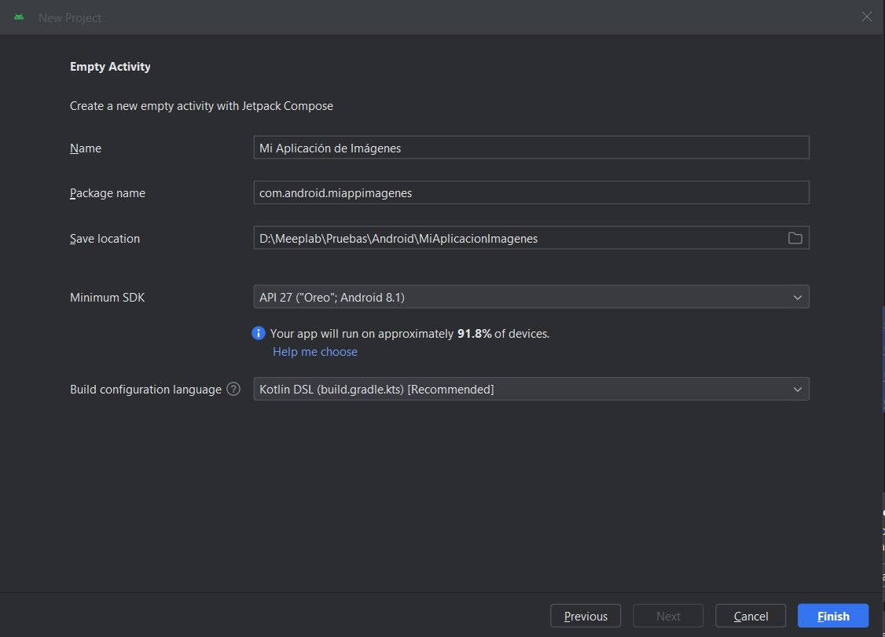

Esperamos un momento a que el proyecto termine su configuración inicial para poder empezar a trabajar.


> Nota: Para este laboratorio puedes hacer uso de un dispositivo físico o del emulador para ejecutar tu aplicación, recuerda que si vas a realizar un proyecto para usuarios finales se recomienda que siempre hagas pruebas en un dispositivo físico para probar el resultado de la manera más real posible.

### Paso 2 Configuración básica del Proyecto

Ya que tenemos la versión base del proyecto vamos a correrla en un dispositivo y asegurarnos que la configuración inicial no está corrupta. Conectamos o cargamos el emulador correspondiente y damos click en el botón para correr la aplicación.


Si la configuración es adecuada veremos algo como lo siguiente:


Recordemos que un proyecto vacío para Jetpack Compose contiene una función default de **Saludo** o la función **Greeting**.

Si nuestro proyecto se ejecutó correctamente entonces vamos a eliminar esta función default que se llama en la **línea 25** del archivo **MainActivity.kt**, también vamos a eliminar las funciones de Compose **Greeting()** y **GreetingPreview()**. Dejando un código como el siguiente:

```
import android.os.Bundle
import androidx.activity.ComponentActivity
import androidx.activity.compose.setContent
import androidx.compose.foundation.layout.fillMaxSize
import androidx.compose.material3.MaterialTheme
import androidx.compose.material3.Surface
import androidx.compose.material3.Text
import androidx.compose.runtime.Composable
import androidx.compose.ui.Modifier
import androidx.compose.ui.tooling.preview.Preview
import com.android.miappimagenes.ui.theme.MiAplicaciónDeImágenesTheme


class MainActivity : ComponentActivity() {
   override fun onCreate(savedInstanceState: Bundle?) {
       super.onCreate(savedInstanceState)
       setContent {
           MiAplicaciónDeImágenesTheme {
               // A surface container using the 'background' color from the theme
               Surface(
                   modifier = Modifier.fillMaxSize(),
                   color = MaterialTheme.colorScheme.background
               ) {
                   //Aquí llamaremos nuestra función para las imágenes
               }
           }
       }
   }
}
```

Ahora vamos a abrir el archivo AndroidManifest.xml y agregaremos el permiso de Internet, recuerda que esto es importante cuando queremos realizar cualquier conexión a Internet de lo contrario aunque nuestro código sea correcto no veremos un resultado adecuado.

La línea a agregar es la siguiente:

```
<uses-permission android:name="android.permission.INTERNET" />
```

### Paso 3 Añadir las dependencias necesarias.

Con lo anterior dejamos el terreno preparado para poder empezar a construir nuestra aplicación, pero ahora nos hacen falta los materiales de construcción en forma de librerías para nuestro proyecto.

Vamos a abrir el archivo build.gradle.kts (:app) y en la sección de dependencias o dependencies agregaremos lo siguiente:

```
implementation("androidx.compose.ui:ui-tooling:1.6.4")
implementation("androidx.activity:activity-compose:1.4.0")
implementation("io.coil-kt:coil-compose:2.3.0")
```

Dependiendo de la versión de android puede solicitarte adecuación con el nuevo formato de librerías en cuyo caso puedes ajustar sustituyendo lo anterior por lo siguiente:

```
implementation(libs.ui.tooling)
implementation(libs.androidx.activity.compose.v140)
implementation(libs.coil.compose)
```

El detalle con esta sustitución es que deberás agregar las librerías en el nuevo archivo **libs.versions.toml (Version Catalog)**, donde ahora se colocan las versiones de las librerías en forma de variables. Mi archivo se ve de la siguiente manera:

```
[versions]
activityComposeVersion = "1.4.0"
agp = "8.3.0"
coilCompose = "2.3.0"
kotlin = "1.9.0"
coreKtx = "1.12.0"
junit = "4.13.2"
junitVersion = "1.1.5"
espressoCore = "3.5.1"
lifecycleRuntimeKtx = "2.7.0"
activityCompose = "1.8.2"
composeBom = "2023.08.00"
uiFrameworkVersion = "1.2.0"
uiTooling = "1.6.4"


[libraries]
androidx-activity-compose-v140 = { module = "androidx.activity:activity-compose", version.ref = "activityComposeVersion" }
androidx-core-ktx = { group = "androidx.core", name = "core-ktx", version.ref = "coreKtx" }
androidx-ui-framework = { module = "androidx.compose.ui:ui-framework", version.ref = "uiFrameworkVersion" }
androidx-ui-material = { module = "androidx.compose.ui:ui-material", version.ref = "uiFrameworkVersion" }
coil-compose = { module = "io.coil-kt:coil-compose", version.ref = "coilCompose" }
junit = { group = "junit", name = "junit", version.ref = "junit" }
androidx-junit = { group = "androidx.test.ext", name = "junit", version.ref = "junitVersion" }
androidx-espresso-core = { group = "androidx.test.espresso", name = "espresso-core", version.ref = "espressoCore" }
androidx-lifecycle-runtime-ktx = { group = "androidx.lifecycle", name = "lifecycle-runtime-ktx", version.ref = "lifecycleRuntimeKtx" }
androidx-activity-compose = { group = "androidx.activity", name = "activity-compose", version.ref = "activityCompose" }
androidx-compose-bom = { group = "androidx.compose", name = "compose-bom", version.ref = "composeBom" }
androidx-ui = { group = "androidx.compose.ui", name = "ui" }
androidx-ui-graphics = { group = "androidx.compose.ui", name = "ui-graphics" }
androidx-ui-tooling = { group = "androidx.compose.ui", name = "ui-tooling" }
androidx-ui-tooling-preview = { group = "androidx.compose.ui", name = "ui-tooling-preview" }
androidx-ui-test-manifest = { group = "androidx.compose.ui", name = "ui-test-manifest" }
androidx-ui-test-junit4 = { group = "androidx.compose.ui", name = "ui-test-junit4" }
androidx-material3 = { group = "androidx.compose.material3", name = "material3" }
ui-tooling = { module = "androidx.compose.ui:ui-tooling", version.ref = "uiTooling" }


[plugins]
androidApplication = { id = "com.android.application", version.ref = "agp" }
jetbrainsKotlinAndroid = { id = "org.jetbrains.kotlin.android", version.ref = "kotlin" }
```

Ahora vamos a sincronizar el proyecto para descargar todas las librerías, no olvides que esto lo podemos realizar desde el icono del elefante.


Esta primera ejecución puede tomar un poco de tiempo en lo que se bajan todos los recursos. Una vez que lo tengamos listo vamos a regresar a nuestro archivo **MainActivity.kt.**

### Paso 4 Imágenes locales.

Para poder comenzar a hablar de las imágenes en android, necesitamos caer dentro de los assets del proyecto. Dentro del proyecto de Android vamos a ver que tenemos la carpeta res de (resources), si la extendemos vamos a observar que tenemos dos carpetas para el manejo de imágenes, la carpeta drawable y la carpeta de mipmap. En la que nos enfocaremos para este laboratorio es la carpeta de drawable ya que es la más comúnmente usada para imágenes externas del proyecto.

> Nota: Algo importante a recalcar sobre todos los archivos dentro de la carpeta res, es que deben seguir una convención de nombre estilo snake_case, esto quiere decir que no se aceptan archivos con mayúsculas y que todos los espacios deben ser sustituidos por guión bajo. Puedes seguir la siguiente liga para ver más detalle de este estilo de nombramiento de variables y archivos [Snake Case.](https://es.wikipedia.org/wiki/Snake_case)

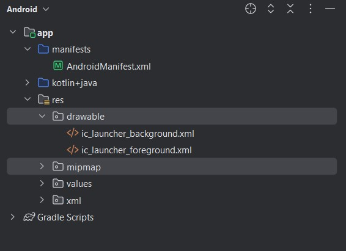

Android nos permite trabajar con archivos de imágenes en formatos jpg, png, gif y svg. Para los dos últimos se requiere de librerías externas como Coil para hacerlos trabajar pero es posible.

Vamos a descargar las imágenes de la url inicial que te compartí, nuevamente puedes verlas a continuación:

```
https://images.pexels.com/photos/2536965/pexels-photo-2536965.jpeg
https://images.pexels.com/photos/90946/pexels-photo-90946.jpeg
https://images.pexels.com/photos/4158/apple-iphone-smartphone-desk.jpg
https://images.pexels.com/photos/2638026/pexels-photo-2638026.jpeg
```

> Nota: Si alguna de las URL no te funcionara, no te preocupes solo busca otra imagen cuya URL tenga la terminación del tipo de archivo utilizado.

Tomando en cuenta el nombre de archivos que necesitamos para la carpeta res, vamos a renombrar las imágenes como imagen_1, imagen_2, imagen_3 e imagen_4, con la extensión de archivo que corresponda cada una, nota que la tercera imagen difiere con las otras en qué es jpg en lugar de jpeg.

Antes de agregarlas al proyecto debemos hablar de otro concepto importante dentro de Android que son las variantes multimedia, esto se refiere a que una imagen hoy en día puede tener distinta calidad, pensando en un buen proyecto las imágenes locales deben ajustarse de acuerdo al dispositivo que las carga.

Pongamos un ejemplo: Si tenemos una imagen en muy buena calidad, es probable que la imagen en ancho y alto excedan los 1000 pixeles, y según su calidad puede aumentar su peso en cuestión de archivo. Una muy alta calidad podría exceder los MB de información tan solo para 1 imagen o fotografía.
Esto no supondría un problema si tenemos un teléfono de gama alta el cual a nivel de procesamiento tiene recursos suficientes para mostrar imágenes de este calibre. Sin embargo la saturación del mercado de Android es muy amplia, y así como tenemos dispositivos de gama alta, tenemos dispositivos de gama baja, que tan solo con abrir una imágen muy pesada pueden llegar a hacer que nuestra aplicación falle en tiempo de ejecución.

Este problema común nos lleva a que las imágenes locales deben cuidar mucho la cantidad de recursos que gastan por tipo de dispositivo para evitar que lo que se ve en pantalla haga fallar a la aplicación y eso nos lleva a cualquier tipo de dispositivo sea de calidad baja, media o alta.

Para ello Android nos provee de formas de segmentar nuestros archivos de recursos lo cual tiene ventajas y desventajas.

- La principal ventaja es que podemos atacar este problema de la segmentación por dispositivo creando carpetas especiales que permiten desplegar según la calidad de pantalla que sea detectada por la aplicación, es decir para un dispositivo de gama baja mostraremos una imagen reducida en calidad pero con las características suficientes para que la aplicación no falle y para dispositivos de gama alta podemos visualizar la misma imagen pero con todo su potencial.

- La principal desventaja es que esto requiere que dupliquemos todas nuestras imágenes locales en múltiples según la calidad del dispositivo, esto puede volverse un problema ya que si no contamos con las herramientas adecuadas hacer el cambio será un proceso tedioso y largo. Y la otra desventaja es que al final tendremos tan solo de 1 imagen inicial hasta 4, 5 o incluso 6 copias en la resolución específica que necesita la aplicación, por lo que al final si no optimizamos la entrega de nuestra aplicación, esta pudiera llegar a pesar demasiado como para que los usuarios vean innecesario dicho peso y pueda correrse el riesgo de que desinstalen la aplicación.

La primera desventaja podemos evitarla de una manera relativamente simple, ya que hoy en día existen un gran número de páginas web que permiten a partir de una imagen inicial, crear las imágenes correspondientes para las diferentes densidades de pantalla y la ventaja es que funcionan tanto para Android como para iOS.

La segunda desventaja hoy en día también se puede atacar cuando generamos el desplegado de la aplicación con archivos apk y aab. Si bien no es objetivo de este laboratorio ver el paso a producción de una aplicación, es importante que conozcas estos 2 formatos ya que el apk es el principal y el aab es el que optimiza todo este tema con un paso de conversión y simplificación. Te dejo el siguiente artículo donde podrás indagar un poco más al respecto [AAB vs APK.](https://www.xataka.com/basics/archivos-aab-android-que-estos-archivos-que-se-diferencian-apk)

Con base en lo anterior, ya sabemos que necesitamos convertir nuestras imágenes a los formatos de densidad de pantalla que necesita Android, para ello usaremos la siguiente herramienta [App Icon](https://www.appicon.co/#image-sets) Dentro de esta herramienta podemos arrastrar nuestras imágenes y seleccionar el formato de salida de Android como se muestra a continuación.

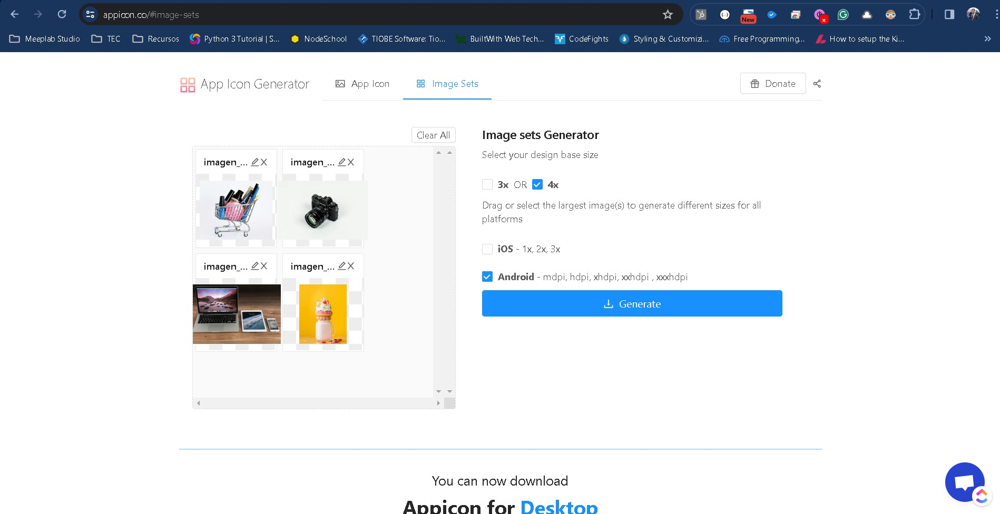

Una vez realizado vamos a dar clic en el botón de **Generate**, el cual descargara un archivo zip con las imágenes ya en el formato necesario. Si abrimos el archivo descargado veremos que contiene una carpeta android y dentro de esta se encontraran las carpetas con un prefijo **drawable-** y el código para cada resolución de Android disponible que es **hdpi, mdpi, xhdpi, xxhdpi, xxxhdpi.**

Ahora vamos a buscar la carpeta de nuestro proyecto que estamos trabajando. La siguiente visualización puede variar de acuerdo a tu sistema operativo pero el contenido final es el mismo.

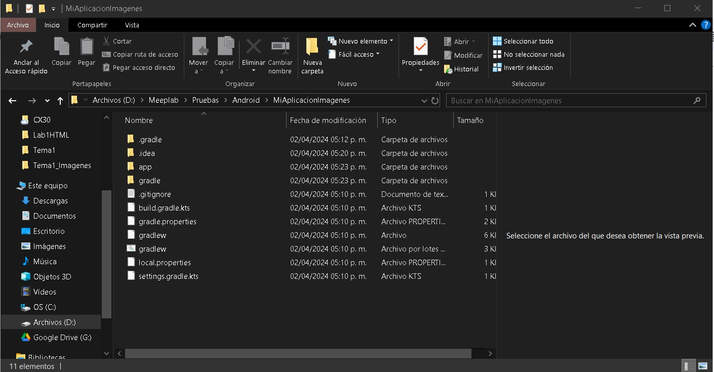

Des aquí vamos a entrar a la carpeta app > src > main > res y veremos que solo existe una carpeta drawable.

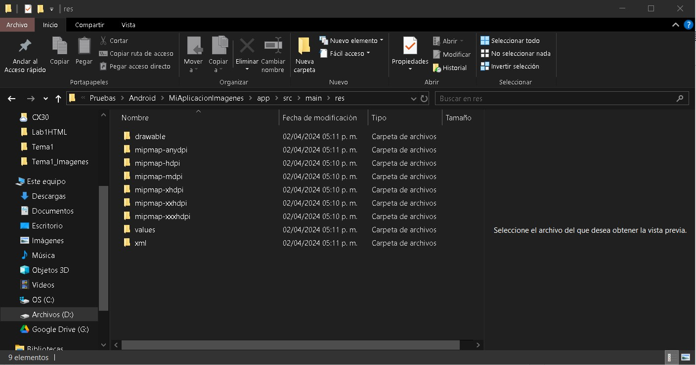

Una vez aquí vamos a copiar las carpetas que descargamos y dejar que se alineen a las demás carpetas de res.

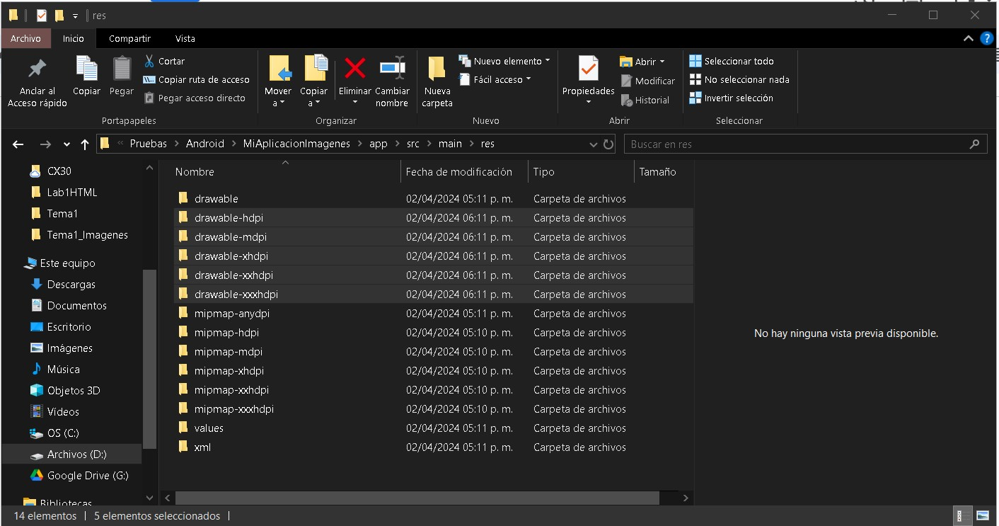

Así mismo dentro de la carpeta drawable vamos a copiar los archivos originales, la carpeta de drawable sirve como una especie de default ya que si por alguna razón, ninguna de las otras carpetas funcionara para el dispositivo del usuario, de manera automática tomará lo que encuentre en drawable.

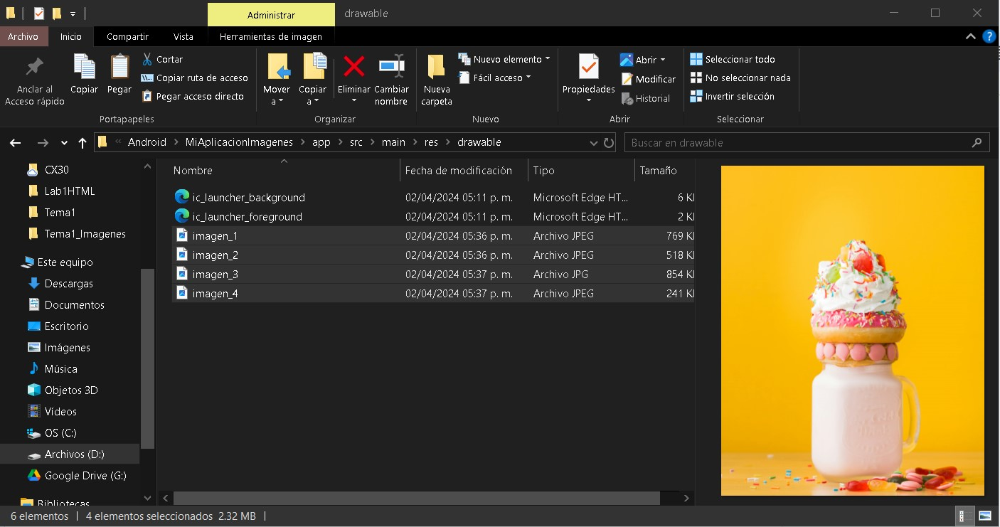

No lo olvides, el caso ideal es generar todas las imágenes locales de tu proyecto con los diferentes tamaños por densidad de pantalla para una mejor optimización de recursos en tu aplicación, pero en caso de que no puedas o quieras hacerlo basta con agregar a tu carpeta default drawable y agregar las imágenes correspondientes.

Otra forma de comprobar que las imágenes se agregaron de manera correcta es desde Android Studio en la vista del proyecto expandiendo la carpeta res y drawable.

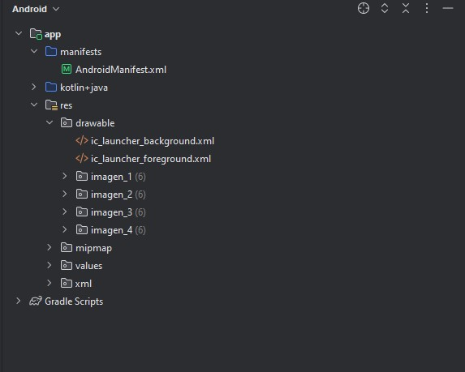

Ya que hemos agregado las imágenes al proyecto ahora si podemos empezar con nuestro código para poder desplegarlas. Vamos a abrir nuestro archivo MainActivity creado por default al momento de iniciar el proyecto y que previamente limpiamos. Después de nuestra clase MainActivity vamos a crear una función de Compose que contenga el siguiente código:

```
@Composable
fun VistaImagenes() {
   Image(
       painterResource(id = R.drawable.imagen_1),
       contentDescription = "Imagen del producto",
   )
}


@Preview(showBackground = true)
@Composable
fun GreetingPreview() {
   MiAplicaciónDeImágenesTheme {
       VistaImagenes()
   }
}
```

Por último en la línea 40 debajo del comentario que dejamos de **//Aquí llamaremos nuestra función para las imágenes**, Aquí vamos a llamar la función **VistaImagenes().**

Nuestra primera función VistaImagenes() utiliza el compose de Image para poder declarar una nueva imagen. Dentro de las propiedades para poder declarar una imagen, veremos que tenemos al menos 2 propiedades básicas:
1. painterResource - Esta propiedad es la que llama la imagen que queremos cargar desde nuestra carpeta res -> drawable, observa que no necesitamos realizar ninguna diferenciación a los diferentes tipos de carpeta drawable que tenemos para las imágenes, como mencionamos este proceso se hace de manera interna por el dispositivo.
2. contentDescription - Esta propiedad es subestimada muchas veces por los programadores pues no le ven un uso importante, sin embargo esta propiedad es de suma importancia ya que este texto que se pasa a la imagen sirve para personas con capacidades diferentes, en particular para personas con discapacidad visual. Android tiene un modo de apoyo a personas con discapacidad visual en donde todo lo que hay en pantalla se lee por el dispositivo, para el caso de textos no hay problema pero para las imágenes la única forma de explicarlas es a través de este texto. Acostumbra a poner el texto para tus imágenes ya que esto aumentará la capacidad de usuarios de tus aplicación y te permitirá atender necesidades más grandes u orientar tu aplicación hacia otro tipo de mercados.

La función VistaImagenesPreview nos ayuda a ver el resultado antes de correr nuestra aplicación, como ahora es muy simple solo veremos algo como lo siguiente:

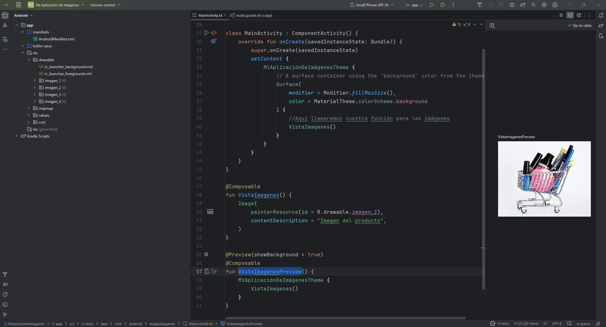

No olvides activar el preview que se encuentra del lado superior derecho de la pantalla.

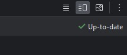

Ahora empezaremos con algunas propiedades adicionales que es importante manejar siempre con la imagen pero no son indispensables al inicio, esto tiene que relacionarse con la altura y el ancho. Por default la imagen se ajusta al tamaño que tiene, en caso de exceder las dimensiones de pantalla simplemente se corta a lo horizontal o vertical. Es por esto que para manejar de mejor forma la imagen debemos delimitar el estándar según la necesidad que cubre la imagen. En ocasiones es necesario tener la imagen en pantalla completa y en ocasiones queremos delimitar que siga las dimensiones de la imagen o en un tercer caso queremos delimitar un ancho y alto específico. Para esto utilizaremos la propiedad del modifier, para crear un modificador y poder agregar estas propiedades de dimensión.

Antes de comenzar con los casos, vamos a remover el modificador de tamaño completo en la línea 47.

```
Surface(
   modifier = Modifier.fillMaxSize(), //Eliminar
   color = MaterialTheme.colorScheme.background
) {
   //Aquí llamaremos nuestra función para las imágenes
   VistaImagenes()
}

```

Dejando lo siguiente

```
Surface(
   color = MaterialTheme.colorScheme.background
) {
   //Aquí llamaremos nuestra función para las imágenes
   VistaImagenes()
}
```

Vamos con el primer caso, para hacer que la imagen cubra la pantalla completa necesitamos modificar nuestro código a lo siguiente.

```
@Composable
fun VistaImagenes() {
   Image(
       painterResource(id = R.drawable.imagen_1),
       contentDescription = "Imagen del producto",
       modifier = Modifier.fillMaxSize()
   )
}
```

Si ejecutamos nuestra aplicación en el emulador o en un dispositivo veremos un resultado como el siguiente.

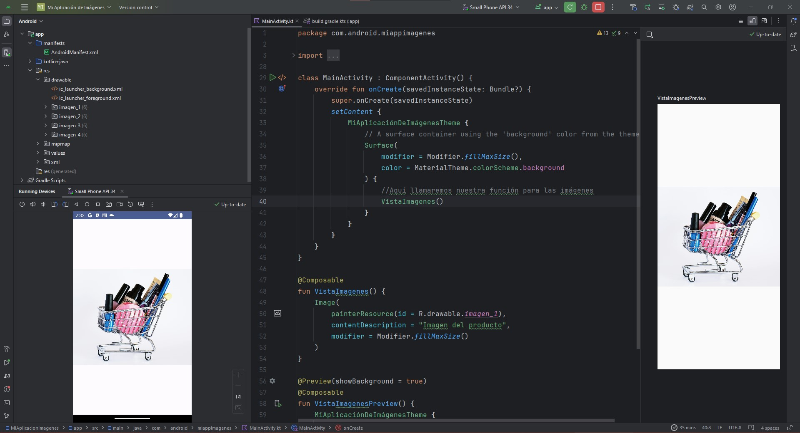

Para el segundo caso vamos a hacer que las dimensiones se ajusten al tamaño de la imagen, para ello vamos a actualizar nuestro modificador a lo siguiente:

```
@Composable
fun VistaImagenes() {
   Image(
       painterResource(id = R.drawable.imagen_1),
       contentDescription = "Imagen del producto",
       modifier = Modifier.wrapContentWidth().wrapContentHeight()
   )
}
```

Esto nos dará como resultado

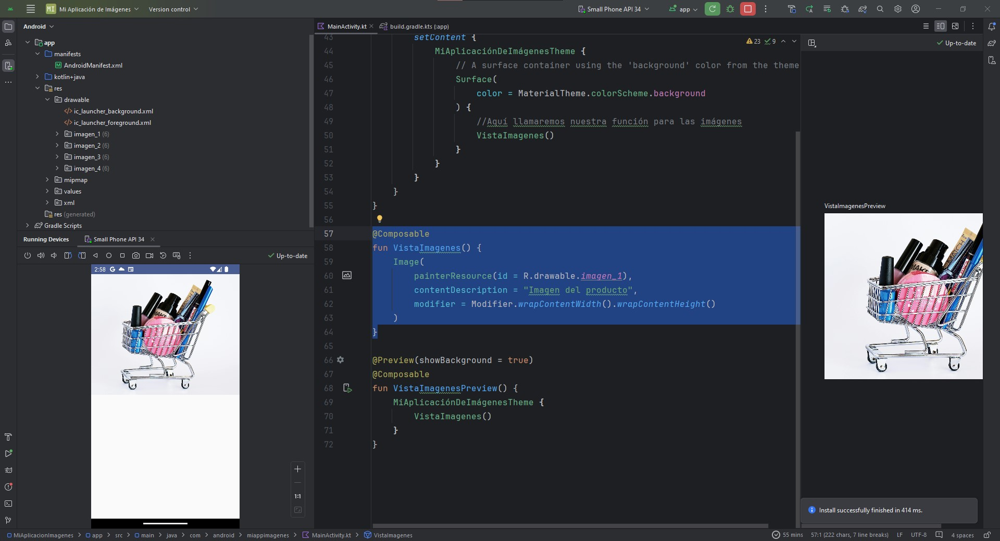

Por último vamos a utilizar dimensiones específicas para el tamaño, para ello actualizaremos nuestro modificador a lo siguiente:

```
@Composable
fun VistaImagenes() {
   Image(
       painterResource(id = R.drawable.imagen_1),
       contentDescription = "Imagen del producto",
       modifier = Modifier.width(120.dp).height(120.dp)


   )
}
```

Cuando usamos un tamaño específico podemos utilizar diferentes tipos de medidas, pero la más común y en realidad la que debemos utilizar siempre son los dp.

Los dp se refieren a puntos de pantalla por píxel. Esto quiere decir que si bien las pantallas de los dispositivos usan píxeles para mostrar lo que vemos, nuevamente vamos a caer en lo que hemos estado trabajando de las diferencias entre pantallas para dispositivos de gama baja, media y alta. Al usar dp, hacemos que nuestras imágenes se adapten a la dimensión de pantalla, esto independiente al tipo de imagen que se está cargando en el drawable. Es aquí donde la diferencia se vuelve notable pues un dispositivo de gama alta pero con una imagen de baja resolución al cargar varios píxeles a través de los dp puede perder calidad llegando al punto de pixelar y a la inversa un dispositivo de gama baja con una imagen de alta resolución, no solo está utilizando demasiados recursos, sino que además está desaprovechando el despliegue de la imagen por que se pierde mucha calidad por la misma pantalla en la imagen.

El resultado final con las dimensiones se verá como lo siguiente:

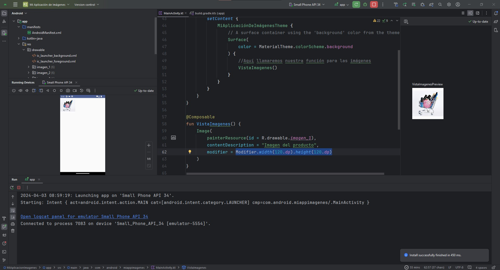

Aquí es más notorio el cambio pues estamos ajustando a un tamaño específico.

> Ejercicio: Intenta cambiar imagen_1 por las otras imágenes y experimenta un poco con las diferencias de las dimensiones hasta que te sientas cómodo para continuar.

### Paso 5 Imágenes desde Internet

Con base a lo anterior ya hemos cargado una imagen local, pero un caso de uso muy común es querer cargar imágenes desde internet, esto con el objetivo de ampliar nuestro catálogo o ver imágenes desde una base de datos. Los principios básicos de las imágenes siguen aplicando para esto, sin embargo el compose que usaremos será un poco diferente. Comenta el Image que estamos utilizando y debajo de él coloca lo siguiente.

```
@Composable
fun VistaImagenes() {
   /*Image(
       painterResource(id = R.drawable.imagen_1),
       contentDescription = "Imagen del producto",
       modifier = Modifier.width(120.dp).height(120.dp)
   )*/
   val imageList = listOf(
       "https://images.pexels.com/photos/2536965/pexels-photo-2536965.jpeg",
       "https://images.pexels.com/photos/90946/pexels-photo-90946.jpeg",
      "https://images.pexels.com/photos/4158/apple-iphone-smartphone-desk.jpg",
       "https://images.pexels.com/photos/2638026/pexels-photo-2638026.jpeg"
   )
   AsyncImage(
       model = ImageRequest.Builder(LocalContext.current)
           .data(imageList[0])
           .build(),
       contentDescription = "Imagen del producto",
       modifier = Modifier.width(120.dp).height(120.dp)
   )
}
```

En primer lugar vamos a agregar una lista con las urls que habíamos utilizado para descargar las imágenes locales.
En segundo lugar vamos a utilizar el compose AsyncImage el cual permite como su nombre lo dice cargar imágenes de manera asíncrona, esto viene en el concepto de que las imágenes de Internet pueden llegar a tardar en cargar a diferencia de una imagen local pues requieren hacer la conexión por internet y después descargar la imagen como tal, lo cual puede tomar desde uno a varios segundos dependiendo de la conexión a internet, la fuente de donde se descarga la información y otros factores.

Dentro de las propiedades que tenemos para este compose usaremos:
- model - El Cual utiliza la clase ImageRequest que ya está preparada para hacer llamadas a Internet y utiliza el contexto actual del compose, la url de la imagen la cual pasamos desde nuestra lista de urls y por último construimos el request con el método build interno de la clase.
- contentDescription - Este se mantiene como apoyo para el sistema de apoyo a discapacidad visual que mencionamos antes.
- modifier - Nuestro modifier para ajustar el tamaño de la imagen, lo dejamos igual al último caso anterior.

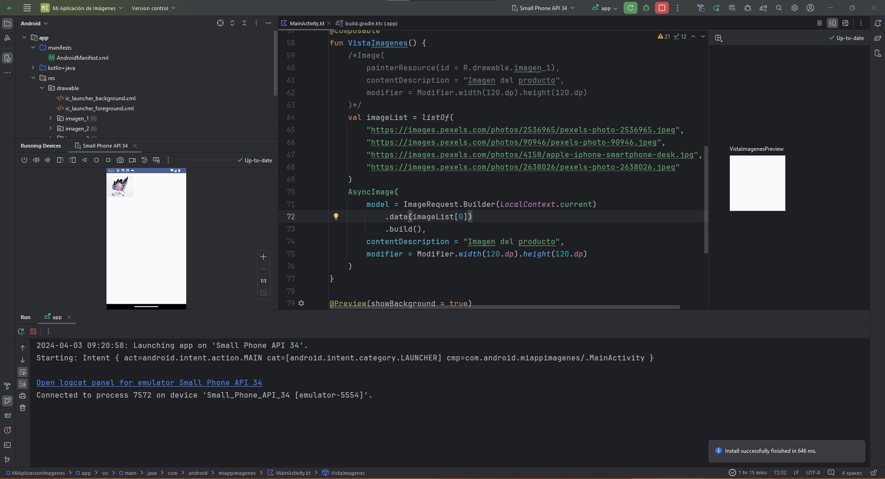

El resultado se ve igual pero ahora estamos cargando la imagen desde internet.

> Nota: si la pantalla te aparece en blanco verifica que en el manifest hayas agregado el permiso de Internet correctamente, revisa los pasos de configuración del proyecto por si tienes duda.

Como conclusión, hemos podido ver la importancia de las imágenes y cómo poder trabajar con ellas mediantes diferentes formatos además de como Android nos permite utilizar optimización de recursos para ser más efectivos en lo que hacemos y evitar problemas con la gran gama de marcas y dispositivos que existen en el mercado. No olvides utilizar estas mejoras para que tu aplicación tenga un mejor funcionamiento al desplegarse con usuarios finales.

## Manipulación de imágenes - Escalamiento, rotación y recorte

Las transformaciones básicas son parte esencial de cualquier contenido multimedia o cualquier contenido gráfico. Dentro de las mismas están un área de la computación que abarca gran cantidad de conocimientos matemáticos, tanto para efectos 2D como 3D. Dentro de Android, este tipo de transformaciones permiten a los desarrolladores darle una mayor estética y ajustar las imágenes cuando el contenido no es suficiente o excede el tamaño esperado. En Android existen una gran cantidad de dispositivos de marcas diferentes y es responsabilidad del desarrollador realizar lo necesario para que sin importar las dimensiones del contenido multimedia o del dispositivo se vea bien y se cumpla la función de la aplicación. Para esto utilizaremos las 3 transformaciones de imágenes más importantes: el escalamiento, la rotación y el recorte. Veremos cada una de ellas en profundidad y verás que más allá de la teoría su aplicación es bastante sencilla pero con un gran poder.

### Paso 1 Escalamiento de imágenes

Ya que tenemos las diferentes fuentes de carga de imágenes disponibles vamos a encontrar algunos problemas al momento de trabajar con ellas que se pueden aplicar sin importar si son locales o desde internet. Con esto es que si definimos un tamaño fijo  la imagen se puede o no ajustar a la necesidad que tenemos, no es lo mismo una imagen de perfil, que un banner que se repite y no afecta su tamaño de acuerdo a la dimensión.

Android nos provee de herramientas para trabajar fácilmente con estos elementos, una de ellas es el poder escalar las imágenes a tamaños más adecuados. De manera simple es extender o acortar la imagen para que se adapte al tamaño específico que necesitamos.

Para comenzar vamos a cambiar el tamaño fijo de nuestra AsyncImage y vamos a dejarlo del tamaño de la pantalla.

Nota: Es probable que el Preview no te muestre nada, si tienes este detalle puedes correr la aplicación para ver los cambios.

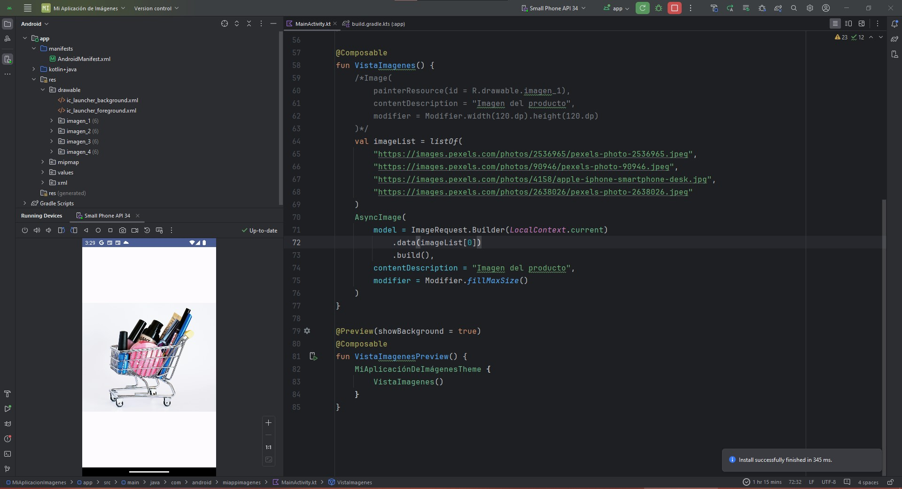

```
AsyncImage(
   model = ImageRequest.Builder(LocalContext.current)
       .data(imageList[0])
       .build(),
   contentDescription = "Imagen del producto",
   modifier = Modifier.fillMaxSize()
)
```
Dentro del AsyncImage vamos a agregar una nueva propiedad que se llama contentScale la cual puede recibir varios valores diferentes que veremos a continuación, el primero de ellos es ContentScale.Fit, para este valor es importante mencionar que en caso de no asignar un valor como fue antes de llegar a este punto, es el valor default que toman todas las imágenes, por lo que por ahora no verás ningún cambio al correr la aplicación, pero nos dará un preámbulo para ver los demás valores. El código queda como el siguiente.

```
AsyncImage(
   model = ImageRequest.Builder(LocalContext.current)
       .data(imageList[0])
       .build(),
   contentDescription = "Imagen del producto",
   contentScale = ContentScale.Fit,
   modifier = Modifier.fillMaxSize().background(Color.Yellow)
)
```

Observa que también añadimos un background amarilla para notar la diferencia del espacio vacío que queda entre la imagen y el fondo conforme lo ajustemos.

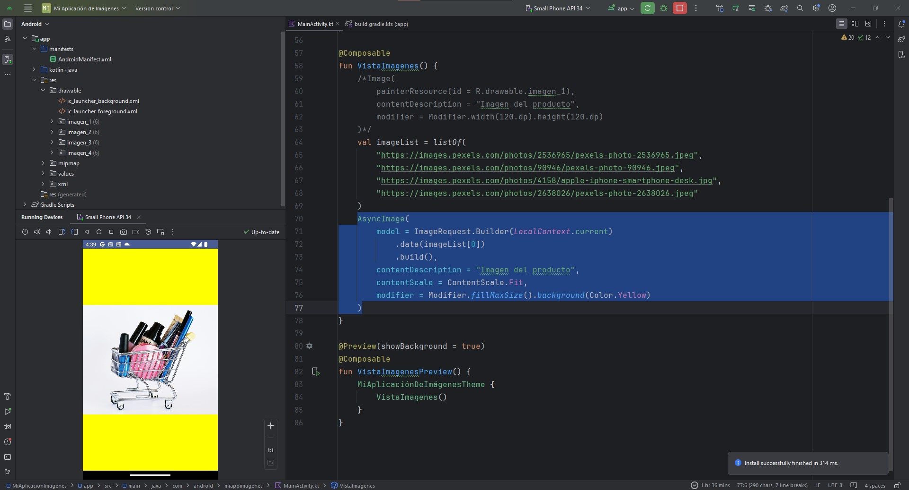

Sobre el ContentScale.Fit podemos entender lo siguiente,  este valor escala la imagen uniformemente, manteniendo el radio de aspecto (default). Si el contenido es más pequeño que el tamaño, la imagen se ajusta hasta que alguno de sus lados (ancho o alto) se ajuste al contenedor.

El siguiente valor que vamos a utilizar es ContentScale.Crop, este valor corta y centra la imagen para que se adapte a todo el espacio disponible del contenedor.

```
AsyncImage(
   model = ImageRequest.Builder(LocalContext.current)
       .data(imageList[0])
       .build(),
   contentDescription = "Imagen del producto",
   contentScale = ContentScale.Crop,
   modifier = Modifier.fillMaxSize().background(Color.Yellow)
)
```

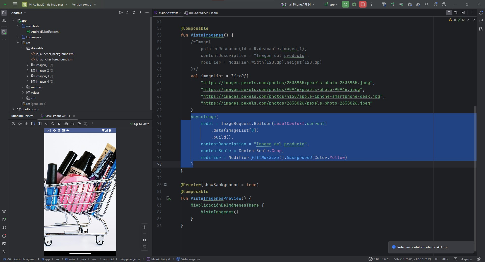

El siguiente valor es ContentScale.FillHeight que como su nombre nos indica se encarga de escalar la imagen manteniendo el radio de aspecto para que los límites hagan match con la altura del contenedor.

```
AsyncImage(
   model = ImageRequest.Builder(LocalContext.current)
       .data(imageList[0])
       .build(),
   contentDescription = "Imagen del producto",
   contentScale = ContentScale.FillHeight,
   modifier = Modifier.fillMaxSize().background(Color.Yellow)
)
```

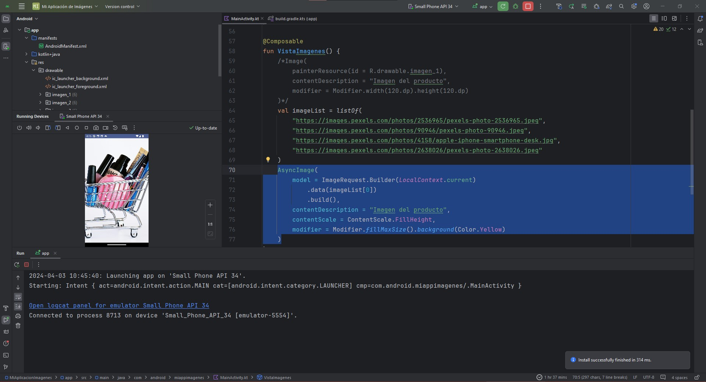

Nota que para este caso en particular la imagen termina siendo igual que en el Crop, esto ya que la imagen es más horizontal que vertical, esto puede suceder en las imágenes utilizadas normalmente y depende de cada caso en particular.

Ahora veremos el valor ContentScale.FillWidth que al igual que el anterior se encarga de escalar la imagen manteniendo el radio de aspecto para que los límites hagan match pero a diferencia del anterior se hace con el ancho del contenedor.

```
AsyncImage(
   model = ImageRequest.Builder(LocalContext.current)
       .data(imageList[0])
       .build(),
   contentDescription = "Imagen del producto",
   contentScale = ContentScale.FillWidth,
   modifier = Modifier.fillMaxSize().background(Color.Yellow)
)
```

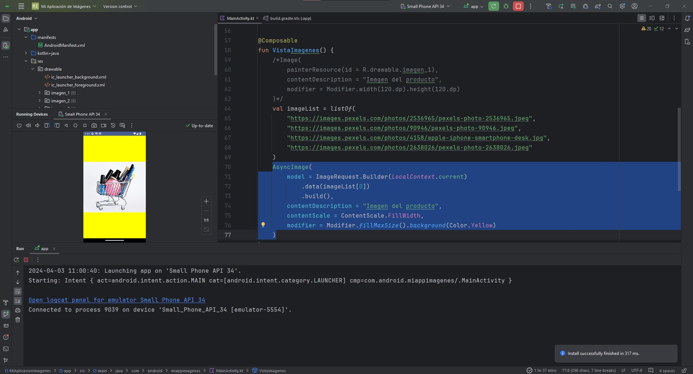

El resultado final aquí se parece al del valor Fit, ya que se ajuste al límite del ancho directamente.

Ahora usaremos el valor ContentScale.FillBounds, este valor escala el contenido de manera vertical y horizontal de manera no uniforme para llenar el contenedor, este es el más riesgoso pues puede deformar la imagen, lo ideal para usar este valor es colocar contenedores que sean exactos en el radio de aspecto de la imagen.

```
AsyncImage(
   model = ImageRequest.Builder(LocalContext.current)
       .data(imageList[0])
       .build(),
   contentDescription = "Imagen del producto",
   contentScale = ContentScale.FillBounds,
   modifier = Modifier.fillMaxSize().background(Color.Yellow)
)
````

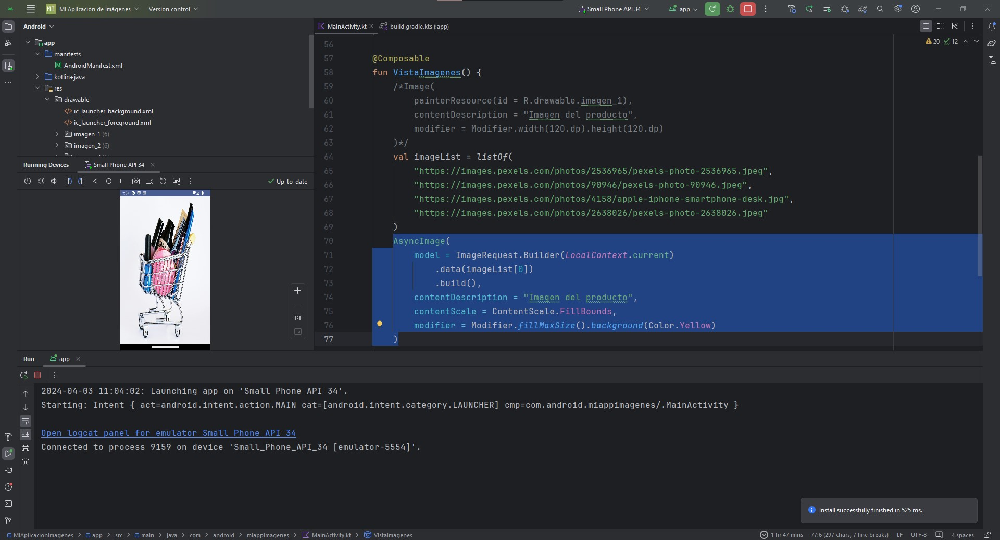

El siguiente valor es ContentScale.Inside, este valor escala la fuente de la imagen para mantener un radio de aspecto dentro del contenedor. Este sería el caso opuesto a FillBounds, donde se busca mantener una relación de aspecto uniforme para que la imagen se vea bien, como resultado puede darse que la imagen se vea muy pequeña según sea el caso.

```
AsyncImage(
   model = ImageRequest.Builder(LocalContext.current)
       .data(imageList[0])
       .build(),
   contentDescription = "Imagen del producto",
   contentScale = ContentScale.Inside,
   modifier = Modifier.fillMaxSize().background(Color.Yellow)
)
```

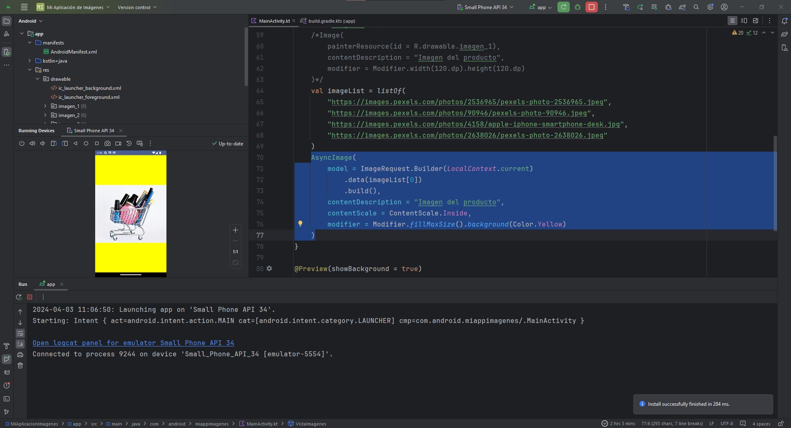

Por último tenemos el valor ContentScale.None, este valor no aplica ningún tipo de escalamiento a la imagen. Si el contenido es menor al contenedor, no se utilizará ningún ajuste para que se ajuste al área.

```
AsyncImage(
   model = ImageRequest.Builder(LocalContext.current)
       .data(imageList[0])
       .build(),
   contentDescription = "Imagen del producto",
   contentScale = ContentScale.None,
   modifier = Modifier.fillMaxSize().background(Color.Yellow)
)
```

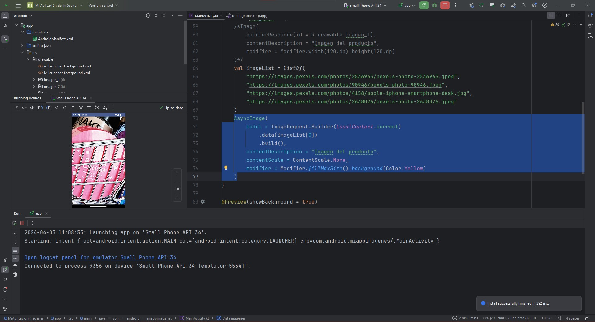

Con todo lo anterior hemos visto los diferentes valores de escalamiento que tenemos para utilizar con nuestras imágenes, a manera de ejercicio experimenta con diferentes valores para las diferentes imágenes y prueba hacer la distinción entre el Image para las imágenes locales y el ImageSync para las imágenes de Internet.

Para efectos de poder utilizar el Preview nuevamente, vamos a comentar las url y el AsyncImage y vamos a regresar al Image, dando un valor de FillBounds, y usando la primera imagen.

```
@Composable
fun VistaImagenes() {
   Image(
       painterResource(id = R.drawable.imagen_1),
       contentDescription = "Imagen del producto",
       contentScale = ContentScale.FillBounds,
       modifier = Modifier.fillMaxSize()
   )
   /*val imageList = listOf(
       "https://images.pexels.com/photos/2536965/pexels-photo-2536965.jpeg",
       "https://images.pexels.com/photos/90946/pexels-photo-90946.jpeg",
       "https://images.pexels.com/photos/4158/apple-iphone-smartphone-desk.jpg",
       "https://images.pexels.com/photos/2638026/pexels-photo-2638026.jpeg"
   )
   AsyncImage(
       model = ImageRequest.Builder(LocalContext.current)
           .data(imageList[0])
           .build(),
       contentDescription = "Imagen del producto",
       contentScale = ContentScale.FillBounds,
       modifier = Modifier.fillMaxSize().background(Color.Yellow)
   )*/
}
```

Por último podemos añadir un valor de escalamiento directo, utilizando el modifier de la imagen esta propiedad se llama scale() y recibe como parámetros un valor flotando que funciona como multiplicador para factor de escalamiento. Aquí podemos hacerlo de 2 formas, pasar 1 valor a scale() que sería para toda la imagen, o 2 valores que implicaría el valor de X y el valor de Y.

Vamos a pasar el siguiente valor

```
Image(
   painterResource(id = R.drawable.imagen_1),
   contentDescription = "Imagen del producto",
   contentScale = ContentScale.FillBounds,
   modifier = Modifier.fillMaxSize().scale(1.2f)
)
```

Observa cómo al final parece que se le hace un pequeño zoom a la imagen, juega con los valores para que entiendas mejor su funcionamiento.

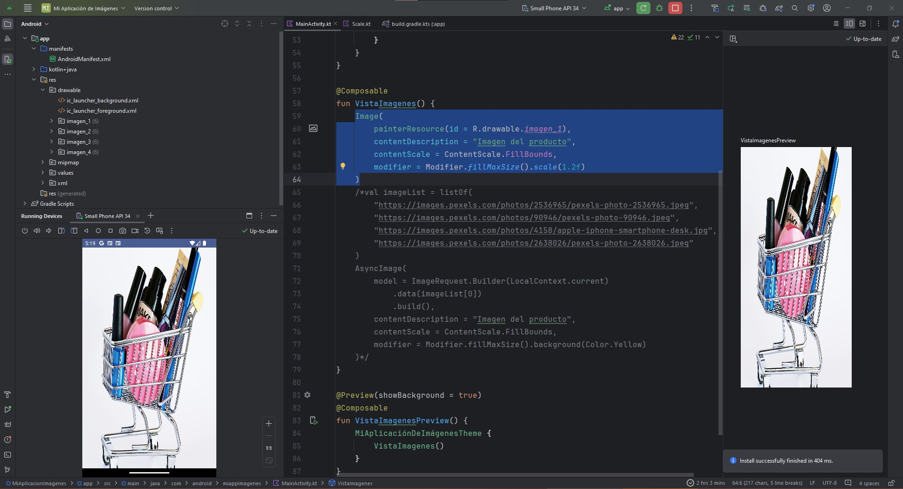


### Paso 2 Rotación de imágenes

Para el caso de la rotación de imágenes es un proceso muy simple, y esto implica añadir una propiedad adicional, pero no a nuestro Image o AsyncImage, sino al modifier que contiene cada una, dentro de este usaremos la propiedad rotate(), que al igual que con la propiedad scale() se recibe como parámetro un flotante que representa el número de grados los cuales queremos que tenga de rotación la imagen.

```
Image(
   painterResource(id = R.drawable.imagen_1),
   contentDescription = "Imagen del producto",
   contentScale = ContentScale.FillBounds,
   modifier = Modifier
       .fillMaxSize()
       .scale(1.2f)
       .rotate(180f)
)
```

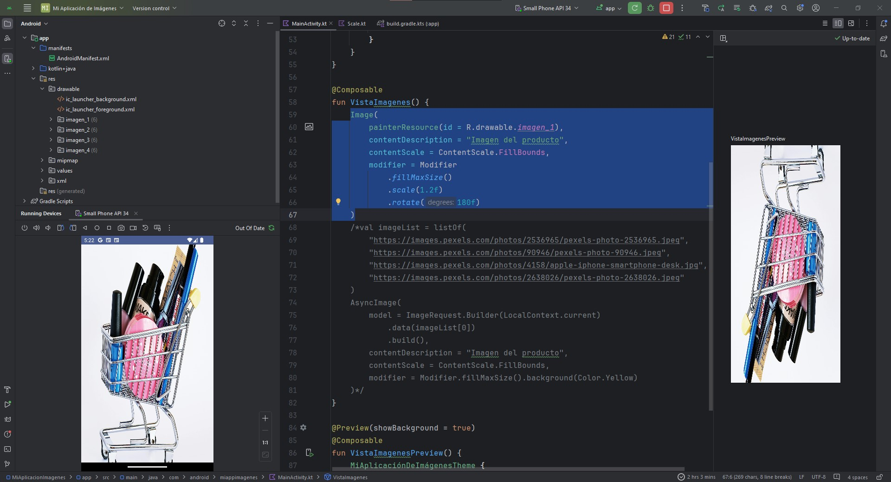

Es así entonces que tenemos valores de rotación entre 0-360.

### Paso 3 Recorte de imágenes

Para este último paso vamos a utilizar la propiedad del modificador llamada clip(), a diferencia de rotate y scale, esta propiedad usa clases ya definidas en Android para hacer el ajuste necesario, es importante mencionar que en versiones previas a Android esto no existía y era complicado poder hacer recortes a las imágenes pues si bien son casos de uso común se requería crear clases propias para lograrlo. Con la llegada de compose esto se ha agilizado enormemente. Ahora bien nuestro código utilizará la clase CircleShape, la cual le dará a la imagen un corte redondo como se ve a continuación.

```
Image(
   painterResource(id = R.drawable.imagen_1),
   contentDescription = "Imagen del producto",
   contentScale = ContentScale.FillBounds,
   modifier = Modifier
       .fillMaxSize()
       .scale(1.2f)
       .rotate(360f)
       .clip(CircleShape)
)
```

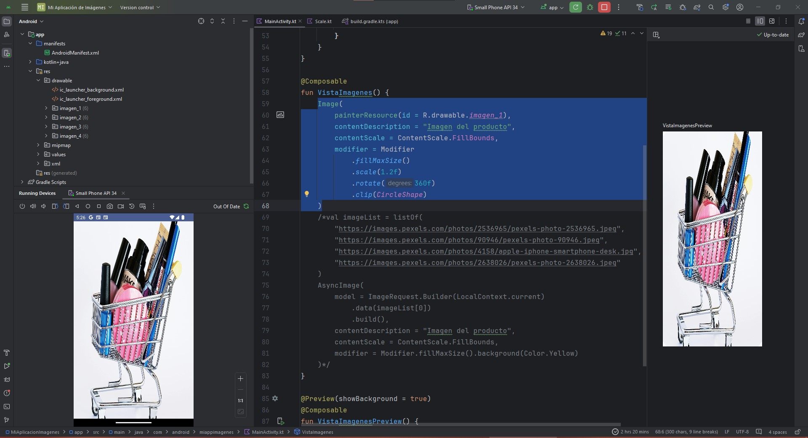

Como no es muy notorio el cambio vamos a modificar el tamaño a uno fijo de 240x240, intenta hacerlo antes de ver la solución por ti mismo.

```
Image(
   painterResource(id = R.drawable.imagen_1),
   contentDescription = "Imagen del producto",
   contentScale = ContentScale.FillBounds,
   modifier = Modifier
       .width(240.dp)
       .height(240.dp)
       .background(Color.Yellow)
       //.scale(1.2f)
       //.rotate(360f)
       .clip(CircleShape)
)
```

El resultado final deberá verse como el siguiente:

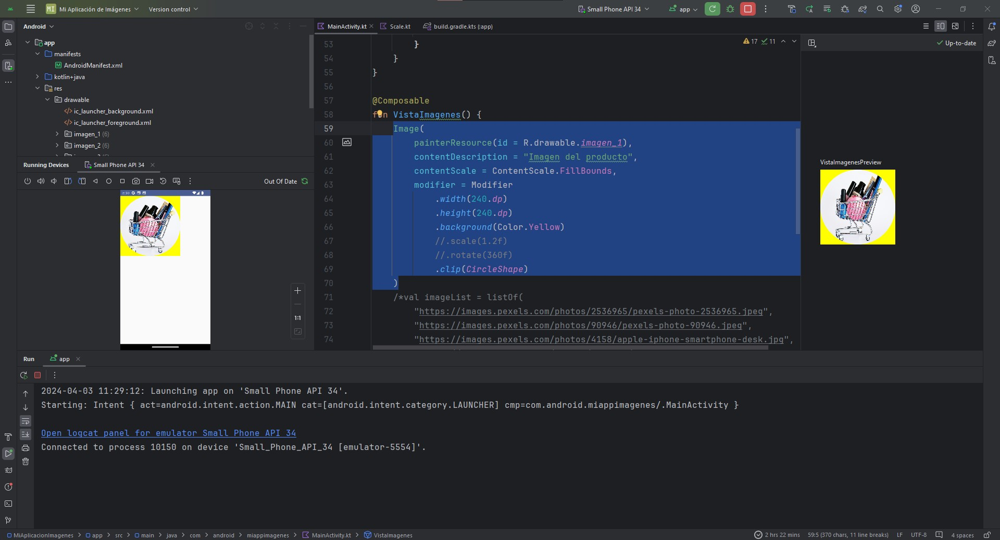

Existen otra clase que podemos utilizar en la propiedad clip, la primera es muy directa y se llama RoundedCornerShape, esta clase crea un cuadrado con bordes al cual deberemos pasar el valor de bordeado que queremos visualizar, por ejemplo:

```
Image(
   painterResource(id = R.drawable.imagen_1),
   contentDescription = "Imagen del producto",
   contentScale = ContentScale.FillBounds,
   modifier = Modifier
       .width(240.dp)
       .height(240.dp)
       .background(Color.Yellow)
       //.scale(1.2f)
       //.rotate(360f)
       .clip(RoundedCornerShape(16.dp))
)
```

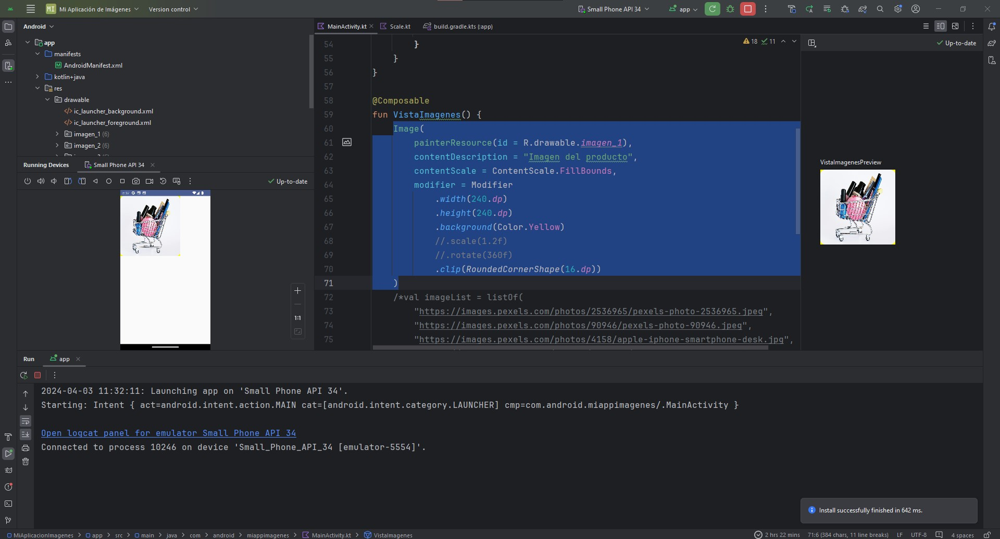

Experimenta un poco y familiarízate con los conceptos vistos hasta el momento.

A manera de conclusión identifica que una vez que utilizamos imágenes podemos aplicar transformaciones básicas y mejorar la estética o aplicar efectos simples para hacer más disruptiva nuestra aplicación, estos efectos pueden combinarse con otras librerías o como respuestas a eventos activados por el usuario en aplicaciones donde la vista lo es todo es fundamental aplicarlos para lograr sobresalir a otras aplicaciones que ya existen en el mercado.

## Implementación de Efectos Visuales Básicos

Con lo que hemos visto hasta ahora tenemos imágenes dentro de nuestra aplicación, ahora empezaremos a ver la importancia de los efectos visuales. A manera general hoy en día, los efectos son algo que vemos mucho dentro de las aplicaciones de redes sociales en donde los usuarios suben su imagen y son capaces de añadir múltiples efectos a sus fotografías para dar una mejor visualización a las mismas. Hoy en día, existen muchas aplicaciones especializadas en este tema, y hay algunas que se aplican de manera muy técnica. El objetivo de lo que estaremos viendo es la aplicación de los efectos más comunes que existen en Android, incluso tomando en cuenta que en versiones anteriores algunos de los efectos que veremos debían ser implementados manualmente por el desarrollador. Esto nos permite ver la evolución de Android como plataforma y la relevancia que este tipo de efectos ha tomado en los últimos años.

### Paso 1 Agregar un borde a la imagen

Una operación común que se utiliza para las imágenes de perfil es agregar un borde a las imágenes, para esto se combina la propiedad border del modifier, en conjunto con la propiedad que ya vimos de clip, para crear un borde circular necesitamos realizar lo siguiente.

```
Image(
   painterResource(id = R.drawable.imagen_1),
   contentDescription = "Imagen del producto",
   contentScale = ContentScale.Crop,
   modifier = Modifier
       .width(240.dp)
       .height(240.dp)
       //.background(Color.Yellow)
       //.scale(1.2f)
       //.rotate(360f)
       .clip(CircleShape)
       .border(
           BorderStroke(14.dp, Color.Yellow),
           CircleShape
       )
)
```

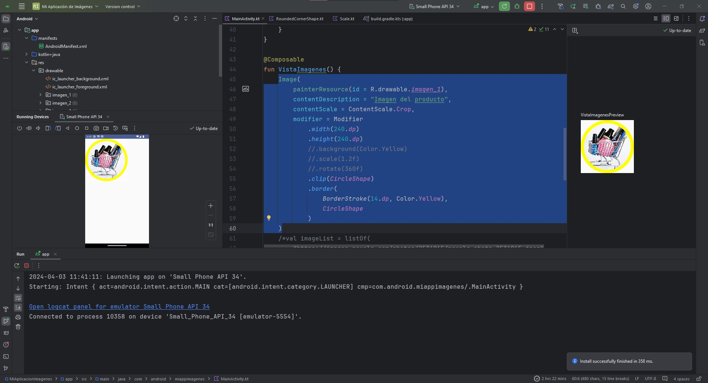

Este círculo se ve bien, pero que tal si agregamos un borde con gradiente para darle más vida, para ello podemos usar la clase Brush, la cual nos permite definir un gradiente de colores, esto implica agregar un poco más de código en la función VistaImagenes de la siguiente manera.

```
val rainbowColorsBrush = remember {
   Brush.sweepGradient(
       listOf(
           Color(0xFF9575CD),
           Color(0xFFBA68C8),
           Color(0xFFE57373),
           Color(0xFFFFB74D),
           Color(0xFFFFF176),
           Color(0xFFAED581),
           Color(0xFF4DD0E1),
           Color(0xFF9575CD)
       )
   )
}
Image(
   painterResource(id = R.drawable.imagen_1),
   contentDescription = "Imagen del producto",
   contentScale = ContentScale.Crop,
   modifier = Modifier
       .width(240.dp)
       .height(240.dp)
       //.background(Color.Yellow)
       //.scale(1.2f)
       //.rotate(360f)
       .clip(CircleShape)
       .border(
           BorderStroke(14.dp, rainbowColorsBrush),
           CircleShape
       )
)
```

El resultado será el siguiente:

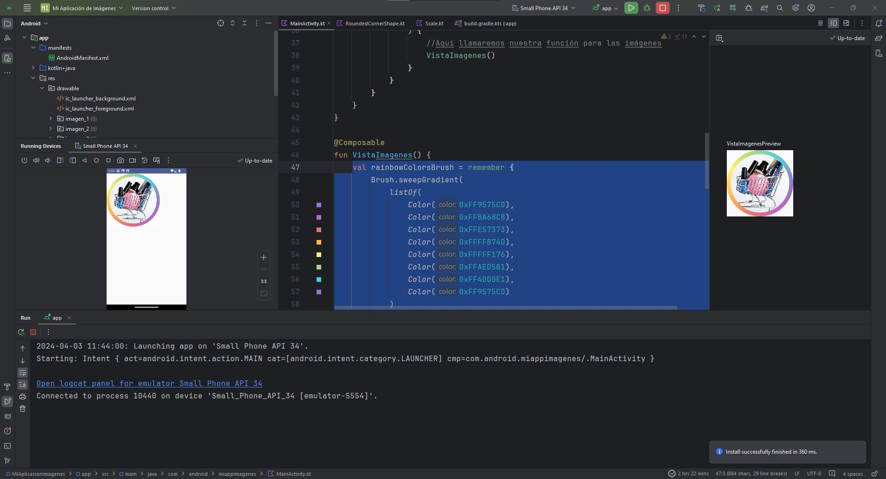

### Paso 2 Dar un radio de aspecto fijo

Este paso es muy simple pues otra vez usaremos una propiedad del modifier llamada aspectRatio, aquí podemos utilizar un valor de radio de aspecto que le queramos dar a nuestra imagen, como ejemplo observa que vamos a enviar un valor 16f/9f, esto para obtener un valor de escalamiento diferente, aquí dependerá de tu imagen actual y el aspecto que quieras darle pues cada valor puede ser muy diferente. Según la documentación el valor recibido es el ancho/alto deseado de radio positivo.

```
Image(
   painterResource(id = R.drawable.imagen_1),
   contentDescription = "Imagen del producto",
   contentScale = ContentScale.Crop,
   modifier = Modifier
       .width(240.dp)
       .height(240.dp)
       //.background(Color.Yellow)
       //.scale(1.2f)
       //.rotate(360f)
       .clip(CircleShape)
       .aspectRatio(16f / 9f)
       .border(
           BorderStroke(14.dp, rainbowColorsBrush),
           CircleShape
       )
)
```

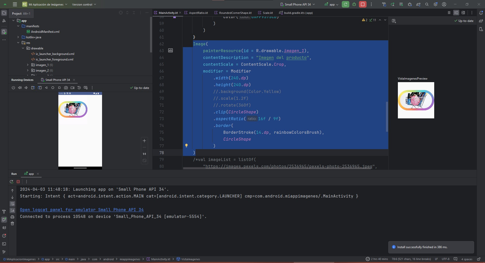

### Paso 3 Filtros de Color

Para este último paso vamos a comentar algunos valores para dejar más visible la imagen como en un inicio.

```
Image(
   painterResource(id = R.drawable.imagen_1),
   contentDescription = "Imagen del producto",
   contentScale = ContentScale.Crop,
   modifier = Modifier
       .width(240.dp)
       .height(240.dp)
       //.background(Color.Yellow)
       //.scale(1.2f)
       //.rotate(360f)
       //.clip(CircleShape)
       //.aspectRatio(16f / 9f)
       /*.border(
           BorderStroke(14.dp, rainbowColorsBrush),
           CircleShape
       )*/
)
```

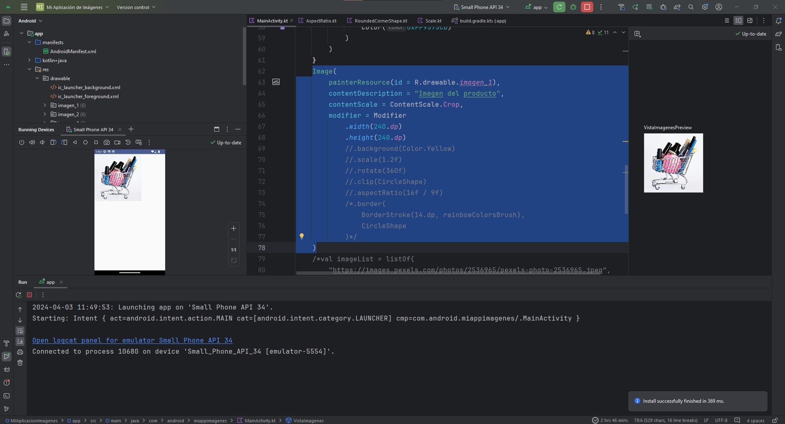

Para cambiar el color de la imagen podemos usar la propiedad colorFilter esta a diferencia de lo anterior no pertenece a modifier, sino que es exclusivo del Image y AsyncImage, esto cambiará la salida individual de píxeles de la imagen.

#### Teñir Imagen

Para teñir una imagen con un color en particular solo hace falta pasar el color a ColorFilter, dependiendo si hablamos de un icono o de una imagen, el proceso varía, pues en un icono con pasar el color es más que suficiente pero en una imagen se aplican las sombras por lo que ColorFilter también recibe un parámetro adicional que es el BlendMode y este ajusta el color de las sombras para darle mejor nitidez a la imagen. Por tanto el resultado sería algo como lo siguiente.

```
Image(
   painterResource(id = R.drawable.imagen_1),
   contentDescription = "Imagen del producto",
   contentScale = ContentScale.Crop,
   colorFilter = ColorFilter.tint(Color.Green, blendMode = BlendMode.Darken),
   modifier = Modifier
       .width(240.dp)
       .height(240.dp)


       //.background(Color.Yellow)
       //.scale(1.2f)
       //.rotate(360f)
       //.clip(CircleShape)
       //.aspectRatio(16f / 9f)
       /*.border(
           BorderStroke(14.dp, rainbowColorsBrush),
           CircleShape
       )*/
)
```

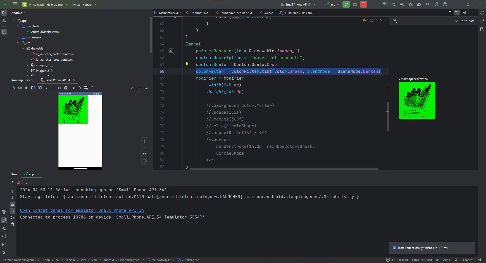

#### Matriz de Color

Otra forma de añadir filtros a la imagen es con una matriz de color, esto por ejemplo aplica para que puedas filtrar imagenes con un tono blanco y negro. Para ello necesitamos realizar lo siguiente.

```
Image(
   painterResource(id = R.drawable.imagen_1),
   contentDescription = "Imagen del producto",
   contentScale = ContentScale.Crop,
   colorFilter = ColorFilter.colorMatrix(ColorMatrix().apply { setToSaturation(0f) }),
   modifier = Modifier
       .width(240.dp)
       .height(240.dp)


       //.background(Color.Yellow)
       //.scale(1.2f)
       //.rotate(360f)
       //.clip(CircleShape)
       //.aspectRatio(16f / 9f)
       /*.border(
           BorderStroke(14.dp, rainbowColorsBrush),
           CircleShape
       )*/
)
```


#### Ajustar el contraste del brillo

Para ajustar el contraste y el brillo de una imagen, se puede usar una matriz de colores para ello. Para ello necesitamos agregar las siguientes variables sobre nuestra imagen.

```
val contrast = 2f // 0f..10f (1 should be default)
val brightness = -180f // -255f..255f (0 should be default)
val colorMatrix = floatArrayOf(
   contrast, 0f, 0f, 0f, brightness,
   0f, contrast, 0f, 0f, brightness,
   0f, 0f, contrast, 0f, brightness,
   0f, 0f, 0f, 1f, 0f
)
```

Después solamente seguimos aplicando el ColorFilter de la siguiente manera

```
val contrast = 2f // 0f..10f (1 should be default)
val brightness = -180f // -255f..255f (0 should be default)
val colorMatrix = floatArrayOf(
   contrast, 0f, 0f, 0f, brightness,
   0f, contrast, 0f, 0f, brightness,
   0f, 0f, contrast, 0f, brightness,
   0f, 0f, 0f, 1f, 0f
)
Image(
   painterResource(id = R.drawable.imagen_1),
   contentDescription = "Imagen del producto",
   contentScale = ContentScale.Crop,
   colorFilter = ColorFilter.colorMatrix(ColorMatrix(colorMatrix)),
   modifier = Modifier
       .width(240.dp)
       .height(240.dp)


       //.background(Color.Yellow)
       //.scale(1.2f)
       //.rotate(360f)
       //.clip(CircleShape)
       //.aspectRatio(16f / 9f)
       /*.border(
           BorderStroke(14.dp, rainbowColorsBrush),
           CircleShape
       )*/
)
```

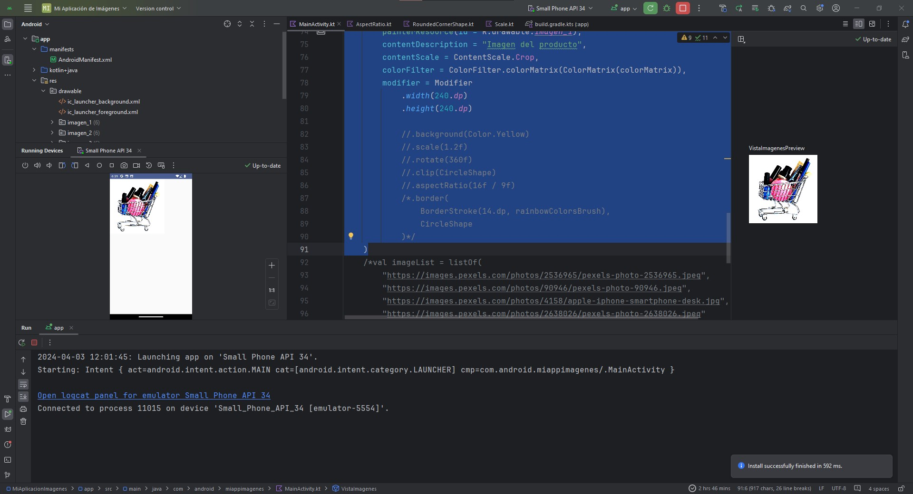

#### Invertir los colores de una imagen

Ahora para invertir los colores de la imagen podemos crear otra variable de matriz de colores con los siguiente valores.

```
val invertedMatrix = floatArrayOf(
   -1f, 0f, 0f, 0f, 255f,
   0f, -1f, 0f, 0f, 255f,
   0f, 0f, -1f, 0f, 255f,
   0f, 0f, 0f, 1f, 0f
)
```

Nota que los colores están a tope en 255f
```
Image(
   painterResource(id = R.drawable.imagen_1),
   contentDescription = "Imagen del producto",
   contentScale = ContentScale.Crop,
   colorFilter = ColorFilter.colorMatrix(ColorMatrix(invertedMatrix)),
   modifier = Modifier
       .width(240.dp)
       .height(240.dp)


       //.background(Color.Yellow)
       //.scale(1.2f)
       //.rotate(360f)
       //.clip(CircleShape)
       //.aspectRatio(16f / 9f)
       /*.border(
           BorderStroke(14.dp, rainbowColorsBrush),
           CircleShape
       )*/
)
```
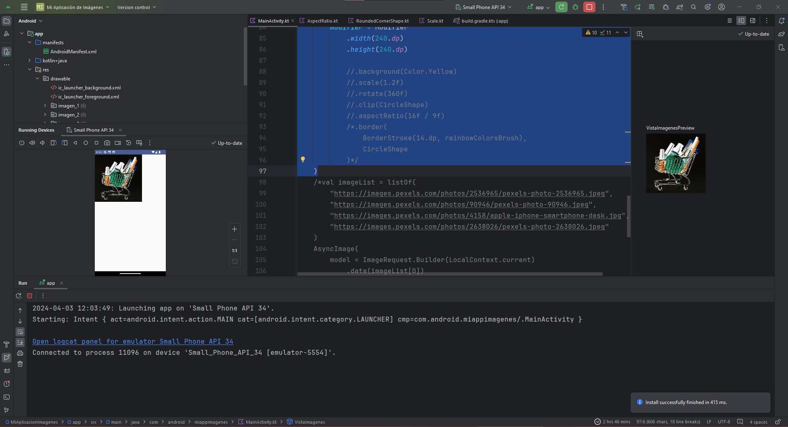

#### Filtro de distorsión a la imagen

Para este filtro vamos a comentar el ColorFilter que usamos en los pasos anteriores. Para este nuevo efecto ahora sí vamos nuevamente a nuestro modifier a aplicar el método blur(), esta propiedad recibe 3 valores
1. radiusX - El valor en x del radio de distorsión que queremos aplicar
2. radiusY - El valor en y del radio de distorsión que queremos aplicar
3. edgeTreatment - Este valor no es obligatorio pero se recomienda a las imágenes con distorsión para aplicar un borde redondeado a la imagen, esto debido a que el cálculo de la distorsión puede generar algunas variaciones en las esquinas de la imagen.

Por tanto para nuestra imagen quedaría el siguiente código

```
Image(
   painterResource(id = R.drawable.imagen_1),
   contentDescription = "Imagen del producto",
   contentScale = ContentScale.Crop,
   //colorFilter = ColorFilter.colorMatrix(ColorMatrix(invertedMatrix)),
   modifier = Modifier
       .width(240.dp)
       .height(240.dp)
       .blur(
           radiusX = 10.dp,
           radiusY = 10.dp,
           edgeTreatment = BlurredEdgeTreatment(RoundedCornerShape(8.dp))
       )
       //.background(Color.Yellow)
       //.scale(1.2f)
       //.rotate(360f)
       //.clip(CircleShape)
       //.aspectRatio(16f / 9f)
       /*.border(
           BorderStroke(14.dp, rainbowColorsBrush),
           CircleShape
       )*/
)
```

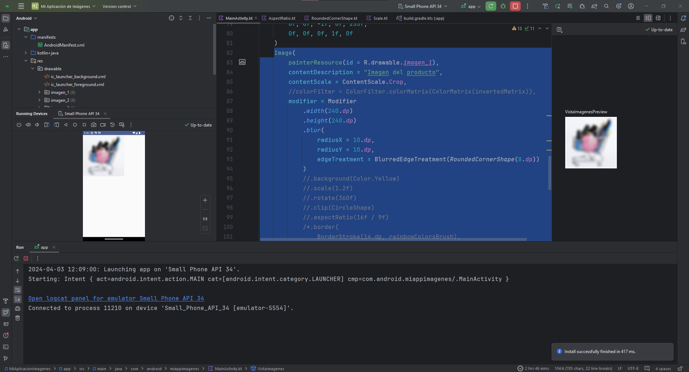

Nota: El efecto de distorsión solo funciona en versiones de Android 12 para arriba, si intentas utilizarlo en versiones anteriores simplemente se ignora.
¡Éxito! Has logrado trabajar con las diferentes variedades de imágenes y puedes ajustarlas como todo un profesional para darle movimientos y efectos a tus nuevas aplicaciones.

## Conclusión
En este tutorial, has aprendido a crear una aplicación de Android con Jetpack Compose que muestra imágenes de productos. La aplicación utiliza la biblioteca Coil para la carga eficiente de imágenes.

Has aprendido a:
- Crear una interfaz de usuario con Jetpack Compose.
- Integrar Coil para la carga de imágenes optimizada.
- Probar y ejecutar la aplicación.
- Este tutorial te ha proporcionado una base sólida para crear aplicaciones Android con interfaces de usuario modernas y eficientes.
- Agregar filtros y efectos a las imágenes.

Puedes ampliar la funcionalidad de la aplicación de varias maneras:
- Agregar una lista de productos
- Implementar un sistema de búsqueda para filtrar las imágenes.

