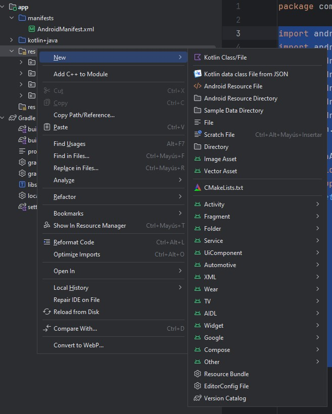
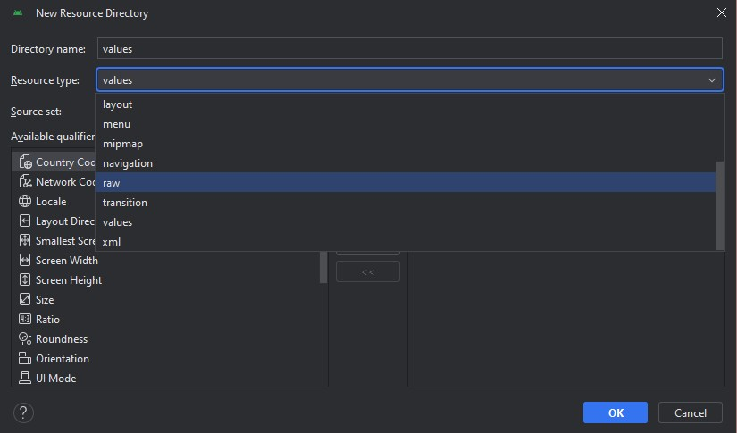
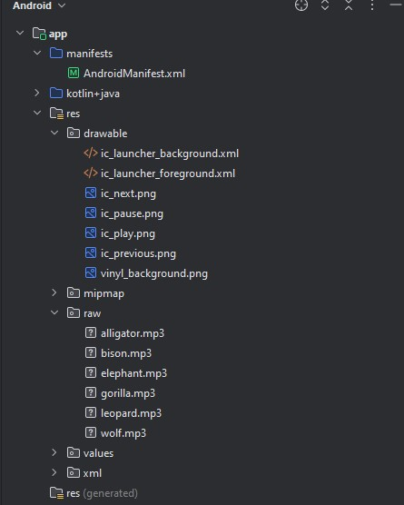
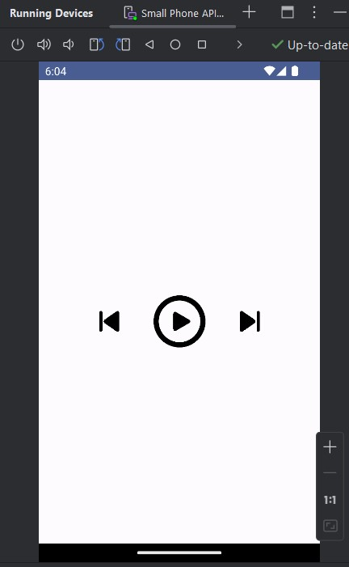
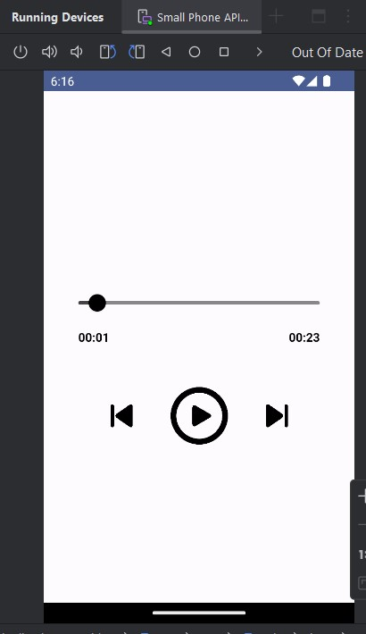
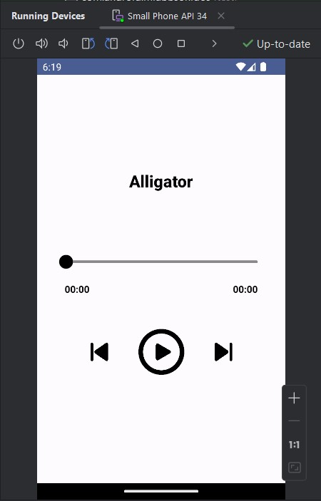
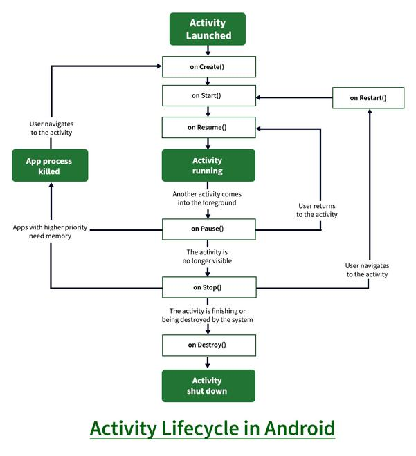
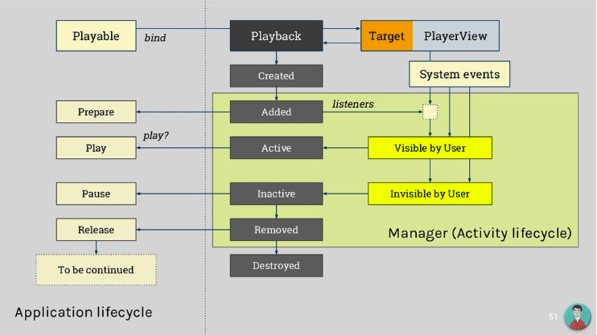
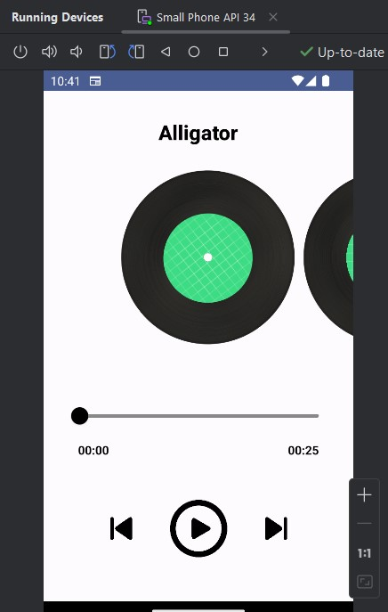

# Reproducción de Audio

## Carga y reproducción de archivos de audio

En el mundo de las aplicaciones móviles, la reproducción de audio juega un papel fundamental para crear experiencias más atractivas e interactivas. Desde la reproducción de música de fondo hasta la implementación de efectos de sonido, los sonidos enriquecen la interacción del usuario con la aplicación, haciéndola más dinámica y agradable.

Así mismo se busca la aplicación de imágenes interactivas para dar efecto a un reproductor de audio, esto en combinación con lo visto en la lección anterior de manejo de imágenes y como su aplicación en la reproducción de audio puede dar efectos de animación bastante interesantes sin mucho esfuerzo. Dentro de los reproductores de audio observamos el uso de elementos interactivos como los controles de sonido o las imágenes para demostrar el estatus de una canción o identificar qué es lo que estamos escuchando en pantalla.

En este primer tema, nos embarcamos en el fascinante camino de la carga y reproducción de archivos de audio en Android. Aprenderemos los conceptos básicos y las herramientas necesarias para integrar audio en nuestras aplicaciones, sentando las bases para crear experiencias sonoras cautivadoras.

Para este laboratorio tendrás a tu disposición un conjunto de audios con los que podrás experimentar y hacer pruebas a lo que estaremos trabajando. Si necesitas más sonidos para experimentar puedes utilizarlos de la siguiente liga https://freeanimalsounds.org/jungle-animals/

### Paso 1 Creación de un proyecto Android Studio

Para este laboratorio estaremos utilizando la versión de Android Studio, Iguana (2023.2.1), versiones anteriores o posteriores pueden ser soportadas, sin embargo pueden tener adecuaciones en el archivo Gradle por el nuevo formato de uso con Kotlin, y los números de las versiones de las librerías los cuales veremos en detalle.

El laboratorio hace uso de Jetpack Compose para el desarrollo de la interfaz, pero se puede obtener el mismo resultado utilizando MDC ó manejo de XML en formato tradicional para desarrollo de interfaces.

Una vez abriendo Android Studio vamos a crear un **Nuevo Proyecto** y seleccionamos un proyecto con un **Empty Activity** que utiliza como base **Jetpack Compose** y damos click en **Next**.


Dentro de la ventana de configuración del proyecto vamos a cambiar lo siguiente:
- Nombre: Mi Aplicación de Sonidos
- Package: com.android.miappsonidos
- Locations: Utiliza una carpeta de destino donde vaya a alojarse tu proyecto
- Minimum SDK: API 27 (“Oreo”; Android 8.1)
- Build configuration Language Kotlin DSL (build.gradle.kts)

> Nota: Para este laboratorio puedes hacer uso de un dispositivo físico o del emulador para ejecutar tu aplicación, recuerda que si vas a realizar un proyecto para usuarios finales se recomienda que siempre hagas pruebas en un dispositivo físico para probar el resultado de la manera más real posible.

### Paso 2 Configuración básica del proyecto

Ya que tenemos la versión base del proyecto vamos a correrla en un dispositivo y asegurarnos que la configuración inicial no está corrupta. Conectamos o cargamos el emulador correspondiente y damos click en el botón para correr la aplicación.


Si la configuración es adecuada veremos algo como lo siguiente:


Recordemos que un proyecto vacío para Jetpack Compose contiene una función default de Saludo o la función Greeting.

Si nuestro proyecto se ejecutó correctamente entonces vamos a eliminar esta función default que se llama en la línea 25 del archivo MainActivity.kt, también vamos a eliminar las funciones de Compose Greeting() y GreetingPreview(). Dejando un código como el siguiente:

```kotlin
import android.os.Bundle
import androidx.activity.ComponentActivity
import androidx.activity.compose.setContent
import androidx.compose.foundation.layout.fillMaxSize
import androidx.compose.material3.MaterialTheme
import androidx.compose.material3.Surface
import androidx.compose.ui.Modifier
import com.android.miappsonidos.ui.theme.MiAplicaciónDeSonidosTheme


class MainActivity : ComponentActivity() {
   override fun onCreate(savedInstanceState: Bundle?) {
       super.onCreate(savedInstanceState)
       setContent {
           MiAplicaciónDeSonidosTheme {
               // A surface container using the 'background' color from the theme
               Surface(
                   modifier = Modifier.fillMaxSize(),
                   color = MaterialTheme.colorScheme.background
               ) {
                   //Aquí llamaremos nuestra función para los sonidos
               }
           }
       }
   }
}
```

Ahora vamos a abrir el archivo AndroidManifest.xml y agregaremos el permiso de Internet, recuerda que esto es importante cuando queremos realizar cualquier conexión a Internet de lo contrario aunque nuestro código sea correcto no veremos un resultado adecuado.

La línea a agregar es la siguiente:

```xml
<uses-permission android:name="android.permission.INTERNET" />
```

### Paso 3 Añadir las dependencias necesarias

Con lo anterior dejamos el terreno preparado para poder empezar a construir nuestra aplicación, pero ahora nos hacen falta los materiales de construcción en forma de librerías para nuestro proyecto. Vamos a abrir el archivo build.gradle.kts (:app) y en la sección de dependencias o dependencies agregaremos lo siguiente:

```gradle
implementation("androidx.compose.ui:ui-androidx:1.6.3")
implementation("androidx.compose.ui:ui-tooling:1.6.3")
implementation("androidx.compose.runtime:runtime:1.6.3")
implementation("androidx.compose.compiler:compiler:1.5.10")
implementation("androidx.media3:media3-exoplayer-hls:1.3.0")
```

Dependiendo de la versión de android puede solicitarte adecuación con el nuevo formato de librerías en cuyo caso puedes ajustar sustituyendo lo anterior por lo siguiente:

```gradle
implementation(libs.ui.tooling)
implementation(libs.androidx.runtime)
implementation(libs.androidx.compiler)
implementation(libs.androidx.media3.exoplayer.hls)
```

El detalle con esta sustitución es que deberás agregar las librerías en el nuevo archivo libs.versions.toml (Version Catalog), donde ahora se colocan las versiones de las librerías en forma de variables. Mi archivo se ve de la siguiente manera:

```kotlin
[versions]
agp = "8.3.2"
compiler = "1.5.11"
kotlin = "1.9.0"
coreKtx = "1.12.0"
junit = "4.13.2"
junitVersion = "1.1.5"
espressoCore = "3.5.1"
lifecycleRuntimeKtx = "2.7.0"
activityCompose = "1.8.2"
composeBom = "2023.08.00"
media3ExoplayerHls = "1.3.1"
runtime = "1.6.5"
uiAndroidx = "1.6.3"


[libraries]
androidx-compiler = { module = "androidx.compose.compiler:compiler", version.ref = "compiler" }
androidx-core-ktx = { group = "androidx.core", name = "core-ktx", version.ref = "coreKtx" }
androidx-media3-exoplayer-hls = { module = "androidx.media3:media3-exoplayer-hls", version.ref = "media3ExoplayerHls" }
androidx-runtime = { module = "androidx.compose.runtime:runtime", version.ref = "runtime" }
androidx-ui-androidx = { module = "androidx.compose.ui:ui-androidx", version.ref = "uiAndroidx" }
junit = { group = "junit", name = "junit", version.ref = "junit" }
androidx-junit = { group = "androidx.test.ext", name = "junit", version.ref = "junitVersion" }
androidx-espresso-core = { group = "androidx.test.espresso", name = "espresso-core", version.ref = "espressoCore" }
androidx-lifecycle-runtime-ktx = { group = "androidx.lifecycle", name = "lifecycle-runtime-ktx", version.ref = "lifecycleRuntimeKtx" }
androidx-activity-compose = { group = "androidx.activity", name = "activity-compose", version.ref = "activityCompose" }
androidx-compose-bom = { group = "androidx.compose", name = "compose-bom", version.ref = "composeBom" }
androidx-ui = { group = "androidx.compose.ui", name = "ui" }
androidx-ui-graphics = { group = "androidx.compose.ui", name = "ui-graphics" }
androidx-ui-tooling = { group = "androidx.compose.ui", name = "ui-tooling" }
androidx-ui-tooling-preview = { group = "androidx.compose.ui", name = "ui-tooling-preview" }
androidx-ui-test-manifest = { group = "androidx.compose.ui", name = "ui-test-manifest" }
androidx-ui-test-junit4 = { group = "androidx.compose.ui", name = "ui-test-junit4" }
androidx-material3 = { group = "androidx.compose.material3", name = "material3" }
ui-tooling = { module = "androidx.compose.ui:ui-tooling", version.ref = "uiAndroidx" }


[plugins]
androidApplication = { id = "com.android.application", version.ref = "agp" }
jetbrainsKotlinAndroid = { id = "org.jetbrains.kotlin.android", version.ref = "kotlin" }

```

Ahora vamos a sincronizar el proyecto para descargar todas las librerías, no olvides que esto lo podemos realizar desde el icono del elefante.


Esta primera ejecución puede tomar un poco de tiempo en lo que se bajan todos los recursos. Una vez que lo tengamos listo vamos a regresar a nuestro archivo **MainActivity.kt.**

### Paso 4 Carga de un sonido simple

Antes de empezar con el código de nuestro proyecto, necesitamos agregar los audios a una carpeta que sea visible por nuestro proyecto.

Para ello utilizaremos nuestra siempre confiable carpeta de recursos **res**, desde la cual crearemos una carpeta especial en Android llamada **raw**. Esta carpeta en particular está diseñada para colocar archivos que normalmente no podemos categorizar en otro lado. Si recuerdas, para el caso de las imágenes necesitamos generar el específico, según el tipo de imagen y densidad de pantalla de dispositivo que vayamos a utilizar. Pero el caso de los audios y videos es un poco más abierto por lo que con una simple carpeta es suficiente.

Para crearla vamos a expandir la carpeta res y daremos clic derecho.



Y seleccionaremos el Android Resource Directory



Después seleccionaremos el tipo de recurso como raw, y listo habremos creado nuestra carpeta.

Ahora abriremos la carpeta desde nuestro manejador de archivos y agregaremos los sonidos de este laboratorio sin ningún orden en particular.

Recuerda que lo único importante es el nombre de los archivos ya que debería de utilizar el formato snake_case que no incluye mayúsculas y sustituye espacios por guiones bajos.

De la misma manera, añadimos las imágenes para este laboratorio, por ahora no necesitamos más que utilizar la carpeta drawable default.



Ahora empecemos con nuestro código, algo importante antes de comenzar es que todo deberá ir dentro de nuestra class MainActivity, esto por que a diferencia de otros laboratorios ahora si haremos referencia a algunas variables locales.

Sobre el método onCreate vamos a declarar una variable global player de la siguiente forma:

```kotlin
private lateinit var player: ExoPlayer
```

Debajo de esta vamos a declarar un tipo especial de clase llamada data class, este tipo de clase nos permite modelar información, que en nuestro caso serán pequeños objetos que extenderán información adicional del sonido que vamos a reproducir. En otros casos puede ser el contenido de una canción por ejemplo, con su imagen, su nombre y su autor.

```kotlin
data class Sound(
   val name: String,
   val sound: Int,
   val cover:Int
)
```

Para nuestro caso solo necesitaremos el nombre y el sonido, agregaremos un cover pero para este en particular utilizaremos la imagen default que viene de android.

Ahora bien, ya que tenemos nuestra data class Sound, ahora vamos a crear la lista de nuestros sonidos a manera de playlist

```kotlin
private fun getPlayList(): List<Sound> {
   return listOf(
       Sound(
           name = "Alligator",
           sound = R.raw.alligator,
           cover = R.drawable.ic_launcher_background
       ),
       Sound(
           name = "Bison",
           sound = R.raw.bison,
           cover = R.drawable.ic_launcher_background
       ),
       Sound(
           name = "Elephant",
           sound = R.raw.elephant,
           cover = R.drawable.ic_launcher_background
       ),
       Sound(
           name = "Gorilla",
           sound = R.raw.gorilla,
           cover = R.drawable.ic_launcher_background
       ),
       Sound(
           name = "Leopard",
           sound = R.raw.leopard,
           cover = R.drawable.ic_launcher_background
       ),
       Sound(
           name = "Wolf",
           sound = R.raw.wolf,
           cover = R.drawable.ic_launcher_background
       ),
   )
}
```

Aquí estamos declarando los objetos Sound y les añadimos el nombre del animal, el sonido con referencia a la carpeta Raw, y la imagen default de Android para el cover.

Después vamos a actualizar nuestro método onCreate con lo siguiente:

```kotlin
override fun onCreate(savedInstanceState: Bundle?) {
   super.onCreate(savedInstanceState)


   player = ExoPlayer.Builder(this).build()
   val playList = getPlayList()


   setContent {
       MiAplicaciónDeSonidosTheme {
           // A surface container using the 'background' color from the theme
           Surface(
               modifier = Modifier.fillMaxSize(),
               color = MaterialTheme.colorScheme.background
           ) {
               SoundScreen(playList)
           }
       }
   }
}
```

Acá estamos inicializando nuestra variable player y estamos cargando el método playlist que acabamos de crear.

```kotlin
player = ExoPlayer.Builder(this).build()
val playList = getPlayList()
```

También sustituimos nuestro comentario inicial para lo que será nuestra clase en Compose SoundScreen

```kotlin
SoundScreen(playList)
```

Esta clase recibirá el playlist y dentro de su estructura va a crear un reproductor de audio a partir de la lista proporcionada. 

Esta variable mantendrá nuestro reproductor con todas sus opciones disponibles.

Si declaramos nuestra función SoundScreen vamos a tener algo como lo siguiente:

```kotlin
@OptIn(ExperimentalFoundationApi::class, ExperimentalAnimationApi::class)
@Composable
fun SoundScreen(playList: List<Sound>) {
}
```
Dentro de la función iremos agregando varias cosas que son necesarias, primero que nada necesitamos un pager que utilizaremos más adelante para poder aplicar efectos simples a nuestro reproductor. Para ello añadiremos las siguientes variables:

```kotlin
val pagerState = rememberPagerState(pageCount = { playList.count() })
val playingSongIndex = remember {
   mutableIntStateOf(0)
}
```

Después necesitamos agregar los siguientes LaunchEffect methods, que nos permitirán cargar la base de nuestro reproductor, es decir, prepararlo para que reproduzca nuestra playlist de sonidos.

```kotlin
LaunchedEffect(pagerState.currentPage) {
   playingSongIndex.intValue = pagerState.currentPage
   player.seekTo(pagerState.currentPage, 0)
}


LaunchedEffect(player.currentMediaItemIndex) {
   playingSongIndex.intValue = player.currentMediaItemIndex
   pagerState.animateScrollToPage(
       playingSongIndex.intValue,
       animationSpec = tween(500)
   )
}
LaunchedEffect(Unit) {
   playList.forEach {
       val path = "android.resource://" + packageName + "/" + it.sound
       val mediaItem = MediaItem.fromUri(Uri.parse(path))
       player.addMediaItem(mediaItem)
   }
}
player.prepare()
```

Y ahora necesitamos guardar los diferentes estados que puede obtener el reproductor como si está en pausa, la posición actual del sonido su duración, etcétera. Esto nos ayudará con los controles extendidos.

```kotlin
val isPlaying = remember {
   mutableStateOf(false)
}


val currentPosition = remember {
   mutableLongStateOf(0)
}


val sliderPosition = remember {
   mutableLongStateOf(0)
}


val totalDuration = remember {
   mutableLongStateOf(0)
}
```

Por último añadiremos estos últimos LaunchedEffect methods para poder registrar la duración visible de los sonidos:

```kotlin
LaunchedEffect(key1 = player.currentPosition, key2 = player.isPlaying) {
   delay(1000)
   currentPosition.longValue = player.currentPosition
}


LaunchedEffect(currentPosition.longValue) {
   sliderPosition.longValue = currentPosition.longValue
}


LaunchedEffect(player.duration) {
   if (player.duration > 0) {
       totalDuration.longValue = player.duration
   }
}
```

Ahora lo que viene es empezar a armar la estructura de nuestro reproductor la cual deberá contener los controles para poder funcionar.

Antes de ejecutar nuestra aplicación vamos a trabajar un poco con los controles de avance, por facilidad al momento de reproducir nuestros sonidos.

A manera de conclusión lo que hemos hecho al momento nos ha permitido establecer la base de nuestro reproductor a través de una pequeña lista de sonidos la cual viene acompañada de meta datos adicionales que serán desplegados en el resultado final de nuestra práctica. A manera de resumen hemos trabajado los elementos multimedia que hemos tocado en los últimos laboratorios para recordar cómo manejar las partes más comunes de las imágenes y el reproductor ExoPlayer.

## Control de reproducción - pausa, reproducción, avance y retroceso

### Paso 1 Funciones para los controles

Al final del sub-tema anterior cargamos sonidos básicos dentro de nuestra aplicación, aunque todavía no podemos escucharlos pues necesitamos añadir el sistema de controles del reproductor, es en este momento que empezamos a conectar por que ambos elementos van de la mano. Los controles de audio y video, nos permiten dar una funcionalidad a un audio que escuchemos, por lo general damos por sentado que este tipo de controles vienen siempre, pero si bien crearlos es simple, si debemos considerar si los ponemos o no. En el caso de video por ejemplo esto puede no ser siempre el caso, dependiendo el tipo de video e interacción que tiene en la aplicación, pero para el caso de audio lo más común es agregar los controles para poder manipular de alguna manera lo que estamos escuchando.

Para poder trabajar con un tipo de botón genérico para toda nuestra aplicación vamos a definir la siguiente función de Compose, no olvides que debe estar dentro de la clase MainActivity.

```kotlin
@Composable
fun ControlButton(icon: Int, size: Dp, onClick: () -> Unit) {
   Box(
       modifier = Modifier
           .size(size)
           .clip(CircleShape)
           .clickable {
               onClick()
           }, contentAlignment = Alignment.Center
   ) {
       Icon(
           modifier = Modifier.size(size / 1.5f),
           painter = painterResource(id = icon),
           tint = Color.Black,
           contentDescription = null
       )
   }
}
```

Este tipo de botón de control es solo una imagen para visualizar el contenido y que estamos adaptando con diferentes parámetros y una imagen para visualizar el contenido del botón.

Regresemos a nuestra función SoundScreen y al final de donde nos quedamos vamos a añadir los controles visuales de interfaz de la función.

```kotlin
Box(
   modifier = Modifier
       .fillMaxSize(), contentAlignment = Alignment.Center
) {
    val configuration = LocalConfiguration.current


    Column(horizontalAlignment = Alignment.CenterHorizontally) {
        Spacer(modifier = Modifier.height(24.dp))
        Row(
        horizontalArrangement = Arrangement.SpaceEvenly,
        verticalAlignment = Alignment.CenterVertically
        ) {
        ControlButton(icon = R.drawable.ic_previous, size = 40.dp, onClick = {
            player.seekToPreviousMediaItem()
        })
        Spacer(modifier = Modifier.width(20.dp))
        ControlButton(
            icon = if (isPlaying.value) R.drawable.ic_pause else R.drawable.ic_play,
            size = 100.dp,
            onClick = {
                if (isPlaying.value) {
                    player.pause()
                } else {
                    player.play()
                }
                isPlaying.value = player.isPlaying
            })
        Spacer(modifier = Modifier.width(20.dp))
        ControlButton(icon = R.drawable.ic_next, size = 40.dp, onClick = {
            player.seekToNextMediaItem()
        })
    }
}
```

Para identificar lo que estamos haciendo, observa que definimos una Caja contenedora del reproductor y después de algunos Spacer estamos añadiendo la función ControlButton que definimos, aquí estamos añadiendo 3 ControlButton que harán referencia a el botón de regresar sonido, avanzar sonido y dar play o pausar un sonido.

Los 3 botones estarán equilibrados al centro de la pantalla de manera equidistante y según el estado y efecto de cada uno ejecutar alguno de los métodos de nuestra variable player.

Ahora sí vamos a intentar ejecutar la aplicación, el resultado debería verse como el siguiente.



De vista no parece gran cosa,  intenta dar clic en el botón de play y juega con los controles en pantalla. Podrás escuchar los sonidos en el orden que los colocamos en la playlist, y utilizando las flechas de avance o anterior podrás escuchar varias veces cada sonido hasta que quieras detenerlo.

Ahora vamos a crear un nuevo control para el reproductor desde Compose, una función que llamaremos TrackSlider, esto nos permitirá ver cómo se está reproduciendo el sonido y su duración total.

La función se vería de la siguiente manera:

```kotlin
@Composable
fun TrackSlider(
   value: Float,
   onValueChange: (newValue: Float) -> Unit,
   onValueChangeFinished: () -> Unit,
   songDuration: Float
) {
   Slider(
       value = value,
       onValueChange = {
           onValueChange(it)
       },
       onValueChangeFinished = {


           onValueChangeFinished()


       },
       valueRange = 0f..songDuration,
       colors = SliderDefaults.colors(
           thumbColor = Color.Black,
           activeTrackColor = Color.DarkGray,
           inactiveTrackColor = Color.Gray,
       )
   )
}
```

Aquí estamos definiendo un Slider genérico que se ajustará a los valores de duración del sonido para representar directamente sobre la interfaz.

Para agregarlo a nuestro reproductor, regresemos a nuestra función SoundScreen y ubicaremos el código donde agregamos los controles de avance y play/pause. Deberás ver arriba un Spacer, pues sobre él colocaremos lo siguiente:

```kotlin
Spacer(modifier = Modifier.height(54.dp))
Column(
   modifier = Modifier
       .fillMaxWidth()
       .padding(horizontal = 32.dp),
) {


   TrackSlider(
       value = sliderPosition.longValue.toFloat(),
       onValueChange = {
           sliderPosition.longValue = it.toLong()
       },
       onValueChangeFinished = {
           currentPosition.longValue = sliderPosition.longValue
           player.seekTo(sliderPosition.longValue)
       },
       songDuration = totalDuration.longValue.toFloat()
   )
   Row(
       modifier = Modifier.fillMaxWidth(),
   ) {


       Text(
           text = (currentPosition.longValue).convertToText(),
           modifier = Modifier
               .weight(1f)
               .padding(8.dp),
           color = Color.Black,
           style = TextStyle(fontWeight = FontWeight.Bold)
       )


       val remainTime = totalDuration.longValue - currentPosition.longValue
       Text(
           text = if (remainTime >= 0) remainTime.convertToText() else "",
           modifier = Modifier
               .padding(8.dp),
           color = Color.Black,
           style = TextStyle(fontWeight = FontWeight.Bold)
       )
   }
}
```

Por último necesitaremos añadir una función adicional que convierte el valor del tiempo en texto desplegable para nuestra interfaz.

```kotlin
private fun Long.convertToText(): String {
   val sec = this / 1000
   val minutes = sec / 60
   val seconds = sec % 60


   val minutesString = if (minutes < 10) {
       "0$minutes"
   } else {
       minutes.toString()
   }
   val secondsString = if (seconds < 10) {
       "0$seconds"
   } else {
       seconds.toString()
   }
   return "$minutesString:$secondsString"
}
```

Nuevamente vamos a ejecutar nuestra aplicación y veamos el resultado obtenido hasta ahora.



Si volvemos a jugar con el reproductor, veremos como el nuevo slider nos muestra el avance real del sonido, además de que tenemos visualizado del lado izquierdo el tiempo transcurrido contra el lado derecho que incluye el tiempo restante. Esto empieza a verse más y más como un reproductor de audio normal.

Podemos añadir algunos puntos adicionales para desplegar el nombre del audio. Nuevamente dentro de SoundScreen, justo después de iniciar el Box que conforma el reproductor, vamos a añadir lo siguiente:

```kotlin
AnimatedContent(targetState = playingSongIndex.intValue, transitionSpec = {
   (scaleIn() + fadeIn()) with (scaleOut() + fadeOut())
}, label = "") {
   Text(
       text = playList[it].name, fontSize = 24.sp,
       color = Color.Black,
       style = TextStyle(fontWeight = FontWeight.ExtraBold)
   )
}
Spacer(modifier = Modifier.height(8.dp))


Spacer(modifier = Modifier.height(16.dp))
```

El resultado añadirá un texto que incluye el título del sonido presentado, si fuera una canción desplegará el nombre de la misma.



En este sub-tema pudiste ver cómo a través de Compose se pueden crear los controles adicionales que dan vida al reproductor, el uso de ellos puede personalizarse a gusto del desarrollador ya sea adaptando los colores, las formas o los modelos que utilizan para generar la interfaz. En ese sentido Compose nos ayuda mucho a hacer la labor de una manera muy sencilla además de poderosa reutilizando componentes de software de interfaz que son útiles en cada peldaño de nuestro reproductor. Ahora veremos el siguiente tema que es sobre la reproducción en segundo plano.

## Uso de audio en segundo plano

Hablamos de reproducción en segundo plano a que un sonido se ejecute sin importar si la aplicación está abierta o no. Una ventaja que tenemos al utilizar el ExoPlayer es que por default habilita la reproducción en segundo plano. Por lo que para este sub-tema discutiremos más los conceptos que existen alrededor de este tipo de reproducción y algunos conflictos que pudieran enfrentarse en otras aplicaciones ya sea por temas de Sistema Operativo, por la Play Store o por limitaciones en los mismos dispositivos.

Antes de comenzar, ejecuta tu aplicación y mientras se reproducen los sonidos para tu aplicación a segundo plano y notarás cómo se mantiene el sonido ejecutándose, ya sea hasta que se termine, o hasta que nuevamente entres a la aplicación y la detengas de manera normal. Forzar el cerrado de la aplicación también se cerrará completamente el canal de audio, pero este no será un comportamiento esperado, es importante que entendamos cuáles son los flujos básicos que sigue nuestra aplicación para su funcionamiento.

Dentro de todo nuestra aplicación siempre debe seguir el ya conocido ciclo de vida de las aplicaciones que aplica para la aplicación, para la vistas y sus componentes.



Ahora bien, si este es el ciclo de vida de la aplicación, veamos como el ExoPlayer se acopla al mismo y donde queda la ejecución de sonido en segundo plano.



Como podemos ver en el diagrama, cuando hablamos de la reproducción en segundo plano, es cuando el estado cambia a ser Invisible para el Usuario, es en este momento que depende del estado de reproducción del reproductor, pues puede estar en ejecución, en pausa o detenido.

Lo que hace Android desde atrás es que al crear un sonido crea un proceso separado en el cual nuestra aplicación y ExoPlayer tienen el control mientras existen, al momento de que algo malo sucede como el cierre inesperado, se elimina nuestro reproductor que es quien lleva el control de proceso adicional que se crea. Esto facilita a Android a no dejar procesos colgando y hacer que exista al menos 1 por reproductor.

Si bien es posible poder ejecutar varios sonidos a la vez, esto no es la mejor práctica recomendada por que no solo agrega estrés dentro del sistema operativo, sino también dentro de las bocinas del dispositivo, además de que puede confundir al usuario sobre lo que está sucediendo.

Las mejores aplicaciones dan noción de este punto y tratan de detener otros audios para dar prioridad a su contenido, si bien esta debería de ser la mejor práctica, no siempre sucede. Es responsabilidad del programador manejar este tipo de casos sobre todo si la aplicación utiliza sonidos importantes.

Llamamos un sonido como importante cuando el tipo de contenido que representa tiene un nivel de importancia alto para el usuario. Por ejemplo no es lo mismo un sonido reproducido por efecto de un reproductor de música como el que estamos haciendo, contra un sonido de una alerta de emergencia por temas de una aplicación de sismos. Idealmente las aplicaciones con menos prioridad no deben meterse estos niveles de detalle y dejar que Android automáticamente decida manejar ya sea no reproducir el sonido o detenerlo para darle entrada a los más importantes.

En el caso de que la aplicación tenga un nivel de importancia mayor, es importante declarar en la aplicación dichos niveles para que sean reconocidos por el sistema operativo como de importancia alta, así el Sistema Operativo sabrá que es necesario mantenerlos corriendo independientemente de las condiciones.

Ahora bien, aunque podemos definir el nivel de importancia, existen niveles que nuestra aplicación no puede soportar por que estos están limitados a servicios de emergencia como el sonido del teléfono. Aunque bien existe la documentación al respecto, si intentas modificar alguno de estos parámetros al momento de subir tu aplicación a la tienda, Google los rechazará o simplemente el dispositivo ignorará dichos cambios y te dejará los default. Este punto depende mucho de ANDROID en ese momento, pero lo que sí sucederá es que no serás capaz de que tu aplicación tome control total del teléfono, y esto se entiende por cuestiones de seguridad para los usuarios y control del programador mismo.

Si quieres ahondar más en la documentación oficial y sobre este tema de la reproducción en segundo plano con casos más específicos, puedes revisar el siguiente [link.](https://developer.android.com/media/implement/playback-app)

En resumen, nuestra aplicación sin hacer ninguna modificación nos permite ejecutar el sonido en segundo plano, y podemos configurar parámetros adicionales si dicha aplicación tuviera un valor de relevancia mayor para el sistema operativo, pero la recomendación general es mantener los parámetros como hasta el momento.

## Implementación de efectos de imagen

Nuestro reproductor hasta el momento es funcional, y podríamos dejarlo así por el bien del tema de reproducción de sonido, pero podemos aplicar unos toques finales que harán darle una vida adicional al proyecto y nos permitirán construir reproductores con una mejor personalidad.

Para alcanzar este nuevo objetivo, que tal que agreguemos una caratula de un disco de vinil y al momento que el sonido se ejecute, este gire para demostrarnos que se está ejecutando. Además que tal que agregamos un cambio de sonido con hacer un movimiento del dedo añadiendo controles adicionales a los que ya tenemos pero para hacerlo más interactivo.

Para comenzar hagamos lo siguiente:

Vamos a crear la función VinylAlbumCover, que será una función de Compose que contenga un círculo para desplegar nuestro vinil.

```kotlin
@Composable
fun VinylAlbumCover(
   modifier: Modifier = Modifier,
   rotationDegrees: Float = 0f,
   painter: Painter
) {
   val roundedShape = object : Shape {
       override fun createOutline(
           size: Size,
           layoutDirection: LayoutDirection,
           density: Density
       ): Outline {
           val p1 = Path().apply {
               addOval(Rect(4f, 3f, size.width - 1, size.height - 1))
           }
           val thickness = size.height / 2.10f
           val p2 = Path().apply {
               addOval(
                   Rect(
                       thickness,
                       thickness,
                       size.width - thickness,
                       size.height - thickness
                   )
               )
           }
           val p3 = Path()
           p3.op(p1, p2, PathOperation.Difference)


           return Outline.Generic(p3)
       }
   }


   Box(
       modifier = modifier
           .aspectRatio(1.0f)
           .clip(roundedShape)
   ) {
       Image(
           modifier = Modifier
               .fillMaxSize()
               .rotate(rotationDegrees),
           painter = painterResource(id = R.drawable.vinyl_background),
           contentDescription = "Vinyl Background"
       )


       Image(
           modifier = Modifier
               .fillMaxSize(0.5f)
               .rotate(rotationDegrees)
               .aspectRatio(1.0f)
               .align(Alignment.Center)
               .clip(roundedShape),
           painter = painter,
           contentDescription = "Song cover"
       )
   }
}
```

Esta función se apoya en el uso de una caja y separa la Imagen del vinilo de la imagen que se decida poner particular al sonido. Ahora vamos a crear una nueva función llamada VinylAlbumCoverAnimation, la cual nos ayudará a ejecutar la animación de giro a cada uno de los covers de nuestros sonidos.

```kotlin
@Composable
fun VinylAlbumCoverAnimation(
   modifier: Modifier = Modifier,
   isSongPlaying: Boolean = true,
   painter: Painter
) {
   var currentRotation by remember {
       mutableFloatStateOf(0f)
   }


   val rotation = remember {
       Animatable(currentRotation)
   }


   LaunchedEffect(isSongPlaying) {
       if (isSongPlaying) {
           rotation.animateTo(
               targetValue = currentRotation + 360f,
               animationSpec = infiniteRepeatable(
                   animation = tween(3000, easing = LinearEasing),
                   repeatMode = RepeatMode.Restart
               )
           ) {
               currentRotation = value
           }
       } else {
           if (currentRotation > 0f) {
               rotation.animateTo(
                   targetValue = currentRotation + 50,
                   animationSpec = tween(
                       1250,
                       easing = LinearOutSlowInEasing
                   )
               ) {
                   currentRotation = value
               }
           }
       }
   }


   VinylAlbumCover(
       painter = painter,
       rotationDegrees = rotation.value
   )
}
```

Aquí haremos uso efectivo de la función previa VinylAlbumCover para ver los elementos completos que se necesiten y combinar entre el componente de la imagen, la imagen default del vinil y la animación de giro que vamos a utilizar.

Ahora vamos a nuestra función de ScreenScene y debajo de donde declaramos el nombre de los sonidos tenemos 2 Spacer, aquí colocaremos el último segmento de código de nuestra aplicación.

```kotlin
HorizontalPager(
   modifier = Modifier.fillMaxWidth(),
   state = pagerState,
   pageSize = PageSize.Fixed((configuration.screenWidthDp / (1.7)).dp),
   contentPadding = PaddingValues(horizontal = 85.dp)
) { page ->


   val painter = painterResource(id = playList[page].cover)


   if (page == pagerState.currentPage) {
       VinylAlbumCoverAnimation(isSongPlaying = isPlaying.value, painter = painter)
   } else {
       VinylAlbumCoverAnimation(isSongPlaying = false, painter = painter)
   }
}
```

Esta última parte añade nuestro slider horizontal con los componentes de la función VinylAlbumCoverAnimation, con esto añadiremos un elemento por cada sonido del playlist con su propia animación. Si corremos nuestra aplicación deberíamos ver algo como lo siguiente:



Aquí en el resultado podemos ver como el vinil se agrega sobre el slider de reproducción, y podemos utilizar efectos para manipularlo. Al arrastrar el dedo podremos cambiar de sonido. Mientras se ejecuta corre la animación de mover en círculo la caratula de vinil en conjunto con la imagen que es el botón o espacio verde que vemos en pantalla. Si detenemos el sonido la animación se detiene añadiendo un efecto bastante espectacular a nuestra aplicación.

Como resultado tenemos un reproductor completo de sonidos que además de personalizable, puede extenderse con canciones u otro tipo de archivos de sonido y darnos una aplicación única, en conjunto con los controles y seguimiento de la reproducción podemos dar al usuario retroalimentación confiable de lo que sucede con el sonido sin afectar cómo se usa la experiencia o afectando la escucha del audio. No lo olvides, son los detalles los que cuentan al momento de hacer los efectos en las aplicaciones, ponte creativo y añade algún elemento adicional que sea tu cereza del pastel a este increíble reproductor.

Como conclusión a este tutorial práctico, hemos trabajado la reproducción de audio a través de un pequeño reproductor el cual hemos personalizado con los controles de reproducción, estatus de la pista de reproducción y animación de los elementos de visualización para dar un mejor efecto a la reproducción.

## Implementación de efectos de audio básico

Un tema más avanzado pero importante que debemos tocar fuera de nuestra implementación práctica es el de los efectos de audio que podemos añadir a nuestro reproductor. De momento iniciaremos revisando los conceptos teóricos detrás de estos elementos de audio y en próximas lecciones haremos la implementación práctica al respecto, para que no comas ansias.

Dentro del mundo de reproducción de multimedia podemos aplicar lo que se conoce como efectos de al sonido de nuestra reproducción, así como dentro de las imágenes podemos aplicar efectos al color, a la textura o a la transformación de las misma como por ejemplo el efecto de rotación  que aplicamos en la práctica de esta lección.

En el mundo del desarrollo de aplicaciones Android, la reproducción de sonido no se limita a simplemente tocar un archivo de audio. Los efectos de audio nos permiten agregar una capa de dinamismo e interactividad a nuestras aplicaciones, creando experiencias más envolventes y atractivas para los usuarios.

### ¿Qué son los Efectos de Audio?

Los efectos de audio son modificaciones que se realizan a una señal de audio original para crear un nuevo sonido. Estos efectos pueden ser sutiles o dramáticos, y pueden agregar una gran variedad de dimensiones a la experiencia auditiva.

### Analogía con el Ecualizador

Para comprender mejor los efectos de audio, pensemos en un ecualizador. Un ecualizador nos permite ajustar las frecuencias de una señal de audio, realzando o atenuando ciertos rangos de frecuencias. De esta manera, podemos modificar el tono general del sonido, haciéndolo más brillante, más grave o más equilibrado.

### Tipos de Efectos de Audio

Existen una gran variedad de efectos de audio, cada uno con sus propias características y aplicaciones. Algunos de los tipos más comunes incluyen:
- Efectos de Ecualización: Como se mencionó anteriormente, estos efectos permiten ajustar las frecuencias de una señal de audio.
- Efectos de Reverberación: Simula el efecto de la reflexión del sonido en un espacio físico, como una habitación o una cueva.
- Efectos de Delay: Repiten la señal de audio con un retraso determinado, creando un efecto de eco o de "fantasma".
- Efectos de Distorsión: Alteran la forma de onda de la señal de audio, creando efectos como overdrive, fuzz y wah-wah.
- Efectos de Modulación: Modifican las propiedades de la señal de audio, como la frecuencia o la amplitud, creando efectos como vibrato y chorus.

### Implementación de Efectos de Audio en Android

La implementación de efectos de audio en aplicaciones Android puede llevarse a cabo utilizando diversas bibliotecas y técnicas. Algunas de las opciones más populares incluyen:
- Android Effects: Un conjunto de efectos de audio nativos de Android.
- Audio Effects SDK: Un SDK de terceros que ofrece una amplia gama de efectos de audio y herramientas de procesamiento.
- Bibliotecas de sonido de código abierto: Existen varias bibliotecas de sonido de código abierto que pueden utilizarse para implementar efectos de audio en Android como ExoPlayer u OpenSL que utiliza el NDK de Android.

### Consideraciones al Implementar Efectos de Audio

Al implementar efectos de audio en nuestras aplicaciones, es importante tener en cuenta algunos aspectos:
Rendimiento: Los efectos de audio pueden afectar significativamente el rendimiento de la aplicación, especialmente cuando se utilizan múltiples efectos o con configuraciones complejas.
Compatibilidad: Es importante asegurarnos de que los efectos de audio que utilizamos sean compatibles con las diferentes versiones de Android y dispositivos.
Experiencia del usuario: Debemos utilizar los efectos de audio de manera adecuada para mejorar la experiencia del usuario, no para distraerlo o molestarlo.

Lo que hace un poco difícil la implementación de dichos efectos en Android sobre todo es la compatibilidad en tiempo real, y el tiempo para lograrlo, si bien no hay una fórmula escrita existen una gran variedad de librerías como las que ya mencionamos anteriormente que nos pueden ayudar. Incluso en ocasiones nos recomiendan tener los valores de audio pre grabados o con las configuración de efectos pre guardadas para hacer más fácil la dinámica de cambio entre una y otra. En ocasiones es posible y en otras no, sobre todo si hablamos del tema de reproducción en tiempo real y aquí deseamos aplicar el efecto de cambio, en el audio, pues no siempre las librerías de reproducción de audio nos permitirán aplicar dichos efectos.

En el ámbito del desarrollo de aplicaciones Android, los efectos de sonido básicos juegan un papel fundamental para crear experiencias más atractivas e interactivas. Al dominar su implementación, podemos agregar una capa de dinamismo y realismo a nuestras aplicaciones, cautivando a los usuarios y diferenciando nuestras creaciones.

Si bien este laboratorio no profundizó en la implementación práctica de efectos de sonido, sí proporcionó una base conceptual sólida sobre su naturaleza, tipos y aplicaciones.

## Conclusión

Es importante recordar que los efectos de sonido no deben utilizarse de manera indiscriminada. Su uso excesivo o inadecuado puede distraer al usuario o incluso generar una experiencia negativa. La clave reside en emplearlos de forma estratégica, complementando el diseño de la aplicación y potenciando la interacción con el usuario.

Has aprendido a:
- Reproducir un archivo de audio local
- Controlar la reproducción (iniciar, detener, pausar, reanudar, retroceder y avanzar)
- Obtener información del archivo de audio (duración, posición actual)
- Implementar una barra de progreso para visualizar el avance de la reproducción.
- Correr en segundo plano el audio.

Puedes ampliar la funcionalidad de la aplicación:
Cargando imágenes de animales a través de Internet para darle más estilo al vinilo
Agregar una barra animada que simule la aguja de la máquina de vinilos para darle más estilo al reproductor.
