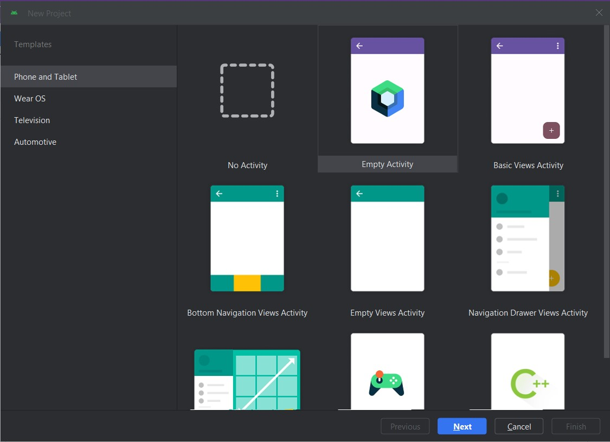
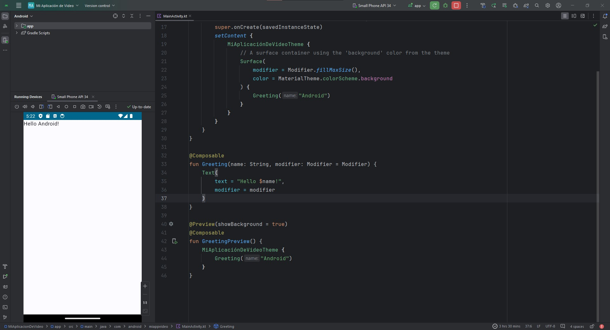
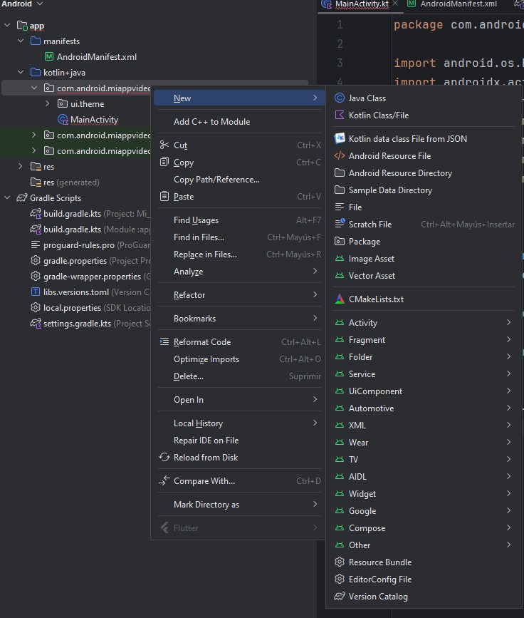
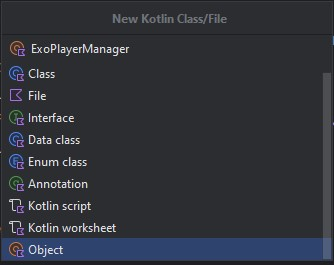
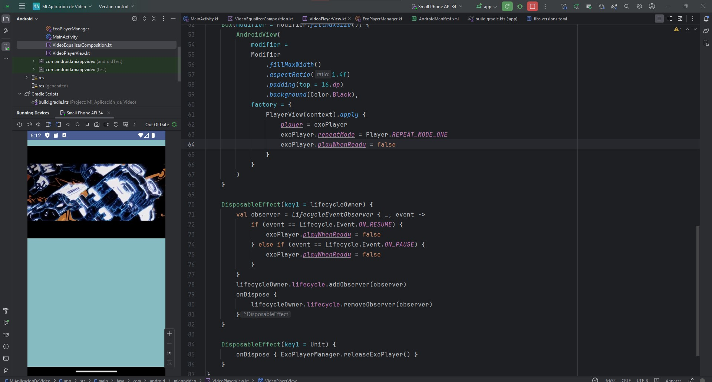
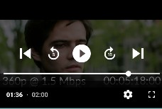
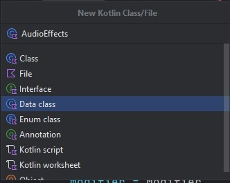
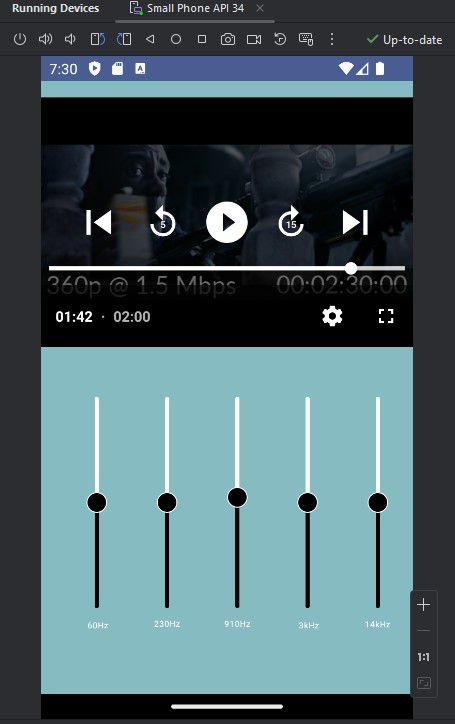
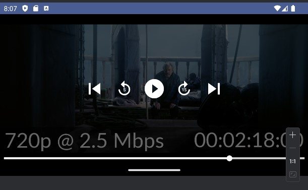

# Reproducción de Video

## Integración de reproductores de video

### ¿Qué son los reproductores de video y por qué son importantes?

Los reproductores de video son componentes esenciales en las aplicaciones móviles, ya que permiten a los usuarios disfrutar de contenido multimedia de forma cómoda y eficiente. Estos reproductores deben ser capaces de manejar una amplia variedad de formatos de vídeo, ofrecer una reproducción fluida y de alta calidad, y proporcionar funciones adicionales como control de velocidad, subtítulos y selección de pistas de audio.

### Tipos de reproductores de vídeo para Android

Existen diversas opciones de reproductores de vídeo para Android, cada uno con sus propias características y ventajas:

- Reproductor multimedia nativo de Android: Es una opción básica pre-instalada en la mayoría de los dispositivos Android, pero puede tener limitaciones en cuanto a compatibilidad de formatos y funciones avanzadas.
- Reproductores de vídeo de terceros: Ofrecen una mayor variedad de funciones y compatibilidad con formatos, como MX Player, VLC Player y BSPlayer.
- Reproductores de video personalizados: Desarrollados a medida para aplicaciones específicas, permitiendo una mayor integración con la interfaz y las funcionalidades de la app.

### ¿Por qué elegir ExoPlayer para el desarrollo de aplicaciones Android?

ExoPlayer se ha convertido en una de las opciones más populares para la reproducción de video en Android debido a sus múltiples ventajas:

- Rendimiento superior: Ofrece una reproducción fluida y de alta calidad, incluso en dispositivos de gama baja.
- Compatibilidad amplia: Admite una gran variedad de formatos de video, incluyendo DASH, HLS, SmoothStreaming y MPEG-TS.
- Extensibilidad y personalización: Permite adaptar su comportamiento y funcionalidades a las necesidades específicas de cada aplicación.
- Integración con Android TV y Chromecast: Ofrece una experiencia optimizada para dispositivos de pantalla grande.
- Mantenimiento activo por parte de Google: Se actualiza constantemente con nuevas funciones y correcciones de errores.

Pero ¿por qué hablamos de exoplayer?, como ya sabrás de lecciones anteriores, es el reproductor por defecto que hemos utilizado para todas nuestras prácticas, una de las razones principales es un gran soporte y versatilidad en comparación de otros y también un dato curioso, es el reproductor con el que está construido YouTube. Así que si de poder se trata ExoPlayer sabrás que tiene bastante.
Empecemos a construir la base de nuestro laboratorio, a comparación de las lecciones anteriores, esta vez iremos un poco más allá de la actividad y de la funcionalidad central usando Jetpack Compose, esto debido a que añadiremos el ecualizador de audio el cual es un poco más complejo que lo que hemos realizado hasta ahora, por eso en la lección anterior sólo cubrimos las bases teóricas.

Empecemos con la configuración básica de nuestro proyecto.

### Paso 1 Creación de Proyecto en Android Studio

Para este laboratorio estaremos utilizando la versión de Android Studio, Iguana (2023.2.1), versiones anteriores o posteriores pueden ser soportadas, sin embargo pueden tener adecuaciones en el archivo Gradle por el nuevo formato de uso con Kotlin, y los números de las versiones de las librerías los cuales veremos en detalle.

El laboratorio hace uso de Jetpack Compose para el desarrollo de la interfaz, pero se puede obtener el mismo resultado utilizando MDC ó manejo de XML en formato tradicional para desarrollo de interfaces.

Una vez abriendo Android Studio vamos a crear un **Nuevo Proyecto** y seleccionamos un proyecto con un **Empty Activity** que utiliza como base **Jetpack Compose** y damos click en **Next**.



Dentro de la ventana de configuración del proyecto vamos a cambiar lo siguiente:
- Nombre: Mi Aplicación de Video
- Package: com.android.miappvideo
- Locations: Utiliza una carpeta de destino donde vaya a alojarse tu proyecto
- Minimum SDK: API 27 (“Oreo”; Android 8.1)
- Build configuration Language Kotlin DSL (build.gradle.kts)

Y damos click en **Finish.**

Esperamos un momento a que el proyecto termine su configuración inicial para poder empezar a trabajar.


> Nota: Para este laboratorio puedes hacer uso de un dispositivo físico o del emulador para ejecutar tu aplicación, recuerda que si vas a realizar un proyecto para usuarios finales se recomienda que siempre hagas pruebas en un dispositivo físico para probar el resultado de la manera más real posible.

### Paso 2 Configuración básica del proyecto

Ya que tenemos la versión base del proyecto vamos a correrla en un dispositivo y asegurarnos que la configuración inicial no está corrupta. Conectamos o cargamos el emulador correspondiente y damos click en el botón para correr la aplicación.


Si la configuración es adecuada veremos algo como lo siguiente:



Recordemos que un proyecto vacío para Jetpack Compose contiene una función default de Saludo o la función **Greeting.**

Si nuestro proyecto se ejecutó correctamente entonces vamos a eliminar esta función default que se llama en la **línea 25** del archivo **MainActivity.kt**, también vamos a eliminar las funciones de Compose **Greeting()** y **GreetingPreview()**. Dejando un código como el siguiente:

```kotlin
import android.os.Bundle
import androidx.activity.ComponentActivity
import androidx.activity.compose.setContent
import androidx.compose.foundation.layout.fillMaxSize
import androidx.compose.material3.MaterialTheme
import androidx.compose.material3.Surface
import androidx.compose.ui.Modifier
import com.android.miappvideo.ui.theme.MiAplicaciónDeVideoTheme


class MainActivity : ComponentActivity() {
   override fun onCreate(savedInstanceState: Bundle?) {
       super.onCreate(savedInstanceState)
       setContent {
           MiAplicaciónDeVideoTheme {
               // A surface container using the 'background' color from the theme
               Surface(
                   modifier = Modifier.fillMaxSize(),
                   color = MaterialTheme.colorScheme.background
               ) {
                   //Aquí llamaremos nuestra función composer para cargar todo nuestro video.
               }
           }
       }
   }
}
```

Ahora vamos a abrir el archivo AndroidManifest.xml y agregaremos el permiso de Internet, recuerda que esto es importante cuando queremos realizar cualquier conexión a Internet de lo contrario aunque nuestro código sea correcto no veremos un resultado adecuado.

Las líneas a agregar son las siguientes:

```kotlin
<uses-permission android:name="android.permission.INTERNET" />
<uses-permission android:name="android.permission.MODIFY_AUDIO_SETTINGS"/>
```

Anteriormente, solo habíamos utilizado el permiso de Internet para cargar información, pero ahora vamos a añadir el permiso para modificar ajustes de audio y poder trabajar efectivamente con nuestro ecualizador.

### Paso 3 Añadir las dependencias necesarias

Con lo anterior dejamos el terreno preparado para poder empezar a construir nuestra aplicación, pero ahora nos hacen falta los materiales de construcción en forma de librerías para nuestro proyecto. Vamos a abrir el archivo build.gradle.kts (:app) y en la sección de dependencias o dependencies agregaremos lo siguiente:

```kotlin
//Exoplayer
implementation("androidx.media3:media3-exoplayer:1.3.1")
implementation("androidx.media3:media3-ui:1.3.1")
implementation("androidx.media3:media3-exoplayer-hls:1.3.1")
```

Dependiendo de la versión de android puede solicitarte adecuación con el nuevo formato de librerías en cuyo caso puedes ajustar sustituyendo lo anterior por lo siguiente:

```kotlin
//Exoplayer
implementation(libs.androidx.media3.exoplayer)
implementation(libs.androidx.media3.ui)
implementation(libs.androidx.media3.exoplayer.hls)
```

El detalle con esta sustitución es que deberás agregar las librerías en el nuevo archivo libs.versions.toml (Version Catalog), donde ahora se colocan las versiones de las librerías en forma de variables. Mi archivo se ve de la siguiente manera:

```kotlin
[versions]
agp = "8.3.2"
kotlin = "1.9.0"
coreKtx = "1.13.0"
junit = "4.13.2"
junitVersion = "1.1.5"
espressoCore = "3.5.1"
lifecycleRuntimeKtx = "2.7.0"
activityCompose = "1.9.0"
composeBom = "2023.08.00"
media3Exoplayer = "1.3.1"


[libraries]
androidx-core-ktx = { group = "androidx.core", name = "core-ktx", version.ref = "coreKtx" }
androidx-media3-exoplayer = { module = "androidx.media3:media3-exoplayer", version.ref = "media3Exoplayer" }
androidx-media3-exoplayer-hls = { module = "androidx.media3:media3-exoplayer-hls", version.ref = "media3Exoplayer" }
androidx-media3-ui = { module = "androidx.media3:media3-ui", version.ref = "media3Exoplayer" }
junit = { group = "junit", name = "junit", version.ref = "junit" }
androidx-junit = { group = "androidx.test.ext", name = "junit", version.ref = "junitVersion" }
androidx-espresso-core = { group = "androidx.test.espresso", name = "espresso-core", version.ref = "espressoCore" }
androidx-lifecycle-runtime-ktx = { group = "androidx.lifecycle", name = "lifecycle-runtime-ktx", version.ref = "lifecycleRuntimeKtx" }
androidx-activity-compose = { group = "androidx.activity", name = "activity-compose", version.ref = "activityCompose" }
androidx-compose-bom = { group = "androidx.compose", name = "compose-bom", version.ref = "composeBom" }
androidx-ui = { group = "androidx.compose.ui", name = "ui" }
androidx-ui-graphics = { group = "androidx.compose.ui", name = "ui-graphics" }
androidx-ui-tooling = { group = "androidx.compose.ui", name = "ui-tooling" }
androidx-ui-tooling-preview = { group = "androidx.compose.ui", name = "ui-tooling-preview" }
androidx-ui-test-manifest = { group = "androidx.compose.ui", name = "ui-test-manifest" }
androidx-ui-test-junit4 = { group = "androidx.compose.ui", name = "ui-test-junit4" }
androidx-material3 = { group = "androidx.compose.material3", name = "material3" }


[plugins]
androidApplication = { id = "com.android.application", version.ref = "agp" }
jetbrainsKotlinAndroid = { id = "org.jetbrains.kotlin.android", version.ref = "kotlin" }
```

Ahora vamos a sincronizar el proyecto para descargar todas las librerías, no olvides que esto lo podemos realizar desde el icono del elefante.


Esta primera ejecución puede tomar un poco de tiempo en lo que se bajan todos los recursos. Una vez que lo tengamos listo vamos a regresar a nuestro archivo **MainActivity.kt.**

### Paso 4 Carga de un video creando un reproductor

A diferencia de prácticas anteriores donde hemos trabajado todo, desde el archivo MainActivity, esta vez empezaremos a trabajar con las buenas prácticas para la estructura de Compose, dentro de MainActivity en el comentario que dejamos para empezar a trabajar llamaremos la siguiente función:

```kotlin
VideoEqualizerComposition()
```

Esta función aún no la creamos, para ello crearemos nuestros archivos necesarios. Crearemos un archivo nuevo colocándolos desde com.android.miappvideo



Crearemos un nuevo archivo de tipo Kotlin Class/File, al cual llamaremos VideoEqualizerComposition, borraremos el código de class generado de manera automática. Ahora vamos a crear una variable que funcionará de manera global la url que necesitamos para el video que usaremos en esta práctica:

```kotlin
val M3U8_URL = "https://cph-p2p-msl.akamaized.net/hls/live/2000341/test/master.m3u8"
```

Como puedes ver al igual que la introducción a estas lecciones usaremos un formato .m3u8 a forma de conexión remota para hacer un streaming del video, si bien podemos usarlo con otros formatos como ya hemos utilizado en otras lecciones, usaremos esta para que veas una aproximación más cercana a como se utiliza YouTube.

Ahora vamos a crear nuestra función de Compose, la cuál definiremos de la siguiente manera:

```kotlin
@Composable
fun VideoEqualizerComposition() {


   Scaffold(
       containerColor = Color(50, 145, 150, alpha = 150)
   ) {
       LazyColumn(
           contentPadding = PaddingValues(top = it.calculateTopPadding())
       ) {
           item {
               Box(modifier = Modifier.fillMaxSize()) {
                   VideoPlayerView()
               }
           }
       }
   }
}
```

Aquí empezaremos a crear una estructura básica de componentes y dentro de todo usaremos un VideoPlayerView, que vamos a extraer en un nuevo archivo. Crea el nuevo archivo VideoPlayerView y agrega lo siguiente:

```kotlin
@androidx.annotation.OptIn(UnstableApi::class)
@Composable
fun VideoPlayerView() {
   val context = LocalContext.current
   val lifecycleOwner = LocalLifecycleOwner.current


   val exoPlayer = remember { ExoPlayerManager.getExoPlayer(context) }


   LaunchedEffect(key1 = Unit) {
       val dataSourceFactory = DefaultHttpDataSource.Factory()


       val uri = Uri.Builder().encodedPath(M3U8_URL).build()
       val mediaItem = MediaItem.Builder().setUri(uri).build()


       val internetVideoSource =
           HlsMediaSource.Factory(dataSourceFactory).createMediaSource(mediaItem)


       exoPlayer.setMediaSource(internetVideoSource)
       exoPlayer.prepare()


   }


   Box(modifier = Modifier.fillMaxSize()) {
       AndroidView(
           modifier =
           Modifier
               .fillMaxWidth()
               .aspectRatio(1.4f)
               .padding(top = 16.dp)
               .background(Color.Black),
           factory = {
               PlayerView(context).apply {
                   player = exoPlayer
                   exoPlayer.repeatMode = Player.REPEAT_MODE_ONE
                   exoPlayer.playWhenReady = false
               }
           }
       )
   }


   DisposableEffect(key1 = lifecycleOwner) {
       val observer = LifecycleEventObserver { _, event ->
           if (event == Lifecycle.Event.ON_RESUME) {
               exoPlayer.playWhenReady = false
           } else if (event == Lifecycle.Event.ON_PAUSE) {
               exoPlayer.playWhenReady = false
           }
       }
       lifecycleOwner.lifecycle.addObserver(observer)
       onDispose {
           lifecycleOwner.lifecycle.removeObserver(observer)
       }
   }


   DisposableEffect(key1 = Unit) {
       onDispose { ExoPlayerManager.releaseExoPlayer() }
   }
}
```

Dentro de la función que acabamos de crear estamos estableciendo la base de nuestro reproductor de video como lo hemos hecho hasta ahora. En esencia estamos configurando para cualquier cambio dentro de la reproducción o cambio en caso de entrar a modos de background o cualquier cambio que pueda tener nuestra actividad.

Ahora bien, dentro del código verás que nos marca un pedazo en color rojo sobre el ExoPlayerManager, esto ya que la clase aún no existe, nuevamente vamos a crear un archivo nuevo pero esta vez que sea de tipo Object.

```kotlin
onDispose { ExoPlayerManager.releaseExoPlayer() }
```


El código a contener es el siguiente:

```kotlin
object ExoPlayerManager {
   private var exoPlayer: ExoPlayer? = null


   fun getExoPlayer(context: Context): ExoPlayer {
       if (exoPlayer == null) {
           exoPlayer = ExoPlayer.Builder(context).build()
       }
       return exoPlayer!!
   }


   fun releaseExoPlayer() {
       exoPlayer?.release()
       exoPlayer = null
   }
}
```

Nuevamente, este código nos permite manejar el reproductor al obtenerlo o manipularlo y al momento de cerrar o liberar los recursos para que el video no se quede corriendo con problemas.

Ahora podemos ejecutar nuestra aplicación y el resultado será algo como lo siguiente:



Ahora tenemos nuestro reproductor de video listo, algo interesante y bastante útil es que los controles básicos de reproducción ya vienen implementados, si utilizas YouTube te sentirás familiarizado de por medio con que los controles son exactamente los mismos, lo que comentábamos al inicio YouTube utiliza ExoPlayer para reproducir los videos.

En este sub-tema, hemos explorado el mundo de los reproductores de video en Android, analizando su importancia, los diferentes tipos disponibles y las razones por las que ExoPlayer se ha convertido en una opción popular para el desarrollo de aplicaciones.

ExoPlayer se destaca por su rendimiento superior, compatibilidad amplia, extensibilidad, integración con Android TV y Chromecast, y mantenimiento activo por parte de Google. Estas características lo convierten en una herramienta poderosa para crear experiencias de reproducción de video excepcionales en aplicaciones Android.

Con nuestra aplicación ya configurada con ExoPlayer reproduciendo un archivo .m3u8, estamos listos para embarcarnos en el siguiente paso del laboratorio: la implementación de un ecualizador gráfico para personalizar la experiencia auditiva.

## Controles de reproducción de video: pausa, reproducción, avance y retroceso

Los controles de reproducción de video son elementos esenciales en la interfaz de usuario de cualquier reproductor multimedia, ya que permiten a los usuarios interactuar con el contenido y navegar por él de manera intuitiva. Estos controles brindan al usuario la posibilidad de:

- Iniciar y detener la reproducción: El botón de reproducción inicia la reproducción del video, mientras que el botón de pausa la detiene temporalmente.
- Adelantar y retroceder: Los botones de avance y retroceso permiten al usuario moverse rápidamente a través del video, ya sea hacia adelante o hacia atrás.
- Ajustar la velocidad de reproducción: Algunos reproductores ofrecen la posibilidad de ajustar la velocidad de reproducción, permitiendo al usuario ver el video más rápido o más lento.
- Saltar a puntos específicos del video: La barra de progreso, junto con la función de búsqueda, permite al usuario navegar rápidamente a cualquier punto del video.
- Controlar el volumen: El control de volumen permite ajustar el nivel de sonido del video.
- Activar/desactivar la pantalla completa: El botón de pantalla completa permite ampliar la imagen del video para ocupar toda la pantalla del dispositivo.
- Seleccionar subtítulos y pistas de audio: Algunos reproductores permiten seleccionar entre diferentes subtítulos y pistas de audio disponibles para el video.

### Consideraciones de Diseño

Al diseñar los controles de reproducción de video, es importante tener en cuenta los siguientes aspectos:

- Usabilidad: Los controles deben ser intuitivos y fáciles de usar, incluso para usuarios no expertos.
- Visibilidad: Los controles deben ser claramente visibles y accesibles para el usuario.
- Estética: Los controles deben integrarse armoniosamente con el diseño general de la interfaz de usuario.
- Retroalimentación: Los controles deben proporcionar retroalimentación visual y auditiva al usuario para indicar su estado y funcionamiento.

### Implementación de Controles de Reproducción en ExoPlayer

ExoPlayer ofrece una API completa que permite a los desarrolladores implementar controles de reproducción personalizados. La biblioteca proporciona clases y métodos para controlar la reproducción, el ajuste de la velocidad, la búsqueda de puntos específicos del video, el control del volumen y la gestión de subtítulos y pistas de audio.

En resumen, los controles de reproducción de video son elementos fundamentales para brindar una experiencia de usuario fluida y agradable. ExoPlayer ofrece las herramientas necesarias para implementar controles de reproducción personalizados y robustos en aplicaciones Android.

Ahora algo que no tenemos habilitado y que necesitamos para más adelante es el botón de pantalla completa, para hacer esto no se necesita mucho, dentro de VideoPlayerView añadiremos lo siguiente:

```kotlin
useController = true
setFullscreenButtonClickListener { isFullScreen ->}
```

Esto lo haremos dentro del Box que contiene nuestro PlayerView:

```kotlin
Box(modifier = Modifier.fillMaxSize()) {
   AndroidView(
       modifier =
       Modifier
           .fillMaxWidth()
           .aspectRatio(1.4f)
           .padding(top = 16.dp)
           .background(Color.Black),
       factory = {
           PlayerView(context).apply {
               player = exoPlayer
               exoPlayer.repeatMode = Player.REPEAT_MODE_ONE
               exoPlayer.playWhenReady = false
               useController = true
               setFullscreenButtonClickListener { isFullScreen ->}
           }
       }
   )
}
```

Si volvemos a ejecutar la aplicación veremos el botón añadido en la esquina inferior derecha.



Aunque añadimos el botón, de momento no hace nada, pues necesitamos implementar esta funcionalidad que veremos más adelante en la lección.

En este subtema, hemos explorado en profundidad el mundo de los controles de reproducción de vídeo, analizando su importancia, las funcionalidades que ofrecen y las consideraciones de diseño que se deben tener en cuenta al implementarlos.

**Hemos destacado la importancia de los controles de reproducción de vídeo para brindar una experiencia de usuario fluida, intuitiva y agradable.** Estos controles permiten a los usuarios interactuar con el video de manera natural, controlando la reproducción, navegando por el contenido y ajustando la configuración de audio y visualización.

**ExoPlayer se presenta como una herramienta poderosa para la implementación de controles de reproducción de video personalizados y robustos en aplicaciones Android.** La biblioteca ofrece una API completa que facilita la creación de controles intuitivos y funcionales, adaptándose a las necesidades específicas de cada aplicación.

**Si bien en este laboratorio hemos añadido el botón de pantalla completa sin funcionalidad, el siguiente paso será dotarlo de la capacidad de expandir la imagen del vídeo a pantalla completa.** Para ello, explicaremos las funciones de ExoPlayer y las técnicas de diseño de interfaces de usuario para crear una experiencia de pantalla completa fluida y atractiva.

## Personalización de la interfaz de usuario para la reproducción de video

Las interfaces de usuario de los reproductores de video tradicionales suelen limitarse a controles básicos de reproducción, como pausa, avance y retroceso. Sin embargo, las posibilidades van mucho más allá. En este sub-tema, explicaremos cómo personalizar la interfaz de usuario para crear una experiencia de video más inmersiva y atractiva, enfocándonos en la implementación de un ecualizador de audio. 

### ¿Por qué personalizar la interfaz de usuario de un reproductor de video?

- Mejorar la experiencia del usuario: Una interfaz de usuario personalizada puede brindar una experiencia más intuitiva y placentera, adaptándose a las preferencias y necesidades de los usuarios.
- Diferenciar tu aplicación: En un mercado saturado de aplicaciones, una interfaz única puede ayudar a que tu aplicación se destaque y atraiga a más usuarios.
- Agregar valor a tu contenido: Una interfaz bien diseñada puede mejorar la percepción del valor de tu contenido y aumentar la satisfacción de los usuarios.

### Implementando un ecualizador de audio

Un ecualizador de audio permite a los usuarios ajustar las frecuencias del sonido para adaptarlo a sus preferencias. Esto es especialmente útil para diferentes géneros musicales, películas o podcasts, ya que cada uno tiene un perfil de audio particular.

### Consideraciones de diseño

- Ubicación: El ecualizador debe ubicarse en un lugar visible y accesible, sin obstruir la vista del video.
- Usabilidad: La interfaz del ecualizador debe ser fácil de usar, con controles intuitivos y una representación visual clara de las frecuencias.
- Personalización: Permite a los usuarios guardar sus ajustes preestablecidos de ecualización para diferentes tipos de contenido.
- Estética: El diseño del ecualizador debe integrarse armoniosamente con el estilo general de la interfaz de usuario.

Vamos a regresar a nuestro archivo VideoEqualizerComposition, dentro de nuestro LazyColumn, definimos nuestro item que contiene el VideoPlayerView. Vamos a definir un nuevo item con una función que llamaremos EqualizerView, esta función recibirá un view model que explicaremos a continuación.

```kotlin
item {
   EqualizerView(viewModel = viewModel)
}
```

La función se vería de la siguiente manera:

```kotlin
@Composable
fun VideoEqualizerComposition() {


   Scaffold(
       containerColor = Color(50, 145, 150, alpha = 150)
   ) {
       LazyColumn(
           contentPadding = PaddingValues(top = it.calculateTopPadding())
       ) {
           item {
               Box(modifier = Modifier.fillMaxSize()) {
                   VideoPlayerView()
               }
           }


           item {
               EqualizerView(viewModel = viewModel)
           }
       }
   }
}
```

En el contexto del laboratorio que estás realizando, un ViewModel actúa como intermediario entre la vista (la interfaz de usuario de tu aplicación) y el modelo (los datos de tu aplicación).

Su función principal es preparar y procesar los datos del modelo para que la vista los pueda mostrar de forma correcta y eficiente. De esta manera, se separa la lógica de presentación (cómo se muestran los datos) de la lógica de negocio (cómo se procesan los datos), siguiendo los principios de arquitectura de software como MVVM (Model-View-ViewModel).

Utilizar un ViewModel en tu laboratorio te permitirá:

- Mejorar la organización y la testabilidad del código: Al separar la lógica de presentación de la lógica de negocio, tu código será más fácil de entender, mantener y probar.
Facilitar la reutilización de código: Un ViewModel puede ser reutilizado en diferentes vistas, evitando la duplicación de código.
- Simplificar la gestión del estado de la vista: El ViewModel puede almacenar y gestionar el estado de la vista, lo que te permite mantener una interfaz de usuario consistente y actualizada.

En resumen, un ViewModel es una herramienta valiosa para crear aplicaciones Android robustas, escalables y mantenibles.

Para nuestro laboratorio, usaremos el viewmodel para guardar la información obtenida de los valores del ecualizador y nos servirá para controlar lo que se ejecuta en pantalla a través del filtro de video.

Empezaremos con el EqualizerView, crea un nuevo archivo que contenga lo siguiente:

```kotlin
@OptIn(ExperimentalMaterial3Api::class)
@Composable
fun EqualizerView(viewModel: AudioEqualizerViewModel) {


   val xAxisLabels = listOf("60Hz", "230Hz", "910Hz", "3kHz", "14kHz")
   val maxLength = xAxisLabels.maxByOrNull { it.length }?.length ?: 0
   val audioEffects by viewModel.audioEffects.collectAsState()


   Column(
       modifier = Modifier
           .fillMaxWidth()
           .fillMaxHeight()
           .graphicsLayer {
               rotationZ = 270f
           },
       verticalArrangement = Arrangement.SpaceEvenly,
       horizontalAlignment = Alignment.CenterHorizontally
   ) {
       for (index in xAxisLabels.indices) {
           Row(
               modifier = Modifier
                   .padding(top = 20.dp)
                   .width(220.dp)
           ) {
               Box {
                   val paddedLabel = xAxisLabels[index].padStart(maxLength, ' ')
                   Text(
                       text = paddedLabel, modifier = Modifier
                           .wrapContentWidth()
                           .align(Alignment.CenterStart)
                           .rotate(90f), color = Color.White,
                       fontSize = 8.sp,
                       textAlign = TextAlign.Start
                   )


                   Slider(
                       modifier = Modifier
                           .offset(x = 20.dp),
                       value = audioEffects!!.gainValues[index].times(1000f).toFloat()
                           .coerceIn(-3000f, 3000f),
                       onValueChange = {
                           viewModel.onBandLevelChanged(index, it.toInt())
                       },
                       valueRange = -3000f..3000f,
                       colors = SliderDefaults.colors(
                           thumbColor = Color.Black,
                           activeTrackColor = Color.Black,
                           inactiveTrackColor = Color.White
                       ),
                       thumb = {
                           Box(
                               modifier = Modifier
                                   .size(20.dp)
                                   .border(
                                       1.dp,
                                       Color.White,
                                       CircleShape
                                   )
                                   .clip(CircleShape)
                                   .background(Color.Black, CircleShape)
                           )
                       }
                   )
               }
           }
       }
   }
}
```

Dentro de este view, vamos a definir 5 sliders verticales, estos sliders obtendrán y guardarán los valores dentro de nuestro viewmodel, de forma simple al momento de cambiar un valor se efectuará un cambio dentro de los canales de audio del video. Antes de agregar el código y confundirnos vamos a entender de dónde vienen, porqué cinco y algunos elementos teóricos que son importantes para entender lo que estamos haciendo.

Por lo tanto ahora es el momento ideal de hablar más sobre el ecualizador. 

## Descifrando los Secretos del Ecualizador: Una Guía para Principiantes

En el mundo del sonido, el ecualizador es como un chef experto que sazona la música a tu gusto. Cada perilla o "slider" controla un rango específico de frecuencias, permitiendo ajustar el balance tonal del audio. Para comprender mejor su funcionamiento, imaginemos la música como un pastel compuesto por diferentes capas de sonido:
1. Graves (60Hz): Son los cimientos del pastel, representando los sonidos más bajos y profundos, como el retumbar de un bajo o el rugido de un dinosaurio. Aumentar los graves puede dar más potencia y presencia a la música, pero hacerlo en exceso puede volverla embarrada o boomy.
2. Medios Bajos (230Hz): Esta capa aporta calidez y cuerpo al pastel, como la voz ronca de un cantante o el golpe del bombo. Realzar los medios bajos puede dar más riqueza y plenitud a la música, pero exagerarlos puede hacer sonar turbia o confusa.
3. Medios (910Hz): Aquí encontramos la esencia de la música, donde reside la voz principal, las guitarras y otros instrumentos melódicos. Ajustar los medios permite resaltar o atenuar elementos específicos del sonido, como dar más brillo a una voz o destacar un solo de guitarra.
4. Agudos (3kHz): Son los detalles del pastel, representando los sonidos más altos y brillantes, como los platillos de una batería o el silbido de una flauta. Aumentar los agudos puede dar más nitidez y claridad a la música, pero hacerlo demasiado puede volverla estridente o fatigante para el oído.
5. Presencia (14kHz): Esta capa es como la chispa final del pastel, realzando los detalles más sutiles y agudos. Ajustar la presencia permite enfatizar la definición de instrumentos como los platillos o las guitarras eléctricas, pero hacerlo en exceso puede volver el sonido áspero o irritante.

**En resumen:**

- Graves: Potencia y presencia.
- Medios Bajos: Calidez y cuerpo.
- Medios: Claridad y definición.
- Agudos: Nitidez y brillo.
- Presencia: Detalles y definición extrema.

**Recuerda:**
- El ajuste ideal del ecualizador depende de tus preferencias personales, el tipo de música que escuchas y el entorno de escucha.
- Experimenta con diferentes configuraciones para encontrar el sonido que más te guste.
- Un ecualizador bien utilizado puede mejorar significativamente tu experiencia auditiva, pero un uso excesivo puede tener el efecto contrario.

Ya que hablamos del ecualizador, si regresamos a nuestro código estamos mejorando la calidad del audio con nuestros sliders para aumentar o disminuir la definición de cada capa de sonido.

Dentro de EqualizerView, estamos enviando nuestro viewModel que será de tipo AudioEqualizerViewModel, vamos a crear el archivo del viewmodel para poder utilizarlo con la vista del ecualizador.

```kotlin
class AudioEqualizerViewModel: ViewModel() {
  
}
```

Aquí estamos heredando de la clase ViewModel base que ya viene definida en Android por default, dentro de la clase vamos a definir las siguiente variables:

```kotlin
val audioEffects = MutableStateFlow<AudioEffects?>(null)
private var equalizer: Equalizer? = null
private var audioSessionId = 0
```

El primero es una variable MutableStateFlow que nos permite conectar nuestra interfaz de Compose para que reciba valores, y la segunda es una clase de ExoPlayer que permite manejar el ecualizador del reproductor, si bien este último no es un control visual o de interfaz, es la forma de modificar el audio desde adentro. Por último definimos un audioSessionId, es un identificador sencillo para la clase Equalizer, este es un parámetro que usaremos más adelante.

Ahora vamos a generar un constructor de la clase por defecto con lo siguiente:

```kotlin
init {
   if (audioEffects.value == null) {
       audioEffects.tryEmit(AudioEffects(PRESET_FLAT, FLAT))
   }
}
```

Aquí trataremos de enviar desde el inicio un valor a nuestro MutableStateFlow de efectos de audio cuando exista un valor y para ello definiremos el valor FLAT, que no es nada más que el valor inicial para nuestro ecualizador. Este valor lo definiremos fuera de la clase de la siguiente manera:

```kotlin
val FLAT = arrayListOf(0.0, 0.0, 0.0, 0.0, 0.0)
```

Este arreglo será para cada uno de los sliders que  utilizaremos, por tanto los comenzaremos con valores en 0.0.

Así mismo definiremos PRESET_FLAT como un valor numérico que utilizaremos más adelante en nuestra implementación por ahora solo coloca la variable antes de FLAT.

```kotlin
const val PRESET_FLAT = 1
```

Ahora, el código tiene un error que no hemos atendido, este error podemos verlo si intentamos ejecutar la aplicación, sin embargo estamos tratando de realizar las mejores prácticas por lo que no desesperes, veamos a nivel conceptual en donde está el problema, y esto es con la clase AudioEffects, esta clase o más bien modelo necesitamos crearlo, y puedes verlo como una estructura de datos que contendrá 2 variables que nos servirán para almacenar el audio del filtro.



Crea el nuevo archivo de tipo Data Class y agregale lo siguiente:

```kotlin
data class AudioEffects(
   var selectedEffectType: Int = 0,
   var gainValues: ArrayList<Double>
)
```

Aquí tendremos los valores del tipo de efecto de audio seleccionado y los valores ganados al modificar el audio.

Si regresamos al viewmodel veremos que se arreglan los errores al momento.

Ahora vamos a definir la función que se ejecuta al iniciar el viewmodel:

```kotlin
fun onStart(sessionId: Int) {
   audioSessionId = sessionId
   equalizer = Equalizer(Int.MAX_VALUE, audioSessionId)
   audioEffects.value?.gainValues?.forEachIndexed { index, value ->
       val bandLevel = (value * 1000).toInt().toShort()
       equalizer?.setBandLevel(index.toShort(), bandLevel)
   }
}
```

Aquí obtendremos el valor de sessionId y lo asignaremos al ecualizador. Y asignaremos el valor default a los controles del slider.

También deberemos añadir lo que necesitamos que se haga al modificar o mover el slider, esta función la llamaremos onBandLevelChanged.

```kotlin
fun onBandLevelChanged(changedBand: Int, newGainValue: Int) {
   equalizer?.setBandLevel(changedBand.toShort(), newGainValue.toShort())
   val list = ArrayList(audioEffects.value!!.gainValues)
   list[changedBand] = (newGainValue.toDouble() / 1000)
   audioEffects.tryEmit(
       AudioEffects(
           PRESET_CUSTOM,
           list
       )
   )
}
```

Aquí llamaremos al ecualizador y asignaremos el valor de cambio del slider correspondiente. Y nuevamente lo que nos hace falta es crear el PRESET_CUSTOM que podemos colocar antes de PRESET_FLAT:

```kotlin
const val PRESET_CUSTOM = 0
```

Si regresamos a EqualizerView, y atendemos los imports faltantes veremos que la función no debería dar ningún error.

El código de EqualizerView debe verse como lo siguiente:

```kotlin
@OptIn(ExperimentalMaterial3Api::class)
@Composable
fun EqualizerView(viewModel: AudioEqualizerViewModel) {


   val xAxisLabels = listOf("60Hz", "230Hz", "910Hz", "3kHz", "14kHz")
   val maxLength = xAxisLabels.maxByOrNull { it.length }?.length ?: 0
   val audioEffects by viewModel.audioEffects.collectAsState()


   Column(
       modifier = Modifier
           .fillMaxWidth()
           .fillMaxHeight()
           .graphicsLayer {
               rotationZ = 270f
           },
       verticalArrangement = Arrangement.SpaceEvenly,
       horizontalAlignment = Alignment.CenterHorizontally
   ) {
       for (index in xAxisLabels.indices) {
           Row(
               modifier = Modifier
                   .padding(top = 20.dp)
                   .width(220.dp)
           ) {
               Box {
                   val paddedLabel = xAxisLabels[index].padStart(maxLength, ' ')
                   Text(
                       text = paddedLabel, modifier = Modifier
                           .wrapContentWidth()
                           .align(Alignment.CenterStart)
                           .rotate(90f), color = Color.White,
                       fontSize = 8.sp,
                       textAlign = TextAlign.Start
                   )


                   Slider(
                       modifier = Modifier
                           .offset(x = 20.dp),
                       value = audioEffects!!.gainValues[index].times(1000f).toFloat()
                           .coerceIn(-3000f, 3000f),
                       onValueChange = {
                           viewModel.onBandLevelChanged(index, it.toInt())
                       },
                       valueRange = -3000f..3000f,
                       colors = SliderDefaults.colors(
                           thumbColor = Color.Black,
                           activeTrackColor = Color.Black,
                           inactiveTrackColor = Color.White
                       ),
                       thumb = {
                           Box(
                               modifier = Modifier
                                   .size(20.dp)
                                   .border(
                                       1.dp,
                                       Color.White,
                                       CircleShape
                                   )
                                   .clip(CircleShape)
                                   .background(Color.Black, CircleShape)
                           )
                       }
                   )
               }
           }
       }
   }
}
```

Y el código del viewmodel como lo siguiente:

```kotlin
const val PRESET_CUSTOM = 0
const val PRESET_FLAT = 1


val FLAT = arrayListOf(0.0, 0.0, 0.0, 0.0, 0.0)


class AudioEqualizerViewModel: ViewModel() {
   val audioEffects = MutableStateFlow<AudioEffects?>(null)
   private var equalizer: Equalizer? = null
   private var audioSessionId = 0


   init {
       if (audioEffects.value == null) {
           audioEffects.tryEmit(AudioEffects(PRESET_FLAT, FLAT))
       }
   }


   fun onStart(sessionId: Int) {
       audioSessionId = sessionId
       equalizer = Equalizer(Int.MAX_VALUE, audioSessionId)
       audioEffects.value?.gainValues?.forEachIndexed { index, value ->
           val bandLevel = (value * 1000).toInt().toShort()
           equalizer?.setBandLevel(index.toShort(), bandLevel)
       }
   }


   fun onBandLevelChanged(changedBand: Int, newGainValue: Int) {
       equalizer?.setBandLevel(changedBand.toShort(), newGainValue.toShort())
       val list = ArrayList(audioEffects.value!!.gainValues)
       list[changedBand] = (newGainValue.toDouble() / 1000)
       audioEffects.tryEmit(
           AudioEffects(
               PRESET_CUSTOM,
               list
           )
       )
   }
}
```

Ahora, volveremos a VideoEqualizerComposition y donde llamamos a EqualizerView, se nos pedirá el viewmodel, por tanto necesitamos que desde la llamada al Compose, se pase un viewmodel desde la actividad de la siguiente manera:

```kotlin
fun VideoEqualizerComposition(viewModel: AudioEqualizerViewModel)
```

El código al momento de VideoEqualizerComposition es el siguiente:

```kotlin
val M3U8_URL = "https://cph-p2p-msl.akamaized.net/hls/live/2000341/test/master.m3u8"


@Composable
fun VideoEqualizerComposition(viewModel: AudioEqualizerViewModel) {


   Scaffold(
       containerColor = Color(50, 145, 150, alpha = 150)
   ) {
       LazyColumn(
           contentPadding = PaddingValues(top = it.calculateTopPadding())
       ) {
           item {
               Box(modifier = Modifier.fillMaxSize()) {
                   VideoPlayerView()
               }
           }


           item {
               EqualizerView(viewModel = viewModel)
           }
       }
   }
}
```

Por último volveremos al MainActivity para declarar el viewmodel. Para hacerlo necesitamos crear la variable después de declarar la clase:

```kotlin
val viewModel: AudioEqualizerViewModel by viewModels()
```

Este método de declaración es exclusivo de los viewmodel, esto lo hacemos así ya que los viewmodel de alguna manera se casan con el ciclo de vida de las actividades, es decir, cuando inicia la actividad inicia el viewmodel y así para cada estado del ciclo de vida como el pausar, detener o destruir. Son los únicos elementos que se definen de esta manera dentro de una actividad en Android.

Ahora que declaramos la variable, podemos pasarla a VideoEqualizerComposition:

```kotlin
VideoEqualizerComposition(viewModel)
```

El código al momento de MainActivity es el siguiente:

```kotlin
class MainActivity : ComponentActivity() {
   val viewModel: AudioEqualizerViewModel by viewModels()


   override fun onCreate(savedInstanceState: Bundle?) {
       super.onCreate(savedInstanceState)
       setContent {
           MiAplicaciónDeVideoTheme {
               // A surface container using the 'background' color from the theme
               Surface(
                   modifier = Modifier.fillMaxSize(),
                   color = MaterialTheme.colorScheme.background
               ) {
                   VideoEqualizerComposition(viewModel)
               }
           }
       }
   }
}
```

Si ejecutamos la aplicación que hemos construido hasta el momento, el resultado debería verse como el siguiente:



Veremos como resultado cada slider y mejor aún si ejecutamos el cambio del slider al ejecutar el video notaremos las modificaciones de audio sutiles que nos ofrece nuestro nuevo ecualizador. Éxito.

Para finalizar nuestra mejora de interfaz y de audio vamos a agregar a VideoPlayerView la siguiente línea al final del primer LaunchedEffect

```kotlin
viewModel.onStart(exoPlayer.audioSessionId)
```

Quedando algo como lo siguiente:

```kotlin
LaunchedEffect(key1 = Unit) {
   val dataSourceFactory = DefaultHttpDataSource.Factory()


   val uri = Uri.Builder().encodedPath(M3U8_URL).build()
   val mediaItem = MediaItem.Builder().setUri(uri).build()


   val internetVideoSource =
       HlsMediaSource.Factory(dataSourceFactory).createMediaSource(mediaItem)


   exoPlayer.setMediaSource(internetVideoSource)
   exoPlayer.prepare()


   // Will be used in later implementation for Equalizer
   viewModel.onStart(exoPlayer.audioSessionId)
}
```

Esto nos llevará a tener que enviar al ViewPlayerView también, el view model, actualiza con lo siguiente:

```kotlin
fun VideoPlayerView(viewModel: AudioEqualizerViewModel)
```

Y no olvides en VideoEqualizerComposition en la función donde llamamos a VideoPlayerView, enviar el ViewModel:

```kotlin
VideoPlayerView(viewModel = viewModel)
```

Y justo como te mencione si volvemos a ejecutar la aplicación nos aseguraremos que siempre exista un valor default para nuestro ecualizador. Un punto importante es que el ecualizador maneja valores entre -3000 y 3000 por lo que es normal que los valores en 0 del slider se empiezan a alinear a la mitad.

En este sub-tema, hemos explorado el fascinante mundo del ecualizador de audio, descubriendo cómo personalizar la interfaz de usuario para brindar una experiencia de video más inmersiva y atractiva.

**Hemos aprendido que un ecualizador no es solo una colección de sliders, sino una herramienta poderosa para esculpir el sonido a nuestro gusto.** Cada frecuencia, desde los graves profundos hasta los agudos brillantes, juega un papel crucial en la percepción del audio.

**Al comprender el papel de cada rango de frecuencia y cómo ajustarlo, podemos crear experiencias auditivas personalizadas que se adapten a nuestras preferencias y al tipo de contenido que estamos reproduciendo.** Ya sea que disfrutemos de la potencia de los graves en una canción electrónica, la calidez de las voces en un concierto acústico o la nitidez de los diálogos en una película, el ecualizador nos brinda el control para crear la mezcla perfecta.

**Recuerda:**
- Experimentar es clave: No tengas miedo de ajustar los sliders y descubrir cómo cada frecuencia afecta el sonido.
- Escuchar con atención: Presta atención a los detalles sutiles y cómo cambian con cada ajuste.
- Encontrar el equilibrio: Un ecualizador bien utilizado realza la música, pero un uso excesivo puede ser perjudicial para la experiencia auditiva.

## Uso de video en pantalla completa.

En los subtemas anteriores estuvimos trabajando el reproductor y los controles de interfaz del ecualizador, pero ha llegado el momento de extender el pequeño botón que agregamos al inicio de pantalla completa.

El video es un medio poderoso que nos transporta a otros mundos, nos conecta con emociones y nos brinda información y entretenimiento. Sin embargo, la experiencia de visualización puede verse limitada por el tamaño de la pantalla. Es aquí donde entra en juego el modo de pantalla completa, una función esencial que permite expandir los horizontes de nuestra experiencia visual.

Imagina esto: estás viendo una película llena de acción y aventura. La batalla final se intensifica, los efectos especiales cobran vida y los héroes se enfrentan a un enemigo formidable. De repente, una distracción visual en el borde de la pantalla te saca de la inmersión. ¡Qué frustrante!

El modo de pantalla completa resuelve este problema al ampliar la imagen del video para ocupar toda la pantalla de tu dispositivo. De esta manera, se eliminan las distracciones y te sumerges por completo en la acción, sin que nada te robe la atención.

Pero el modo de pantalla completa no se limita solo a las películas de acción. Es ideal para cualquier tipo de video que quieras disfrutar al máximo, desde conciertos y documentales hasta tutoriales y videollamadas.

En este subtema, explicaremos los beneficios del modo de pantalla completa y cómo implementarlo en nuestra aplicación de video. Aprenderemos a crear una experiencia de visualización más inmersiva y atractiva para nuestros usuarios, permitiéndoles disfrutar del contenido como nunca antes.

Para hacer la implementación en nuestro código debemos hacer lo siguiente:

Dentro de VideoEqualizerComposition vamos a actualizar el item que llama a EqualizerView, esto debido a que para manejar la pantalla completa deberemos generar que la aplicación cambie de orientación, pero si lo dejamos como está podremos seguir viendo el ecualizador haciendo scroll, esto no es deseado por lo que necesitamos una manera de que al entrar en modo pantalla completa se esconda el ecualizador.

```kotlin
item {
   AnimatedVisibility(
       visible = visibleEqualizer,
       enter = fadeIn() + slideInVertically { fullHeight -> -fullHeight / 2 },
       exit = fadeOut() + slideOutVertically { fullHeight -> -fullHeight / 3 }
   ) {
       EqualizerView(viewModel = viewModel)
   }
}
```
Aquí haremos uso de AnimatedVisibility, que nos permite cambiar la visibilidad de elementos en pantalla de manera sencilla, pero para ello nos insta a que utilizamos un MutableStateFlow dentro del viewmodel que en este caso será la variable visibleEqualizer que aún no definimos, antes de hacerlo vamos a manejar el viewmodel, agregando a nuestra definición de variables lo siguiente:

```kotlin
val visibleEqualizer = MutableStateFlow<Boolean>(true)
```

Esta variable nos permitirá saber cuando desplegar o no el ecualizador, y por default comenzará en verdadero pues es como cargamos la aplicación.

En el reino de las aplicaciones móviles Android, la orientación de la pantalla juega un papel crucial en la experiencia del usuario. Es como una brújula que guía la interfaz de usuario, adaptándola a la forma en que el usuario sostiene su dispositivo. Antes de continuar debemos hablar de la orientación de pantalla en Android.

**Dos caminos principales conforman este universo:**

- Portrait (Retrato): El camino vertical, como si mantuvieras tu teléfono como si fuera un libro o una carta. Es la orientación más común, ideal para leer, navegar por la web y usar la mayoría de las aplicaciones.


- Landscape (Paisaje): El camino horizontal, como si estuvieras viendo una película o jugando un videojuego. Esta orientación aprovecha el ancho de la pantalla, brindando más espacio para contenido multimedia y aplicaciones con interfaces más complejas.


**¿Cómo funciona?**

Los sensores del dispositivo detectan la orientación en la que se sostiene y envían esa información al sistema operativo Android. Este, a su vez, ajusta la interfaz de la aplicación en consecuencia.

**¿Por qué es importante?**

La orientación de la pantalla no solo se trata de estética, sino también de usabilidad. Una aplicación bien diseñada debe adaptarse a ambas orientaciones para ofrecer una experiencia fluida y consistente, sin importar cómo la sostenga el usuario.

**¿Cómo controlar la orientación?**

Las aplicaciones de Android pueden controlar la orientación de la pantalla mediante el archivo Manifest.xml. En este archivo, se puede especificar si la aplicación debe permanecer en modo Portrait, Landscape o si debe permitir que el usuario la cambie libremente.

**En resumen:**

- La orientación de la pantalla es un aspecto fundamental de la experiencia del usuario en Android.
- Portrait y Landscape son las dos orientaciones principales.
- Es importante que las aplicaciones se adapten a ambas orientaciones para ofrecer una experiencia fluida y consistente.
- La orientación se controla mediante el archivo Manifest.xml.

Regresando a nuestro código del viewmodel, ahora añadiremos una función para validar y modificar el valor de la variable StateFlow:

```kotlin
fun setScreenOrientation(isFullScreen: Boolean) {
   visibleEqualizer.value = !isFullScreen
}
```

Esto será que cuando se detecte el modo pantalla completa se modifique el valor de mostrar el ecualizador y de manera automática el AnimatedVisibility del VideoEqualizerComposition mostrará o esconderá el ecualizador.

Regresando a VideoEqualizerComposition necesitamos agregar la conexión con la variable visibleEqualizer de la siguiente manera:

```kotlin
val visibleEqualizer by viewModel.visibleEqualizer.collectAsState()
```

Aquí obtendremos automáticamente el valor de la variable cuando se actualice, ahora solo nos hace falta indicar el cambio de orientación en el reproductor. Abre la clase VideoPlayerView y donde definimos el 

```
setFullscreenButtonClickListener { isFullScreen ->
   viewModel.setScreenOrientation(isFullScreen)
   if (isFullScreen) {
       activity.setScreenOrientation(orientation = ActivityInfo.SCREEN_ORIENTATION_LANDSCAPE)
   } else {
       activity.setScreenOrientation(orientation = ActivityInfo.SCREEN_ORIENTATION_PORTRAIT)
   }
}
```

Con este código mandamos llamar nuestro viewmodel, para indicar que muestre o esconda el ecualizador, y adicional mandamos a cambiar la orientación de pantalla dentro del activity, pero nuevamente nos hace falta pasar el activity hasta nuestra función, actualicemos la función, con lo siguiente:

```kotlin
fun VideoPlayerView(viewModel: AudioEqualizerViewModel, activity: MainActivity)
```

Aún nos hace falta declarar en el activity la función setScreenOrientation, lo haremos en un momento, pero antes volveremos a VideoEqualizerComposition y actualizaremos la función para recibir el activity y pasarlo a VideoPlayerView.

```kotlin
fun VideoEqualizerComposition(viewModel: AudioEqualizerViewModel,activity: MainActivity)
```

Y al actualizar VideoPlayerView:

```kotlin
VideoPlayerView(viewModel = viewModel, activity = activity)
```

Ahora regresemos a donde comenzamos, a MainActivity, y desde aquí vamos a declarar la función que nos hace falta:

```kotlin
fun setScreenOrientation(orientation: Int) {
   val activity = this.findActivity() ?: return
   activity.requestedOrientation = orientation
   if (orientation == ActivityInfo.SCREEN_ORIENTATION_LANDSCAPE) {
       hideSystemUi()
   } else {
       showSystemUi()
   }
}
```

Dentro de esta función vamos a necesitar un conjunto adicional de funciones que nos ayudarán a que nuestra actividad pueda hacer el cambio de orientación correspondiente:

```kotlin
private fun Context.findActivity(): Activity? = when (this) {
   is Activity -> this
   is ContextWrapper -> baseContext.findActivity()
   else              -> null
}


private fun Context.hideSystemUi() {
   val activity = this.findActivity() ?: return
   val window = activity.window ?: return
   WindowCompat.setDecorFitsSystemWindows(window, false)
   WindowInsetsControllerCompat(window, window.decorView).let { controller ->
       controller.hide(WindowInsetsCompat.Type.systemBars())
       controller.systemBarsBehavior = WindowInsetsControllerCompat.BEHAVIOR_SHOW_TRANSIENT_BARS_BY_SWIPE
   }
}


private fun Context.showSystemUi() {
   val activity = this.findActivity() ?: return
   val window = activity.window ?: return
   WindowCompat.setDecorFitsSystemWindows(window, true)
   WindowInsetsControllerCompat(
       window,
       window.decorView
   ).show(WindowInsetsCompat.Type.systemBars())
}
```

Estas últimas funciones nos ayudan a eliminar cualquier elemento distractor de la pantalla como bordes o márgenes adicionales para eliminarlos al momento de entrar en modo landscape o lo que será nuestro modo pantalla completa.

No olvides actualizar dentro de MainActivity la llamada a VideoEqualizerComposition para pasar el activity:

```kotlin
VideoEqualizerComposition(viewModel,this)
```

Si regresas a VideoPlayerView, verás que la llamada a setScreenOrientation se resolvió correctamente. Ahora ejecuta la aplicación.



Si hacemos click en el botón de pantalla completa veremos como se actualiza pantalla a adecuar el espacio, si volvemos a hacer click regresará al modo original. 

Dependiendo de tu dispositivo puede ser necesario que en modo pantalla completa tengas que dar click 2 veces, esto es normal y es uno de los puntos a mejorar a futuro pues esto tiene que ver con el ciclo de vida de la aplicación el cual no cubriremos en este laboratorio.

Éxito, hemos logrado configurar nuestro reproductor en pantalla completa y hemos alcanzado todos los pasos de nuestro laboratorio y cubierto todos los sub-temas de la lección.

## Conclusión

En este sub-tema, hemos explorado el fascinante mundo de la orientación de pantalla en Android, descubriendo cómo controlar la forma en que se muestra la interfaz de usuario de nuestras aplicaciones en función de la posición del dispositivo.

Hemos aprendido que la orientación de la pantalla no es solo un detalle estético, sino un factor crucial para la usabilidad y la experiencia del usuario. Una aplicación bien diseñada debe adaptarse a ambas orientaciones, Portrait y Landscape, para ofrecer una experiencia fluida y consistente, sin importar cómo la sostenga el usuario.

Al comprender los conceptos de orientación de pantalla y cómo controlarlos mediante el archivo Manifest.xml, podemos crear aplicaciones Android que se adaptan a cualquier posición, brindando a nuestros usuarios una experiencia de usuario excepcional.

En este tema, hemos profundizado en el fascinante mundo de la personalización de la interfaz de usuario para aplicaciones Android. Hemos explorado conceptos como estilos, temas, atributos, layouts y recursos, descubriendo cómo utilizarlos para crear interfaces atractivas, intuitivas y adaptables a diferentes dispositivos y preferencias de usuario.

### Lo que hemos aprendido

- **La importancia de una interfaz de usuario bien diseñada**: Una interfaz de usuario atractiva y fácil de usar es fundamental para el éxito de cualquier aplicación Android.
- **Los conceptos básicos de la personalización de la interfaz de usuario**: Hemos aprendido sobre cómo manejar sliders con Compose y conectarlos utilizando un viewmodel para almacenar la información
- **La importancia de la accesibilidad**: Hemos aprendido sobre la importancia de crear interfaces accesibles para usuarios con diferentes habilidades.

### Ampliando la funcionalidad

Las posibilidades de personalización de la interfaz de usuario en Android son infinitas. Podemos ampliar la funcionalidad de nuestras aplicaciones de varias maneras, por ejemplo:

- **Utilizando bibliotecas de terceros**: Existen numerosas bibliotecas de terceros que pueden ayudarnos a crear interfaces más complejas y atractivas.
- **Implementando animaciones y transiciones**: Las animaciones y transiciones pueden hacer que nuestras interfaces sean más dinámicas y agradables de usar.
- **Creando interfaces personalizadas para diferentes dispositivos**: Podemos crear interfaces personalizadas para diferentes tamaños de pantalla y densidades de píxeles.
- **Personalizando la interfaz de usuario en función de las preferencias del usuario**: Podemos permitir que los usuarios personalicen la interfaz de usuario a su gusto, por ejemplo, cambiando el tema o el tamaño de la fuente.
- **Agregar un set predefinido al ecualizador**: Podemos agregar sets pre-configurados que modifiquen la interfaz del ecualizador y hacer más rápida la prueba al usuario final
- **Incorporar manejo de ciclo de vida para estados de video**: YouTube utiliza los estados de ciclo de vida para mantener la reproducción mediante el ahorro de datos con el canal de audio, es una de sus funciones más complejas pero más usables para usuarios de YouTube Premium.
