# Implementación de gestos en Android

## Tipos de gestos en dispositivos Android

¿Qué son los gestos?

Los gestos son movimientos corporales que se utilizan para comunicar ideas o emociones. En el contexto de la interacción con dispositivos digitales, los gestos se refieren a acciones táctiles que realizamos en la pantalla táctil de un teléfono inteligente o tableta para controlar la interfaz de usuario.

Definiciones

Para comprender los diversos conceptos que se mencionan en esta página, debes comprender parte de la terminología que se usa:

- Puntero: Es un objeto físico que puedes usar para interactuar con tu aplicación. En los dispositivos móviles, el puntero más común es el dedo que interactúa con la pantalla táctil. También puedes usar una pluma stylus para reemplazar el dedo. En el caso de pantallas grandes, puedes usar un mouse o un panel táctil para interactuar con la pantalla de forma indirecta. Un dispositivo de entrada debe poder "apuntar" a una coordenada para que se considere un puntero, por lo que un teclado, por ejemplo, no puede considerarse un puntero. En Compose, el tipo de puntero se incluye en los cambios de punteros con PointerType.

- Evento de puntero: Describe una interacción de bajo nivel de uno o más punteros con la aplicación en un momento determinado. Cualquier interacción con el puntero, como colocar un dedo en la pantalla o arrastrar un mouse, activará un evento. En Compose, toda la información relevante para ese evento se encuentra en la clase PointerEvent.

- Gesto: Una secuencia de eventos de puntero que se pueden interpretar como una sola acción. Por ejemplo, un gesto de toque puede considerarse una secuencia de un evento de presión seguido de un evento de presión. Hay gestos comunes que usan muchas apps, como presionar, arrastrar o transformar, pero también puedes crear tu propio gesto personalizado cuando lo necesites.

Tipos de gestos en general:

Existen diversos tipos de gestos que se pueden realizar en dispositivos táctiles, algunos de los más comunes son:
- Tocar: Un simple toque en la pantalla con un dedo.
- Arrastrar: Deslizar el dedo por la pantalla para mover objetos o desplazarse por contenido.
- Deslizar: Mover el dedo rápidamente por la pantalla para realizar acciones rápidas como cambiar de página o descartar notificaciones.
- Pellizcar: Acercar o alejar dos dedos en la pantalla para aumentar o reducir el zoom de una imagen o elemento.
- Rotar: Girar dos dedos en la pantalla para rotar un objeto.
- Gestos multi-táctiles: Utilizar varios dedos al mismo tiempo para realizar acciones más complejas, como pellizcar y rotar al mismo tiempo.

Particularidades de los gestos en Android:

En el sistema operativo Android, existen algunas particularidades que diferencian los gestos de los otros tipos de dispositivos:
- Uso de la barra de navegación: La barra de navegación en la parte inferior de la pantalla proporciona botones para realizar acciones básicas como volver atrás, ir a la pantalla de inicio y abrir aplicaciones recientes.
- Gestos de navegación: Algunos dispositivos Android utilizan gestos de navegación que reemplazan la barra de navegación tradicional. Estos gestos se basan en deslizamientos y toques en los bordes de la pantalla para realizar las mismas acciones que los botones de la barra de navegación.
- Soporte para gestos personalizados: Los desarrolladores de aplicaciones pueden crear sus propios gestos personalizados para sus aplicaciones. Esto permite una mayor flexibilidad y personalización en la forma en que los usuarios interactúan con las aplicaciones.

Diferentes niveles de abstracción

Jetpack Compose proporciona diferentes niveles de abstracción para controlar los gestos. En el nivel superior, se encuentra la compatibilidad con componentes. Los elementos componibles como Button incluyen automáticamente compatibilidad con gestos. Para agregar compatibilidad con gestos a componentes personalizados, puedes agregar modificadores de gestos, como clickable, a elementos arbitrarios que admiten composición. Por último, si necesitas un gesto personalizado, puedes usar el modificador pointerInput.

El nivel más bajo es mediante el uso del hardware directamente en conjunto con los toques específicos de pantalla, normalmente el nivel superior encapsula el uso de nivel más bajo por su nivel de complejidad, aunque con el nivel más bajo se puede llegar a tener un nivel de detalle personalizado de alta fidelidad.

Como regla, compila en el nivel más alto de abstracción que ofrezca la funcionalidad que necesitas. De esta manera, te beneficias de las prácticas recomendadas incluidas en la capa. Por ejemplo, Button contiene más información semántica, que se usa para la accesibilidad, que clickable, que contiene más información que una implementación de pointerInput sin procesar.

Compatibilidad y accesibilidad

Muchos componentes listos para usar en Compose incluyen algún tipo de control interno de gestos. Por ejemplo, un objeto LazyColumn responde a los gestos de arrastre desplazándose por su contenido, un objeto Button muestra una ondulación cuando presionas hacia abajo y el componente SwipeToDismiss incluye la lógica de deslizamiento para descartar un elemento. Este tipo de control gestual funciona automáticamente.

Además del control gestual interno, muchos componentes también requieren que el llamador controle el gesto. Por ejemplo, un objeto Button detecta automáticamente toques y activa un evento de clic. Pasa una lambda onClick a Button para reaccionar al gesto. De manera similar, agregas una lambda onValueChange a una Slider para reaccionar cuando el usuario arrastre el controlador del control deslizante.

Cuando se adapte a tu caso de uso, prioriza los gestos incluidos en los componentes, ya que incluyen compatibilidad inmediata para el enfoque y la accesibilidad, y están bien probados. Por ejemplo, un Button se marca de una manera especial para que los servicios de accesibilidad lo describen correctamente como un botón, en lugar de cualquier elemento en el que se pueda hacer clic:

```
// Talkback: "Click me!, Button, double tap to activate"


Button(onClick={/* TODO */}){Text("Click me!")
// Talkback: "Click me!, double tap to activate"
Box(Modifier.clickable{/* TODO */}){Text("Click me!")}
```

## Propagación de eventos

Como se mencionó antes, los cambios de puntero se pasan a cada elemento componible que recibe. Sin embargo, si existe más de un elemento componible, ¿en qué orden se propagan los eventos? Si tomas el ejemplo de la última sección, esta UI se traduce al siguiente árbol de UI, en el que solo ListItem y Button responden a los eventos de puntero:

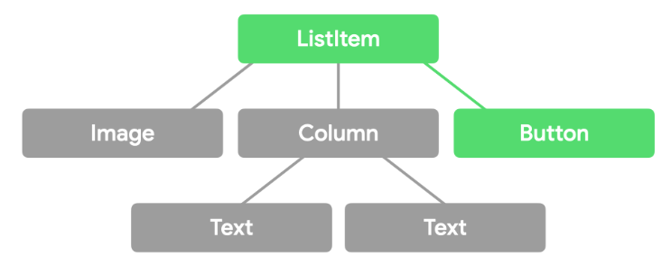

Los eventos del puntero fluyen a través de cada uno de estos elementos componibles tres veces, durante tres "pases":
- En el Pase inicial, el evento fluye desde la parte superior del árbol de IU hasta la parte inferior. Este flujo permite que un elemento superior intercepte un evento antes de que el secundario pueda consumirlo. Por ejemplo, la información sobre la herramienta debe interceptar una presión prolongada en lugar de pasarla a sus elementos secundarios. En nuestro ejemplo, ListItem recibe el evento antes de Button.
- En el Pase principal, el evento fluye desde los nodos hoja del árbol de IU hasta la raíz del árbol de IU. En esta fase, sueles consumir gestos y es el pase predeterminado cuando escuchas eventos. El control de los gestos en este pase implica que los nodos de hoja tienen prioridad sobre los superiores, que es el comportamiento más lógico de la mayoría de los gestos. En nuestro ejemplo, Button recibe el evento antes de ListItem.
- En el Pase final, el evento fluye una vez más desde la parte superior del árbol de IU hasta los nodos de hoja. Este flujo permite que los elementos superiores en la pila respondan al consumo de eventos por parte de su elemento superior. Por ejemplo, un botón quita su indicación de ondas cuando una pulsación se convierte en un arrastre de su elemento superior desplazable.

A manera de conclusión sobre los conceptos básicos generales la comprensión de los diferentes tipos de gestos es fundamental para el diseño de interfaces de usuario intuitivas y fáciles de usar en dispositivos Android. Al seleccionar los gestos adecuados para una aplicación, los desarrolladores pueden mejorar la experiencia del usuario y hacer que sus aplicaciones sean más atractivas y accesibles.

## Implementación de gestos táctiles básicos: toque, desplazamiento, y gestos multi-táctiles

En este sub-tema, nos centraremos en la implementación de gestos táctiles básicos en una aplicación Android utilizando Jetpack Compose. Comenzaremos con los gestos más simples como tocar, arrastrar y pellizcar, y luego avanzaremos hacia gestos multi-táctiles más complejos.

Empecemos con la configuración básica de nuestro proyecto.

### Paso 1 Creación de Proyecto en Android Studio

Para este laboratorio estaremos utilizando la versión de Android Studio, Iguana (2023.2.1), versiones anteriores o posteriores pueden ser soportadas, sin embargo pueden tener adecuaciones en el archivo Gradle por el nuevo formato de uso con Kotlin, y los números de las versiones de las librerías los cuales veremos en detalle.

El laboratorio hace uso de Jetpack Compose para el desarrollo de la interfaz, pero se puede obtener el mismo resultado utilizando MDC ó manejo de XML en formato tradicional para desarrollo de interfaces.

Una vez abriendo Android Studio vamos a crear un **Nuevo Proyecto** y seleccionamos un proyecto con un **Empty Activity** que utiliza como base **Jetpack Compose** y damos click en **Next**.


Dentro de la ventana de configuración del proyecto vamos a cambiar lo siguiente:
- Nombre: Mi Aplicación de Gesturas
- Package: com.android.miappgestures
- Locations: Utiliza una carpeta de destino donde vaya a alojarse tu proyecto
- Minimum SDK: API 27 (“Oreo”; Android 8.1)
- Build configuration Language Kotlin DSL (build.gradle.kts)

Y damos click en **Finish.**

Esperamos un momento a que el proyecto termine su configuración inicial para poder empezar a trabajar.


> Nota: Para este laboratorio puedes hacer uso de un dispositivo físico o del emulador para ejecutar tu aplicación, recuerda que si vas a realizar un proyecto para usuarios finales se recomienda que siempre hagas pruebas en un dispositivo físico para probar el resultado de la manera más real posible.

### Paso 2 Configuración básica del proyecto

Ya que tenemos la versión base del proyecto vamos a correrla en un dispositivo y asegurarnos que la configuración inicial no está corrupta. Conectamos o cargamos el emulador correspondiente y damos click en el botón para correr la aplicación.


Si la configuración es adecuada veremos algo como lo siguiente:

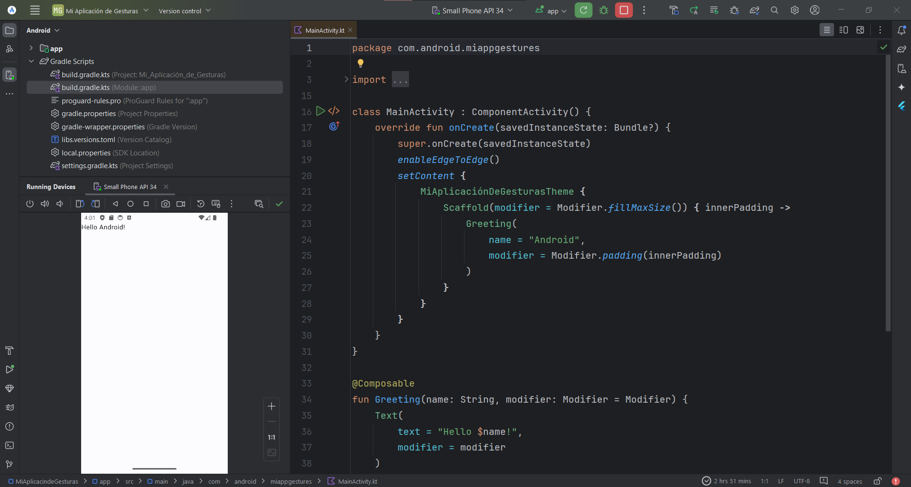

Recordemos que un proyecto vacío para Jetpack Compose contiene una función default de Saludo o la función **Greeting.**

Si nuestro proyecto se ejecutó correctamente entonces vamos a eliminar esta función default que se llama en la **línea 25** del archivo **MainActivity.kt**, también vamos a eliminar las funciones de Compose **Greeting()** y **GreetingPreview()**. Dejando un código como el siguiente:

```kotlin
@SuppressLint("UnusedMaterial3ScaffoldPaddingParameter")
class MainActivity : ComponentActivity() {
   override fun onCreate(savedInstanceState: Bundle?) {
       super.onCreate(savedInstanceState)
       enableEdgeToEdge()
       setContent {
           MiAplicaciónDeGesturasTheme {
               Scaffold(modifier = Modifier.fillMaxSize()) {  innerPadding ->
                   //Aquí llamaremos nuestra función de compose
               }
           }
       }
   }
}
```

### Paso 3 Añadir las dependencias necesarias.

Con lo anterior dejamos el terreno preparado para poder empezar a construir nuestra aplicación, pero ahora nos hacen falta los materiales de construcción en forma de librerías para nuestro proyecto. Vamos a abrir el archivo build.gradle.kts (:app) y en la sección de dependencias o dependencies agregaremos lo siguiente:

```kotlin
implementation(libs.androidx.navigation.compose)
implementation(libs.androidx.compose.material)
```

Como hemos visto en lecciones anteriores, necesitamos actualizar el archivo de versiones de las librerías, vamos a sustituir el archivo base. El detalle con esta sustitución es que deberás agregar las librerías en el nuevo archivo libs.versions.toml (Version Catalog), donde ahora se colocan las versiones de las librerías en forma de variables. Mi archivo se ve de la siguiente manera:

```kotlin
[versions]
agp = "8.4.0"
kotlin = "1.9.0"
coreKtx = "1.13.1"
junit = "4.13.2"
junitVersion = "1.1.5"
espressoCore = "3.5.1"
lifecycleRuntimeKtx = "2.8.0"
activityCompose = "1.9.0"
composeBom = "2023.08.00"
composeMaterial = "1.3.1"
navigationCompose = "2.7.7"


[libraries]
androidx-core-ktx = { group = "androidx.core", name = "core-ktx", version.ref = "coreKtx" }
androidx-navigation-compose = { module = "androidx.navigation:navigation-compose", version.ref = "navigationCompose" }
junit = { group = "junit", name = "junit", version.ref = "junit" }
androidx-junit = { group = "androidx.test.ext", name = "junit", version.ref = "junitVersion" }
androidx-espresso-core = { group = "androidx.test.espresso", name = "espresso-core", version.ref = "espressoCore" }
androidx-lifecycle-runtime-ktx = { group = "androidx.lifecycle", name = "lifecycle-runtime-ktx", version.ref = "lifecycleRuntimeKtx" }
androidx-activity-compose = { group = "androidx.activity", name = "activity-compose", version.ref = "activityCompose" }
androidx-compose-bom = { group = "androidx.compose", name = "compose-bom", version.ref = "composeBom" }
androidx-ui = { group = "androidx.compose.ui", name = "ui" }
androidx-ui-graphics = { group = "androidx.compose.ui", name = "ui-graphics" }
androidx-ui-tooling = { group = "androidx.compose.ui", name = "ui-tooling" }
androidx-ui-tooling-preview = { group = "androidx.compose.ui", name = "ui-tooling-preview" }
androidx-ui-test-manifest = { group = "androidx.compose.ui", name = "ui-test-manifest" }
androidx-ui-test-junit4 = { group = "androidx.compose.ui", name = "ui-test-junit4" }
androidx-material3 = { group = "androidx.compose.material3", name = "material3" }
androidx-compose-material = { group = "androidx.wear.compose", name = "compose-material", version.ref = "composeMaterial" }


[plugins]
android-application = { id = "com.android.application", version.ref = "agp" }
jetbrains-kotlin-android = { id = "org.jetbrains.kotlin.android", version.ref = "kotlin" }
```

Ahora vamos a sincronizar el proyecto para descargar todas las librerías, no olvides que esto lo podemos realizar desde el icono del elefante.


Esta primera ejecución puede tomar un poco de tiempo en lo que se bajan todos los recursos. Una vez que lo tengamos listo vamos a regresar a nuestro archivo **MainActivity.kt.**

### Paso 4 Preparar la navegación de la aplicación

Para esta aplicación necesitaremos implementar diferentes componentes para ver su funcionalidad, el problema a diferencia de las lecciones anteriores es que necesitaremos el uso de la pantalla completa para realizar las diferentes gesturas. Para ello vamos a requerir de un menú simple para seleccionar la gestura que queremos ver, esto a nivel de interfaz nos permitirá mostrar la vista y con un botón al darle clic expandir todas las opciones disponibles.

Para la navegación haremos el uso de un componente de Android llamado NavHost, este componente permite cargar funciones de Compose como vistas e intercambiarlas por otras, y hacer un mapa de navegación simple que podemos modificar.

Comenzamos creando un nuevo archivo llamado Screen. Aquí definiremos las rutas o vistas que contendrá nuestra aplicación.

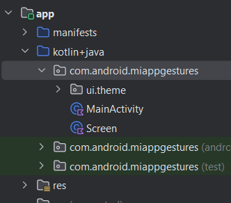

Dentro de este archivo vamos a definir el siguiente código.

```kotlin
sealed class Screen {
   data object ClickableScreen : Screen() {
       val route = "clickable_screen"
   }
}
```

Ahora vamos a crear varios paquetes dentro de nuestra aplicación el cuál llamaremos **ui_kit**, este estará a nivel de la raíz, y los siguientes se llamarán components y composition, los cuales se encontrarán dentro de **ui_kit.**

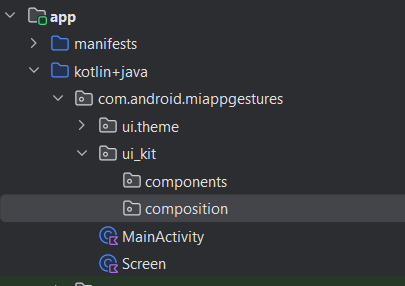

Dentro del paquete de composition vamos a crear un nuevo archivo al que nombraremos **MainComposer**, este archivo servirá como base de nuestra función principal de Compose, y la cual tendrá el siguiente código.

```kotlin
@SuppressLint("UnusedMaterial3ScaffoldPaddingParameter")
@OptIn(ExperimentalFoundationApi::class)
@Composable
fun MainComposer() {
   val navController = rememberNavController()


   Scaffold(
       topBar = {
           if (navController.currentBackStackEntry?.destination?.route != Screen.ClickableScreen.route) {
               ExpandableMenuList(navController)
           }
       },
       content = {
           NavHost(
               navController = navController,
               startDestination = Screen.ClickableScreen.route
           ) {
               composable(Screen.ClickableScreen.route) {
                   ClickableExample() // Your ClickableExample composable
               }
           }
       }
   )
}
```

Aquí crearemos la base de nuestra navegación y usaremos la clase Screen que definimos a manera de identificador de rutas para que NavHost sepa a qué vista nos estamos refiriendo. De momento las funciones ExpandableMenuList y ClickableExample deberán aparecerte en rojo.

Añadiremos debajo de MainComposer la función ExpandableMenuList la cual es la que nos permitirá pintar nuestro menú expandible.

```kotlin
@Composable
fun ExpandableMenuList(navController: NavController, isExpanded: Boolean = false) {
   val expandedState = remember { mutableStateOf(isExpanded) }


   val subMenu = listOf(
       Screen.ClickableScreen.route
   )
   Column(
       modifier = Modifier.statusBarsPadding()
   ) {
       Button(
           onClick = { expandedState.value = !expandedState.value },
           modifier = Modifier
               .fillMaxWidth()
               .padding(vertical = 8.dp)
       ) {
           if (expandedState.value) {
               Text("Collapse Menu")
           } else {
               Text("Menu")
           }
       }


       if (expandedState.value) {
           LazyColumn(modifier = Modifier.fillMaxHeight()) {
               items(subMenu) { screen ->
                   Button(
                       onClick = { navController.navigate(screen) },
                       modifier = Modifier.fillMaxWidth()
                   ) {
                       Text(text = screen.toString().replaceFirstChar { it.uppercase() })
                   }
               }
           }
       }
   }
}
```

En esta función crearemos el botón principal que reaccionará al click y desplegará una lista con sub-opciones que estarán ligadas a las screen que iremos definiendo poco a poco, la primera de ellas será la ClickableScreen que definimos. Aunque en esta función estamos definiendo la gestura de click pasaremos de momento de lado para ir a un ejemplo más específico que utiliza de manera más general las gesturas básicas de toque, desplazamiento y gestos multi-táctiles.

Por último antes de comenzar con nuestras gesturas regresemos a MainActivity y agreguemos la llamada a nuestro MainComposer.

```kotlin
class MainActivity : ComponentActivity() {
   override fun onCreate(savedInstanceState: Bundle?) {
       super.onCreate(savedInstanceState)
       enableEdgeToEdge()
       setContent {
           MyApplicationTheme {
               MainComposer()
           }
       }
   }
}
```

### Paso 5 Incorporación de gesturas básicas (toque, desplazamiento y gestos multitáctiles)

Ya tenemos configurada la navegación de nuestra aplicación, ahora podemos empezar a añadir gesturas a la misma, comencemos con la que hemos definido previamente el ClickableExample y más específicamente la gestura de clic.

Lo primero que haremos será crear un archivo dentro de nuestro paquete de **components**, el cual llamaremos **Tapping**, este hará referencia a las gesturas de toque. En este archivo crearemos la siguiente función de Compose.

```kotlin
@Composable
@Preview
fun ClickableExample() {
   var background by remember {
       mutableStateOf(Color.Blue)
   }
   Box(
       modifier = Modifier.fillMaxSize(),
       contentAlignment = Alignment.Center
   ) {
       Box(
           Modifier
               .background(background, CircleShape)
               .size(150.dp)
               .clickable {
                   background = randomColor()
               }
       )
   }


}


fun randomColor() = Color(Random.nextLong(0xFFFFFFFF))
```

Usa el modificador clickable() para permitir que un elemento de UI reciba clics desde la pantalla (toque breve con la punta del dedo) o el evento de clic del servicio de accesibilidad.

```kotlin
fun Modifier.clickable(
    enabled: Boolean = true,
    onClickLabel: String? = null,
    role: Role? = null,
    onClick: () -> Unit
): Modifier
```

Sus parámetros permiten:

- enabled: Activa y desactiva este modificador
- onClickLabel: Etiqueta de accesibilidad para la acción de clic
- role: Describe el tipo de elemento en la interfaz de usuario para los servicios de accesibilidad
- onClick: Manejador ejecutado cuando se hace clic en el elemento

A diferencia del sistema de views, clickable incluye los efectos visuales cuando se presiona el elemento en pantalla.

Vamos a intentar ejecutar nuestra aplicación, no olvides importar la función de **ClickableExample** en el archivo **MainComposition**, en **MainComposer**.

Si todo ha salido bien, deberás ver algo como lo siguiente:

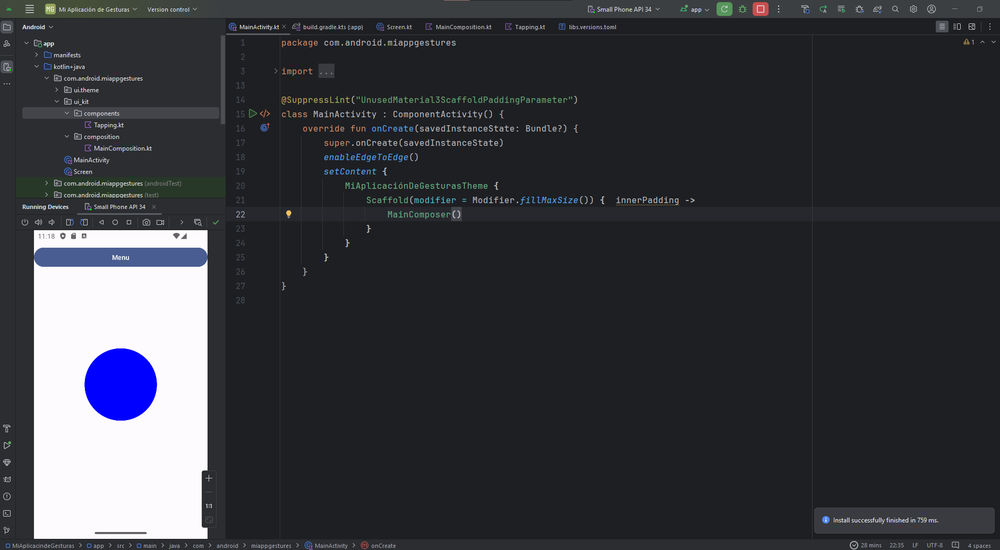

En nuestro dispositivo veremos un círculo al cual si le hacemos clic, veremos como empieza a cambiar de color respondiendo a nuestro evento de clic. Felicidades has manipulado el evento más sencillo dentro de Android y el más utilizado en cuanto a funcionalidad se requiere.

Adicionalmente nota el menú en la parte superior que al dar clic en el botón expande el menú con la única opción que  tenemos al momento.

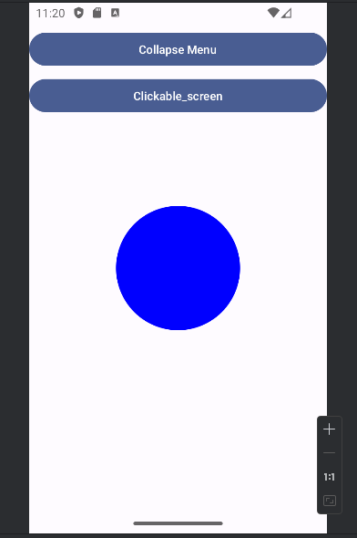

Excelente continuemos con la siguiente gestura.

Regresemos al archivo Screen, y vamos a añadir 2 nuevas rutas:

```kotlin
sealed class Screen {
   data object ClickableScreen : Screen() {
       val route = "clickable_screen"
   }
   data object DraggableScreen : Screen() {
       val route = "draggable_screen"
   }
   data object RotationScreen : Screen() {
       val route = "rotation_screen"
   }
}
```

Esto nos permitirá añadir 2 nuevas vistas, una para el evento de desplazamiento y otra para el evento multi-táctil.

Cada vez que queramos agregar una nueva vista debemos realizar el mismo procedimiento, crear la ruta en Screen, añadir la opción a ExpandableMenuList y agregar la llamada a la vista en MainComposer.

Dentro de ExpandableMenuList, tenemos una lista en una variable llamada subMenu, aquí añadiremos las nuevas opciones:

```kotlin
val subMenu = listOf(
   Screen.ClickableScreen.route,
   Screen.DraggableScreen.route,
   Screen.RotationScreen.route
)
```

Dentro de MainComposer dentro del content donde se define el NavHost, tenemos un evento composable que hace referencia al Screen route y desde aquí se hace la llamada a ClickableExample. Haremos lo mismo con los siguientes:

```kotlin
content = {
   NavHost(
       navController = navController,
       startDestination = Screen.ClickableScreen.route
   ) {
       composable(Screen.ClickableScreen.route) {
           ClickableExample() // Your ClickableExample composable
       }
       composable(Screen.DraggableScreen.route) {
           DraggableExample()
       }
       composable(Screen.RotationScreen.route) {
           RotationExample()
       }
   }
}
```

Como es normal, DraggableExample y RotationExample de momento no están definidos, por lo que estarán en rojo.

Para crearlos vamos a crear 2 nuevos archivos en components que se llamarán Dragging y Transformation.

Para el archivo Dragging, tendremos el evento de desplazamiento que definiremos de la siguiente manera:

```kotlin
@Composable
fun DraggableExample() {
    var offsetY by remember {
        mutableFloatStateOf(0f)
    }
    Box(
        modifier = Modifier.fillMaxSize(),
        contentAlignment = Alignment.Center
    ) {
        Box(
            modifier = Modifier
                .offset { IntOffset(0, offsetY.toInt()) }
                .background(Color.Magenta, CircleShape)
                .size(50.dp)
                .draggable(
                    orientation = Orientation.Vertical,
                    state = rememberDraggableState { delta ->
                        offsetY += delta
                    })
        )
    }
}
```

El modificador dragglable() le permite a un elemento recibir gestos de arrastre, donde el usuario toca el contenido y arrastra su dedo sin perder contacto con la superficie.
Este no realiza el desplazamiento automáticamente, por lo que debes actualizar el estado del modificador offset para lograr el movimiento.

```kotlin
fun Modifier.draggable(
    state: DraggableState,
    orientation: Orientation,
    enabled: Boolean = true,
    interactionSource: MutableInteractionSource? = null,
    startDragImmediately: Boolean = false,
    onDragStarted: suspend CoroutineScope.(Offset) -> Unit = {},
    onDragStopped: suspend CoroutineScope.(Float) -> Unit = {},
    reverseDirection: Boolean = false
): Modifier

```

Usa su parámetro state del tipo DragglabeState, para definir cómo los eventos de arrastre serán interpretados cuando el elemento aterrice sobre la superficie.
La función rememberDraggableState() será la encargada de crear y recordar el estado, proporcionando la cantidad de píxeles en su parámetro onDelta de tipo (Float)->Unit.

La función de compose que definimos en **Draggable** establece como estado el desplazamiento vertical del arrastre en offsetY. Su modificación se realiza en rememberDraggableState() y su actualización en el modificador offset().

Ahora pasemos a la función de Transformation, Compose nos permite detectar gestos multi-touch que permiten transformar el tamaño, posición y rotación de un elemento en pantalla.
Para ello hacemos uso del modificador transformable(), el cual permite actualizar el estado de UI a partir de un parámetro TransformableState.

```kotlin
Modifier.transformable(
    state: TransformableState,
    lockRotationOnZoomPan: Boolean,
    enabled: Boolean
)
```

Manejamos el estado con la función rememberTransformableState(). Esta recibe una lambda (onTransformation) con tres parámetros que indican el zoom, offset y la rotación percibidos por el gesto.

```kotlin
@Composable
fun rememberTransformableState(
    onTransformation: (zoomChange: Float, panChange: Offset, rotationChange: Float) -> Unit
)
```

Por tanto la función que debemos agregar  Transformation es la siguiente:

```kotlin
@Composable
fun RotationExample() {
   var rotation by remember {
       mutableStateOf(0f)
   }


   Box(
       modifier = Modifier.fillMaxSize(),
       contentAlignment = Alignment.Center
   ) {
       Box(
           modifier = Modifier
               .rotate(rotation)
               .transformable(
                   state = rememberTransformableState { _, _, degrees ->
                       rotation += degrees
                   })
               .size(150.dp, 300.dp)
               .background(Color.Red)
       )
   }
}
```

Importa las funciones correspondientes en **MainComposer** y ejecuta la aplicación.

De entrada verás 2 opciones nuevas en nuestro menú.

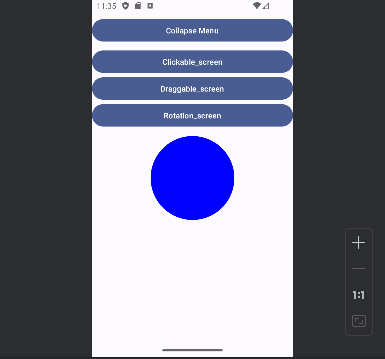

Comencemos con Draggable:

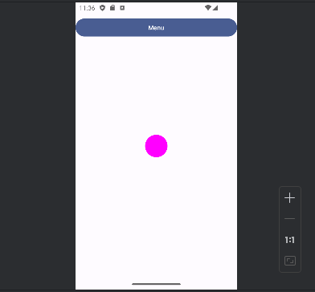

Al igual que con clickable, veremos un círculo de color en la pantalla, pero ahora intenta arrastrarlo con tu dedo o tu mouse de arriba hacia abajo, nota como la gestura nos permite mover de lugar el elemento dando una sensación de fluidez al hacerlo.

Ahora bien, si pasamos a Rotation veremos un rectángulo rojo.

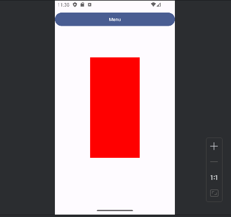

Si intentamos hacer clic solamente o arrastrar el dedo nada sucederá pero si utilizas 2 dedos, o si estás en el emulador y presionas la tecla ctrl, verás como activas los 2 dedos en la pantalla y podrás girar el rectángulo a voluntad.

Éxito, a manera de conclusión de este sub-tema, hemos implementado las gesturas más básicas en nuestro proyecto en un modelo de interfaz muy visual, si bien el clic es el más utilizado, haciendo arrastre o multi-tacto podemos añadir funciones adicionales a nuestras aplicaciones, según el caso de uso que sea necesario. Por ejemplo: el arrastre sirve para eventos de scroll en listas y viene en su mayoría implementado de manera default, el evento multi-táctil nos puede permitir un manejo más libre para realizar cierto tipo de efectos o animaciones que podemos darle a nuestra aplicación, y esto no se limita a los Box que hemos creado de Compose, como son parte de los modificadores, podemos implementarlos en prácticamente cualquier elemento que queramos, dándonos un gran poder a nuestras aplicaciones.

## Reconocimiento de gestos predefinidos

En el sub-tema anterior implementamos los gestos más comunes que existen en Android, ahora pasaremos a integrar algunos adicionales que si bien no son tan comunes, podemos preprararlo de diferentes maneras. Para esta parte vamos a añadir 3 gesturas nuevas.

Los gestos predefinidos dentro de compose nos van a ayudar a tener un poco más de grados de libertad en el entendido de que añadimos o extendemos la funcionalidad de las gesturas básicas, en algunos casos estos ya vienen pre definidos, y en otros tendremos aproximaciones diferentes a la que inicialmente inicia la gestura base. Realmente no hay una regla escrita al respecto y dependerá del contexto y cada caso el uso que se le debe dar, lo más importante es no perder la línea de lo que queremos lograr.

Como ya mencionamos añadiremos 3 nuevas gesturas, ahora iremos un poco más rápido en el proceso del NavHost, pues ya vimos donde se deben agregar, solo te dejaré los archivos y funciones actualizadas.

```kotlin
sealed class Screen {
   data object ClickableScreen : Screen() {
       val route = "clickable_screen"
   }
   data object DraggableScreen : Screen() {
       val route = "draggable_screen"
   }
   data object RotationScreen : Screen() {
       val route = "rotation_screen"
   }
   data object CombinedClickableScreen : Screen() {
       val route = "combined_clickable_screen"
   }
   data object DraggableFullScreen : Screen() {
       val route = "draggable_full_screen"
   }
   data object TransformationScreen : Screen() {
       val route = "transformation_screen"
   }
}
```

```kotlin
val subMenu = listOf(
   Screen.ClickableScreen.route,
   Screen.DraggableScreen.route,
   Screen.RotationScreen.route,
   Screen.CombinedClickableScreen.route,
   Screen.DraggableFullScreen.route,
   Screen.TransformationScreen.route
)
```

```kotlin
content = {
   NavHost(
       navController = navController,
       startDestination = Screen.ClickableScreen.route
   ) {
       composable(Screen.ClickableScreen.route) {
           ClickableExample() // Your ClickableExample composable
       }
       composable(Screen.DraggableScreen.route) {
           DraggableExample()
       }
       composable(Screen.RotationScreen.route) {
           RotationExample()
       }
       composable(Screen.CombinedClickableScreen.route) {
           CombinedClickableExample()
       }
       composable(Screen.DraggableFullScreen.route) {
           DraggableFullExample()
       }
       composable(Screen.TransformationScreen.route) {
           TransformationExample()
       }
   }
}
```

Ya que hemos agregado nuestra navegación, empecemos con CombinedClickableExample, el cual lo agregaremos en el archivo Tapping, debajo del que ya teníamos definido.

```kotlin
@ExperimentalFoundationApi
@Composable
fun CombinedClickableExample() {
   var text by remember {
       mutableStateOf("Ninguno")
   }


   Box(
       contentAlignment = Alignment.Center,
       modifier = Modifier.fillMaxSize()
   ) {
       Text(
           text = "Evento: $text",
           Modifier
               .combinedClickable(
                   onDoubleClick = {
                       text = "Double tap"
                   },
                   onLongClick = {
                       text = "Long press"
                   },
                   onClick = {
                       text = "Tap"
                   }),
           fontSize = 24.sp
       )
   }
}
```

En el caso que desees manejar eventos de doble clic y clic prolongado, invoca al modificador combinedClickable().

```kotlin
@ExperimentalFoundationApi
fun Modifier.combinedClickable(
    enabled: Boolean = true,
    onClickLabel: String? = null,
    role: Role? = null,
    onLongClickLabel: String? = null,
    onLongClick: () -> Unit = null,
    onDoubleClick: () -> Unit = null,
    onClick: () -> Unit
): @ExperimentalFoundationApi Modifier
```

Este provee el procesamiento de ambos eventos con los parámetros adicionales onDoubleClick y onLongClick.

Ahora pasaremos a integrar DraggableFullExample, éste lo agregaremos dentro de Dragging:

```kotlin
@Composable
fun DraggableFullExample() {
   Box(
       modifier = Modifier.fillMaxSize(),
       contentAlignment = Alignment.Center
   ) {
       var offsetX by remember { mutableStateOf(0f) }
       var offsetY by remember { mutableStateOf(0f) }


       Box(
           Modifier
               .offset { IntOffset(offsetX.roundToInt(), offsetY.roundToInt()) }
               .background(Color.Blue, CircleShape)
               .size(50.dp)
               .pointerInput(Unit) {
                   detectDragGestures { change, dragAmount ->
                       change.consume()
                       offsetX += dragAmount.x
                       offsetY += dragAmount.y
                   }
               }
       )
   }
}
```

Este es muy similar al que ya teníamos, lo único que estamos haciendo adicional es agregar el eje x para dar una total libertad de movimiento y no solo arriba y abajo como el que implementamos de manera básica.

Por último vamos a añadir TransformationExample dentro de Transformation:

Este último a diferencia del anterior de rotación, utiliza la propiedad de graphicsLayer para añadir la opción de cambiar el tamaño utilizando el efecto multi-táctil, en un momento verás a lo que me refiero.

Importa las funciones en MainComposer y ejecuta la aplicación, vamos a ver el primero Combined Clickable.

```kotlin
@Composable
fun TransformationExample() {
   // set up all transformation states
   var scale by remember { mutableStateOf(1f) }
   var rotation by remember { mutableStateOf(0f) }
   var offset by remember { mutableStateOf(Offset.Zero) }
   val state = rememberTransformableState { zoomChange, offsetChange, rotationChange ->
       scale *= zoomChange
       rotation += rotationChange
       offset += offsetChange
   }
   Box(
       Modifier
           // apply other transformations like rotation and zoom
           // on the pizza slice emoji
           .graphicsLayer(
               scaleX = scale,
               scaleY = scale,
               rotationZ = rotation,
               translationX = offset.x,
               translationY = offset.y
           )
           // add transformable to listen to multitouch transformation events
           // after offset
           .transformable(state = state)
           .background(Color.Blue)
           .fillMaxSize()
   )
}
```

Aquí veremos que el texto en pantalla va a reaccionar al estado de clic que hagamos en pantalla, estando en un default, pudiendo hacer clic como antes, pero añadiendo 2 nuevas opciones que es dar un doble clic o hacer un clic largo. Cada uno de estos es diferente y puede manejar su propia funcionalidad, es muy común verlo por ejemplo en aplicaciones como las de correo electrónico para realizar funciones avanzadas.

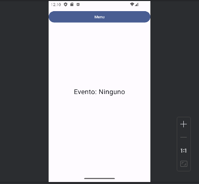
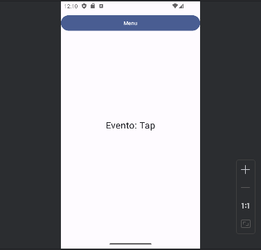
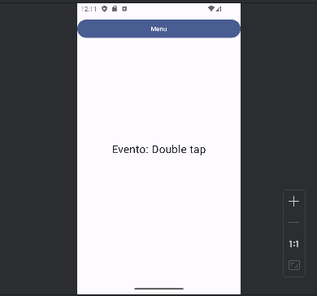
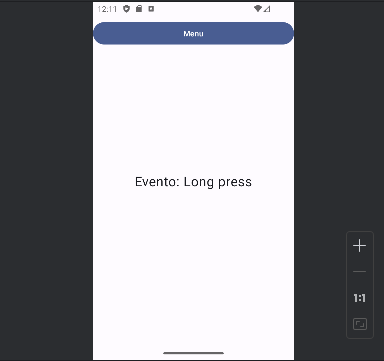

Estas funciones son nativas de Android en la gestura del clic, y aunque son básicas son mejor consideradas como personalizadas, pues no todas las aplicaciones las utilizan.

Ahora vayamos a la vista de Draggable Full.

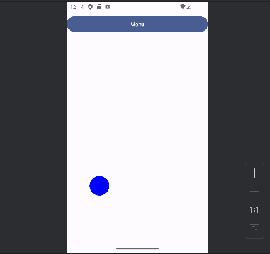

Acá veremos un punto el cual podremos arrastrar a voluntad por toda la pantalla, como vimos dentro del código a diferencia de los clics que vienen integrados por default en Android, este requiere añadir los grados de libertad en el eje x, algo que si bien es una propiedad no es algo que venga definido por default. Esta es otra manera de personalizar el tipo de gesturas en android que con un leve cambio en las propiedades nos da acceso a gesturas con alcances diferentes según sea su configuración.

Por último veamos Transformation.

Este quizás será el más difícil de controlar, pero igual que en rotation usaremos los 2 dedos o la tecla ctrl mientras manipulamos en el emulador para manipular el rectángulo que a simple vista parece el fondo de la vista. Cuando empezamos a manipularlo veremos que es un rectángulo y que podemos modificar su composición con la rotación que vimos anteriormente pero ahora pudiendo hacer un zoom hacia adentro o hacia afuera del mismo, las aplicaciones que utilizan este tipo de gestura no son muchas pero si son conocidas como por ejemplo los mapas.

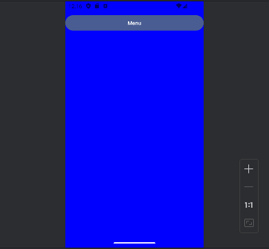

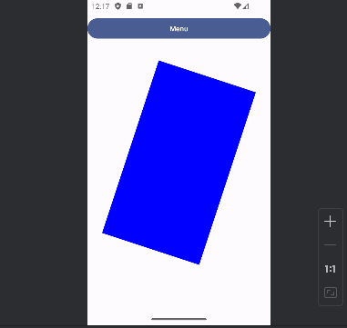

A diferencia de las gesturas anteriores, aquí añadimos la gestura predefinida del zoom, pero al igual que con el arrastre completo necesitamos manipular por nuestra cuenta los parámetros de deformación del elemento que la utiliza, por lo que sería una especie de combinado entre el clic y el arrastre.

Éxito, hemos logrado crear nuestras gesturas personalizadas, ahora solo falta ver cómo podemos integrar estos conceptos de gesturas dentro de la interfaz de usuario de una manera común.

A manera de conclusión observa que la personalización de gesturas puedes ser algo muy simple o puede ser algo complejo en términos de los valores que se utilizan para manipular los elementos en pantalla, por ejemplo ahora utilizamos objetos 2D, pero si quisiéramos simular un objeto 3D, necesitaríamos añadir las coordenadas correspondientes y manejar el tipo de gestura necesaria para hacer la transformación o deformación según sea el caso, este tipo de gesturas son muy poco usadas y en general se recomiendan más con otro tipo de motores de creación fuera del entorno nativo, pero nuevamente dependerá del caso y contexto de la aplicación que estés haciendo, por ahora ya tienes la posibilidad de usar un gran número de casos de uso con las que hemos visto hasta ahora.

## Integración de gestos en la interfaz de usuario

Para finalizar con nuestra lección veremos algunas gesturas que nos permiten adaptar de manera normal elementos o cosas que usamos en el día a día en la interfaz y que es necesario conocer para poder crear combinaciones interesantes o funcionalidades de interfaz más poderosas a lo que normalmente estamos acostumbrados. Aquí separaremos en 2 los eventos de scrolling y los eventos para elementos de arrastre.

Para comenzar con los eventos de scroll,crearemos un nuevo archivo en el paquete de **components** que se llamará **Scrolling**.

Entrando de lleno en materia iremos añadiendo los diferentes tipos de Scrolling que existen, en general estos elementos se usan cuando hay muchos objetos en pantalla y es necesario arrastrar con el dedo para ver todos, lo más común es utilizarlos en listas y podemos definir diferentes comportamientos según el tipo de datos con el que contemos.

El primero de ellos será el HorizontalScroll.

```kotlin
@Composable
fun HorizontalScrollExample() {
   val scrollState = rememberScrollState()


   Box(
       modifier = Modifier.fillMaxSize(),
       contentAlignment = Alignment.Center
   ) {
       Row(
           Modifier
               .fillMaxWidth()
               .horizontalScroll(scrollState)
       ) {
           repeat(10) {
               Box(
                   modifier = Modifier
                       .size(100.dp)
                       .background(randomColor())
               )


           }
       }
   }
}
```

Aplica el modificador horizontalScroll() sobre un elemento de UI, para habilitar su desplazamiento horizontal cuando su contenido es más grande que sus restricciones máximas de ancho.

```kotlin
fun Modifier.horizontalScroll(
    state: ScrollState,
    enabled: Boolean = true,
    flingBehavior: FlingBehavior? = null,
    reverseScrolling: Boolean = false
): Modifier
```

Donde:
- state: Es el estado del scroll.
- enabled: Determina si el scroll está activo o no.
- flingBehavior: Especifica la lógica del comportamiento cuando finaliza el desplazamiento.
- reverseScrolling: Invierte la dirección del scrolling. Si pasas true, la posición inicial será la derecha, si pasas false será la izquierda.

Como ves, es posible invocar el modificador sin los últimos 3 parámetros, ya que tienen valores por defecto comunes a la mayoría de situaciones.

En el caso de state, crearemos y recordaremos el estado con la función rememberScrollState(), la cual facilita la configuración de una instancia de tipo ScrollState.

El código anterior que añadimos a **Scrolling**, añade a la cadena de modificadores a horizontalScroll() junto a su estado. Luego usamos la función repeat() de Kotlin para generar las 10 cajas con una sola línea.

Ahora añadiremos el VerticalScroll:

```kotlin
@Composable
fun VerticalScrollExample() {
   val scrollState = rememberScrollState()


   Box(
       modifier = Modifier.fillMaxSize(),
       contentAlignment = Alignment.Center
   ) {
       Column(
           Modifier
               .height(300.dp)
               .fillMaxWidth()
               .verticalScroll(scrollState),
           horizontalAlignment = Alignment.CenterHorizontally
       ) {
           repeat(10) {
               Box(
                   modifier = Modifier
                       .size(100.dp)
                       .background(randomColor())
               )
           }
       }
   }

}
```

Añade el modificador verticalScroll() para permitir el desplazamiento vertical en el caso que el alto del contenido exceda las restricciones del eje Y. Sus parámetros son exactamente iguales que horizontaScroll().

Por ejemplo:

Creemos una columna cuya altura sea de 300dp y posea scroll vertical. Luego añadimos 10 cajas con diferentes colores de fondo para visualizar el desplazamiento.

Para entender mejor el efecto del Scroll, y poder hacer una manipulación más libre añadiremos un efecto Scroll:

```kotlin
@Composable
fun ScrollableExample() {
   val boxSize = 300f
   var scrollDeltaSum by remember {
       mutableStateOf(boxSize)
   }


   Box(
       modifier = Modifier.fillMaxSize(),
       contentAlignment = Alignment.Center
   ) {
       Column(
           Modifier
               .fillMaxWidth()
               .padding(16.dp),
           horizontalAlignment = Alignment.CenterHorizontally
       ) {
           Text("Alpha = ${scrollDeltaSum / boxSize}")
           Box(
               modifier = Modifier
                   .size(boxSize.dp)
                   .scrollable(
                       orientation = Orientation.Vertical,
                       state = rememberScrollableState { delta ->
                           scrollDeltaSum = (scrollDeltaSum - delta / 2).coerceIn(0f, boxSize)
                           delta
                       }
                   )
                   .alpha(scrollDeltaSum / boxSize)
                   .background(Color.Magenta)
           )
       }
   }
}
```

Otra forma para detectar el scroll de un contenido es el modificador scrollable(). A diferencia del scroll vertical y horizontal, este no desplaza el contenido sobre las restricciones, si no que hace un seguimiento de la distancia del scroll a partir de su parámetro state.

```kotlin
fun Modifier.scrollable(
    state: ScrollableState,
    orientation: Orientation,
    enabled: Boolean = true,
    reverseDirection: Boolean = false,
    flingBehavior: FlingBehavior? = null,
    interactionSource: MutableInteractionSource? = null
): Modifier
```

Esta función requiere de la orientación del scroll y la creación del estado con rememberScrollableState(). La cual recibe una lambda del tipo (Float) -> Float, donde los parámetro son los píxeles recorridos del scroll y el resultado la cantidad de scroll consumida en el evento.

Finalmente, hoy en día no existen solo listas con scroll vertical y horizontal, tal es el caso de las plataformas multimedia donde se hace una combinación de estas gesturas para ver contenido clasificado por categorías. Para ello añadiremos los siguiente:

```kotlin
@Preview
@Composable
fun NestedScrollExample() {
   Box(
       modifier = Modifier.fillMaxSize(),
       contentAlignment = Alignment.Center
   ) {
       Row(
           Modifier
               .fillMaxWidth()
               .height(100.dp)
               .horizontalScroll(rememberScrollState())
       ) {


           repeat(5) {
               Column(
                   Modifier
                       .size(100.dp)
                       .background(randomColor())
                       .verticalScroll(rememberScrollState())
               ) {
                   repeat(5) {
                       Text(
                           "Vertical",
                           Modifier.padding(16.dp)
                       )
                   }


               }
           }
       }
   }
}
```

Aquí veremos que podemos incorporar efectos anidados si su comportamiento es simple.

Por último vamos a añadirlos a nuestra navegación para poder probarlos:

```kotlin
sealed class Screen {
   data object ClickableScreen : Screen() {
       val route = "clickable_screen"
   }
   data object DraggableScreen : Screen() {
       val route = "draggable_screen"
   }
   data object RotationScreen : Screen() {
       val route = "rotation_screen"
   }
   data object CombinedClickableScreen : Screen() {
       val route = "combined_clickable_screen"
   }
   data object DraggableFullScreen : Screen() {
       val route = "draggable_full_screen"
   }
   data object TransformationScreen : Screen() {
       val route = "transformation_screen"
   }
   data object HorizontalScrollScreen : Screen() {
       val route = "horizontal_scroll_screen"
   }
   data object VerticalScrollScreen : Screen() {
       val route = "vertical_scroll_screen"
   }
   data object ScrollableScreen : Screen() {
       val route = "scrollable_screen"
   }
   data object NestedScrollScreen : Screen() {
       val route = "nested_scroll_screen"
   }
}
```

```kotlin
content = {
   NavHost(
       navController = navController,
       startDestination = Screen.ClickableScreen.route
   ) {
       composable(Screen.ClickableScreen.route) {
           ClickableExample() // Your ClickableExample composable
       }
       composable(Screen.DraggableScreen.route) {
           DraggableExample()
       }
       composable(Screen.RotationScreen.route) {
           RotationExample()
       }
       composable(Screen.CombinedClickableScreen.route) {
           CombinedClickableExample()
       }
       composable(Screen.DraggableFullScreen.route) {
           DraggableFullExample()
       }
       composable(Screen.TransformationScreen.route) {
           TransformationExample()
       }
       composable(Screen.HorizontalScrollScreen.route) {
           HorizontalScrollExample()
       }
       composable(Screen.VerticalScrollScreen.route) {
           VerticalScrollExample()
       }
       composable(Screen.ScrollableScreen.route) {
           ScrollableExample()
       }
       composable(Screen.NestedScrollScreen.route) {
           NestedScrollExample()
       }
   }
}
```

```kotlin
val subMenu = listOf(
   Screen.ClickableScreen.route,
   Screen.DraggableScreen.route,
   Screen.RotationScreen.route,
   Screen.CombinedClickableScreen.route,
   Screen.DraggableFullScreen.route,
   Screen.TransformationScreen.route,
   Screen.HorizontalScrollScreen.route,
   Screen.VerticalScrollScreen.route,
   Screen.ScrollableScreen.route,
   Screen.NestedScrollScreen.route
)
```

Si ejecutamos la aplicación veremos lo siguiente cargando el HorizontalScrolling:

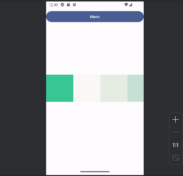

Ahora si seleccionamos el VerticalScrolling:

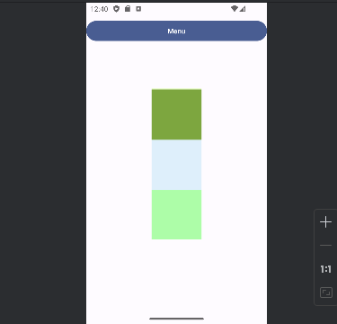

El Scrolling liberado:

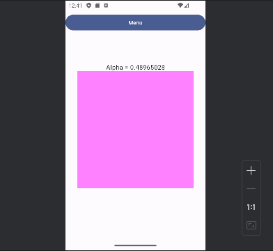

Y el Scrolling anidado:

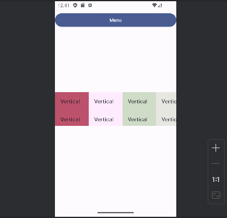

Experimenta con cada uno y ve las diferencias y cómo se aplican a la interfaz.

Por último vamos a añadir una gestura más que aplica más a la creación de componentes personalizados en conjunto con las gesturas. Para ello crea un nuevo archivo en **components** que se llame **Swiping**. Aquí añadiremos lo siguiente:

```kotlin
@OptIn(ExperimentalWearMaterialApi::class)
@Composable
fun SwipeableExample() {
   val width = 200.dp
   val baseAnchor = 50.dp
   val swipeableState = rememberSwipeableState(initialValue = "Fácil")


   val sizePx = with(LocalDensity.current) { baseAnchor.toPx() }


   val anchors =
       mapOf(
           0f to "Fácil",
           sizePx to "Normal",
           sizePx * 2 to "Difícil",
           sizePx * 3 to "Demente"
       )


   Box(
       modifier = Modifier.fillMaxSize(),
       contentAlignment = Alignment.Center
   ) {
       Box(
           modifier = Modifier
               .width(width)
               .swipeable(
                   swipeableState,
                   anchors = anchors,
                   orientation = Orientation.Horizontal,
                   thresholds = { _, _ -> FractionalThreshold(0.5f) }
               )
               .background(Color.LightGray)
       ) {
           Box(
               modifier = Modifier
                   .offset { IntOffset(swipeableState.offset.value.toInt(), 0) }
                   .size(baseAnchor)
                   .background(Color.Cyan))
       }
   }
}
```

Usa el modificador swipeable() para habilitar gestos de swipe entre un conjunto de estados predefinidos. Es decir, el movimiento del contenido de un elemento a lo largo o ancho de sus límites.

```kotlin
<T : Any?> Modifier.swipeable(
    state: SwipeableState<T>,
    anchors: Map<Float, T>,
    orientation: Orientation,
    enabled: Boolean,
    reverseDirection: Boolean,
    interactionSource: MutableInteractionSource?,
    thresholds: (from, to) -> ThresholdConfig,
    resistance: ResistanceConfig?,
    velocityThreshold: Dp
)
```

Ten en cuenta el propósito de los siguientes parámetros a la hora de su invocación:
- state: Estado del modificador de swipe. Contiene el valor actual actual del ancla que ha sido alcanzada por el gesto de swipe. Crearemos y recordaremos el estado con rememberSwipeableState().
- anchors: Mapeado de anclas y estados. Las anclas (en píxeles) actúan como restricciones de desplazamiento con respecto a un estado del tipo T.
- thresholds: (from, to) -> ThresholdConfig: Representa a los umbrales entre diferentes estados.

En el código anterior:

1. Declaramos el ancho de la pista que recorrerá la caja.
2. Definiremos cada límite de aterrizaje en 50dp.
3. Establecemos el estado inicial en el primer indicador "Fácil".
4. Convertimos el espacio de cada límite a píxeles en sizePx.
5. Creamos las anclas usando múltiplos de sizePx.
6. Habilitamos en la caja externa la detección de gestos con swipeable() y los parámetros creados previamente. 7. Usamos la clase FractionalThreshold a fin de especificar la fracción la distancia mínima entre anclas, para permitir el aterrizaje,
7. Aplicamos el modificador offset() en la caja interna para desplazarla a partir del valor que proporciona swipeableState.offset.

El resultado del gesto de swipe creará el siguiente carril con 4 anclas, vamos a añadirlo a la navegación para verlo en funcionamiento:

```kotlin
sealed class Screen {
   data object ClickableScreen : Screen() {
       val route = "clickable_screen"
   }
   data object DraggableScreen : Screen() {
       val route = "draggable_screen"
   }
   data object RotationScreen : Screen() {
       val route = "rotation_screen"
   }
   data object CombinedClickableScreen : Screen() {
       val route = "combined_clickable_screen"
   }
   data object DraggableFullScreen : Screen() {
       val route = "draggable_full_screen"
   }
   data object TransformationScreen : Screen() {
       val route = "transformation_screen"
   }
   data object HorizontalScrollScreen : Screen() {
       val route = "horizontal_scroll_screen"
   }
   data object VerticalScrollScreen : Screen() {
       val route = "vertical_scroll_screen"
   }
   data object ScrollableScreen : Screen() {
       val route = "scrollable_screen"
   }
   data object NestedScrollScreen : Screen() {
       val route = "nested_scroll_screen"
   }
   data object SwipeableScreen : Screen() {
       val route = "swipeable_screen"
   }
}
```

```kotlin
content = {
   NavHost(
       navController = navController,
       startDestination = Screen.ClickableScreen.route
   ) {
       composable(Screen.ClickableScreen.route) {
           ClickableExample() // Your ClickableExample composable
       }
       composable(Screen.DraggableScreen.route) {
           DraggableExample()
       }
       composable(Screen.RotationScreen.route) {
           RotationExample()
       }
       composable(Screen.CombinedClickableScreen.route) {
           CombinedClickableExample()
       }
       composable(Screen.DraggableFullScreen.route) {
           DraggableFullExample()
       }
       composable(Screen.TransformationScreen.route) {
           TransformationExample()
       }
       composable(Screen.HorizontalScrollScreen.route) {
           HorizontalScrollExample()
       }
       composable(Screen.VerticalScrollScreen.route) {
           VerticalScrollExample()
       }
       composable(Screen.ScrollableScreen.route) {
           ScrollableExample()
       }
       composable(Screen.NestedScrollScreen.route) {
           NestedScrollExample()
       }
       composable(Screen.SwipeableScreen.route) {
           SwipeableExample() // Your CombinedClickableExample composable
       }
   }
}
```

```kotlin
val subMenu = listOf(
   Screen.ClickableScreen.route,
   Screen.DraggableScreen.route,
   Screen.RotationScreen.route,
   Screen.CombinedClickableScreen.route,
   Screen.DraggableFullScreen.route,
   Screen.TransformationScreen.route,
   Screen.HorizontalScrollScreen.route,
   Screen.VerticalScrollScreen.route,
   Screen.ScrollableScreen.route,
   Screen.NestedScrollScreen.route,
   Screen.SwipeableScreen.route
)
```

Ahora, ejecuta la aplicación y ve a la nueva vista añadida swipeable.

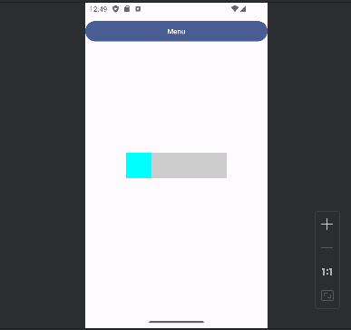

Aquí veremos los 4 estados ancla donde al usar la gestura no se mueve de forma libre, sino que se “estaciona”, en estos estados, esto es el componente de Switch que existe dentro de Android, pero en una forma personalizada y listo para utilizar dentro de nuestra interfaz.


## Conclusión 

A manera de conclusión hemos visto que se puede combinar elementos básicos de la interfaz con textura que vienen por default, pero que haciendo un poco de transformación libre nos permite incorporarlas con otras mismas funcionalidades de interfaz, además de que también podemos crear componentes propios que manejen sus propios estados o valores y llegar al nivel que nosotros queramos.

En conclusión las gesturas son un tema amplio dentro de Android, y no están atadas a una única forma o elemento. Es importante destacar que lo que estamos haciendo es recibir la entrada de un dispositivo, en este caso la pantalla y nuestros dedos, pero regresando a lo básico es lo mismo que hacemos en la computadora utilizando el mouse, curiosamente si trabajaste con el emulador debiste darte cuenta de esta interacción y lo similar que es, tal vez existen algunos casos particulares como el multi-táctil que requieren teclas adicionales, pero al final, no son más que estados de entrada, lo que hacemos con ellos no tienen importancia, lo importante es lo que manipulan y cómo manejan la información o componentes que veremos dentro de nuestra interfaz.

Lo que hemos aprendido:
Basándonos en el código que hemos revisado, podemos destacar 4 opciones clave sobre la implementación de gestos en Android utilizando Jetpack Compose:

1. Gestos Básicos:

- Tocar: Detecta un toque simple en la pantalla. (Ejemplo: Cambiar el color de un cuadrado al tocarlo).
- Arrastrar: Detecta el movimiento del dedo por la pantalla, permitiendo mover objetos o desplazarse por contenido. (Ejemplo: Arrastrar un círculo para moverlo por la pantalla).
- Pellizcar: Detecta el acercamiento o alejamiento de dos dedos en la pantalla, permitiendo hacer zoom en una imagen o elemento. (Ejemplo: Pellizcar para agrandar o disminuir el texto).

2. Gestos Combinados:

- Se pueden combinar varios gestos básicos para lograr funcionalidades más complejas.
- El código permite detectar toques dobles, pulsaciones largas y combinaciones de estos con el gesto "clic" para ejecutar diferentes acciones. (Ejemplo: Un doble toque podría ampliar una imagen a pantalla completa).

3. Gestos con Transformación:

- Jetpack Compose permite aplicar transformaciones como rotación, escala y desplazamiento a elementos de la interfaz de usuario.
- Se pueden combinar gestos multi-táctiles con estas transformaciones para permitir al usuario manipular objetos en la pantalla de forma intuitiva. (Ejemplo: Rotar una imagen con dos dedos o escalarla pellizcando).

4. Gestos con Desplazamiento:


- Se pueden implementar scroll horizontal y vertical para permitir que el usuario se desplace por contenido que no cabe en la pantalla.
- El código permite detectar el desplazamiento del dedo y actualizar la posición del contenido en consecuencia. (Ejemplo: Desplazarse por una lista de elementos o navegar por un mapa).

Ampliando la funcionalidad:

1. Gestos personalizados:
- Crear gestos personalizados para interactuar con elementos específicos de la aplicación.
- Utilizar detectores de gestos para identificar patrones específicos de movimiento del dedo.
- Implementar retroalimentación háptica para proporcionar una respuesta táctil al usuario.
2. Gestos con animación:
- Animar los elementos de la interfaz de usuario en respuesta a los gestos del usuario.
- Utilizar transiciones animadas para crear una experiencia fluida e intuitiva.
- Implementar efectos de rebote y fricción para simular el comportamiento físico de los objetos.
3. Gestos con reconocimiento de voz:
- Combinar gestos con comandos de voz para crear una interfaz de usuario multi-modal.
- Permitir al usuario controlar la aplicación mediante gestos y comandos de voz simultáneamente.
- Implementar reconocimiento de voz continuo para escuchar comandos en tiempo real.
4. Gestos con reconocimiento de objetos:
- Utilizar la cámara del dispositivo para reconocer objetos en la pantalla y asociarlos con gestos específicos.
- Permitir al usuario interactuar con objetos físicos del mundo real mediante gestos en la pantalla.
- Implementar realidad aumentada para superponer objetos virtuales sobre el mundo real.
5. Gestos con accesibilidad:
- Diseñar gestos que sean accesibles para usuarios con diferentes habilidades.
- Proporcionar alternativas a los gestos para usuarios que no puedan utilizarlos.
- Implementar atajos de teclado para navegar por la aplicación sin utilizar gestos.
6. Gestos con aprendizaje automático:
- Utilizar el aprendizaje automático para predecir las intenciones del usuario a partir de sus gestos.
- Adaptar la interfaz de usuario en función de los patrones de interacción del usuario.
- Implementar sugerencias contextuales basadas en los gestos del usuario.
7. Gestos con realidad virtual:
- Utilizar gestos para controlar la interacción en entornos de realidad virtual.
- Permitir al usuario manipular objetos virtuales en el espacio 3D.
- Implementar tele-presencia para que los usuarios interactúen entre sí en entornos virtuales.
8. Gestos con realidad aumentada:
- Utilizar gestos para interactuar con objetos virtuales superpuestos sobre el mundo real.
- Permitir al usuario manipular objetos virtuales en su entorno físico.
- Implementar experiencias de aprendizaje interactivas utilizando realidad aumentada y gestos.
9. Gestos con juegos:
- Utilizar gestos para controlar personajes y objetos en juegos móviles.
- Implementar mini-juegos basados en gestos para mejorar la interacción del usuario.
- Utilizar gestos para crear experiencias de juego más inmersivas y atractivas.
10. Gestos con aplicaciones empresariales:
- Utilizar gestos para navegar por aplicaciones empresariales de forma eficiente.
- Implementar atajos de gestos para realizar acciones comunes rápidamente.
- Utilizar gestos para manipular datos y gráficos en aplicaciones empresariales.

**Recuerda**: Esta lista solo es un punto de partida para explorar las posibilidades de ampliar la funcionalidad de los gestos en Android. La creatividad y la innovación son claves para crear aplicaciones que sean intuitivas, atractivas y accesibles para todos los usuarios.
