# 2 - UI con Jetpack Compose

## Objetivo

En este laboratorio aprenderemos la estructura básica de una aplicación iniciando con la UI.

Para este laboratorio vamos a desarrollar un Pokedex, que es una unidad de información para el mundo Pokemon. Esta aplicación nos mostrara los datos de cada criatura y desde ahí podremos generar un detalle.

Esta aplicación utiliza el concepto básico de actividades e irá evolucionando hasta que incorporemos la arquitectura en el mismo.

Así mismo utilizaremos el nuevo modelo de interfaz propuesto por Google que es Jetpack Compose, a diferencia de su predecesor que utilizaba archivos XML, Compose nos permite tener un control más exhaustivo de lo que pasa en pantalla añadiendo nuevos retos y formas de experimentar el desarrollo en Android.

## Instrucciones

Sigue los pasos descritos en la siguiente práctica, si tienes algún problema no olvides que tus profesores están para apoyarte.

## Laboratorio
### Paso 1 Creación del Proyecto

#### Estructura del laboratorio
Antes de comenzar con la programación y con Android Studio vamos a revisar algunos puntos importantes que debes entender.

Veamos la estructura que construiremos en este laboratorio.

```
app/
└── presentation/
    ├── MainActivity.kt
    ├── navigation/
    │   └── NavGraph.kt
    ├── screens/
    │   ├── home/
    │   │   ├── HomeScreen.kt
    │   │   └── components/
    │   │       ├── PokemonCard.kt
    │   │       ├── PokemonListTab.kt
    │   │       └── SearchTab.kt
    │   └── detail/
    │       └── PokemonDetailScreen.kt
    └── theme/
        ├── Color.kt
        ├── Theme.kt
        └── Type.kt
```

También te comparto el diagrama de paquetes:

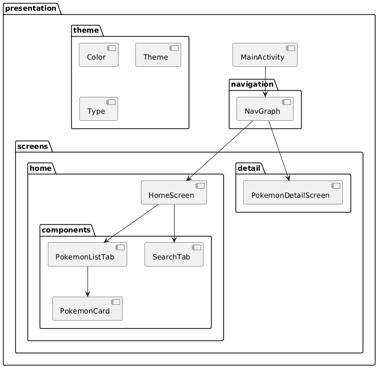

````
@startuml
package "presentation" {
    package "navigation" {
        [NavGraph]
    }
    
    package "screens" {
        package "home" {
            [HomeScreen]
            package "components" {
                [PokemonCard]
                [PokemonListTab]
                [SearchTab]
            }
        }
        
        package "detail" {
            [PokemonDetailScreen]
        }
    }
    
    package "theme" {
        [Color]
        [Theme]
        [Type]
    }
    
    [MainActivity]
}

MainActivity --> NavGraph
NavGraph --> HomeScreen
NavGraph --> PokemonDetailScreen
HomeScreen --> PokemonListTab
HomeScreen --> SearchTab
PokemonListTab --> PokemonCard
@enduml
````

El diagrama de flujo:

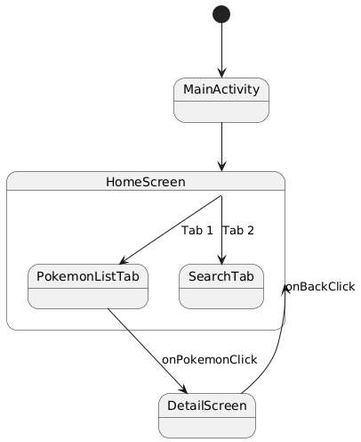

````
@startuml
state "MainActivity" as main
state "HomeScreen" as home {
    state "PokemonListTab" as list
    state "SearchTab" as search
}
state "DetailScreen" as detail

[*] --> main
main --> home
list --> detail : onPokemonClick
detail --> home : onBackClick
home --> list : Tab 1
home --> search : Tab 2
@enduml
````

El diagrama de los composables:

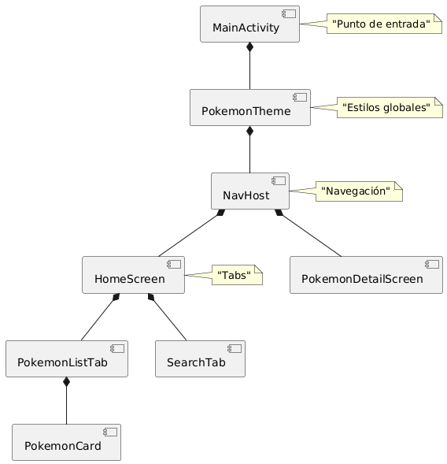

````
@startuml
component MainActivity
component PokemonTheme
component NavHost
component HomeScreen
component PokemonDetailScreen
component PokemonListTab
component SearchTab
component PokemonCard

MainActivity *-- PokemonTheme
PokemonTheme *-- NavHost
NavHost *-- HomeScreen
NavHost *-- PokemonDetailScreen
HomeScreen *-- PokemonListTab
HomeScreen *-- SearchTab
PokemonListTab *-- PokemonCard

note right of MainActivity : "Punto de entrada"
note right of PokemonTheme : "Estilos globales"
note right of NavHost : "Navegación"
note right of HomeScreen : "Tabs"
@enduml
````

El diagrama de secuencia de uno de los casos:

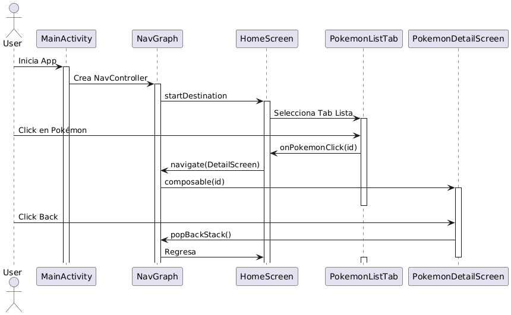
````
@startuml
actor User
participant MainActivity
participant NavGraph
participant HomeScreen
participant PokemonListTab
participant PokemonDetailScreen

User -> MainActivity: Inicia App
activate MainActivity

MainActivity -> NavGraph: Crea NavController
activate NavGraph

NavGraph -> HomeScreen: startDestination
activate HomeScreen

HomeScreen -> PokemonListTab: Selecciona Tab Lista
activate PokemonListTab

User -> PokemonListTab: Click en Pokémon
PokemonListTab -> HomeScreen: onPokemonClick(id)
HomeScreen -> NavGraph: navigate(DetailScreen)

NavGraph -> PokemonDetailScreen: composable(id)
activate PokemonDetailScreen
deactivate PokemonListTab

User -> PokemonDetailScreen: Click Back
PokemonDetailScreen -> NavGraph: popBackStack()

NavGraph -> HomeScreen: Regresa
deactivate PokemonDetailScreen
activate PokemonListTab

@enduml
````

En este nos laboratorio nos enfocaremos enteramente al uso de Compose. Verás que no solo hablamos de la creación de la interfaz básica, sino también del estilizado y la navegación del proyecto.

Esta estructura se centra en:

1. Organización por características (screens)
2. Separación de componentes reutilizables
3. Temas y estilos centralizados
4. Navegación independiente
5. Componentes UI modulares

Cada carpeta tiene un propósito específico y sigue las convenciones de nombres de Compose.

#### Jetpack Compose

Jetpack Compose es el toolkit moderno de Android para construir interfaces de usuario nativas. A diferencia del enfoque tradicional basado en XML (vistas y layouts), Compose utiliza un enfoque declarativo donde la UI se describe usando funciones de Kotlin.
Las principales ventajas de Compose son:

1. Código más simple y conciso
    - Menos código boilerplate
    - UI y lógica en el mismo lenguaje (Kotlin)
    - Sintaxis más intuitiva


2. Desarrollo más rápido
    - Preview en tiempo real
    - Hot Reload
    - Menos archivos para mantener


3. Mejor rendimiento
    - Actualización eficiente de la UI
    - Menos riesgo de memory leaks
    - Optimización automática


4. Interoperabilidad
    - Funciona con vistas existentes
    - Compatible con arquitecturas actuales
    - Integración con otros componentes de Jetpack

En Compose, la UI se construye a través de composables, que son funciones anotadas con @Composable que pueden emitir uno o más elementos de la UI. Estas funciones pueden componerse entre sí para crear interfaces complejas de manera modular y reutilizable.

Algo importante a mencionar es que si bien Compose trata de mantener un sistema de estilos parecido a CSS en donde se crean clases comunes que se derivan conforme avanza el proyecto también tenemos el uso de la carpeta **res** del proyecto la cual podemos igualmente usar para definir valores comunes como colores, tamaños y estilos.

Al día de hoy no existe una respuesta correcta en cual es bueno o si uno es mejor que otro, utiliza el que se te haga más sencillo y siempre investiga más allá para no quedarte solo con lo que veremos en estos laboratorios.

#### Usando Android Studio

Dejemos la teoría para más tarde y comencemos con Android Studio.

A este momento ya debes haber instalado la versión más reciente del IDE de desarrollo de Android, existen algunas alternativas a usar pero por facilidad del curso nos enfocaremos en este.

Vamos a empezar creando un proyecto desde 0, por lo que vamos a abrir Android Studio y vamos a realizar las siguientes configuraciones.

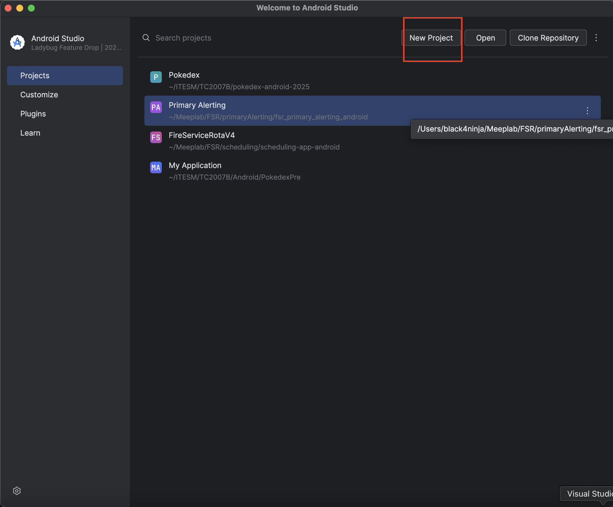

Después vamos a seleccionar un proyecto en blanco o el que dice **empty activity**.

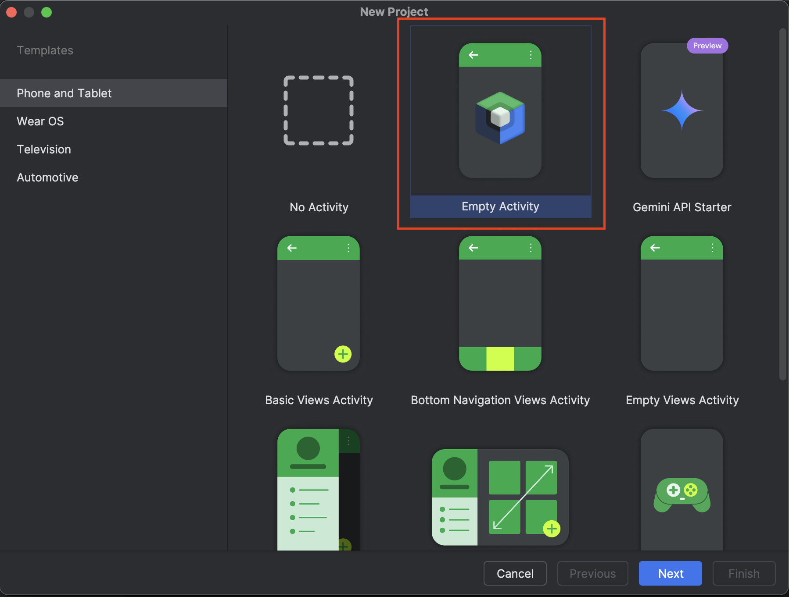

Los siguientes parámetros los añadiremos de la siguiente forma:

```
Name: PokedexApp
Package Name: com.app.pokedexapp
Save Location: {Tu eliges en donde}
Minimum SDK: API 24: Android 7.0 (Nougat)
```

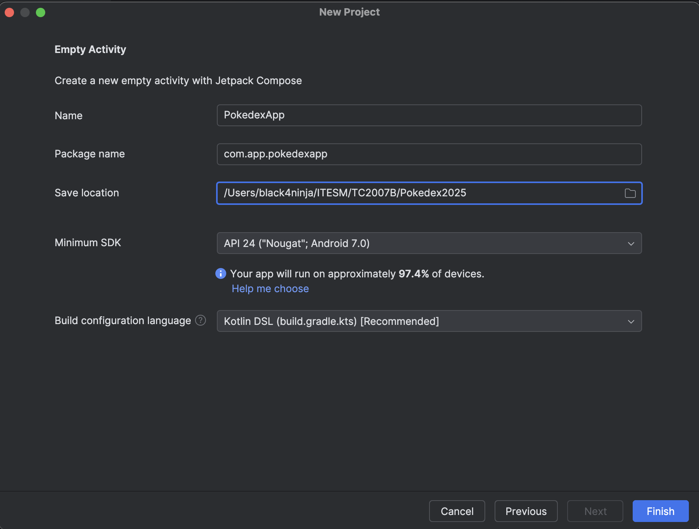

Con esta configuración base damos clic en **Finish** y dejamos que el proyecto empiece a crearse.

Para este punto del curso ya debes tener listo tu Android Studio configurado y un dispositivo o emulador corriendo para poder avanzar. En cualquier caso si necesitas configurar todavía algo no olvides revisar la sección de materiales del repositorio para ayudarte a terminar con estos pasos.

Una vez que haya finalizado de configurarse deberemos ver algo como lo siguiente:

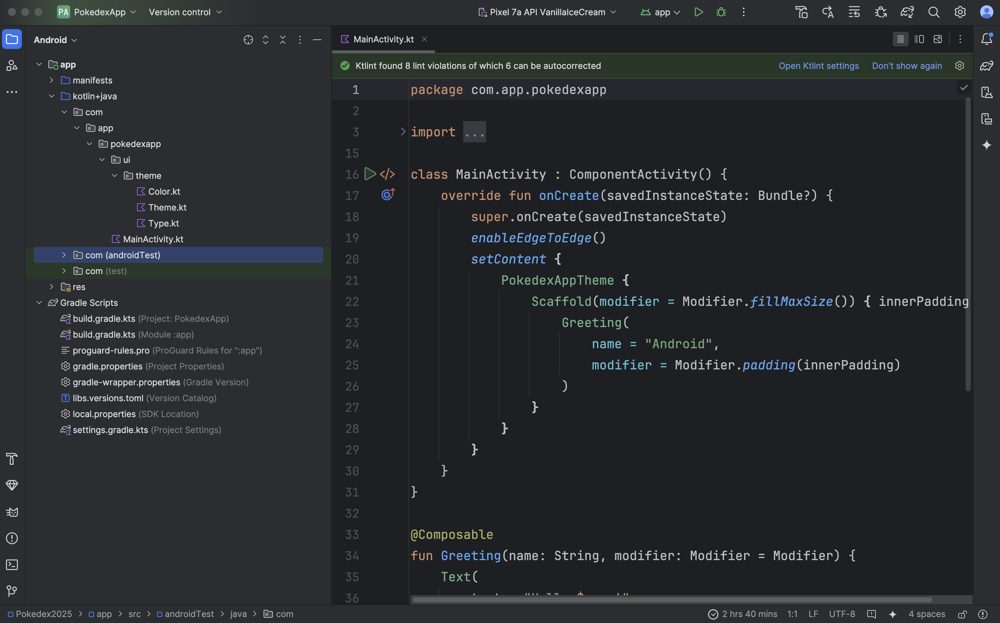

Para esta ocasión vamos a notar lo siguiente de nuestra estructura de proyecto.

1. El Manifest esta creado sin mayor inconveniente esperando a que añadamos vistas.
2. El package principal del proyecto contendrá un MainActivity, visto de otra forma es un Hello World que nos permite desarrollar más rápido nuestra base de proyecto..
3. La carpeta **res** que podremos utilizar para manejar los recursos y assets de nuestro proyecto.
4. En la sección de **Gradle Scripts** contaremos con nuestros archivos **build.gradle** del proyecto.
	1. El primer **build.gradle** corresponde a la configuración de todo el proyecto.
	2. El segundo **build.gradle** corresponde a la configuración de la aplicación.
    3. El archivo **libs.versions.toml** que contendrá las librerías que utilizaremos para este proyecto.

**Nota: Si te estás preguntando cual es la diferencia entre la configuración del proyecto y la aplicación, es que android utiliza un desarrollo por módulos, esto permite añadir las librerías de terceros o incluso que nuestro proyecto sea una librería, en esencia significa que tu proyecto puede ser incluido de manera directa a otros proyectos para el uso de sus clases. Esto da un potencial muy interesante en Android que revisaremos más adelante en el curso.**

### Paso 2 Configuración del Proyecto

Para este paso vamos a proceder a abrir el segundo archivo **build.gradle** o en este caso el que esta marcado como module del proyecto.

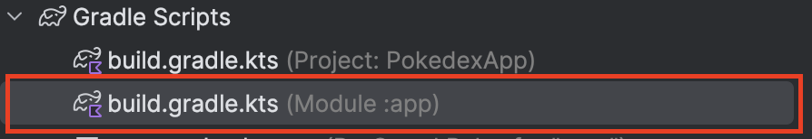

Si llegar a hacerte bolas en cual de los 2 es cual, recuerda que el del Proyecto contiene la configuración base, y el segundo contiene las dependencias o librerías que usaremos en el proyecto.

Con esto dicho vamos a navegar dentro del archivo hasta la sección de hasta abajo justo a la parte **dependencies**.

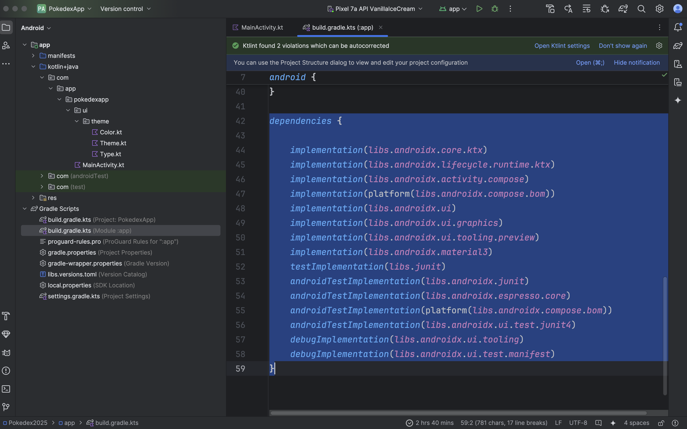

En esta sección de **dependencies** verás que ya tenemos agregadas varias librerías por default, esto puede variar de cada versión de Android Studio tanto en número como las librerías pero nota lo que vimos en la clase anterior con las formas de declarar las librerías.

- **implementation** - Es la directiva para usar una librería en nuestro proyecto.
- **testImplementation** - Es la directiva para usarlo en el package de pruebas básicas del proyecto.
- **androidTestImplementation** - Es la directiva para usarlo en el package de pruebas de instrumentación del proyecto.

Lo que vamos a hacer ahora es añadir las librerías que necesitamos para este proyecto.

**Nota: En versiones previas de Android Studio y de gradle usábamos una sintaxis para las librerías en formato de String, para las nuevas versiones de Android, ahora va de la mano con el archivo libs.versions.toml, en caso de que encuentres una librería en el formato anterior no te preocupes pega tal cual la encuentres en el gradle y Android Studio la podrá convertir automáticamente en el formato nuevo.**

#### Hilt

Usaremos una librería para aplicar el concepto de inyección de dependencias en nuestra aplicación. Este concepto quizás te sea nuevo, pero nos ayuda a eliminar mucha inicialización de código innecesario. Veamos un poco de que va.

La Inyección de Dependencias (DI) es un **patrón de diseño** donde las dependencias de una clase son "inyectadas" desde el exterior en lugar de ser creadas dentro de la clase.

Imagina una clase PokemonRepository que necesita un servicio de API:

```
// Sin Inyección de Dependencias
class PokemonRepository {
    // La clase crea su propia dependencia
    private val api = PokemonApi() 
    
    fun getPokemon() {
        api.getPokemonList()
    }
}
```

```
// Con Inyección de Dependencias
class PokemonRepository(
    private val api: PokemonApi // La dependencia se inyecta
) {
    fun getPokemon() {
        api.getPokemonList()
    }
}
```

Hilt es una biblioteca que facilita la implementación de DI en Android. En lugar de crear y manejar dependencias manualmente, Hilt lo hace por nosotros:

```
// Configuración con Hilt
@HiltAndroidApp
class PokemonApplication : Application()

@AndroidEntryPoint
class MainActivity : ComponentActivity()

@HiltViewModel
class PokemonViewModel @Inject constructor(
    private val repository: PokemonRepository
) : ViewModel()

@Singleton
class PokemonRepository @Inject constructor(
    private val api: PokemonApi
) 

// Módulo que le dice a Hilt cómo crear las dependencias
@Module
@InstallIn(SingletonComponent::class)
object AppModule {
    @Provides
    @Singleton
    fun providePokemonApi(): PokemonApi {
        return Retrofit.Builder()
            .baseUrl("https://pokeapi.co/api/v2/")
            .build()
            .create(PokemonApi::class.java)
    }
}
```

Dicho lo anterior, dentro de los **dependencies** vamos a agregar lo siguiente:

```
//Hilt
implementation(libs.hilt.android)
kapt(libs.hilt.compiler)
implementation(libs.androidx.hilt.navigation.compose)
```
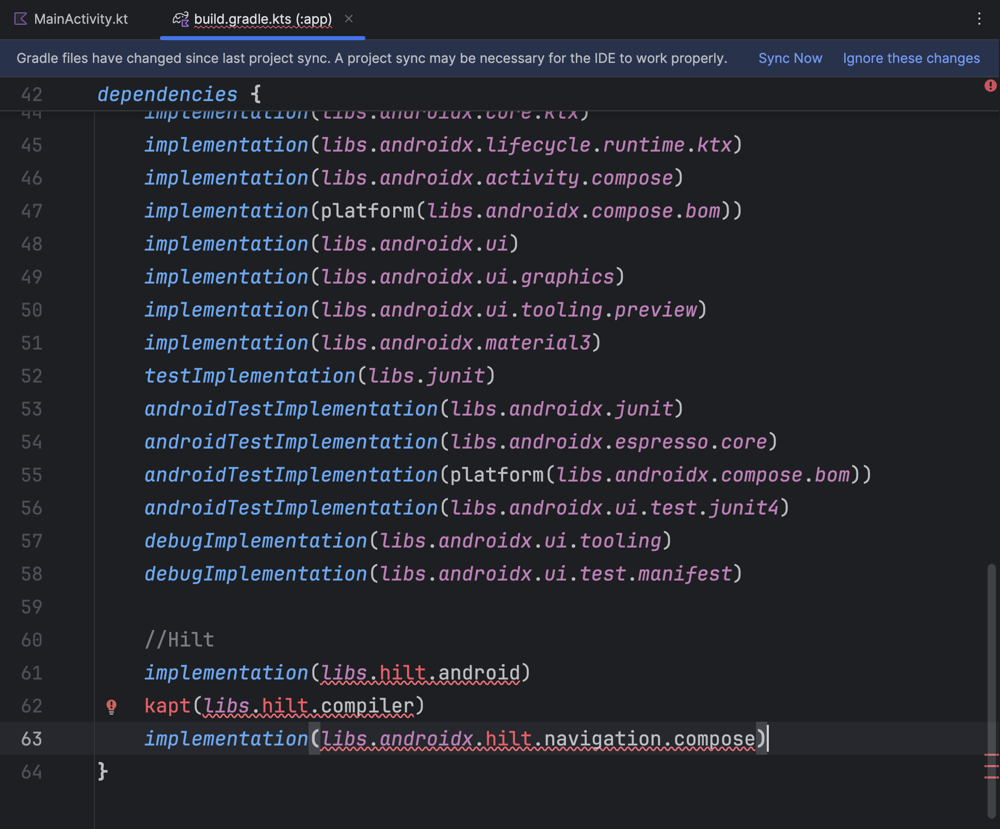


Ahora bien, observa que estamos usando algo que no te mencioné que es el **kapt**.

KAPT (Kotlin Annotation Processing Tool) es el procesador de anotaciones para Kotlin.

Cuando usamos Hilt, este genera código en tiempo de compilación basándose en las anotaciones que usamos (como @HiltAndroidApp, @AndroidEntryPoint, @Inject). 

KAPT es necesario para que este proceso de generación de código funcione con Kotlin.
En la versión anterior de build.gradle.kts se ve así:

```
plugins {
    id("kotlin-kapt")  // Procesador de anotaciones
    id("com.google.dagger.hilt.android")  // Plugin de Hilt
}

dependencies {
    implementation("com.google.dagger:hilt-android:2.48")
    kapt("com.google.dagger:hilt-android-compiler:2.48")  // Generador de código
}
```
Beneficios:
    - Facilita el testing al poder reemplazar dependencias
    - Mejor mantenibilidad del código
    - Reutilización de dependencias
    - Manejo del ciclo de vida de los objetos
    - Menos código boilerplate

Aquí observa como cambia la declaración de dependencias de la forma antigua a la actual donde usamos algo parecido a variables:

```
//Hilt
implementation(libs.hilt.android)
kapt(libs.hilt.compiler)
implementation(libs.androidx.hilt.navigation.compose)
```

Adicionalmente observa que en la sección de plugins del build.gradle debemos agregar

````
plugins {
    alias(libs.plugins.android.application)
    alias(libs.plugins.kotlin.android)
    alias(libs.plugins.kotlin.compose)
    kotlin("kapt")
    alias(libs.plugins.hilt)
}
````

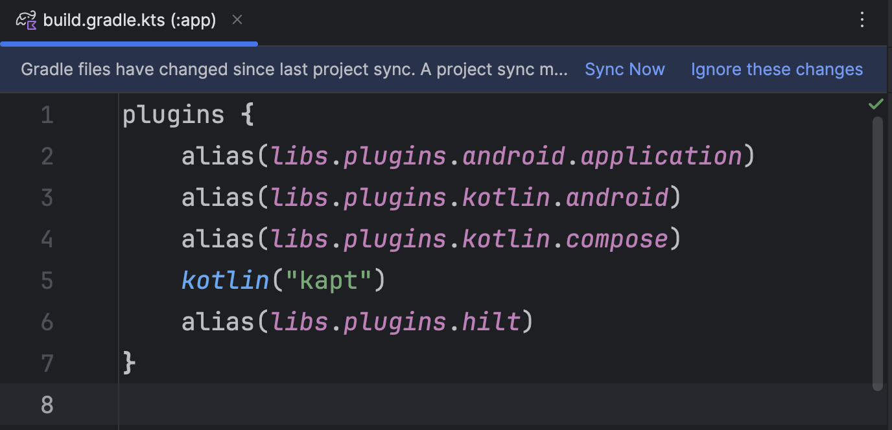

Por último vamos a abrir el otro **build.gradle**, el del proyecto y verás que este solo contiene una sección de **plugins**, añade lo siguiente:

```
alias(libs.plugins.hilt) apply false
```

Te debería quedar algo como lo siguiente:

```
// Top-level build file where you can add configuration options common to all sub-projects/modules.
plugins {
    alias(libs.plugins.android.application) apply false
    alias(libs.plugins.kotlin.android) apply false
    alias(libs.plugins.kotlin.compose) apply false
    alias(libs.plugins.hilt) apply false
}
```

Ahora, ya que tenemos nuestros plugins y nuestras dependencias agregadas de hilt, verás que están en rojo, y esto está bien ya que aún no hemos agregado las librerías tal cual, solo hemos creado las referencias de donde las vamos a sacar.

De momento nos vamos a saltar la configuración del **libs.versions.toml** y pasaremos a la siguiente librería.

#### Retrofit

Esta librería es una de las más comunes en el mundo de Android para hacer conexiones con APIS y HTTP, es de las más ampliamente documentadas en tutoriales por lo que es la que recomiendo que utilices para el proyecto.

**Nota: Puedes hacer el uso de cualquier librería pero recuerda que es una mala práctica hacer conexiones a las Bases de Datos de manera directa, para ello se recomienda el uso de APIs para trabajar en ello o el uso de capas diferentes para acceso a la información.**

Dicho lo anterior, dentro de los **dependencies** vamos a agregar lo siguiente:

```
//Retrofit
implementation(libs.retrofit)
implementation(libs.converter.gson)
```

La primera es la librería de retrofit, la segunda es una herramienta para manejo de JSON que va muy de la mano con Retrofit y es que si has trabajado con API REST sabrás que los valores devueltos son en formato JSON.

Cuando trabajamos en el mundo móvil, es muy raro utilizar directamente el formato JSON pues puede llevar a errores en tiempo real, por lo que hacemos una transformación automática del resultado en objetos y clases que contienen las propiedades del JSON.

```
// JSON recibido de la API
{
    "id": 1,
    "name": "bulbasaur",
    "sprites": {
        "front_default": "https://raw.githubusercontent.com/PokeAPI/sprites/master/sprites/pokemon/1.png"
    },
    "types": [
        {
            "type": {
                "name": "grass"
            }
        }
    ]
}
```

```
// Clase de Kotlin para mapear el JSON
data class PokemonDto(
    @SerializedName("id") val id: Int,
    @SerializedName("name") val name: String,
    @SerializedName("sprites") val sprites: SpritesDto,
    @SerializedName("types") val types: List<TypeDto>
) {
    data class SpritesDto(
        @SerializedName("front_default") val frontDefault: String
    )
    
    data class TypeDto(
        @SerializedName("type") val type: TypeInfoDto
    ) {
        data class TypeInfoDto(
            @SerializedName("name") val name: String
        )
    }
}

// Uso de Gson
val json = // JSON de la API
val pokemon: PokemonDto = Gson().fromJson(json, PokemonDto::class.java)

// Ahora podemos acceder a las propiedades
println(pokemon.name) // "bulbasaur"
println(pokemon.sprites.frontDefault) // URL de la imagen
println(pokemon.types[0].type.name) // "grass"
```

#### Coil

Coil es una librería para la carga de imágenes de manera asíncrona, a diferencia de HTML, que con solo utilizar la etiqueta **img** podemos pasar una url, en Android tenemos el componente **Image** pero este solo carga recursos locales, es decir archivos ya cargados en la app, Coil, nos permite añadir el componente **AsyncImage**, el cual sí nos permite usar una url para cargar una imágen.

````
//Coil
implementation(libs.coil.compose)
````

#### Actualizando las librerías con libs.versions.toml

De momento serán las únicas librerías que añadiremos al proyecto.

Ahora veremos el archivo pendiente, **libs.versions.toml**, este archivo contendrá las referencias de las librerías separadas por 3 categorías:

- versions: Contiene los números de versión de cada librería.
- libraries: El nombre de la librería
- plugins: Dependiendo de las librerías que usemos en ocasiones se nos pedirá agregar algún plugin como en el caso de hilt, por ahora no me meteré en mucho detalle, solo considera que si la librería lo solicita deberás agregarlo y probablemente no sea solo una dependencia, sino que también deberás agregar algo en la sección de **plugins** de ambos **build.gradle** según sea el caso.

Por último abre el archivo **libs.versions.toml** y copia lo siguiente:

```
[versions]
agp = "8.8.0"
coilCompose = "2.3.0"
converterGson = "2.11.0"
kotlin = "2.0.0"
coreKtx = "1.15.0"
hilt = "2.52"
junit = "4.13.2"
junitVersion = "1.2.1"
espressoCore = "3.6.1"
lifecycleRuntimeKtx = "2.8.7"
activityCompose = "1.10.0"
composeBom = "2025.01.00"
navigationRuntimeKtx = "2.8.5"
navigationCompose = "2.8.5"
hilt-navigation = "1.2.0"
retrofit = "2.11.0"

[libraries]
androidx-core-ktx = { group = "androidx.core", name = "core-ktx", version.ref = "coreKtx" }
coil-compose = { module = "io.coil-kt:coil-compose", version.ref = "coilCompose" }
converter-gson = { module = "com.squareup.retrofit2:converter-gson", version.ref = "converterGson" }
junit = { group = "junit", name = "junit", version.ref = "junit" }
androidx-junit = { group = "androidx.test.ext", name = "junit", version.ref = "junitVersion" }
androidx-espresso-core = { group = "androidx.test.espresso", name = "espresso-core", version.ref = "espressoCore" }
androidx-lifecycle-runtime-ktx = { group = "androidx.lifecycle", name = "lifecycle-runtime-ktx", version.ref = "lifecycleRuntimeKtx" }
androidx-activity-compose = { group = "androidx.activity", name = "activity-compose", version.ref = "activityCompose" }
androidx-compose-bom = { group = "androidx.compose", name = "compose-bom", version.ref = "composeBom" }
androidx-ui = { group = "androidx.compose.ui", name = "ui" }
androidx-ui-graphics = { group = "androidx.compose.ui", name = "ui-graphics" }
androidx-ui-tooling = { group = "androidx.compose.ui", name = "ui-tooling" }
androidx-ui-tooling-preview = { group = "androidx.compose.ui", name = "ui-tooling-preview" }
androidx-ui-test-manifest = { group = "androidx.compose.ui", name = "ui-test-manifest" }
androidx-ui-test-junit4 = { group = "androidx.compose.ui", name = "ui-test-junit4" }
androidx-material3 = { group = "androidx.compose.material3", name = "material3" }
androidx-hilt-navigation-compose = { module = "androidx.hilt:hilt-navigation-compose", version.ref = "hilt-navigation" }
androidx-navigation-runtime-ktx = { group = "androidx.navigation", name = "navigation-runtime-ktx", version.ref = "navigationRuntimeKtx" }
androidx-navigation-compose = { group = "androidx.navigation", name = "navigation-compose", version.ref = "navigationCompose" }
hilt-android = { group = "com.google.dagger", name = "hilt-android", version.ref = "hilt" }
hilt-compiler = { group = "com.google.dagger", name = "hilt-android-compiler", version.ref = "hilt" }
retrofit = { module = "com.squareup.retrofit2:retrofit", version.ref = "retrofit" }

[plugins]
android-application = { id = "com.android.application", version.ref = "agp" }
kotlin-android = { id = "org.jetbrains.kotlin.android", version.ref = "kotlin" }
kotlin-compose = { id = "org.jetbrains.kotlin.plugin.compose", version.ref = "kotlin" }
hilt = { id = "com.google.dagger.hilt.android", version.ref = "hilt" }
```

**Nota: Este último paso idealmente no se debe realizar de esta manera, por lo general debes conocer las librerías que agregas al proyecto pues cambiar este archivo de 1 solo golpe puede llevar a errores al momento de sincronizar gradle, como vamos empezando y no hemos realizado muchos cambios no deberíamos tener problemas.**

Por último vamos a sincronizar gradle dando clic en la parte superior del archivo o en su defecto en el botón del elefante que viene en la parte superior.

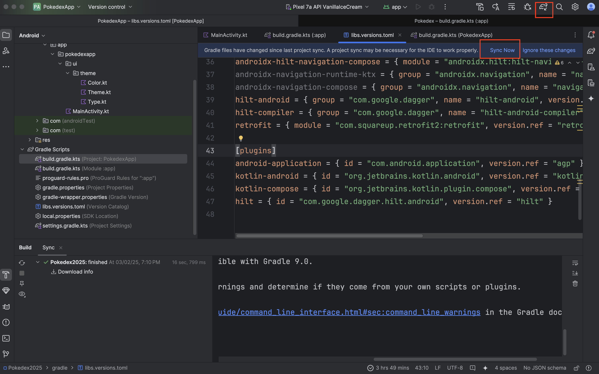

**Nota: Error de novato No 1 - no darle clic al botón de sincronizar va a provocar que no carguen las clases en gradle o en tu proyecto**

### Paso 3 Ktlint

Este paso no es necesario para nuestro laboratorio en sí, pero te ayudará a tener un código más ordenado.

Primero hablemos de que es un linter. Un linter es una herramienta que analiza el código fuente para encontrar problemas de programación, errores de estilo, y construcciones sospechosas.

ktlint es un linter específico para Kotlin que:

1. Verifica el formato del código según las convenciones oficiales de Kotlin
2. Puede corregir automáticamente problemas de estilo
3. Asegura consistencia en el código del equipo

Ejemplos de lo que revisa ktlint:

```
// Incorrecto - ktlint marcará esto
fun suma (a:Int,b:Int):Int{
    return a+b
}

// Correcto - después de ktlint
fun suma(a: Int, b: Int): Int {
    return a + b
}
```

```
// Incorrecto - imports desordenados
import kotlin.Int
import android.os.Bundle
import androidx.compose.ui.Modifier

// Correcto - ktlint los ordenará
import android.os.Bundle
import androidx.compose.ui.Modifier
import kotlin.Int
```

Beneficios:

- Mantiene el código limpio y consistente
- Reduce discusiones sobre estilo en revisiones de código
- Ayuda a desarrolladores nuevos a seguir convenciones
- Detecta problemas potenciales temprano

Vamos a instalar para tu configuración general ktlint como plugin de Android Studio, pero te recomiendo que también entres a su [página oficial](https://pinterest.github.io/ktlint/1.5.0/) y lo descargues.

Una vez instalado podrás ejecutarlo en consola como: 

```
ktlint --format
```

La desventaja de esto es que estará ejecutando el código cada vez, y es por eso que usaremos el plugin ya que nos permitirá activar el formato de manera automática para no estar preocupándonos por esto.

**Nota: La configuración del linter es algo que debes hacer al momento de crear un nuevo proyecto ya que de lo contrario se empezarán a cargar conflictos y cuando trabajes en equipo verás muchos conflictos y merges derivado de esto.**

En android Studio ve a la opción de **settings**.

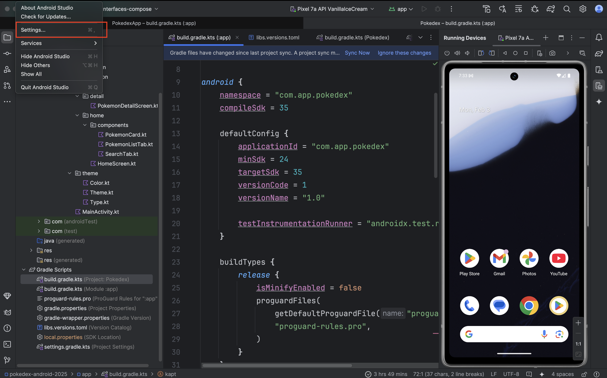

Ahora seleccionaremos el menú de plugins

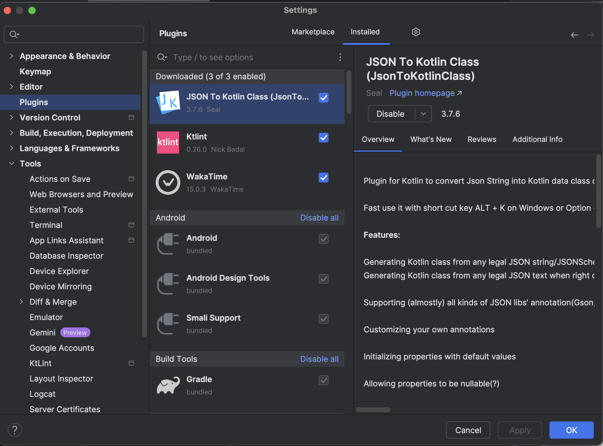

En mi caso como puedes ver ya lo tengo instalado, pero vamos a que veas donde encontrarlo, en la parte superior verás la opción de **Marketplace**, selecciónala y busca Ktlint.

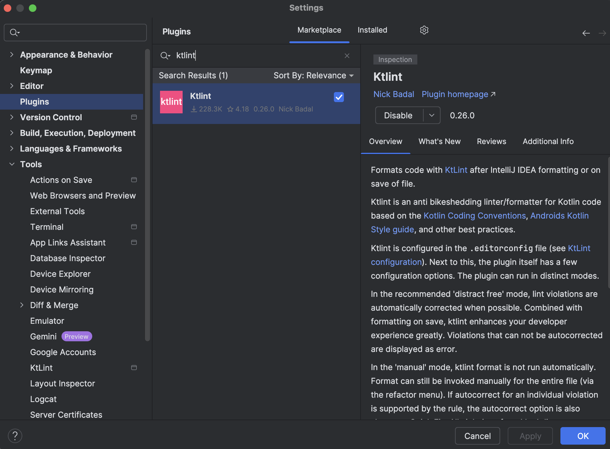

Ahora da clic en instalar para que se termine la configuración, por último puede ser que te pida reiniciar Android Studio.

Ahora verás que si vuelves a abrir la opción de **settings** de Android Studio, en la opción **Tools** aparecerá la de **Ktlint**, selecciónala.

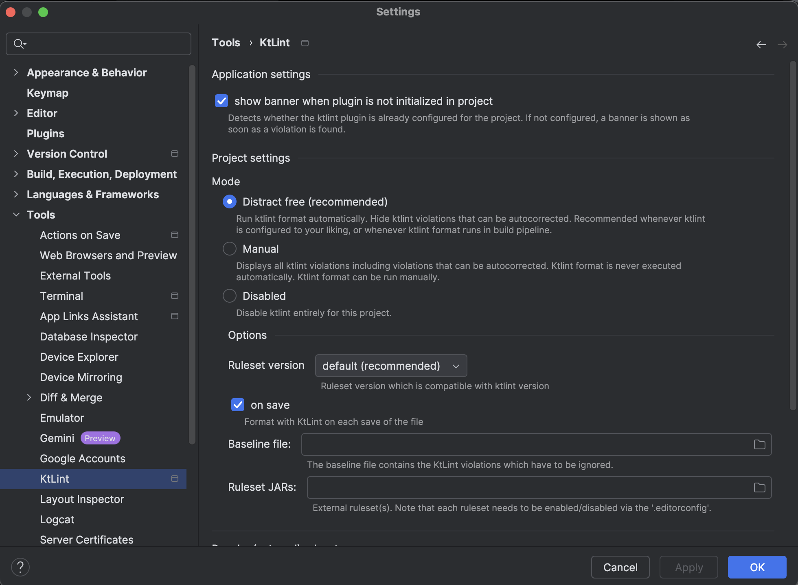

Aquí lo único que nos interesa es activar la opción **Distract Free**, que en otras palabras es el modo automático, para que Android Studio se encargue de todo lo relacionado al linter.

De todas maneras realiza la instalación desde la página que te comente para que puedas ejecutar el comando desde tu proyecto, como si estuvieras en la raíz de tu repositorio.

```
ktlint --format
```

En ocasiones el plugin de Android Studio no hace los cambios, es una buena práctica ejecutar el comando antes de cualquier commit a tu repositorio, igualmente puedes automatizar esta parte con un pre-commit o una vez subiendo al repositorio con una prueba de linter de github actions. Estos 2 últimos no los cubriremos aquí pero son una forma para evitar hacer todo este proceso de manera manual para todo el equipo.

### Paso 4 Creando la navegación básica

Como ya te mencioné al inicio del laboratorio, vamos a enfocarnos en crear la estructura básica del proyecto de la siguiente manera:

```
app/
└── presentation/
    ├── MainActivity.kt
    ├── navigation/
    │   └── NavGraph.kt
    ├── screens/
    │   ├── home/
    │   │   ├── HomeScreen.kt
    │   │   └── components/
    │   │       ├── PokemonCard.kt
    │   │       ├── PokemonListTab.kt
    │   │       └── SearchTab.kt
    │   └── detail/
    │       └── PokemonDetailScreen.kt
    └── theme/
        ├── Color.kt
        ├── Theme.kt
        └── Type.kt
```

Afortunadamente ya contamos con varios archivos en nuestra estructura de proyecto. Un MainActivity y el paquete de **theme**, en android, java y kotlin cuando hablamos de las carpetas que contienen el código nos referimos a los paquetes o **packages**.

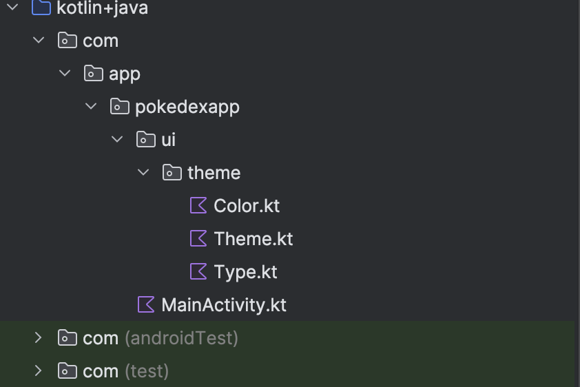

Ahora antes de avanzar más, observa como me aparecen los paquetes separados, es probable que a ti te aparezcan de otra forma, esto al momento de agregar nuevos puede generar problemas.

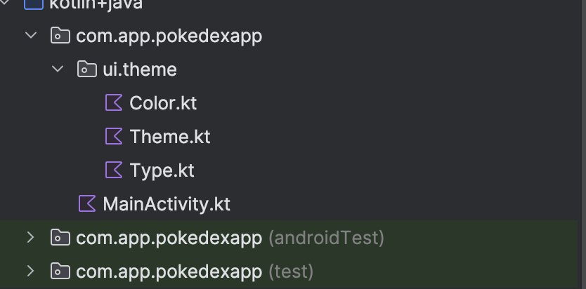

Esta es la otra forma que puede aparecerte, si quieres o necesitas cambiar entre una forma u otra deberás hacer lo siguiente.

Selecciona las opciones en la parte superior derecha de la estructura del proyecto.

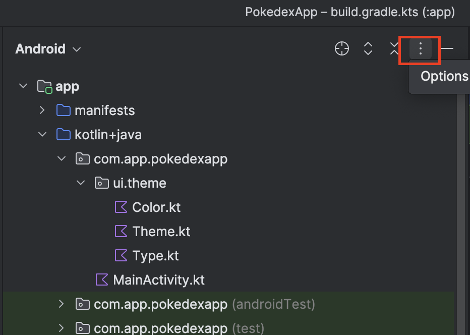

Y ahora selecciona la opción **appearance** y por último cambia la selección de **compact middle packages**. Activarlo o desactivarlo te mostrará las 2 formas que te dejé anteriormente.

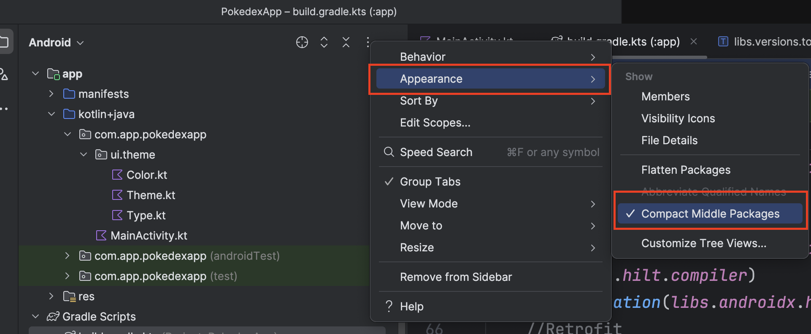

Regresando a nuestros asuntos, vamos a crear la carpeta global de este laboratorio que es la de **presentation**.

El nombre "presentation" viene de la arquitectura por capas y específicamente de Clean Architecture. La capa de presentación (presentation layer) es responsable de:

1. Todo lo relacionado con la UI
2. Cómo se muestran los datos al usuario
3. Manejo de eventos de la interfaz
4. Navegación entre pantallas

Se llama "presentation" porque es la capa que "presenta" la información al usuario, a diferencia de:

- "data" (que maneja datos)
- "domain" (que maneja la lógica de negocio)

En nuestro Lab 3, usamos "presentation" porque contiene:

- Pantallas (screens)
- Componentes UI
- Navegación
- Temas y estilos

Es una convención ampliamente adoptada en la comunidad Android, especialmente cuando se sigue Clean Architecture o arquitecturas por capas.

**Nota: Si vienes de otras nomenclaturas podrás encontrar esta capa con el nombre de framework, también pueden variar un poco los nombres pero en esencia es lo mismo.**

Crea un nuevo paquete seleccionando con clic derecho la carpeta de **pokedexapp**, selecciona **new** y de la lista selecciona **package**.

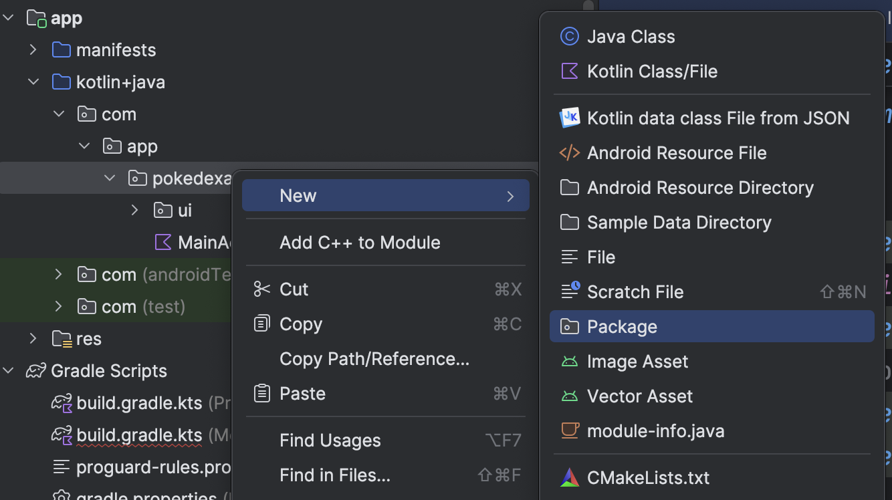

En el nombre escribe **presentation**

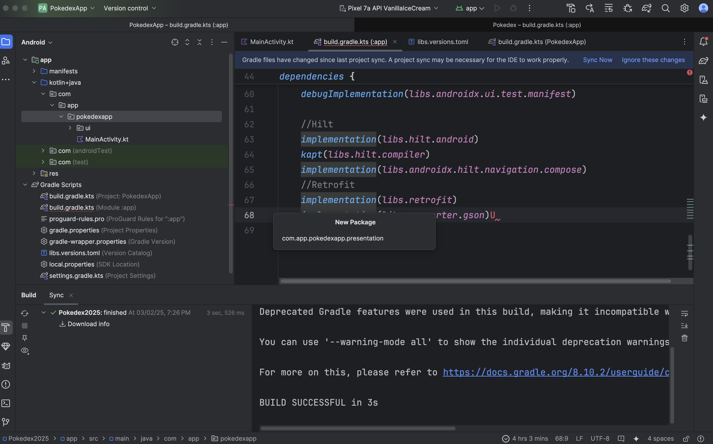

El resultado será el nuevo paquete dentro de nuestro proyecto, arrastra el MainActivity y el paquete de ui adentro del que acabamos de crear, si te pide hacer refactor dale que sí. El resultado deberá verse como lo siguiente:

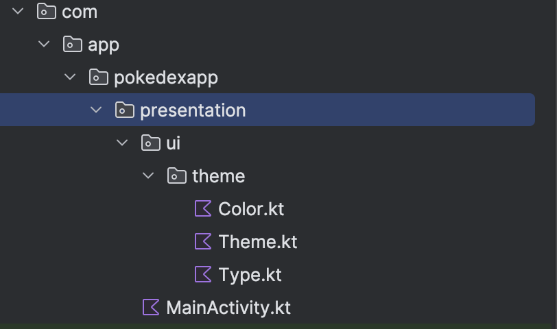

Conforme vayamos avanzando en los laboratorios, voy a ir asumiendo cosas que ya hemos visto en pasos previos, por lo que solo te dejaré los resultados y deberás resolverlos por ti mismo, esto como parte del refuerzo al aprendizaje.

Para iniciar, deja la carpeta de la siguiente manera, encuentra la diferencia con la imagen anterior.

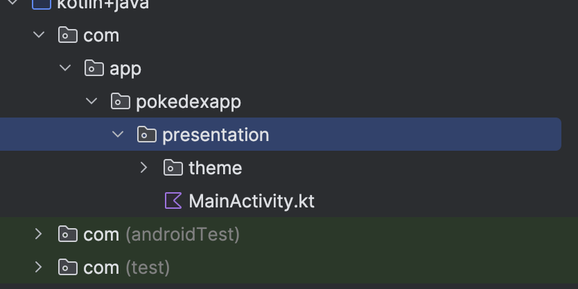

Ahora vamos a empezar con el **MainActivity**, abre el archivo, que deberá contener lo siguiente:

````
package com.app.pokedexapp.presentation

import android.os.Bundle
import androidx.activity.ComponentActivity
import androidx.activity.compose.setContent
import androidx.activity.enableEdgeToEdge
import androidx.compose.foundation.layout.fillMaxSize
import androidx.compose.foundation.layout.padding
import androidx.compose.material3.Scaffold
import androidx.compose.material3.Text
import androidx.compose.runtime.Composable
import androidx.compose.ui.Modifier
import androidx.compose.ui.tooling.preview.Preview
import com.app.pokedexapp.presentation.theme.PokedexAppTheme

class MainActivity : ComponentActivity() {
    override fun onCreate(savedInstanceState: Bundle?) {
        super.onCreate(savedInstanceState)
        enableEdgeToEdge()
        setContent {
            PokedexAppTheme {
                Scaffold(modifier = Modifier.fillMaxSize()) { innerPadding ->
                    Greeting(
                        name = "Android",
                        modifier = Modifier.padding(innerPadding),
                    )
                }
            }
        }
    }
}

@Composable
fun Greeting(
    name: String,
    modifier: Modifier = Modifier,
) {
    Text(
        text = "Hello $name!",
        modifier = modifier,
    )
}

@Preview(showBackground = true)
@Composable
fun GreetingPreview() {
    PokedexAppTheme {
        Greeting("Android")
    }
}

````

Veremos el método **onCreate()** que es donde todo parte y debajo veremos 2 funciones **Greeting** y **GreetingPreview**.

Elimina ambas funciones Greeting, aquí vamos a empezar aclarando un punto, siempre intenta tener tus archivos, clases y funciones separados, esto implicará que tengas muchos archivos en tu proyecto, pero estructurar, ordenar y testear será una tarea más simple siguiendo las reglas de arquitectura y composición para los archivos.

Al borrar los Greeting, veras que se marca en rojo lo que tenemos en la parte superior

```
PokedexAppTheme {
    Scaffold(modifier = Modifier.fillMaxSize()) { innerPadding ->
        Greeting(
            name = "Android",
            modifier = Modifier.padding(innerPadding),
        )
    }
}
```

Borra la llamada a Greeting, el código de **MainActivity te deberá quedar de la siguiente manera:

````
package com.app.pokedexapp.presentation

import android.os.Bundle
import androidx.activity.ComponentActivity
import androidx.activity.compose.setContent
import androidx.activity.enableEdgeToEdge
import androidx.compose.foundation.layout.fillMaxSize
import androidx.compose.foundation.layout.padding
import androidx.compose.material3.Scaffold
import androidx.compose.ui.Modifier
import com.app.pokedexapp.presentation.theme.PokedexAppTheme

class MainActivity : ComponentActivity() {
    override fun onCreate(savedInstanceState: Bundle?) {
        super.onCreate(savedInstanceState)
        enableEdgeToEdge()
        setContent {
            PokedexAppTheme {
                Scaffold(modifier = Modifier.fillMaxSize()) { innerPadding ->
                    //todo: Aquí vamos a comenzar
                }
            }
        }
    }
}
````

Ahora veamos cada concepto que se toca aquí directa o indirectamente:

**Activity**

Es un componente fundamental de Android que representa una pantalla con la que el usuario puede interactuar
En Compose, típicamente solo necesitamos una MainActivity que actúa como contenedor principal:

````
class MainActivity : ComponentActivity() {
    override fun onCreate(savedInstanceState: Bundle?) {
        super.onCreate(savedInstanceState)
        setContent {
            MyAppTheme {
                // Contenido de Compose
            }
        }
    }
}
````

**AndroidManifest.xml**

Es un archivo de configuración que describe los componentes fundamentales de la app
Declara permisos que necesita la app
Define el punto de entrada (MainActivity)

````
<manifest>
    <application>
        <activity
            android:name=".MainActivity"
            android:exported="true">
            <intent-filter>
                <action android:name="android.intent.action.MAIN" />
                <category android:name="android.intent.category.LAUNCHER" />
            </intent-filter>
        </activity>
    </application>
</manifest>
````

**setContent y Theme**

- setContent es donde definimos el contenido de Compose para nuestra Activity
- El Theme envuelve toda la UI y proporciona:

    - Colores consistentes
    - Tipografía
    - Formas
    - Otros estilos de Material Design

````
setContent {
    MyAppTheme {  // Aplica estilos consistentes
        Surface(
            modifier = Modifier.fillMaxSize(),
            color = MaterialTheme.colorScheme.background
        ) {
            // Contenido de la app
        }
    }
}
````

La relación entre estos componentes:

El Manifest declara la Activity como punto de entrada
La Activity inicializa Compose con setContent
El Theme proporciona estilos consistentes a toda la UI

Ahora vamos a crear un nuevo paquete dentro de **presentation** al cual llamaremos **navigation**.

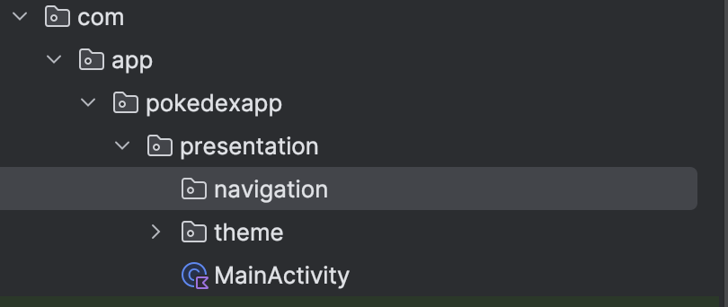

Dentro de este crearemos un nuevo archivo de Kotlin, al igual que el package, daremos clic derecho y ahora seleccionaremos Kotlin Class/File.

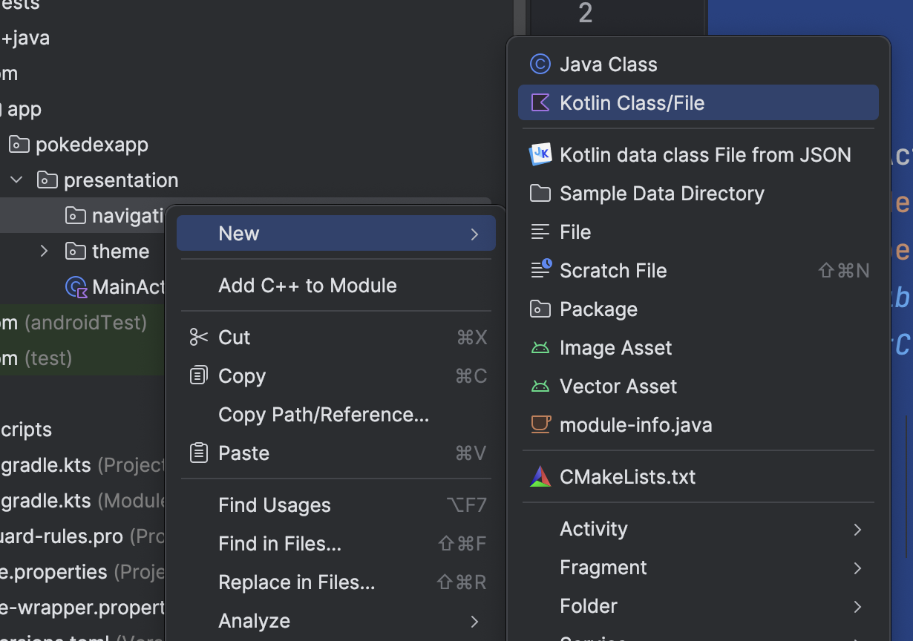

Como nombre le daremos **NavGraph**

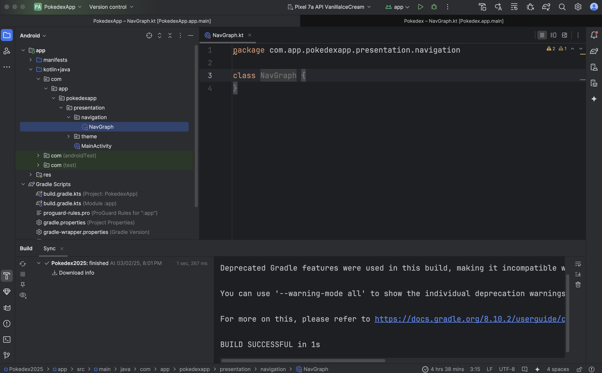

Esta clase será la única que no manejaremos de acuerdo a la nomenclatura normal, esto debido a que necesitamos una forma de manejar la estructura de pantallas que tenemos en la aplicación, borra el código autogenerado de 

````
class NavGraph{

}
````

Y en su lugar coloca el siguiente

````
sealed class Screen(
    val route: String,
) {
    object Home : Screen("home")

    object Detail : Screen("pokemon/\{pokemonId\}") {
        fun createRoute(pokemonId: String) = "pokemon/$pokemonId"
    }
}
````

Empezaremos con un tipo de clase extraña la **sealed class**.

Una sealed class en Kotlin es una clase especial que representa una jerarquía restringida - es decir, solo puede tener subclases que estén definidas dentro de la misma clase. 

Es muy útil para representar un conjunto limitado y conocido de estados o tipos.

En el código:

````
sealed class Screen(
    val route: String,
)
````

Esta es la clase base Screen que define una propiedad route que representa la ruta de navegación. Al ser sealed class, solo puede tener las subclases que están definidas dentro de ella.


````
object Home : Screen("home")
````

Home es un objeto (singleton) que hereda de Screen y define una ruta simple "home".

````
object Detail : Screen("pokemon/\{pokemonId\}") {
    fun createRoute(pokemonId: String) = "pokemon/$pokemonId"
}
````

Detail es otro objeto que hereda de Screen y:

- Define una ruta con un parámetro \{pokemonId\}
- Incluye una función createRoute que construye la ruta real reemplazando el parámetro con un ID específico

Este patrón es muy común en la navegación de Android (especialmente con Jetpack Compose) porque:

1. Centraliza todas las rutas de navegación en un solo lugar
2. Hace que sea imposible crear nuevas rutas fuera de esta clase (gracias a sealed)
3. Proporciona type-safety al navegar entre pantallas
4. Permite parametrizar rutas de forma segura (como en el caso de Detail)

Ahora bien, ya definimos de manera lógica nuestra navegación, pero ahora falta crear el objeto de interfaz para nuestro proyecto.

Aquí es donde podrías manejar la creación de un Drawer, o un NavigationBar, dependiendo del tipo de navegación que tendrá tu aplicación. En nuestro caso tendremos algo muy simple que será un tab principal para el listado de Pokemon y un buscador.

Ahora vamos a declarar nuestra primer función en Compose:

````
@Composable
fun PokemonNavGraph(){}
````

Nota que siempre que hablemos de una función de Compose o de UI necesitamos agregar la etiqueta **@Composable**, esta nos indicará que hablamos de un componente de Compose, también podemos notarlo con la nomenclatura de funciones, ya que una función normal en Kotlin sigue el nombramiento en formato **camelCase**, mientras que para compose las funciones siguen un estilo PascalCase**

````
fun camelCase()
fun PascalCase()
````

Otra cosa importante a notar es que las funciones en Compose, son solo eso, funciones, no van adentro de ninguna clase como tal. Hasta la fecha este es el formato más estandarizado para Android.

Ahora actualicemos nuestra función para que reciba 2 parámetros

````
@Composable
fun PokemonNavGraph(
    modifier: Modifier = Modifier,
    navController: NavHostController = rememberNavController(),
) {}
````

El primero es **modifier**, este te deberás acostumbrar pronto, pues todos los elementos de Compose tienen la capacidad de recibir un **modifier**, puedes verlo como todos los parámetros generales de estilo que puede recibir un elemento. Si creas tus propios componentes asegúrate de que reciban un **modifier** como lo estamos haciendo para asegurar que puedas personalizar su visualización, también observa la pre-inicialización

````
modifier: Modifier = Modifier
````

Esto para que en el caso de que no queramos pasar un **modifier** al menos se cree alguno por default.

El segundo parámetro es un NavHostController, el cuál contiene 2 elementos importantes:

1. NavHostController:
    - Es el controlador de navegación de Compose
    - Maneja la pila de navegación (back stack)
    - Permite navegar entre diferentes pantallas
    - Mantiene el estado de navegación


2. rememberNavController():
    - Es una función que crea y recuerda una instancia de NavHostController
    - El valor por defecto permite usar el NavGraph sin tener que pasar explícitamente un controlador
    - Usa el sistema de "remember" de Compose para mantener el controlador a través de recomposiciones.

De momento no vamos a indagar más en estos conceptos pues los irás viendo en acción conforme avancemos, además de que estos son estándares y no cambian entre proyecto y proyecto.

Por último vamos a agregar el contenido de nuestra función con lo siguiente:

````
NavHost(
        navController = navController,
        startDestination = Screen.Home.route,
        modifier = modifier,
    ) {
        composable(route = Screen.Home.route) {
            HomeScreen(
                onPokemonClick = { pokemonId ->
                    navController.navigate(Screen.Detail.createRoute(pokemonId))
                },
            )
        }

        composable(
            route = Screen.Detail.route,
            arguments = listOf(navArgument("pokemonId") { type = NavType.StringType }),
        ) { backStackEntry ->
            val pokemonId = backStackEntry.arguments?.getString("pokemonId") ?: "1"
            PokemonDetailScreen(
                pokemonId = pokemonId,
                onBackClick = { navController.popBackStack() },
            )
        }
    }
````

Aquí todavía no hablaremos mucho de los componentes tal cual, ya que es un poco más avanzado, pero vamos paso a paso:

1. NavHost es como un "contenedor" que maneja todas nuestras pantallas:

````
NavHost(
    navController = navController,  // El controlador que maneja la navegación
    startDestination = Screen.Home.route,  // Indica qué pantalla se muestra primero
    modifier = modifier,  // Para personalizar el aspecto si es necesario
)
````

2. Dentro del NavHost, definimos las pantallas usando composable:

````
// Primera pantalla: Home
composable(route = Screen.Home.route) {  // "route" es como la dirección de la pantalla
    HomeScreen(
        onPokemonClick = { pokemonId ->  // Qué hacer cuando clickean un Pokémon
            // Navega a la pantalla de detalle con el ID del Pokémon
            navController.navigate(Screen.Detail.createRoute(pokemonId))
        }
    )
}
````

3. Segunda pantalla (Detalle) que recibe un parámetro:

````
// Segunda pantalla: Detalle
composable(
    route = Screen.Detail.route,  // La "ruta" incluye el parámetro pokemonId
    arguments = listOf(  // Define qué tipo de dato es pokemonId
        navArgument("pokemonId") { type = NavType.StringType }
    )
) { backStackEntry ->  // backStackEntry contiene los argumentos
    // Obtiene el pokemonId de los argumentos (usa "1" si no hay ID)
    val pokemonId = backStackEntry.arguments?.getString("pokemonId") ?: "1"
    
    PokemonDetailScreen(
        pokemonId = pokemonId,  // Pasa el ID a la pantalla
        onBackClick = {  // Qué hacer cuando presionan "atrás"
            navController.popBackStack()  // Regresa a la pantalla anterior
        }
    )
}
````

Es como un mapa de tu app donde:

- Defines qué pantallas tienes
- Cómo llegar a cada una
- Qué información necesitan
- Cómo moverse entre ellas

Analogía simple:

- Es como una app de GPS donde:
    - NavHost es el mapa completo
    - Las rutas (routes) son las direcciones
    - navController es el GPS que te guía
    - composable son los destinos
    - arguments son la información que necesitas llevar contigo

El contenido entonces del archivo NavGraph.kt deberá ser el siguiente:

````
package com.app.pokedexapp.presentation.navigation

import androidx.compose.runtime.Composable
import androidx.compose.ui.Modifier
import androidx.navigation.NavHostController
import androidx.navigation.NavType
import androidx.navigation.compose.NavHost
import androidx.navigation.compose.composable
import androidx.navigation.compose.rememberNavController
import androidx.navigation.navArgument

sealed class Screen(
    val route: String,
) {
    object Home : Screen("home")

    object Detail : Screen("pokemon/\{pokemonId\}") {
        fun createRoute(pokemonId: String) = "pokemon/$pokemonId"
    }
}

@Composable
fun PokemonNavGraph(
    modifier: Modifier = Modifier,
    navController: NavHostController = rememberNavController(),
) {
    NavHost(
        navController = navController,
        startDestination = Screen.Home.route,
        modifier = modifier,
    ) {
        composable(route = Screen.Home.route) {
            HomeScreen(
                onPokemonClick = { pokemonId ->
                    navController.navigate(Screen.Detail.createRoute(pokemonId))
                },
            )
        }

        composable(
            route = Screen.Detail.route,
            arguments = listOf(navArgument("pokemonId") { type = NavType.StringType }),
        ) { backStackEntry ->
            val pokemonId = backStackEntry.arguments?.getString("pokemonId") ?: "1"
            PokemonDetailScreen(
                pokemonId = pokemonId,
                onBackClick = { navController.popBackStack() },
            )
        }
    }
}
````

Y notarás que tenemos clases y métodos en rojo, estas son las clases que crearemos más adelante.

### Paso 5 Creando las pantallas de nuestro proyecto

Vamos a crear un nuevo **package** el cual nombraremos como **screens**, como su nombre nos indica, aquí colocaremos las pantallas correspondientes de nuestra aplicación, de las cuales tendremos 3: la lista de pokemon, el buscador y el detalle del pokemon. La lista y el buscador se encontrarán en nuestra vista principal, y el detalle será un pantalla completamente aparte.

Por lo mismo vamos a crear dentro de **screens** otros dos paquetes: **home** y **detail**.

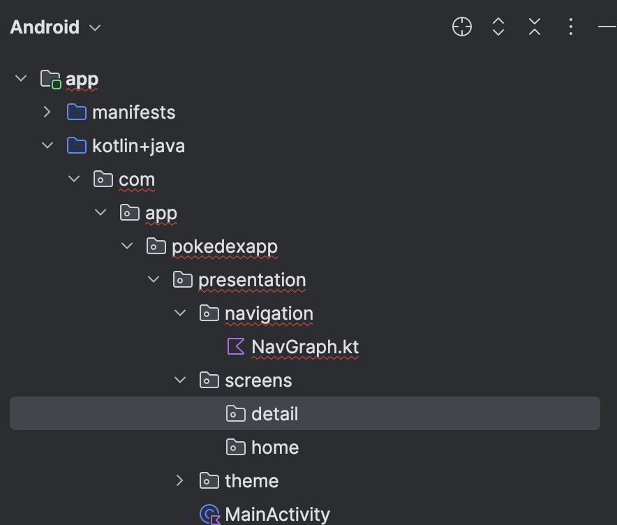

Ahora dentro de **detail** vamos a crear un archivo **PokemonDetailScreen**. Borra el auto generado de **class PokemonDetailScreen**, ya que será una función de Compose

````
package com.app.pokedexapp.presentation.screens.detail

import androidx.compose.runtime.Composable

@Composable
fun PokemonDetailScreen() {
    
}
````

Ahora vamos a agregar 2 parámetros a esta función:

````
pokemonId: String,
onBackClick: () -> Unit,
````

El primero será el número de Pokemon que queremos ver para poder identificarlo correctamente, el segundo será el más extraño hasta el momento.

Por lo general estamos acostumbrados a que en programación recibimos parámetros en formato de variables, si vienes de Javascript quizás viste en algún momento que se pueden pasar funciones a otras funciones. De cualquier modo, esto es lo que estamos haciendo, pasando una función sin parámetros a nuestra función de Compose, esto es algo muy común ya que necesitamos recuperar valores al ejecutar acciones por ejemplo al hacer clic en un botón queremos que ese evento ejecute una función, pero al separar en archivos nuestro proyecto e incluso por el contexto en el que estamos, esas funciones se pierden, por lo que tenemos que ir pasándolas poco a poco.

Las funciones en compose por lo general recibirán sus parámetros de entrada y sus funciones cambiantes, o de navegación.

Sigamos creando las pantallas que nos hacen falta, dentro de **home** crea el archivo **HomeScreen** e incluye lo siguiente:

````
@Composable
fun HomeScreen(onPokemonClick: (String) -> Unit) {}
````

Dentro de **home** crea un nuevo paquete que se llame **components**

Esto será por que una vez que pasemos de una pantalla todo será un componente, aún sea una ventana completa. Como te mencioné la lista de Pokemon y el buscador estarán en la misma vista principal, por eso hacemos esta segmentación.

Ahora crea dentro de **components** el archivo **PokemonListTab** y sustituye por:

````
@Composable
fun PokemonListTab(onPokemonClick: (String) -> Unit) {}
````

Después crea otro archivo que llamaremos **SearchTab**

````
@Composable
fun SearchTab(onPokemonClick: (String) -> Unit) {}
````

Por último crea un archivo llamado PokemonCard y sustituye con:

````
@Composable
fun PokemonCard(
    name: String,
    imageUrl: String,
    onClick: () -> Unit,
) {}
````

El resultado final de estructura y archivos deberá verse como lo siguiente:

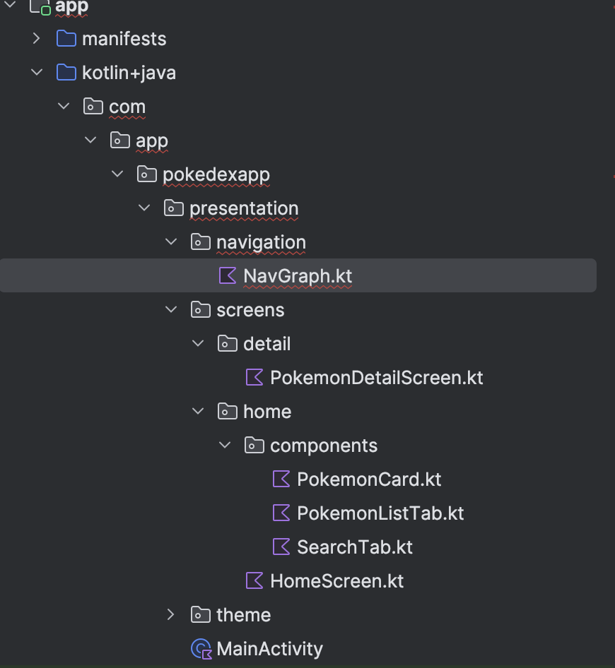

Ahora vamos a regresar al archivo **NavGraph**, donde tenemos el primer código en rojo.

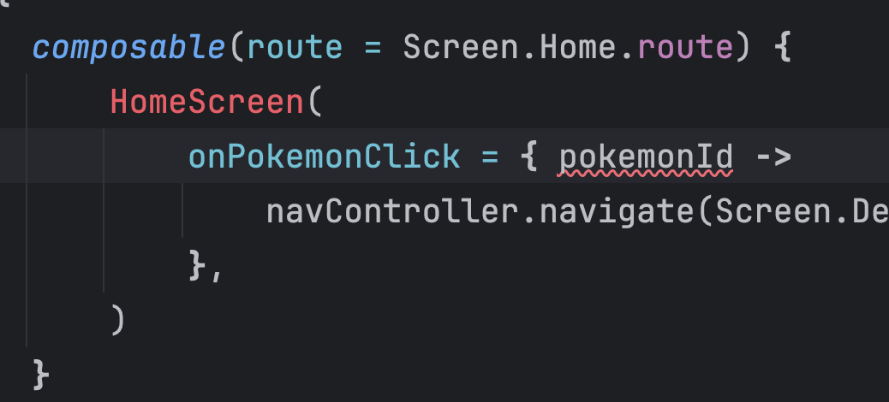

El siguiente paso es clave para tu éxito en Android Studio, cuando creamos o llamamos clases, no se importa de manera automática, por lo que tenemos que hacerlo nosotros. Si bien no es necesario saber el nombre del import, basta con que coloquemos el cursos sobre el código en rojo para que aparezca un menú de contexto. Aquí nos indicará que podemos importar la librería que hace falta, si hubiera un conflicto de varias librerías con ese nombre y créeme que los hay solo necesitas seleccionar en más acciones y seleccionar la correspondiente, ten mucho cuidado con esto por que puedes importar bien una librería pero no es la que deseas y eso puede marcarte errores.

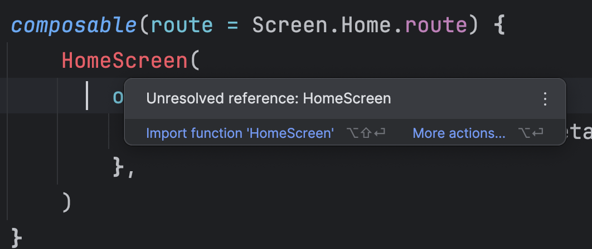

Y temo decirte otra cosa, Ktlint no permite el uso de imports con * debes importar cada clase de manera individual, esto es un dolor de cabeza en general ya que para cada clase en Compose deberá importar cada elemento 1 por 1, al momento Android Studio no ha mejorado esto y es un gran área de oportunidad, pero nos sirve para ir aprendiendo.

**Una forma más rápida de hacer los imports es con el teclado, usando en windows: ctrl+Enter o en mac: cmd+Enter.**

Una vez que realices el import correspondiente de **HomeScreen** y de **PokemonDetailScreen**, **NavGraph** debería quedar listo.

Ahora bien, si observas en la declaración de la función de Compose de PokemonNavGraph, es probable que te marque un error.

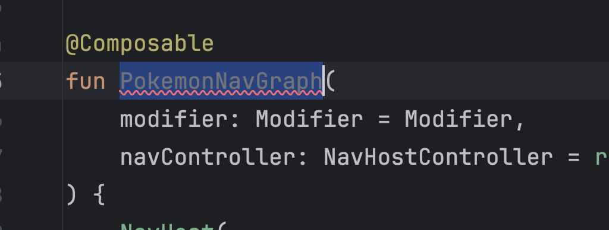

Este error no es de compilación, de hecho si compiláramos la aplicación, esto no nos daría problema. Este es un error de linter, si colocas el cursor sobre el nombre de la función te dirá que hacer.

````
@Suppress("ktlint:standard:function-naming")
@Composable
fun PokemonNavGraph(
    modifier: Modifier = Modifier,
    navController: NavHostController = rememberNavController(),
) {}
````

En este caso es agregar la etiqueta **@Suppress("ktlint:standard:function-naming")**, y esto es por lo que mencionábamos hace rato sobre el camelCase y PascalCase.

Estrictamente hablando, Kotlin debe usar camelCase, pero debido a que Compose es diferente en cuanto a que usa programación declarativa, el estándar de Google es PascalCase, por ello debemos ignorar la advertencia del linter por única ocasión. Esto deberemos hacerlo para todos nuestros componentes de Compose.

Date una vuelta nuevamente por todas las pantallas y verás que este mismo error ya aparece en cada una, lo bueno es que ya sabes resolverlo, como ejercicio corrige todas las pantallas y componentes.

Una vez que estés listo vamos a comenzar a crear el contenido de nuestras pantallas.

### Paso 6 Pantalla del buscador

Vamos a comenzar con la pantalla del buscador, ya que va a ser la más sencilla que realizaremos en este laboratorio.

Cuando hablamos de una pantalla completa necesitamos definir un componente principal llamado **Scaffold**, sin embargo el buscador no es una pantalla principal, es un derivado de la pantalla de **Home**, eso simplificará lo que debemos hacer.

El código completo es el siguiente:

````
@Suppress("ktlint:standard:function-naming")
@Composable
fun SearchTab(onPokemonClick: (String) -> Unit) {
    Column(
        modifier =
            Modifier
                .fillMaxSize()
                .padding(16.dp),
        horizontalAlignment = Alignment.CenterHorizontally,
    ) {
        Text(
            text = "Búsqueda de Pokémon",
            style = MaterialTheme.typography.headlineMedium,
        )

        Spacer(modifier = Modifier.height(16.dp))

        Text(
            text = "Funcionalidad disponible próximamente",
            style = MaterialTheme.typography.bodyMedium,
        )
    }
}
````

Piensa que tenemos un lienzo en blanco, como en **HTML**, antes de poner cualquier elemento, por lo general comenzamos con un **DIV**, aquí tendremos el componente de **Column**

````
Column(
    modifier = Modifier.fillMaxSize().padding(16.dp),
    horizontalAlignment = Alignment.CenterHorizontally,
)
````

En HTML sería similar a:

````
<div style="
    display: flex;
    flex-direction: column;
    align-items: center;
    height: 100%;
    padding: 16px;
">
````

- Column es como un contenedor div con flex-direction: column
- fillMaxSize() es como usar height: 100%
- padding(16.dp) es equivalente a padding: 16px
- horizontalAlignment = Alignment.CenterHorizontally es como align-items: center

El primer **Text**:

````
Text(
    text = "Búsqueda de Pokémon",
    style = MaterialTheme.typography.headlineMedium,
)
````

En HTML sería similar a:

````
<h2>Búsqueda de Pokémon</h2>
````

- Text es como cualquier elemento de texto en HTML (p, h1, etc.)
- MaterialTheme.typography.headlineMedium es similar a usar una clase CSS predefinida para títulos

El **Spacer**

````
Spacer(modifier = Modifier.height(16.dp))
````

En HTML sería similar a:

````
<div style="height: 16px;"></div>
````

El segundo **Text**

````
Text(
    text = "Funcionalidad disponible próximamente",
    style = MaterialTheme.typography.bodyMedium,
)
````

````
<p>Funcionalidad disponible próximamente</p>
````

- Este Text usa un estilo de texto más pequeño (bodyMedium), similar a un párrafo normal.

El similar completo en HTML sería el siguiente:

````
<div style="
    display: flex;
    flex-direction: column;
    align-items: center;
    height: 100%;
    padding: 16px;
">
    <h2>Búsqueda de Pokémon</h2>
    <div style="height: 16px;"></div>
    <p>Funcionalidad disponible próximamente</p>
</div>
````

Algunas notas adicionales:

- En Compose, Modifier es como el sistema de estilos en CSS, pero más estructurado y type-safe
- dp es una unidad de densidad independiente, similar a los píxeles en CSS
- La composición es declarativa, similar a React, donde describes cómo debe verse la UI y Compose se encarga de renderizar.

### Paso 7 Pantalla de lista de Pokemon

Abre el archivo **PokemonListTab**, y ahora añadiremos el siguiente código

````
@Composable
fun PokemonListTab(onPokemonClick: (String) -> Unit) {
    LazyVerticalGrid(
        columns = GridCells.Fixed(2),
        contentPadding = PaddingValues(16.dp),
        horizontalArrangement = Arrangement.spacedBy(16.dp),
        verticalArrangement = Arrangement.spacedBy(16.dp),
    ) {
        // Mock data para el Lab 3
        items(5) { index ->
            PokemonCard(
                name = "Pokemon ${index + 1}",
                imageUrl = "https://raw.githubusercontent.com/PokeAPI/sprites/master/sprites/pokemon/${index + 1}.png",
                onClick = { onPokemonClick(index.toString()) },
            )
        }
    }
}
````

Nuevamente vamos a hacer la analogía con HTML.

El LazyVerticalGrid:

````
LazyVerticalGrid(
    columns = GridCells.Fixed(2),
    contentPadding = PaddingValues(16.dp),
    horizontalArrangement = Arrangement.spacedBy(16.dp),
    verticalArrangement = Arrangement.spacedBy(16.dp),
)
````

El similar en HTML sería:

````
<div style="
    display: grid;
    grid-template-columns: repeat(2, 1fr);
    padding: 16px;
    gap: 16px 16px;
">
````

- LazyVerticalGrid es similar a un contenedor CSS Grid
- GridCells.Fixed(2) es equivalente a grid-template-columns: repeat(2, 1fr)
- contentPadding es el padding del contenedor
- horizontalArrangement y verticalArrangement con spacedBy es similar a la propiedad gap en CSS Grid

El bloque items:

````
items(5) { index ->
    PokemonCard(
        name = "Pokemon ${index + 1}",
        imageUrl = "https://raw.githubusercontent.com/PokeAPI/sprites/master/sprites/pokemon/${index + 1}.png",
        onClick = { onPokemonClick(index.toString()) },
    )
}
````

El similar en HTML sería

````
<!-- Este código se repetiría 5 veces -->
<div class="pokemon-card" onclick="handleClick('0')">
    
    <h3>Pokemon 1</h3>
</div>
````

El código completo similar en HTML sería

````
<div style="
    display: grid;
    grid-template-columns: repeat(2, 1fr);
    padding: 16px;
    gap: 16px 16px;
">
    <div class="pokemon-card" onclick="handleClick('0')">
        
        <h3>Pokemon 1</h3>
    </div>
    <div class="pokemon-card" onclick="handleClick('1')">
        
        <h3>Pokemon 2</h3>
    </div>
    <!-- ... y así hasta completar 5 tarjetas -->
</div>
````

Algunas notas importantes:

- LazyVerticalGrid es "lazy" porque solo renderiza los elementos que son visibles en pantalla, similar a react-window o react-virtualized en React
- El bucle items(5) es una forma declarativa de generar elementos repetitivos, similar a usar .map() en React
- La URL de la imagen está construida dinámicamente usando el índice + 1 para obtener diferentes Pokémon
- Cada PokemonCard es un componente reutilizable que recibe props para su nombre, imagen y función de click.

### Paso 8 Componente Pokemon Card

Abre el archivo **PokemonCard** e incluye lo siguiente:

````
@Composable
fun PokemonCard(
    name: String,
    imageUrl: String,
    onClick: () -> Unit,
) {
    Card(
        modifier =
            Modifier
                .fillMaxWidth()
                .clickable(onClick = onClick),
        elevation = CardDefaults.cardElevation(defaultElevation = 4.dp),
    ) {
        Column(
            modifier = Modifier.padding(8.dp),
            horizontalAlignment = Alignment.CenterHorizontally,
        ) {
            AsyncImage(
                model = imageUrl,
                contentDescription = name,
                modifier =
                    Modifier
                        .size(120.dp)
                        .padding(8.dp),
            )

            Text(
                text = name,
                style = MaterialTheme.typography.titleMedium,
                textAlign = TextAlign.Center,
            )
        }
    }
}
````

El componente **Card**:

````
Card(
    modifier = Modifier
        .fillMaxWidth()
        .clickable(onClick = onClick),
    elevation = CardDefaults.cardElevation(defaultElevation = 4.dp),
)
````

En HTML sería similar a:

````
<div class="card" style="
    width: 100%;
    cursor: pointer;
    box-shadow: 0 4px 8px rgba(0,0,0,0.1);
    border-radius: 8px;
    overflow: hidden;
" onclick="handleClick()">
````

- Card es un componente Material que provee estilos predefinidos
- fillMaxWidth() es como width: 100%
- clickable añade interactividad, similar a cursor: pointer
- elevation crea una sombra, similar a box-shadow en CSS

El **Column** interior:

````
Column(
    modifier = Modifier.padding(8.dp),
    horizontalAlignment = Alignment.CenterHorizontally,
)
````

El similar en HTML sería:

````
<div style="
    display: flex;
    flex-direction: column;
    align-items: center;
    padding: 8px;
">
````

El **AsyncImage**:

````
AsyncImage(
    model = imageUrl,
    contentDescription = name,
    modifier = Modifier
        .size(120.dp)
        .padding(8.dp),
)
````

El similar sería
````
</img>
````

- AsyncImage es similar a **\** pero con carga asíncrona incorporada
- contentDescription es equivalente al atributo alt

El **Text** final:

````
Text(
    text = name,
    style = MaterialTheme.typography.titleMedium,
    textAlign = TextAlign.Center,
)
````

El similar en HTML sería:

````
<h3 style="
    text-align: center;
    font-size: 16px;
    font-weight: 500;
">Pokemon Name</h3>
````

El similar completo en HTML sería:

````
<div class="card" style="
    width: 100%;
    cursor: pointer;
    box-shadow: 0 4px 8px rgba(0,0,0,0.1);
    border-radius: 8px;
    overflow: hidden;
" onclick="handleClick()">
    <div style="
        display: flex;
        flex-direction: column;
        align-items: center;
        padding: 8px;
    ">
        
        <h3 style="
            text-align: center;
            font-size: 16px;
            font-weight: 500;
        ">Pokemon Name</h3>
    </div>
</div>
````

- En Compose, el Card maneja automáticamente aspectos como bordes redondeados y overflow.
- AsyncImage maneja automáticamente la carga de imágenes, estados de carga y errores.
- Los estilos de texto de Material Theme proporcionan consistencia visual en toda la app.

### Paso 9 Pantalla de HomeScreen

Ahora que ya terminamos con los sub componentes vamos con las vistas principales, vamos a dejar de lado la analogía con HTML, y enfocarnos más en los propios componentes de compose.

Abre el archivo **HomeScreen**, el código es el siguiente

````
@Composable
fun HomeScreen(onPokemonClick: (String) -> Unit) {
    var selectedTabIndex by remember { mutableStateOf(0) }
    val tabs = listOf("Pokémon List", "Search")

    Scaffold(
        topBar = {
            CenterAlignedTopAppBar(
                title = { Text("Pokédex") },
            )
        },
    ) { padding ->
        Column(
            modifier =
                Modifier
                    .fillMaxSize()
                    .padding(padding),
        ) {
            TabRow(selectedTabIndex = selectedTabIndex) {
                tabs.forEachIndexed { index, title ->
                    Tab(
                        text = { Text(title) },
                        selected = selectedTabIndex == index,
                        onClick = { selectedTabIndex = index },
                    )
                }
            }

            when (selectedTabIndex) {
                0 -> PokemonListTab(onPokemonClick = onPokemonClick)
                1 -> SearchTab(onPokemonClick = onPokemonClick)
            }
        }
    }
}
````

1. Estado y Variables Iniciales:

````
var selectedTabIndex by remember { mutableStateOf(0) }
val tabs = listOf("Pokémon List", "Search")
````

- selectedTabIndex: Es una variable de estado que rastrea qué tab está seleccionada
- remember con mutableStateOf: Mantiene el estado entre recomposiciones
- tabs: Lista simple con los nombres de las pestañas

Algo que será nuevo en nuestro camino es el manejo de estados en Compose y en Android, si bien el concepto no es particularmente difícil, es complicado de los paradigmas tradicionales de programación donde todo lo guardamos en una variable. En la programación reactiva como Compose, SwiftUI y React se requiere del manejo de estados para actualizar los valores de las variables, esto por facilidad de actualizar la información en tiempo real.

Vamos a revisar cada palabra reservada:

**mutableStateOf**
````
mutableStateOf(0)
````
Piensa en esto como una caja especial que:

Contiene un valor que puede cambiar
Avisa a Compose cuando su contenido cambia para que actualice la pantalla
Es como un sensor que detecta cambios

Por ejemplo, si tienes una lámpara con un sensor de movimiento:

La lámpara es tu interfaz
El sensor es mutableStateOf
Cuando detecta un cambio (movimiento), la lámpara reacciona (se enciende)

**remember**
````
remember { mutableStateOf(0) }
````
remember es como la memoria a corto plazo de tu aplicación:

Guarda un valor y lo "recuerda" entre actualizaciones de la pantalla
Sin remember, el valor se reiniciaría cada vez que la pantalla se actualiza

Es similar a cuando escribes algo en un papel para no olvidarlo:

El papel es remember
Lo que escribes es el valor que quieres mantener
Aunque cierres los ojos (recomposición), el papel sigue teniendo lo que escribiste.

**by (Delegado de Propiedades)**
````
var selectedTabIndex by remember { mutableStateOf(0) }
````
El by es como un asistente que simplifica el acceso al valor:

Sin by: selectedTabIndex.value = 1
Con by: selectedTabIndex = 1

Es como tener un mayordomo (el delegado):

En lugar de abrir tú mismo la caja fuerte (mutableStateOf)
Le dices al mayordomo que lo haga por ti
El mayordomo maneja los detalles técnicos

Ejemplo práctico completo:

````
// Sin by
var selectedTab = remember { mutableStateOf(0) }
// Necesitas usar .value
selectedTab.value = 1
Text(text = "Tab ${selectedTab.value}")

// Con by
var selectedTabIndex by remember { mutableStateOf(0) }
// Acceso directo al valor
selectedTabIndex = 1
Text(text = "Tab $selectedTabIndex")
````

Analogía con una biblioteca:

mutableStateOf es como un libro que puede ser modificado
remember es el estante donde guardas el libro
by es el bibliotecario que te ayuda a acceder al libro

En un ejemplo más cotidiano:

````
// Contador simple
var contador by remember { mutableStateOf(0) }

Button(onClick = { contador += 1 }) {
    Text("Has hecho clic $contador veces")
}
````

- El contador es como un marcador en un juego
- remember asegura que no pierdas la cuenta
- mutableStateOf permite que el número cambie
- by te permite trabajar con el número directamente

Cuando estos elementos trabajan juntos:

- mutableStateOf crea un contenedor para el valor cambiante
- remember mantiene ese contenedor entre actualizaciones
- by hace que sea fácil trabajar con el valor

2. Scaffold

````
Scaffold(
    topBar = { ... },
) { padding -> ... }
````

El Scaffold es un componente fundamental en Material Design que proporciona la estructura básica de una pantalla. Es como el esqueleto de tu interfaz y puede incluir:

TopBar (barra superior)
BottomBar (barra inferior)
FloatingActionButton (botón flotante)
Drawer (menú lateral)
SnackbarHost (para mostrar mensajes)

Lo interesante del Scaffold es que:

Maneja automáticamente el espaciado y la colocación de estos elementos
Proporciona valores de padding adecuados para evitar superposiciones
Gestiona la navegación y la jerarquía visual
Se adapta a diferentes tamaños de pantalla

El Scaffold es especialmente importante porque:

- Implementa las guías de diseño de Material Design
- Maneja la accesibilidad automáticamente
- Proporciona una estructura consistente
- Se encarga de aspectos como:

    - Insets del sistema (área del notch, barra de estado, etc.)
    - Transiciones y animaciones
    - Estados de elevación y sombras
    - Comportamiento del teclado
    - Gestos del sistema

3. CenterAlignedTopAppBar:

````
CenterAlignedTopAppBar(
    title = { Text("Pokédex") }
)
````

- Es la barra superior de la aplicación
- Centra el título automáticamente
- Puede incluir acciones, menús y navegación (aunque en este caso solo tiene el título)

4. Column y TabRow

````
Column(
    modifier = Modifier
        .fillMaxSize()
        .padding(padding)
) {
    TabRow(selectedTabIndex = selectedTabIndex) { ... }
}
````

- Column: Organiza los elementos verticalmente
- TabRow: Contenedor para las pestañas
- El padding viene del Scaffold para asegurar que el contenido no se superponga con la barra superior

5. Tabs

````
tabs.forEachIndexed { index, title ->
    Tab(
        text = { Text(title) },
        selected = selectedTabIndex == index,
        onClick = { selectedTabIndex = index }
    )
}
````

- Crea una pestaña para cada elemento en la lista tabs
- Cada Tab muestra su título
- selected determina si la pestaña está activa
- onClick actualiza el índice seleccionado

6. Contenido adicional

````
when (selectedTabIndex) {
    0 -> PokemonListTab(onPokemonClick = onPokemonClick)
    1 -> SearchTab(onPokemonClick = onPokemonClick)
}
````

- Usa un when para mostrar el contenido correspondiente a la pestaña seleccionada
- Pasa la función onPokemonClick a ambos componentes

### Paso 10 Pantalla de PokemonDetailScreen

Finalmente el archivo **PokemonDetailScreen**, e incluye el siguiente código:

````
@Composable
fun PokemonDetailScreen(
    pokemonId: String,
    onBackClick: () -> Unit,
) {
    Scaffold(
        topBar = {
            TopAppBar(
                title = { Text("Detalles del Pokémon") },
                navigationIcon = {
                    IconButton(onClick = onBackClick) {
                        Icon(Icons.Default.ArrowBack, "Back")
                    }
                },
            )
        },
    ) { padding ->
        Column(
            modifier =
                Modifier
                    .fillMaxSize()
                    .padding(padding)
                    .padding(16.dp),
            horizontalAlignment = Alignment.CenterHorizontally,
        ) {
            // Mock data para el Lab 3
            AsyncImage(
                model = "https://raw.githubusercontent.com/PokeAPI/sprites/master/sprites/pokemon/$pokemonId.png",
                contentDescription = "Pokemon $pokemonId",
                modifier = Modifier.size(200.dp),
            )

            Spacer(modifier = Modifier.height(16.dp))

            Text(
                text = "Pokemon #$pokemonId",
                style = MaterialTheme.typography.headlineMedium,
            )
        }
    }
}
````

Esta última pantalla no te la voy a explicar, revisa por ti mismo y si tienes duda regresa algunos pasos y razona por que tiene este código. 

Es fundamental que entiendas de donde vienen los componentes, ya que con eso podrás empezar a crear interfaces.

Lo que sigue en el camino de Compose es practicar muchas interfaces, intenta crear diferentes estilos y modifica el código actual para experimentar, no tengas miedo en romperlo, de hecho te invito a que lo hagas, solo así entenderás por que funcionan las cosas.

### Paso 11 Compilar y correr el proyecto

Ya que hemos terminado con nuestro código vamos a intentar compilar el proyecto para ver si podemos correrlo, para ello ve al icono del martillo en la parte superior derecha.

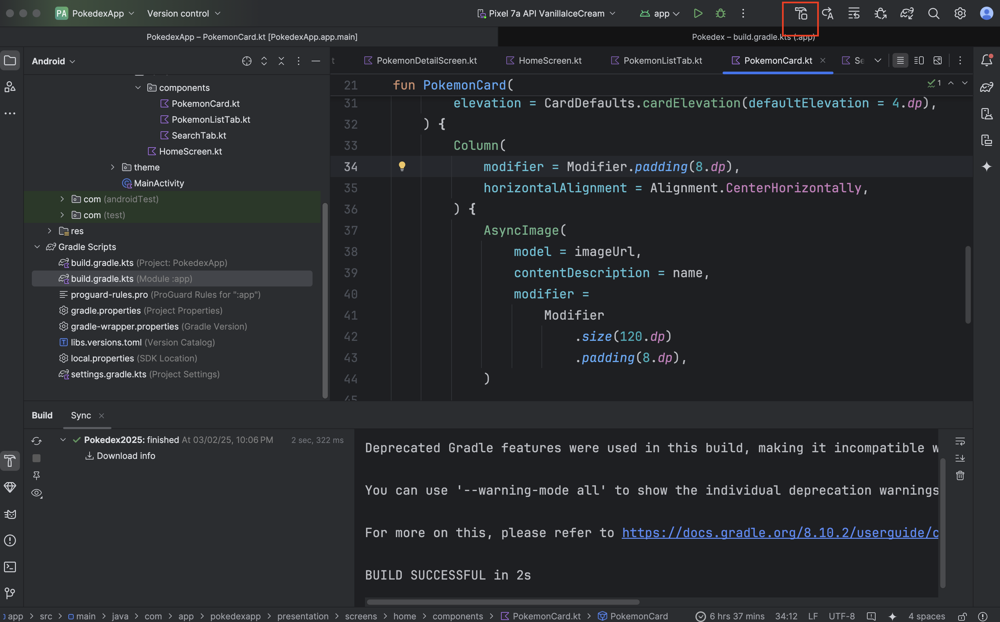

Si todo salió bien, después de un rato verás algo como lo siguiente:

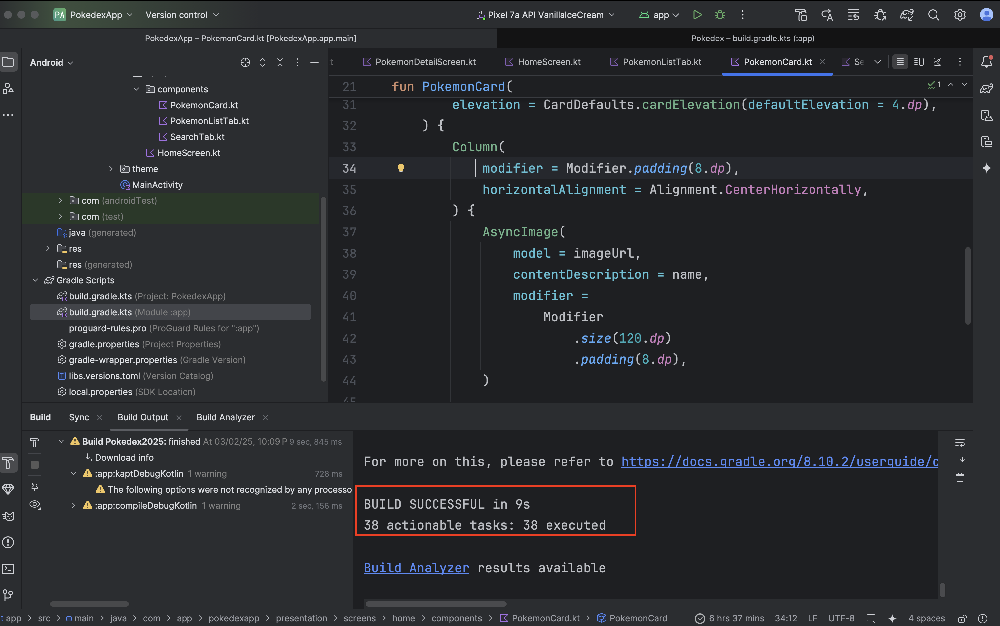

Ahora corre la aplicación con el botón de Play en la parte superior, asegúrate que tienes un dispositivo corriendo conectado o un emulador ejecutándose.

¡Éxito! o ¿no?

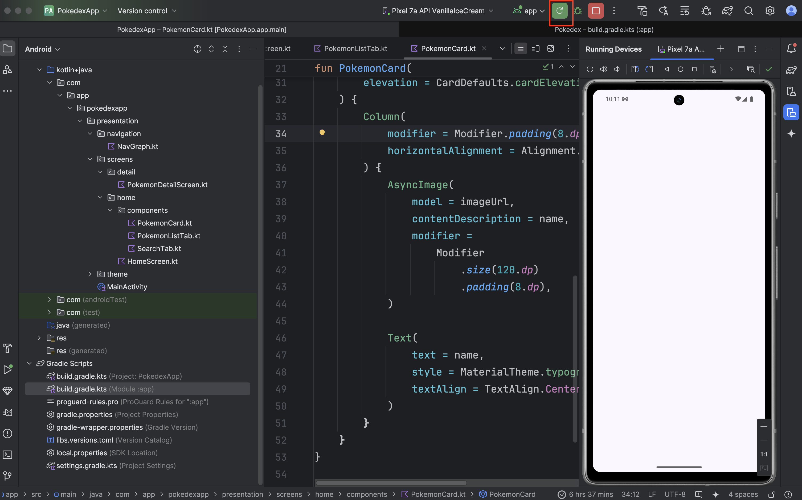

La aplicación se ejecutó correctamente pero tenemos una pantalla en blanco, ¿qué nos faltó?

Abre el archivo **MainActivity** y para ello te voy a dar otro tipo que te salvará de la búsqueda visual del archivo, sobre todo cuando el proyecto crezca demasiado.

En vez de ir a la jerarquía del proyecto en windows: ctrl+shit+o en mac: cmd+shift+o. Y escribe MainActivity

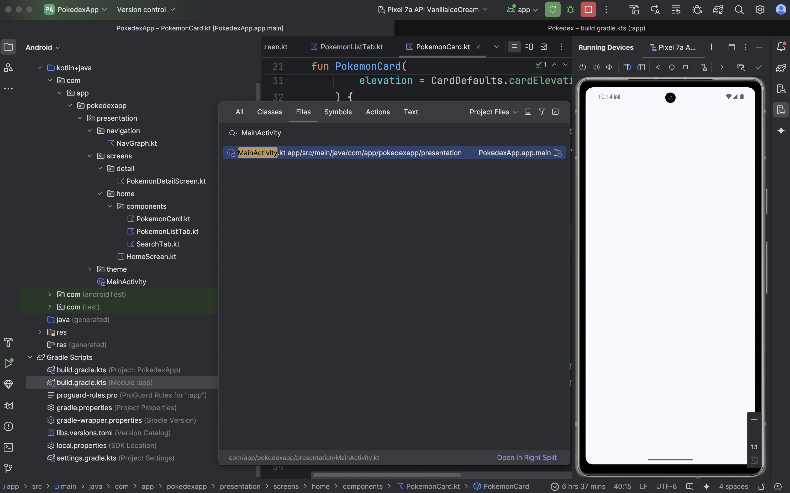

El buscador de Android Studio nos dará el archivo que buscamos, selecciónalo y se abrirá automáticamente. Aprende a usar este buscador y reducirás tu tiempo de desarrollo de manera increíble.

Aquí tenemos el error

```
// todo: Aquí vamos a comenzar
```

Nunca mandamos llamar nuestras vistas en Compose, sustituye el todo por lo siguiente:

````
PokemonNavGraph()
````

Ahora ejecuta nuevamente la aplicación.

Y ahora si truena, pero aprovechemos este espacio y aprendamos a usar el logcat.

Cuando una aplicación de android truena hay que aprender a ver donde se encuentra el error. Para ello debemos abrir el logcat, lo verás en la parte inferior izquierda con un icono de gato.

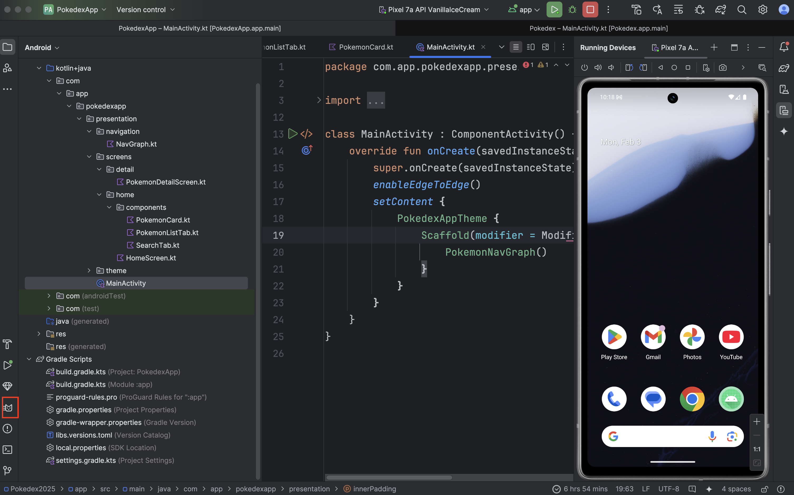

Y aquí tenemos el error

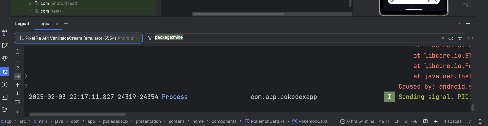

Sabiéndolo usar, el logcat es poderoso, pero si no solo tenemos información corriendo sin saber a que representa nuestro error.

En primer lugar observa en la parte superior del mismo en la parte izquierda que esta seleccionado nuestro dispositivo, en mi caso el emulador que estoy usando, recuerda cambiarlo si cambias a otro dispositivo, pues Android Studio no sabe cual estás usando cuando se desconecta.

Después a ún lado verás una caja de búsqueda que dice **package:mine**, de manera default Android Studio filtra tu aplicación en desarrollo para ver solo sus errores, si quieres ver todo lo que lanza el dispositivo borra el texto y verás como empieza a lanzar información.

Si por el contrario adelante del **package:mine** agregas **level:error** filtraras los errores de tu aplicación, level puede contener diferentes valores, como warnings u otras etiquetas, la opción de auto completado te dirá cuales hay.

Ya que filtramos los errores aún tenemos que scrollear para ver el error, te recomiendo apliques lo siguiente.

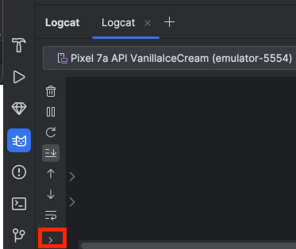

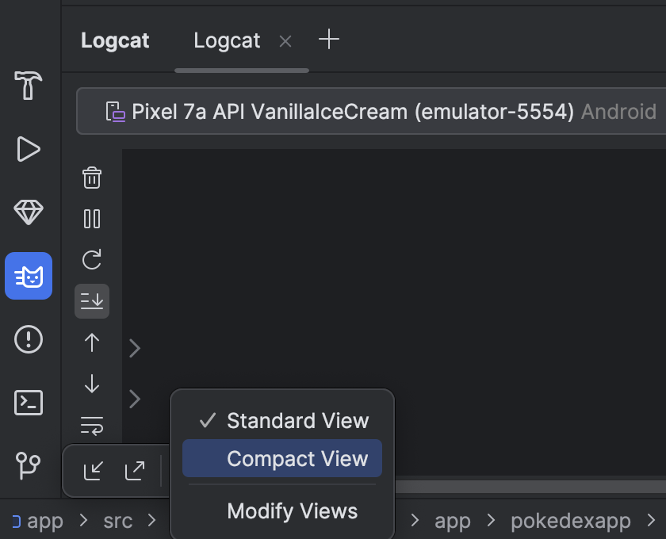

El formato compacto hace más fácil seguir los errores.

Ahora veamos el error. Scrollea hasta la parte superior donde empieza el error. Por lo general en Android las primeras líneas nos dicen cual es el error, los links en azul son los links a los archivos, como aquí vemos la pila de llamadas, por lo general los primeros serán tus archivos, esto te ayudará a ir directamente a la línea con errores.

Si los links en azul no te dicen nada entonces probablemente el error está en otra parte, como es este caso.

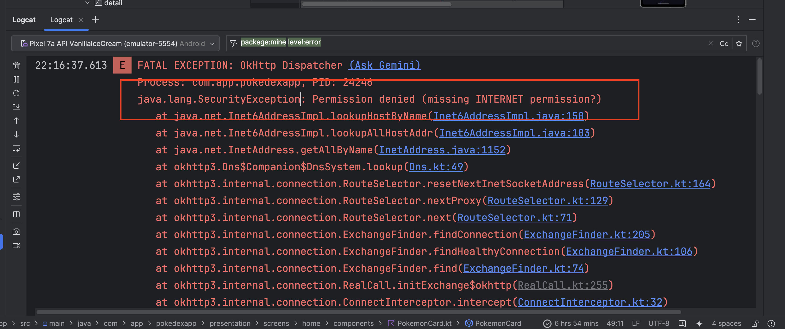

Olvidamos añadir el permiso de Internet, debido a que estamos cargando una imagen a través de una url, y de aquí en adelante usaremos internet para obtener información.

Por default android no te da este permiso.

**Nota: Error de novato No. 2 - No olvides el permiso de Internet al crear un nuevo proyecto**

Hoy en día Android es muy especial para los permisos debido a una fuerte política para proteger la información del usuario, el caso del permiso de Internet es el más simple pues sin el no podemos hacer nada prácticamente.

Pero verás en el camino que hay otros permisos que no basta con declararlos, hay que solicitarlos al usuario en tiempo de ejecución, como el de la cámara o el de ubicación.

Para nuestro caso basta con que abras el AndroidManifest, si no sabes donde está usa el buscador para encontrarlo y añade la siguiente etiqueta.

````
<uses-permission android:name="android.permission.INTERNET" />
````

Si tienes duda, tu Manifest debería verse de la siguiente manera:

````
<?xml version="1.0" encoding="utf-8"?>
<manifest xmlns:android="http://schemas.android.com/apk/res/android"
    xmlns:tools="http://schemas.android.com/tools">

    <uses-permission android:name="android.permission.INTERNET" />

    <application
        android:allowBackup="true"
        android:dataExtractionRules="@xml/data_extraction_rules"
        android:fullBackupContent="@xml/backup_rules"
        android:icon="@mipmap/ic_launcher"
        android:label="@string/app_name"
        android:roundIcon="@mipmap/ic_launcher_round"
        android:supportsRtl="true"
        android:theme="@style/Theme.PokedexApp"
        tools:targetApi="31">
        <activity
            android:name=".presentation.MainActivity"
            android:exported="true"
            android:label="@string/app_name"
            android:theme="@style/Theme.PokedexApp">
            <intent-filter>
                <action android:name="android.intent.action.MAIN" />

                <category android:name="android.intent.category.LAUNCHER" />
            </intent-filter>
        </activity>
    </application>

</manifest>
````

Ahora sí, ejecuta nuevamente tu aplicación y...

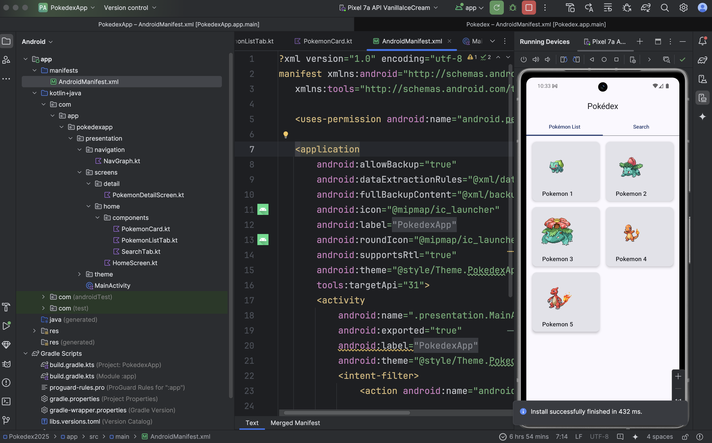

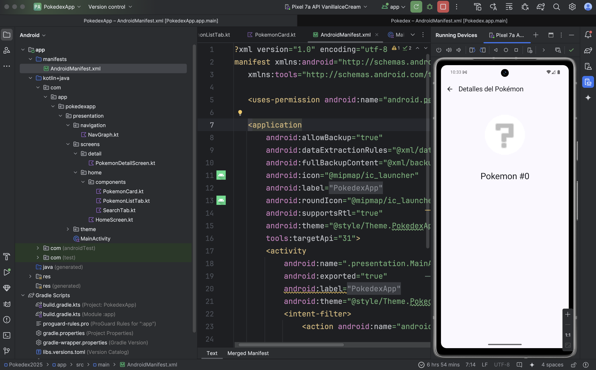

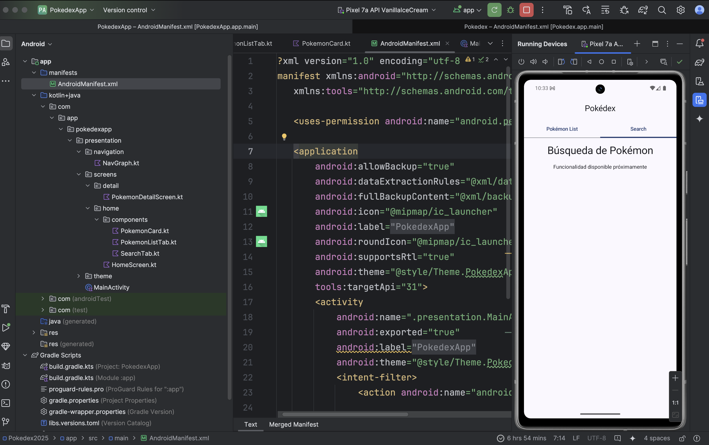

Felicidades, has completado tu primera aplicación utilizando Jetpack Compose.

## Resumen

Componentes Principales:

- MainActivity: Contenedor principal que inicializa la aplicación
- NavGraph: Sistema de navegación entre pantallas
- HomeScreen: Pantalla principal con dos tabs
- DetailScreen: Pantalla de detalles del Pokémon

Funcionalidades Implementadas:

- Navegación básica entre pantallas
- Sistema de tabs en la pantalla principal
- Layout de lista de Pokémon (sin datos reales)
- Diseño básico de tarjetas de Pokémon
- Estructura de UI modular y reutilizable

Conceptos Clave:

- Jetpack Compose para UI declarativa
- Navegación con NavHost
- Componentes básicos de Material Design
- Organización de código por features

Este laboratorio se enfoca en la estructura y diseño de la UI, sentando las bases para la funcionalidad que se agregará en laboratorios posteriores.