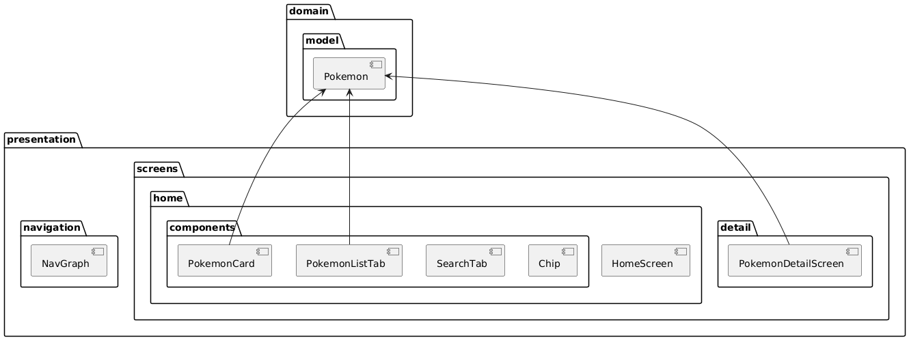
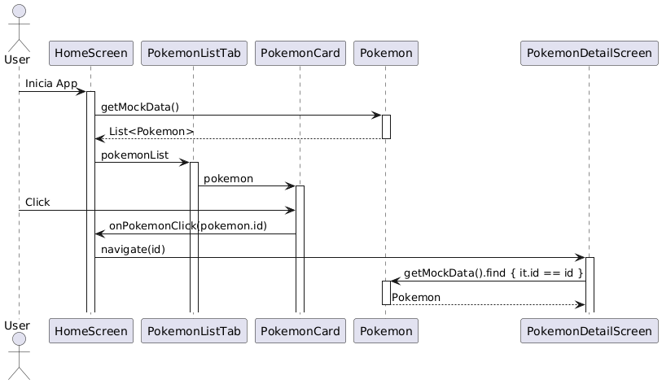
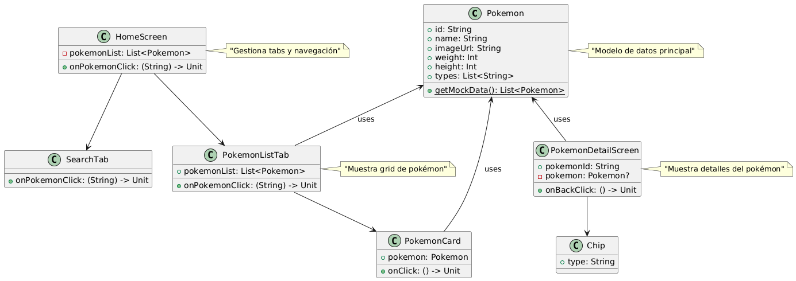
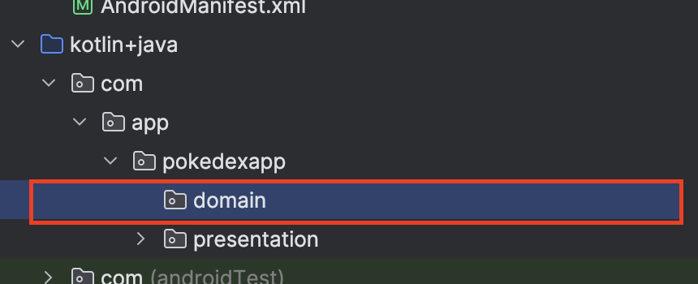
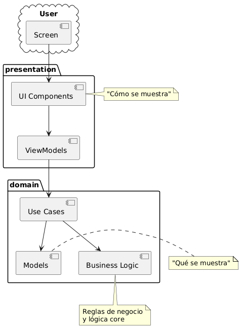
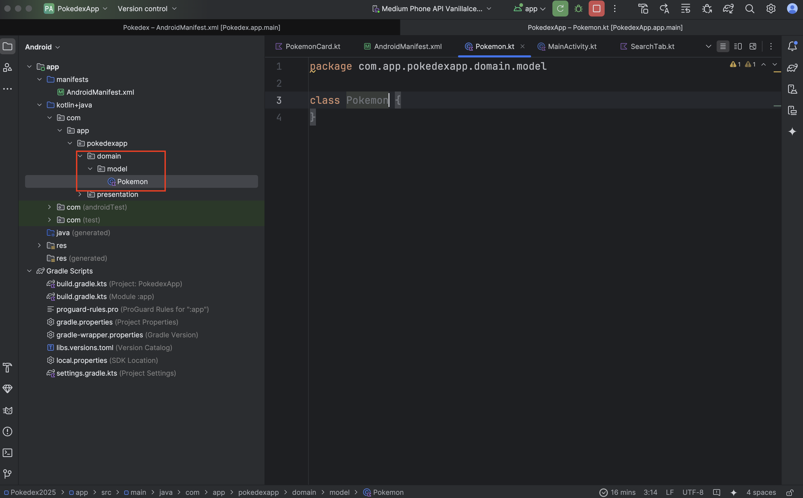
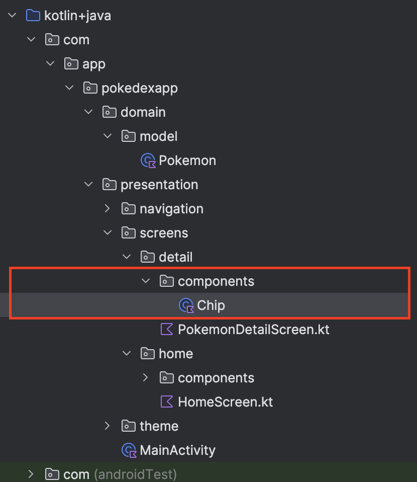
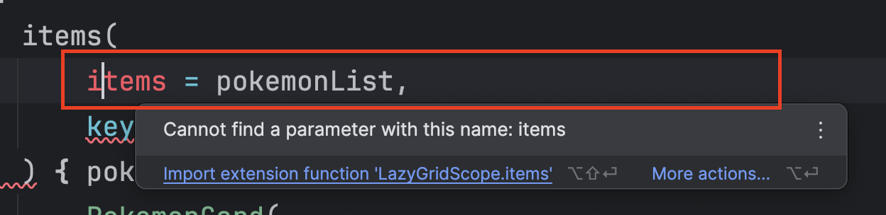
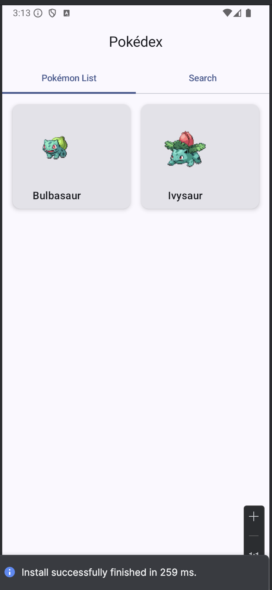
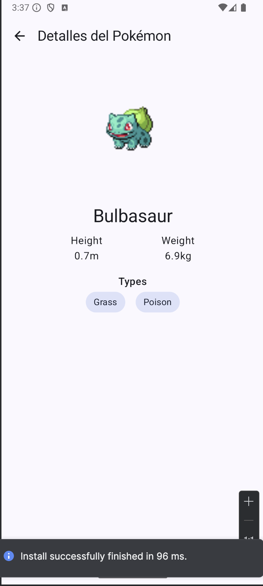

# 3 - Modelos y Listas

## Objetivo

El Laboratorio 4 tiene como objetivo introducir el modelado de datos y su integración con la interfaz de usuario, centrándose en:

1. Modelado de datos con Data Classes en Kotlin
2. Uso de datos mock estructurados
3. Implementación de listas tipadas con LazyVerticalGrid
4. Mejora de la UI usando datos reales (aunque simulados)
5. Navegación con parámetros tipados
6. Separación de la lógica de UI de los datos

Este laboratorio sirve como puente entre una UI estática y una aplicación con datos estructurados, preparando el terreno para la integración con APIs en laboratorios posteriores.

## Instrucciones

Sigue los pasos descritos en la siguiente práctica, si tienes algún problema no olvides que tus profesores están para apoyarte.

## Laboratorio
### Paso 1 Actualización de estructura del proyecto

Vamos a empezar actualizando las capas y creando los archivos que corresponden a este laboratorio, para ello te comparto la estructura actualizada que veremos en este laboratorio.

````
app/
├── domain/                          # NUEVO en Lab 4
│   └── model/
│       └── Pokemon.kt              # Modelo de datos
└── presentation/
   ├── MainActivity.kt             # Sin cambios del Lab 3
   ├── navigation/
   │   └── NavGraph.kt            # Sin cambios
   ├── screens/
   │   ├── home/
   │   │   ├── HomeScreen.kt      # Actualizado para usar modelo
   │   │   └── components/
   │   │       ├── PokemonCard.kt    # Actualizado para usar modelo
   │   │       ├── PokemonListTab.kt # Actualizado para usar modelo
   │   │       └── SearchTab.kt      # Sin cambios
   │   └── detail/
   │       ├── PokemonDetailScreen.kt # Actualizado para usar modelo
   │       └── components/            # NUEVO
   │           └── Chip.kt           # NUEVO
   └── theme/                      # Sin cambios
       ├── Color.kt
       ├── Theme.kt
       └── Type.kt
````

Diagrama de paquetes:



````
@startuml ComponentDiagram
package "domain" {
   package "model" {
       [Pokemon]
   }
}

package "presentation" {
   package "navigation" {
       [NavGraph]
   }
   
   package "screens" {
       package "home" {
           [HomeScreen]
           package "components" {
               [PokemonCard]
               [PokemonListTab]
               [SearchTab]
           }
       }
       
       package "detail" {
           [PokemonDetailScreen]
           package "components" {
               [Chip]
           }
       }
   }
}

Pokemon <-- PokemonCard
Pokemon <-- PokemonListTab
Pokemon <-- PokemonDetailScreen
@enduml
````

Diagrama de secuencia:



````
@startuml Sequence
actor User
participant HomeScreen
participant PokemonListTab
participant PokemonCard
participant Pokemon
participant PokemonDetailScreen

User -> HomeScreen: Inicia App
activate HomeScreen

HomeScreen -> Pokemon: getMockData()
activate Pokemon
Pokemon --> HomeScreen: List<Pokemon>
deactivate Pokemon

HomeScreen -> PokemonListTab: pokemonList
activate PokemonListTab

PokemonListTab -> PokemonCard: pokemon
activate PokemonCard

User -> PokemonCard: Click
PokemonCard -> HomeScreen: onPokemonClick(pokemon.id)

HomeScreen -> PokemonDetailScreen: navigate(id)
activate PokemonDetailScreen

PokemonDetailScreen -> Pokemon: getMockData().find { it.id == id }
activate Pokemon
Pokemon --> PokemonDetailScreen: Pokemon
deactivate Pokemon

@enduml
````

Diagrama de clases



````
@startuml DataModel
' Modelo de dominio
class Pokemon {
   +id: String
   +name: String
   +imageUrl: String
   +weight: Int
   +height: Int
   +types: List<String>
   
   {static} +getMockData(): List<Pokemon>
}

' Componentes de UI
class HomeScreen {
   -pokemonList: List<Pokemon>
   +onPokemonClick: (String) -> Unit
}

class PokemonListTab {
   +pokemonList: List<Pokemon>
   +onPokemonClick: (String) -> Unit
}

class PokemonCard {
   +pokemon: Pokemon
   +onClick: () -> Unit
}

class SearchTab {
   +onPokemonClick: (String) -> Unit
}

class PokemonDetailScreen {
   +pokemonId: String
   +onBackClick: () -> Unit
   -pokemon: Pokemon?
}

class Chip {
   +type: String
}

' Relaciones
HomeScreen --> PokemonListTab
HomeScreen --> SearchTab
PokemonListTab --> PokemonCard
PokemonDetailScreen --> Chip
Pokemon <-- PokemonCard : uses
Pokemon <-- PokemonDetailScreen : uses
Pokemon <-- PokemonListTab : uses

note right of Pokemon : "Modelo de datos principal"
note right of HomeScreen : "Gestiona tabs y navegación"
note right of PokemonListTab : "Muestra grid de pokémon"
note right of PokemonDetailScreen : "Muestra detalles del pokémon"
@enduml
````

Vamos a comenzar con nuestro proyecto. Abre Android Studio, desde donde nos quedamos la última vez y en la estructura del proyecto vamos a crear un nuevo paquete al mismo nivel del que ya tenemos de **presentation**, a este nuevo paquete le llamaremos **domain**. El resultado se deberá ver como lo siguiente:



Para recordar un poco, las capas **domain** y **presentation** son parte de una Clean Architecture. Aún no vamos a entrar en la descripción completa de su significado, pero si vamos a ir definiendo cada capa.

Con lo que llevamos hasta ahora tendríamos algo como lo siguiente:



````
@startuml
package "presentation" {
    [UI Components]
    [ViewModels]
}

package "domain" {
    [Business Logic]
    [Models]
    [Use Cases]
}

cloud "User" {
    [Screen]
}

[Screen] --> [UI Components]
[UI Components] --> [ViewModels]
[ViewModels] --> [Use Cases]
[Use Cases] --> [Models]
[Use Cases] --> [Business Logic]

note right of [UI Components] : "Cómo se muestra"
note right of [Models] : "Qué se muestra"
note "Reglas de negocio\ny lógica core" as N1
[Business Logic] .. N1

@enduml
````

**Domain Layer (Qué)**

- Contiene la lógica de negocio
- Define modelos y reglas
- Independiente de la UI
- No conoce cómo se muestran los datos
- Ejemplo: Modelo Pokemon con sus propiedades y reglas

**Presentation Layer (Cómo)**

- Maneja la UI y su lógica
- Decide cómo mostrar los datos
- Maneja interacciones del usuario
- No contiene lógica de negocio
- Ejemplo: PokemonCard que muestra el modelo Pokemon

**En este laboratorio:**

- Domain: Define qué es un Pokemon
- Presentation: Define cómo mostrar un Pokemon

Con eso dicho ahora dentro de **domain** vamos a crear el paquete de **model** y dentro del mismo el archivo Pokemon.kt.

**Nota: recuerda que no es necesario agregar la extensión .kt al crear un nuevo archivo de Kotlin.**



Por último vamos a desplegar nuestro paquete **presentation>>detail** y vamos a crear uno nuevo de **components** así como tenemos en el **home**.

Dentro de este vamos a crear un archivo que llamaremos Chip.kt



Ahora necesitamos agregar los datos necesarios, y actualizar nuestros componentes ya existentes.

### Paso 2 Trabajar en la capa de modelo

En el paso anterior creamos el archivo **Pokemon** el código base generado es el siguiente

````
class Pokemon {}
````

Como vimos en el laboratorio anterior, no todo deberá estar en clases para un proyecto de Android para funcionar, en el caso de Compose basta que generemos funciones en el formato PascalCase aunque no estén referenciadas a una clase concreta.

De manera similar pasará con esta clase Pokemon, y es que no usaremos una clase tradicional, usaremos un data class.

Veamos el código que necesitas agregar a este archivo sustituyendo el que viene por default.

````
data class Pokemon(
    val id: String,
    val name: String,
    val imageUrl: String,
    val weight: Int,
    val height: Int,
    val types: List<String>,
) {
    companion object {
        fun getMockData(): List<Pokemon> =
            listOf(
                Pokemon(
                    id = "1",
                    name = "Bulbasaur",
                    imageUrl = "https://raw.githubusercontent.com/PokeAPI/sprites/master/sprites/pokemon/1.png",
                    weight = 69,
                    height = 7,
                    types = listOf("grass", "poison"),
                ),
                Pokemon(
                    id = "2",
                    name = "Ivysaur",
                    imageUrl = "https://raw.githubusercontent.com/PokeAPI/sprites/master/sprites/pokemon/2.png",
                    weight = 130,
                    height = 10,
                    types = listOf("grass", "poison"),
                ),
                // Agregar más Pokémon mock...
            )
    }
}
````

Vayamos analizando los nuevos conceptos que hemos introducido en este archivo:

1. **Data Class** - La palabra clave data en Kotlin crea una clase especialmente diseñada para mantener datos. Cuando declaras una clase como data class, Kotlin automáticamente genera varios métodos útiles.

En otros lenguajes y sobre todo en formas antiguas de trabajo con Programación Orientada a Objetos debías generar algo como lo siguiente

````
// Una clase regular requeriría escribir todo esto manualmente
class PokemonRegular(
    val id: String,
    val name: String
) {
    override fun toString(): String {
        return "Pokemon(id=$id, name=$name)"
    }
    
    override fun equals(other: Any?): Boolean {
        // Implementación manual de equals
    }
    
    override fun hashCode(): Int {
        // Implementación manual de hashCode
    }
}
````

La ventaja de usar un data class es que podemos ahorrarnos todo este código haciendo la siguiente declaración:

````
// Data class genera todo automáticamente
data class PokemonData(
    val id: String,
    val name: String
)
````

Al final del día ambas declaraciones son equivalentes, pero desde un punto de vista de código limpio, la mejor implementación es la de abajo pues realiza lo mismo con menos líneas de código y por tanto es más fácil de entender.

Los métodos que Kotlin genera automáticamente para una data class son:

- toString(): Para representación en texto
- equals()/hashCode(): Para comparaciones
- copy(): Para crear copias modificadas
- componentN(): Para destructuración, no muy usado bajo ciertas circunstancias.

2. **Companion Object** - El companion object es la forma que tiene Kotlin de implementar el patrón Singleton y métodos/propiedades estáticas. Es similar a los métodos static en Java, pero con más flexibilidad:

````
data class Pokemon(
    val id: String,
    val name: String
) {
    companion object {
        // Esto es accesible como Pokemon.getMockData()
        fun getMockData(): List<Pokemon> = listOf(/* ... */)
        
        // En Java sería:
        // public static List<Pokemon> getMockData() { ... }
    }
}
````

¿Por qué usar data class en lugar de class?

Ventajas de usar data class:

- Menos código boilerplate: No necesitas escribir manualmente métodos comunes
- Inmutabilidad por defecto: Al usar val, los campos son inmutables
- Funcionalidad de copia: El método copy() permite crear variantes fácilmente
- Destructuración: Puedes descomponer objetos en variables

````
// Con una data class
data class Pokemon(val name: String, val type: String)

val bulbasaur = Pokemon("Bulbasaur", "Grass")
val (name, type) = bulbasaur  // Destructuración
val ivysaur = bulbasaur.copy(name = "Ivysaur")  // Copia modificada
println(bulbasaur)  // Impresión legible automática

// Comparación automática
val pokemon1 = Pokemon("Bulbasaur", "Grass")
val pokemon2 = Pokemon("Bulbasaur", "Grass")
println(pokemon1 == pokemon2)  // true
````

- Una **data class** es como una "clase especial" diseñada para guardar información de manera organizada.
- El **companion object** es como una "caja de herramientas" que contiene funciones útiles que pueden usarse sin crear un objeto de la clase.
- Usar **data class** es como tener un asistente que hace automáticamente todo el trabajo repetitivo por ti.

Perfecto, ya tenemos la base de nuestra capa de datos para el proyecto, los datos que estamos introduciendo al Pokemon, son los que vamos a necesitar de aquí en adelante, dependiendo de tus proyectos tu decidirás cuales son los más recomendables.

Por su parte la función **getMockData()** será una función temporal, pues solo la usaremos en este laboratorio para simular algunos Pokemon y poder pintarlos en pantalla.

### Paso 3 Actualizando archivos existentes (lista pokemon)

Para actualizar nuestra interfaz, vamos a comenzar actualizando la lista de Pokemon, esto para recibir los datos desde nuestro modelo y hacer que **presentation** solo se preocupe por cargar la UI.

Abre el archivo **HomeScreen** recuerda que puedes buscarlo rápidamente con ctrl+shift+O o cmd+shift+O según tu Sistema Operativo.

Debajo de 

```
val tabs = listOf("Pokémon List", "Search")
```

Agrega la siguiente línea

````
val mockPokemonList = remember { Pokemon.getMockData() }
````

Realiza el **import** correspondiente ya que tienes la data class Pokemon.

Y ahora dentro del **when** que divide nuestras pantallas:

````
when (selectedTabIndex) {
    0 -> PokemonListTab(onPokemonClick = onPokemonClick)
    1 -> SearchTab(onPokemonClick = onPokemonClick)
}
````

Realiza la siguiente modificación al **PokemonListTab**

````
when (selectedTabIndex) {
    0 ->
        PokemonListTab(
            pokemonList = mockPokemonList,
            onPokemonClick = onPokemonClick,
        )
    1 -> SearchTab(onPokemonClick = onPokemonClick)
}
````

Como puedes ver, lo que hicimos fue declarar una forma de obtener una lista de Pokemon y después se la pasamos al PokemonListTab.

Ahora abre el archivo de **PokemonListTab** y en su declaración:

````
@Composable
fun PokemonListTab(onPokemonClick: (String) -> Unit) {
    ...Código previo sin modificar
}
````

Actualiza el parámetro que acabamos de agregar

````
fun PokemonListTab(
    pokemonList: List<Pokemon>,
    onPokemonClick: (String) -> Unit,
) {
    ...Código previo sin modificar
}
````

Realiza el **import** correspondiente de la clase Pokemon.

Pr último vamos a actualizar el código de **items**, esto es obvio en el sentido que antes teníamos:

````
// Mock data para el Lab 3
items(5) { index ->
    PokemonCard(
        name = "Pokemon ${index + 1}",
        imageUrl = "https://raw.githubusercontent.com/PokeAPI/sprites/master/sprites/pokemon/${index + 1}.png",
        onClick = { onPokemonClick(index.toString()) },
    )
}
````

Aquí al iniciar contábamos 5 cartas simples de Pokemon, pero ahora que recibimos la lista desde la capa de **model**, delegamos toda esa responsabilidad de **presentation**. El resultado sería:

````
items(
    items = pokemonList,
    key = { it.id },
) { pokemon ->
    PokemonCard(
        pokemon = pokemon,
        onClick = { onPokemonClick(pokemon.id) },
    )
}
````

Esto nos llevará a actualizar **PokemonCard**, abre el archivo y en la declaración de parámetros tenemos lo siguiente:

````
@Composable
fun PokemonCard(
    name: String,
    imageUrl: String,
    onClick: () -> Unit,
) {
    ...Código previo sin modificar
}
````

Aquí estábamos recibiendo, **name** e **imageUrl**, aunque el paso que realizaremos es obvio en el sentido de agregar el Pokemon, ponte a pensar como sería si solo pasáramos parámetros. Esta mala práctica es muy común en proyectos donde simplemente vamos agregando parámetros en el tiempo, llegando a tener métodos con muchísimos parámetros. Considera que una función que recibe más de 5 parámetros se vuelve difícil de entender, en cuyo caso una de las opciones es crear un objeto o clase para abstraer toda esa información, este es un principio básico de la Programación Orientada a Objetos que no debes olvidar.

Actualicemos nuestra función de **PokemonCard** entonces a los siguiente:

````
@Composable
fun PokemonCard(
    pokemon: Pokemon,
    onClick: () -> Unit,
) {
    ...Código previo sin modificar
}
````

Por último actualiza los parámetros de la clase Pokemon donde mara error:

````
AsyncImage(
    model = imageUrl,
    contentDescription = name,
    modifier =
        Modifier
            .size(120.dp)
            .padding(8.dp),
)

Text(
    text = name,
    style = MaterialTheme.typography.titleMedium,
    textAlign = TextAlign.Center,
)
````

Por lo siguiente:

````
AsyncImage(
    model = pokemon.imageUrl,
    contentDescription = pokemon.name,
    modifier =
        Modifier
            .size(120.dp)
            .padding(8.dp),
)

Text(
    text = pokemon.name,
    style = MaterialTheme.typography.titleMedium,
    textAlign = TextAlign.Center,
)
````

Ahora regresa a **PokemonListTab** y donde te marca el error en **items** pon el cursor encima para hacer el import que te sugiere:



Con esto se deberían solucionar los errores faltantes de esta clase.

Regresa a **HomeScreen** y se deberían corregir los errores de la clase.

Compila y ejecuta la aplicación, el resultado deberá verse como lo siguiente:



Analiza lo que hemos realizado hasta este punto y resuelve las dudas que tengas.

### Paso 4 Actualizando archivos existentes (detalle pokemon)

Ya que trabajamos con la lista de Pokemon, ahora vamos con el detalle del mismo.

Ahora vamos a abrir **PokemonDetailScreen** y arriba del **Scaffold** vamos a declarar la siguiente variable:

````
val mockPokemon =
        remember {
            Pokemon.getMockData().find { it.id == pokemonId }
        }
````

Esta variable evolucionará en próximos laboratorios, pero por el momento solo nos interesa obtener el Pokemon del cual venimos en la lista.

Actualicemos el contenido del Scaffold que tenemos:

````
Column(
    modifier =
        Modifier
            .fillMaxSize()
            .padding(padding)
            .padding(16.dp),
    horizontalAlignment = Alignment.CenterHorizontally,
) {
    // Mock data para el Lab 3
    AsyncImage(
        model = "https://raw.githubusercontent.com/PokeAPI/sprites/master/sprites/pokemon/$pokemonId.png",
        contentDescription = "Pokemon $pokemonId",
        modifier = Modifier.size(200.dp),
    )

    Spacer(modifier = Modifier.height(16.dp))

    Text(
        text = "Pokemon #$pokemonId",
        style = MaterialTheme.typography.headlineMedium,
    )
}
````

Por los siguiente:

````
mockPokemon?.let { pokemon ->
    Column(
        modifier =
            Modifier
                .fillMaxSize()
                .padding(padding)
                .padding(16.dp),
        horizontalAlignment = Alignment.CenterHorizontally,
    ) {
        AsyncImage(
            model = pokemon.imageUrl,
            contentDescription = pokemon.name,
            modifier = Modifier.size(200.dp),
        )

        Spacer(modifier = Modifier.height(16.dp))

        Text(
            text = pokemon.name,
            style = MaterialTheme.typography.headlineMedium,
        )

        Spacer(modifier = Modifier.height(8.dp))

        // Basic info
        Row(
            modifier = Modifier.fillMaxWidth(),
            horizontalArrangement = Arrangement.SpaceEvenly,
        ) {
            Column(horizontalAlignment = Alignment.CenterHorizontally) {
                Text("Height")
                Text("${pokemon.height / 10.0}m")
            }
            Column(horizontalAlignment = Alignment.CenterHorizontally) {
                Text("Weight")
                Text("${pokemon.weight / 10.0}kg")
            }
        }

        Spacer(modifier = Modifier.height(16.dp))

        // Types
        Text("Types", style = MaterialTheme.typography.titleMedium)
        Row(
            horizontalArrangement = Arrangement.spacedBy(8.dp),
        ) {
            pokemon.types.forEach { type ->
                Chip(type = type)
            }
        }
    }
}
````

Aquí hemos introducido tanto las variables de altura y peso del Pokemon así como el elemento de tipo que contiene.

Al inicio de la declaración hacemos:

````
mockPokemon?.let { pokemon ->
}
````

Aquí utilizamos el método **.let**

El método let es una función de alcance (scope function) en Kotlin. Vamos a analizarlo en detalle:

1. Función de Alcance (Scope Function)
El let es una de las funciones de alcance que Kotlin proporciona para ejecutar un bloque de código dentro del contexto de un objeto.
2. ¿Qué hace específicamente let?
    - Crea un ámbito temporal.
    - Convierte el objeto en un parámetro (it por defecto).
    - Permite realizar operaciones con un objeto nullable de manera segura.
    - Retorna el resultado de la última expresión del bloque.


En el ejemplo que tenemos:

````
mockPokemon?.let { pokemon ->
    // Aquí 'pokemon' es una versión no-nullable de mockPokemon
    // El código aquí solo se ejecuta si mockPokemon no es null
}
````

4. Diferentes formas de usar let:

````
// Forma básica usando 'it' (implícito)
mockPokemon?.let {
    println(it.name)
}

// Con parámetro nombrado (como en tu ejemplo)
mockPokemon?.let { pokemon ->
    println(pokemon.name)
}

// Encadenando operaciones
mockPokemon?.let { pokemon ->
    println(pokemon.name)
    pokemon.types.size  // Este sería el valor retornado por let
}
````

5. ¿Por qué es útil?
    - Null Safety: Combinado con el operador ?., solo ejecuta el código si el objeto no es null.
    - Ámbito Limpio: Las variables declaradas dentro del let solo existen en ese bloque.
    - Transformación: Permite transformar un objeto y retornar algo diferente.

6. Comparación con código tradicional:
````
// Sin let
if (mockPokemon != null) {
    val pokemon = mockPokemon
    // usar pokemon...
}

// Con let
mockPokemon?.let { pokemon ->
    // usar pokemon...
}
````

7. Casos de uso comunes:
````
// Transformación de datos
val length = str?.let { it.length } ?: 0

// Operaciones encadenadas
mockPokemon?.let { pokemon ->
    pokemon.name
}?.let { name ->
    name.uppercase()
}

// Inicialización condicional
var processedPokemon = mockPokemon?.let { pokemon ->
    Pokemon(
        id = pokemon.id,
        name = pokemon.name.uppercase(),
        // ... más transformaciones
    )
}
````
8. Ventajas en el contexto de Android/Compose:
- Manejo seguro de estados nullables
- Código más conciso y legible
- Facilita el manejo de transformaciones de datos
- Reduce la necesidad de verificaciones null explícitas

**"El let es como una 'sala segura' donde puedes trabajar con un objeto. Solo entras a esta sala si el objeto existe (no es null), y dentro puedes hacer lo que necesites con él sin preocuparte por si es null o no."**

Ahora, el objeto puede ser nulo debido a que lo buscamos dentro de nuestra lista, si bien contextualmente sabemos que nunca puede ser nulo, quizá en otro momento pueda serlo ya que no puede depender de nosotros como en una llamada a un API. Es en estos casos que este uso se vuelve imprescindible al momento de trabajar con objetos.

Por último nos marca error en la clase **Chip**, que es un Composable que no hemos trabajado aún, abre el archivo **Chip**.

Este Composable solo nos servirá para crear un pequeño badge que distinga a los Pokemon en cuestión de sus tipos. Si eres fan del juego será algo más a lo que estamos acostumbrados visualmente.

Agrega al archivo el siguiente código:

````
@Suppress("ktlint:standard:function-naming")
@Composable
fun Chip(type: String) {
    Surface(
        modifier = Modifier.padding(4.dp),
        shape = RoundedCornerShape(16.dp),
        color = MaterialTheme.colorScheme.secondaryContainer,
    ) {
        Text(
            text = type.replaceFirstChar { it.uppercase() },
            modifier = Modifier.padding(horizontal = 12.dp, vertical = 6.dp),
            style = MaterialTheme.typography.bodyMedium,
        )
    }
}
````

Regresa a PokemonDetailScreen y realiza el **import** faltante de **Chip**.

**No olvides que debes separar los componentes de tus vistas para tener un código más legible y sencillo de entender.**

Compila y ejecuta la aplicación, si entras a cualquiera de los 2 que tenemos deberás ver algo como lo siguiente:



Éxito, no solo hemos actualizado nuestra interfaz, sino que también hemos delegado la lógica de datos de los Pokemon de la capa **presentation** a la capa **domain**.

## Resumen

Objetivos Principales:

- Introducción al modelado de datos con Kotlin
- Implementación de listas tipadas
- Uso de datos mock estructurados
- Mejora de UI con datos reales simulados

Componentes Clave:

- Data Class Pokemon para estructura de datos
- LazyVerticalGrid para listas eficientes
- Navegación con parámetros tipados
- Componentes UI actualizados para usar el modelo

Conceptos Introducidos:

- Clean Architecture (capas domain y presentation)
- Data Classes en Kotlin
- Listas y grids en Compose
- Separación de datos y UI

Mejoras sobre Lab 3:

- De UI estática a datos estructurados
- Mejor organización del código
- Preparación para integración con API real
- Componentes reutilizables y tipados

Este laboratorio sirve como puente entre la UI básica del Lab 3 y la integración con APIs del Lab 5.