# 4 - Consumiendo APIs

## Objetivo

Este laboratorio tiene como objetivo principal transformar nuestra aplicación con datos mock a una aplicación que consume datos reales de una API, introduciendo conceptos fundamentales de arquitectura y patrones de diseño.
Objetivos Principales:

1. MVVM + Clean architecture

- Integrar patrón MVVM
    - View (Composables)
    - ViewModel (Estado y lógica de UI)
    - Model (Datos y lógica de negocio)
- Implementar Clean Architecture completa.
- Manejar ciclo de vida de los componentes.
- Separar responsabilidades en capas (data, domain, presentation)
- Establecer flujo de datos unidireccional

2. Conexión a API

- Integrar Retrofit para llamadas a PokeAPI
- Manejar respuestas y errores de red
- Convertir datos de API a modelos de dominio

3. Gestión de Estado

- Introducir ViewModels
- Manejar estados de UI (loading, error, success)
- Implementar flujos de datos con Kotlin Flow


4. Inyección de Dependencias

- Configurar Hilt
- Gestionar dependencias de forma eficiente
- Facilitar testing y mantenimiento


5. Patrones de Diseño

- Repository Pattern
- Use Cases
- Mappers
- State Pattern

Este laboratorio representa un salto significativo en complejidad, pasando de una app estática a una aplicación real con datos dinámicos y manejo de estados.

## Instrucciones

Sigue los pasos descritos en la siguiente práctica, si tienes algún problema no olvides que tus profesores están para apoyarte.

## Laboratorio
### Paso 1 Entender la estructura del proyecto

Vamos a empezar actualizando las capas y creando los archivos que corresponden a este laboratorio, para ello te comparto la estructura actualizada que veremos en este laboratorio.

````
app/
├── di/                            # NUEVO en Lab 5
│   └── AppModule.kt              # NUEVO - Módulo de Hilt
├── data/                         # NUEVO en Lab 5
│   ├── remote/
│   │   ├── api/
│   │   │   └── PokemonApi.kt    # NUEVO - Interface de Retrofit
│   │   └── dto/
│   │       ├── PokemonDto.kt    # NUEVO - Modelos de respuesta
│   │       └── PokemonListDto.kt
│   ├── repository/
│   │   └── PokemonRepositoryImpl.kt  # NUEVO - Implementación
│   └── mapper/
│       └── PokemonMapper.kt      # NUEVO - Conversión DTO a Domain
├── domain/
│   ├── model/
│   │   └── Pokemon.kt           # Sin cambios del Lab 4
│   ├── repository/              # NUEVO en Lab 5
│   │   └── PokemonRepository.kt # NUEVO - Interface del repositorio
│   └── usecase/                 # NUEVO en Lab 5
│       ├── GetPokemonListUseCase.kt  # NUEVO
│       └── GetPokemonUseCase.kt      # NUEVO
└── presentation/
   ├── MainActivity.kt           # Actualizado con @AndroidEntryPoint
   ├── navigation/
   │   └── NavGraph.kt          # Sin cambios
   ├── screens/
   │   ├── home/
   │   │   ├── HomeScreen.kt    # Actualizado para usar ViewModel
   │   │   ├── HomeViewModel.kt # NUEVO
   │   │   ├── HomeUiState.kt  # NUEVO
   │   │   └── components/     # Actualizado para usar estados
   │   └── detail/
   │       ├── PokemonDetailScreen.kt # Actualizado para usar ViewModel
   │       ├── PokemonDetailViewModel.kt # NUEVO
   │       ├── PokemonDetailUiState.kt  # NUEVO
   │       └── components/
   └── common/                  # NUEVO en Lab 5
       └── Result.kt           # NUEVO - Wrapper de estados
````

Diagrama de paquetes:

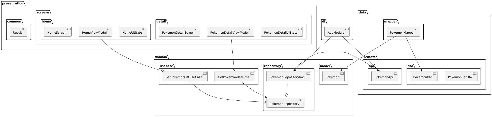

````
@startuml ComponentDiagram
package "presentation" {
   package "common" {
       [Result]
   }
   package "screens" {
       package "home" {
           [HomeScreen]
           [HomeViewModel]
           [HomeUiState]
       }
       package "detail" {
           [PokemonDetailScreen]
           [PokemonDetailViewModel]
           [PokemonDetailUiState]
       }
   }
}

package "domain" {
   package "model" {
       [Pokemon]
   }
   package "repository" {
       [PokemonRepository]
   }
   package "usecase" {
       [GetPokemonListUseCase]
       [GetPokemonUseCase]
   }
}

package "data" {
   package "remote" {
       package "api" {
           [PokemonApi]
       }
       package "dto" {
           [PokemonDto]
           [PokemonListDto]
       }
   }
   package "repository" {
       [PokemonRepositoryImpl]
   }
   package "mapper" {
       [PokemonMapper]
   }
}

package "di" {
   [AppModule]
}

' Relaciones
HomeViewModel --> GetPokemonListUseCase
PokemonDetailViewModel --> GetPokemonUseCase
GetPokemonListUseCase --> PokemonRepository
GetPokemonUseCase --> PokemonRepository
PokemonRepositoryImpl ..|> PokemonRepository
PokemonRepositoryImpl --> PokemonApi
PokemonMapper --> PokemonDto
PokemonMapper --> Pokemon
AppModule --> PokemonApi
AppModule --> PokemonRepositoryImpl
@enduml
````

Diagrama de secuencia

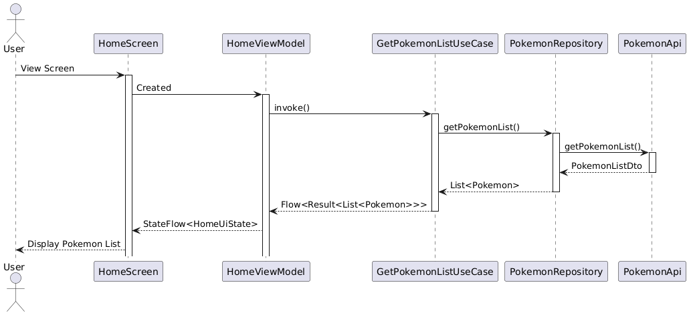

````
@startuml MVVM_Flow
actor User
participant HomeScreen
participant HomeViewModel
participant GetPokemonListUseCase
participant PokemonRepository
participant PokemonApi

User -> HomeScreen: View Screen
activate HomeScreen

HomeScreen -> HomeViewModel: Created
activate HomeViewModel

HomeViewModel -> GetPokemonListUseCase: invoke()
activate GetPokemonListUseCase

GetPokemonListUseCase -> PokemonRepository: getPokemonList()
activate PokemonRepository

PokemonRepository -> PokemonApi: getPokemonList()
activate PokemonApi

PokemonApi --> PokemonRepository: PokemonListDto
deactivate PokemonApi

PokemonRepository --> GetPokemonListUseCase: List<Pokemon>
deactivate PokemonRepository

GetPokemonListUseCase --> HomeViewModel: Flow<Result<List<Pokemon>>>
deactivate GetPokemonListUseCase

HomeViewModel --> HomeScreen: StateFlow<HomeUiState>
HomeScreen --> User: Display Pokemon List

@enduml
````

Diagrama Clean Architecture y sus responsabilidades

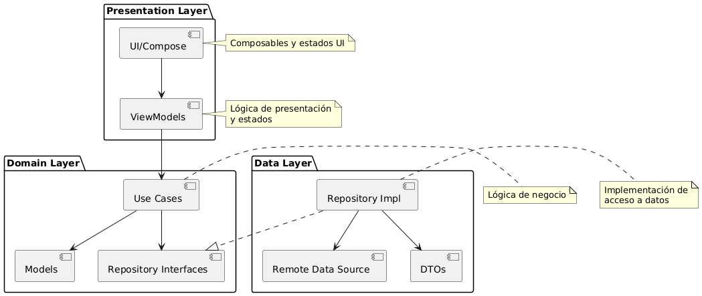

````
@startuml CleanArchitecture
package "Presentation Layer" {
    [UI/Compose]
    [ViewModels]
}

package "Domain Layer" {
    [Use Cases]
    [Repository Interfaces]
    [Models]
}

package "Data Layer" {
    [Repository Impl]
    [Remote Data Source]
    [DTOs]
}

[UI/Compose] --> [ViewModels]
[ViewModels] --> [Use Cases]
[Use Cases] --> [Repository Interfaces]
[Use Cases] --> [Models]
[Repository Impl] ..|> [Repository Interfaces]
[Repository Impl] --> [Remote Data Source]
[Repository Impl] --> [DTOs]

note right of [UI/Compose]
  Composables y estados UI
end note

note right of [ViewModels]
  Lógica de presentación
  y estados
end note

note right of [Use Cases]
  Lógica de negocio
end note

note right of [Repository Impl]
  Implementación de
  acceso a datos
end note
@enduml
````

Diagrama de clases

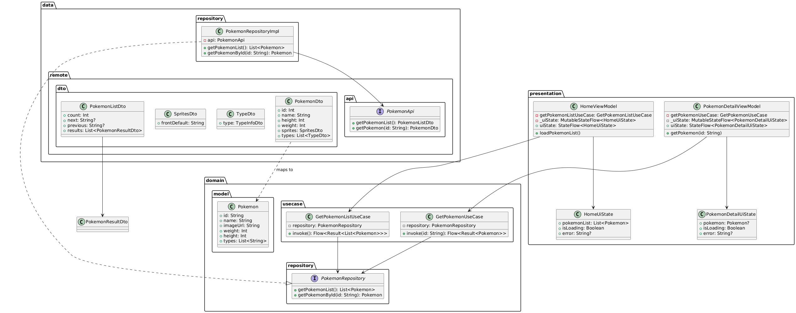

````
@startuml ClassDiagram

' Modelos
package "domain.model" {
   class Pokemon {
       +id: String
       +name: String
       +imageUrl: String
       +weight: Int
       +height: Int
       +types: List<String>
   }
}

' DTOs
package "data.remote.dto" {
   class PokemonDto {
       +id: Int
       +name: String
       +height: Int
       +weight: Int
       +sprites: SpritesDto
       +types: List<TypeDto>
   }
   
   class SpritesDto {
       +frontDefault: String
   }
   
   class TypeDto {
       +type: TypeInfoDto
   }
   
   class PokemonListDto {
       +count: Int
       +next: String?
       +previous: String?
       +results: List<PokemonResultDto>
   }
}

' API
package "data.remote.api" {
   interface PokemonApi {
       +getPokemonList(): PokemonListDto
       +getPokemon(id: String): PokemonDto
   }
}

' Repository
package "domain.repository" {
   interface PokemonRepository {
       +getPokemonList(): List<Pokemon>
       +getPokemonById(id: String): Pokemon
   }
}

package "data.repository" {
   class PokemonRepositoryImpl {
       -api: PokemonApi
       +getPokemonList(): List<Pokemon>
       +getPokemonById(id: String): Pokemon
   }
}

' Use Cases
package "domain.usecase" {
   class GetPokemonListUseCase {
       -repository: PokemonRepository
       +invoke(): Flow<Result<List<Pokemon>>>
   }
   
   class GetPokemonUseCase {
       -repository: PokemonRepository
       +invoke(id: String): Flow<Result<Pokemon>>
   }
}

' ViewModels
package "presentation" {
   class HomeViewModel {
       -getPokemonListUseCase: GetPokemonListUseCase
       -_uiState: MutableStateFlow<HomeUiState>
       +uiState: StateFlow<HomeUiState>
       +loadPokemonList()
   }
   
   class PokemonDetailViewModel {
       -getPokemonUseCase: GetPokemonUseCase
       -_uiState: MutableStateFlow<PokemonDetailUiState>
       +uiState: StateFlow<PokemonDetailUiState>
       +getPokemon(id: String)
   }
   
   class HomeUiState {
       +pokemonList: List<Pokemon>
       +isLoading: Boolean
       +error: String?
   }
   
   class PokemonDetailUiState {
       +pokemon: Pokemon?
       +isLoading: Boolean
       +error: String?
   }
}

' Relaciones
PokemonRepositoryImpl ..|> PokemonRepository
PokemonRepositoryImpl --> PokemonApi
GetPokemonListUseCase --> PokemonRepository
GetPokemonUseCase --> PokemonRepository
HomeViewModel --> GetPokemonListUseCase
PokemonDetailViewModel --> GetPokemonUseCase
HomeViewModel --> HomeUiState
PokemonDetailViewModel --> PokemonDetailUiState
PokemonDto ..> Pokemon : maps to
PokemonListDto --> PokemonResultDto

@enduml
````

Vamos a comenzar con nuestro proyecto. Abre Android Studio, desde donde nos quedamos la última vez.

Para introducirnos en el mundo de la arquitectura de software vamos a comenzar desde lo que ya conoces que es el Modelo Vista Controlador, para ello usaremos una analogía de un restaurante y de ahí vamos a ir desarrollando los conceptos.

1. Modelo Vista Controlador (MVC) - La Base
Analogía del Restaurante:

    - Modelo (Cocina): Prepara y maneja la comida
    - Vista (Sala del restaurante): Lo que ve el cliente
    - Controlador (Mesero): Comunica las órdenes y trae la comida

2. MVVM (Model-View-ViewModel)
Evolución del MVC, usando la misma analogía del restaurante:

- Model (Cocina): Igual que en MVC, maneja los datos y reglas
- View (Sala del restaurante): Ahora es más "tonta", solo muestra lo que le digan
- ViewModel (Pantalla de órdenes digital):
    - Reemplaza al mesero
    - Muestra el estado actual de las órdenes
    - La sala solo necesita **observar** la pantalla
    - La cocina actualiza la pantalla

Ventajas sobre MVC:

- La View no necesita pensar, solo observa y muestra
- El ViewModel no conoce específicamente a la View
- Mejor para actualizaciones en tiempo real

Si bien un patrón MVC aún es muy usado dentro del ámbito web, esto no es necesariamente igual en las aplicaciones móviles, al menos en Android MVVM es el patrón oficial de desarrollo de aplicaciones para mantener un estándar.

Ahora introduzcamos a la ecuación la Clean Architecture:

3. Clean Architecture
Analogía de una Ciudad:

- Capa Externa (Data): Carreteras y puentes (infraestructura)
- Capa Media (Domain): Leyes y regulaciones (reglas de negocio)
- Capa Interna (Presentation): Experiencia del ciudadano (UI)

**Regla de Oro: Las capas internas no conocen a las externas**
- Una ley no depende de qué carretera uses
- Un ciudadano no necesita saber cómo funciona el sistema de agua

4. MVVM + Clean Architecture
¿Por qué funcionan bien juntos?

- MVVM se encarga del "Cómo" mostrar
- Clean Architecture se encarga del "Qué" mostrar

En nuestra app Pokédex:

- Clean determina:
    - Qué es un Pokémon (Model)
    - Cómo obtenerlo (Repository)
    - Qué operaciones son posibles (Use Cases)

- MVVM determina:
    - Cómo mostrar la lista (View)
    - Cómo manejar estados de carga (ViewModel)
    - Cómo reaccionar a interacciones (ViewModel)

**MVVM (Horizontalmente - Tecnología)**

````
View ←→ ViewModel ←→ Model
│        │           │
UI       Estados     Datos
Compose  Flows       API/DB
````

- Se enfoca en el "cómo" técnico
- Maneja el ciclo de vida de Android
- Gestiona estados y UI
- Maneja la reactividad
- Sobrevive cambios de configuración

**Clean Architecture (Verticalmente - Negocio)**

````
┌─ Feature 1 ─┐ ┌─ Feature 2 ─┐
│ UI          │ │ UI          │
│ ViewModel   │ │ ViewModel   │
│ UseCase     │ │ UseCase     │
│ Repository  │ │ Repository  │
└─────────────┘ └─────────────┘
````

- Organiza las reglas de negocio
- Separa features
- Define el "qué" hace la aplicación
- Independiente de la tecnología
- Facilita testing y mantenimiento

### Paso 2 Capa de datos (Data Layer)

Con nuestro proyecto de Android abierto vamos a crear la capa de datos, para ello vamos a crear un nuevo paquete, como hicimos previamente con la capa **domain** y **presentation**, este nuevo paquete lo llamaremos **data**.

Dentro del paquete de **data** crearemos 3 paquetes adicionales:

- **remote** - Sirve para identificar la capa de datos remotos, en este caso nuestra conexión con el API.
- **repository** - Sirve para recolectar la información de nuestras fuentes de datos, por ahora solo tenemos remote, pero podríamos tener una local por ejemplo.
- **mapper** - Sirve para transformar los receptores de las fuentes de información en algo universal que se maneje dentro de la aplicación, esto derivado a que un API puede regresar su propia información, y una fuente local puede tener variaciones, esto nos ayuda que sin importar de donde venga la información, la capa de **domain** no se preocupará por como vengan los datos, siempre serán los mismos.

Ahora bien, dentro de **remote** crearemos otros 2 paquetes:

- **api** - Contendrá las url y las llamadas a internet con la estructura de la PokeAPI.
- **dto** - Serán los **data classes** que contendrán los datos que contienen las respuestas del API, es decir serán el mapeo de los JSON como regresa la información la PokeAPI.

El resultado de los paquetes será el siguiente:

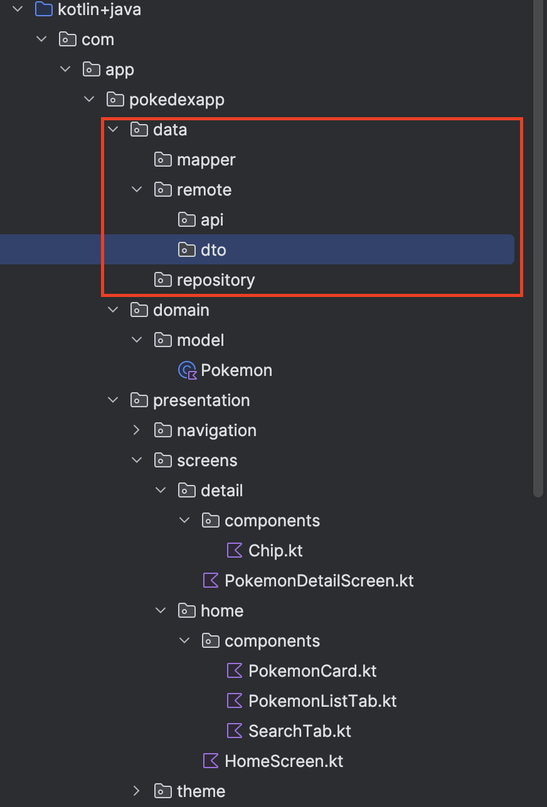

Ya que tenemos nuestros paquetes listos vamos a comenzar por los modelos o como ya mencionamos los **dto**.

Para conocer nuestra API, veamos lo siguiente:

Primero debemos identificar cual es la raíz de toda el API para poder manejarla, esto es, cual es la constante que tendremos que pasar a cada método cada vez que llamemos al API para evitar duplicar la URL en el código, dicho en otras palabras la **URL Base.**

```
https://pokeapi.co/api/v2/pokemon/?limit=20  
https://pokeapi.co/api/v2/pokemon/:number_pokemon/

https://pokeapi.co/api/v2/ //URL BASE
```

Tomando nuestras 2 APIs de referencia vamos a ver que la parte que se repite es justamente  [https://pokeapi.co/api/v2/](https://pokeapi.co/api/v2/), cuidado con incluir la parte de **pokemon** ya que esta es solo una parte del API, más no es para todo. 

Si lo queremos ver de otra forma uno de los módulos que incluye la PokeAPI es la del módulo **pokemon** y esta contiene varias URL que nos devuelven información.

Una vez identificada nuestra **URL Base** vamos a identificar la primera URL que nos regresa un número de Pokemon, al llamarla, el resultado que tendríamos sería más o menos como el siguiente:

````
{
    "count": 1281,
    "next": "https://pokeapi.co/api/v2/pokemon?offset=20&limit=20",
    "previous": null,
    "results": [
        {
            "name": "bulbasaur",
            "url": "https://pokeapi.co/api/v2/pokemon/1/"
        },
        {
            "name": "ivysaur",
            "url": "https://pokeapi.co/api/v2/pokemon/2/"
        }
    ]
}
````

Como ya mencionamos, los modelos de la capa de datos lo que hacen es mapear este JSON directamente en objetos **data class** para hacer fácil su uso dentro de nuestra aplicación.

Ahora entrando en la nomenclatura de los **dto**. DTO significa Data Transfer Object (Objeto de Transferencia de Datos). Se utilizan para:

- Transportar datos entre procesos o capas.
- Mapear respuestas de APIs.
- Separar la estructura de datos externa de nuestros modelos internos.

Por tanto lo primero que haremos será crear un archivo dentro del paquete **dto** al que llamaremos **PokemonListDto**. A este le agregaremos lo siguiente:

````
data class PokemonListDto(
    @SerializedName("count") val count: Int,
    @SerializedName("next") val next: String?,
    @SerializedName("previous") val previous: String?,
    @SerializedName("results") val results: List<PokemonResultDto>
)
````

Aquí tendremos 2 errores:

1. El import del @SerializedName - La anotación @SerializedName le dice a Gson cómo mapear los campos del JSON a las propiedades de nuestra clase Kotlin. Una forma fácil de verlo es que en el json tenemos **count**, esta llave es el valor que recibe el string del SerializedName, esto nos permite si queremos cambiar el nombre de la variable para nuestra aplicación, no es algo común cambiar los nombres pero en ocasiones sucede por ejemplo si tuvieras como llave "count_state" y para seguir el estándar de Kotlin necesitarías la variable countState.
2. Tenemos el llamado a PokemonResultDto que aún no hemos creado.

Entonces, realiza el import correspondiente para @SerializedName y vamos a crear el archivo **PokemonResultDto**, al cual agregaremos lo siguiente:

````
data class PokemonResultDto(
    @SerializedName("name") val name: String,
    @SerializedName("url") val url: String,
)
````

Finalmente crea otro archivo que llamaremos **PokemonDto** y agrega lo siguiente:

````
data class PokemonDto(
    @SerializedName("id") val id: Int,
    @SerializedName("name") val name: String,
    @SerializedName("height") val height: Int,
    @SerializedName("weight") val weight: Int,
    @SerializedName("sprites") val sprites: SpritesDto,
    @SerializedName("types") val types: List<TypeDto>
) {
    data class SpritesDto(
        @SerializedName("front_default") val frontDefault: String
    )
    
    data class TypeDto(
        @SerializedName("type") val type: TypeInfoDto
    ) {
        data class TypeInfoDto(
            @SerializedName("name") val name: String
        )
    }
}
````

Si has realizado los pasos hasta el momento, deberás contar con 3 archivos dentro del paquete de **dto**.

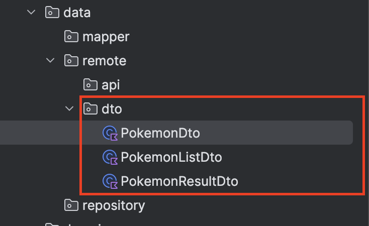

Ya que mapeamos la respuesta del API, es momento de configurar las llamadas a las url.

Vamos a crear el archivo **PokemonApi** dentro del paquete de **api**.

Este archivo será especial ya que será de tipo **interface**, y esto se debe a que dentro de retrofit, la librería que usaremos para hacer las llamadas, así solicita que se configure. POr tanto agrega al archivo **PokemonApi** lo siguiente:

````
interface PokemonApi {
    @GET("pokemon")
    suspend fun getPokemonList(
        @Query("limit") limit: Int = 20,
        @Query("offset") offset: Int = 0
    ): PokemonListDto

    @GET("pokemon/{id}")
    suspend fun getPokemon(@Path("id") id: String): PokemonDto
}
````

La siguiente nomenclatura no debería serte extraña en cuanto a que son los valores y parámetros que se utilizan en una url normal.

En este caso nuestras 2 url:

```
https://pokeapi.co/api/v2/pokemon/?limit=20  
https://pokeapi.co/api/v2/pokemon/10/
```

Podemos parametrizarlas de la siguiente manera, primero removiendo la BASE_URL, que mencionamos antes:

```
pokemon/?limit=20  
pokemon/10/
```

Ahora, entendamos que ambas url usan dentro del protocolo HTTP un GET y por tanto los parámetros que reciben vienen desde la misma url, a diferencia del POST en donde vienen desde el body de la llamada.

Ambas url si bien reciben desde la url sus parámetros, ambas lo hacen diferente:

````
https://pokeapi.co/api/v2/pokemon/?limit=20  
````

Para la primera se recibe **limit** pero esto lo hace desde el **query** de la url.

Para el caso de:

````
https://pokeapi.co/api/v2/pokemon/10/
````

Esta se recibe desde los parámetros o el **path** de la url.

Esto nos ayudará a entender mejor de donde vienen los nombres dentro de nuestro archivo **PokemonApi**.

````
@GET("pokemon")
suspend fun getPokemonList(
    @Query("limit") limit: Int = 20,
    @Query("offset") offset: Int = 0,
): PokemonListDto
````

Aquí vemos como se hace la llamada al **GET**, y se utilizan los parámetros del **Query** para pasar la información que necesita el API.

Para el segundo caso:

````
@GET("pokemon/{id}")
suspend fun getPokemon(
    @Path("id") id: String,
): PokemonDto
````

Aquí vemos que además de la llamada al **GET** dentro del string de la url tenemos **\{id\}**, este formato usando **\{\}** nos ayuda a definir *variables* en donde a través del **Path** podemos usarlas para introducir información a la url.

Por último vamos a crear el archivo PokemonMapper dentro de nuestro paquete de **mapper**, y el cual contendrá lo siguiente:

````
fun PokemonDto.toDomain(): Pokemon {
    return Pokemon(
        id = id.toString(),
        name = name.replaceFirstChar { it.uppercase() },
        imageUrl = sprites.frontDefault,
        weight = weight,
        height = height,
        types = types.map { it.type.name }
    )
}
````

Aquí estamos creando una **extension function**, a nuestro archivo y **data class** **PokemonDto**, el cual convertirá un objeto de dicho archivo a un objeto **Pokemon** de nuestra capa de **domain**, observa el caso particular de la imagen, si bien el PokeApi, tiene definido la imagen como **sprites.frontDefault** e incluso si buscas en la documentación oficial verás que hay varias formas en la imagen de los Pokemon, para nuestra aplicación solo necesitamos 1 imagen y por tanto nuestro objeto **Pokemon** simplifica su nombre a **imageUrl**, este tipo de adaptaciones nos permite que si n importar como vengan los datos los adaptemos a nuestra propia necesidad de uso.

Finalmente el resultado actual de nuestra capa de datos es el siguiente:

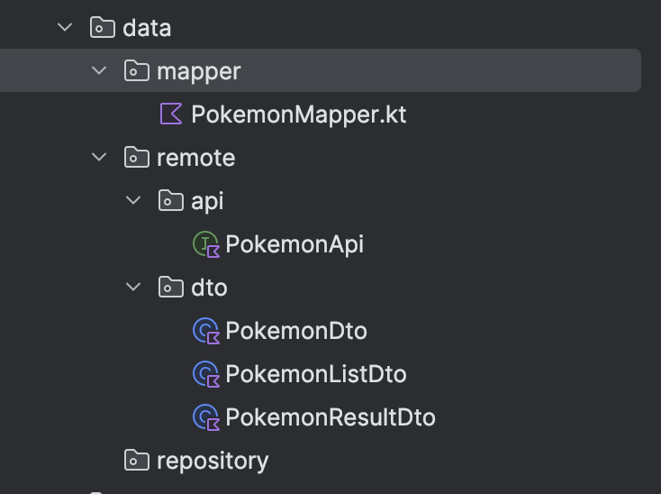

Pasaremos de momento del paquete **repository** esto con una buena razón que veremos en la capa de **domain**.

### Paso 3 Capa de dominio (Domain Layer)

Dentro de la capa **domain** actualmente ya contamos con un paquete, **Pokemon**, el cual tiene el mapeo general de un Pokemon para nuestra aplicación.

Ahora vamos a crear dentro de **domain** 3 paquetes:

- **repository** - que tendrá similitud al **repository** que dejamos previamente en **data**.
- **usecase** - este podrás encontrarlo en otras nomenclaturas también como **userstory**, **requirement**, el nombre en sí no importa tanto siempre que tengas claro que son los **features** y/o reglas de negocio que rigen nuestra aplicación, veremos un poco más a detalle en cuanto lleguemos a la implementación.
- **common** - Este paquete en otros proyectos podrás encontrarlo en diferentes capas, a veces en **domain**, a veces en **presentation** incluso fuera de las capas principales dentro de una capa común llamada **utils**, su posición no importa tanto pero debe de existir dentro de nuestra aplicación. **Nota: el ejemplo del repositorio de este laboratorio lo coloca dentro de presentation, para que lo tomes en cuenta.**

Empecemos creando nuestro archivos, dentro de **repository** crea **PokemonRepository** y agrega lo siguiente:

````
interface PokemonRepository {
    suspend fun getPokemonList(): List<Pokemon>
    suspend fun getPokemonById(id: String): Pokemon
}
````

El uso de una interfaz para PokemonRepository sigue el Principio de Inversión de Dependencias (DIP) de SOLID. Veamos esto con una analogía:
Imagina un control remoto universal:

- La interfaz es como el "estándar" de botones (on/off, volumen, etc.)
- No importa si conectas un TV Samsung, LG o Sony
- El control funciona igual con cualquier TV que siga ese estándar

Beneficios:

1. Abstracción
- Domain no necesita saber de dónde vienen los datos
- Podrían venir de API, base de datos, cache, etc.

2. Testing

````
class FakePokemonRepository : PokemonRepository {
    override suspend fun getPokemonList() = fakePokemonList
    override suspend fun getPokemonById(id) = fakePokemon
}
````

3. Flexibilidad

````
// Podemos tener múltiples implementaciones
class ApiPokemonRepository : PokemonRepository
class DbPokemonRepository : PokemonRepository
class CachePokemonRepository : PokemonRepository
````

4. Mantenibilidad

- Podemos cambiar la implementación sin tocar el resto del código
- Las reglas de negocio no dependen de detalles de implementación

La interfaz define "qué" hace el repositorio, mientras que la implementación define "cómo" lo hace.

Todo lo anterior lo hacemos, por que casi siempre en cualquier proyecto donde utilicemos un API, vamos a tener un espacio donde se use el obtener una lista de datos, y obtener un dato específico usando un id. Esto nos ayuda a generalizar la implementación reduciendo enormemente el código y simplificando la legibilidad. En un caso ideal toda esta implementación podría hacerse con solo 2 llamada hacía cualquier API, pero ese nivel de abstracción es para un desarrollo más avanzado.

Ahora bien, dentro de nuestro paquete **common** vamos a crear el archivo **Result** y vamos a agregarle lo siguiente:

````
sealed class Result<out T> {
    object Loading : Result<Nothing>()
    data class Success<T>(val data: T) : Result<T>()
    data class Error(val exception: Throwable) : Result<Nothing>()
}
````

Este archivo nos permitirá definir estados para las respuestas de nuestra API, y manejar mejor la interfaz según sea el caso, esto podríamos extenderlo un poco más pero para un uso simple es más que suficiente.

Aquí dentro de esta clase genérica se están tocando varios elementos que no hemos visto hasta el momento, no te preocupes los explicaremos a detalle.

1. sealed class


- Es como un enum más poderoso
- Define un conjunto cerrado de subclases
- El compilador sabe todas las posibles variantes
Útil para el when:

````
when (result) {
    is Result.Loading -> // Compilador sabe que esta es una opción
    is Result.Success -> // También sabe de esta
    is Result.Error -> // Y de esta
    // No necesita else porque conoce todas las opciones
}
````

2. \<out T>

- T es un tipo genérico (como una variable para tipos)
- out indica que T solo se usa para producir/retornar valores
- Ejemplo: Result\<Pokemon> puede devolver Pokemon pero no recibirlo

3. object Loading


- object es un singleton
- Loading no necesita datos, siempre es el mismo estado
- Es más eficiente que crear múltiples instancias

4. data class Success\<T>

- data class es para clases que solo contienen datos
- Genera automáticamente equals(), hashCode(), toString()
- T aquí es el tipo de datos que contiene (ej: Pokemon)

5. Nothing

- Es un tipo que indica "ningún valor"
- Loading no retorna datos, por eso usa Nothing
- Error tampoco retorna datos del tipo T
- Hay una diferencia importante entre Nothing y null:
    - null
        - Representa la ausencia de un valor
        - Puede ser asignado a cualquier tipo nullable
````
val nombre: String? = null  // Tipo String que puede ser null
````
    - Nothing
        - Representa "nunca retorna un valor"
        - Es un tipo que no puede tener instancias
        - Se usa para funciones que nunca terminan o siempre lanzan excepción
````
// Nothing se usa cuando una función nunca retorna
fun infiniteLoop(): Nothing {
    while (true) { }
}

// Nothing se usa cuando siempre lanza excepción
fun alwaysThrows(): Nothing {
    throw Exception("Siempre falla")
}

// En nuestro Result
sealed class Result<out T> {
// Loading nunca tendrá un valor de T, ni siquiera null
object Loading : Result<Nothing>()

// Success sí tiene un valor de tipo T
data class Success<T>(val data: T) : Result<T>()

// Error nunca tendrá un valor de T
data class Error(val exception: Throwable) : Result<Nothing>()
}
````

**null es un valor posible, Nothing es la garantía de que nunca habrá un valor.**


Ejemplo de uso de Result:
````
val result: Result<Pokemon> = when {
    isLoading -> Result.Loading        // No tiene datos
    hasError -> Result.Error(exception) // Solo tiene el error
    else -> Result.Success(pokemon)    // Tiene los datos del Pokemon
}
````

Y ahora pasemos a el paquete **usecase** crea el archivo **GetPokemonListUseCase** y agrega lo siguiente:

````
class GetPokemonListUseCase @Inject constructor(
    private val repository: PokemonRepository
) {
    operator fun invoke(): Flow<Result<List<Pokemon>>> = flow {
        try {
            emit(Result.Loading)
            val pokemonList = repository.getPokemonList()
            emit(Result.Success(pokemonList))
        } catch (e: Exception) {
            emit(Result.Error(e))
        }
    }
}
````

Realiza los imports correspondientes, puede ser que el de **Result** no te lo tome directamente por lo que tendrás que hacerlo manual:

````
import com.app.pokedexapp.domain.common.Result
````

Ahora veamos el código que tenemos aquí:

1. Inyección de Dependencias:

````
class GetPokemonListUseCase @Inject constructor(
    private val repository: PokemonRepository
)
````

- `@Inject` constructor le dice a Hilt: "Inyecta las dependencias en este constructor"
- El UseCase no crea el repository, lo recibe ya creado
- Es como un restaurante que no fabrica sus ingredientes, se los entregan los proveedores

2. Operator fun `invoke()`:

````
operator fun invoke(): Flow<Result<List<Pokemon>>> = flow {
    // código
}
````

- operator fun `invoke()` permite llamar la clase como si fuera una función
- En vez de `useCase.execute()`, podemos usar `useCase()`

````
// Sin invoke
useCase.execute()
// Con invoke
useCase()
````

3. Flow
````
flow {
    emit(Result.Loading)  // Emite estado de carga
    val pokemonList = repository.getPokemonList()  // Obtiene datos
    emit(Result.Success(pokemonList))  // Emite éxito
}
````

- Flow es como un río de datos que puede emitir múltiples valores a lo largo del tiempo
- A diferencia de una función normal que retorna un solo valor
- Perfecto para:
    - Estados de carga (Loading → Success/Error)
    - Datos que cambian con el tiempo
    - Actualizaciones en tiempo real

Ejemplo completo con comentarios:
````
class GetPokemonListUseCase @Inject constructor(
    private val repository: PokemonRepository  // Inyectado por Hilt
) {
    // Puede ser llamado como useCase()
    operator fun invoke(): Flow<Result<List<Pokemon>>> = flow {
        try {
            // Primer valor: Loading
            emit(Result.Loading)
            
            // Obtiene datos
            val pokemonList = repository.getPokemonList()
            
            // Segundo valor: Success con datos
            emit(Result.Success(pokemonList))
        } catch (e: Exception) {
            // O Error si algo falla
            emit(Result.Error(e))
        }
    }
}
````

En un **viewmodel** que veremos más adelante se usaría de la siguiente manera:

````
viewModelScope.launch {
    getPokemonListUseCase().collect { result ->
        when (result) {
            is Result.Loading -> // Muestra loading
            is Result.Success -> // Muestra Pokémon
            is Result.Error -> // Muestra error
        }
    }
}
````

Por último agreguemos otro **usecase** al que llamaremos **GetPokemonUseCase**, y observa que si bien pudimos crear un archivo **DataPokemon** agregar los métodos `getPokemonList()` y `getPokemon(id)`, los estamos separando en archivos diferentes para darles su propio nivel de importancia a cada uno por la estructura de capas que tenemos.

Cuando hablamos de reglas de negocio es mejor aislar todo lo concerniente a esa regla particular para no combinar cosas de otras reglas de negocios, esto nos ayuda a seguir las reglas de un código limpio.

A **GetPokemonUseCase** agrega lo siguiente:

````
class GetPokemonUseCase
    @Inject
    constructor(
        private val repository: PokemonRepository,
    ) {
        operator fun invoke(id: String): Flow<Result<Pokemon>> =
            flow {
                try {
                    emit(Result.Loading)
                    val pokemon = repository.getPokemonById(id)
                    emit(Result.Success(pokemon))
                } catch (e: Exception) {
                    emit(Result.Error(e))
                }
            }
    }
````

Similar en implementación al anterior, la diferencia es el resultado que obtenemos entre cada **usecase**, el primero obtiene la lista de Pokemon, y este solo regresa 1 solo Pokemon.

Nuestro resultado de archivos para esta capa entonces es el siguiente:

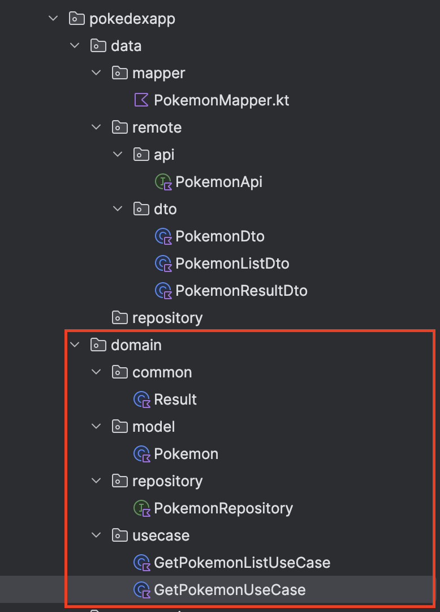

Éxito, ahora vamos a continuar la implementación del **repository**.

### Paso 4 Implementación del Repository

Ahora implementaremos la interfaz que definimos en domain, regresemos a la capa **data** y en el paquete **repository** crea el archivo **PokemonRepositoryImpl** y agrega lo siguiente:

````
@Singleton
class PokemonRepositoryImpl @Inject constructor(
    private val api: PokemonApi
) : PokemonRepository {

    override suspend fun getPokemonList(): List<Pokemon> {
        val response = api.getPokemonList()
        return response.results.map { result ->
            // Obtenemos el id de la URL
            val id = result.url.split("/").dropLast(1).last()
            // Hacemos la llamada para obtener detalles
            api.getPokemon(id).toDomain()
        }
    }

    override suspend fun getPokemonById(id: String): Pokemon {
        return api.getPokemon(id).toDomain()
    }
}
````

Aquí suceden varias cosas:

1. `@Singleton` indica que solo habrá una instancia
2. `@Inject` constructor para inyección de dependencias
3. Implementamos la interfaz PokemonRepository, por eso este archivo añade el **Impl** en **PokemonRepositoryImpl**, es la nomenclatura de **Implementation**. Todas las interfaces siguen este estándar al momento de implementarlas para saber a que se refieren.
4. Usamos el PokemonApi para hacer las llamadas
5. Convertimos DTOs a modelos de dominio con toDomain()

Como puedes ver, al haber definido nuestro **repository** genérico dentro de **domain** ahora podemos implementarlo dentro de nuestro proyecto en la capa de datos para obligar a que exista una fuente de datos que nos devuelva estos valores.

Ahora espero que la pregunta que te estés haciendo sea, ¿por qué uno va en **domain** y otro va en **data**?. Esto se debe a que **domain** va a forzar que sin importar de donde exista esta llamada de datos ya que la regla de negocio nos dice que siempre se ocupa una lista de Pokemon y un Pokemon solo.

Vamos a profundizar en la teoría del **Repository** Pattern:

1. Definición Formal

- Es un patrón de diseño que aísla la capa de datos del resto de la aplicación
- Actúa como mediador entre diferentes fuentes de datos y la lógica de negocio
 Proporciona una API limpia y consistente para acceder a los datos

2. Principios del Repository

````
interface Repository<T> {
    // Operaciones Básicas (CRUD)
    suspend fun get(id: String): T
    suspend fun getAll(): List<T>
    suspend fun save(item: T)
    suspend fun delete(id: String)
}
````

3. Tipos de Repository

- Respository Simple
````
class SimpleRepository(
    private val api: ApiService
) {
    fun getData() = api.getData()
}
````

- Repository con cache
````
class CachedRepository(
    private val api: ApiService,
    private val db: Database
) {
    fun getData(): Data {
        return db.getData() ?: api.getData().also {
            db.saveData(it)
        }
    }
}
````

- Repository con Estrategia
````
class StrategyRepository(
    private val dataSources: List<DataSource>
) {
    fun getData(): Data {
        return dataSources
            .firstNotNullOfOrNull { it.getData() }
            ?: throw NoDataException()
    }
}
````

4.Responsabilidades

- Abstracción de fuentes de datos
- Centralización de acceso a datos
- Manejo de cache
- Mapeo de datos
- Manejo de errores
- Estrategias de actualización

5. Patrones Comunes

- Single Source of Truth

````
class Repository(private val db: Database, private val api: ApiService) {
    // DB es la única fuente de verdad
    fun getData(): Flow<Data> = db.observeData()

    // API actualiza la DB
    suspend fun refreshData() {
        val newData = api.getData()
        db.saveData(newData)
    }
}
````

- Offline First

````
class OfflineFirstRepository(
    private val local: LocalSource,
    private val remote: RemoteSource
) {
    suspend fun getData(): Data {
        return try {
            local.getData() ?: remote.getData().also {
                local.saveData(it)
            }
        } catch (e: Exception) {
            local.getData() ?: throw e
        }
    }
}
````

6. Beneficios y Casos de Uso

- Testing

````
class FakeRepository : Repository {
    private val fakeData = mutableListOf<Data>()
    
    override fun getData() = fakeData
    override fun saveData(data: Data) {
        fakeData.add(data)
    }
}
````

- Cambio de fuente de datos

````
// Antes: API Rest
class ApiRepository(private val api: RestApi)

// Después: GraphQL
class ApiRepository(private val api: GraphQLApi)
// La interfaz se mantiene igual
````

7. Mejores Prácticas

- Usar interfaces para definir contratos
- Mantener el repository agnóstico de la UI
- Manejar errores apropiadamente
- Implementar estrategias de cache cuando sea necesario
- Mantener la responsabilidad única

El Repository Pattern se puede entender con la analogía de una biblioteca:

- Usuarios (UI/ViewModels): Solo quieren leer libros
- Bibliotecario (Repository): Maneja dónde están los libros
- Fuentes (API, Base de datos): Diferentes lugares donde están los libros

````
// Lo que el usuario ve
interface BibliotecaRepository {
    fun obtenerLibro(id: String): Libro
    fun guardarLibro(libro: Libro)
}

// Lo que el bibliotecario hace
class BibliotecaRepositoryImpl(
    private val apiRemota: ApiService,
    private val baseDatos: Database
) : BibliotecaRepository {
    
    override fun obtenerLibro(id: String): Libro {
        // Primero busca en la base de datos local
        baseDatos.getLibro(id)?.let { return it }
        
        // Si no está, lo busca en la API
        val libroRemoto = apiRemota.getLibro(id)
        
        // Lo guarda localmente para la próxima vez
        baseDatos.guardarLibro(libroRemoto)
        
        return libroRemoto
    }
}
````

En nuestra Pokedex:

````
interface PokemonRepository {
    suspend fun getPokemonList(): List<Pokemon>
    suspend fun getPokemonById(id: String): Pokemon
}

class PokemonRepositoryImpl(
    private val api: PokemonApi
) : PokemonRepository {
    
    override suspend fun getPokemonList(): List<Pokemon> {
        // El repositorio decide cómo y dónde obtener los datos
        return api.getPokemonList()
            .results
            .map { it.toDomain() }
    }
}
````

### Paso 5 Inyección de dependencias con Hilt

Previamente ya mencionamos el uso de inyección de dependencias con el caso de

````
class GetPokemonListUseCase @Inject constructor(
    private val repository: PokemonRepository
)
````

- `@Inject` constructor le dice a Hilt: "Inyecta las dependencias en este constructor"
- El UseCase no crea el repository, lo recibe ya creado
- Es como un restaurante que no fabrica sus ingredientes, se los entregan los proveedores

Desde entonces habrás notado que varios archivos, los **usecase** y la implementación del **repository** ya dan por hecho el uso de la inyección de dependencias.

Pero nos falta algo más dentro de este mundo de inyección de dependencias que no hemos tocado, y es que necesitamos configurar un **módulo** para Hilt que nos ayudará a poder configurar tanto **Retrofit** como el API.

Y es que piénsalo por un momento, te mencione antes sobre la **BASE_URL**, pero hasta este punto no la hemos colocado en ningún lugar. Dicho de otra forma tenemos nuestra llamada a pokemon list y pokemon, pero en ningún lugar le hemos dicho a nuestra aplicación en donde se debe conectar.

Para ello vamos a crear un nuevo paquete dentro de nuestra aplicación que este al nivel de las capas principales de **data, domain y presentation**, al cual llamaremos *di** por dependency injection.

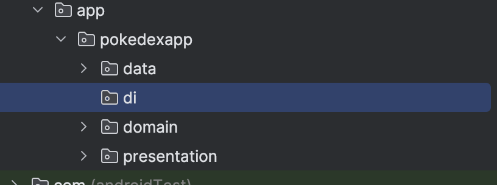

Ahora dentro de este paquete **di**, crea un archivo que llamaremos **AppModule** y agrega lo siguiente:

````
// di/AppModule.kt
@Module
@InstallIn(SingletonComponent::class)
object AppModule {

    @Provides
    @Singleton
    fun provideRetrofit(): Retrofit {
        return Retrofit.Builder()
            .baseUrl("https://pokeapi.co/api/v2/")
            .addConverterFactory(GsonConverterFactory.create())
            .build()
    }

    @Provides
    @Singleton
    fun providePokemonApi(retrofit: Retrofit): PokemonApi {
        return retrofit.create(PokemonApi::class.java)
    }

    @Provides
    @Singleton
    fun providePokemonRepository(
        api: PokemonApi
    ): PokemonRepository {
        return PokemonRepositoryImpl(api)
    }
}
````

Aquí tenemos:

- `@Module`: Indica que esta clase provee dependencias
- `@InstallIn(SingletonComponent::class)`: Las dependencias viven durante toda la app
- `@Provides`: Método que crea una dependencia
- `@Singleton`: Solo se crea una instancia

El gráfico de dependencias sería:

````
Retrofit -> PokemonApi -> PokemonRepository -> UseCase -> ViewModel
````

Ahora veamos un poco contrastando con lo que usamos previamente

1. Constructor Injection (con `@Inject`):

````
// Hilt puede crear esto directamente porque sabe cómo construir todas las dependencias
class PokemonRepositoryImpl @Inject constructor(
    private val api: PokemonApi
)
````

2. Module Injection (con `@Provides`):

````
@Module
object AppModule {
    @Provides
    fun provideRetrofit(): Retrofit {
        return Retrofit.Builder()
            .baseUrl("https://pokeapi.co/api/v2/")
            .build()
    }
}
````

**¿Por qué necesitamos Modules?**

1. Para clases que no podemos modificar
- No podemos agregar @Inject a Retrofit (es una librería externa)
- No podemos modificar clases de terceros

2. Para interfaces
- No podemos hacer @Inject en PokemonRepository porque es una interface
- El módulo decide qué implementación usar

3. Para configuración
- Retrofit necesita configuración (URL base, convertidores)
- Modules permiten esta configuración

Ejemplo práctico:

````
// ❌ No podemos hacer esto (Retrofit es clase externa)
class Retrofit @Inject constructor() { }

// ❌ No podemos hacer esto (es una interface)
interface PokemonRepository @Inject constructor() { }

// ✅ Usamos Module para estos casos
@Module
object AppModule {
    @Provides
    fun provideRetrofit(): Retrofit = // configuración

    @Provides
    fun provideRepository(api: PokemonApi): PokemonRepository = 
        PokemonRepositoryImpl(api)
}
````

Cuando Hilt necesita una dependencia, sigue un "árbol de dependencias":

1. Si alguien necesita un PokemonRepository:

````
class MyViewModel @Inject constructor(
    private val repository: PokemonRepository // Hilt busca cómo crear esto
)
````

2. Hilt ve que hay un @Provides para PokemonRepository
    - Pero necesita un PokemonApi para crearlo

3. Entonces busca cómo crear PokemonApi
    - Encuentra providePokemonApi
    - Pero necesita un Retrofit


4. Busca cómo crear Retrofit
    - Encuentra provideRetrofit
    - Este no necesita nada más


5. Ahora puede:
    - Crear Retrofit
    - Usar ese Retrofit para crear PokemonApi
    - Usar ese PokemonApi para crear PokemonRepository
    - Inyectar ese PokemonRepository en MyViewModel

Es como una receta:

- Para hacer un pastel (PokemonRepository)
- Necesito masa (PokemonApi)
- Para hacer masa necesito harina (Retrofit)
- Hilt sigue la receta al revés hasta tener todos los ingredientes

El nombre del método (provideRetrofit, providePokemonApi, etc.) es completamente arbitrario. Es solo una convención/estándar de nomenclatura que se usa comúnmente en la comunidad Android.

Podríamos nombrarlo de cualquier otra forma:

````
@Module
object AppModule {
    @Provides
    fun createRetrofit(): Retrofit { ... }  // Funciona igual

    @Provides
    fun getRetrofitInstance(): Retrofit { ... }  // También funciona

    @Provides
    fun banana(): Retrofit { ... }  // Incluso esto funcionaría!
}
````

Hilt se guía por:

- La anotación @Provides
- El tipo de retorno del método
- Los parámetros que necesita

El nombre "provide" + el tipo se usa por:

- Claridad en el código
- Fácil de entender qué hace cada método
- Convención del equipo de Android
- Consistencia en el proyecto

Es similar a la convención de nombrar getters con "get":

````
class User {
    fun getName(): String  // Convención común
    fun obtainName(): String  // Funcionaría igual
    fun x(): String  // También funcionaría, pero menos claro
}
````

Con esto hemos terminado de configurar nuestro API, y ya tenemos las reglas de negocio listas, ahora podemos trabajar con nuestra interfaz.

### Paso 6 ViewModels y Estados de UI

Para comenzar vamos a crear añadiendo un nuevo patrón de diseño a nuestra aplicación el **State**. Para nuestro caso particular utilizaremos el **UIState**.

1. ¿Qué es un UiState?

- Representa todo el estado de una pantalla
- Es inmutable (data class)
- Tiene valores por defecto
- Es un único objeto que contiene todo

2. Estados Posibles

````
// Estado Inicial
HomeUiState() 
// → lista vacía, no loading, no error

// Estado Cargando
HomeUiState(isLoading = true) 
// → lista vacía, loading, no error

// Estado Éxito
HomeUiState(
    pokemonList = listOfPokemon,
    isLoading = false
) 
// → lista con datos, no loading, no error

// Estado Error
HomeUiState(
    error = "No internet connection",
    isLoading = false
) 
// → lista vacía, no loading, con error
````

3. ¿Por qué usarlos?

- Consistencia: Un solo lugar para todo el estado
- Predictibilidad: Estados claramente definidos
- Debugging: Fácil ver qué cambió
- Testing: Fácil probar diferentes estados

4. Ejemplo de Uso en ViewModel:

````
class HomeViewModel : ViewModel() {
    private val _uiState = MutableStateFlow(HomeUiState())
    val uiState: StateFlow<HomeUiState> = _uiState.asStateFlow()

    fun loadPokemon() {
        // Actualizar a loading
        _uiState.update { it.copy(isLoading = true) }
        
        try {
            // Actualizar con datos
            _uiState.update { it.copy(
                pokemonList = newList,
                isLoading = false
            )}
        } catch (e: Exception) {
            // Actualizar con error
            _uiState.update { it.copy(
                error = e.message,
                isLoading = false
            )}
        }
    }
}
````

5. Ventajas sobre Múltiples Estados

````
// ❌ Múltiples estados pueden ser inconsistentes
var isLoading = false
var pokemonList = emptyList()
var error: String? = null

// ✅ Un solo estado garantiza consistencia
var uiState = HomeUiState(
    isLoading = false,
    pokemonList = emptyList(),
    error = null
)
````

Ahora si hablamos del patrón de diseño **State**, podemos ver lo siguiente:

- **¿Qué es el patrón State?**
El patrón de diseño State es un patrón de comportamiento que permite a un objeto cambiar su comportamiento cuando cambia su estado interno. En lugar de usar múltiples condicionales para manejar los estados, el objeto delega esa responsabilidad a instancias separadas de una jerarquía de estados.

- **¿Para qué sirve?**
Evita grandes estructuras if o when al manejar estados.
Facilita la escalabilidad, ya que agregar nuevos estados no implica modificar código existente.
Permite que el código sea más legible y mantenible.

- **Analogía sencilla: El Semáforo 🚦**
Piensa en un semáforo con tres luces: rojo, amarillo y verde.

- Si está en rojo, el siguiente estado es verde.
- Si está en verde, el siguiente estado es amarillo.
- Si está en amarillo, el siguiente estado es rojo.

En lugar de usar una gran estructura when, cada estado maneja su transición, igual que en el patrón State.

Entonces, vamos a ir a nuestro paquete de **presentation**, después **screens** y dentro de **home** crearemos el archivos **HomeUiState**, al cual agregaremos lo siguiente:

````
data class HomeUiState(
    val pokemonList: List<Pokemon> = emptyList(),
    val isLoading: Boolean = false,
    val error: String? = null
)
````

Ahora dentro del paquete **detail** crearemos otro que se llamará **PokemonDetailUiState** y contendrá lo siguiente:

````
data class PokemonDetailUiState(
    val pokemon: Pokemon? = null,
    val isLoading: Boolean = false,
    val error: String? = null
)
````

Y ahora veremos los **viewmodel**. Como ya mencionamos previamente, los view model comunican la información obtenida por las otras capas y la devuelven a la interfaz, además de manejar el estado actual de nuestra UI. Estas clases son parte del patrón MVVM que sigue Android en el desarrollo de aplicaciones móviles.

Crea un archivo dentro de **home** el cual llamaremos **HomeViewModel**

````
@HiltViewModel
class HomeViewModel @Inject constructor(
    private val getPokemonListUseCase: GetPokemonListUseCase
) : ViewModel() {

    private val _uiState = MutableStateFlow(HomeUiState())
    val uiState: StateFlow<HomeUiState> = _uiState.asStateFlow()

    init {
        loadPokemonList()
    }

    private fun loadPokemonList() {
        viewModelScope.launch {
            getPokemonListUseCase().collect { result ->
                _uiState.update { state ->
                    when (result) {
                        is Result.Loading -> state.copy(
                            isLoading = true
                        )
                        is Result.Success -> state.copy(
                            pokemonList = result.data,
                            isLoading = false,
                            error = null
                        )
                        is Result.Error -> state.copy(
                            error = result.exception.message,
                            isLoading = false
                        )
                    }
                }
            }
        }
    }
}
````

Aquí vamos a puntuar algunas cosas importantes:
1. HiltViewModel 

Dado que un viewmodel tiene una forma particular de trabajo, hilt nos solicita informarle quien es el viewmodel de la aplicación para ello debemos agregar el descriptor `@HiltViewModel` arriba de la declaración de la clase.
2. StateFlow

Tenemos el uso de nuestro uiState, pero de forma un tanto peculiar

````
private val _uiState = MutableStateFlow(HomeUiState())
val uiState: StateFlow<HomeUiState> = _uiState.asStateFlow()
````

Previamente en nuestros **usecase** utilizamos un **flow** para el manejo de estados dentro de los valores de nuestra aplicación.

1. Flow en Kotlin
En primer lugar, Flow es un tipo de secuencia asíncrona en Kotlin que permite emitir múltiples valores de manera secuencial. Es parte de la librería de Coroutines y está diseñado para manejar flujos de datos asincrónicos de manera eficiente.
En **GetPokemonListUseCase**, el Flow se utiliza para emitir diferentes estados de una operación:

    1. Result.Loading: Indica que la operación está comenzando
    2. Result.Success: Contiene los datos cuando la operación se completa con éxito
    3. Result.Error: Captura cualquier error que ocurra durante la operación

2. StateFlow
StateFlow es una versión especial de Flow que siempre mantiene un estado actual. Sus características principales son:

- Siempre tiene un valor inicial
- Mantiene el último valor emitido
- Es un flujo de estados que puede ser observado
- Es cold, lo que significa que solo emite valores cuando hay un colector (collector)

3. MutableStateFlow
MutableStateFlow es una versión mutable de StateFlow que te permite:

- Modificar su valor actual
- Emitir nuevos valores
- Mantener un estado que puede cambiar con el tiempo

En el viewmodel:

Aquí:

- `_uiState` es MutableStateFlow: Puedes modificarlo internamente en el ViewModel
- `uiState` es StateFlow: Expuesto como solo lectura para los observadores externos.

**Proceso de actualización**
Cuando llamas a `_uiState.update \{ \}`, estás:

    1. Tomando el estado actual
    2. Creando una copia modificada del estado
    3. Reemplazando el estado anterior con el nuevo

**Comparación con otros tipos**

- Flow: Flujo genérico para emisión de múltiples valores
- StateFlow: Flujo que siempre mantiene un estado
- SharedFlow: Similar a StateFlow, pero sin estado inicial obligatorio

**Cuándo usar cada uno:**

- Flow: Para secuencias de datos que cambian
    - Ejemplo de Caso de Uso: Cuando necesitas emitir múltiples valores a lo largo del tiempo sin un estado persistente.
````
class NotificacionesService {
    fun obtenerNotificaciones(): Flow<Notificacion> = flow {
        while(true) {
            val nuevasNotificaciones = api.fetchNotificaciones()
            nuevasNotificaciones.forEach { emit(it) }
            delay(5000) // Cada 5 segundos
        }
    }
}

// Uso
viewModelScope.launch {
    notificacionesService.obtenerNotificaciones()
        .collect { notificacion ->
            // Procesar cada notificación individualmente
            mostrarNotificacion(notificacion)
        }
}
````
- StateFlow: Para representar un estado que cambia en el tiempo
    - Ejemplo Caso de Uso: Cuando necesitas mantener y observar un estado que cambia.
````
class AutenticacionViewModel {
    // Estado de inicio de sesión
    private val _estadoLogin = MutableStateFlow<EstadoLogin>(EstadoLogin.NoAutenticado)
    val estadoLogin: StateFlow<EstadoLogin> = _estadoLogin.asStateFlow()

    fun iniciarSesion(usuario: String, contraseña: String) {
        viewModelScope.launch {
            _estadoLogin.value = EstadoLogin.Cargando
            try {
                val resultado = repositorioAutenticacion.login(usuario, contraseña)
                _estadoLogin.value = if (resultado) {
                    EstadoLogin.Autenticado
                } else {
                    EstadoLogin.Error("Credenciales inválidas")
                }
            } catch (e: Exception) {
                _estadoLogin.value = EstadoLogin.Error(e.message ?: "Error desconocido")
            }
        }
    }
}

// Definición de estados posibles
sealed class EstadoLogin {
    object NoAutenticado : EstadoLogin()
    object Cargando : EstadoLogin()
    object Autenticado : EstadoLogin()
    data class Error(val mensaje: String) : EstadoLogin()
}
````
- SharedFlow: Para compartir eventos entre múltiples consumidores
    - Ejemplo Caso de Uso: Cuando quieres emitir eventos que pueden ser recibidos por múltiples observadores.

````
class EventBus {
    private val _eventos = MutableSharedFlow<Evento>()
    val eventos: SharedFlow<Evento> = _eventos.asSharedFlow()

    suspend fun enviarEvento(evento: Evento) {
        _eventos.emit(evento)
    }
}

// Ejemplo de uso en diferentes partes de la app
class ViewModel1(private val eventBus: EventBus) {
    init {
        viewModelScope.launch {
            eventBus.eventos.collect { evento ->
                // Reaccionar al evento
                when(evento) {
                    is Evento.NuevaNotificacion -> actualizarNotificaciones()
                    is Evento.CambioConfiguracion -> aplicarConfiguracion()
                }
            }
        }
    }
}

class ViewModel2(private val eventBus: EventBus) {
    init {
        viewModelScope.launch {
            eventBus.eventos.collect { evento ->
                // Otro observador puede reaccionar diferente
                when(evento) {
                    is Evento.NuevaNotificacion -> mostrarAlerta()
                    is Evento.CambioConfiguracion -> guardarConfiguracion()
                }
            }
        }
    }
}
````

Diferencias Clave

1. Flow

- Ideal para secuencias de datos
- No mantiene un estado persistente
- Cada colector recibe todos los elementos


2. StateFlow

- Siempre tiene un valor actual
- Perfecto para estados que cambian
- Nuevo colector recibe el último valor inmediatamente


3. SharedFlow

- Emite eventos a múltiples consumidores
- Permite configurar el búfer y la política de emisión
- Útil para sistemas de eventos complejos

Regla General de Selección

- ¿Necesitas emitir una secuencia de datos? → Flow
- ¿Necesitas mantener un estado actual? → StateFlow
- ¿Necesitas enviar eventos a múltiples observadores? → SharedFlow

Ejemplo concreto:

````
class ViewModel {
    // Estado inicial
    private val _counter = MutableStateFlow(0)
    
    // Expuesto como StateFlow
    val counter: StateFlow<Int> = _counter.asStateFlow()
    
    // Método para incrementar
    fun increment() {
        _counter.value++ // Actualiza el valor
    }
}
````

En nuestra aplicación, se usa este patrón para manejar los estados de carga de la lista de Pokémon y los detalles de Pokémon individuales de manera reactiva y eficiente.

Con lo antes visto, ya habiendo entendido mejor los Flow, crea otro archivo en **detail** que llamaremos **PokemonDetailViewModel** y agrega lo siguiente:

````
@HiltViewModel
class PokemonDetailViewModel @Inject constructor(
    private val getPokemonUseCase: GetPokemonUseCase
) : ViewModel() {

    private val _uiState = MutableStateFlow(PokemonDetailUiState())
    val uiState: StateFlow<PokemonDetailUiState> = _uiState.asStateFlow()

    fun getPokemon(id: String) {
        viewModelScope.launch {
            getPokemonUseCase(id).collect { result ->
                _uiState.update { state ->
                    when (result) {
                        is Result.Loading -> state.copy(
                            isLoading = true
                        )
                        is Result.Success -> state.copy(
                            pokemon = result.data,
                            isLoading = false,
                            error = null
                        )
                        is Result.Error -> state.copy(
                            error = result.exception.message,
                            isLoading = false
                        )
                    }
                }
            }
        }
    }
}
````

Ahora vamos a actualizar nuestras funciones en Compose para tener completo nuestro flujo.

Abre el archivo **HomeScreen**, y observemos lo siguiente:

````
fun HomeScreen(onPokemonClick: (String) -> Unit) {
    ...Código actual sin modificar
}
````

Dentro de la recepción de parámetros solo tenemos `onPokemonClick: (String) -> Unit`, ahora que hemos evolucionado a usar el **viewmodel**, deberemos añadir un parámetro para manejarlo, quedando de la siguiente manera:

````
fun HomeScreen(
    onPokemonClick: (String) -> Unit,
    viewModel: HomeViewModel = hiltViewModel(),
) {
    ... Código actual sin modificar
}
````

Esto nos abre la posibilidad a usar nuestro viewmodel.

Ahora bien, busca la siguiente línea

````
val mockPokemonList = remember { Pokemon.getMockData() }
````

En el laboratorio anterior usábamos esta línea para simular la llamada de datos y obtener una lista con los 2 primeros Pokemon. Ahora que tenemos el viewmodel esto ya no es necesario por lo que vamos a sustituir esta línea por el uso de nuestro uiState de la siguiente forma:

````
//val mockPokemonList = remember { Pokemon.getMockData() } ELIMINAR
val uiState by viewModel.uiState.collectAsStateWithLifecycle()
````
Ya vimos previamente el significado de los diferentes **flow** de Android, pero ahora veremos este método particular que se usa en Compose

`collectAsStateWithLifecycle()` es un método de Jetpack Compose que extiende la funcionalidad de recolección de un StateFlow para manejar el ciclo de vida de manera eficiente en aplicaciones Android con Compose.

**Qué hace collectAsStateWithLifecycle()**

1. Recolección Sensible al Ciclo de Vida

- Automáticamente inicia la recolección del StateFlow cuando el composable está activo
- Detiene la recolección cuando el composable está inactivo o destruido
- Ayuda a prevenir fugas de memoria y consumo innecesario de recursos


2. Conversión a `State\<T>` de Compose

- Convierte el StateFlow en un State que Compose puede observar
- Permite usar el valor directamente en composables
- Hace un trigger de recomposiciones cuando el valor cambia

Ejemplo comparativo:

````
// Sin lifecycle
val uiState = viewModel.uiState.collectAsState()

// Con lifecycle
val uiState by viewModel.uiState.collectAsStateWithLifecycle()
````

Diferencias clave


- `collectAsState()`:
    - Recolecta siempre, independientemente del estado del ciclo de vida
    - Puede causar fugas de memoria
    - No optimizado para la lifecycle de Android

- `collectAsStateWithLifecycle()`:
    - Pausa la recolección cuando el composable no está visible
    - Reduce el consumo de recursos
    - Previene potenciales fugas de memoria
    - Ideal para apps Android con Compose

Beneficios

- Gestión automática de recursos
- Mejor rendimiento
- Código más limpio y seguro
- Integración natural con el ciclo de vida de Android

En resumen, collectAsStateWithLifecycle() es una herramienta específica de Compose para manejar StateFlow de manera eficiente en el contexto de aplicaciones Android, optimizando el consumo de recursos y previniendo problemas comunes de gestión de estado.

Por último, identifica las siguientes líneas casi al final de **HomeScreen**

````
when (selectedTabIndex) {
    0 ->
        PokemonListTab(
            pokemonList = mockPokemonList,
            onPokemonClick = onPokemonClick,
        )
    1 -> SearchTab(onPokemonClick = onPokemonClick)
}
````

Vamos a extender la funcionalidad para manejar los diferentes estados que ahora tenemos en nuestro uiState. Para ello sustituye por lo siguiente:

````
when (selectedTabIndex) {
    0 ->
        PokemonListContent(
            pokemonList = uiState.pokemonList,
            isLoading = uiState.isLoading,
            error = uiState.error,
            onPokemonClick = onPokemonClick,
        )
    1 -> SearchTab(onPokemonClick = onPokemonClick)
}
````

Observa como ahora, además de la lista de Pokemon, hemos incluido el estado de carga y el de error.

Previamente teníamos **PokemonListTab**, pero ahora vamos a crear un nuevo archivo que llamaremos **PokemonListContent**, será similar al anterior pero con el manejo de los estados. Crea el archivo y agrega lo siguiente:

````
@Suppress("ktlint:standard:function-naming")
@Composable
fun PokemonListContent(
    pokemonList: List<Pokemon>,
    isLoading: Boolean,
    error: String?,
    onPokemonClick: (String) -> Unit,
) {
    Box(modifier = Modifier.fillMaxSize()) {
        when {
            isLoading -> {
                CircularProgressIndicator(
                    modifier = Modifier.align(Alignment.Center),
                )
            }
            error != null -> {
                Text(
                    text = error,
                    modifier = Modifier.align(Alignment.Center),
                    color = MaterialTheme.colorScheme.error,
                )
            }
            else -> {
                LazyVerticalGrid(
                    columns = GridCells.Fixed(2),
                    contentPadding = PaddingValues(16.dp),
                    horizontalArrangement = Arrangement.spacedBy(16.dp),
                    verticalArrangement = Arrangement.spacedBy(16.dp),
                ) {
                    items(
                        items = pokemonList,
                        key = { it.id },
                    ) { pokemon ->
                        PokemonCard(
                            pokemon = pokemon,
                            onClick = { onPokemonClick(pokemon.id) },
                        )
                    }
                }
            }
        }
    }
}
````

La diferencia principal entre el anterior y este, es que antes solo cargábamos la lista de golpe, ahora hacemos uso de los diferentes estados de nuestro resultado y dependiendo los casos, vamos generando diversos resultados.

En el caso de Loading

````
CircularProgressIndicator(
    modifier = Modifier.align(Alignment.Center),
)
````

En el caso de error

````
Text(
    text = error,
    modifier = Modifier.align(Alignment.Center),
    color = MaterialTheme.colorScheme.error,
)
````

Y en el caso correcto cargamos nuestra lista como teníamos previamente.

Podríamos mejorar el componente de carga y mejorar la visualización del mensaje de error pero eso ya es sobre el mismo Compose.

Regresa a **HomeScreen** y ya no deberías tener ningún error.

Ahora vamos a realizar lo mismo con **PokemonDetailScreen**. Igual que la anterior tenemos nuestros parámetros iniciales

````
fun PokemonDetailScreen(
    pokemonId: String,
    onBackClick: () -> Unit,
) {
    ...Código previo sin modificar
}
````

Añadamos nuestro view model correspondiente

````
fun PokemonDetailScreen(
    pokemonId: String,
    onBackClick: () -> Unit,
    viewModel: PokemonDetailViewModel = hiltViewModel(),
) {
    ...Código previo sin modificar
}
````

Y vamos a sustituir estas líneas

````
val mockPokemon =
    remember {
        Pokemon.getMockData().find { it.id == pokemonId }
    }
````

Por lo siguiente:

````
val uiState by viewModel.uiState.collectAsStateWithLifecycle()

LaunchedEffect(pokemonId) {
    viewModel.getPokemon(pokemonId)
}
````

El uiState es igual que el caso anterior, pero ahora vamos a agregar un `LaunchedEffect`, veamos al respecto.

LaunchedEffect es una función clave en Compose para manejar efectos secundarios de manera segura y eficiente dentro del ciclo de vida de los composables.

Propósito Principal

- Ejecutar código asíncrono (como llamadas a APIs, inicialización de datos)
- Garantizar que el código se ejecute solo cuando ciertos parámetros cambian
- Manejar coroutines de forma segura dentro de composables

````
@Composable
fun PokemonDetailScreen(pokemonId: String, viewModel: PokemonDetailViewModel) {
    // Recolecta el estado del ViewModel
    val uiState by viewModel.uiState.collectAsStateWithLifecycle()

    // LaunchedEffect se ejecutará cada vez que cambie pokemonId
    LaunchedEffect(pokemonId) {
        // Inicia la carga del Pokémon cuando el ID cambia
        viewModel.getPokemon(pokemonId)
    }

    // Resto del UI basado en uiState
    when (val state = uiState) {
        is UiState.Loading -> LoadingIndicator()
        is UiState.Success -> PokemonDetails(state.pokemon)
        is UiState.Error -> ErrorMessage(state.message)
    }
}
````

Características clave

1. Parámetros de seguimiento (Keys)

````
LaunchedEffect(key1, key2, ...) {
    // El bloque se re-ejecuta si cualquiera de los keys cambia
}
````

- Si no se especifica ningún key, se ejecuta una vez durante la primera composición
- Con keys, se re-ejecuta cuando cualquiera de los keys cambia

````
// Se ejecuta solo cuando userID cambia
LaunchedEffect(userId) {
    loadUserProfile(userId)
}

// Múltiples keys
LaunchedEffect(userId, forceRefresh) {
    // Se ejecuta si userId O forceRefresh cambian
    loadUserProfile(userId, forceRefresh)
}

// Key especial para forzar una ejecución
LaunchedEffect(Unit) {
    // Se ejecuta una única vez durante la primera composición
    inicializarAlgoUnaVez()
}
````

2. Manejo de Coroutines

- Crea un scope de coroutine propio
- Cancela automáticamente cuando el composable se destruye
- Previene fugas de memoria

3. Diferencia con Otros Efectos

- LaunchedEffect: Para código asíncrono, maneja coroutines
- SideEffect: Para efectos síncronos simples
- DisposableEffect: Para efectos que requieren limpieza

Casos de uso comunes

1. Carga de datos

````
LaunchedEffect(productId) {
    try {
        val producto = repositorio.obtenerProducto(productId)
        // Actualizar estado
    } catch (e: Exception) {
        // Manejar error
    }
}
````

2. Suscripciones

````
LaunchedEffect(userId) {
    val channel = repositorio.obtenerActualizaciones(userId)
    channel.consumeAsFlow().collect { actualizacion ->
        // Procesar actualización
    }
}
````

3. Temporizadores

````
LaunchedEffect(Unit) {
    while(true) {
        delay(1000) // Cada segundo
        actualizarTiempo()
    }
}
````

Mejores Prácticas

- Usar keys relevantes
- Mantener el código dentro de LaunchedEffect lo más simple posible
- Preferir delegar la lógica compleja al ViewModel
- Cancelar o manejar posibles excepciones
- No realizar operaciones de UI directamente

En nuestro caso específico:

````
LaunchedEffect(pokemonId) {
    viewModel.getPokemon(pokemonId)
}
````

Esto significa:

- Cada vez que pokemonId cambie
- Se llamará al método getPokemon del ViewModel
- La carga se realizará de manera asíncrona
- Se integrará con el ciclo de vida del composable

LaunchedEffect es una herramienta poderosa para manejar efectos secundarios de manera segura y predecible en Jetpack Compose.

Por último, ya que eliminamos el **mockPokemon** debemos sustituir el contenido del Scaffold por lo siguiente:

````
Box(
    modifier =
        Modifier
            .fillMaxSize()
            .padding(padding),
) {
    when {
        uiState.isLoading -> {
            CircularProgressIndicator(
                modifier = Modifier.align(Alignment.Center),
            )
        }
        uiState.error != null -> {
            Text(
                text = uiState.error ?: "Unknown error",
                modifier = Modifier.align(Alignment.Center),
                color = MaterialTheme.colorScheme.error,
            )
        }
        uiState.pokemon != null -> {
            PokemonDetailContent(
                pokemon = uiState.pokemon!!,
            )
        }
    }
}
````

Nuevamente la diferencia que observaremos aquí es la creación del archivo **PokemonDetailContent**. Crea este nuevo archivo dentro del paquete de **components** y agrega lo siguiente:

````
@Suppress("ktlint:standard:function-naming")
@Composable
fun PokemonDetailContent(pokemon: Pokemon) {
    Column(
        modifier =
            Modifier
                .fillMaxSize()
                .padding(16.dp),
        horizontalAlignment = Alignment.CenterHorizontally,
    ) {
        AsyncImage(
            model = pokemon.imageUrl,
            contentDescription = pokemon.name,
            modifier = Modifier.size(200.dp),
        )

        Spacer(modifier = Modifier.height(16.dp))

        Text(
            text = pokemon.name,
            style = MaterialTheme.typography.headlineMedium,
        )

        Spacer(modifier = Modifier.height(8.dp))

        Row(
            modifier = Modifier.fillMaxWidth(),
            horizontalArrangement = Arrangement.SpaceEvenly,
        ) {
            Column(horizontalAlignment = Alignment.CenterHorizontally) {
                Text("Height")
                Text("${pokemon.height / 10.0}m")
            }
            Column(horizontalAlignment = Alignment.CenterHorizontally) {
                Text("Weight")
                Text("${pokemon.weight / 10.0}kg")
            }
        }

        Spacer(modifier = Modifier.height(16.dp))

        Text("Types", style = MaterialTheme.typography.titleMedium)
        Row(
            horizontalArrangement = Arrangement.spacedBy(8.dp),
        ) {
            pokemon.types.forEach { type ->
                Chip(type = type)
            }
        }
    }
}
````

En esta nueva función de Compose vamos a definir el detalle del Pokemon. De manera similar a como lo hicimos con la lista de Pokemon.

Ya tenemos nuestra interfaz actualizada, intenta correr el proyecto.

Seguramente tu compilación falló en algún punto o si se ejecutó hubo un crash en la aplicación.

Si nos vamos al logcat el error nos debería decir algo como lo siguiente:

````
java.lang.IllegalStateException: Given component holder class com.app.pokedexapp.presentation.MainActivity does not implement interface dagger.hilt.internal.GeneratedComponent or interface dagger.hilt.internal.GeneratedComponentManager
````

Voy a tomar el caso de uno de los viewmodel, pero cualquiera de los 2 nos sirven:

````
@HiltViewModel
class PokemonDetailViewModel
    @Inject
    constructor(
        private val getPokemonUseCase: GetPokemonUseCase,
    ) : ViewModel() {
        ...
    }
````

Cuando declaramos nuestro viewmodel tuvimos que declarar `@HiltViewModel`, si recuerdas, te mencioné que esto era por ser un flujo de inicio especial dentro de nuestra aplicación, donde teníamos que avisar a Hilt para que internamente pueda construir el árbol de dependencias que ya hablamos previamente.

Ahora lo que necesitamos es hacer lo mismo pero con nuestro **MainActivity**, esto ya que hilt necesita saber cuales son los puntos de inicio de nuestra aplicación, en este caso vistas o servicios como pueden ser: Activities, Fragments, Broadcast, Services, entre otros.

Hoy en día casi todo reside entre activities o fragments, pero si llegas a encontrar este error es por que hace falta la anotación.

Para resolver el error abre **MainActivity** y arriba de la declaración coloca la anotación `@AndroidEntryPoint`de la siguiente manera:

````
@AndroidEntryPoint
class MainActivity : ComponentActivity() {
    ...
}
````

Intenta compilar nuevamente y... ohh seguimos teniendo errores. Pero ahora el error es diferente:

````
java.lang.RuntimeException: Unable to start activity ComponentInfo{com.app.pokedexapp/com.app.pokedexapp.presentation.MainActivity}: java.lang.IllegalStateException: Hilt Activity must be attached to an @HiltAndroidApp Application. Did you forget to specify your Application's class name in your manifest's <application />'s android:name attribute?
````

Nuevamente nos falta configurar algo de Hilt para poder continuar.

Ahora nos pide crear una clase especial de Android para indicar que nuestra aplicación utiliza Hilt.

Como ya vimos, utilizamos un activity para marcar una vista que conecta todo nuestro Compose. Pues así como hay una clase para una sola vista, también existe una clase para toda la aplicación. En la raíz de nuestros paquetes crea un archivo que llamaremos **PokemonApplication**.

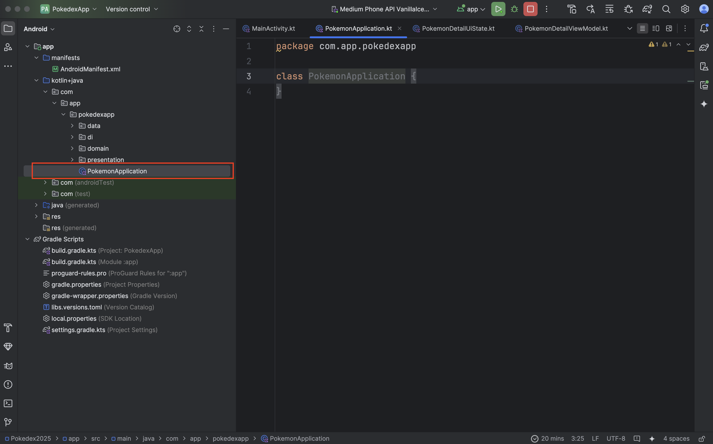

Dentro de esta clase colocaremos un código muy simple:

````
@HiltAndroidApp
class PokemonApplication : Application()
````

Como ves ni siquiera estamos agregando código a la clase, simplemente estamos agregando la directiva de Hilt para que reconozca esta clase como la app donde comienza el árbol global de dependencias.

Esta clase algunas librerías te la podrán solicitar para configuraciones globales como Hilt, o en otras ocasiones podrás usarla para mantener valores globales durante toda la aplicación.

Ahora bien, aunque creamos la clase esta no se llama de manera automática, necesitamos decirle a Android que la llame por nosotros, por lo que debemos abrir nuestro **AndroidManifest.xml.**

Y dentro del código XML, identifica la etiqueta marcada como **\<application>** y dentro de los parámetros que tiene agrega uno que sea `android:name=.PokemonApplication`.

El resultado debería verse como lo siguiente:

````
<application
        android:name=".PokemonApplication"
        android:allowBackup="true"
        android:dataExtractionRules="@xml/data_extraction_rules"
        android:fullBackupContent="@xml/backup_rules"
        android:icon="@mipmap/ic_launcher"
        android:label="@string/app_name"
        android:roundIcon="@mipmap/ic_launcher_round"
        android:supportsRtl="true"
        android:theme="@style/Theme.PokedexApp"
        tools:targetApi="31">

    ...

</application>
````

Nuevamente intenta correr tu aplicación, y ahora sí deberías ver un resultado como el siguiente:

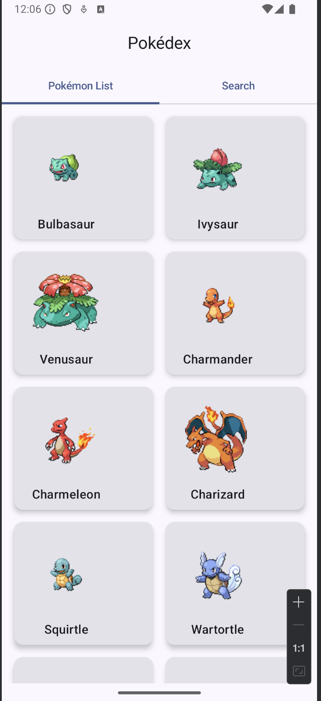
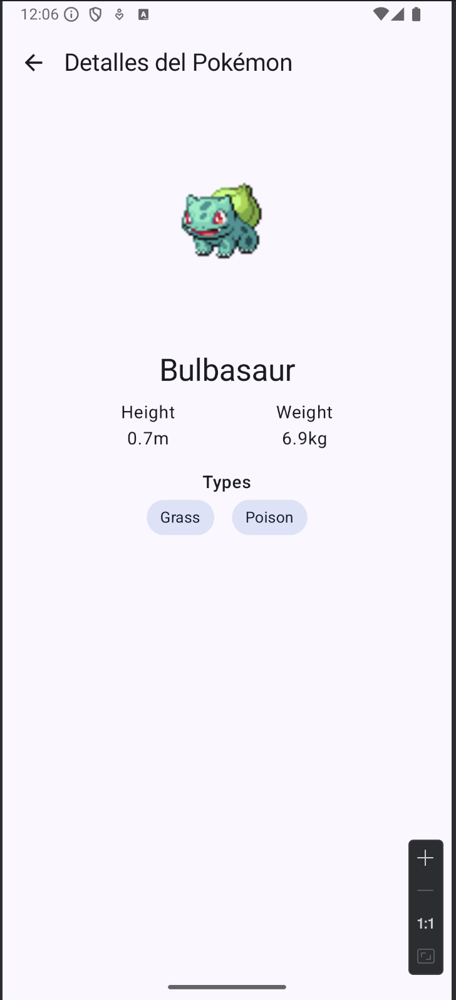

Éxito, hemos conectado toda la arquitectura y tenemos un conexión con datos reales a un API.

Este laboratorio ha sido largo ya que hemos visto muchos conceptos nuevos durante el camino. Es probable que en la primera pasada no te haya quedado todo claro, intenta realizar varias veces el laboratorio hasta que entiendas bien todos los conceptos, ya que de esto depende mucho el éxito de una aplicación estructurada en Android.

## Resumen

El Laboratorio 5: Consumiendo APIs transforma nuestra aplicación estática en una aplicación conectada usando Clean Architecture + MVVM.

Componentes implementados

````
data/
├── DTOs para mapear respuestas API
├── Interface Retrofit para llamadas
└── Implementación Repository

domain/
├── Interfaces Repository
├── Use Cases para lógica
└── Result para estados

presentation/
├── ViewModels con StateFlow
├── Estados UI inmutables
└── UI conectada a ViewModels
````

Conceptos Clave:

- Clean Architecture: Separación por capas
- MVVM: Gestión de UI y estados
- Inyección de Dependencias con Hilt
- Manejo de estados con StateFlow
- Repository Pattern
- DTOs y mapeos

Flujo de datos

````
API → Repository → UseCase → ViewModel → UI
````

Este laboratorio establece la base para una arquitectura escalable y mantenible.