# 5 - Desarrollo avanzado de UI

## Objetivo

Objetivo Principal:
Mejorar la experiencia de usuario a través de animaciones, estados de carga mejorados y mejores prácticas de UI/UX.
Objetivos Específicos:

1. Implementar Shimmer Effect para estados de carga
2. Agregar Pull-to-refresh para actualizar datos
3. Integrar animaciones en navegación y componentes
4. Desarrollar estados de error más informativos
5. Crear componentes reutilizables
6. Mejorar la visualización de detalles del Pokémon
7. Implementar búsqueda funcional

Este laboratorio se centra en la calidad visual y la interactividad, construyendo sobre la funcionalidad base del Lab 5.

## Instrucciones

Sigue los pasos descritos en la siguiente práctica, si tienes algún problema no olvides que tus profesores están para apoyarte.

## Laboratorio

### Paso 1 Entender la estructura del proyecto

En el laboratorio anterior nos enfocamos en crear la estructura general de la arquitectura, para este laboratorio nos enfocaremos principalmente en la capa de **presentation** y alguna separación de componentes de Compose a como lo hemos venido trabajando desde el inicio para dar mejores efectos y simplificar el código en base a los estados de nuestra arquitectura.

````
app/
├── di/
│   └── AppModule.kt                // Sin cambios
├── data/
│   ├── remote/
│   │   ├── api/
│   │   │   └── PokemonApi.kt      // Sin cambios
│   │   └── dto/
│   │       ├── PokemonDto.kt      // Sin cambios
│   │       └── PokemonListDto.kt  // Sin cambios
│   ├── repository/
│   │   └── PokemonRepositoryImpl.kt // Sin cambios
│   └── mapper/
│       └── PokemonMapper.kt        // Sin cambios
├── domain/
│   ├── model/
│   │   └── Pokemon.kt             // Sin cambios
│   ├── repository/
│   │   └── PokemonRepository.kt   // Sin cambios
│   └── usecase/
│       ├── GetPokemonListUseCase.kt // Sin cambios
│       └── GetPokemonUseCase.kt     // Sin cambios
└── presentation/
    ├── MainActivity.kt             // Sin cambios
    ├── navigation/
    │   ├── NavGraph.kt            // Actualizado con animaciones
    │   └── Screen.kt              // NUEVO - Separado de NavGraph
    ├── screens/
    │   ├── home/
    │   │   ├── HomeScreen.kt      // Actualizado con animaciones
    │   │   ├── HomeViewModel.kt   // Sin cambios
    │   │   ├── HomeUiState.kt    // Sin cambios
    │   │   └── components/
    │   │       ├── PokemonCard.kt    // Actualizado con animaciones
    │   │       ├── PokemonListTab.kt // Deprecado por PokemonListContent
    │   │       ├── PokemonListContent.kt // Actualizado con shimmer loading y pull-to-refresh
    │   │       └── SearchTab.kt      // Actualizado con funcionalidad
    │   └── detail/
    │       ├── PokemonDetailScreen.kt  // Actualizado con animaciones
    │       ├── PokemonDetailViewModel.kt // Sin cambios
    │       ├── PokemonDetailUiState.kt  // Sin cambios
    │       └── components/
    │           ├── PokemonStats.kt      // NUEVO
    │           ├── PokemonInfo.kt       // NUEVO
    │           └── PokemonTypes.kt      // NUEVO
    ├── theme/
    │   ├── Color.kt              // Actualizado con colores por tipo
    │   ├── Theme.kt             // Sin cambios
    │   └── Type.kt              // Sin cambios
    └── common/
        ├── Result.kt            // Sin cambios
        └── components/          // NUEVO
            ├── LoadingShimmer.kt  // NUEVO
            └── ErrorView.kt       // NUEVO
````

Diagrama de secuencia:

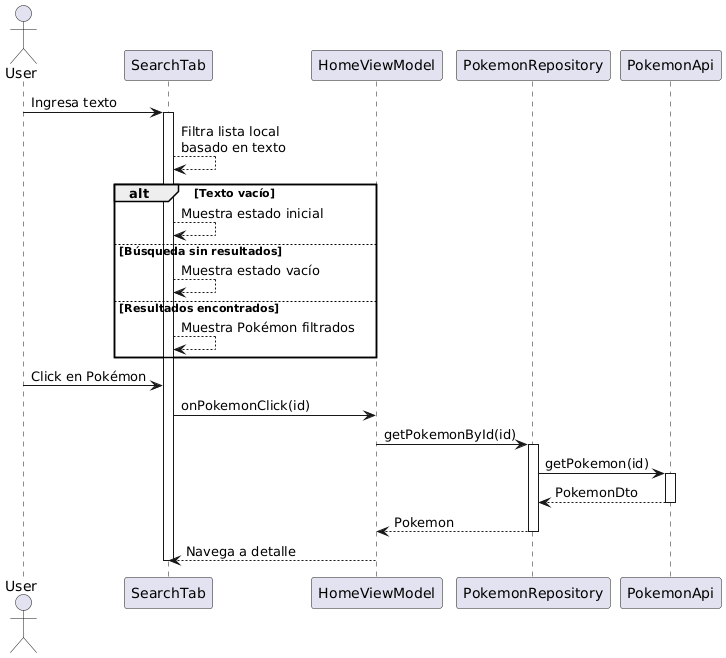

````
@startuml Search Sequence
actor User
participant SearchTab
participant HomeViewModel
participant PokemonRepository
participant PokemonApi

User -> SearchTab: Ingresa texto
activate SearchTab

SearchTab --> SearchTab: Filtra lista local\nbasado en texto

alt Texto vacío
   SearchTab --> SearchTab: Muestra estado inicial
else Búsqueda sin resultados
   SearchTab --> SearchTab: Muestra estado vacío
else Resultados encontrados
   SearchTab --> SearchTab: Muestra Pokémon filtrados
end

User -> SearchTab: Click en Pokémon
SearchTab -> HomeViewModel: onPokemonClick(id)

HomeViewModel -> PokemonRepository: getPokemonById(id)
activate PokemonRepository

PokemonRepository -> PokemonApi: getPokemon(id)
activate PokemonApi
PokemonApi --> PokemonRepository: PokemonDto
deactivate PokemonApi

PokemonRepository --> HomeViewModel: Pokemon
deactivate PokemonRepository

HomeViewModel --> SearchTab: Navega a detalle
deactivate SearchTab

@enduml
````

Diagrama de paquetes

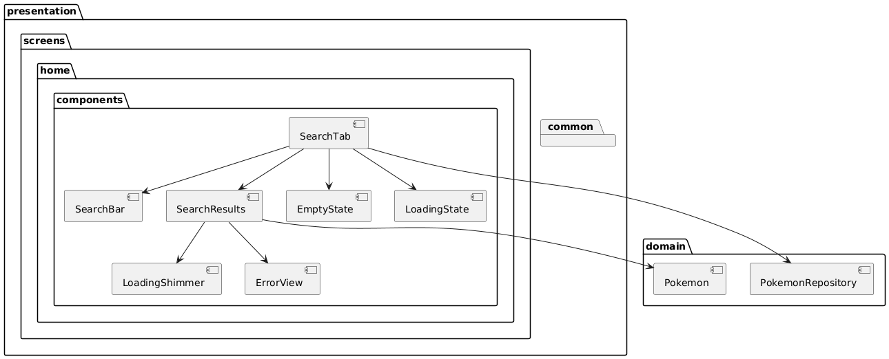

````
@startuml Search Package Diagram
package "presentation" {
   package "screens" {
       package "home" {
           package "components" {
               [SearchTab]
               [SearchBar]
               [SearchResults]
               [EmptyState]
               [LoadingState]
           }
       }
   }
   
   package "common" {
       package "components" {
           [LoadingShimmer]
           [ErrorView]
       }
   }
}

package "domain" {
   [PokemonRepository]
   [Pokemon]
}

SearchTab --> SearchBar
SearchTab --> SearchResults
SearchTab --> EmptyState
SearchTab --> LoadingState
SearchResults --> LoadingShimmer
SearchResults --> ErrorView
SearchResults --> [Pokemon]
SearchTab --> [PokemonRepository]

@enduml
````

Vamos a comenzar con nuestro proyecto. Abre Android Studio, desde donde nos quedamos la última vez.

### Paso 2 Construir componente de búsqueda

Si recuerdas, de laboratorios anteriores tenemos pendiente la construcción del buscador. Al momento nuestra funcionalidad ya permite la búsqueda de los mismos, por lo que ampliar una vista de buscador debería ser algo sencillo.

Empecemos abriendo el archivo correspondiente **SearchTab**.

Vamos a sustituir el código que ya teníamos por el siguiente:

````
@Suppress("ktlint:standard:function-naming")
@Composable
fun SearchTab(
    onPokemonClick: (String) -> Unit,
    viewModel: HomeViewModel = hiltViewModel(),
) {
    var searchQuery by remember { mutableStateOf("") }
    val uiState by viewModel.uiState.collectAsStateWithLifecycle()

    Column(
        modifier =
        Modifier
            .fillMaxSize()
            .padding(16.dp),
    ) {
        OutlinedTextField(
            value = searchQuery,
            onValueChange = { searchQuery = it },
            modifier = Modifier.fillMaxWidth(),
            label = { Text("Search Pokémon") },
            leadingIcon = {
                Icon(Icons.Default.Search, contentDescription = null)
            },
            singleLine = true,
            keyboardOptions =
            KeyboardOptions(
                imeAction = ImeAction.Search,
            ),
        )

        Spacer(modifier = Modifier.height(16.dp))

        val filteredPokemon =
            remember(searchQuery, uiState.pokemonList) {
                if (searchQuery.isEmpty()) {
                    emptyList()
                } else {
                    uiState.pokemonList.filter { pokemon ->
                        pokemon.name.contains(searchQuery, ignoreCase = true) ||
                                pokemon.id.contains(searchQuery)
                    }
                }
            }

        when {
            searchQuery.isEmpty() -> {
                Box(
                    modifier = Modifier.fillMaxSize(),
                    contentAlignment = Alignment.Center,
                ) {
                    Column(
                        horizontalAlignment = Alignment.CenterHorizontally,
                        verticalArrangement = Arrangement.Center,
                    ) {
                        Icon(
                            imageVector = Icons.Default.Search,
                            contentDescription = null,
                            modifier = Modifier.size(48.dp),
                            tint = MaterialTheme.colorScheme.primary,
                        )
                        Spacer(modifier = Modifier.height(8.dp))
                        Text(
                            text = "Search by name or number",
                            style = MaterialTheme.typography.bodyLarge,
                            textAlign = TextAlign.Center,
                        )
                    }
                }
            }
            filteredPokemon.isEmpty() -> {
                Box(
                    modifier = Modifier.fillMaxSize(),
                    contentAlignment = Alignment.Center,
                ) {
                    Column(
                        horizontalAlignment = Alignment.CenterHorizontally,
                        verticalArrangement = Arrangement.Center,
                    ) {
                        Icon(
                            imageVector = Icons.Default.Warning,
                            contentDescription = null,
                            modifier = Modifier.size(48.dp),
                            tint = MaterialTheme.colorScheme.error,
                        )
                        Spacer(modifier = Modifier.height(8.dp))
                        Text(
                            text = "No Pokémon found",
                            style = MaterialTheme.typography.bodyLarge,
                            textAlign = TextAlign.Center,
                        )
                    }
                }
            }
            else -> {
                LazyVerticalGrid(
                    columns = GridCells.Fixed(2),
                    horizontalArrangement = Arrangement.spacedBy(16.dp),
                    verticalArrangement = Arrangement.spacedBy(16.dp),
                ) {
                    items(
                        items = filteredPokemon,
                        key = { it.id },
                    ) { pokemon ->
                        PokemonCard(
                            pokemon = pokemon,
                            onClick = { onPokemonClick(pokemon.id) },
                        )
                    }
                }
            }
        }
    }
}
````

Curiosamente esta vista debería ser transparente para nosotros en el sentido que no agrega nada que no hayamos visto antes en cuestión del manejo de los States, el uso del view model.

Observa que cuando nuestra arquitectura es fuerte, la generación de nuevas funcionalidades es sencilla.

Corre tu aplicación y deberás ver algo como lo siguiente:

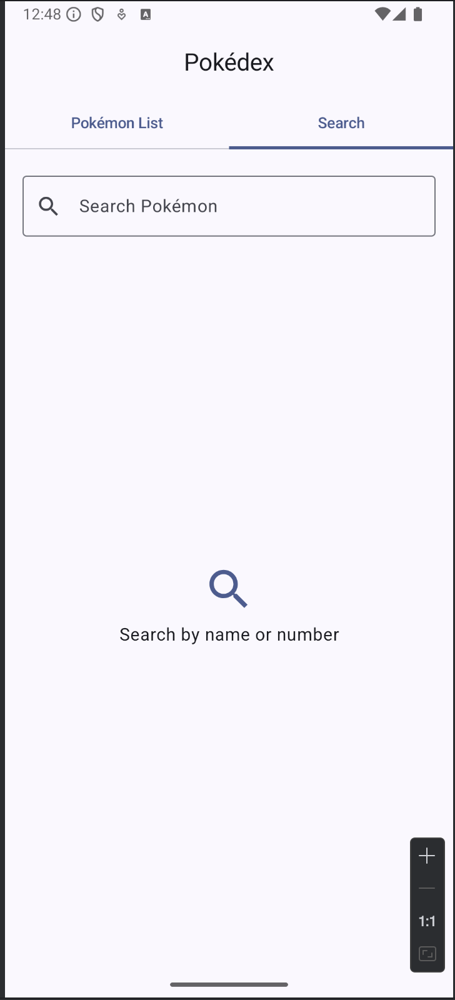
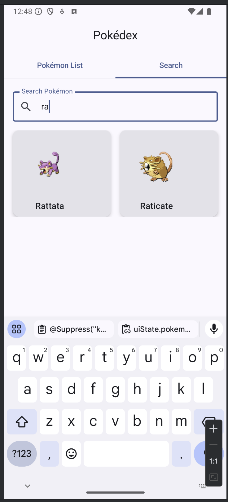

De inmediato podemos visualizar el resultado sin mucho esfuerzo, además nota que la búsqueda la podemos hacer por: nombre y número de la pokedex. Además de poder entrar al detalle del Pokemon desde el resultado.

En nuestro Pokedex habíamos limitado la cantidad de Pokemon a 20, si quieres cambiar esto abre el archivo de **PokemonApi** y modifica la variable **limit** de 20 a por ejemplo 151.

````
@GET("pokemon")
    suspend fun getPokemonList(
        @Query("limit") limit: Int = 151, //20, valor anterior
        @Query("offset") offset: Int = 0,
    ): PokemonListDto
````

Si ejecutas nuevamente la aplicación vera la primera generación completa.

Algo que podrías hacer pero no te recomiendo es cargar la totalidad de Pokemon, esto por que hay un tema de carga que tiene el API y es que estamos consultando toda el API de golpe, por lo que el tiempo de carga sería muy largo y no es el más óptimo. Esta es una de las áreas de mejora para el API y que podemos manejar de diferentes aproximaciones en nuestra app.

Si ejecutas el proyecto podrás buscar:

De momento vamos a enfocarnos en la primera generación ya que hay otras cosas que podemos explotar.

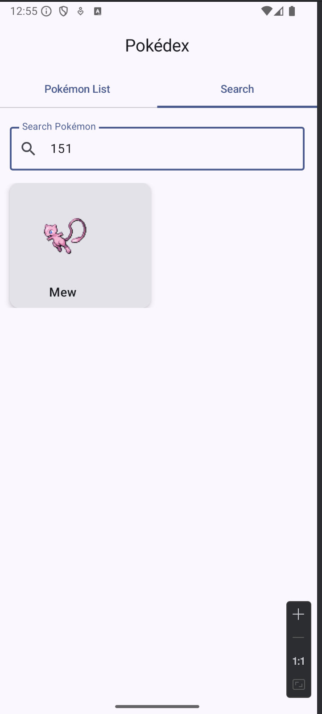

### Paso 3 Componentes de carga y error

Algo que si trabajamos en nuestros laboratorios previos fue el uso de los estados de carga y error dentro de la clase **Result**

````
sealed class Result<out T> {
    object Loading : Result<Nothing>()

    data class Success<T>(
        val data: T,
    ) : Result<T>()

    data class Error(
        val exception: Throwable,
    ) : Result<Nothing>()
}
````

Una de las cosas que podemos trabajar ahora es que al tener los estados identificados, crear componentes para cada caso que hagan más grata la experiencia de usuario.

Vamos a empezar con el estado de **Loading**. Para este vamos a crear un efecto que se conoce como **Shimmer Effect**. El Shimmer Effect es una técnica de diseño de UI que muestra una animación de "brillo" o "destello" que se mueve a través de un elemento mientras se carga el contenido real. Es ampliamente utilizado por aplicaciones como Facebook, LinkedIn o YouTube para indicar que el contenido está cargando de una manera más elegante y atractiva que un simple spinner o barra de progreso.

Crea un nuevo paquete **common** dentro de **presentation**, recuerda que el **common** que actualmente tenemos esta dentro de **domain**, queremos uno nuevo ya que los componentes que vamos a crear van a poder ser usados por cualquier vista dentro de nuestra aplicación. Dentro de **common** crea otro de **components**.

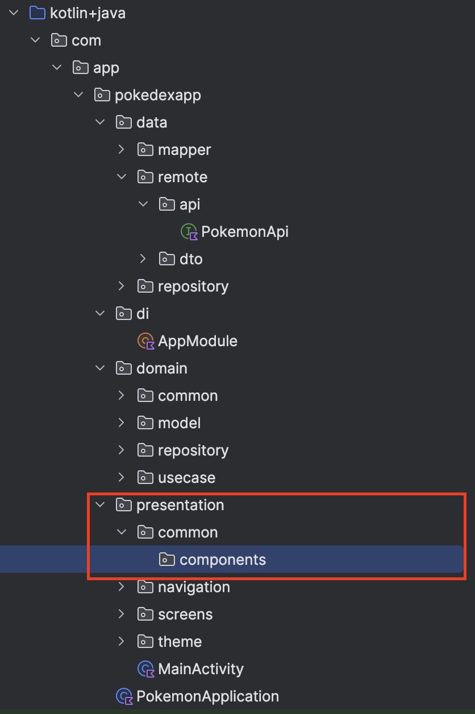

Ahora crea un archivo que llamaremos **LoadingShimmer**, el contenido será el siguiente:

````
@Suppress("ktlint:standard:function-naming")
@Composable
fun LoadingShimmer(modifier: Modifier = Modifier) {
    val shimmerColors =
        listOf(
            Color.LightGray.copy(alpha = 0.6f),
            Color.LightGray.copy(alpha = 0.2f),
            Color.LightGray.copy(alpha = 0.6f),
        )

    val transition = rememberInfiniteTransition(label = "")
    val translateAnim =
        transition.animateFloat(
            initialValue = 0f,
            targetValue = 1000f,
            animationSpec =
                infiniteRepeatable(
                    animation = tween(1000),
                    repeatMode = RepeatMode.Restart,
                ),
            label = "",
        )

    val brush =
        Brush.linearGradient(
            colors = shimmerColors,
            start = Offset.Zero,
            end = Offset(x = translateAnim.value, y = translateAnim.value),
        )

    Surface(
        modifier = modifier,
        shape = RoundedCornerShape(8.dp),
    ) {
        Spacer(
            modifier =
                Modifier
                    .fillMaxSize()
                    .background(brush),
        )
    }
}
````

Vamos a revisar el código paso a paso:

1. Los colores y la animación:

````
val shimmerColors = listOf(
    Color.LightGray.copy(alpha = 0.6f),
    Color.LightGray.copy(alpha = 0.2f),
    Color.LightGray.copy(alpha = 0.6f),
)
````

- Creamos una lista de 3 colores con diferentes opacidades que crearán el efecto de "onda" brillante
- Usamos el mismo color (gris claro) pero con diferentes niveles de transparencia (alpha)
- El gris es arbitrario, esto debido a que nuestros cards actualmente usan el gris para contener la imagen del Pokemon.

2. La animación

````
val transition = rememberInfiniteTransition(label = "")
val translateAnim = transition.animateFloat(
    initialValue = 0f,
    targetValue = 1000f,
    animationSpec = infiniteRepeatable(
        animation = tween(1000),
        repeatMode = RepeatMode.Restart,
    )
)
````

- `rememberInfiniteTransition`: Crea una transición que se repite infinitamente
- `animateFloat`: Anima un valor float desde 0 hasta 1000
- `infiniteRepeatable`: Hace que la animación se repita indefinidamente
- `tween(1000)`: Define que la animación dura 1 segundo (1000ms)

3. El gradiente:

````
val brush = Brush.linearGradient(
    colors = shimmerColors,
    start = Offset.Zero,
    end = Offset(x = translateAnim.value, y = translateAnim.value)
)
````

- Creamos un gradiente lineal usando nuestros colores
- El gradiente se mueve diagonalmente gracias a los valores animados de x e y

4. La UI

````
Surface(
    modifier = modifier,
    shape = RoundedCornerShape(8.dp),
) {
    Spacer(
        modifier = Modifier
            .fillMaxSize()
            .background(brush),
    )
}
````

- Usamos un Surface con esquinas redondeadas
- El Spacer ocupa todo el espacio disponible y muestra nuestro gradiente animado

Este componente es reutilizable y se puede usar como placeholder mientras se carga cualquier tipo de contenido. Por ejemplo:

````
// Ejemplo de uso
LoadingShimmer(
    modifier = Modifier
        .height(160.dp)
        .fillMaxWidth()
)
````

Lo interesante de este componente es que combina varios conceptos avanzados de Compose:

- Animaciones infinitas
- Gradientes
- Modificadores personalizados
- Componentes reutilizables
- Estados y efectos visuales

Vamos a probar nuestro componente, abre el archivo **PokemonListContent** y  busca donde tenemos el estado de **Loading**.

Actualmente tenemos lo siguiente:

````
isLoading -> {
                CircularProgressIndicator(
                    modifier = Modifier.align(Alignment.Center),
                )
            }
````

Sustituye el `CircularProgressIndicator`por nuestro `LoadingShimmer` de como estaba en el ejemplo de uso anterior.
````
isLoading -> {
    LazyVerticalGrid(
        columns = GridCells.Fixed(2),
        contentPadding = PaddingValues(16.dp),
        horizontalArrangement = Arrangement.spacedBy(16.dp),
        verticalArrangement = Arrangement.spacedBy(16.dp),
    ) {
        items(10) {
            LoadingShimmer(
                modifier =
                Modifier
                    .fillMaxWidth()
                    .height(160.dp),
            )
        }
    }
}
````
Ahora ejecuta la aplicación y ve la diferencia cuando se carga la lista

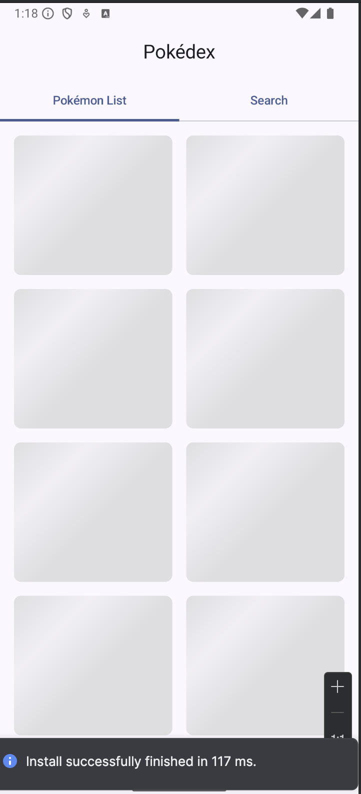

Ve como de manera sencilla agregamos un vuelco completo a nuestra UI/UX, añadiendo una animación a manera de componente y manejando nuestro estado de carga.

Ahora abre **PokemonDetailScreen** y de la misma manera sustituye el Loading anterior por el nuevo.

````
uiState.isLoading -> {
                    CircularProgressIndicator(
                        modifier = Modifier.align(Alignment.Center),
                    )
                }
````

Cámbialo por:

````
uiState.isLoading -> {
                    LoadingShimmer(
                        modifier =
                        Modifier
                            .fillMaxWidth()
                            .height(200.dp),
                    )
                }
````

Aquí modificamos el valor de altura de 160 a 200, por facilidad de visibilidad. Puedes ejecutar la aplicación para ver el cambio, solo que aquí el estado de carga es muy corto ya que ya traemos el Pokemon desde nuestra lista anterior, sin embargo no quita que debemos siempre manejar el error como buena práctica.

Ahora ya que manejamos el estado de **Loading** vamos a crear algo para el componente de **Error**, crea un nuevo archivo en **common>componentes** que se llame **ErrorView**

Este componente en esencia no tendrá nada complejo

````
@Suppress("ktlint:standard:function-naming")
@Composable
fun ErrorView(
    message: String,
    onRetry: () -> Unit,
    modifier: Modifier = Modifier,
) {
    Column(
        modifier = modifier.padding(16.dp),
        horizontalAlignment = Alignment.CenterHorizontally,
        verticalArrangement = Arrangement.Center,
    ) {
        Icon(
            imageVector = Icons.Default.Warning,
            contentDescription = null,
            modifier = Modifier.size(48.dp),
            tint = MaterialTheme.colorScheme.error,
        )

        Spacer(modifier = Modifier.height(8.dp))

        Text(
            text = message,
            style = MaterialTheme.typography.bodyLarge,
            textAlign = TextAlign.Center,
        )

        Spacer(modifier = Modifier.height(16.dp))

        Button(onClick = onRetry) {
            Text("Retry")
        }
    }
}
````

Aquí podría ser un poco más difícil ver inmediatamente cuando hay un error dado que el API esta funcionando correctamente. Para ello vamos a introducir los Previews. Debajo de nuestra función de Compose.

Los Previews permiten ver cómo se verá nuestro componente directamente en Android Studio sin necesidad de ejecutar la aplicación, lo que acelera enormemente el proceso de desarrollo de UI. Vamos a crear varios previews para el **ErrorView**:

````
@Suppress("ktlint:standard:function-naming")
@Preview(showBackground = true)
@Composable
fun ErrorViewPreview() {
    MaterialTheme {
        ErrorView(
            message = "Something went wrong",
            onRetry = { },
        )
    }
}

@Suppress("ktlint:standard:function-naming")
// Preview en modo oscuro
@Preview(
    showBackground = true,
    uiMode = Configuration.UI_MODE_NIGHT_YES,
)
@Composable
fun ErrorViewDarkPreview() {
    MaterialTheme {
        ErrorView(
            message = "Network connection failed",
            onRetry = { },
        )
    }
}

@Suppress("ktlint:standard:function-naming")
// Preview con mensaje largo
@Preview(showBackground = true, widthDp = 200)
@Composable
fun ErrorViewLongMessagePreview() {
    MaterialTheme {
        ErrorView(
            message = "A very long error message that should wrap to multiple lines to test the layout",
            onRetry = { },
        )
    }
}

@Suppress("ktlint:standard:function-naming")
// Preview con diferentes tamaños
@Preview(showBackground = true, widthDp = 400, heightDp = 200)
@Composable
fun ErrorViewWidePreview() {
    MaterialTheme {
        ErrorView(
            message = "Error in landscape mode",
            onRetry = { },
            modifier = Modifier.fillMaxSize(),
        )
    }
}
````

Algo importante de los `Previews`es que como mencionaba nos permiten visualizar algo sin necesidad de ejecutar la aplicación, para verlo basta con habilitar la vista doble dentro de Android Studio, el resultado sería algo como lo siguiente.

Para que el `Preview`funcione necesitas que el código compile bien, en caso de que no te marcará el error y deberás solucionar los problemas.

También considera que no todos los componentes de Compose pueden ser pre visualizados, por ejemplo, cuando introducimos como parámetro el viewmodel, este no puede ser generado de manera sencilla por lo que no podemos hacer ese `Preview` pero justo por esa razón es que tratamos de separar todos los componentes en sus propios archivos para que en el momento que alguno no se pueda, ya tenemos su sub componente en otro archivo.

Aspectos importantes de los Previews:

1. Anotaciones principales:

- `@Preview`: La anotación básica para crear un preview
- `showBackground`: Muestra un fondo blanco (útil para componentes transparentes)
- `widthDp`/`heightDp`: Define el tamaño del preview
- `uiMode`: Permite previsualizar en diferentes modos (como modo oscuro)

2. Parámetros adicionales útiles:

````
@Preview(
    name = "Error State", // Nombre personalizado en el panel de previews
    group = "States", // Agrupa previews relacionados
    showSystemUi = true, // Muestra decoraciones de sistema (status bar, etc)
    apiLevel = 33, // Pre visualiza en una versión específica de Android
    fontScale = 1.5f, // Prueba diferentes escalas de fuente
    locale = "es" // Prueba diferentes idiomas
)
````

3. Device Previews:

````
@Preview(device = Devices.PIXEL_4)
@Preview(device = Devices.PIXEL_TABLET)
@Composable
fun ErrorViewDevicePreviews() {
    MaterialTheme {
        ErrorView(
            message = "Error on different devices",
            onRetry = { }
        )
    }
}
````

4. Preview con diferentes estados

````
@Preview(showBackground = true)
@Composable
fun ErrorViewStatesPreview() {
    Column {
        ErrorView(
            message = "Network Error",
            onRetry = { }
        )
        Spacer(modifier = Modifier.height(16.dp))
        ErrorView(
            message = "Server Error",
            onRetry = { }
        )
    }
}
````

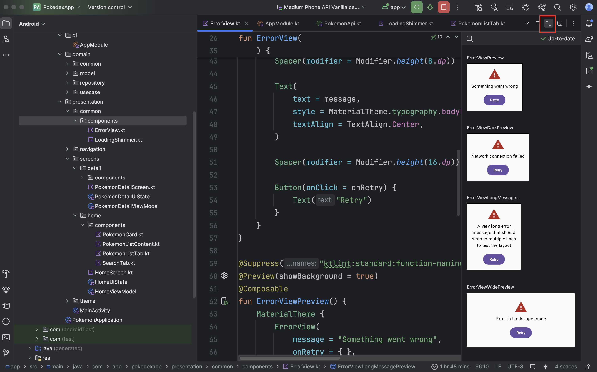

Los Previews son especialmente útiles para:

- Desarrollo rápido de UI sin necesidad de ejecutar la app
- Probar diferentes configuraciones (modo oscuro, tamaños, idiomas)
- Verificar la respuesta del diseño a diferentes condiciones
- Documentar visualmente los diferentes estados de un componente
- Facilitar el trabajo en equipo al mostrar claramente cómo se debe usar el componente

También como adicional se pueden testear para ver comportamientos específicos de las aplicaciones, y existe un beta de pruebas con screenshots el cual aunque sigue en desarrollo utiliza como base los previews para su funcionamiento.

Ahora vayamos a implementar nuestra vista de error en los casos correspondientes. Abre el archivo **PokemonDetailScreen**,
aquí tenemos nuestros estados de carga, error y éxito.

Dentro del estado de error sustituye el `Text`por nuestro nuevo componente:

````
uiState.error != null -> {
    ErrorView(
        message = uiState.error ?: "Unknown error",
        onRetry = { viewModel.getPokemon(pokemonId) },
        modifier = Modifier.align(Alignment.Center),
    )
}
````

Ahora vamos a hacer lo mismo con nuestro archivo **PokemonListTab**

````
error != null && pokemonList.isEmpty() -> {
    ErrorView(
        message = error,
        onRetry = onRetry,
        modifier = Modifier.align(Alignment.Center),
    )
}
````

Aquí nos marcará un error en el onRetry, ya que esta función no la tenemos definida, a diferencia de la de **PokemonDetailScreen** en donde llamamos directamente el viewmodel, aquí no lo tenemos disponible por lo que vamos a tener que pasarlo a un nivel superior. Para hacerlo desde los parámetros de `PokemonDetailScreen`vamos a agregar lo siguiente:

````
@Suppress("ktlint:standard:function-naming")
@Composable
fun PokemonListContent(
    pokemonList: List<Pokemon>,
    isLoading: Boolean,
    error: String?,
    onPokemonClick: (String) -> Unit,
    onRetry: () -> Unit, //Parámetro agregado
) {
    // ... Código previo sin modificar
}
````

Ahora vayamos al archivo **HomeScreen** y desde aquí agreguemos el nuevo parámetro llamando al viewmodel de la siguiente manera:

````
PokemonListContent(
    pokemonList = uiState.pokemonList,
    isLoading = uiState.isLoading,
    error = uiState.error,
    onPokemonClick = onPokemonClick,
    onRetry = { viewModel.loadPokemonList() }, //Parámetro agregado
)
````

Si te manda el siguiente error al llamar `loadPokemonList`

Cannot access 'loadPokemonList': it is private in 'HomeViewModel'

Solo basta con que modifiques la llamada eliminando el `private``

````
fun loadPokemonList() {
    // ... Código previo sin modificar
}
````

Compila la aplicación. Antes de ejecutar, retira la conexión a Internet de tu emulador o dispositivo.

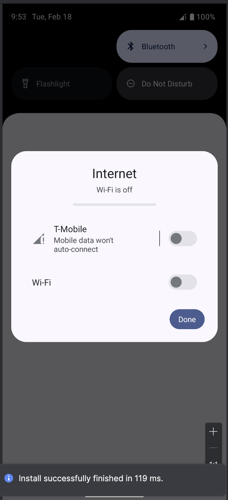

Ahora procede a instalar la aplicación, como tenemos el error de conexión a internet deberás ver lo siguiente:

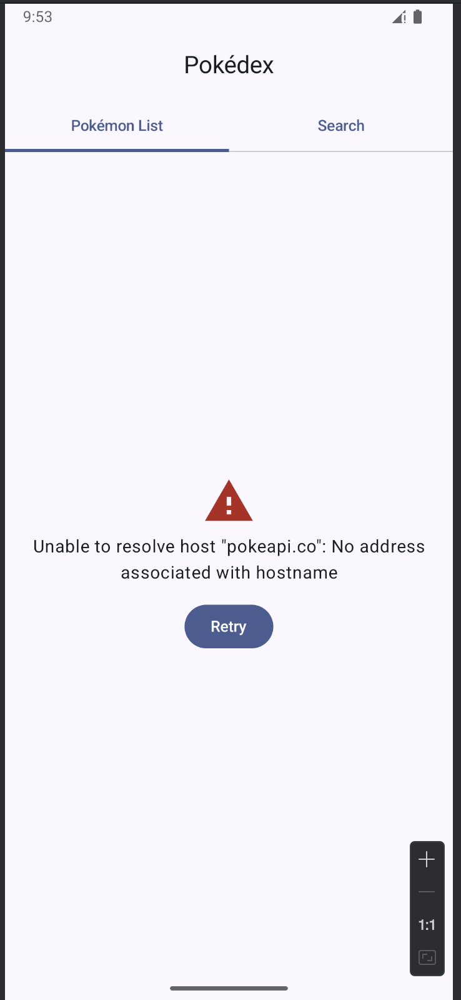

Activa el internet nuevamente y en lugar de volver a ejecutar, presiona el botón de **Retry**. La carga nuevamente deberá realizarse correctamente y dar la lista de Pokemon.

### Paso 4 Animar el PokemonCard

Ahora que hemos manejado los estados de nuestra aplicación, vamos a ver un siguiente caso que si bien no agrega algo funcional a nuestra aplicación, si le da una mejor estética a lo que ve el usuario.

Cuando seleccionas cualquier Pokemon de la lista, este te lleva al detalle, y si lo has notado el cambio es un poco abrupto, por no decirlo de otra forma el cambio es en seco de una lista al detalle.

Las aplicaciones más detalladas contienen efectos de transición y carga que hacen más agradable el cambio a los ojos.

Existen muchas maneras en que podemos abordar esto, pero una de ellas puede ser el modificar el archivo de **PokemonCard** añadiendo algunos efectos de animaciones. Abre el archivo y vamos a empezar con lo siguiente:

En primer lugar vamos a añadir un código para la detección de la selección de un elemento de la `Card`de la lista de Pokemon, lo que queremos es que se agregue el efecto al hacer clic en la `Card`, para ello, justo debajo del inicio de la función y previo a la declaración de `Card`vamos a agregar lo siguiente:

````
var isPressed by remember { mutableStateOf(false) }
val scale by animateFloatAsState(
    targetValue = if (isPressed) 0.95f else 1f,
    label = "",
)
````

La primera es una variable para detectar cuando hagamos click en la `Card`, y la segunda es para manejar una animación en Compose que crea un efecto de "presión" o "pulsación" - es decir, cuando algo se presiona, se hace ligeramente más pequeño.

- `scale`: Es un valor float que se utilizará para escalar un componente (típicamente usando Modifier.scale(scale))
- `animateFloatAsState`: Es una función de Compose que crea una animación suave entre dos valores float
- `targetValue`:
    - Cuando isPressed es true: el valor objetivo es 0.95f (95% del tamaño original)
    - Cuando isPressed es false: el valor objetivo es 1f (100% del tamaño original)

Ahora, dentro del `modifier` del `Card`, justo después del `clickable` agrega una llamada a la propiedad `scale` y a `pointerInput`, esto nos permitirá poder manejar el efecto de animación que acabamos de declarar. `scale`recibirá directamente nuestra variable declarada y `pointerInput manejara el comportamiento.

````
.scale(scale)
.pointerInput(Unit) {
    detectTapGestures(
        onPress = {
            isPressed = true  // Marca el componente como presionado
            tryAwaitRelease() // Espera de forma suspendida a que el usuario suelte
            isPressed = false // Cuando se suelta, marca como no presionado
            onClick()         // Ejecuta la acción definida
        },
    )
}
````

Este código maneja los eventos táctiles (touch events) en Compose.

- `pointerInput` es un modificador que permite manejar eventos de entrada (toques, gestos, etc.)
- `Unit` como parámetro significa que no depende de ningún valor que pueda cambiar.
- `detectTapGestures` es una función que detecta diferentes tipos de gestos táctiles
- `onPress` es uno de los callbacks disponibles (otros son onTap, onDoubleTap, onLongPress)

Lo interesante de `tryAwaitRelease()` es que:

- Es una función suspendida (coroutine)
- Espera a que el usuario levante el dedo
- Si el gesto se cancela (por ejemplo, si el usuario arrastra fuera del componente), retorna false

Este patrón es muy común para crear:

- Botones personalizados
- Elementos interactivos
- Componentes que necesitan feedback táctil
- Interfaces que responden a gestos

La combinación de `pointerInput` con la animación de escala que vimos antes crea una experiencia de usuario más rica y táctil, similar a la que encontrarías en aplicaciones nativas de alta calidad.

Ya hemos agregado una animación simple pero vistosa dentro de nuestro Card, pero aún podemos mejorar un poco la visualización.

Dentro de la propiedad **elevation** además del `defaultElevation` agrega `pressedElevation``

````
CardDefaults.cardElevation(
    defaultElevation = 4.dp,
    pressedElevation = 8.dp,
),
````

Esto añadirá sombra al `Card` al momento de hacerle presión encima.

También vamos a modificar en el **AsyncImage** y vamos a añadir la propiedad `contentScale`,ojo, esta no pertenece a Modifier, es específica de AsyncImage.

````
AsyncImage(
    model = pokemon.imageUrl,
    contentDescription = pokemon.name,
    modifier =
        Modifier
            .size(120.dp)
            .padding(8.dp),
    contentScale = ContentScale.Fit,
)
````

Por último vamos a actualizar el `Text` añadiendo las propiedades de `maxLines` y `overflow`.

````
Text(
    text = pokemon.name,
    style = MaterialTheme.typography.titleMedium,
    textAlign = TextAlign.Center,
    maxLines = 1,
    overflow = TextOverflow.Ellipsis,
)
````

- `maxLines`limita la cantidad de líneas que puede desplegar el `Text`, en este caso a 1, para que en caso que un nombre sea muy grande no vaya a desfasar el tamaño de nuestro `Card``
- `overflow`nos permite añadir un comportamiento cuando un texto es más grande de lo esperado, ya que de manera normal el texto solo se corta y no es la mejor experiencia.
- `TextOverflow.Ellipsis`es uno de los modificadores de texto definidos de android, en forma más simple si un texto se sobrepasa de la línea añade `...`para que el usuario entienda que el texto continua. 

Compila la aplicación y ejecuta nuevamente.

Observa como al seleccionar un Pokemon cambia la transición a un efecto más suavizado.

Si tienes alguna duda del código, te dejo la implementación completa de **PokemonCard**

````
@Suppress("ktlint:standard:function-naming")
@Composable
fun PokemonCard(
    pokemon: Pokemon,
    onClick: () -> Unit,
) {
    var isPressed by remember { mutableStateOf(false) }
    val scale by animateFloatAsState(
        targetValue = if (isPressed) 0.95f else 1f,
        label = "",
    )

    Card(
        modifier =
            Modifier
                .fillMaxWidth()
                .clickable(onClick = onClick)
                .scale(scale)
                .pointerInput(Unit) {
                    detectTapGestures(
                        onPress = {
                            isPressed = true
                            tryAwaitRelease()
                            isPressed = false
                            onClick()
                        },
                    )
                },
        elevation =
            CardDefaults.cardElevation(
                defaultElevation = 4.dp,
                pressedElevation = 8.dp,
            ),
    ) {
        Column(
            modifier = Modifier.padding(8.dp),
            horizontalAlignment = Alignment.CenterHorizontally,
        ) {
            AsyncImage(
                model = pokemon.imageUrl,
                contentDescription = pokemon.name,
                modifier =
                    Modifier
                        .size(120.dp)
                        .padding(8.dp),
                contentScale = ContentScale.Fit,
            )

            Text(
                text = pokemon.name,
                style = MaterialTheme.typography.titleMedium,
                textAlign = TextAlign.Center,
            )
        }
    }
}
````
### Paso 5 Pull-to-refresh

Ya hemos añadido manejo de estados, y animaciones simples. También hemos mejorado nuestra UI de visualización.

Ahora vamos a uno de los elementos más comunes de las aplicaciones hoy en día, el pull-to-refresh. 

El Pull to Refresh es un patrón de diseño de interacción muy común en aplicaciones móviles que permite a los usuarios actualizar el contenido de una pantalla tirando hacia abajo desde la parte superior y soltando.

La ventaja es que como ya hemos manejado los estados de la aplicación, hacer esta implementación es bastante simple.

Para comenzar vamos a abrir **PokemonListContent** y previo a la declaración del primer `Box`vamos a declarar lo siguiente:

````
val pullRefreshState =
    rememberPullRefreshState(
        refreshing = isLoading,
        onRefresh = onRetry,
    )
````

Y ahora dentro del modifier de `Box`agregaremos la llamada a la propiedad de `pullRefresh` que recibirá como parámetro nuestra variable declarada.

````
Box(
        modifier =
            Modifier
                .fillMaxSize()
                .pullRefresh(pullRefreshState),
    ) {
        // ... Código previo sin modificar
    }
````

Ahora notarás que el código de `rememberPullRefreshState`y de `pullRefresh` está en rojo, y peor aún no tenemos ningún import disponible. Esto se debe a que el pull to refresh no viene dentro de las librerías básicas de Material que ya tiene nuestro proyecto, está en la librería extendida, por ello vamos a tener que agregar la librería.

Abre el archivo **libs.versions.toml** y en cualquier parte de la sección de **[libraries]** agrega lo siguiente:

````
androidx-material = { module = "androidx.compose.material:material", version.ref = "material" }
````

Ahora, en el mismo archivo pero en la sección de **[versions]** agrega el número de la versión

````
material = "1.7.7"
````

Por último abre el archivo build.gradle que contiene la declaración de las librerías, el que dice **Module:App** y agrega al final de las librerías que ya tenemos la nueva:

````
dependencies{
    //... Librerías previas defaultElevation

    // Hilt
    implementation(libs.hilt.android)
    kapt(libs.hilt.compiler)
    implementation(libs.androidx.hilt.navigation.compose)
    // Retrofit
    implementation(libs.retrofit)
    implementation(libs.converter.gson)
    // Coil
    implementation(libs.coil.compose)
    // Material Pull to refresh
    implementation(libs.androidx.material)
}
````

No olvides sincronizar el gradle y regresa a **PokemonListContent**, los import ya deberían estar disponibles para que los puedas utilizar.

Ahora el `rememberPullRefreshState` puede marcarte un error, donde debes agregar lo siguiente encima de la declaración del compose como hicimos para el nombrado en ktlint

````
@OptIn(ExperimentalMaterialApi::class) //Directiva agregada
@Suppress("ktlint:standard:function-naming")
@Composable
fun PokemonListContent(...
````

`@OptIn(ExperimentalMaterialApi::class)` es una anotación en Kotlin que se utiliza para indicar explícitamente que estamos optando por usar APIs que están marcadas como experimentales en la biblioteca Material de Jetpack Compose.

Cuando vemos esta anotación, significa que:

1. Las APIs que vamos a usar están en fase experimental:

- Pueden cambiar en futuras versiones
- Pueden tener bugs o comportamientos inesperados
- No se garantiza su estabilidad


2. Se usa comúnmente en Compose para funcionalidades como:

- Pull to Refresh
- SwipeToDismiss
- BottomSheets experimentales
- Algunos componentes de Material avanzados

Es una forma de:

- Reconocer conscientemente que estamos usando APIs no estables
- Documentar que nuestro código puede necesitar actualizaciones en el futuro
- Evitar advertencias del compilador sobre el uso de APIs experimentales

Ahora antes de ejecutar nos falta algo importante, aunque ya tenemos la funcionalidad del pull-to-refresh no nos vamos a dar cuenta si se esta ejecutando correctamente, esto por que nos falta algún indicador de símbolo que nos muestre en la interfaz que efectivamente estamos haciendo un pull-to-refresh.

Para ello vamos a agregar lo siguiente al final del contenido del `Box`.

````
PullRefreshIndicator(
    refreshing = isLoading,
    state = pullRefreshState,
    modifier = Modifier.align(Alignment.TopCenter),
    scale = true,
)
````

Si ejecutas tu aplicación, intenta hacer un pull-to-refresh y verás como aparece el indicador, así como cuando llegas a cierto límite en la pantalla se ejecuta automáticamente.

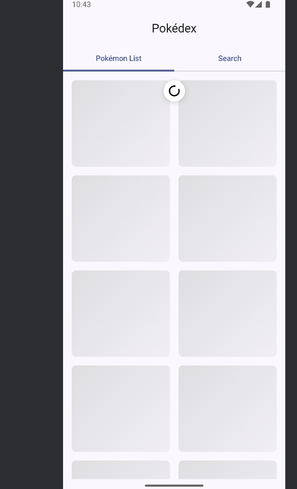

## Resumen

El Laboratorio 6: Desarrollo Avanzado y UI se enfocó en mejorar la experiencia de usuario con elementos avanzados de UI.

Componentes Implementados:

````
├── Búsqueda funcional
├── Animaciones y transiciones
├── Estados de carga (Shimmer)
├── Pull-to-refresh
└── Componentes reutilizables
````

1. Búsqueda

- SearchBar con filtrado en tiempo real

2. Efectos de Carga

- Shimmer effect
- Pull-to-refresh
- Estados de error mejorados


3. Animaciones

- Animaciones táctiles
- Feedback visual


4. UX/UI

- Componentes reutilizables
- Estados vacíos informativos
- Experiencia de usuario mejorada

Este laboratorio transformó una aplicación funcional en una experiencia de usuario pulida y profesional.