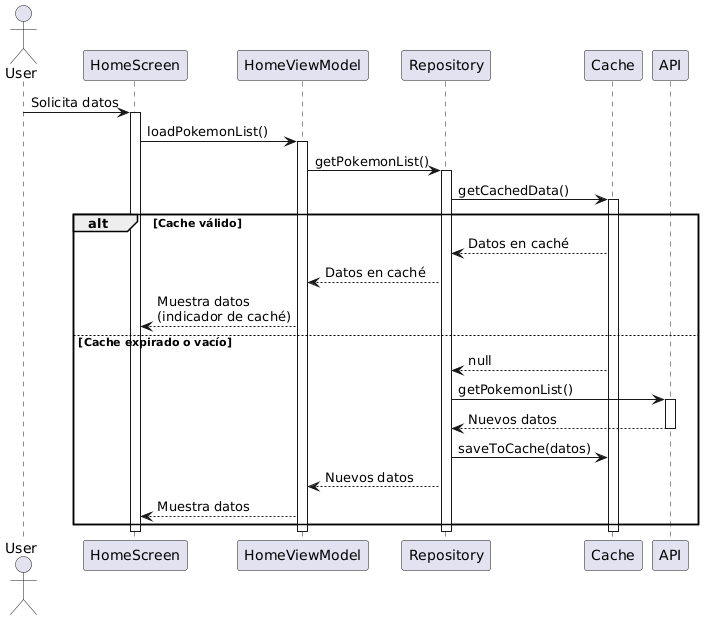
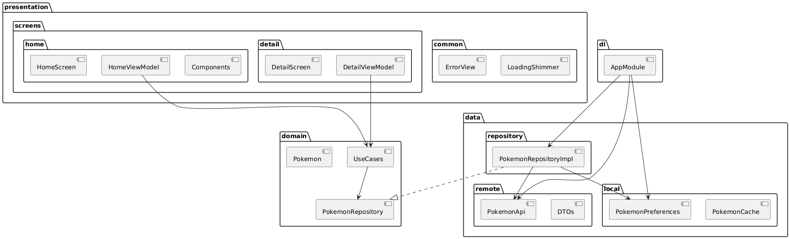
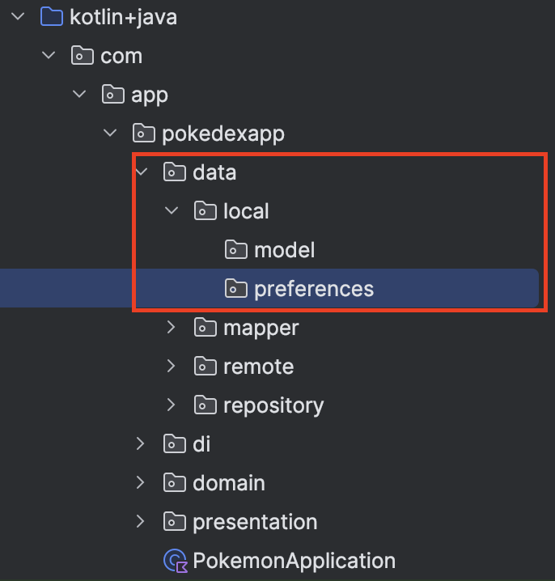

# 6 - Sistema de Cache

## Objetivo

Objetivos principales:

1. Implementar sistema de caché usando SharedPreferences
2. Mejorar rendimiento evitando llamadas innecesarias
3. Manejar estados sin conexión

## Instrucciones

Sigue los pasos descritos en la siguiente práctica, si tienes algún problema no olvides que tus profesores están para apoyarte.

## Laboratorio

### Paso 1 Entender la estructura del proyecto

En el laboratorio anterior nos enfocamos en pulir la interfaz y mejorar la experiencia de usuario, para este laboratorio nos enfocaremos en el almacenamiento local de datos no persistente. Este último laboratorio tiene muchas vertientes ya que al hablar de una fuente de datos local, podríamos hablar de un sistema de persistencia como una base de datos local, sin embargo la configuración y estructura podría ser un poco compleja para los alcances de estos laboratorios por lo que estaremos manejando datos locales que persisten solo cuando la app está abierta, es decir se almacenan en memoria RAM, a través de las variables que estamos utilizando.

Es importante mencionar que para aplicaciones de baja demanda esta es una buena opción, pero para aplicaciones de alto volumen de datos quizás no sea lo más recomendable. Para ello existen algunas opciones como Room u ObjectBox, ambas librerías que introducen bases de datos locales y con aproximaciones oficiales o de alto rendimiento.

Revisa el caso para tu aplicación, pues para incorporar estas solo requiere seguir la documentación oficial de cada una y adaptarlo al sistema de flujo de información que veremos.

La parte importante de este laboratorio es la introducción de este sistema local que permitirá a nuestro repositorio decidir entre tomar los datos locales o los datos desde internet en el API.

````
app/
├── di/
│   └── AppModule.kt                 // Actualizado con providers para caché
├── data/
│   ├── local/                       // NUEVO
│   │   ├── preferences/
│   │   │   ├── PokemonPreferences.kt    // NUEVO
│   │   │   └── PreferencesConstants.kt  // NUEVO
│   │   └── model/
│   │       └── PokemonCache.kt          // NUEVO
│   ├── remote/
│   │   ├── api/
│   │   │   └── PokemonApi.kt       // Sin cambios
│   │   └── dto/
│   │       ├── PokemonDto.kt       // Sin cambios
│   │       └── PokemonListDto.kt   // Sin cambios
│   ├── repository/
│   │   └── PokemonRepositoryImpl.kt // Actualizado con lógica de caché
│   └── mapper/
│       └── PokemonMapper.kt        // Sin cambios
├── domain/
│   ├── model/
│   │   └── Pokemon.kt             // Sin cambios
│   ├── repository/
│   │   └── PokemonRepository.kt   // Sin cambios
│   └── usecase/
│       ├── GetPokemonListUseCase.kt // Sin cambios
│       └── GetPokemonUseCase.kt    // Sin cambios
└── presentation/
    ├── MainActivity.kt            // Sin cambios
    ├── navigation/
    │   └── NavGraph.kt           // Sin cambios
    ├── screens/                   // Sin cambios en esta sección
    │   ├── home/
    │   └── detail/
    └── common/
        └── Result.kt             // Sin cambios
````

Diagrama de secuencia:


````
@startuml Cache Sequence
actor User
participant HomeScreen
participant HomeViewModel
participant Repository
participant Cache
participant API

User -> HomeScreen: Solicita datos
activate HomeScreen

HomeScreen -> HomeViewModel: loadPokemonList()
activate HomeViewModel

HomeViewModel -> Repository: getPokemonList()
activate Repository

Repository -> Cache: getCachedData()
activate Cache

alt Cache válido
    Cache --> Repository: Datos en caché
    Repository --> HomeViewModel: Datos en caché
    HomeViewModel --> HomeScreen: Muestra datos\n(indicador de caché)
else Cache expirado o vacío
    Cache --> Repository: null
    Repository -> API: getPokemonList()
    activate API
    API --> Repository: Nuevos datos
    deactivate API
    Repository -> Cache: saveToCache(datos)
    Repository --> HomeViewModel: Nuevos datos
    HomeViewModel --> HomeScreen: Muestra datos
end

deactivate Cache
deactivate Repository
deactivate HomeViewModel
deactivate HomeScreen

@enduml
````

Diagrama de paquetes:



````
@startuml Package Diagram
package "presentation" {
    package "screens" {
        package "home" {
            [HomeScreen]
            [HomeViewModel]
            [Components]
        }
        package "detail" {
            [DetailScreen]
            [DetailViewModel]
        }
    }
    package "common" {
        [ErrorView]
        [LoadingShimmer]
    }
}

package "domain" {
    [Pokemon]
    [PokemonRepository]
    [UseCases]
}

package "data" {
    package "remote" {
        [PokemonApi]
        [DTOs]
    }
    package "local" {
        [PokemonPreferences]
        [PokemonCache]
    }
    package "repository" {
        [PokemonRepositoryImpl]
    }
}

package "di" {
    [AppModule]
}

' Relaciones
[HomeViewModel] --> [UseCases]
[DetailViewModel] --> [UseCases]
[UseCases] --> [PokemonRepository]
[PokemonRepositoryImpl] ..|> [PokemonRepository]
[PokemonRepositoryImpl] --> [PokemonApi]
[PokemonRepositoryImpl] --> [PokemonPreferences]
[AppModule] --> [PokemonRepositoryImpl]
[AppModule] --> [PokemonPreferences]
[AppModule] --> [PokemonApi]

@enduml
````

Vamos a comenzar con nuestro proyecto. Abre Android Studio, desde donde nos quedamos la última vez.

### Paso 2  Configurar las constantes y el modelo de caché

Dentro de nuestro proyecto vamos a crear el nuevo ser de paquetes para el manejo local. Crea dentro del paquete **data** un paquete al que llamaremos **local** y dentro de este crea 2 nuevos paquetes **model** y **preferences**.



Ahora vamos a crear un nuevo archivo dentro del paquete **preferences** que acabamos de crear, a este lo llamaremos PreferencesConstants.

Dentro del archivo agregaremos lo siguiente:

````
object PreferencesConstants {
    const val PREF_NAME = "pokemon_preferences"
    const val KEY_POKEMON_CACHE = "pokemon_cache"
    const val KEY_LAST_UPDATE = "last_update"
    const val KEY_OFFSET = "offset"
    const val KEY_TOTAL_COUNT = "total_count"
    const val CACHE_DURATION = 5 * 60 * 1000 // 5 minutos en milisegundos
}
````

Este archivo nos permitirá guardad algunas constantes para el sistema de cache, tanto para poder identificar como los guardamos, y el tiempo de validez que tendrá la caché antes de realizar una nueva petición al API en internet.

Ahora, dentro del paquete **model** que creamos crea un nuevo archivo **PokemonCache** y agrega lo siguiente:

````
data class PokemonCache(
    val pokemonList: List<Pokemon>,
    val lastUpdate: Long,
    val offset: Int,
    val totalCount: Int
)
````

Este modelo será una similitud del que tiene la llamada a internet en el API, pero haremos nuestra propia estructura para facilitar el manejo que tendremos local.

A manera de resumen:

1. Definimos las claves para SharedPreferences
2. Establecimos el tiempo de expiración del caché
3. Definimos la estructura de datos para el caché

### Paso 3 Implementar PokemonPreferences para manejar el almacenamiento en SharedPreferences

Ahora vamos a crear un nuevo archivo **PokemonPreferences** dentro del paquete **preferences**.

````
@Singleton
class PokemonPreferences
    @Inject
    constructor(
        @ApplicationContext context: Context,
        private val gson: Gson,
    ) {
        private val prefs: SharedPreferences =
            context.getSharedPreferences(
                PreferencesConstants.PREF_NAME,
                Context.MODE_PRIVATE,
            )

        fun savePokemonList(
            pokemonList: List<Pokemon>,
            offset: Int,
            totalCount: Int,
        ) {
            prefs
                .edit()
                .putString(PreferencesConstants.KEY_POKEMON_CACHE, gson.toJson(pokemonList))
                .putLong(PreferencesConstants.KEY_LAST_UPDATE, System.currentTimeMillis())
                .putInt(PreferencesConstants.KEY_OFFSET, offset)
                .putInt(PreferencesConstants.KEY_TOTAL_COUNT, totalCount)
                .apply()
        }

        fun getPokemonCache(): PokemonCache? {
            val json = prefs.getString(PreferencesConstants.KEY_POKEMON_CACHE, null)
            val lastUpdate = prefs.getLong(PreferencesConstants.KEY_LAST_UPDATE, 0)
            val offset = prefs.getInt(PreferencesConstants.KEY_OFFSET, 0)
            val totalCount = prefs.getInt(PreferencesConstants.KEY_TOTAL_COUNT, 0)

            if (json == null) return null

            val type = object : TypeToken<List<Pokemon>>() {}.type
            val pokemonList: List<Pokemon> = gson.fromJson(json, type)

            return PokemonCache(
                pokemonList = pokemonList,
                lastUpdate = lastUpdate,
                offset = offset,
                totalCount = totalCount,
            )
        }

        fun isCacheValid(): Boolean {
            val lastUpdate = prefs.getLong(PreferencesConstants.KEY_LAST_UPDATE, 0)
            return System.currentTimeMillis() - lastUpdate < PreferencesConstants.CACHE_DURATION
        }

        fun clearCache() {
            prefs.edit().clear().apply()
        }
    }
````

Revisemos un poco este código, y hablemos de la clase **SharedPreferences** de Android.

SharedPreferences es un mecanismo de almacenamiento clave-valor en Android que permite guardar datos primitivos de manera persistente. Es como una pequeña base de datos simple.

Analogía:
Imagina una caja de zapatos donde guardas notas:

- La caja es SharedPreferences
- Cada nota tiene un título (key) y un contenido (value)
- Puedes guardar, leer y actualizar estas notas

1. Inicialización

````
private val prefs: SharedPreferences = context.getSharedPreferences(
    PreferencesConstants.PREF_NAME,  // Nombre de nuestra "caja"
    Context.MODE_PRIVATE             // Solo nuestra app puede acceder
)
````

2. Guardado de datos

````
fun savePokemonList(...) {
    prefs.edit()  // Empezamos a escribir
        .putString(KEY_POKEMON_CACHE, gson.toJson(pokemonList))  // Lista como JSON
        .putLong(KEY_LAST_UPDATE, System.currentTimeMillis())    // Timestamp
        .putInt(KEY_OFFSET, offset)                             // Números
        .apply()  // Guardamos los cambios
}
````

3. Lectura de datos

````
fun getPokemonCache(): PokemonCache? {
    // Leemos cada valor guardado
    val json = prefs.getString(KEY_POKEMON_CACHE, null)
    val lastUpdate = prefs.getLong(KEY_LAST_UPDATE, 0)
    
    // Si no hay datos, retornamos null
    if (json == null) return null

    // Convertimos el JSON de vuelta a objetos
    val pokemonList: List<Pokemon> = gson.fromJson(json, type)
    
    return PokemonCache(...)
}
````

4. Validación de caché

````
fun isCacheValid(): Boolean {
    val lastUpdate = prefs.getLong(KEY_LAST_UPDATE, 0)
    // Comprobamos si han pasado menos de 5 minutos
    return System.currentTimeMillis() - lastUpdate < CACHE_DURATION
}
````

Usos comunes de SharedPreferences:

- Guardar preferencias de usuario
- Tokens de sesión
- Configuraciones de app
- Caché pequeño de datos
- Flags de "primera vez"

Ventajas:

- Fácil de usar
- Perfecto para datos pequeños
- Persistente entre re inicios
- Rápido acceso

Desventajas:

- No para grandes cantidades de datos
- No para datos complejos
- No para consultas complejas

Ahora también revisemos algunos otros aspectos del código

1. Gson y TypeToken

````
val type = object : TypeToken<List<Pokemon>>() {}.type
val pokemonList: List<Pokemon> = gson.fromJson(json, type)
````

- Gson convierte objetos a JSON y viceversa
- TypeToken nos ayuda con tipos genéricos (como List\<Pokemon\>)
- Es necesario porque Java/Kotlin pierden información de tipos en runtime

2. `apply()` vs `commit()`

````
prefs.edit()
    .putString(KEY, value)
    .apply()  // Asíncrono

prefs.edit()
    .putString(KEY, value)
    .commit()  // Síncrono
````

- `apply()` es asíncrono y más eficiente
- `commit()` es síncrono y bloquea hasta guardar

3. Manejo de Nulos y Valores por Defecto

````
prefs.getString(KEY_POKEMON_CACHE, null)  // Valor por defecto si no existe
prefs.getLong(KEY_LAST_UPDATE, 0)        // 0 como valor por defecto
````

### Paso 4 Actualizar el PokemonRepository

Ya que hemos declarado nuestra estructura para almacenado local, ahora vamos a actualizar nuestra funcionalidad existente para poder usar el caché.

Abre el archivo **PokemonRepositoryImpl** y vamos a actualizar los parámetros de entrada agregando una nueva inyección de dependencias.

````
class PokemonRepositoryImpl
    @Inject
    constructor(
        private val api: PokemonApi,
        private val preferences: PokemonPreferences, //AGREGADO
    ) : PokemonRepository {
        //... Código previo sin actualizar
    }
````

Después vamos a sustituir el contenido de la función `getPokemonList()` por el siguiente:

````
override suspend fun getPokemonList(): List<Pokemon> {
    // Intentar obtener del caché primero
    preferences.getPokemonCache()?.let { cache ->
        if (preferences.isCacheValid()) {
            return cache.pokemonList
        }
    }

    return try {
        // Si no hay caché o expiró, obtener de la API
        val response = api.getPokemonList()
        val pokemonList =
            response.results.map { result ->
                val id =
                    result.url
                        .split("/")
                        .dropLast(1)
                        .last()
                api.getPokemon(id).toDomain()
            }

        // Guardar en caché
        preferences.savePokemonList(
            pokemonList = pokemonList,
            offset = pokemonList.size,
            totalCount = response.count,
        )

        pokemonList
    } catch (e: Exception) {
        // Si hay error, intentar usar caché aunque haya expirado
        preferences.getPokemonCache()?.let { cache ->
            return cache.pokemonList
        } ?: throw e
    }
}
````

Observa que el flujo previo cambia un poco con esta nueva inserción del caché.

1. Consultar si existen datos en caché, y en caso de existir devolverlos.
2. Si no existen los datos o el caché ya expiró en tiempo se consulta el API desde internet.
3. Como medida de protección en caso de existir algún error al llamar a internet, si existe caché devolver los datos antiguos.

Con este flujo podemos consultar información aunque no tengamos información disponible de internet y protegernos de varios errores dando más versatilidad a nuestra aplicación y dando un mejor acceso a la información.

Ahora vamos a hacer algo similar con `getPokemonById()`, sustituye el valor que teníamos de la función por el siguiente:

````
override suspend fun getPokemonById(id: String): Pokemon {
    // Intentar obtener del caché primero
    preferences.getPokemonCache()?.let { cache ->
        if (preferences.isCacheValid()) {
            cache.pokemonList.find { it.id == id }?.let { return it }
        }
    }

    return try {
        // Si no está en caché o expiró, obtener de la API
        api.getPokemon(id).toDomain()
    } catch (e: Exception) {
        // Si hay error, intentar buscar en caché aunque haya expirado
        preferences.getPokemonCache()?.let { cache ->
            cache.pokemonList.find { it.id == id }
        } ?: throw e
    }
}
````

Este método sigue la misma línea que el anterior, por eso si hiciéramos un diagrama de secuencia sería muy similar al anterior pese a toda la arquitectura que tenemos instaurada.

### Paso 5 Actualizar APPModule

Abre el archivo **AppModule** ya que nos hace falta actualizar algunos provider de la inyección de dependencias para que nuestro proyecto funcione correctamente.

Debajo del `provideRetrofit()` vamos a agregar el siguiente:

````
@Provides
@Singleton
fun provideGson(): Gson {
    return Gson()
}
````

GSON es una librería externa, recuerda que todas las librerías externas al proyecto no manejan la inyección por default y como no podemos modificarlas, esta es la forma de hacer correctamente la inyección.

Ahora debajo de `providePokemonApi()` vamos a agregar la siguiente:

````
@Provides
@Singleton
fun providePokemonPreferences(
    @ApplicationContext context: Context,
    gson: Gson
): PokemonPreferences {
    return PokemonPreferences(context, gson)
}
````

Y por último vamos a actualizar `providePokemonRepository()` a lo siguiente:

````
@Provides
@Singleton
fun providePokemonRepository(
    api: PokemonApi,
    preferences: PokemonPreferences
): PokemonRepository {
    return PokemonRepositoryImpl(api, preferences)
}
````

No necesitamos ahondar más en estos métodos, solo no olvides que esto lo hacemos para que la inyección de dependencias funcione correctamente.

Ahora intenta correr la aplicación. La primera vez funcionará de manera normal. Pero vuelve a ejecutarla por segunda vez.

Notarás como la carga casi es instantánea. Intenta hacer un pull-to-refresh y observa como estos datos se siguen actualizando de manera rápida.

Como última prueba quita el internet de tu aplicación y vuelve a ejecutarla. Deberás ver como la lista de Pokemon se carga sin ningún problema Y que toda la funcionalidad se mantiene intacta.

Algo que podrías notar es que si buscas un Pokemon que no hayas cargado inicialmente como Mew, aunque tiene su información, no carga su imagen, esto se debe a que las imágenes utilizan su propio caché a partir de la librería de Coil, si bien podríamos trabajar mejorando esto no yo te recomiendo lo dejes así, en el sentido de que por manejo de recursos del teléfono tener todas las imágenes puede llegar a consumir muchos recursos. Pero la misma librería tiene opciones para desplegar imágenes default cuando no se tiene la imagen desde la url, esto se podría manejar como más mejoras a la UI/UX de la aplicación.

## Resumen

El Laboratorio 7: Sistema de Cache implementa un mecanismo de almacenamiento local para mejorar el rendimiento y la experiencia offline.

````
data/
├── local/
│   ├── PokemonPreferences (SharedPreferences wrapper)
│   ├── PreferencesConstants (Configuración de caché)
│   └── PokemonCache (Modelo de caché)
└── repository/
    └── PokemonRepositoryImpl (Lógica de caché)
````

Funcionalidades Clave:

1. Almacenamiento Local

- Uso de SharedPreferences
- Serialización con Gson
- Manejo de datos estructurados


2. Estrategia de Caché

- Cache-First approach
- Expiración a los 5 minutos
- Fallback a API
- Respaldo en errores


3. Mejoras

- Reducción de llamadas a la API
- Soporte offline
- Mejor rendimiento
- Manejo de errores mejorado

Este laboratorio completa la aplicación agregando persistencia local y mejorando la eficiencia en el manejo de datos.

## Retrospectiva de todos los laboratorios

Ha sido un camino largo desde que comenzamos la aplicación desde 0, veamos una recapitulación breve de todo lo que hemos construido.

Retrospectiva de Laboratorios - Pokédex App
Lab 3: Interfaces en Compose

- Introducción a UI declarativa con Compose
- Estructura básica del proyecto
- Navegación entre pantallas
- Componentes UI básicos

Lab 4: Modelos y Listas

- Introducción de modelos de datos
- Implementación de listas con datos mock
- Mejora de componentes UI
- Separación de datos y presentación

Lab 5: Consumiendo APIs

- Implementación de Clean Architecture + MVVM
- Integración con PokeAPI usando Retrofit
- Inyección de dependencias con Hilt
- Estados UI y ViewModels

Lab 6: Desarrollo Avanzado y UI

- Mejoras visuales y animaciones
- Estados de carga (Shimmer)
- Pull-to-refresh
- Búsqueda funcional
- Componentes reutilizables

Lab 7: Sistema de Cache

- Implementación de almacenamiento local
- Manejo de datos offline
- Optimización de rendimiento
- Mejora en experiencia de usuario

Progresión de Aprendizaje:

````
Lab 3 (UI Básica) 
  → Lab 4 (Datos Estructurados)
    → Lab 5 (Arquitectura e Integración)
      → Lab 6 (UI Avanzada)
        → Lab 7 (Optimización)
````

Cada laboratorio construyó sobre el anterior, creando una aplicación completa y profesional.

Todavía hay área de mejora para la aplicación y retos importantes que podrías tomar en cuenta para mejorar tu aplicación.

- Cargar la Pokedex nacional completa.
- Manejo de imágenes mejorado.
- Incorporación de otras APIs de la PokeAPI como las habilidades u otras funcionalidades.
- Mejorar la búsqueda con filtros adicionales.

Te invito a que intentes por tu cuenta realizar alguno de estos retos adicionales para probar tu aprendizaje si es que consideras que ya dominas los temas que hemos visto.

También te recomiendo que si alguno de los temas aún no lo entiendes al 100, vuelvas a hacer el o los laboratorios el número de veces que sea necesario, copiar y pegar no es suficiente para entender los sub temas que vienen y que probablemente aparezcan en tu examen.

Si quieres extender tu conocimiento también y mejorar en la parte de Android te recomiendo lo siguiente:
1. Trabaja un proyecto de to-dos que permita mantener y guardar actividades ya sea de manera remota, local o ambas.
2. Crea un proyecto de calendario estilo google calendar para que manejes tiempo y si puedes considerar internacionalización para manejar usos horarios es un buen reto avanzado.
3. Crea un proyecto propio sin que sea muy grande solo por diversión o para solucionar una necesidad simple que tengas, ojo, no es para un proyecto de emprendimiento, la mayoría de las veces por querer abarcar mucho no se llega a nada, primero simple y luego lo escalas, o en su defecto si ya tienes la semilla de emprendimiento adelante, ya tienes las bases para hacer aplicaciones de nivel profesional en Android.

**Nota: No olvide que una aplicación móvil hoy en día no depende solo de Android, depende también de su infraestructura a nivel backend, por lo que también trabaja en estas áreas para que tu calidad profesional siempre sea la mejor.**