# 1.5 - Interfaces en SwiftUI

## Objetivo

En este laboratorio exploraremos la construcción de una interfaz con SwiftUI.

## Instrucciones

Sigue los pasos descritos en la siguiente práctica, si tienes algún problema no olvides que tus profesores están para apoyarte.

## Laboratorio
### Paso 1 Herramienta de trabajo

Vamos a empezar creando un proyecto desde 0, por lo que vamos a abrir Xcode y vamos a realizar las siguientes configuraciones.

%2023.32.44.png)

Después vamos a seleccionar un template de iOS tipo **App**.
%2023.48.49.png)

Los siguientes parámetros los añadiremos de la siguiente forma:
```
Name: labinterfaces
Team: None
Organization Identifier: com.example
Interface: SwiftUI
Language: Swift
```

Con esta configuración base damos clic en **Next** y dejamos que el proyecto empiece a crearse.

Para este punto del curso ya debes tener listo tu Xcode configurado En cualquier caso si necesitas configurar todavía algo no olvides revisar la sección de materiales del repositorio para ayudarte a terminar con estos pasos.

Una vez que haya finalizado de configurarse deberemos ver algo como lo siguiente:
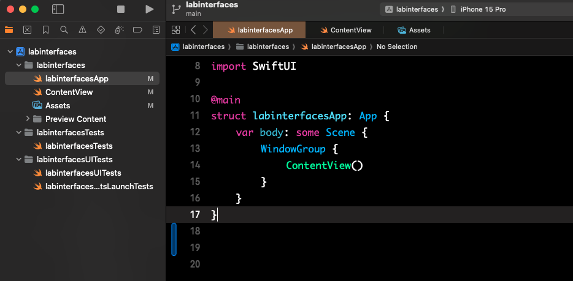

### Interfaz a construir

Por el momento no vamos a entrar en detalle en los demás archivos nuestro principal enfoque y como lo vimos en clase va a ser en el **ContentView**, que como puedes ver es el entry point de nuestra aplicación, es decir, la primer vista que va a mostrar nuestra aplicación. Da clic en el archivo ContentView para acceder a él. 

La interfaz que vamos a construir es la siguiente:

| Interfaces           | Interfaces           |
| -------------------- | -------------------- |
| 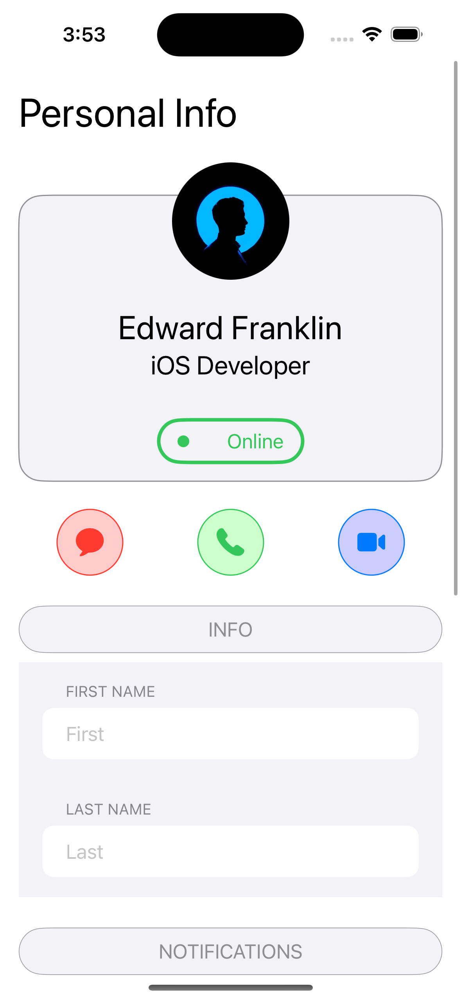 | 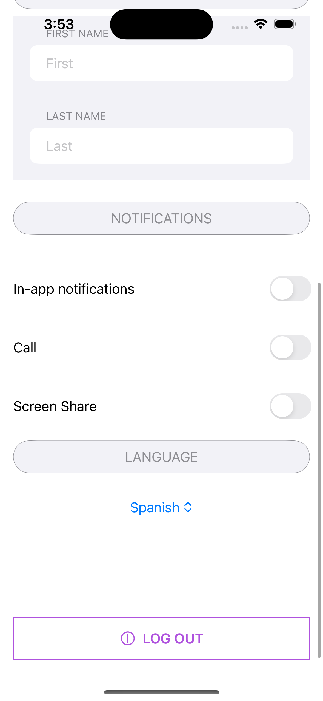 |

Como puedes ver es la vista de un perfil de usuario. En la estructura de nuestro archivo lo primero que tenemos es el import de la librería de **SwiftUI** lo que nos va a dar la posibilidad de usar todos los componentes gráficos y sus propiedades. Te invito a ver los comentarios en el código para explicarte línea a línea que es lo que se tiene.


```
import SwiftUI

/*
    En la siguiente línea tenemos el nombre de nuestra vista ContentView (no es necesario que sea igual al nombre del archivo)
*/

struct ContentView: View {
    
    /*
        El body de nuestra vista es donde van a ir todos los componentes gráficos
    */
    var body: some View {

        /*
            VStack es un contenedor para mantener los componentes gráficos ordenados de manera vertical, también existe el HStack que los acomoda de manera horizontal; es por eso que por el momento lo que ves es que la imagen se cuentra arriba del Hello World.  
        */
        VStack {

        }
    }
}
```

Por ahora vamos a agregar el primer componente que es un texto con Personal Info dentro de nuestro VStack agrega las siguientes líneas

```
/// Componente gráfico con la información a mostrar
Text("Personal Info")
    /// Tamaños default de iOS para la letra
    .font(.largeTitle)
    /* Tamaño del contenedor, es decir queremos que nuestro texto ocupe el ancho de total de su contenedor padre, y el alignment es para acomodarlo en las diferentes posiciones disponibles: izquierda (leading), derecha (trailing), centrado (center) */
    .frame(maxWidth: .infinity, alignment: .leading)
```

¿Fácil cierto? Debes ver lo siguiente en tu pantalla:

|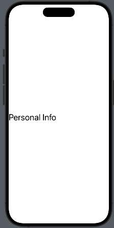

Bien, como esta muy pegado a nuestra izquierda, vamos a agregarle un padding a todo el contenedor para poder tener márgenes que permitan mantener el mismo espacio en toda la vista, independientemente de la cantidad de componentes que se agreguen. Agrega la propiedad de **padding()** al VStack, tu código queda de la siguiente manera:

```
VStack {
    Text("Personal Info")
        .font(.largeTitle)
        .frame(maxWidth: .infinity, alignment: .leading)
}.padding()
```
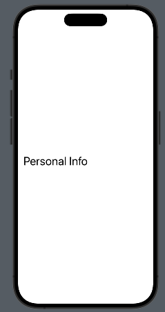

Bien, sigamos a la parte de la información del usuario. Primero que nada vamos a crear el contenedor completo con la información y después veremos como hacer el efecto de que la imagen de perfil se encuentre encima y parte de la misma fuera del contenedor. 

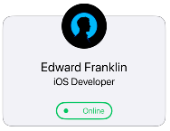

Vamos a agregar un componente que se llama GroupBox después de nuestro Text con la imgen y los textos. Para esto debes tener una imagen en tu proyecto que se llame **profile**. Te recomiendo usar la siguiente:

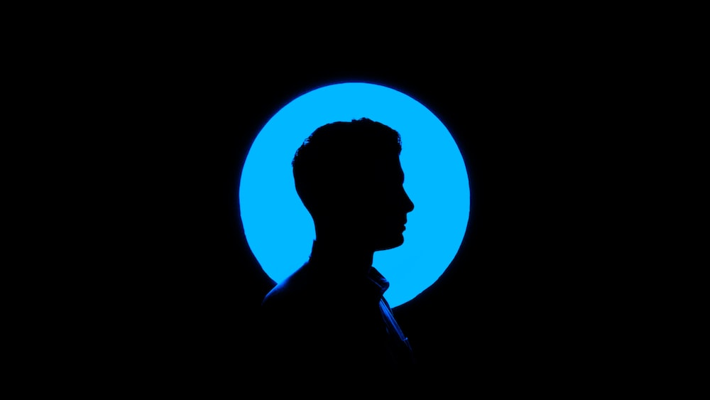

## Imagen
Te invito a ver los comentarios para ver a detalle cada una de las propiedades
```
GroupBox {
    /// Imagen del usuario
    /* "profile" es el nombre de la imagen de como está guardada en nuestros assets del proyecto */
    Image("profile")
        /// Propiedad necesaria para que podamos cambiar el tamaño de nuestra imagen
        .resizable()
        /// En analogía con css es el aspect-fit de las imágenes
        .scaledToFill()
        /// Definimos un tamaño predefinido para nuestra imagen
        .frame(width: .infinity, height: 100)
        /// Forzamos a que tenga la forma de un círculo
        .clipShape(Circle())
}                   
```
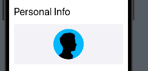

## Textos

Debajo de la imagen añade el siguiente código para establecer los textos
```
Text("Edward Franklin")
    .font(.title)
    .frame(maxWidth: .infinity)

Text("iOS Developer")
    .font(.title2)
    .frame(maxWidth: .infinity)
```

Por último vamos a ver el estado del usuario que se encuentra online. Para esto vamos a utilizar un HStack, que como te comenté acomoda los componentes gráficos de manera horizontal.

```
/* spacing propiedad que determina el espacio entre los elementos del hstack si deseas que sea diferente al default */
HStack(spacing: 0) {
    /* Componente para agrupar varios componentes que pudieramos asignarle la misma propiedad en este caso queremos que tengan el mismo espacio ambos hacia el contenedor padre */
    Group {
        /// Dibujar un círculo
        Circle()
            /// Relleno del círculo color verde
            .fill(.green)
            /// Radio del círculo
            .cornerRadius(3.0)
            /// Tamaño del círculo
            .frame(height: 10)

        /// Texto de Online
        Text("Online")
            /// Color de la letra verde
            .foregroundColor(.green)
    /// Padding de arriba y abajo 
    }.padding([.top, .bottom], 8)
        /// Padding de izquierda y derecha 
        .padding([.leading, .trailing], 16)
}
```

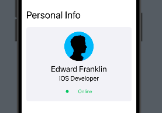

Si te fijas aún no es lo que queremos, por lo que vamos a agregarle la forma al final de nuestro0 **HStack** y de igual manera agrego un padding hacia el elemento de arriba para agregar un espacio y consigamos lo que queremos. 

```
.overlay(
    RoundedRectangle(cornerRadius: 20)
        .stroke(Color.green, lineWidth: 3)
).padding(.top, 20)
```

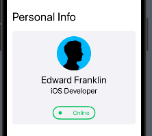

Bien ahora sí, para poder modificar nuestra imagen y que se vea arriba de nuestro contenedor, vamos a hacer el uso de un **ZStack**, que nos permite ordenar nuestros componentes en el eje z, así como el zIndex de css.

Reemplaza el tu código del GroupBox de la siguiente manera:

```
/// Añade un Zstack antes del groubox
ZStack {
    GroupBox {
        Spacer().frame(height: 80)

        Text("Edward Franklin")
            .font(.title)
            .frame(maxWidth: .infinity)
        Text("iOS Developer")
            .font(.title2)
            .frame(maxWidth: .infinity)

        HStack(spacing: 0) {
            Group {
                Circle()
                    .fill(.green)
                    .cornerRadius(3.0)
                    .frame(height: 10)

                Text("Online")
                    .foregroundColor(.green)
            }.padding([.top, .bottom], 8)
                .padding([.leading, .trailing], 16)
        }.overlay(
            RoundedRectangle(cornerRadius: 20)
                .stroke(Color.green, lineWidth: 3)
        )
        .padding(.top, 20)
    }.clipShape(RoundedRectangle(cornerSize: CGSize(width: 20, height: 10)))
    .overlay(
        RoundedRectangle(cornerRadius: 20)
            .stroke(Color.gray, lineWidth: 1)
    )
    /* Agregamos el índice de la posición del zIndex que estamos buscando, este caso 0 que va abajo de nuestra imagen */
    .zIndex(0)

    Image("profile")
        .resizable()
        .scaledToFill()
        .frame(width: 100, height: 100)
        .clipShape(Circle())
        .padding(.top, -150)
        /* Agregamos el índice de la posición del zIndex que estamos buscando, este caso 1 que va encima de nuestro GroupBox */
        .zIndex(1)
}
```

Por último agrega un Spacer entre el primer Text("Personal Info") y el ZStack para respectar un espacio entre ambos

```
Spacer().frame(height:50)
```

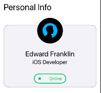

Listo! Sigamos con los botones, por como está la interfaz ya debes de poder identificar que lo primordial es utilizar un **HStack** para acomodar los 3 botones y como son muy parecidos, te dejaré el código de uno para que puedas crear los otros dos

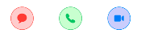

```
/// Agrega un spacer al final de tu GroupBox 
Spacer().frame(height: 24)

HStack(spacing: 64) {
    Button {
        print("Message")
    } label: {
        Image(systemName: "message.fill")
            .resizable()
            /// Color para el icono
            .tint(.red)
            .frame(width:24, height: 24)
            .padding(16)
            /// Colores RGB
            .background(Color(UIColor(red: 1, green: 0, blue: 0, alpha: 0.2)))
            .clipShape(Circle())
            /// Borde del botón
            .overlay(
                Circle()
                    .stroke(Color.red, lineWidth: 1)
            )
    }
}
```

Para los images de systemName que vienen por default en ios puedes consultar la siguiente página [SFSymbols](https://developer.apple.com/sf-symbols/)

Excelente! Ya que tienes los tres vamos a avanzar con el formulario de información
 
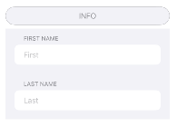

Afortunadamente, SwiftUI, ya maneja un componente de form en el que ya trae integrado un scrollview para ver la información. Agrega el siguiente código debajo del HStack de tus botones

```
Spacer().frame(height: 26)

/// Añadimos el botón como header de la sección
Button {
    print("info")
} label: {
    Text("INFO").frame(maxWidth: .infinity)
        .padding(10)
        .foregroundColor(.gray)
        .background(Color(UIColor.systemGray6))
        .overlay(
            Capsule()
                .stroke(Color(UIColor.systemGray), lineWidth: 1)
        )
}.clipShape(Capsule())
    .disabled(true)
```

Si te fijas el botón anterior es muy similar a los demás. Solamente configuramos sus propiedades para que se visualize como en la interfaz

Ahora añade el siguiente código para el formulario

```
Form(content: {
    Section(header: Text("First Name")) {
        TextField("First", text: $value)
    }

    Section(header: Text("Last Name")) {
        TextField("Last", text: $value)
    }
})
```

Por el momento te va mandar un error ya que en esta línea
```
TextField("First", text: $value)
```
Estamos utilizando **$value** que es una variable que tenemos que definir en la parte superior de nuestro código, antes del body. Lo que hace esta variable es guardar el input del usuario y actualizarlo en tiempo real.

```
struct ContentView2: View {
    @State var value = ""

    var body: some View {
        ...
    }
}
```

Bien! Lo agregamos pero no lo podemos ver porque no tenemos un scrollview y llegamos al tamaño límite de la pantalla. Ve a tu VStack principal y envuélvelo en un ScrollView

```
struct ContentView2: View {
    @State var value = ""

    var body: some View {
        ScrollView {
            VStack {
                ...
            }
        }
    }
}
```

Y así de sencillo podemos continuar con las siguientes partes de nuestra vista:

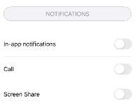

El título/botón de notificaciones ya sabes construirlo así que lo omitiré, intentalo por tu cuenta para que practiques y evita copiar y pegar.

Para la siguiente sección después del botón añade el siguiente código debajo de tu botón de Notificaciones

```
VStack(spacing: 20) {
    Spacer().frame(height: 30)

    /// Componente de switch y toggle
    Toggle(isOn: $toggleValue) {
        /// Texto del componente
        Text("In-app notifications")
    }

    /// Línea divisora entre los toggle
    Divider()

    Toggle(isOn: $toggleValue) {
        Text("Call")
    }

    /// Línea divisora entre los toggle
    Divider()

    Toggle(isOn: $toggleValue) {
        Text("Screen Share")
    }
}
```

**NOTA** Seguro no te está compilando como puedes ver aquí estamos utilizando otra variable **$toggleValue**, al igual que en el caso anterior este guarda el estado de nuestro toggle/switch; inicializa la variable tipo bool para que pueda compilar tu interfaz.

Oops! 
¿Tu formulario desapareció?, esto es porque poco a poco se va ajustando al tamaño de la pantalla. Agrega la siguiente propiedad a tu form

```
.frame(height: 200)
```

Excelente! Ya llegamos a la última parte, con todo lo que has trabajado ya deberías de poder construir el botón de language.

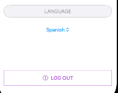

El siguiente componente es un picker, es decir, un componente para seleccionar alguna opción, agrega el siguiente código para agregarlo a tu interfaz

```
Picker(selection: $pickerValue) {
    /* Aqui van cada una de las opciones del picker con su tag respectivo, este es el valor que se va a guardar en tu picker value */ 
    Text("Spanish").tag(0)
    Text("English").tag(1)
    Text("Italian").tag(2)
} label: {
    Text("English")
}
```

Y sí si ya lo viste tienes que agregar otra variable @State en tu vista para poder almacenar la selección del picker, esta variable nombrala **pickerValue** y es de tipo int.

Por último agrega el Spacer() y el botón de Logout :) para completar tu interfaz.

....

Te dejo el código completo de la vista para que puedas comparar tu forma de construirlo y en caso de que sea diferente veas que se puede jugar con la interfaz de múltiples formas.

**NOTA Es importante que notes que el orden de las propiedas afecta el resultado de como se ve tu componente gráfico ten cuidado al utilizarlas ya que podrías entrar en conflicto con lo que quieres lograr.**

```
import SwiftUI

struct ContentView: View {
    @State var value = ""
    @State var toggleValue = false
    @State var pickerValue = 0

    var body: some View {
        ScrollView {
            VStack {
                Text("Personal Info")
                    .font(.largeTitle)
                    .frame(maxWidth: .infinity, alignment: .leading)

                Spacer().frame(height:50)

                ZStack {
                    GroupBox {
                        Spacer().frame(height: 80)

                        Text("Edward Franklin")
                            .font(.title)
                            .frame(maxWidth: .infinity)
                        Text("iOS Developer")
                            .font(.title2)
                            .frame(maxWidth: .infinity)

                        HStack(spacing: 0) {
                            Group {
                                Circle()
                                    .fill(.green)
                                    .cornerRadius(3.0)
                                    .frame(height: 10)

                                Text("Online")
                                    .foregroundColor(.green)
                            }.padding([.top, .bottom], 8)
                                .padding([.leading, .trailing], 16)
                        }.overlay(
                            RoundedRectangle(cornerRadius: 20)
                                .stroke(Color.green, lineWidth: 3)
                        )
                        .padding(.top, 20)
                    }.clipShape(RoundedRectangle(cornerSize: CGSize(width: 20, height: 10)))
                    .overlay(
                        RoundedRectangle(cornerRadius: 20)
                            .stroke(Color.gray, lineWidth: 1)
                    )
                    .zIndex(0)

                    Image("profile")
                        .resizable()
                        .scaledToFill()
                        .frame(width: 100, height: 100)
                        .clipShape(Circle())
                        .padding(.top, -150)
                        .zIndex(1)
                }

                Spacer().frame(height: 24)

                HStack(spacing: 64) {
                    Button {
                        print("Message")
                    } label: {
                        Image(systemName: "message.fill")
                            .resizable()
                            .tint(.red)
                            .frame(width:24, height: 24)
                            .padding(16)
                            .background(Color(UIColor(red: 1, green: 0, blue: 0, alpha: 0.2)))
                            .clipShape(Circle())
                            .overlay(
                                Circle()
                                    .stroke(Color.red, lineWidth: 1)
                            )
                    }

                    Button {
                        print("Telephone")
                    } label: {
                        Image(systemName: "phone.fill")
                            .resizable()
                            .tint(.green)
                            .frame(width:24, height: 24)
                            .padding(16)
                            .background(Color(UIColor(red: 0, green: 1, blue: 0, alpha: 0.2)))
                            .clipShape(Circle())
                            .overlay(
                                Circle()
                                    .stroke(Color.green, lineWidth: 1)
                            )
                    }

                    Button {
                        print("Video")
                    } label: {
                        Image(systemName: "video.fill")
                            .resizable()
                            .scaledToFit()
                            .tint(.blue)
                            .frame(width:24, height: 24)
                            .padding(16)
                            .background(Color(UIColor(red: 0, green: 0, blue: 1, alpha: 0.2)))
                            .clipShape(Circle())
                            .overlay(
                                Circle()
                                    .stroke(Color.blue, lineWidth: 1)
                            )
                    }
                }

                Spacer().frame(height: 26)

                Button {
                    print("info")
                } label: {
                    Text("INFO").frame(maxWidth: .infinity)
                        .padding(10)
                        .foregroundColor(.gray)
                        .background(Color(UIColor.systemGray6))
                        .overlay(
                            Capsule()
                                .stroke(Color(UIColor.systemGray), lineWidth: 1)
                        )
                }.clipShape(Capsule())
                    .disabled(true)

                Form(content: {
                    Section(header: Text("First Name")) {
                        TextField("First", text: $value)
                    }

                    Section(header: Text("Last Name")) {
                        TextField("Last", text: $value)
                    }
                }).frame(height: 200) // Add this after scroll

                Spacer().frame(height: 26)

                // After this add scroll

                Button {
                    print("notifications")
                } label: {
                    Text("NOTIFICATIONS").frame(maxWidth: .infinity)
                        .padding(10)
                        .foregroundColor(.gray)
                        .background(Color(UIColor.systemGray6))
                        .overlay(
                            Capsule()
                                .stroke(Color(UIColor.systemGray), lineWidth: 1)
                        )
                }.clipShape(Capsule())
                    .disabled(true)

                VStack(spacing: 20) {
                    Spacer().frame(height: 30)

                    Toggle(isOn: $toggleValue) {
                        Text("In-app notifications")
                    }

                    Divider()

                    Toggle(isOn: $toggleValue) {
                        Text("Call")
                    }

                    Divider()

                    Toggle(isOn: $toggleValue) {
                        Text("Screen Share")
                    }
                }

                Spacer().frame(height: 26)

                Button {
                    print("language")
                } label: {
                    Text("LANGUAGE").frame(maxWidth: .infinity)
                        .padding(10)
                        .foregroundColor(.gray)
                        .background(Color(UIColor.systemGray6))
                        .overlay(
                            Capsule()
                                .stroke(Color(UIColor.systemGray), lineWidth: 1)
                        )
                }.clipShape(Capsule())
                    .disabled(true)
            }
            .padding()

            Picker(selection: $pickerValue) {
                Text("Spanish").tag(0)
                Text("English").tag(1)
                Text("Italian").tag(2)
            } label: {
                Text("English")
            }
            
            Spacer().frame(height: 100)
            Button {
                print("LOG OUT")
            } label: {
                HStack(content: {
                    Image(systemName: "togglepower")
                    Text("LOG OUT").bold()
                }).foregroundColor(.purple)
            }.frame(maxWidth: .infinity)
                .padding()
                .border(Color.purple)
                .padding(16)

        }
    }
}
```